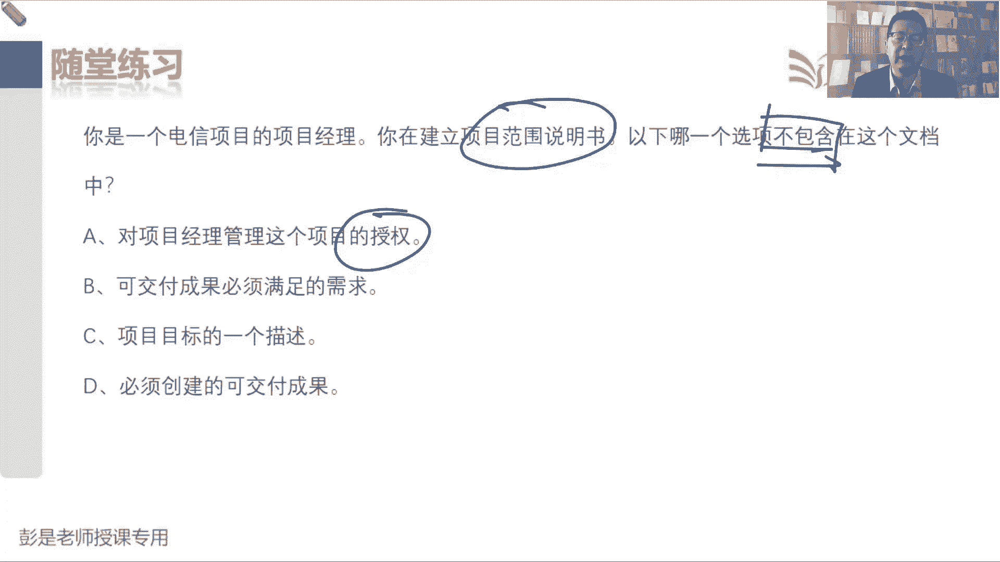

# 2024年最新版PMP考试第七版零基础一次通过项目管理认证 - P30：2.2.6 控制范围 - 慧翔天地 - BV1qC411E7Mw

最后一个管理过程也是大家学起来很快，后面复习的时候啊，也基本上可以看一遍就完事了，绩效变更，所以控制范围是看看我们范围的状态，有没有人画蛇添足啊，有没有人做项目范围之外的事情啊。

确保做且仅做范围内的事情啊，然后呢管理好变更，所以它的输入就标准的三件套，最原始的工作绩效数据，经过我们的分析，得到范围这个知识领域的工作绩效信息，然后呢交给项目经理，他就作为监控项目工作整合这一章。

这个管理过程的收入，由项目经理去写工作及调报告，另外我们要管理范围的变更，所以他会输出变更请求，所以通常来说工作模式是这样的啊，说客户提的一个新的需求，这就是变更啊，那我们要求他最好最好。

最好有一个正式的书面的请求吧，客户提了新需求之后啊，先找谁呢，先找控制范围的同事，寻找控制范围的同事啊，为什么呢，因为啊他要搞清楚啊，这个新需求对我们的范围基准，要产生什么样的变化对吧。

范围说明书要不要改呀，我们的WPS怎么改呀，WPS指点怎么改呀，他先搞清楚对范围的变更是啥，然后呢再把这个变更请求传球交给项目经理，通过项目经理开展实施整体变更控制，就这个逻辑啊。

好工作绩效报告是哪个哪个管理构成的收入啊，根本就不重要啊，爱谁谁，好那再往下就是刚才说这个逻辑，确保范围的所有变更请求，最后都交给项目经理开展实施整体变更控制，然后后面给了个定义。

说未经控制的产品或项目范围的扩大，被称为范围蔓延，也就是没有及时的对时间成本，资源质量，其他东西做出相应的调整，诶这个叫范围的蔓延，就是范围的变化失控，范围的变化失控了，还记得第一天上课给大家说的吗。

晚上原计划刷30分钟抖音，结果一不小心呐，又看了看微博，看了看了热搜，又看了看，看了看朋友圈，哎呀不断的不断的在增加范围，没有及时的及时的考虑到对其他东西的影响，就导致睡眠不足，睡眠时间不够就迟到了。

就这意思啊，所以我们要把这个范围的变化，经过我们的整体分析，综合分析考虑周全再来决定，就再回到实施整体变更控制这个知识点好，最后一分钟这个管理过程，咱把书上这段划了过去，然后呢，下午继续啊。

那他的收入其实大家复习的时候啊，真的可以不看了，知道道理就够了，现在这种具体的东西咱又不考概念，对不对，总之坚信两个原则，第一个原则确保没有人画蛇添足，那我就看看大家都干了啥活儿。

拿到原始的数据和我们的基准来做比较，这不是理想和现实做比较吗，然后看看有没有偏差，最后呢得到绩效信息，告诉项目经理，没有人画蛇添足，项目经理，你去写报告去了，另外呢我们管理好范围的各种各样的变化。

确保所有相关的范围的变更，都要交给项目经理来，由他来开展实施整体变更控制，只要牢牢记住这两个工作的重要作用对吧，它的意义，它的价值就缺乏了好，所以绩效数据啊，绩效信息的内容基本上不要求背，看一遍。

知道怎么回事就差不多了，然后输出呢就没有什么重要的东西了啊，这就是大概范围这一章比较重要的这些知识点，那上午的课程咱就先讲到这，各位同学下午吃完饭，11：30咱准时开课啊，好各位同学下午好。

咱们正式开始下午的课程，上课之前再回顾一下范围，这一章都说了什么东西，掐头去尾，首先要规划范围管理，想一想需求怎么管，怎么写范围说明书，怎么创建WBS，把这些游戏规则说清楚，便于我们开展这些工作的时候。

有指导有依据，然后呢去尾就是想一想怎么控制范围，避免大家画蛇添足，避免大家画蛇添足，不要做范围之外的事情啊，管理好范围，各种各样的变更啊，所以叫抓绩效管变更，然后最后就是核心的三四个管理过程对吧。

规划呃，收集需求，定义范围，创建WBS，收集需求是看看大家需要啥，所以需要相关方登记册，把收集到的需求记录下来，就有了需求文件，不管是项目的需求，功能需求，非功能需求，过度需求，质量需求都写进去诶。

那有了需求文件啊，再配上他的好朋友，叫需求跟踪矩阵，因为我们要把需求对应到成果来龙去脉，导致新主说清楚每个需求，它对标到我们整个项目的目的啊，目标啊，用户的业务需求是啥呀。

这样确保收集到的每个需求是有效的，有价值的，最后呢还要去分析这个需求对应哪些成果，这个成果未来的状态是啥，工作做完了测试完了检查完了之后呢，验收通过了，移交了，这样就可以有效的跟踪跟踪需求，对成果。

确保做到价值交付，那有了需求文件和跟踪矩阵之后啊，我们来根据收集到的需求规划设计我们的产品，去分析我们要完成什么样的工作，就有了范围说明书，把产品范围，项目范围，可交付成果，验收标准。

还有除外责任都写清楚，这样范围内的东西就约定清楚了，范围之外的东西我们也丑话说在前面了，有了范围说明书，接下来根据我们的范围说明书做分解，就把大工作变小工作，大成果变小成果。

最后分解到最底层的就是工作包，工作包上一级就是负责管理和控制的，就有了控制账户，那有一些方块呢近期不分解，远期再分解，就标记为规划包，就有了WBS，最后呢再写个文档去解释每个小方块，就有了WBS支点。

然后我们找领导，找关键相关方，把范围说明书WBS和词典，大家一评一评，审一审批一确认，就得到了范围基准规划范围的同事下班了，然后呢控制范围的同时啊，再加一个活儿，就是做验收确认范围。

这个管理过程是根据我们自己检查测试过的，叫核实的可交付成果，让客户让发起人对这个东西做正式的验收，验收通过呢就得到验收的可交付成果，所以这两句话也说出来，这四个管理过程应该脱口而出。

指导与管理项目工作产出可交付成果，通过控制质量，我们内部先做检查，做测试，做核实就会得到合适的成果，然后呢，再让客户和发起人通过确认范围做正式的验收，验收通过就通过，然后呢在开展结束项目或阶段。

把它变成最终产品服务成果的移交，就这个数据流好，那做一做这章的习题，看看这道题，送分题呀，刚讲完规划范围，收集需求，定义范围，创建WPS确认范围，控制范围，所以呢恭喜大家答对了，正确答案就是A。

没有这个术语哈，好慢慢上难度啊，说一个项目经理正在分析可交付成果，并把他们进一步划分为更小的，更可管理的组件，这是在执行什么东西呢，我要研发一款手机，看看分解成屏幕，手机壳，主板电池唉存储以此类推了吧。

做分解这个管理过程就叫创建WBS搞定，那对于WBS，对于工作分解结构以下哪一项不正确呢，说到知识点吧，虽然没想到啊，但是排除法根据我们目前储备的知识排除，排除排除仍然可以找到正确答案啊。

A他描述了定义范围，确认范围和管理范围变更的过程，描述这个过程到底怎么干，这是什么呢，这是范围管理计划的内容，对不对，它是范围的管理计划，这个管理过这个这个这个输出啊，它的主要作用啊，所以答案就是A。

那BCD就是对应的知识点是正确的，它包括图形化层次是列表，其中包括所有要完成的工作，这是对的吧，刚才我们见过的这种结构就是图形化的方式，那层次式的列表是什么呢，大家看看教材的目录，第一章第一小节1。1。

1，第二章第二小节哎，能说清楚层级关系，目录式的这种提纲式的也可以，那第三个知识点啊，它按照项目阶段或者是可交付成果做分解，刚才我们这个手机怎么把手机做出来呢，就变成了手机壳，二屏幕。

什么CPU存储电池，还以此类推，我们是根据成果把它分解到第二层级，再往下细分，再去分析，就要去都需要完成哪些工作，可以把这个成果做出来，那可不可以按照生命周期阶段划分呢，当然可以啦，这是手机。

我们手机设计对不对，然后研发研发，然后买零件组装，然后测试，可以按照生命周期阶段，对可交付成果做分解都可以啊，好它是范围极限的一个重要元素，基线这个词又是什么意思呢，稍稍有一丢丢印象就够了。

因为考试的时候有可能会把基准翻译成基线，就是直译和意义的区别对吧，baseline就是基准，就是极限，所以D也是对的，好看看这道题呢，这也简单吧，说项目正常，首席程序员找你说有一个工作包造成了麻烦。

没有人知道谁对这个工作包负责，也不知道啊，向哪个成本中心申请预算，甚至不清楚该完成什么工作，就是这个小方块，大家看完了之后不知道不知道相关的信息是啥，所以我们需要写一个文档去解释了吧。

来去解释每一个小方块，这就是WBS词典它的最重要的作用对吧，这个东西范围进度成本质量资源沟通风险，采购干系人相关的信息都可以往里填充的，这个鱼香肉丝大概多少钱，预算是多少。

需要达到什么样的质量标准和要求，谁负责做这个事情，谁负责做这个事情需要什么样的资源，都可以往里写啊，好这道题呢，啊这道题明显答题速度慢下来了，要思考一下对他在说什么意思，阅读阅读能力很重要的说。

你在管理一个建筑项目，要在一个现有的建筑上设计一个延伸部分，总之啊这装修这种事情呗，对不对，一个干系人坚持要求计划，不包括一个室内支撑墙，就承重墙呗，哎因为他希望巴拉巴这个信息记到哪，就是变成大白话。

就是家里装修别动承重墙，这叫什么呢，除，除外责任除外责任除外责任，什么东西在范围内，什么东西在范围外，咱把这东西约定清楚，避免引起不必要的误解，争议纠纷，他就是发霉，说明书的内容之一。

郑和咱过日子也天天可能用忘，我娘帮我收拾房间，我跟我娘说，帮我收拾房间，不要动我桌子上的东西，唉这就叫除外责任，对不对，丑话说在前面，避免引起不必要的误会，好确认范围的目标是什么呢，这个超简单吧。

确认范围，这个管理过程不是来确认项目的范围，到底对不对，它就是对我们的可交付成果进行正式的验收，所以答案是B，还要坚持选A的同学，应该就是听课的时候走神儿了，如果只靠字面意思去理解这个管理过程。

就很容易理解，理解错了啊，好，你是一个新的项目的新项目的项目经理，你希望节省WBS时间，为了做到这一点，最佳做法是啥，想省时间创建WBS怎么做，可以提高这个事情的效率，好准备了，54321。

基本上大家问题都不大，都不大哈，希望节省创建WBS的时间，怎么把WBS尽快的给他做出来呢，A通过减少可交互成果的数目，是分解更快完成，A肯定不能选，咱怎么敢擅自做主，就砍范围呢，对不对。

怎么能擅自做出调整，改变项目的范围呢，唉排除掉了，B使用以前某个项目的WBS作为模板，这是可以的吧，找历史的差不多的一个项目拿过来改一改，比如真的我们要做一个飞机。

就把刚才见过的那个飞机系统啊拿过来改一改，细化一下，就这意思吧，B是可以帮助我们提高效率，节省时间的，C肯定不能选，因为它不是知识点，那说不创建WBWBS能不能节省时间呢，真的能节省，但是它不是知识点。

所以肯定不能选，D要求发起人提供每个可交付成果的工作包，这就涉及到权利边界了，这也不能卷吧，发起人通常主要搞项目启动之前的这些事情啊，需求评估，找商业机会，然后分析项目的可行性和价值啊。

做商业论证和效益计划的制定和维护啊，项目经理负责干啥呢，咱负责完成中间这些管理这些工作的管理啊，另外呢运营不在咱们管边界之内啊，所以D肯定不行，你问发起人，发起人还想问你呢，这个就这个道理吧。

所以最后就剩下B了，好看看这道题呢，这道题需要稍稍分析一下，好答案出来了，一家电信呃，电缆网络公司的项目经理，在收集一个项目的需求，来建立一个新版本的电信设备，现在正在开展的管理过程叫收集需求。

以下哪一项不会使用，在收集需求的过程中没有工作包呢，因为有了需求文件之后，我们来设计产品，再分析要完成什么工作，再分析可交付成果都有啥东西，哎就有了范围说明书，有了范围说明书。

我们根据范围说明书做分解才能够得到工作包，所以A还没到这步呢，将要开发的工作报的具体描述，现在在收集需求，没有WBS，没有WBS词典，所以呢答案就是A，答案就这样，有些同学选D的同学。

可能就是需要帮助大家，慢慢的去训练一下阅读的能力，B肯定是吧，说会谈访谈，这是收集需求的工具，C这个电气设备早期的工作模型就是原型法，那D是什么呢，这怎么断句啊，这是有抢救的啊。

最终将使用所开发设备的团队，这是主语，就是人所需要的，这是谓语动词吧，它需要笔记本电脑，这是资源，就是老板张三跟你说，张三跟你说，让我炒菜，我需要个锅，这也是资源需求啊，它也是需求啊，对不对。

这是我们那个解决方案需求，前一段前面通常写用户需求对吧，业务需求，后面写解决方案的需求啊，好所以D仍然属于需求的一种，那它就不是答案了，要慢慢习惯这种，这种这种语句的这种表达方式啊，好看看这道题呢。

这道题选啥呢，为啥这么重要人选D啊，D肯定不能选啊，现在我们在定义范围，定义范围下一个环节才是创建WBS，所以现在还没有什么图形化的表示，对不对，没有分解呀，那现在我们在定义范围写范围。

说明书里面就包括了产品范围，项目范围，可交付成果，验收标准除外责任，所以A选项说创建一个文档，其中列出用户期望的产品特性，这排除掉了A是需求，A是需求啊，用户的需求我们不一定百分之百全都满足。

全都实现的，我们要根据用户的期望来设计产品，写清楚产品的功能，产品的特点，产品的属性哎，所以A不严谨，B单位管理范围低，限制肯定不能选，所以最后答案就是C，创建一个文档。

描述团队建立可交付成果所需要做的工作，这是项目范围，项目范围的概念就是为交互产品服务，成果需要开展大工作培训，这也是工作，对不对，好再往下这道题呢，这个简单需求跟踪矩阵干啥用的，就是牢牢记住这个成语啊。

来龙去脉，选D的同志们擦亮双眼呐，选D的同志们，你们阅读的时候需要的是耐心，踏踏实实认真看每个单词是什么东西，需求跟踪矩阵用来跟踪每个变更的来源，从而在整个控制中什么，跟踪并核实变更已经正常。

正没有这个东西吧，哎所以D排除掉了，那A不对，B不对，就是C了，确保理解每个需求的来源，这个需求是不是符合我们的业务目标，是不是符合我们项目的章程里面，这些目的目标哎，来分析这个东西的有效性。

以及这个需求，如何在以后可交付成果中得到验证，需求对成果，成果对状态谁负责开发，开发完成了没有，谁负责测试都怎么测试，测试通过了没有，谁负责验收，验收通过了没有，以此类推，这是非常非常详细的一张表。

主要的目的是想办法，最终交给用户的东西都是有价值的，有意义的，对好这道题呢，这道题简单吧，好恭喜大家答对了啊，说项目经理和发行人带着专家来检查，是否满足每一项要求，并确保所有的东西都已经完成。

这是什么呢，就是确认范围，就是确认范围不是控制范围啊，再加一个E选项，你怎么判断控制质量，如果加一个E选项，是确认范围还是控制质量呢，啊这个一定要和工作中的场景区分出来，实际工作中有没有可能邀请客户。

邀请发起人提前参与到控制质量，想这个问题啊，说我们把这个这个成成产品做出来，让人家参与我们的内部的指控，参与我们内部的测试，这是很正常的，很好的实践方法，对不对，尽早参与，及时的发现问题挺好。

但考试来说，这种场景这种场景咱不考虑考试来说，就考逻辑，考逻辑啊，所以就是内部做指控，外部做验收，考试的时候就坚定坚定抱着这个东西，就抱着这个原则，所以只要看到发起人他老人家已出马。

看到客户他老人家一出马就是确认办尾做验收，因为这是我们项目组之外的人，对不对，项目组之外的项目组里边都有谁呢，皇帝是项目经理，下边是你的核心成员，就你的管理团队什么组长啊，这种东西啊。

再往下就是我们的团队成员，这叫项目组，这是我们项目组内部的人，我们这些人负责指控，然后客户发起人，他老人家一出马就找确认范围，刚解释完的，发起人客户邀请人家提前参与内部测试，很正常的实践方法。

但考试来说，放掉这个知识点，他不是不是不是大家都达成共识的好，所以记结论，看到外部人员一出马，那就是确认范围做验收，好这道题呢，这道题就思考啊，说的那个很恶心的现象，擅自做主啊。

好所以成员之一发现如果偏离了计划，可以跳过一个可交付成果，然后呢他们做了计算，发现呢可以为顾客省钱，而且不会影响项目的产品特性，于是他们采用了这种方法，并且先斩后奏了吧，然后再通知你他们干了啥事。

所以呢ABC都不合适，最后答案就是D没有遵循控制范围过程，涉及到范围的各种各样的变化，我们先开展控制范围，然后搞清楚变什么东西，把变更请求交给项目经理，由项目经理开展实施整体变更控制综合的分析。

然后再来做决策，是否批准，否决或推迟批准之后，咱们再执行，再落实，这个，咳说再对范围做一个变更，那这个范围的变更怎么管，先找控制范围的同事啊，控制范围的同事怎么管呢，他要参考范围的管理的指导计划。

就这意思吧，他去看范围管理的指导计划，去思考这个事怎么管，所以就是控制范围的同事，参考着范围管理计划的指导，然后完成对这个范围的变更的管理工作，再把这个变更请求交给项目经理，我们在开展实施整体变更控制。

所以答案就是B，小丸子同学冲动了，冲动是魔鬼啊，索菲亚同学冲动了，robin同学冲动了，小丸子同学还继续冲动了，再看，森林同学，瀑布同学冲动了，沈月同学冲动了，这道题啊，断句很讲究的说。

我们正在创建一个文档，其中要描述描述什么内容呢，记录范围将可交付成果分解为工作包，核实所有工作都已经完成，以及管理对基线变更等过程，嘿所以是描述一大堆过程，描述一大堆过程怎么干，这叫什么呢，这叫什么呢。

范围管理计划，范围管理计划吧，但是呢没答案怎么办，范围管理计划包含在项目管理计划之中，对不对，所以呢能选的就是A了，其他选项肯定是不对的，好所以最后答案就是A，就是如何管这一大堆管理过程，就这就这行吧。

就是那个号怎么管怎么管怎么管，就这个逻辑，适用啊，学学多了，在众多选项之中找一个相对来说最合适的选项，就跟碰瓷儿，就这道理啊，碰瓷儿路上四个人看看碰谁合适，找谁最合适，好这道题大家学到的。

上午那个知识点应该还依稀有印象啊，就是项目夭折，项目异常终止，这种情况下，我们也要首先核实工作和成果的完成情况，核实核实完了确认完了之后呢，结束项目或阶段，并且呢在收尾的时候。

还要把这个项目终止的原因给它记录下来，对不对，写到报告里，给领导一个最后的交代，我们项目是一个什么情况，现在项目异常终止原因是啥，所以呢就是A，好看有成员又开始找事了，说成员找你提出一个建议。

可以让你做更多的工作，同时还能够节省15%的项目预算，你采取的最佳措施是什么啊，找选项吧，收到变更请求，我们要做正式的记录，然后综合的分析评估对项目产生的影响，最后呢做决策，最后呢拿到决策结果。

更新相关的文档资料，然后通知干起人，A肯定不能选，D肯定不能选，说完成一个成本效益分析，然后确保通知发起人，赞助人项目范围已经变更，这没道理啊，C描述考虑这个变更没有这个知识点的。

也从来没说过什么考虑考虑这话不能这么说呀，对不对，按流程来就完事了呗，所以呢比较合适的答案就是D，看到拒绝这两个字，千万不要不敢选呐，要完整的看这一句话在说什么意思，拒绝做出变更。

直到变更请求已经进入文档并完成了变更控制，所以这句话没毛病，对不对，变更记录下来，完成了变更控制，走完流程，否则我们就拒绝变更，这话没毛病啊，老外非常喜欢用这种倒装句，就是那个until这种东西。

好所以B到合适的选项就是B了，那这道题刚才好像见过了，说我想知道一个工作包给谁了，谁花钱，另外涉及到哪些工作，他所指的是下列哪一个文档呢，嘿就是WBS词典，所以答案就是C问题不大啊，最后。

说你是电信项目的项目经理，你在建立项目范围说明书，你向哪个东西不包含在这个文档之中，恭喜大家答对了，正确答案就是A啊，项目经理管理这个项目的授权，授权肯定不不写到范围，收没收敛啊，神经病啊。

这玩意写到章程里非常棒，后边呢什么目的啊，目标啊，理论上来说是可以往里写的。

不犯法好，这就是大概范围这一章的一些核心的知识点，那接下来咱给。

