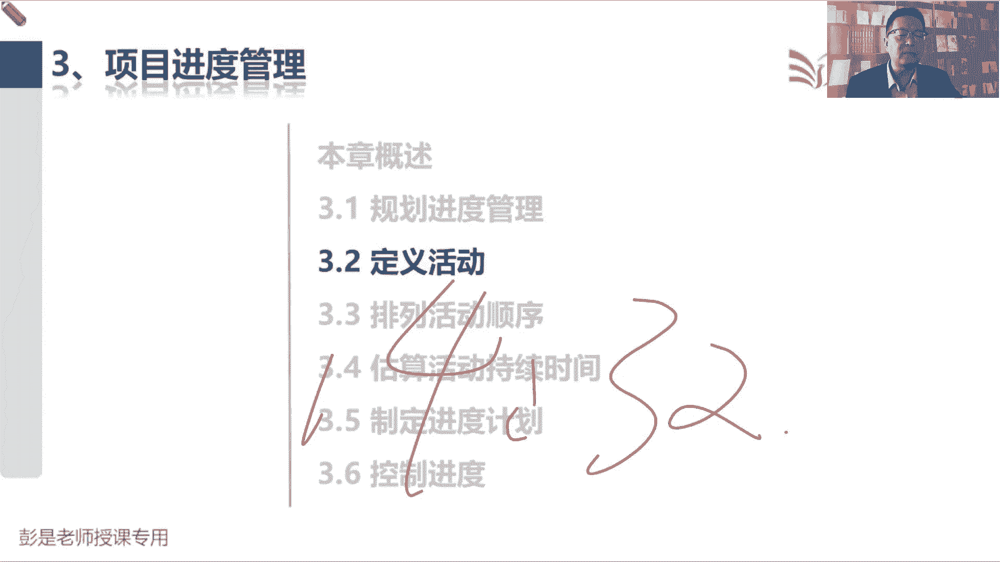

# 2024年最新版PMP考试第七版零基础一次通过项目管理认证 - P31：2.3.1 规划进度管理 - 慧翔天地 - BV1qC411E7Mw

项目的进度管理，进度管理就是大家后面复习啊，复习的时候需要花一些，多一点点时间的这么一个章节。

它的特点是什么呢，啊过程多，输入输出多，工具基数也多，这个多，这是相对的啊，其实也没有那么多，翻来覆去啊，就这点东西，那掐头去尾，规划进度管理，看看我们进度怎么管出游戏规则，然后呢控制进度。

绩效变更绩效绩效绩效数据，绩效信息变更请求我们拿到原始的工作，绩效数据，经过我们的分析变成进度相关的绩效工作情况，绩效信息，然后呢这玩意儿交给项目经理，你去写绩效报告。

另外管理好涉及到进度的各种各样的变更，把变更请求交给项目经理，掐头去尾之后，剩下四个就是这一章核心的四个管理过程，定义活动，定义活动，定义活动，这个管这个管理过程啊，他的主要工作是什么呢。

就是刚刚我们创建了WBS，然后WBS最底层的就是一个一个的工作包，接下来我们要去分析啊，这工作包这这些工作，这些工作到底怎么把它完成到，都要开展哪些具体的行动，比如说什么鸡蛋炒西红柿到底怎么炒啊。

那需要洗西红柿，然后打鸡蛋炒西红柿，炒鸡蛋放调料装盘，唉，这一系列的活动已完成，这个工作包对应的成果，就有了，这就叫活动，活动定义活动就是找到范围基准里的工作包，去分析工作包，这里面的工作怎么完成诶。

得到一个活动的列表，这个活动的列表就称之为活动清单list，活动清单，那定义了定义完活动之后啊，接下来思考的事情是什么呢，超好理解字面意思，排列活动顺序，炒一个鸡蛋，西红柿不可能先装盘，对不对。

要先洗西红柿，然后打鸡蛋，然后通常来说呢先炒鸡蛋，然后放西红柿，然后放调料再装盘了，他就是分析我们这些活动先做啥后做啥，分析这些活动的顺序逻辑关系，哎这就是这个管理过程，那先后顺序先后顺序。

虽然可以通过文字很清楚的描述出来这些顺序，但是呢不直观，所以为了让为了让大家看起来更直观，有图有真相，那咱就画图，先洗西红柿，然后呢打鸡蛋，然后呢炒鸡蛋，然后呢放西红柿，然后呢放调料，最后呢装盘。

接下来画画小箭头，告诉你先干啥后干啥，把这个先后顺序啊给你画的清清楚楚，这样看起来更直观，画出来的这张图就叫进度网络图，能够体现出这些活动之间的逻辑关系，先后顺序，这就是排列活动顺序，通过工具画图。

然后呢把它画成输出进度网络图，画出来图之后啊，下一个管理过程，看名字很难猜错的，就是估算活动持续时间，洗西红柿几分钟，打鸡蛋多长时间，炒西红柿炒鸡蛋需要多长时间，放调料多长时间。

再等多长时间就可以出锅了，哎就是分别去估算每个活动的持续时间，但是它有前提条件，它取决于什么呢，资源资源的数量水平，等级会直接影响到活动持续时间，所以仍然粗暴理解啊，会做饭的人和不会做饭的人。

炒鸡蛋西红柿所需要的时间是不一样的，火大火小也会影响这个菜成熟的时间呐，拿根火柴炒鸡蛋，西红柿和用那个灶台炒鸡蛋，西红柿所需要的时间不一样，所以资源的数量水平和等级，会直接影响这个玩意儿。

那我们就需要先跳到资源这一场，就跳到了估算活动资源这个管理过程，定义活动给出来一个活动清单之后，我们要去分析诶，完成活动需求都有哪些资源可以使用，都有哪些资源可以使用，提出我们资源相关的需求，对不对。

我需要一个什么中高级厨师，需要什么，三个鸡蛋，需要个打鸡蛋的筷子，需要两个西红柿，需要灶台，需要有明火，不能用火柴啊，这样呢我就可以确保10分钟能把鸡蛋，鸡蛋炒西红柿炒好了，所以需要先跳到资源这一章。

估算活动资源，得到活动的资源需求，有了活动的资源需求之后，我们就可以精准的估算出活动所需要的时间了，他的输出根本就不用背，这叫持续时间估算，字面意思好，那接下来万事俱备只欠东风，活动排列，活动顺序。

估算活动持续时间，估算活动资源，这些管理过程都完事之后啊，接下来我们就做进度表，进度表，这是告诉我们整个项目团队，未来什么时间做什么事，这个进度表大家就完全参考，班主任在群里发的课表就清楚了，对。

今天是3月17号，我们精讲课第三节，然后什么我也不知道，随便说了啊，3月25号精讲课第四节，4月1号精讲课第五节，什么时间做什么事，化成我们的整个项目的进度表，这个进度表一旦敲定了，所有的时间。

时间确定了，就变成了我们的进度基准，这就是第四个，第四个核心的管理过程，叫制定进度计划，好，大概知道这一章的这几个管理过程，的主要作用啊，这些来再看教材的内容，这章综述，把我们有认知的东西标一标。

一上来一上来啊，规划进度管理去死，他出进度的管理计划和规划范围与规划质量，未来都是这个逻辑嗯，他要输出当前这个知识领域的管理计划，后面呢定义活动，找到范围基准里的工作包，去分析怎么把这个工作包干出来。

所以呢得到一个列表就叫活动清单，活动清单和他的好朋友叫什么呢，叫活动属性，活动属性和活动清单之间的关系呀，和那个WBS和WBS词典的关系一模一样，活动清单就是个列表，我们要解释每一个小活动。

它其他各方面的各方面的属性特征，这个活动谁负责呀，需要什么样的资源呢，这个活动前面是什么活动啊，对你放调料之前要把西红柿倒锅里呀，装盘之前你要等一等尝一尝，看看这个菜是不是咸淡合适，是不是炒熟了。

以此类推，我们要把这些活动之间的这种逻辑关系，依赖关系，包括各种各样的什么资源呐，都给他写清楚，来解释每一个活动的这个文档就叫活动属性好，所以从现在开始，清单和属性如影随如影相随啊。

那接下来排列活动顺序，就是根据我们的活动清单去分析，先做啥后做啥画图，所以他的输出就叫进度网络图，现在PPT上这个示意就是个进度网络图啊，通常先规划进度管理，然后呢定义活动，然后呢排列活动顺序。

然后呢中间可以插播一个活动，叫估算活动资源，得到资源需求之后，我们再来估算活动持续时间，然后呢最后制定进度计划，制定进度计划定好了之后，一批准就得到了进度基准，最后呢就监控过程组控制进度哎。

就是先做啥后做啥，这就是进度网络图啊，好，那再往下第四个管理过程叫估算活动持续时间，纯粹的字面意思，他的输出也不需要去背了，就叫持续时间估算都很难猜错的，但是这个管理过程一定要有印象。

资源的数量水平等级会直接影响到持续时间，所以需要先去估算活动资源，它主要记一记输入和工具，那接下来最后就是万事俱备了，接下来我们就制定进度计划，得到整个项目的进度计划。

项目进度计划和基准之间的差别是什么呢，就是进度计划呀，是我们一厢情愿预想的一些日期基准呢，就是领导认可，领导同意，领导审批后的具体日期，我们计划第一天做什么事情，第二天做什么事情，第三天做什么事。

第四天做什么事，他还没有得到一个批准的具体日期，这就是进度计划，一旦公司说呀，10月1号开工，10月4号交付，一旦有了具体的时间要求，他就称之为进度的基准哎，这就是项目进度计划和进度基准，这两个好朋友。

最后呢控制进度稍稍有一丢丢印象就够了，这个一丢丢印象是啥呢，我们可以根据项目的实际情况做进度的预测，在监控项目的过程中，可以根据现在项目的实际情况对进度做一做，这个大家实际上生活中天天可能都在用啊。

比如说导航出门开到开到半路中，然后看看导航会提醒你前方路段拥堵，还需要什么40分钟才能到公司啊，这不就是进度预测吗，根据目前道路的实际情况，对未来多长时间能够完成项目做一个趋势分析，哎所以这是控制进度。

单独输出一个进度预测，这稍稍有一点点印象，其实就可以了好，所以其实这一章输出没太不太多输入，也没有什么需要去背的，信息量主要体现在工具上，好继续往下走了啊，看看这一章综述，说，项目进度管理为。

包括为管理项目按时完成所需的各个过程，我们花了这么多的时间精力去做这些管理过程，主要的目的是看看到底能不能按期交付，因为看看啊，根据我们的WBS，其实在实际工作中可以拍脑袋给时间了。

一个鱼香肉丝10分钟，这个宫爆鸡丁10分钟，鸡蛋炒西红柿5分钟，一拍脑袋25分钟咱就可以吃饭了，可以拍脑袋呀，但是这种拍脑袋呀可能会导致啊，他估算的结果不一定准，不一定精准的。

它取决于这个项目的规模和复杂程度，真是拍做三个菜呀，一拍脑袋给出的经验，给出的经验值就比较准了，但实际项目工作中怎么可能这么简单呢，会更复杂呀，那为了提高估算结果的这个准确度。

所以呢我们继续分解就得到了一个活动的列表，然后呢分析这些活动的先后顺序，估算这些活动的持续时间，再通过3。5制定进度计划，得出整个项目交付的工期哎，所以这样做就可以去分析，到底能不能按时完成好。

所以规划进度管理就是还是那两个单词啊，如何怎么管后边这一大堆事情，哎知道这个意思就够了，它的内容也不要求大家去背，定义活动是识别和记录未完成项目可交付成果，而需采取的具体行动的过程。

就是找到WBS最底层的工作包，分析这个工作包到底怎么把它完成，比如各位同学中午吃饭叫外卖叫外卖对吧，这是个工作包啊，怎么把这个外卖交到手呢，那就需要打开什么app，选餐厅，选菜品，交钱收餐。

嘿这一系列操作已完成，工作包对应的成果就得到了，那排列活动顺序就是先后顺序，逻辑关系，估算活动持续时间，着重就看这句话呗，根据资源估算的结果，来估算单项活动所需的时间，最后呢制定进度计划就是万事俱备。

我们有了活动，有了先后顺序，有了活动的持续时间，有了活动的资源需求，接下来万事俱备，咱就可以做进度计划了，做整个项目的进度表，进度计划就是那个schedule进度计划，一旦定好了之后。

关键相关方一批准所有的时间点，咱就得到了进度基准，所以它就叫分析排序时间，资源进度制约因素，就分析前几个管理过程的输出，然后得到我们的进度模型，进度模型是什么呢，就是做好的进度表，就是做好了进度表。

然后呢最后老板一敲定时间，我们就得到了进度基准，最后控制进度呢，这是绩效和变更搞定，那接下来看看这章的核心难点啊，核心概念这段文字呢，其实大家后面复习的时候也是看一遍，了解意思就够了，怎么看呢。

就粗暴的看看这张示意图，我们要先选方法啊，选工具，工具是啥呢，工具粗暴理解啊，大家实际工作中可能会用到一些项目管理，信息系统，比如说最标最经典的就是微软的那个project，然后各位同学。

你在工作中可能用什么once啊，TAAPD啊，什么jr缠道啊，这种东西啊，什么禅，什么什么bug z啦，这种东西，各种各样的这种这种软件当做项目管理平台，那为了便便于粗暴理解啊，excel表格也是啊。

你五一十一打算出去玩，打开excel，打开excel，这是5月1号一列，5月2号一列，5月3号一列，然后呢再去分析啊，5月1号交通坐飞机到哪到哪个地方，然后5月1号住哪儿，5月1号去哪玩。

5月2号怎么去这个地方，到哪儿住哪儿，以此类推啊，这不就是你的行程表吗，行程表不就是项目进度计划吗，所以呢这是选方法，选软件，然后呢把我们刚才得到的一大堆数据，这一堆数据都有什么呢。

前四个管理过程定义活动排列，活动顺序，估算活动资源，估算活动持续时间，把这四个管理过程的输出，敲到excel里面去，excel左边不就是活动清单吗，对切换到excel里面去，然后呢该调整的调整。

该优化的优化，最后呢就得到了我们的项目进度计划，他的表现方式，一会儿看后面书上那个例子啊，超好理解，它就包括了所有的东西清单呐，横道图啊，网络图啊，全都包括进去了，然后进度计划一旦敲定了。

所有的时间和日期就得到了进度基准，这是听一遍这个意思就可以了，前面这段文字呢记得住，记不住，其实没关系，了解了解意思就可以了啊，带场景，你就想象你现在五一要出去玩，回老家都可以啊。

打开excel定个行程表，这就是你的进度计划，好所以我们选择进度计划方法，后面我们要掌握的关键路径法，然后呢把这一大堆东西扔到软件里来，创建进度模型，进度模型最终呈现的方式就是，我们各种各样的进度表。

知道这个意思OK了，然后核心概念核心概念这段其实没什么东西，听一遍就完事了，这种话术，我们能够在任何一个知识领域都把它说出来，在小型项目之中定义活动排序，估算时间，制定模型联系非常密切。

以至于可以视为一个过程，让一个人在较短时间内完成，以此类推，在小型项目之中收集需求，定义范围，创建WBS联系密切，以至于可以可以视为一个过程，能够由一个人在较短时间内完成，所以就是裁剪天下大势。

合久必分，分久必合，太大的东西，我们就尽量的想办法把它弄小一点，这样呢可以有效的降低它的复杂程度，便于我们的管理和控制，那分解的一大堆东西太小了，怎么办呢，再合并回来呀，对不对，保持一个合适的颗粒度。

这个词听听有印象就够了啊，保持合适的颗粒度就是大小说，我张三是我的员工，我要监控他每分钟都在干什么事，我要监控他每秒钟都在干什么事，让他一秒钟一汇报，一秒钟一汇报，张三基本上就别干活了。

那我每分钟监控一下呢，太频繁了，半天监控一下可不可以呢，唉还行，一天监控一下可不可以呢，哎也还行，一年监控一下可不可，可不可以呢，就不踏实，他就太粗略了，对不对，所以要找到一个合适的合适的这个规模。

通常按天按周，按双周按月来汇报工作情况就差不多了，咳咳好，所以后面这完这段文字就不念了啊，那3。1规划进度管理，这个管理过程记得啊，复习的时候一扫而过，大概看一看进度管理计划有什么内容。

熟悉一下里面这几个比较重要的术语，就差不多了，这是要根据我们生命周期阶段划分开发方法，想一想进度到底怎么管，写一个进度管理的指导计划，那他需要定什么样的游戏规则呢，中间的输入输出输入工具没什么东西啊。

3213121，他告诉我们呀，说进度管理计划会规定后边常见的这些东西，怎么做，进度表，用excel还是用project，用zero还是用禅道，用TMBITION，还是用ones。

还是用TABD嘿把你用的工具给他说清楚，第二呢准确度，准确度定义了需要规定活动持续时间，估算的可接受区间，以及允许的应急储备数量，可接受区间又是个什么鬼呢，为了稳妥起见，卓越的人通常说话滴水不漏，18：

30左右，哎18：30左右滴水不漏啊，那这个左右啊，这个左右他不明确您到底左多少，到底右多少啊，对不对，往右30个小时也叫右啊，咱讲到明天下午啊，这不行啊，你得把它客观量化出来，对不对，太模糊了诶。

所以呢你要有一个合适的尺度吧，比如说18：30加个10分钟诶，或者是18：30提前个10分钟，哎我们规定一个大家都能接受的区间，这就是准确度，这个东西大家完全参考你公司的考勤制度，公司规定九点钟上班。

有的企业呢管理的比较严格，九点钟之前到公司就不算迟到，九点钟之后到公司就算迟到，就是说他对于迟到不可接受，那有的公司呢主打一个灵活，可能迟到个5分钟啊，不叫事儿啊，9。05之前到公司就不算迟到。

有的公司呢更灵活就弹性了吧，九点到11点到公司就可以了，诶，它体现的就是大家关于这个东西的可接受区间，这个可接受区间一会儿马上看后边啊，要变成专业术语就叫什么呢，临界，变成考试时候有可能看到的专业术语。

就叫临界值，一会一会会看到啊，这是准确度好，再往下计量单位不解释了，然后像组织连接程序这种东西，这么多年800年不考的东西，这想听就听，不想听可以忘掉它，就是咱工作中工作项目中的活动。

项目中的工作怎么可能和企业是脱节的呢，对不对，项目中的活动怎么可能和企业是脱节的呢，哎我们需要和组织企业的这些流程啊，政策啊，制度啊，挂钩啊，就这思粗暴理解啊，这都不用记的，进度模型的维护不用记。

不用记，需要记的就是这个东西控制临界值，因为后面这段话一定要这要能够理解，我们可能需要规定偏差临界值，用来监督进度绩效，他是它是需要采取某种措施前，允许出现的最大差异，公司规定九点钟上班。

说迟到5分钟以内不需要采取任何措施，不算迟到，超过5分钟才需要采取措施，因为大家实际工作中进度不可能可丁可卯，通常大部分工作对吧，多一分钟少一分钟没关系啊，他应该允许有一定的浮动，具体情况具体分析啊。

就像一些高精尖的项目，它允许偏差的范围一定很紧，比如说火箭发射，这两天新建吧，火箭发射，那差一秒差很多事呢，差着行情的吧，人家一小时漂好几万公里啊，对不对，速度非常快呀，那不能我们要精确度。

精确度精确到毫秒，所以其实准确度还有他的好朋友叫什么呢，除了准确度，还有一个单词叫精确度，精确度就是精度的要求，大家日常工作中啊，精确到天可能就差不多了，那我们发射火箭呢，精确到秒可能都不行。

我们需要精确到毫秒，对不对，你差个一毫秒可能都不行啊，差个一毫秒都不行，我们需要百分之百准确哎，这制造业的同学，你们应该肯定知道这个东西吧，生产出来的零配件，生产出来的零配件能不能差什么，一厘米。

一毫米还是需要做到丝毫不差，具体情况具体分析，取决于这个项目的要求哎，精度公差这种东西啊，这了解就够了啊，所以其实不管是时间呐，成本呐，质量啊，它都是可以数字化的东西，数字化的东西呢。

那我们就可以提出精度的要求和准度的要求，有波动啊，有波动说明网络听课听累了，听累了，他可能想休息，所以呢咱讲完这一小段，咱休息一下啊，大概这几个单词有印象就够了啊，一个是精度，精确度的要求。

一个是准确度的要求，准确度呢就是允许偏差的范围，精度呢就是计量单位的要求，就粗暴的理解一下，那准确度就对标到这个控制临界值，然后绩效测量规则，绩效测量规则现在基本上也不考，这想听就听，不想可以不看了。

不看了啊，太细了，然后再往下搞定3。1，所以其实听完了之后呢，大概对几个单词有印象，准确度，精确度，控制临界值，我们对项目提出精度的要求，然后呢再提出一个可接受的区间，最后就变成了那个控制临界值好。

那各位同学来休息一下，语音画面卡一下呀，卡一下，不知道是不是小额通的锅呀，所以呢一会儿课间休息的时候，我会把小额通推一下，课间休息的时候啊，我会把小额通退出一下，然后呢我再重新进来，重新开始直播。

所以呢各位同学遇到事情不要慌不要慌，不跑啊，咱还接着上课呢，还继续上课，继续上课，我只是临时退一下，看看是不是软件的锅，所以咱休息几分钟呢，休息8分钟时间休息到14。32。

