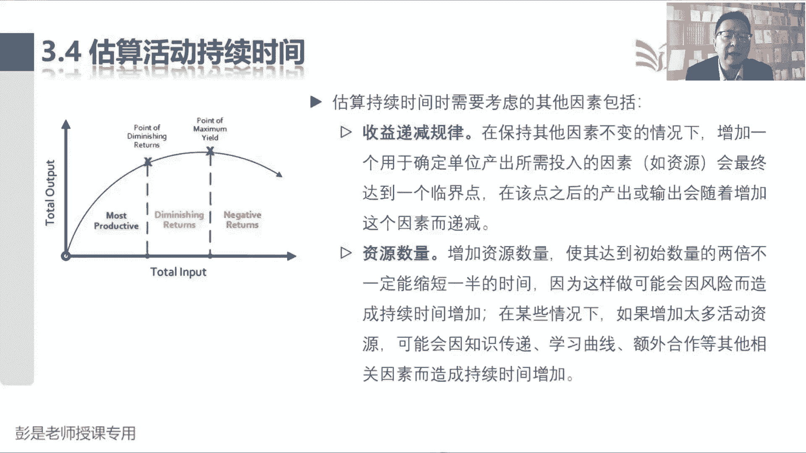
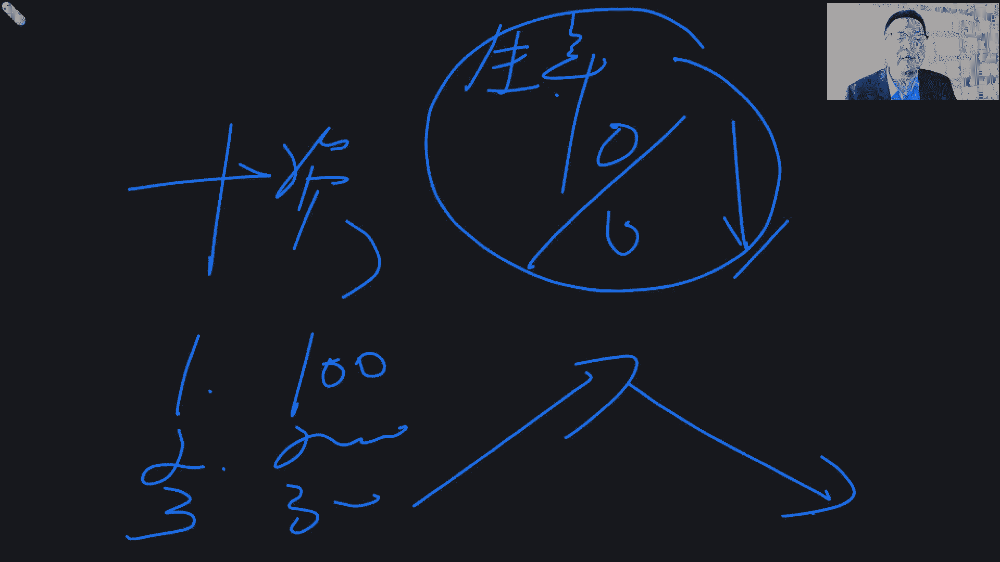
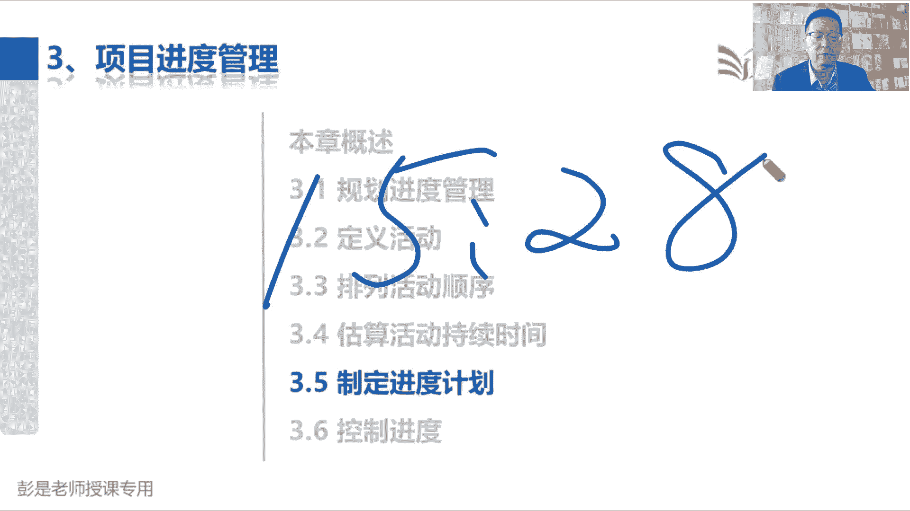

# 2024年最新版PMP考试第七版零基础一次通过项目管理认证 - P34：2.3.4 估算活动持续时间 - 慧翔天地 - BV1qC411E7Mw

那3。4估算活动持续时间，这个管理过程仍然有一丢丢工具基础，需要大家有印象，说估算活动持续时间是根据资源估算的结果，他的收入就带了一大堆叫资源的东西，资源分解结构资源智力资源需求，资源需求好理解。

我需要锅碗瓢盆，需要柴米油盐，酱醋茶，需要除湿才能把这个席做好啊，资源日历是什么东西呢，这个单词需要大家掌握的资源分解结构，后面再说，资源日历，资源日历，各位同学，你看综艺的时候。

有没有看到明星说到这个东西啊，档期，上个综艺，看看人家有没有时间，对不对，看看人家什么时间有空，什么时间没空，诶，它体现的是这个人有空没空，就是资源的可用性，就是资源的可用性，下周某企业打算说。

能不能来我们企业讲讲实战课呀，我看看我的排期，哎呀抱歉，下周有安排了，没时间了，咱能不能能不能五一之后啊，那个那个那个时候有空啊，诶所以我们可能根据资源的可用性，根据资源的可用性。

可能会调整我们的进度计划，可能会调整我们的持续时间，以此类推的吧，所以资源日历在整个进度这一章，其实理论上来说贯穿始终，就这样粗暴剂，它体现的就是资源的可用性，所以他其实啊在生活中有很多很多的表现形式。

比如各位同学想一想啊，你可能五一啊，清明啊，像什么回老家呀，出去旅游啊，买火车票，飞机票能不能体现出这个资源的可用性呢，我5月1号当天打算坐飞机去上海，看看还有没有票，还有没有，不就是可用不可用吗。

对不对，还就这东西好知道这个意思啊，那输出不用记持续时间估算，这很难猜错的，考试也不大会考说他有什么输出，那那个估算估算依据听一耳朵就够了啊，估算依据是想告诉我们一个什么道理呢，做事情有依据。

做事情有依据诶，这个活儿需要几天，这个结论是怎么得出来的，咱要给人家说清楚吧，是你拍脑袋想猜出来的，蒙出来的，还是说我们参考了以前的以前的工作绩效，参考了以前的历史信息，然后经过了什么样的算法。

得出来这个估算的结论，它体现的是做事情有依据，客观性，客观性，以此类推的话，明天来上海讲课吧，你几点几点能到啊，我说飞机啊，九点钟起飞，12点到12点到，为什么呢，根据历史记录。

app上显示了这个航班延误的概率多少多少多少，通常延误10分钟，唉，这体现做事情有依据，这个结论啊，这个有印象就可以了，因为这个管理过程你只要吃透了啊，未来我们看到估算活动资源，看到估算活动成本。

这三个管理过程基本上差不多，基本上差不多算时间，算资源，算成本，它的工具啊，输出啊基本上是一样的，都用到了这一堆东西，然后等都要有一个估算的结果，除了估算结果呀，都要有一个客观能够证明这个东西客观性。

真实性的估算依据，它差不多的好，那再看中间的工具，先给大家大概说一说，听一听类比估算和参数估算，一对好朋友，他俩的主要区别是什么呢，都要参考历史信息，包括三点估算，都要参考历史信息啊。

类比估算就是直接出结果，参数估算呢，就是需要经过计算才能得到估算结果，就这个区别，所以啊比如说他就说，什么叫什么叫直接出结果，什么叫经过计算出结果啊，就像各位同学随便举场景了啊，算时间算钱。

他的方法是一样的，上一次我们吃席啊，一桌100块钱，这次吃席我觉得差不多，这就是类比估算，参考了历史信息，直接给出来估算结果，上次从家到公司一个小时，今天我觉得差不多也是一个小时，直接参考历史信息。

一拍脑袋差不多的事情给个结论，哎这就叫类比，那什么是参数呢，参数啊，就是参考了某一个参数，某一个变量用公式，用模型，用统计方法，噼里啪啦一顿计算才能够得到估算结果，上一次实习啊，人均消费100块钱。

咱今天看一看多少个人给出一个估算结果，这就叫参数了，人均消费再乘以人数，噼里啪啦一顿计算得到的结果就叫参数估算好，以此类推啊，对对，上次从家到公司一个小时，这是这是今天我觉得差不多。

这是类比估算上次从家到公司啊，一个小时，我这个车能开多少公里，咱算一算一共多少公里，然后一除给你算出来这个时间，这就叫参数，所以它俩的区别就是有没有经过计算，有没有经过计算。

统计公式模型都是经过计算的啊，好那再往下三点估算是干什么事了吧，这是3。3。3点，他要找三个数字叫最乐观，最悲观，还有最可能最乐观就是最小值，最悲观就是最大值，最可能就是中间值，如果能让大家每天上班。

每天上班，这个通勤的时间如果不稳定，有时候快，有时候慢，诶，他不稳定不稳定就意味着风险，在这种有风险的条件下，我们去估算时间，就有不同的算法参数，估算不不是背到背到背到贝塔分布和三角分布。

这后面讲三点估算的时候再在学啊，此时看到有风险存在着不确定性的情况下，我们用三点估算，尽可能地取多个数量数值啊，好那自下而上主要是干什么用的呢，自下而上，自下而上，这是当前估算结果。

如果觉得没把握没把握，高大上的术语叫什么呢，叫不可信，可信度不高，怎么办呢，继续分解，继续分解，所以仍然粗暴举例子啊，炒一个鸡蛋，西红柿一拍脑袋10分钟，哎呀，10分钟能炒完吗，没准啊，怎么办啊。

再分解分解成更细的活动啊，什么西西西红柿打鸡蛋，咱们炒鸡蛋，炒西红柿，放调料装盘，分解成更小的活动，再继续估算，估算完了再汇总回来，这就是自下而上这种估算方法，如果觉得估算结果还不可信，再继续细化。

诶他这个道理耳熟不耳熟呢，所以看看PPT2整个项目管理，目前我们学到的体系的目的，就是为了提高估算结果的准确性，可靠性啊，虽然在制定项目章程的时候，有一些总体的工期要求，总体的预算要求。

但是呢不一定准啊，所以我们收集需求定义范围，创建WBS，有了WBS之后啊，理论上来说，并且很多项目组就是这样的，一拍脑袋算一算这个包多长时间，这个工作包需要多长时间。

可以给出关于工期和成本的一个估算结果，但是仍然没把握，不可信怎么办呢，定义活动，定义活动就做了进一步的分解吧，又分解成一大堆的活动清单，然后呢我们估算资源时间成本，这种情况下给出来整个项目的工期。

整个项目的预算相对来说诶就有把握了，那如果现在我们得到的活动的持续时间，这个结果呀还觉得没把握怎么办呢，再分解，所以天下大事合久必分，分解了分久必合，通常来说我们从上往下不断的去分解，不断的去细化。

这不就是不断的去分解，不断的去细化，可以提高我们的控制力度，便于我们管理和控制，所以通常来说从上往下做分解，分解完了之后呢，再从下往上做汇总，做核实，做确认好，这就是自下而上，大概听一听这个道理啊。

考试超简单的，没这么复杂，考试你只要看到一拍脑袋参考历史信息，这就叫类比估算，看到噼里啪啦，经过计算得到的估算结果就叫参数，看到说这个这个东西啊，找到最小值，最大值什么，最可能它不它只有三个数字。

那就找三点估算呗，看到考试说关于这个估算结果，觉得没把握不可信，那怎么办呢，优先考虑自下而上做进一步的分解，再汇总回来，这是这四个玩意儿超级重要的东西啊，好那再往下备选方案分析。

感知到了决策会议没有新的知识点，又来了个新朋友叫储备分析，储备分析，实际上大家工作中生活中也在用，看到这个玩意儿随便收，场景储备分析，储备分析就是分析需要额外准备一些时间，额外准备一些钱。

这就叫储备储备的目的是干嘛呢，应对风险，所以呢通常关于风险分成两种两种啊，一种叫已知风险，一种叫未知风险，所以太场景了，从家到公司，从家到公司，我用类比估算一拍脑袋大概需要一个小时，那我明天八点钟出门。

九点钟就能到公司了，那万一明天九点钟啊，老板找我开会，我不能迟到啊，接下来我要考考虑风险了对吧，这个收费站可能会堵车，也可能不堵车，还这是一个已知风险，到了公司楼下呀，那个等电梯可能等3分钟。

可能等5分钟，人多呢就多等一会，人少呢可能就上去了，这也是风险，因为它存在着不确定因素啊，那这些对我来说都叫已知的风险，我准备个15分钟，再提前15分钟出门，这样的可能迟到的概率就降下去了。

但万一啊路上还会发生一些意外啊，意想不到的东西就称之为未知风险，没有认知的东西，对不对，也有可能外星人攻打地球了，也可能什么天灾人祸啊，这没有认知啊，不知道会发生啥，不知道会发生啥，为了稳妥起见。

再提前10分钟出门，再多准备个10分钟用在路上，第二这个10分钟就叫管理储备，好所以储备分析四个单词，我们考虑到有没有有没有已经有认知的风险，需要对应准备好一些应急储备嗯，定级。

然后啊还要考虑有没有一些未知的风险，我们要考虑准备一些管理储备，就是没有认知的意外，纯意外这种东西啊，这就是储备分析分析的对象，分析我们需要准备多少，付多少储备去分析我们需要准备多少储备。

有没有一些一些有认知的风险准备应急储备，有没有没有认知的风险，如果有存在着极大的不确定性，那要考虑准备一些管理储备好大概这几个工具，类比参数三点，自下而上和储备分析，这是需要大家掌握的五个工具。

这个管理过程就下班了好，所以看后面的文字啊，嗯文字里边那些虽然看起来字多，不要慌不要慌，还有月亮，对不对，所以各位同学听一遍听一遍，知道怎么回事就差不多了，那接下来说估算活动持续时间，依据的信息。

包括工作范围，资源的类型，技能的水平数量和资源日历，总之涉及到资源的方方面面，都会影响到我们的持续时间，参考做菜那个场景，三个人五个人工期不一样，三个西红柿，五个西红柿，工期不一样，能理解吧。

火大火小工期不一样，会做饭不会做饭，工期不一样，总之占到资源的方方面面，都会影响到我们这个活动的干活的时间好，直到第一个结论就够了啊，然后第二个重要的理念，非常重要的原则。

应该由团队中最熟悉具体活动的个人和小组，提供持续时间，估算所需的各种收入，这样可以导致什么呢，提高估算的准确性，所以变成大白话，就是谁干活，谁给出的估算结果就比较准，我不会炒鸡蛋，西红柿。

我说大概10分钟能做完，这是吹牛，想当然对不对，谁会做饭谁清楚啊，谁会做饭谁清楚，并且呢随着资源的变化，三个西红柿，五个西红柿，八个鸡蛋火大火小，对不对，哎随着这些资源的变化，他给出的估算结果。

只要他有足够的经验，给出的估算结果呀就可信了，如果没经验呢就不可信，所以最高原则就出来了，我们希望成员能够参与到我们计划编制的过程，成员参与计划的制定，可以提高我们所有计划的可行性，因为谁干活谁清楚。

非常重要的理念就出来了啊，好这是这一段两个知识点，那再往下说，我们应该估算数量，然后结合这就不念了，刚才说过了，后面这两句听一听就可以了，说预计资源数量和什么同意影响持续时间，对资源数量的多少，会做饭。

不会做饭，会影响到持续时间，但不一定是简单的直线或线性关系，就是它不一定是这样的，为什么呢，一会儿马上会说的啊，有时候因为工作的特性，无论资源分配如何，都需要花一定的时间才能够完成工作。

比如24小时的应力测试，你不管投入什么水平的资源，投入多少资源，都要坐满这么长时间，都要做完这么长时间了，诶这意思啊，所以它和资源的数量水平等级可能没有关系，这个大家生活中能想到什么场景，比如说。

小猫猫三狗四啊，小猫猫猫咪三个月才能生小猫，两只小猫有没有可能一个半月呢，不可能，这就是客观限制工作的性质决定的好，都听一听，现在太细了，那再往下就是又是大道理，这个大道理啊，一个叫收益递减。

一个叫资源数量，这两段话其实最后结合到一起，就理解了收益地点和资源数量，这段文字想说什么呢，收益地点是说在保持其他因素不变的情况下，增加一个资源，会最终达到一个临界点，在该点之后。

产出或输出会随着增加这个资源而递减，什么意思啊，增加资源增加资源，增加增加资源，总能找到一个临界点，过了这个临界点之后啊，输出反而会下降，为什么呢，能能对标到什么什么什么场景呢，边际效应。

边际效应是什么意思啊，这个大家实际上你看看生活中，学习中，工作中都有这个道理，比如说粗粗暴理解啊，比如说我喜欢吃汉堡包，吃第一个的时候很开心，吃第二个的时候还可以吃，第三个的时候差不多了。

总能找到一个临界点，吃第四个的时候哎呀不行了，撑了吃第五个，第五个的时候快哕了，吃第六步的时候可能就挂了，收益是先增长后下降，总能找到一个临界点，大胃王也扛不住吧，这大胃王能吃十个20个，那我吃50个。

总能找到一个临界点，过了这个临界点啊，再吃就挂了，就这意思啊，这就是收益是在不断的递减，所以像1446同学说学习时间长，也这个道理吧，学习时间长，学习时间长，嘿达到一个临界值之后啊，脑子已经进不去了。

装不进去了，就这个就这个道理，那为什么会有这样的现象呢，需要先停一停，停一停就可以了啊，太细了，这种细节现在基本上也不考，为什么会有这样的现象呢，我给你找一个空白页，人都有惰性啊。

我就是我就是懒得换黑板，各位同学没见过黑板吧，他好像上课，接下来屏幕会变黑。

不要慌不要慌，这叫黑板，和正常上课一样啊，那为什么会有这种收益递减规律呢，大家都参考参考，疫情期间做核酸嗨，我们小区有5000个人，然后呢现在有一个护士给我们做核酸检测，一个人呐，他可能需要说一拍脑袋。

20个小时能干完这个活儿，那两个护士有没有可能十个小时呢，20个护士有没有可能一个小时呢，200个护士有没有可能0。1个小时呢，200万个护士，200万个护士，200万个护士20个小时。

你穿穿防护服都穿不完的，发都发不完的，太多人了，以此类推了吧，哎就能猜到了，我们总体的收益就是先增长后下降，总能找到一个临界点，过了这个临界点，那我们现在需要的时间呢，收益啊递减呢还不如以前呢。

他就在提醒我们，不要无休止地疯狂地增加资源，没用了，对不对，适当适当适当保持好这个度就够了啊，那为什么会存在这样的现象呢，就是因为啊在讲工作量，说一个护士啊，一天工作八小时，他八小时啊。

哎大概能完成这么长的工作量，对不对，比如说100个人，那如果来了一个新护士，现在又来了一个张三，来了个张三，那两个人工作之间就要去沟通，就要去协调，就要去配合，那我们实际的工作时长就会变短。

因为两个人都要花拿出来一部分时间用来沟通，学习交流培训，组织协调干这个事情，所以真正有效的工作时长就会变短，真正有效的工作时间变短，那你闪出不就开始下降了嘛，对不对，原来一八个小时能坐100个人。

现在呀花10分钟和张三协调一下，那我八个小时真正干活的时间就剩七个小时，50分钟，我可能只能做90个人了，那以此类推，再来个李四来了，李四人更多了，我们再需要多花一点点时间去协调。

真正有效的工作时间又少了一点点，可能只能坐85个人了，诶以此类推就是不断的增加资源，我们可能就需要花特别多的时间去沟通，去学习，去交流，去培训，去协调，去组织，这会导致我真正的工作时间越来越短。

越来越短，所以实际上最后的结论就是增加资源，增加资源，一个人，两个人，三个人，四个人，这会导致每一个资源的生产率是下降的，生产率指的是每个一每个人，每个人在一段时间内你的产出的效率，对不对。

所以不断的增加资源，会导致每个人的生产率下降，导致每个人的生产力下降，但是整体上来说呢，一个人一小时一小时做100个核酸检测，两个人一小时可能做200个，三个人一个小时可能300个诶。

总体产出表面上看是先增长的，但是呢总能找到一个临界点就开始下降了，这就是收益递减规律，它背后的这个大道理，听一听，大概知道怎么回事就可以了。

好，所以后面资源数量这段文字就来解释，刚才为什么会出现收益递减这个现象，我们增加资源，使其达到初始规模的初始数量的两倍，不一定能够缩短一半时间了，对不对，就像一个护士，两个护士，四个护士，40万个护士。

4000万个护士四，一个护士总能找到一个临界点，为啥呢，因为增加太多活动资源，可能会因为知识传递，学习曲线和额外合作等其他因素，反而导致持续时间增加，原来八个小时可以做100个人的核酸检测。

现在呢两个人互相配合八个小时啊，我可能只能做95个，所以我需要工作八个小时，零十分钟才能够完成100个人的核酸检测，就会导致反而持续时间增加了，就这个道理啊，这听懂就够了，听懂就可以了。

知识传递就是大家相互交流，相互相互培训，额外合作就是两个人工作，要组织，要协调，要协作，学习曲线这个单词现在基本上也不好，有印象就够了啊，什么叫学习曲线呢，什么是学习曲线啊，能猜到吗，上学的时候都学过。

但手熟尔啥意思啊，熟能生巧，熟能生巧，熟能生巧，熟能生巧，随着这个工作不断的重复，你的生产力会提高的，需要有一个学习的时间，就这意思吧，做第一个核酸检测的时候，我需要10分钟，因为没干过。

第二个诶就开始了吧，9分钟，第三个8分钟做到300人以后，哎呀太熟了，闭着眼睛都能搞啊，可能十秒钟就搞定了，它是提高生产率是有一个过程的，它不是直线的，它是曲线的，这就叫学习曲线。

不断的不断的不断的重复这个事情，就会导致你的生产力越来越高，对不对，就是熟能生巧，这有印象就够了啊，好这就是关于这个大道理搞定，那再往下后面基本上听一遍就完事了，技术进步纯粹的字面意思我都不想看对吧。

采用新的技术啊，新的工具啊，可以帮助我们提高效率，上午也讲过了吧，说拿铲子挖沟，现在用铲车，这不是最新技术吗，包括什么人工智能都可以提高提高效率啊，然后这个东西需要大家重视起来。

这个东西需要大家重视不考，但是呢对大家备考是有用的，说员工激励我们需要了解学生综合症，也就是拖延症，前者指出，人们只有在最后一刻即快到期限时，才会全力以赴，所以各位同学啊。

听听劝参考你们310之前刚刚考完试的，参加考试的这些学长们，这是临阵磨枪，考试前一周，哎呀鸡飞狗跳，兵荒马乱的，很多人连基本概念还不清楚呢，还有人以为确认范围就是确认项目的范围，到底是啥，还有人不知道。

确认范围就是对成果进行正式验收，基本概念都不熟，这个备考备考的质量可想而知啊，所以就是大家其实生活中都有这种现象，就是拖拖拖不着急，参考寒假作业，暑假作业以此类推了吧。

好那第二个我们要了解的叫帕金森定律，后者指出，只要还有时间工作，就会不断的扩展，直到用完所有的时间，什么意思呢，寒假一个月，暑假一个月，大概一拍脑袋哎我一周就可以把作业做完，怎么会，然后会怎么样呢。

往后拖，这意思吧，那对帮到大家学习里面可能学习的任务不饱和，但是放到工作场景里就很危险了，周一周二周三周四周五老板给我派了个活，我一拍脑袋大概两天能搞定，那实际工作中就可以不着急了吧。

哎呀周二开始也可以，周三开始也可以，周四开始呢好像也可以，实在不行啊，周五加个班，一努力就搞定了，那我前四天就可以愉快的玩耍了，但实际工作中老板有没有可能让你闲四天呢。

不可能会不断的在工作中有新的任务过来，就会变成压死骆驼的最后一根稻草，哎所以后者指出，只要还有时间，一定会有工作安排的，这段文字中心思想就是提醒我们赶走不敢玩，不要拖不要拖。

包括今天没有办法来听课的同学，不管是出于什么样的原因和理由啊，可能是在工作呀对吧，加班啊，但是呢未来各位同学听到这段这段课程，听到这段知识点的时候啊，紧紧的跟上咱的进度啊，紧紧的跟上咱的进度啊。

该听课的时候听课，该看书的时候看书，该做习题的时候做习题，因为咱们每个阶段有每个阶段的学习任务，有每个阶段的学习重心，到了模拟考试阶段呢，我们需要去考复杂的应用了，所以在模拟考试上战场之前。

一定要打好基础，不要形成债务，一旦有了债，一旦有了债，早晚要还的，那还不如早还，对不对好，所以这段文字讲给未来听这段课程的同学，今天听课的同学就还好听一听，知道意思啊，那未来各位管理者才对嗯。

作为各位同学，作为同各位同学，未来你要成为你公司的各种各种管理，的中坚力量啊，那你要提醒指导具体员工赶早不赶晚，对不对，能少干就少干，不要拖，不要等一等，还有其他工作进来，就导致工作的效率。

工作的质量很容易出问题，所以就像左边那张示意图，工作安排尽早开始啊，不要都不要都堆到最后啊，虽然现在大家工作安排不饱和，但随时有可能有新的工作任务安排进来，安排进来安排进来。

最后追到最后就形成了一大堆还不完的债好，那这个管理过程前面其实主要讲一些大道理，这些大道理呢也不需要刻意的去背它，知道意思就够了啊，那接下来这个管理过程的收入没东西了啊，就把这两个标一标。

没事的时候再翻一翻，看看有印象就够了，可以了啊，资源日历体现资源的可用性，体现资源的可用性，我想听你讲课，下周有没有时间呢，我看看我周一有安排，周二有安排，周三周四周五这三天闲着没事干，空闲哎。

何时可以用，以及可以用多久，就是排气这种东西，然后资源需求这段文字还是值得看一看的，因为他在说的就是刚才那个收益递减，说我们向某个活动增加资源，或者是分配低技能的资源，就需要增加沟通培训和协调工作。

花了一些时间去干这些事情，就会导致我真正工作的时间变短，真正工作的时间变短，就会导致我们的生产率下降，所以对每个个人来说，增加资源会导致个人的生产率下降，总体呢就是先增长后下降，哎这两段听一听好。

那这个管理过程输出基本上想看就看，不想看可以不看了，就是估算的结果，估算依据呢这是体现我们估算的是师出有名的，有客观参考的东西，而不是拍脑袋，这个管理过程搞定好，那各位同学，咱休息一下啊，接下来15。

20咱休息。

