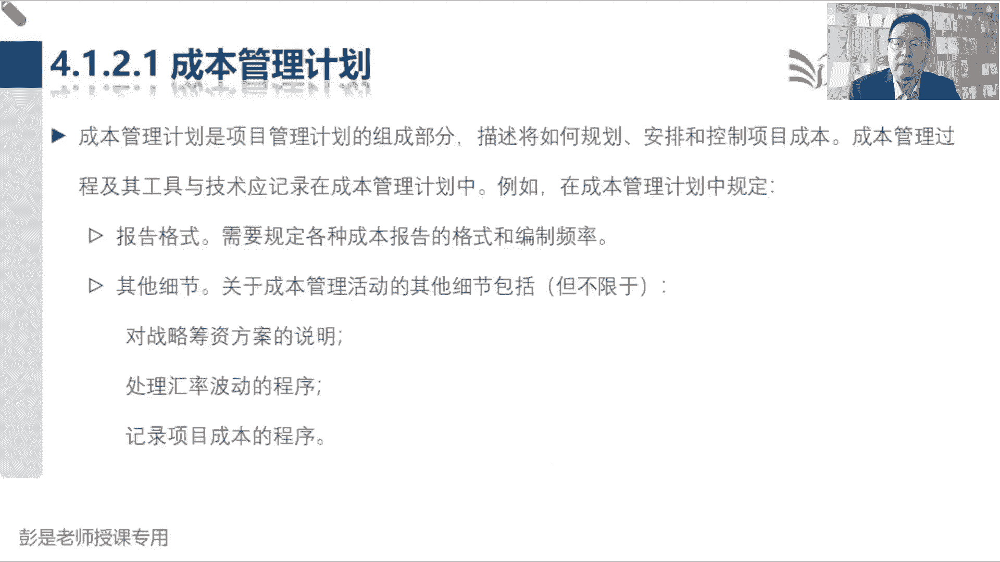

# 2024年最新版PMP考试第七版零基础一次通过项目管理认证 - P37：2.4.1 规划成本管理 - 慧翔天地 - BV1qC411E7Mw

接下来成本这一章，大家复习的时候可以看的非常非常非常非常快，因为它的过程少，输入输出也没什么东西，工具基础的最复杂的就是政治分析分析啊，听起来复杂，实际呢实际上超简单，等后面讲到工具技术的时候。

再把它搞定就来得及啊，好为什么简单呢，因为规划进度管理和规划成本管理一模一样，一个时间，一个钱计量单位准确度，精确度控制临界值，可得把这事考虑清楚吧，那估算活动持续时间和估算活动成本，基本上一模一样。

资源数量的多少，资源的水平，资源的等级会直接影响到活动持续时间，那资源数量的多少，资源的水平，资源的等级也会影响到成本对吧，有的老师水平比较低，就便宜呀，嘿三个人五个人成本不一样。

所以他输入也有资源需求，那除了资源的数量水平和等级，这个资源讲几天课成本又不一样了，所以呢他还要结合到刚才我们做好的进度表，这是项目的进度计划，所以拿到资源需求，拿到进度计划，我们就可以估算活动的成本。

它的输出也没什么需要背的，活动成本估算，加上一个估算依据，再往下进度里边，我们刚才进制定进度计划，超复杂，关键路径法，什么进度压缩资源优化什么，假设情景分析进度，网络分析，一大堆的工具，噼里啪啦一顿用。

才能得到一个具有可行性的进度表，但是制定预算这个管理过程呢就超简单了，它的关键词就是两个字汇总，从下往上逐渐会走，这和大家企业里面做预算是一样的，我下面有四个员工，张三李四王五赵六。

让他们四个员工报预算汇总到部门，再从务部部门，各个部门的预算汇总到老板手里就知道了，公司今年的年度预算是多少，那对项目上来说，我们就这四个层级，最底层的叫活动活动，他爹上一级叫工作包，工作包。

他爹在上一集叫ca控制账户，再往上就汇总到整个项目这个层级了，逐级汇总，逐级汇总，我们就知道这个项目需要多少钱了，然后这就是制定预算这个管理过程，做这个操作，控制成本和控制进度一模一样。

拿到数据信息变更请求，数据信息变更请求，并且呢进度和成本都是带数字的东西，所以呢这两个知识领域比较容易做趋势分析，所以控制进度输了输出了一个进度预测，控制上面输出了一个成本预测。

这一章最后要掌握的就是正式分析，这个讲到工具技术的时候再说了，所以后面大家复习的时候，包括做成本这一章的，做成本这章的章节练习题啊，你看到计算题啊，都先把它跳过去，看到计算你一定要把它跳过去啊，先跳过。

等后面再掌握它就可以，现在考试计算题基本上等于零，基本上没有，如果有超简单一道题，两道题仅此而已，呼，嗯好，所以这一章学完了非常轻松，再熟悉一些基本概念就搞定了，所以这一章的输出没有什么需要去背的。

规划成本管理输出，成本管理计划，估算成本出成本估算加上估算依据，控制成本数据信息变更请求，再做一个成本的预测，那就搞定这两个术语就可以了，基准和资金需求，基准和资金需求，他俩的逻辑关系啊。

随便拿几个数字理解一下啊，他这个逻辑关系啊，其实我们刚才讲进度的时候，他道理一模一样的，时间加上已知风险准备的应急储备，加上未知风险准备的管理储备，那成本加上已知风险准备的应急储备。

加上未知风险准备的管理储备，道理都一样，从家到公司打车需要大概十块钱，上次啊堵车，上次堵车，一堵车呀，就多花了五块钱，但现在今天能不能堵车，他不知道，有可能堵车，也有可能不堵车，它存在着不确定性。

它就是因为对我来说，这叫一个已知的风险，那我再多准备五块钱用来应对这个已知的风险，那万一再发生点没有超出认知的事情，这些钱不够啊，所以呢为了稳妥起见，再多准备三块钱叫管理储备。

那接下来我们把时间把钱都是这个逻辑啊，画一条线，已知的东西我们对它负责，已经知道的时间和已经知道的风险，我们对他负责任了，已经知道的成本，已经知道的应急储备，我们对它负责，所以呢这部分就叫基准，基准。

那那剩下那三块钱是未知的东西啊，未知的东西不算做基准，不算做基准，就不会影响我的绩效了，那未知的东西这笔钱我们需要准备出来，这个时间我们需要准备出来，所以我们用成本基准，再加上管理储备。

就等于整个项目的预算了，就记住这么一个公式就可以了，成本基准包括两部分内容啊，实打实算出来的成本，和应对已知风险所准备的应急储备，它就是这样一个结构，把它变成你有认知的数字就好，记成本十块钱。

然后可能会堵车，再准备五块钱，15块钱是成本基准，用来核对我的绩效的，再多准备三块钱，以防不测，所以呢整个项目一共需要准备18块钱，这是我的项目预算，记住这个逻辑关系，这个这一章就完事了好。

所以成制定预算输出的两个东西，一个是成本基准，它包括了成本和应急储备，然后呢在成本基准加上管理储备，就等于我们的项目的预算，项目的预算就是我的总体资金需求，整个项目需要多少钱，搞定。

那接下来书上这段文字说成本管理，成本管理，进度管理，按时完成发明管理，做题请做，成本管理呢，就是想办法看看能不能按预算完成项目工作，然后规划成本管理，如何管成本，估算成本，估算活动需要多少钱。

制定预算就是汇总除基准出资金需求，出预算，控制成本，那就是绩效和变更，这跟前面那一章基本上一样的，好概述，这段文字看看说这些过程什么什么小项目，这都不念了吧，小项目很简单，那就天下大势，合久必分。

分久必合，不念了啊，接下来看PPT这段内容，教材上现在没有，所以先听先听先听，听完了呢早晚会看到他的啊，那关于成本相关的概念，现在基本上考到的概率也不高，所以呢这段课程听完对。

对这几个单词稍稍有一点点印象，知道怎么回事就够了，第一段概念叫固定成本和可变成本，他是说呀咱项目有明天有临时性，又开始又结束，日期在这段时间之内，相对来说不太容易发生变化的，就称之为固定成本。

相对来说容易发生变化的，就称之为变动成本，可变成本，比如说哎我北漂在北京，今年今年这一年的房租相对来说固定，它就叫固定成本，那每天吃饭吃多少呢，不一定看心情，看情况，有的时候吃得多，有的时候吃的少。

有的时候吃的贵，有的时候吃的便宜，它就叫可变成本，在一段时期之内，相对来说一个固定，一个可变，所以通常概念就是固定成本和工作量没关系的，在一段周期之内不随工作量变化产生。

这叫固定在一段周期之内随着工作量变化，比如说一个人，两个人，三个人工作一天两天三天，他可能会发生变化，还得到可变，这对单词了解就可以，然后后面第二对单词叫什么呢，叫直接成本和间接成本。

叫直接成本和间接成本，就是，分摊就是分摊，我一个人租一个两居室，太贵了，成本高啊，那怎么办呢，合租对合租或者打小隔断，变成是那种那种两居室变成十六十六个小隔断，还把钱分摊出去，可以有效的降低项目的成本。

所以通常来说通常来说有两个项目组，A项目，B项目，A项目组说我要买一台车，问B项目组，你用不用，如果两个项目组都用，那这笔钱我们两个AA制各自承担一部分比例，那这个车的钱，这个车的钱通常啊就是公司出。

公司花钱把这个车买回来，然后呢公司在向各个项目组收管理费，收你5万块钱，作为你的成本，收B项目组5万块钱，作为你的成本，两个项目组去分摊，就作为项目的间接成本，那这个场景再变一下。

A项目组说我要买一辆车，问B项目组，你们用不用，B项目组说我不用这个钱，就项目直接就出了，作为本项目的直接成本，就这一堆一堆直接成本，间接成本就想到分摊AA制这种场景。

所以直接成本是直接归因于特定项目的成本，在项目组直接给个钱，这些成本呢是不能直接归因于特定项目的成本，比如说什么行政啊，管理费啊，租金啊，这些东西就是你企业的这些什么房租啊，水电啊。

包括这些公共的公共用的职能部门，他们所产生的成本都分摊到各个项目上，作为每个项目的间接成本，知道了意思啊，第三段的概念呢叫机会成本和沉没成本，这两个玩意儿也超简单，机会成本是说我们在做决策的时候。

放弃的下一个T最佳替代方案的价值，所以带场景，A公司说一年给你10万块钱，B公司说一年给你8万块钱，如果我选择去了A公司，那么做出这个决策时候，机会成本是多少，这能捯饬清楚就够了。

选择了A放弃了B放弃了B，那做出这个选择时候的机会成本就是8万，反过来，如果我最终选择去了B公司，放弃了A公司的工作机会，那现在的机会成本就是10万，就这东西吧，好场景再复杂一点点，A公司给你10万。

B公司给你8万，C公司给你12万，这种情况下，如果我最终选择去了A公司，机会成本是多少呢，放弃的下一个最佳替代方案的价值，我们放弃了B，放弃了C这两个里边找一个最佳替代方案，对不对。

所以现在这个机会成本就是12万，找最大的，那以此类推了，如果选择了B项目，机会成本12万，如果选择去的C项目，机会成本就是10万了，所以机会成本的概念是想提醒我们什么呢，做决策，做选择都是有代价的。

这个代价越小越好，越小就说明你找的工作挣钱多呀，对不对，所以他其实啊就是正向反向去告诉我们，这个这个思路，正向的思路很好理解，哪个工作赚钱多，我们就选哪个工作，反向理解呢，就是放弃的价值越小。

说明赚的越多，就这个道理啊，他就提醒我们做出任何决策，做出任何选择都是有代价的，这个代价越小越好好，那再往下沉没成本，沉没成本是什么呢，说一下，陈某和成本被排除在未来的业务决策之外。

因为无论决策结果如何，他们都将保持不变，粗暴理解啊，就是泼出去的水，就是泼出去的水，覆水难收啊，所以大家做决策的时候啊，要展望未来，不要去沉湎于过去，所以大家想场景，比如说。

我花了100块钱买了一张电影票，买了一张电影票啊，结果看了10分钟，发现了这个电影啊，枯燥无聊，没意思的烂片，还要不要继续看呢，还要不要继续看呢，要做决策了吧，现在决策的时候，通常正常人的心里都是这票。

我都花钱买了，自己挖的坑，自己挖的坑高低把他看过去，这样做决策的时候就不理性，对不对，只看钱了，只看过去花的钱了吧，那什么叫展望未来，这个电影啊，两个小时啊，未来两个小时。

未来两个小时对你来说是不是在浪费青春，浪费时间呢，能不能做一些更有价值，更有意义，自己更开心的事情呢，对不对，哎所以要泼出去的水，让它过去就过去了对吧，过去就过去了，展望未来唉。

这就是我们阶段关口最重要的东西，接电端口最重要的东西啊，好所以李健同学，你这是在赌啊，项目上能这么堵吗，不能吧，咱再把它变到工作上，所以阶段高考还记得吗，A阶段过去了，B阶段过去了，C3C阶段过去了。

过去工作中我们所花的钱做决策的时候，不考虑这个因素，我们去展望未来，继续走下去，还有没有可行性，继续走下去，还有没有价值，对不对，所以刚才我给出的假设就是，假设这个片就是个烂片。

那这种情况下你还要继续看吗，那如果说就像李现同学说话，说不定后面更好看的诶，他有可能好看，有可能不好看，他是个风险，那你要去分析了，实在不行，百度一下，看看这个片到底好看不好看，对不对，不要赌不要赌啊。

如果能确定它好看，那咱就继续看，这个就是理性角色吧，而不能赌对吧，我都花这么多钱了，万一后面更好看呢，那我就在这等，我就在这看，这不是浪费时间吗，哎所以项目项目工作上告诉我们要理性，千万不能感性。

你工作中谈恋爱看电影可不可以感性呢，可以可以啊，但是我们现在是投入真金白银做事情，那做做决策的时候就要理性，就要科学，不能靠着我们主观主观的偏见了啊，就这个道理，所以其实机会成本。

决策成本都是在提醒我们做决策的时候，展望未来，每一个决策都有代价，这个代价越小越好，并且呢过去的东西泼出去的水，让它过去就过去了，断舍离断舍离，展望未来，分析未来，继续往后有没有可行性，有没有价值。

哎所以恋爱长跑这种东西也是这个道理啊，人通常都是都是感性的生物，对不对，人通常都是感性生物，哎呀和女朋友谈了10年了，这么长时间了，哎呀他现在不喜欢我呀，那我要不要继续耗下去的人通常就会咬牙坚持。

这就是感性，对不对，但是做项目可不能这么想了，做项目果断的断舍离，这分析继续走下去，还有没有可行性，继续走下去，还有没有价值，如果没有及时止损，哎所以这告诉我们要理性决策啊。

生活中可能生活中真的谈恋爱要不要感性的爱，感兴趣不感性啊，对不对，感性反而不一定是坏事，但事情上工作中不能这么玩了啊，好知道这个大道理，了解就可以了，所以这段内容啊，教材上现在还没谈到，一会看文字。

有的地方有，有的地方没有停一停，知道怎么个意思就可以了，好那再往下看，这一章的核心概念，真的轻松加愉快了，说成本第一个需要掌握的知识点超好理解，我们重点关注完成项目工作所需的成本。

但同时我们也要考虑项目决策，对产品服务成果的使用成本，维护成本和支持成本的影响，例如限制设计审查次数，可能会降低项目的成本，但由此可能带来产品运营成本的增加，这大家能理解吗，就是我们不能不管不顾啊。

虽然项目和运营是两回事，运营工作不包括在项目范围之内，但是呢我们不能不管不顾，不能为了降低项目的成本而让人家运营背锅，嘿，偷工减料，盖房子的时候偷工减料，项目的成本蹭下去了，但是呢冬天漏风，夏天漏雨。

今天掉墙皮，明天那地方漏水，导致人家天天可能不断的需要不断的维护，不断的支持，还运营成本刺儿上去了，这也不科学，所以就提醒我们呀，作为专业的项目管理者，我们要有大局观。

这就是考虑考虑这个产品的全生命周期，生命周期成本除了盖房子，还要考虑这个房子未来的维修保养，运维都考虑清楚啊，这就叫生命周期成本，把它考虑周全，记住这个重要的理念，好那再往下说成本说了。

后面的文字不念了，想看就看，不想看，其实可以不看了，然后像这些通用的财务技术，咱前面讲的那个效益管理计划说过了吧，回顾一下投资回收期越短越好，赚钱不赚钱不知道，然后那个BCR效益成本比嗯。

这个兄弟需要大于一才说明有钱赚越大越好，剩下其他指标大于零，说明有前段越大越好，回顾前面效益管理计划那几个指标课程啊，好4。1规划成本管理，这个管理过程词就过去了，拿眼睛一扫输入输出工具。

没有新鲜玩意儿和规划进度管理，基本上一样，一会看完字就多了一个精确度好，所以输入没东西输出，见过听过见过这么说吧，不需要看精确度，就像大家日常生活过日子，对不对，我我在家里边不管钱。

还记得前面说我在家里边不管钱，我是只能行只能行，组织结构中的项目经理，我老婆掌握预算，人家是职能经理，他说了算需要我每天花的钱呐，抽烟啊，喝酒啊，喝饮料啊，还都要报账，精确到分，严格管理这例子啊。

精确度提要求精确到分啊，元啊，万元啊，千元呢根据项目的情况去分析，需要达到什么样的精确度，准确度呢，就是和刚才说的那个控制临界值一模一样的，好知道意思就够了啊，都是见过的知识点。

