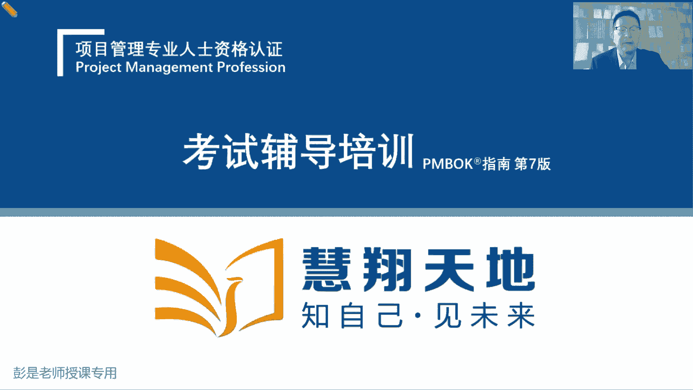
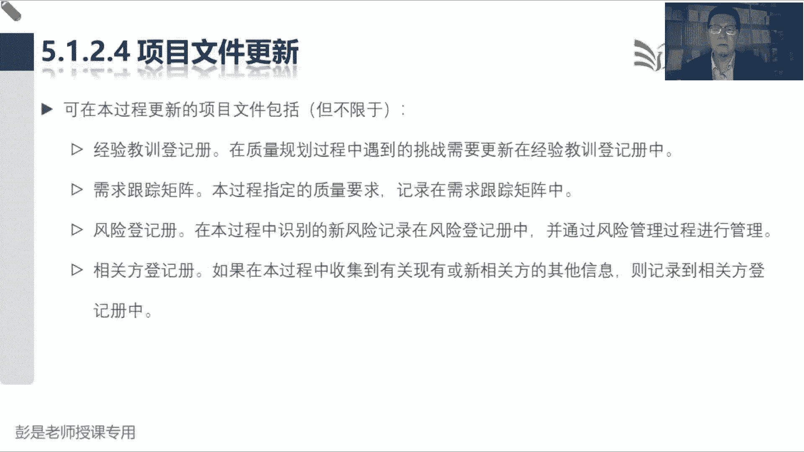

# 2024年最新版PMP考试第七版零基础一次通过项目管理认证 - P41：2.5.1 规划质量管理 - 慧翔天地 - BV1qC411E7Mw

范围进度成本，搞定项目的三大基准，有了，收集需求，定义范围，创建WPS，我们就会得到范围的基准，然后呢定义活动排序，估算时间，估算资源，制定进度计划，咱就会得到进度的基准，然后呢我们根据资源需求。

根据进度计划去算活动的成本，然后呢逐级汇总，逐级汇总就可以得到成本的基准，三大基准齐活，我们就完全可以按照计划去干活，产出可交付成果，产出可交付成果，上午也说过啊，这玩意儿直接去验收啊，有风险。

万一有问题，客户可能不开心不满意，所以为了稳妥起见，我们需要先控制质量，我们团队自己对成果做检查，做测试看看这东西合格不合格，检查测试完了就会得到核实的可交付成果，核实的可交付成果再去确认范围。

做正式的验收，验收通过就会得到验收的成果，验收的成果交给项目经理，通过结束项目或阶段就把他甩手出去了，变成最终产品服务成果的移交，质量这一章这个管理过程就搞定了，然后接下来质量这一章中心思想哈。

就是根据刚才学到的这套东西，带场景，知道质量的五种水平，就学的差不多了，五种水平啊，最low的是什么呢，指导与管理项目工作产出的成果，直接让客户确认范围做验收，我们内部不做指扣，这么做虽然可以。

但是呢不好，这就是最low的水平，好一点的是什么呢，产出的可交付成果，我们通过控制质量，我们团队自己内部做检查，做测试，检查测试完了没问题，再来确认版没做验收诶，这就好一点点。

我们可以有效的有效的规避一些，让客户发现缺陷，让客户发现有瑕疵，规避这种导致客户满意度下降的问题，这是就前进了一步，提升了一个水平，再好一点的是什么呢，说呀产出可交付成果，然后呢内部做检查做测试。

做检查做测试，这仍然是事后活干完了再看看，对不对，对不对，软件开发好了，房子盖好了，再看看有没有问题，有没有瑕疵，这是事后啊，亡羊补牢啊，那能不能做到适中呢，所以有了管理质量这个管理过程。

管理质量在执行过程中，他主要工作是什么呢，主要工作呀就是关注过程的质量，所以接下来看看啊质量这一章，一个叫结果的质量，通过控制质量，我们可以检查结果的质量，那通过管理质量呢，我们更关注的是过程的质量。

对标到大家生活工作里面，就是一个是QC，一个是QA，QC就是质量控制，QA就是质保，那什么叫过程的质量，什么叫结果的质量，这就不得不提到案例了，案例呢是帮助大家粗暴的理解它的主要作用。

但是这个案例呀平常讲平常讲可能大家记不住，总也记不住，所以呢越讲越恶心越恶心，大力才印象越深，刚好过完315，咱就拿315说的这个东西举例子啊，大家吃的烤肠香不香啊，好吃不好吃啊，Q弹不Q弹啊。

这这就是结果的质量，吃起来还挺香，但是那个烤肠的制作过程好看不好看呢对吧，什么淀粉，什么古泥，甚至可能有蛆，有蟑螂，只能这么恶心了啊，你看看那个车间哇，脏的脏的一塌糊涂啊，有小墙，有蛆，有蟑螂。

反正这东西打碎了，你也吃不出来，还是高蛋白呢，那它的制作过程超恶心，但是呢最后的结果可能还符合要求，你吃起来还挺香，这就是结果合规，但是过程不合规，那质量管理工作重心就是，我们不仅仅要关注结果的质量。

还要关注过程的质量，这就做到了适中，对不对，我们做香肠的过程中对吧，从原材料抓起啊，要要合规做，做考察的过程中，要保证车间干干净净，整整齐齐，没有什么脏东西进去啊，不要有什么老鼠尾巴，不要有什么小强。

有区域进去啊，保证过程也干干净净，过程的合规，课程的标准化规范化是为了得到更好的结果，这就是这两个管理过程的工作重心，管理质量抓过程，控制质量，抓结果，结果合规不代表着构成合规，对不对。

过程合规是为了得到更好的结果，哎相辅相成，就这个意思，所以这就是到了质量的第三个境界，做好做到适中，对不对，安排人在车间里面没事啊，把蟑螂赶一赶，把老鼠赶一赶，把蛆扫一扫，这里扫。

确保我们中间的过程也最好最好标准规范，干干净净，合规好吃吧，吃不死人呐，吃不死人，所以就带出来就带出来下一个话题，下一个话题是什么呢，看看啊，最low的是直接去验收，好一点的是我们内部做指控。

再好一点的是我们关注过程，关注适中的质量了，再好一点的就是提前做好质量的规划和设计，提前做好质量的规划和设计，就是好的质量啊，都是预防出来的，所以规划质量主要工作重心是什么呢。

就是要先根据我们的质量政策，先根据我们企业定出来的质量政策，去分析我们需要达到什么样的标准和要求，所以烤肠企业烤肠无良的烤肠企业，他们的质量政策就叫吃不死人，有蟑螂，有蛆，有老鼠尾巴，没关系。

高蛋白有营养吃就吃了，反正打成泥了，吃不死人就可以哈，诶这就是他们的政策，他们就根据这样的政策，规划好了一系列的质量活动，做火腿肠的过程中不用洗手，不用扫地，不用不用不用消毒，反正吃不死人的，唉。

他就把所有的质量活动都干掉了，对不对，只要最后包装没有破损，包装上没有什么血迹，没有什么血渍，还可以，没关系，就这意思啊，好好吃不下了，吃不下了，就能巩固这些知识点了，没办法啊，没办法，没办法。

只有这么讲，大家才印象深好，这就是质量这一章中心思想，好的质量一定是提前做好规划和设计，高标准严要求的企业，就像高伟同学说，有的企业良心企业呀，人家去分析我们这高标准严要求，里面不要有什么添加剂。

然后车间干干净净整整齐齐，大家上岗之前戴口罩，戴帽子，穿戴手套，不要污染我们的食材，这样呢我们过程好，结果也好，过程好，结果也好，这就是规划质量的工作中心，规划一系列的质量活动规划。

去分析我们需要达到什么样的标准和标，准和要求，做好质量的规划和设计，好的质量一定是这样规划设计出来的好，这是第四个境界，那最高境界是什么呢，就是让我们的所有员工TQM这套东西。

让所有的员工都有这个质量意识，变成企业的文化，从购买原材料开始，到我们车间工程中间生产包装加工，唉，所有人都有这个质量意识，不要买那些不要那些折个梅菜扣肉，不要买那买那些带什么淋淋巴结节的肉。

不要买这些什么腐烂的食材，哎广东广东消协看看看看什么橄榄菜，什么玩意儿，我那个场场景建了，很开心啊，就这个意思把它变成一种企业文化，从上到下，从高层到员工都重视质量，最后变成企业文化，这就是最高境界。

让大家都有质量的意识，不仅仅要抓结果，还要抓过程，就这意思啊，没关系，真真的人家的政策就是吃不死人，所以真的吃了的同学呢放心，没关系啊，虽然可能对身体有一点点影响，但是呢还行，以后尽量就少吃了。

以后尽量少吃啊，所以生活小小小窍门教给大家呀，能自己做就不要出去吃，真的是这样的啊，能自己做就尽量不要处理吃，能买能买，没有经过加工的原材料，就尽量的不要买成品，能买半成品就尽量的不要买成品。

半能买初加工的就尽量不要买半成品，总之啊最安全的做法永远是不要经过别人的手，我们要不要相信任何一个人了，现在这个大大大的环境就这样啊，能买原始的食材，那宁可生吃，都不要经过别人的手，就这个道理。

没有什么值得可信赖的东西了，现在商业环境就是这样啊，商业环境就这样啊，知道这个意思啊，好这一章搞定，剩下的就是大概了解一下什么输入啊，输出啊，工具基础啊，并且大部分的工具基本上听完名字。

也能大概猜出来他是什么鬼就可以了，虽然听起来工具多，但实际上没有那么多，好哎呀，放心放心，优秀的项目经理从来不把不把话说死，虽然呢我们考虑健康这个因素对吧，说最好最好最好买原始的食材。

但是呢还要多标准去做分析，什么都不能吃，什么都不让吃对吧，就失去了快乐，人不快乐呢又会影响健康，所以啊眼不见为净，眼不见为净，只要不那么过分，唉我们还是能接受的好了，伤疤忘了疼，该吃吃，该喝喝。

有事别往心里搁，就这道理啊，对不对，好就是全生命周期成本都标准，角色分析，好那再往下了啊，搞定，那这一章这一章项目质量管理，看看书上的文字了啊，本章综述，根据刚才的理解，稍稍记几个细节性的知识点。

稍稍记几个细节性的知识点，说规划质量管理，他的收入就是刚才说过的质量政策，好这个话题打住了，像餐厅啊，什么食品工厂啊，你只要去过了解它的内部，基本上你就很多东西都不吃了，所以眼不见为净，不要问了啊。

不要打听，有时候无知反而是好事好事啊，至少落个心情愉快，心情比什么都重要，好质量政策是他输入组织过程资产，非常重要的一个收入哈，我们要根据公司，租公司的质量政策去分析，我们需要达到什么样的标准和要求。

所以他收入找政策，有了政策之后啊，我们会把需要达到的标准和要求，写到质量管理计划里，什么叫标准呢，这是食品啊，医药啊，建筑啊，工程啊都有标准的，国家标准，地方标准，行业标准，企业标准有很多标准的。

所以大家买食材买买东西的时候，你去看看什么螃蟹呀，酒水呀，大米啊，这些东西都有标准，上面印着我们要符合什么标准，不同的标准意味着它有不同的品质，这大家不知道吃不知道这个梗了对吧，什么酒是勾兑的。

什么酒是岩浆诶，他有讲究的，有门道的啊，好所以根据我们的质量政策分析，我们需要达到什么样的标准和要求，还是国家标准的国际标准啊，还是说国内标准的地方标准啊，甚至企业标准啊，那标准定了之后啊。

标准里面有很多具体的要求，标准里面有很多很多很多具体的要求，比如说大家最好理解的就是天天喝的这个水，里面有什么要求呢，PH值重金属含量对吧，什么细菌啊，微生物啊，哎它里面是有要求的吧。

你这重金属太多了也不行啊对吧，有细菌也不行啊，有PH值什么等等于零，等于14都不行吧，叫酸碱适中，它有很多很多具体的指标，这些指标这些指标啊，在标准里边除了指标还有什么呢，还有测试的方法，这还能听懂吧。

还有测试的方法，就像身体健康，你也有很多指标吧，血压血氧心率对不对，包括呼吸肺活量，血常规有很多指标啊，这些指标都有测试方法，这个测试方法要科学，不能胡来，对不对，拿眼睛拿眼睛一看，冯老师这么胖。

血压高，这就是神经病，但不科学，那怎么测血压呢，用那个什么水银的那玩意儿，或者是用电子的东西诶，这个测试方法就比较科学了，就像各位同学称体重，体脂率都有测试方法，那这个测试方法科学不科学呢。

这是有讲究的好，所以最后说下来的话术啊，这是根据我们的质量政策分析，我们需要达到的标准，根据标准里面打开明细看一看，里面有很多具体的要求，具体的要求就叫质量测量指标，所以质量测量指标这个输出里面。

除了具体的指标，还有相应的测试方法，这个方法不能胡来，水PH值有什么试剂，试试值法，滴定法就是拿拿水去测，拿药剂去测，或者是用小小试纸，包括你家里面测甲醛，对不对，家里面装修完测甲醛怎么测呢。

嘿有的东西是骗人的，有的东西是科学的，对拿鼻子闻行不行啊不行，甲醛无味啊，所以才有了那个什么试制试试剂对吧，放在屋子里边养小金鱼行不行呢，说传说中啊甲醛超标，小金鱼会死掉的，这也不一定科学啊，对不对。

还以此类推，这就是质量测量指标的重要重要内容啊，这个一定要听懂，质量测量指标，除了具体的要求，还有测试方法，那这个测试方法有什么用呢，接下来逻辑就出来了，测试方法交给第二个同事，他把它写成测评文件。

什么叫测评文件呢，就是怎么测试呗，对不对，测评文件，测评文件交给第三个同事，对我们的可交付成果进行检查，进行测试，检查测试通过的就会得到核实的成果，就这个小逻辑搞定就完事儿了好，所以规划质量的时候。

根据政策定标准，根据标准选指标，把指标交给第二个同事写测评文件，测评文件交给第三个同事，对我们的成果做测试，就会得到核实的成果，测试通过的，另外还有第二个输出，叫质量控制，测量结果就是那个测试结果。

PH值测试结果是多少，重金属含量是多少，细菌微生物有没有身高体重，呼吸血氧测试结果是啥，诶就这东西啊，好搞定这个这几个东西之后啊，再加上两个细节性的知识点，第一个细节性的知识点啊。

拿到这个测试结果还不还没结束呢，我们需要把这个测试结果啊交回给前一个同事，交给管理质量，作为这个管理过程的输入，因为我们不仅仅要关注结果，还要去分析这个结果产生的过程，还要分析过程的质量。

所以管理质量的同时拿到质量控制测量结果，去分析这个过程的质量，然后最后写质量报告报告的内容就就这么说啊，过程合规，结果合规，过程合规，接口合规，这就是质量报告的内容，所以变成场景的话。

就是我们去某著名某著名什么橄榄菜呀，酸菜呀，去这个工厂检查人家的质量，结果发现做出来这个菜呀还挺好吃，哎这就是这就是结果的质量，然后你检查的过程合规不合规呢，怎么检查的呢，到那个工厂啊。

跟人家老板喝了顿酒，迷迷糊糊的就签字了，过程不合规，那这个结果不合格，对不对，你给出的给出的这个检查结果就神经病了，就这个意思啊，所以质量报告不仅仅描述一下过程的情况，还要描述一下结果的情况。

体现我们这个东西的合规性，质量报告交给谁呢，能猜到吗，质量报告交给谁啊，交给项目经理，项目经理监控过程组那个管理过程管理效了，监控项目工作，项目经理拿到质量报告，然后把它总结归纳概括。

变成整个项目的工作绩效报告好，这个是这个稍稍有点印象OK了，最后一个细节性的知识点就是控制质量输入，还有一个叫批准的变更，他的逻辑是这样的，我们指导与管理项目工作，按计划去干活，得到可交付成果。

还有一个实施整体变更，控制是管理所有的变更，当时的话术是这样的啊，变更一旦被批准，他就输出了一个批准的变更请求，并且这个玩意儿作为指导与管理，项目工作的输入，在强调批准的变更要及时的落实，及时的执行。

干活别干错了，那我们这些员工啊有没有整改呢，有没有落实呢，有没有执行呢，诶这个玩意儿需要控制质量的同时，来检查一下了，看看改了没有，就这意思，所以他来检查批准的变更请求的落实执行情况。

就把这个东西作为控制质量的输入，好这就是大概质量这一章这个小逻辑听一遍，大概有这个印象就够了，现在这种细节的小逻辑啊，基本上也不大会考，但最重要的是什么呢，五种水平这个大道理肯定要搞定啊。

然后呢结合到刚才那个恶心人的场景，你就去品吧，就去品吧，好再往下了，那概述这一段内容就超轻松加愉快了，项目质量管理，包括把组织的质量政策应用于报告，来满足相关方目标的各个过程。

然后呢我们还以执行组织的名义，支持过程的持续改进，就是结果的质量，过程的质量都要合规啊，那5。1规划质量管理，识别项目及其可交付成果的，需要达到的质量标准和要求，那就参考组织的质量政策。

然后描述一下我们需要开展哪些质量活动，来确保我们过程和结果都合规管理，质量就是过程的质量控制，质量关注的就是结果的质量，好输入输出搞定，然后再看概述这段文字，概述这段文字其实没抽。

没有太多的新的知识点了，规划质量的时候分析我们需要达到的质量，就是根据政策定标准，备根据标准选指标，管理质量关注的就是质量的过程，然后在管理质量期间，管理质量期间啊，在规划质量过程中识别的质量要求。

成为测试评估工具，将用于控制质量过程，来确认项目是否达到这些要求，控制质量干什么呢，看成果，看结果，这段文字就带出刚才那个逻辑，规划质量的时候，我们出质量测量指标，还确定质量测试的方法。

把这标准里边的这些要求啊交给第二个同事，他来写测评文件，测评文件干啥用呢，交给第三个同事，对我们的可交付成果进行检查，进行测试，检查测试通过的就会得到合适的可交付成果。

再把这个检查测试的结果给它记录下来，就得到了质量控制，测量结果就在说这个小逻辑好，再往下说，质量这一章有特定两个东西，一个叫合适的成果，这东西去了确认范围做验收，第二个呢质量报告交给项目经理。

通过项目经理监控项目工作，由项目经理把它变成整个项目的工作，绩效报告，好那再往下翻啊，后面这段文字看一遍就可以了，我们要要关注过程和结果两个方面，过程就是看合规无不合规。

持续的持续的做到过程的改改进pd c a r，然后结果呢有缺陷有缺陷，我们要想办法，尽量不要让这个缺陷的暴露在客户手里，再往下后面这段文字看就可以了，纯粹的字面意思没啥可解释的。

就是不同产品服务成果测试方法不一样，测PH值和测测你的血，测你的血压，血氧心率测试方法不一样啊，因为不同的产品服务成果，他肯定测试方法不一样，就是这个意思啊，然后再往下有一对概念叫质量和等级。

才需要有印象，质量是内在特性，满足要求的程度，我们生产出来的矿泉水，希望每瓶每瓶水里面啊一点细菌都没有啊，那如果我们离这个一点细菌都没有，细菌含量0%，这个指标越近就说明越合格，对不对。

那等级不是这个意思了，等级作为设计意图是对用途相同，但技术特性不同的可交付成果的级别分类，所以呀等级等级等级，它是为了满足不同人群的需求，故意这么设计的，因为不同人群需求不一样。

所以大家随便参考身边的东西啊，同样是喝的水，它的功能一样，用途是一样的，但是有的水卖两块钱，有的水卖20块钱诶，他都是等级，他是为了满足不同人群的需求，有的人喝水是为了装，就这意思啊。

手机也有不同的bug，同一款手机有什么一百一百二十八G的，有256G的，然后呢有屏幕大的，有屏幕小的，它是为了满足不同人群的需求，汽车也是这个道理吧，以此类推，所以质量和等级不一定不一定挂钩。

低等级不代表着质量差，高等级也不一定代表着质量好，知道这个意思就够了啊，所以书上后面这段文字看一看，了解就可以了，说低等级高质量也许不是问题，人家就是这么设计的，但是高等级的东西缺陷多诶。

也许就是个问题，好，再往下找到这句话，一定要记住了，预防剩余检查，说最好是把质量设计到可交付成果之中，提前做好质量的规划和设计，而不是在检查时发现质量问题，因为检查时发现质量问题，这是事后事后亡羊补牢。

成本啊，不好比高啊，还不如早发现，早治疗，早康复，那提前做好质量的规划和设计，所以有了这个术语，预防错误的成本，通常远低于在检查或使用中，发现并纠正错误的成本，这个未来讲到知识点就是我们那个质量成本。

预防成本，评估成本，失败成本，适当的提高预防成本可以有效的降低评估成本，减少失败成本，先听一听啊，一会看书上文字，还有呢，粗暴理解失败成本就是发现身体出问题了，生病了，评估成本就是做体检。

检查一下自己身体正常不正常，那预防成本是什么呢，锻炼身体，管住嘴，迈开腿对吧，不吃不吃那些乱七八糟的东西啊，适当的提高预防成本，可以有效的少做体检，因为身体健康了，对不对，也可以有效的降降低失败成本。

少生病了，就这个道理好，所以就像各位同学在学PMP，什么是预防成本呢，看书听课，尽量的通过看书听课掌握知识点，什么是检查评估成本呢，就是做题，然后做题做错了，做题做错了，这就是失败成本。

看书听课的成本通常远低于做题，做题发现错误的成本，所以不做题也不行，要适当的刷题，不看书更不行，还是要结合到一起，好那再往下，统计控制啊，这方面啊，像预防啊，检查呀，这才知道了，然后属性抽样变量抽样。

什么公差控制界限这些呢基本上也不大会考，大家可以写一个工具，后面我们讲到具体工具的时候，讲到控制图再搞定它，他不会考什么叫属性抽样，变量抽样也不会考什么公差怎么定，这些控制器怎么定，它是控制图。

有可能会考啊，所以这几个术语先给大家粗暴的说一下，什么叫为什么要考虑统计抽样呢，这是真的就是制造业出来的东西啊，我们生产火腿肠，一天生产几万根，几万香，几万根，几万箱，那什么叫属性抽样。

它的抽样结果检查的结果就是合格不合格，这个火腿肠的包装袋破了，不合格，这个火腿肠的包装袋破了，他就是个不合格品对吧，瑕疵品，残次品，所以大家买的什么手机啊，衣服啊，都有个小标签啊，质检员是谁合格不合格。

这就叫属性抽样，直接给出定性的结论，那什么叫变量抽样呢，生生产出来的火腿肠，拿拿拿那个试纸试剂一测，里面没有什么细菌，没有什么微生物含量0%诶，他离得越近，离标准越近，说明越合格，对对就这道理啊。

这就叫变量抽样，包括大家这两天应该学到不少知识吧，这里面还有看看你的买的食品里面对吧，还有多少脂肪啊，还有多少蛋白质啊，这都有指标啊，它体现的是合格的程度，通过采样，通过采样结果看看它离标准近不近。

越近越合格好，那公差和控制界限是什么东西呢，控制界限告诉我们说生产线，生产线每天都是生产火腿肠，每天都生产火腿肠，源源不断地生产火腿肠，那这个生产的过程包括火腿肠的灌装对吧，把要把这个肉弄到那个袋子里。

我们希望这个过程啊稳定，希望这个过程稳定每根火腿肠里面，比如说装二两肉哦，那不稳定的生产线是什么呢，一会儿多了，一会儿少了，这就不稳定了，理理想的结果是什么呢，希望每每个火腿肠里面装的装的肉都是一。

都是一样多的，一样多不就稳定吗，嘿这就是控制图，控制图它的主要作用，监控监控来监控我们生产火腿肠这个过程，灌装的过程稳定不稳定，理想的模式下应该都是一样的，但是呢实际工作中或多或少会有一些偏差。

多多那么一丢丢多，那么一小口少那么一小口好像还行，多一克少一克好像没关系，它允许一定的浮动，那就有了控制界限，比如说这是多一克，这是少一克，科学家跟你说，它允许有一定的浮动号，那理论上来说。

他就应该不断的不断的在这个区间里面来回调，有的时候多一点，有的时候少一点，只要在这个区间里，那么我们就认为它是稳定的，那什么时候不稳定呢，超出这个区间，这叫超出控制上下限，比如说有一根火腿肠。

一称重二两是多少啊，有一根火腿肠105克，多了5克呀，这就说明这个灌装线，灌装生产线它不稳定，因为超出了控制上下限，第二种情况叫起点规则，后面再说了，先有个印象啊，考试也不会考这么复杂。

考试就是考控制图，帮助我们分析这个过程稳定不稳定，所以实际上大家生活中也可能在用，比如说各位女同学，你想想，每天称体重看看体重稳定不稳定，这不就是控制图嘛对吧，我的体重我的体重90斤。

然后有的时候吃得多，有的时候吃的少，允许有一定的浮动，上面92，下面88，只要我的体重在这个区间里来回蹦，来回蹦，不超出这两根线，那么我就认为我体重稳定，突然有一天吃多了95斤，哎呀马上控制啊。

因为失控了，超吃太多了，超重了，这意思好，所以这就是控制图的主要作用，那这个公差稍稍有点影响，公差对标到规格上下限，规格上下线，让我们来判断这个生产线能用不能用对吧，灌装一个火腿肠400克哇。

太多了太多了，你这个生产线不靠谱啊，天上一脚，地上一脚，那我们就不用了，稳定稳定，如果不稳定，还可以调一调，如果太太太离谱了，说明这玩意儿不能用啊，所以呢公差就是结果的可接受范围。

第八道术语就叫规格上下限，中间那个一一根火腿肠二两，这叫什么呢，这叫均线，我的体重应该保持在90斤，这是均线，其实控制图最后就是五支线，好这段文字听一听啊，写个写个写个单词。

控制图用来监控过程是不是稳定，那再往下后边这段文字，就是这一章一定要记住的，非常重要的理念和原则，并且呢也没什么可念的，代价，最大的是让客户发现缺陷，好一点的我们先指控再好一点的关注适中。

纠正过程本身就是过程合规，对不对，然后呢将再好一点的，就是把这玩意儿提前做好规划设计，最后呢就是变成文化，从低到高，这一定要能听懂啊，听懂之后，就结合到刚才讲49个管理构成的，一张表的时候。

想清楚他们在表里的位置，这一定要掌握，因为还涉及到数据流指导与管理项目工作，直接去验收有风险，最好呢做指控，在关注适中，再做好质量的规划和设计，这一说能脱口而出就够了啊，好那趋势核心金石店这段文字。

其实大家后面复习的时候，基本上看了解就够了，第一客户满意，品一品，这两句话再强调啥，说我们需要把符合要求和适合使用结合起来，他这个道理和哪一章听起来比较像的，符合要求，适合使用范围。

这一章做且仅作完成范围内的工作，并且仅完成就可以了，质量也如此，所以大家这种东西啊，你就参考这个玩意儿，某多多为什么活得风生水起啊，因为贴吧它里面的东西，大家第一反应还好像质量不太好。

那他为什么还有生存的空间呢，就是因为不同人群有不同的需求，人家就希望便宜没好货，主打一个便宜，因为生活困难，不要求质量这么高，能用凑合用，凑合吃就行了，对不对，所以很多垃圾食品为什么有市场呢，还便宜啊。

省钱啊，对不对，能吃就行了，管他那么多呢，就这就这就这个道理吧，好所以客户满意，客户开心就可以，那第二个持续改进，这个需要大家关于几个单词啊，给它绑定到一起，由修哈特提出并经待明完善的pd c a循环。

这咱知道了，持续改进，持续改进，做任何事情有先有规划，然后去执行，看看好与不好，发现缺陷，差距和不足，做过程的改进，然后需要和他绑定的这几个术语，TQM全面质量管理，六西格玛和精力六西格玛。

非制造业的同学，可能不知道这几个单词是什么意思啊，其他不是制造业的同学可能不知道，没关系，有印象就过了，总之这些东西的中心思想都是持续改进，符合要求，适合使用，提高客户的满意度，主打一个不要浪费时间。

不要浪费钱，不要浪费时间精力去做，去做低质量的事情，所以叫什么以顾客为中心，我们全员参与质量管理，从高层到员工，供应商，大家通力合作，我们关注过程的质量，方法的质量，结果的质量，技术的质量。

全面关注质量啊，就这东西，这叫全面的质量管理，六西格玛，1716西格玛都是大概这个意思啊，所以这几个单词稍稍有点印象，看到这些单词关注的是什么呢，改进持续的改进，我们的过程是为了得到得到更好的结果。

知道这个意思搞定，那再往下管理层责任和和供应商互利合作关系，这听一听就完事了，都可以不看的，管理层责任就是因为企业质量政策谁定的，这两天抓抓抓谁呢，谁谁谁最后判的刑期更长呢，是员工还是领导。

这就是管理层责任，这告诉我们这个道理，你领导定的政策，你定了政策，我们才敢胡来的，所以呢领导领导关于这个质量问题，应该承担更多的责任，对对董事长，什么董事会总裁总经理，你们你们要承担更多的责任呢。

就这个道理啊，然后和供应商互利合作关系，纯粹的字面意思都可以不看的，就是抱团取暖，现在的合作关系啊，一一讲就是战略，对不对，张三作为我们火腿肠的供应商，给我们供应那些垃圾垃圾的东西啊。

我们关注的是长期长期关系啊，不是一锤子买卖呀，对不对，咱俩都悄悄的，全世界人民都不知道，不知道我们背地搞的猫腻才好呢，共赢共赢啊，这复变案例听一听，了解一次就够了啊。

好那再往下咱今天的课程马上就要搞定了，接下来这一章，大家看书的时候会发现大量的工具技术，并且大部分的工具千万不要去背，它属于哪一个管理过程，因为质量的工具啊，质量的工具大部分都是通用的。

它可以用于规划质量管理，质量控制质量，它头都是通用的，只有极个别的工具是专用的，需要去记，所以未来一定是一定是不能通过工具技术，判断他在干什么事情，一定要通过文字描述，判断他在做开展哪一个管理过程。

非常重要的东西好，所以规划质量收入没什么需要去记的，组织过程，资产里面有我们公司的质量政策输出呢，就是刚才说的这两个东西，一个是质量管理计划里面写标准，第二个质量测量指标是根据我们的国家标准，地方标准。

行业标准，把一大堆具体的要求，明细的要求，细节性的要求给他列出来，然后呢再把对应的测试方法给它敲定，因为测试方法可能有很多，比如说真的是水PH值，可以拿小纸片去测，是是指法，也可以用那个试剂去做滴定法。

有很多方法，我们选择合适的科学的方法就可以了，这就是质量测量指标的内容，然后中间的工具技术规划，质量的工具啊，没有什么需要去背的，这个见过了见过了见过了见过了见过了，来了个新朋友。

质量成本刚才也大概说了，对不对，预防成本，锻炼身体，评估成本，做体检，然后还有一个什么失败成本，生生病了，尽量的不要生病啊，那为了不要生病，天天去医院抽血可以吗，天天去医院抽血做评估可以吗。

抽一周基本上就噶了，那还不如不评估呢，所以大家要想考试通过天天刷题有效果吗，确实有，但是效果有限，最好的最靠谱的方法仍然是适当的多看书，多听课，适当的提高预防成本，传住嘴，迈开腿，多锻炼身体。

这就是COCOU告诉我们这个道理，好多标准这套分析见过了，逻辑数据模型基本上不考，为什么呢，这个东西啊需要带一点点专业知识，基本上不考，它是软件行业出来的，所以呢让这个工具去死，好，矩阵图后面会单独讲。

让他去死，测试和检查的规划，纯粹的字面意思对吧，检查身体和检查火腿肠测试方法不一样啊，这事得规划一下，所以只需要掌握到现在就这么一个玩意儿，并且也不需要去记它属于哪一个管理过程，流程图干嘛用的呢。

纯粹的字面意思可以去死了吗，可以去死了吧，流程图，就想想大家新冠期间，你买的那个抗原检测小盒子后面都有图片啊，告诉你第一步干啥，第二步干啥，第三步干啥，这不就是流程图吗，对不对。

人家办事大厅里面都贴个图，告诉你，告诉你它的流程是啥，有图有真相，看起来更直观，流程图最主要的作用就是可视化，看起来很直观，比看文字简单得多，和我们刚才排列活动顺序画网络图，道理一模一样，对不对。

所以规划质量管理，其实他的收入啊，工具啊都听一听，没什么需要去背的，然后质量管理计划和质量测量指标，嘿它的内容需要掌握一点点啊，好具体的收入没有什么需要去记得了，然后呢组织过程资产。

这大概就这么几个东西吧，因为这个东西会影响到我们需要达到的质量，标准和要求，所以稍稍有点印象，并且这个东西咱通常不一定说了算，因为高层定政策，好那这个管理过程的输出规划，质量管理计划。

质量管理计划的内容其实也不太需要去背了，看一看没什么考点了解就可以，里面最重要的就是这个项目采用的质量标准，比如说国标12345，什么2023，意味着这是个什么东西，大家不知道听没听过这种梗啊。

你买什么五常大米呀，大闸蟹呀，什么酒水饮料，食用油啊，它不同的标准代表着不同的含义，它添加剂这些东西不一样的不一样的啊，哎生活小妙招分享给你，所以就是分析我们需要达到什么样的标准，到底是优质的东西。

还是一般的东西，还是乱七乱七八糟的东西，甚至某些无良企业就完全不参考任何标准，对不对，这些东西都是由质量政策决定的，根据这个政策定了标准之后啊，就知道质量到底怎么管了，无良企业可能没有目标，没有角色。

没有过程，没有质量活动不指控，没有工具，对对对，就这意思啊，好那再往下51225122就看看第一句话，质量测量指标，专用于描述项目或产品的各种属性，就想随便想个例子啊，矿泉水有PH值，有酸碱，酸碱度。

有什么重金属泥巴，微生物，细菌都有要求啊，像我们身体呀也有很多指标啊，什么血常规，身高体重呼吸血压脉搏，另外还要写清楚如何验证符合程度，这是测试方法，这测试方法不能胡来，对不对，国家标准。

地方标准这种强制性的标准里面肯定有要求啊，肯定要有要求吧，好这就是质量测量指标，那未来我们需要把质量测量指标交给马上，下一个同事。

