# 2024年最新版PMP考试第七版零基础一次通过项目管理认证 - P47：2.6.4 建设团队 - 慧翔天地 - BV1qC411E7Mw

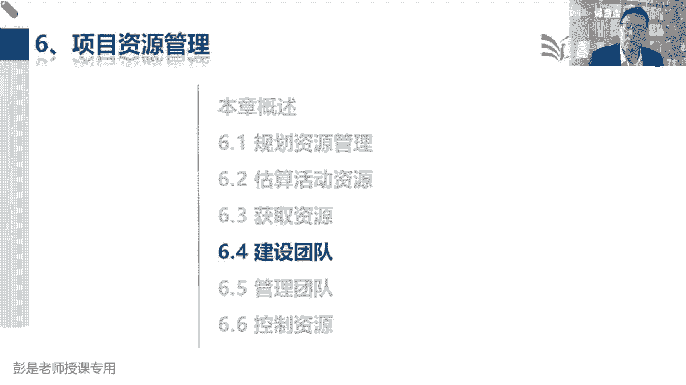

好6。4，建设团队这个管理过程超友好，因为基本上输入啊，输出啊，工具啊，没啥需要去背的啊，建设团队的收入根本就不用去记，大家结合到自己的工工作场景，大概能想到一些东西就可以了，比如说下周一搞团建。

大家有没有时间呢，下周一搞团建都催谁在项目上啊，下周一搞团建有没有人请假呀，下周一搞团建，咱能不能大吃大喝呀，那我们需要看看进度计划，需要看看派工单，需要看看资源日历，需要看看它那章程。

因为里边有行为准则，大概能听懂就够，他的工具技术，先标一和二，这是一对超重要的概念，刚才也听过了哈，一个叫集中办公，一个叫虚拟团队，那这两个工具记住，需要大家掌握它其他的特点啊。

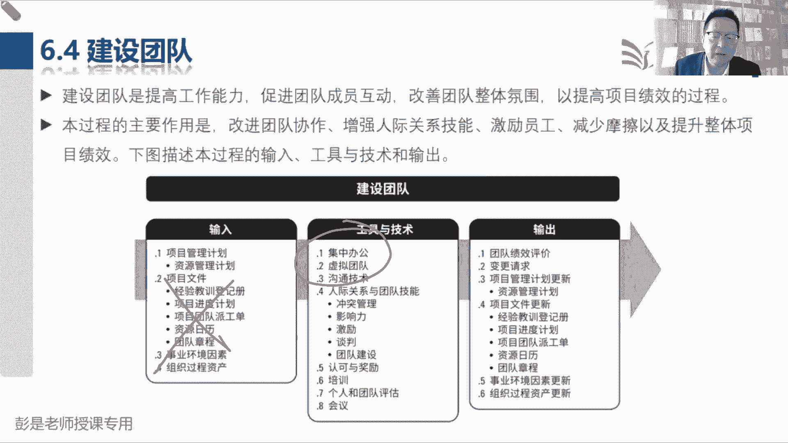

虚拟团队和集中办公，虚拟团队刚才我们说啊，大家达达成共识了啊，他主要问题是什么呢，沟通费劲，第二个主要问题是什么呢，这次还不会写了，凝聚力可能比较差，就是大家可能没有什么太多的团队意识。

因为大家在线上对吧，在全国各地，甚至还有海外的同学啊，咱在世界各地天南海北，大家呢线上又看不着对方是什么样的人，线上呢打字啊，打字他表传递的感情又有限，对不对，所以呢大家可能团队意识会比较差。

凝聚力会比较差，这是他的主要缺点，那虚拟团队的优点是什么呢，省钱大家听课不需要再通勤了，不需要出差了，因为不需要往来交通，甚至有些同学有些同学对不对，省钱不需要出门了，成本低，可以有效的降低成本。

第二个优点是什么呢，资源的选择更丰富，如果你只听线下的课，比如说老师啊，我在我在我在西安呐，西安这班老师可能水平不太好啊，只不过只在线下听课，资源的选择面是比较窄的，但是如果在线上听课，想听谁的。

听谁的呀，对不对，可以听外国老师的，想听谁的，听谁的资源的选择会更丰富，这就是虚拟团队的优点和缺点，集中办公呢，就是把虚拟团队的优缺点全都反过来，虚拟团队你沟通不好，我集中办公，沟通很省事，对不对。

大家在同一个房间喊一嗓子，喊一嗓子，全知道了，虚拟和团队你凝聚力差，我集中办公啊，凝聚力好，为什么呢，线下呀大家通常会比较客气，比较容易建立信任关系对吧，团队意识会比较强，团队意识比较强吧。

然后线上线上啊，你成本低，那我集中办公啊，成本高，因为线下线下需要房间，可能大家需要通勤，有成本集虚拟团队，你资源选择更丰富更广，那我集中办公呢，资源选择面就窄了，对对我们在北京做项目。

可能其他外地的同事就加入不进来了，只要需要线下一起合作的话，外地同事不方便的，对不对，嘿所以把他俩的优缺点互斥，互相反的记一个就搞定第二个了，好知道这个意思啊，所以每次讲到这段文字的时候。

就需要给大家做一个小小的学习任务，这个小小的学习任务建议大家在今天下课以后，下午下课以后再执行啊，现在上课过程中不要搞这个事情，小小的任务是什么呢，虚拟团队，大家团队意识比较差，凝聚力比较差。

就像各位同学现在在听课呀，有没有觉得孤单呢，有没有觉得寂寞呀，孤单寂寞冷啊对吧，一个人学啊，没动力，因为男女搭配干活不累，所以需要各位同学今天下课以后，下午下课以后啊，想办法找到一个学习的搭子。

搭一个搭两个搭三个不限呐，然后需要大家找几个搭子，互相监督，互相帮助，互相监督，不不用解释吧，小丸子同学昨天看书了吗，小飞跃同学今天听课了吗，今天做笔记了吗，章节练习题做了吗，正确率多少啊。

错题回顾了知识点吗，互相监督，互相监督，因为你们之前有的学长做的非常到位，大概拐个小弯儿啊，之前你们学长是这么干的啊，他们拉了个微信群，然后呢里面大概七八个人左右，不要求太多啊，太多了就就乱了。

管不过来，一个人能照顾到六七个就差不多了，不要在公屏上打字啊，没用的，先听先听，不要不要聊天，不要聊天，专心听，那当时他们选了一个组长，这个组长负责干什么呢，干什么呢，比如说张三李四王五赵六张三啊。

看书看到第几章了，章节练习题做到第几章了，正确率是多少啊，一模成绩是多少，二模成绩是多少，三模成绩是多少，这样呢就可以及时的看到大家的进度条，甘特图啊，对，虽然同学们之间工作学习没有这种逻辑关系。

关联关系，这样呢互相互相督促，互相帮助，互相帮助啊，好知道这个意思就可以了，然后接下来非常重要的知识点只能这么说了，非常重要的知识点，各位同学专心听，不要不要打字了，不要聊天了啊，专心听。

非常重要的知识点，这个搭子刚才说啊，一定是今天下午下课以后，你们在咱的微信群里再去找你的小伙伴了，不要在咱现在这个聊天窗口找啊，你也不知道谁是谁啊，不知道人家和你在不在一个微信群啊，并且聊天窗口啊。

聊天窗口人家发的微信号要不要加好友，那不一定你也不知道他是不是咱的学员呐，这就是虚拟团队的缺点，难以建立相互的信任关系，所以最安全的方法是去咱的微信群，微信群那里边的人肯定是咱的同学，嘿。

去微信群里面找到你的学习小伙伴就可以了，两三个人，三五个人都可以啊，想怎么找就怎么找，想怎么找就怎么找，真同学说，求拉我啊，这样的组长是谁呀，这是第二个知识点，希望大家呢能够化被动为主动。

自己主动站起来，承担这个组长这个职责呀，好所以各位同学根据自己的学习情况，慎重慎重，在微信群里面找到你的学习小伙伴，互相监督，互相帮助啊，起到这个互相督促的作用，这样呢两个人一起学，三个人一起学。

还有点动力，不然一个人太难受了，就这个道理，好知道的意思啊，课下走，那接下来讲重要的知识点了。

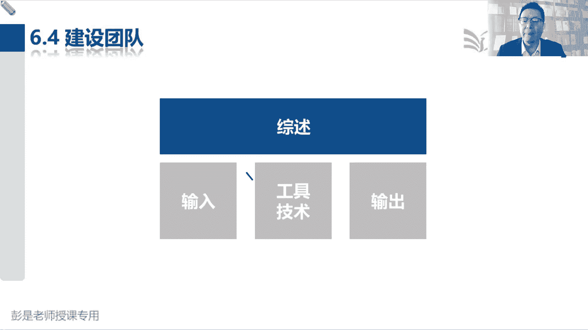

建设团队这个管理过程，集中办公，虚拟团队搞定第三个工具，根本就不用去记沟通技术，纯粹的字面意思，这是沟通可以使用的技术，微信啊，钉钉啊，陌陌呀，视频会议呀，打电话呀，这就是记住啊，不用记。

然后冲突管理后面这一堆都可以不用去记，团队建设就是搞团建，认可和奖励，就是打击学，对认可和奖励就是打鸡血啊，今天张三是我们的学习标兵李四唉，今天学的好啊，以此类推给大家名和利，给大家打鸡血。

刺激大家提高绩效，培训纯粹的字面意思吧，这都不用讲了，但是培训啊背后对应对应的重要考点是什么呢，这是一个非常重要的价值观，当我们发现成员能力不行，水平不行的时候，应该怎么办呢，辞退还是培训。

辞退他还是培训这个中心思想就出来了吧，这叫什么呢，治病救人，治病救人，本着治病救人的原则对，只要不是违法乱纪，道德败坏，伤风败俗，那能力不行，水平不行，该培训的培训，该指导的指导，该辅导的辅导。

该启发的启发，该教育的教育体现我们服务型领导的特点，服务型领导积极主动热情做好配合，提供支持，就这意思啊，嗯现时就看情况了吧，现实工作中能力不行，实在不行啊，该辞就辞啊，但是通常来说。

企业还是应该给人家一个成长的机会，对不对，能教就教，实在教不了再考虑辞退，好知道这个意思啊，然后个人和团队评估这个东西啊，怎么粗暴理解呢，大家有没有做过那种什么性格测试啊，人格测试啊，对吧。

什么红蓝性格呀，什么孔雀型啊，什么什么样的人对吧，内向的爱人一人就这东西吧，唉就这样粗暴理解个人和团队评估，在工作中可以通过什么爱人一人对吧，性格测试啊，这是一方面还可以测很多东西的对吧，敏锐力啊。

什么观察力呀，这种敏感性啊，表达能力呀，沟通能力呀，对公司的满意度啊，各种各样的测评啊，通过这种专业的测评，我们可以发现成员的什么能力不行啊，水平不行啊，以此类推，哎他是大概这个意思。

这个不太需要刻意的去背，那这个管理过程工具其实没有什么需要去记的，因为大家看名字都很难猜错，唯一唯二比较重要的就是前两个，那他的输出就是团队绩效评价，团队绩效评价这东西啊，大概有多留印象啊。

因为我们这个管理过程最重要的目的是什么呢，改进团队的绩效，让大家干活绩效好，让大家干活有动力，对不对，防止大家什么划水呀，摸鱼呀，防止大家每天做一天和尚撞一天钟啊，死气沉沉的，想办法刺激大家。

提高士气呀，提高凝聚力呀，相互信任呐，一切都是为了提高团队绩效，然后呢提高了团队绩效，不就保障了项目的绩效吗，那做完了团建之后，我们要给结论的团队绩效有没有发生改变的，不能吃完了，喝完了就没下文了。

这也不行啊，所以他有这么一个重要的输出团队技巧，评价评价的是我们团建好使不好使，让我们团队发生了什么样的变化，有没有提高大家的工作能力呀，能不能让大家更好的相互互相帮助，互相支持，互相信任呢。

有没有改善团队的整体氛围，让大家都满满充满了正能量诶，大概知道这个中心思想够了好。

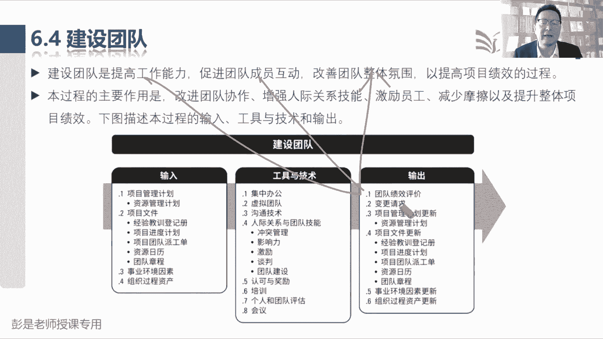

所以后面这段文字呢，基本上大家复习的时候就看看看看就行了，重要的知识点马上就要出来了，那我们应该能够什么什么促进项目，这都不垫了啊，什么什么什么解决问题出。

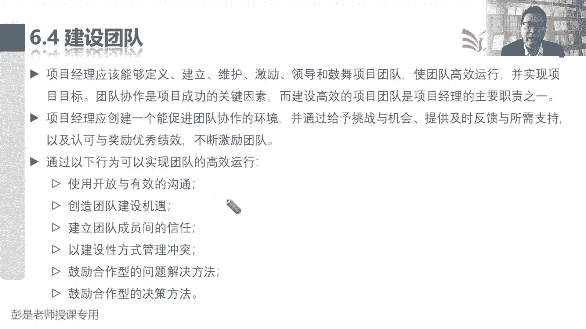

这都这都不点了，字面意思，然后说，我们在全球全球化环境和，富有文化多样性的项目中工作，大家来自于不同的行业，讲不同的语言，甚至用一种特别的团队语言或文文化规范，而不是讲他的母语。

就是啊各行各业都有各行各业的黑话，各行各业都有各行各业的规划黑化，如果大家通常工作中是说自己的这种行业，行业行业内的黑话，可能啊引起一些不必要的误会或误解，所以呢我们要考虑到这种文化差异。

想办法消除大家关于这种文化差异上的，这种无知，从而避免引起一些不必要的误会，这能听懂吧，就像各位同学，你在聊天区域打一对一是什么意思呢，哎不玩游戏的人可能就不知道对，不可能就误会了。

他打一对一是什么意思啊，是不是嘲笑我啊，是不是在骂我呀，不知道啊对吧，就像这个东西也被玩坏了吧，呵呵什么意思呢，唉不同人群他的理解是不一样的啊，跨一个狗头是什么意思呢，发一个狗头表情包什么意思呢。

不同人群理解起来不一样啊，它很可能引起一些不必要的误解，所以不知道各位同学有没有，关注过一个人事方面的小小梗啊，听一听就是啊大家微信里面都有一个表情，就是那个微笑，就是那个微笑的表情啊，画的不好啊。

知道意思就够了，然后呢有一个领导啊就把一个员工给开了，为什么呢，因为他发现这个员工在微信群里面，总爱发这个微笑的表情，他就认为呢这个表情啊叫死亡凝视，说这个员工天天发这个表情，吓唬我，恐吓我，死亡。

凝视我诅咒我，于是我就把他裁了，哎，这就是由于这种文化差异导致的不必要的误解，所以我们要想办法，就是在尤其是大家在工作中啊，表情包慎重发，对不对，这表情包慎重发慎重发呀，对不对。

如果带一些文字的表情包诶，他不就解释吗，相对来说会好一点，相对来说会好好一点啊，对有解释，有文字啊，谢谢领导，哎，知道这意思吧，所以呢尽量的能能面对面的沟通和表达，尽量能面对面，因为它很难误解，对不对。

他看着你笑着给他说，他就知道你的态度了，然后如果是线上沟通呢，线上沟通尽量呢是能打文字，打文字对，然后文字呢也不要5C那个还有印象吗，基本上记不住啊，也不要啰嗦，也不要加一些，就像有些同学。

比如说有人打字喜欢加叹号，这是不是会引起一些误会呢，大家想一想，你工作群里面肯定有人这样哈，对对打字加叹号，甚至有些是事情啊，加好几个叹号哎可能让别人比较反感，就这意思吧，这些都没必要，没必要，对不对。

咱就简单的直白的把这个事说清楚就可以了，不要加，不要画蛇添足，知道意思啊，所以我们要考虑这种文化多样性。

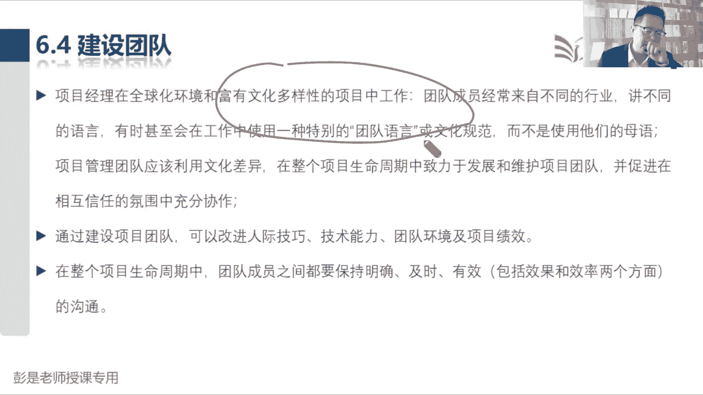

知道这个意思搞定好，然后再往下说这段文字看看就可以了，看看就可以了吧，就逗号啊，句号啊，问号啊都还好对吧，表达感情的这种东西还是要慎重的啊，然后说这段文字没什么，没什么可念的啊，提高质量啊。

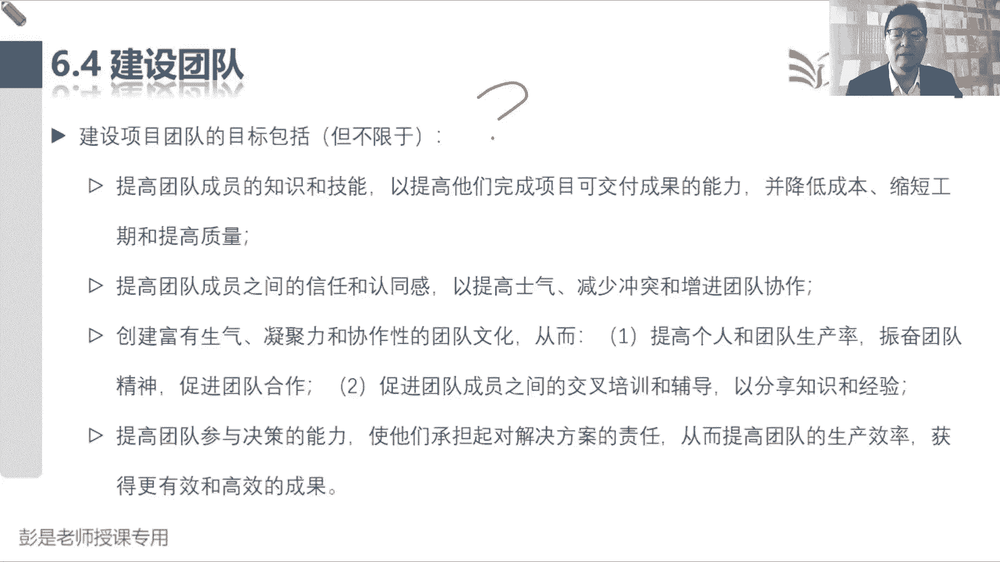

提高生产率啊，唉就不念了，那接下来咱讲，最后建设团队非常非常重要的一个东西啊，叫塔克曼解体理论，也叫塔克曼团队发展模型，他是分析啊，张三李四王五赵六，我们组建了项目团队之后，大家人之间有什么样的规律。

人之间有什么样的规律，所以有什么规律呢。

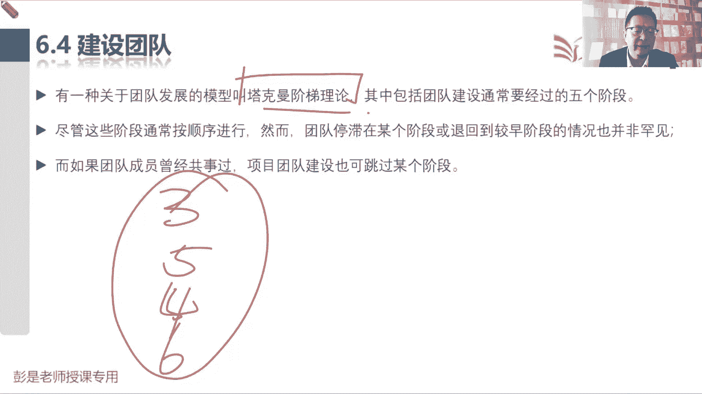

就是看这张图，知道这个大对勾就可以了啊，耐克耐克大对勾，那第一个阶段叫形成形成阶段，在本阶段大家相互认识，了解大家在项目中的角色呀，职责呀，就是团队刚组建好的时候就叫形成阶段，这个阶段的特点是什么呢。

情缘倾向于相互独立，不一定开诚布公，倾向于相互独立，不一定开诚布公是啥意思啊，就是啊团队意识可能还没有这么强，仍然倾向于认为自己是一个个体，而不是参与到某参与到某一个集体之中。

所以这种情况下呢就容易啊比较拘谨，不一定袒露心声，所以叫不一定开诚布公，那这个阶段啊，大家带场景就好理解了，场景啊，你入职到新公司找对象，这个规律是共性的，因为他分析的是人的心理活动啊。

所以找对象就好理解了，两个人刚认识的时候啊，形成阶段成立成立项目组啊，两个人刚认识认识的时候啊，士气还不错，这条曲线这条线主要体现的就是士气，刚认识的时候士气还不错，对不对，热情有心气，有士气。

那这个阶段呢仍然仍然认为自己是一个个体，这时候团队意识还不够强，还不一定能够照顾到对方啊，不能不一定能够考虑到对方啊，哎这就是第一个阶段的特点，那有些事情还不能还得拘，还得拘着吧。

有一些东西啊还得该修饰的修饰，该掩盖的掩盖，不一定开诚布公，对不对，然后第二个阶段的特点是什么呢，你会看到啊，这个东西下去了，士气下去了，这叫什么呢，叫震荡阶段，说对象Emo了嗯。

没找过对象的同学忽略掉对你的伤害啊，看看电视剧也看过吧，好第二个阶段就是士气下去，为什么呢，因为随着工作的开展，随着两个人的交往，然后呢这种这种东西就暴露出来了，双方可能会有各种各样的冲突和矛盾。

观点的不一致，意见的不一致，三观的不一致，道德观，世界观，价值观肯定是这样的，因为每个人有每个人的背景啊，经历呀，学历呀，文化呀不一样的，所以呢就会冲突多，矛盾多，对不对。

冲突多矛盾多就会影响双方的士气，我们就会产生质疑，这个人怎么这样诶，那再随着继续工作，再随着继续的交往，士气呢又会得到提升，为什么呢，因为又学会了相互包容，相互理解，团结友爱，互相信任。

学会了如何照顾对方，如何相互配合，相互协作，相互协调，所以到了第三个阶段叫规范阶段，团队士气又会提升，团队的状态会有好转，最后呢你们俩步入婚姻的殿堂对吧，就成熟阶段诶。

他就是形容人和人之间怎么从形成到震荡，到规范到成熟，最后这个阶段散伙也不考，咱也不讲啊，好，所以他其实就是描述人心情变化的，这么一个历程，不管是找对象啊，组建团队呀，还是你入职到一家新公司。

其实都是这个逻辑，比如说入职到一家新公司的时候，大家想一想，入职到一家新公司，或者是上学报到第一天士气还不错，对不对，心情还可以啊，但是呢随着随着随着在这家公司工作，工作一段时间之后啊，就冲突多。

矛盾多，看谁都不顺眼，这公司的制度流程规范乱糟糟，公司领导无能啊，同事都是傻子呀，以此类推，就会产生各种各样的冲突和矛盾，就到了震荡阶段，然后呢继续继继续干下去，慢慢又学会了相互包容，相互信任。

相互帮助，团结友爱，士气又会提升，就到了规范阶段，我们的和人和人之间打交道就会就会得到好转，最后呢就是成熟工作，个一般两三年35年以上的人，嘿能够和同事很好的配合了，这是到了成熟阶段，最后散伙不说了啊。

好知道人心情变化的这么一个规律，之后再看这段文字就好理解了，形成阶段我们倾向于相互独立，不一定袒露心声，要隐藏一些东西，然后随着工作的开展，藏不住了，对不对，所以我们的观点呢，我们的价值观，世界观。

道德观，我们的工作方风格，工作方法唉，和别人不太一样，就会产生各种各样的冲突和矛盾，所以这就是震荡阶段的特点，冲突多矛盾多，士气会下去，然后呢随着继续干，继续工作，在规范阶段，我们开始协同工作。

调整各自的工作习惯和行为，来支持团队学习，学会相互信任，所以规范阶段的关键特点，就是团队状态有了好转，在朝好的方向在发展，最后呢就是乘除阶段，说我们像一个组织有序的单位那样，大家能够互相帮助，互相协作。

团结友爱，平稳高效解决问题，这是成熟阶段的特点，然后解散就不不不念了啊，解散也不考，也没啥可说的，工作干完该该走的走，那知道了这个底层逻辑之后啊，再思考，在思考啊，团队有没有可能形成震荡。

然后就不行瞎走了，团队有没有可能形成震荡，然后就不往下走了，就一直震荡了，身边有没有这样的团队啊，身边没有电视剧里有没有这样的团队啊，天天勾心斗角对吧，尔虞我诈，争权夺利，拉帮自拉帮结伙很正常吧。

什么宫心计啊，甄嬛传的嗨很正常啊，那有没有可能再再随便说了啊，有没有可能一个团队从形成直接就跳到乘除呢，刚组建好的团队就直接乘除了，也正常吧，那什么情况下呢，哎这也很常见吧，合作过呀，以前认识的对不对。

本来就是老熟人，这样大家可以很直接的很直接的去达到了默契，这样一个情一个一个状态吧，合作过，那有没有可能啊，一个成熟的团队又重新回去形成震荡规范呢，一个成熟的团队有没有可能再回去，重新形成震荡规范呢。

什么情况呢，来了新人哎，来了新人搞得鸡飞狗跳，看看身边有没有这样的情况啊，搞得你部门啊，你们小组啊鸡飞狗跳啊，死走逃亡伤啊，有可能啊，引入新人之后又回去重新形成，然后大家什么观点啊，矛盾啊。

可能又爆发出来，又激发出来又沉大，所以各种可能性好，知道这个意思，再看前面那个文字就搞定了。

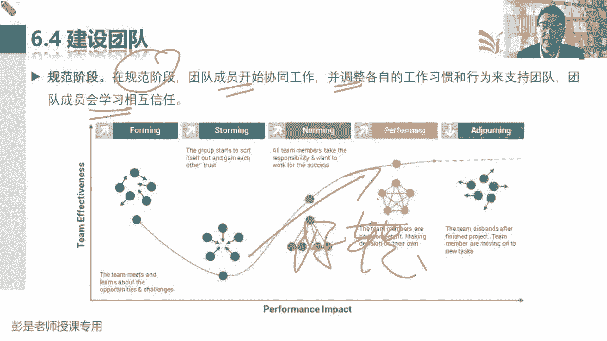

所以前面这段文字说出这样一个结论啊，说人尽管这些阶段通常按顺序进行，然而团队停滞在某个阶段也并非罕见，或者是退回到较早阶段的情况也并非罕见，对不对，大家已经形成默契了，哎我们可以很好的相互协作了。

这时候环境发生了变化，可能又会导致激发出一些矛盾，对吧，就两口子还还可能会吵架呢，就这道理啊，那如果团队曾经共事过，我们也可以跳过某些阶段，所以项目经理要知道啊，人的心情会发生各种各样的变化。

我们的士气会受到各种各样的影响，那中心思想就来了，咱的工作重心就是想办法缩短前三个阶段，让团队尽快达到成熟这样一个状态达到成熟，这是刚才有同学说的，我们前面讲到领导力风格。

我们希望打造一个成熟的自组织团队啊，希望打造一个成熟的自组织团队，由团队成员自行完成工作的规划，执行控制，我们呢就授权，授权之后，我们就变成服务型领导，能帮助的帮助，能指导的指导。

就做这种服务员就可以了，那如何缩短前三个阶段呢，所以接下来的知识点需要大家先听。

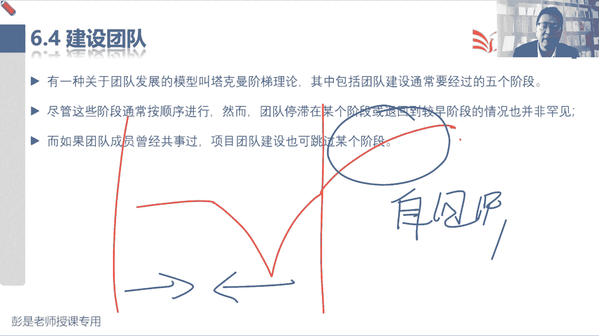

听完再做笔记啊，我们需要考虑在不同阶段采用不同的管理风格，领导风格，团建只是一方面，在不同阶段你要采取不同的行为，不同的措施了，行程阶段说我们刚组建好项目组，这个时候这个队伍怎么带呢，形成的时候啊。

刚组建好团队，这个阶段这队伍怎么带，哎熟悉对不对，大家倾向于相互独立，所以破冰就干这个事儿吧，让大家尽快的认识彼此啊，让大家尽快的知道我们这个项目组都有什么人，大家各自的工作职责是啥，大家的分工是啥。

这不就是对标到刚才我们说过的组织架构，责任分配矩阵对，还有那个角色岗位职责说明，让大家知道我们是干啥的，让大家知道张三干啥啊，李四干啥啊，王五干啥，所以一定要让大家知道我们项目做什么事。

让大家知道我们前进的方向，让大家知道在这个前进的路上，各自的分工是啥，对唐僧负责干啥，白龙马负责干啥，孙悟空你主要干啥，猪八戒你主要干啥，唉说清楚，让我们团队有共同的目标，让大家相互熟识熟知哈。

相互了解，所以这个阶段主要的指管理风格，就叫指挥或者叫指导，让大家目标明确，指挥或者叫指导嗯，前面见见过那个乐队指挥吧，让大家能够知道各自的分工，哎这就是这个阶段采取的风格，不要目标不明确，目标不明确。

大家就不知道往哪飞了，不知道往哪使劲了，那到了震荡阶段，到了震荡阶段，这队伍怎么带呢，说震荡阶段冲突多，矛盾多，冲突多，矛盾多，你还天天在那儿指挥指挥，发号施令，好像不合适了，这时候怎么搞呢。

这队伍怎么带呀，团建只是一方面啊，团建理论上来说可以贯穿始终，做思想工作，哎快到点上了，嘉伟同学说，做思想工作，做思想工作，那就是教大家，教大家如何相互包容，相互理解，相互信任，互相协作。

咱那对事不对人，那啊对事不对人，干活的时候，咱放掉咱脑子里边这些坏情绪呀，坏脾气呀，做好自我控制，然后呢咱想办法合作解决问题，哎所以叫教练这种管理风格，言传身教，以身作则，让大家相互信任，相互包容。

让大家学会团结友爱，对就是教练这种风格，因为要操心，最操心的就是这个阶段，然后到了规范阶段，他内有了好转，说大家开始协同工作，调整工作习惯，支持整个团队，我们是学会相互信任。

这个阶段采用什么样的管理风格呢，不需要那么操心了对因为团队有了好转，大家学会了这些东西啊，还不到散养呢，到了最后一个，到了第四，第四个阶段才是散养，第四个阶段是什么呢，放任授权，第四个阶段还是散养啊。

不管了，把权力交给团队了，那第三个阶段是为了授权做准备工作，因为第四个阶段我们是成员完成工作的规划，执行控制，成员做决策了，所以第三个阶段是什么呢，用参与式的管理风格，刚才见过一句话吧。

我们希望成员能够参与到计划的制定，希望成员能够参与到决策之中，提高成员的规划能力，执行能力，控制能力，提高成员的决策能力，哎这些能力得到了提升，这个团队就成熟了，我们就可以授权了，所以第三个阶段。

通常用参与式的这种领导风格对吧，这支持支持你们做主，支持你们做计划，支持你们自己做决策，实在不行，我再帮帮你，嘿，参与啊，支持啊，给大家给大家给大家鼓励，大家做这种决策，鼓励大家思考，鼓励大家提升能力。

最后呢就是为了打造一个成熟的团队，做好准备，咱就可以授权了，就这意思啊，所以这是每个阶段的特点，以及我们要掌握在不同阶段，采用什么样的管理风格，形成的时候，告诉大家做啥指挥指导，震荡的时候冲突多。

矛盾多，教练教大家如何相互配合，然后呢规范阶段呢团队有了好转，支持大家参与，让大家参与到决策中来，最后呢就是成熟的团队，咱就授权可以不管了，好就这个四个阶段采用什么风格好。

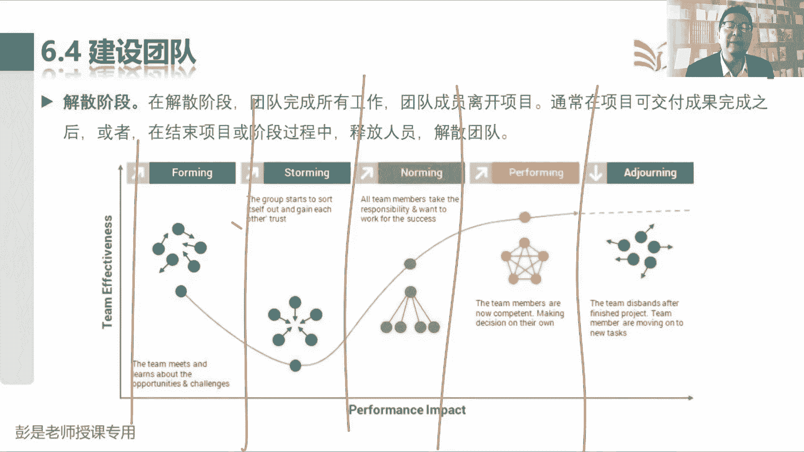

这就是这一章相对来说，信息量稍微多那么一丢丢的这么一个知识点，然后他的名字要记住啊，塔克曼团队发展模型啊，塔克曼团队发展阶段模型形成震荡，规范成熟，最后解散，这是一个大对勾。

那这个管理过程输入轻松加愉快，没什么东西了。

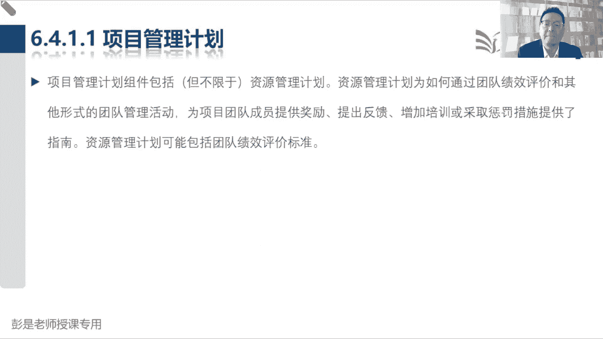

说我们是看看什么计划呀，文件呐，这都不念了啊，输出6421，这个管理过程主要的工作是给大家打鸡血，所以到底积血打进去有没有效果呢，就要输出一个团队绩效评价，然后他评价的指标其实也不。

现在不要求大家去记这种小细节指标，就是啊中心思想就是好的指标是不是上去了，坏的指标是不是下去了，也就是分析一下我们团建有没有达到预期效果，对吧，最近张三李四王五，赵六干活没激情，没热情，没动力。

打算可能张三啊，李四王五，看他们仨好像都不想干了，想离职啊，那咱高考团建提高一下凝聚力，看看大家这个离职的意愿是不是真的降低了，嘿那要写一个团队绩效评价，评价一下你这个团建的措施，团建的方法好使不好使。

嘶知道这个意思够了。

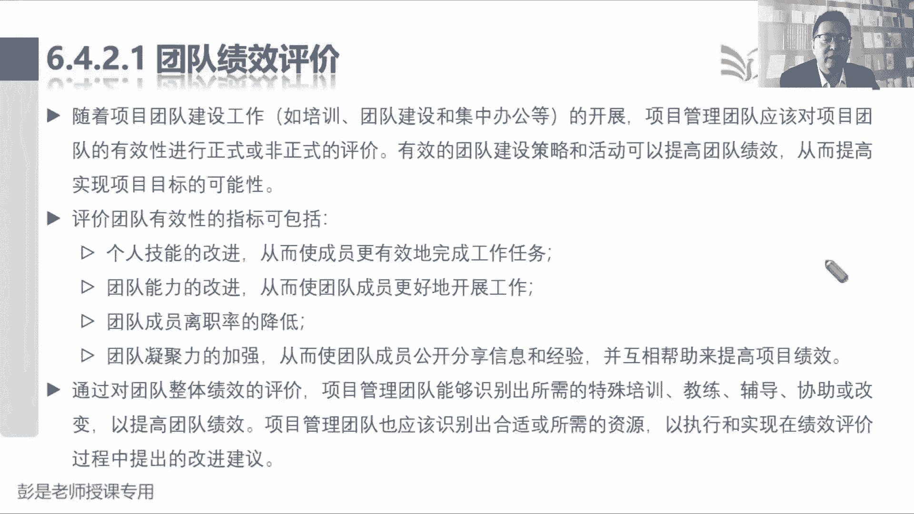

然后再往下这个管理过程会更新事业环境因素，这稍稍有一点点印象，三个过程会更新它一个叫获取资源，更新的是可用性，然后建设团队和管理团队更新的都是能力，搞团建张三，昨天晚上我们搞团建。

张三李四王五赵六喝了一顿酒，张三酒量有所提升，这也是能力的提升啊，那除了这种吃喝玩乐，还有正儿八经的各种各样的团建啊，包括培训也是团建的方法之一啊，所以我们通过团建。

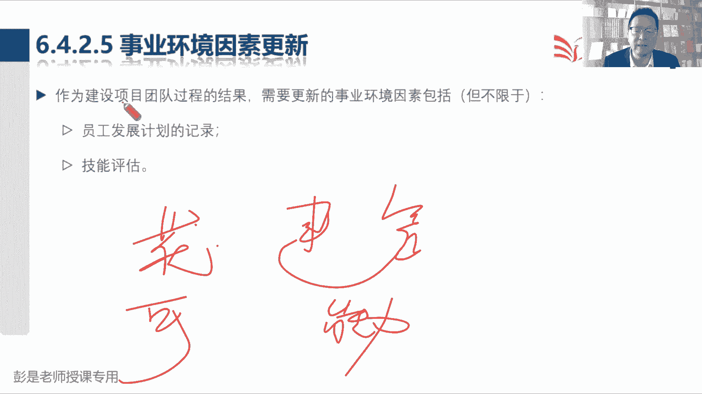