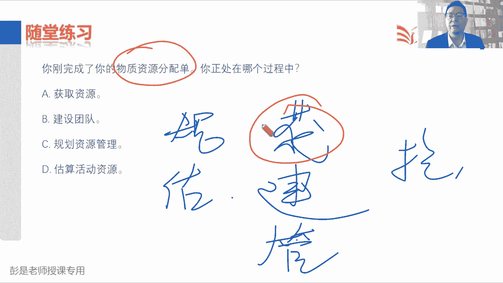
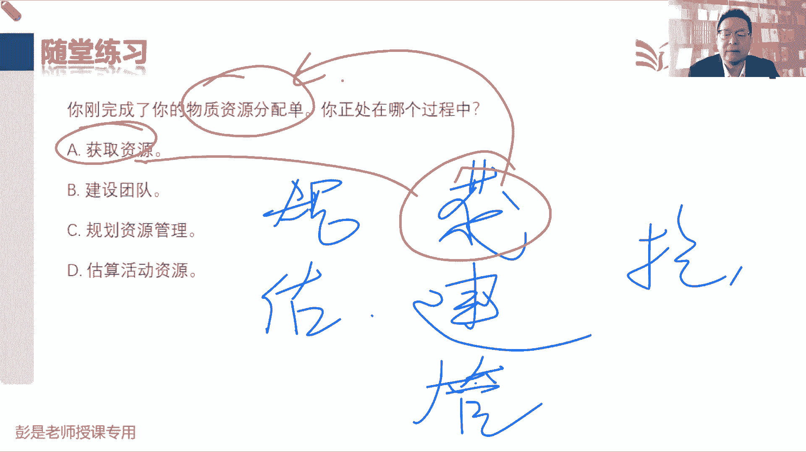
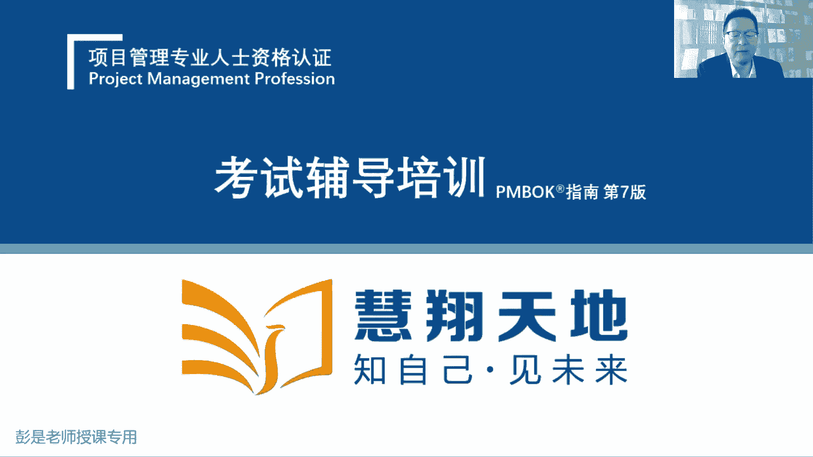
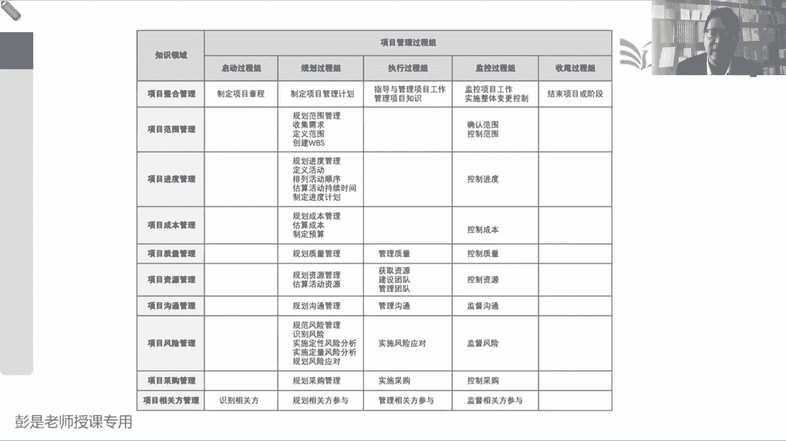

# 2024年最新版PMP考试第七版零基础一次通过项目管理认证 - P49：2.6.6 控制资源 - 慧翔天地 - BV1qC411E7Mw

最后一个管理过程6。6控制资源，这个管理过程大家学起来，基本上呢知道这个管理过程，最主要的作用就够了，确保所分配的资源适时适地可用于项目，并且呢不在需要时被释放，但是不要占着那啥不那啥，就这意思啊。

避免资源的浪费，避免资源的浪费，就让大家日常过日子，买的东西太多了对吧，有的东西可能会过期呀，然后怎么保存啊，怎么存储啊，实验设备设施怎么借用啊，怎么归还啊，这都得说清楚啊。

好所以它的输入输出工具看起来虽然很多，没有需要去记的东西，全都是见过的知识点，巩固之前见过的知识点，仅此而已，复习的时候，这个管理过程看一遍就够了，看一遍就够了啊，他就是管物资，确保物资的不浪费。

所以主要就看这段综述就差不多了，我们应该在所有项目驱动和整个项目周期中，持续地开展控制资源过程，适时适当分配资源，确保这个东西能够持续进行，然后呢说什么不浪费，不点了嗯，都不用背啊。

需要背的需要背的说了好几遍了，需要背的说了好几遍了吧，所以控制资源过程，监督资源的支出，识别资源的缺乏情况，然后根据需求使用和释放资源，出现问题的时候，通知相关方影响啊，后面就不念了，绩效和变更。

这是绩效和变更，然后收入呢没东西了，输出没东西看一看，复习的时候看一遍就完事了，好就做做资源这一章的练习题，这一章最核心的就是那个大对勾，然后虚拟团队和集中办公，剩下的就要知道每个管理过程的主要工作。

好看看这道题，你刚刚完成了你的人员奖励计划，正处在哪个过程之中，他这里边这个翻译啊很容易引起歧义啊，刚刚完成了你的人员奖励计划创建编制，写完编写完成，而不是对大家进行奖励，不是发奖金。

所以呢答案是C规划资源管理，不是发奖金，不是发奖金啊，完成了这个计划，把这个计划写完了，所以是规划资源管理，所以回顾一下规划资源管理做了什么事呢，想一想人怎么管，想一想物怎么管，人怎么管呢。

先画项目组的组织架构，然后说清楚大家在项目中的分工，再写一写每个岗位，每个角色你的职责，剩下的就是人员的招聘啊，配备呀，奖励呀，惩罚呀，培训哪团建啊，把这些计划都可以写一写，物资呢就是这些什么用品啊。

设备啊，设施啊，仓库怎么管的，怎么借怎么还的，把这些东西怎么管写一写，然后再出一个啊，看那章程说清楚人之间的这种行为准则，基本规则好，这就是C规划资源管理，还记得那五种权利类型吗。

这个大家应该记得还不错啊，章程授权给我们什么权呢，就叫政治权利，也称为法定权利，第二个呢就是奖励权，第三个呢就是有可能有惩罚权，这是公司给的，公司给不了的权利啊，一个叫一个叫专家权。

一个叫狐假虎威参考权参照权，所以这道题恭喜大家答对了，这是D因为他和公司的董事长是高尔夫球友，所以呢大家才愿意跟着他对吧，听他的听他的，因为他抱大腿了，这意思啊，好这道题，什么叫光环效应。

这个道理还是需要大家有一点有一点印象的啊，但考试基本上不大会考，准备了54321直接出答案了，答案是什么呢，是B光环效应标准的定义是B，说一个人如果很擅长技术工作，往往会把他提拔到管理岗位。

这就是光环效应，光环效应的目的是什么呢，大概听一听啊，光环效应的目的啊，就是一个人如果业务工作，业务业务好，我们就把它提升到管理岗，这样这个人头上就有什么了呢，光圈，它就会成为其他人效仿的对象。

张三技术水平高，现在升官了，唉我们也朝着这个方向去努力啊，就会成为别人的别人的，别人效仿的对象，诶，那通常我们可能有一些管理者，会用这样的方法来对我们的员工形成自己，形成激励对吧，你看张三水平高。

就变领导了，你们也行啊，想办法想办法通过这样的措施去激励大家，朝着这个方向去努力，但是话又说回来，话又说回来，事物都有两面性啊，一个人擅长技术工作，他就一定也擅长当领导吗，不一定了吧，对不对。

技术能力强不代表着说会管理，所以大家为什么要学项目，项目经理，项目管理呢，就是想提高我们的管理技能啊，哎这个道理啊，所以事物都有两面性，技术技术出众的人不一定擅长管理，可能会把这个事情管得一团糟。

所以要慎重，他在提醒我们采取这样的措施，一定要慎重，要综合的分析这个人到底行不行，对如果真的他又懂技术，又又懂管理诶，那我们我们可以采取这样的措施，让其他人去打鸡血嗯，C和B看起来一样。

但是C没有说这个东西啊，光环效效应啊，这是在警告各位同事，你想对可对人，把别人让人升官，让人升官，你要去分析综合考虑周全啊，这个人到底技术能力强不强啊，懂不懂管理呀。

这两个能力如果都OK才可以采取这样的措施，他和那个奖励，这奖励写的太虚了，讲什么呢，不知道啊，可能讲可能讲金钱有形无形，所以光环效应的概念就是B没啥可解释的好，所以大概知道有这个印象啊。

这个这个东西工作中要慎重，好在这道这道题是什么东西呢，这送分题吧，这送分题可以过了吧，说发工资发奖金，这就是奖励权，你在为团队编写绩效评估，现在正处在哪个管理过程，简单吧，规划资源管理出资源管理计。

划出团队章程，估算活动资源出资源需求，然后估算依据出一个资源分解结构获取资源，人家安排工作物资叫派工单，然后建设团队关注的是什么呢，团队绩效啊，建设团队关注的就是团队绩效啊。

为团队对于团队开展完团建之后，团队绩效发生了什么样的变化呢，所以他的输出叫团队绩效评价，答案是A管理团队输出没什么东西啊，他不评估绩效，他就是看看我们人有没有问题，它是根据我们的绩效去判断人有没有问题。

来解决问题，处理冲突，编制就是输出啊，建设团队管理过程，编制团队绩效评价呀，你看看管理团队输出，有团队绩效评价吗，他是根据绩效看看人有没有问题，大家实际工作中不都这么干的吗，对不对，什么叫管理团队。

张三上周应该应该种100棵树，张三上周只种了80棵树，绩效比原计划少种了20棵，张三这会儿这人能力不行，看看是不是该培训的培训，该指导的指导，该辞退的辞退，这才叫管理团队。

他是根据你团队敲项目的绩效来分析，人有没有问题，是能力问题啊，态度问题呀，水平部问题啊，道德问题呀，然后该变更的走变更，这叫管理团队，他不是来给团队写绩效的好，所以答案是A去看一看建设团队的输出。

刚才特意讲的那个东西，然后你在一个弱矩阵组织中工作，你对团队没有法律法定权利，为啥呢，这个简单需要猜一猜了，最惨的叫智能型，好一点的叫弱矩阵，再好一点的银行矩阵，然后强矩阵最大的项目型。

我们在项目上的权利从小到大，并且职能型弱鸡战士职能经理掌握项目的预算，人家说了算，他掌握项目的预算，他说了算，所以他的权力比咱们大，那什么东西能够体现权力的大小呢，就是这个汇报级别，他拐了个弯儿啊。

汇报级别能够汇报对象就能够是谁，就能够体现权力的大小，我什么事情都要向张三做汇报，张三权利比我大，张三干活需要向我做汇报，那说明我权利比他大，这东西啊，好汤姆在使用一个组织图，得出如何配备项目的人员。

正在完成哪个管理过程，下班就溜，同学下班就就溜，同学再看看志伟小点点同学，蓝玉同学，琳娜同学，关键词是啥呀，快打开快打，这玩意儿写到哪儿，如何配备，如何团建，如何培训，如何招聘，如何遣散，如何奖励。

如何惩罚，哎，这都叫资源管理计划的内容，所以就叫规划资源管理，所有的这些管理计划，他的主要工作都是how啊，怎么收集需求，怎么定义范围，怎么创建WBS嘿范围管理计划的内容，需求管理计划的内容。

以此类推了啊，就这两个字就中招了哈，如果说根据组织图进行项目人员的配备，这才叫获取资源吧，该招人招人哎，对不对，就这么阴间啊，所以才要课上做题啊，就是帮助大家尽量的掌握一些小细节，提高阅读能力。

提高判断能力，分析能力好，这道题选啥，这道题也影响啊，哎就是选B还是选C呢，现在是什么状态，未来是什么状态，现在是在，行程吧，哎现在在这儿啊，然后你注意到形成阶段效率也不高啊，你担心什么呢，担心啊。

未来可能会有各种各样的冲突矛盾，未来会进入到震荡阶段的，对不对，所以呢现在是B正在建立，这是形成阶段，正在组建团队，坑啊这道题继续坑，这道题每次都坑，好54321买定离手啊，不少同学选了D哈。

说一个项目经理，一个项目经理在管理团队方面遇到了麻烦，因为团队总是开会迟到一项，哪一项最有可能是这个问题的原因，团队开会，团队开会迟到，团队开会迟到，但能想到什么知识点，说明这些人现在什么呢，没规矩好。

没规矩啊，那团队发展的震荡阶段是说冲突多，矛盾多，士气有所下降，震荡阶段就一定会可以不守规矩了吗，有这个因果关系吗，我和张三观点不一致，我就迟到，我和李四观点不一不一致，我就迟到，我和王五观点不一致。

我就不打卡了，不行吧，对冲突多，矛盾多，不代表着说我们就可以不守规矩，这是两回事，就这个理就这意思吧，所以D没有办法推导出，没有办法推导出这个结论啊，它的可能性没有这么大，那可能性更大的选项是什么呢。

说开会迟到，开会迟到没规矩，两种可能性，第一种可能性就是真的没有团队章程，有的企业可能没有考勤制度，那大家上班就迟到，对不对，第一种可能性是没有制度啊，第二种可能性是什么呢，有规矩。

但是这个规矩被怎么样了，这就需要大家知道一个管理学的常识，一个有一个规则被破坏了，就会变成一个什么东西呢，羊群效应，破窗效应大家听过吗，羊群效应是啥呀，咱都说带头羊，带头羊为什么叫领头羊呢。

小羊咩咩羊有什么特点啊，有一只小羊往一个地方一走，这一群羊猴儿跟风，这就是羊群效应，然后破窗效应是什么呢，就是我们看到这个窗户，如果四个玻璃都是完整的，可能不愿意，也不太敢扔石头去打他。

但是如果发现旁边这个窗户啊，有一个玻璃已经碎了，已经碎了，唉不多，我这一块吧，我再扔个石头，没关系啊，规则一旦被被打破，一旦发现没有人守规矩，我们就可以啊，羊群效应了吧，跟风啊，所以就是中国式过马路。

大家听过这个吗，咱过马路有什么特点的，攒够一波，有人一带头就过去了，管他红灯，绿灯的羊群效应，破窗效应，不守规则，就是这个道理，我们发现有人插队，有人加塞，如果没有，也没有人制止他的话，那我也加。

我也插队，就这个逻辑啊，发现有人乱丢垃圾，没有人管，那我也扔垃圾，发现有人闯红灯，没有人管，那我也闯红灯，所以就是有人带头破坏规则，相对来说可能性更大的，反而是C因为领导带头破坏规则，羊群效应。

破窗效应，对不对，领导是领头羊啊，领导破坏规则呀，规则一旦被打破，可能就形同虚设，这个大家实际工作中想一想，这样的这样的例子应该比比皆是吧，定的考勤制度也没有什么惩罚措施，领导啊，3年两头都迟到啊。

那咱也迟到呗，对不对，上梁不正，下梁歪，考试没有这么刁钻啊，只是通过这道题，让大家更好的理解我们那个团队章程，它的重要性，大家制定好了团队章程啊，尽量的要去全员的去维护它，不要轻易的破坏规则。

并且呢在咱国内，大部分大部分讲人际关系的这样团队里，很容易打破规则，对不对，想一想，比如说比如说你的成员呢有些有些特殊要求啊，你可能满足他了以后啊，规则被打破了，诶这个口子一开，千里之堤。

千里之堤溃于蚁穴，就这个道理啊，好知道这个意思就够了，所以就告诉我们这么一个中心思想，团队章程意味着基本规则，规则定的越早越好，规则呢规则呢最好成员参与规则的制定，并且呢大家达成共识的这个东西啊。

不要轻易的去破坏它，不要不守规矩，不要不守规矩啊，不要违背他，不然很可能起到什么羊群效应，破窗效应，这个规则就形同虚设了，告诉我们这么一个管理常识，就参考过马路对吧，随地吐痰，骑电动车不戴头盔对吧。

什么逆行逆行闯红灯，如果没有得到有效的制止，那我们也这么干，反正没人管，这个交通规则就形同虚设，好那再往下了啊，这道题比较好判断了，通过阅读题目可以得到一个结论是什么呢，团队的情况在朝着好的方向在发展。

有好转有好转，那就找规范，对不对，开始有了好转，就是规范往上走了，这个简单啊，这个，规划资源管理估算资源获取资源，建设团队管理团队控制资源，说刚刚完成你的物资分配单，这个房间规章三，这个电脑归李四，哎。

这个车归王五，这是拿到资源之后进行资源的分配，所以他的输出叫物资分配单，人呢就叫工作安排哎，这就是获取资源这个管理过程。

这大概问题不大好。

C和D肯定不对啊，现在是拿到资源进行分配，获取资源输出，物质资源分配单，这就是大概资源这一章比较重要的一些知识点。

其实过程输入输出啊，真的没有想象中那么多。

嗯然后上午还还没下课呢，啊还没下课没下课，咱咱不可能提前下课。

提前个几秒钟还说得过去，那接下来看看这张图啊，回顾说整合搞定，范围进度成本质量资源都搞定，接下来六大制约因素还剩最后一个范围，进度成本质量资源和风险，所以呢下接下来咱先讲风险管理，沟通管理啊。

这这一章我们放到后面再说，沟通管理，未来我们会和相关方管理一起一起讲，因为相关方管理就涉及到沟通，这两张差不多相辅相成，相互交集，所以咱把高中这一章把它往后调，咱先讲风险，讲完风险，讲采购。

讲完采购再讲沟通和相关方，那接下来我们要讲风险管理，需要先给大家大概说一说这几个管理过程，它的主要工作，并且呢做过预习的同学应该应该还好啊，看看这些管理过程的名字啊，如果能猜到这个管理过程做什么事。

基本上不太需要具备了，并且大部分管理过程就是字面意思，规划风险管理，看看风险怎么管，监督风险，看绩效管风险的变更，识别风险，那就是找风险呗，然后规划风险应对就是规划风险的应对措施，规划风险的应对措施。

就像55。7度同学说，好饿呀，唉这对我们来说，未来就是个已知风险，上午上午12点左右下课，可能会饿，可能会低血糖，那规划好应对措施，准备好一些小零食，避免自己头晕眼花，这是道理啊，那实施风险应对。

把它放到了执行过程中，意味着我们规划好的应对措施，不能掉以轻心，不能麻痹大意，不能侥幸心理，要坚定不移地把它落实执行下去啊，把他坚定坚定不移地落实执行下去，这样疫情期间，什么叫实施风险应对。

为什么要持续开展，对不对，该戴口罩，戴口罩，该喷酒精，喷酒精，该消毒消毒，可把这些应对措施落实执行下去，所以呢唯二需要大家稍稍理解一下的管理过程，就是实施定性风险分析和实施定量风险分析。

这两个管理过程啊，说起来啰嗦，但实际上超简单，风险这一章大家就完全用新冠疫情，我们储备的知识储备的经验去分析就行了，什么叫定性风险分析啊，比如说识别风险是找风险好。

我现在发现张三李四王五赵六四个可疑人员，这四个就叫单个风险，这四个就要单一风险吧，张三可能传染新冠，李四可能传染新冠王五，疑似赵六疑似，那接下来要干啥呢，分析对不对，张三是什么密切接触者呀。

看看这些人发烧不发烧啊，有没有症状啊，有没有同时空交集呀，以此类推做核酸检测呀，嘿这是分析这四个风险人群的情况，然后分析的目的是什么呢，排序呀，看看谁是高风险人群，谁是中风险人群，谁是低风险人群。

对不对，张三是密切接触者，这是高风险人群，李四啊是次密切接触者，王五是次密切接触者，这俩人是中风险人群，赵六诶，和和他们可能离得比较远，他是第一风险人群，这个操作就叫定性风险分析，这叫定性风险分析。

对找到的每个风险做排序做排序，确定这些风险到底是重大风险的，一般风险呢还是低风险呢，就定性，这叫定性的结论的，那定量风险分析干什么事呢，刚才张三李四王五赵六，这是单一风险，一个一个的风险啊。

它是每一个单个风险，那定量风险分析啊，就是对整体做量化分析，量化评估，什么叫整体呢，就想想在疫情期间，什么北京市全国省市县以色列对吧，对整体情况做统计分析，对整体情况做量化分析，我们整个地区对吧。

什么疫情扩散的可能性大概是多少，整个地区我们还需要多少天就可以解封了，目前我们整个地区这个疫情的发展状态是什么，发展的趋势是啥诶，定量风险分析就是对整个项目做量化分析。

只要分清楚定性和定量这两个这两个管理过程，这一章基本上没有什么难点了，所以找风险找风险，找到一大堆一大堆单个风险，找到一大堆风险人群，然后定性分析是分析这些单个风险，分析这些风险人群谁高谁中谁低诶。

对他们做排序对吧，就像疫情期间我们分成高风险人群，集中隔离对吧，集中隔离中风险人群可能就居家监测了，给你上门词，低风险人群，那你把它就溜达，照顾好自己啊，他是对风险做排序。

排序的目的是为了规划出不同的应对措施，那对对这些对这些单个风险都做了分析之后，接下来我们要对整体情况做量化分析，整个地区整个国家整个城市，那对标到项目，我们就要分析整个项目的范围啊，进度啊，成本啊。

质量啊，对整个项目做量化分析，这就是定量风险分析，然后接下来就可以规划风险的应对措施，然后确保这些应对措施能够落实，能够执行，不要侥幸心理，最后呢监督风险就是看看风险有没有变化呀。

看看应对措施管用不管用啊，对看看有没有新的风险人群，看看这些已经已经集中隔离的，有权利的，该回家的回家看看我们戴口罩好使不好使，这都是监督风险关注关注的重点，这叫绩效和变更好。

给大家大概说一下这张主要做什么事啊，接下来咱就吃好喝好。

