# 2024年最新版PMP考试第七版零基础一次通过项目管理认证 - P4：1.1.3 项目、项目集、项目组合及运营 - 慧翔天地 - BV1qC411E7Mw

好1。3项目项目及项目组合和运营，项目单词咱搞定了，运营咱也搞定了，那这一小节我们需要掌握项目集和项目组合。

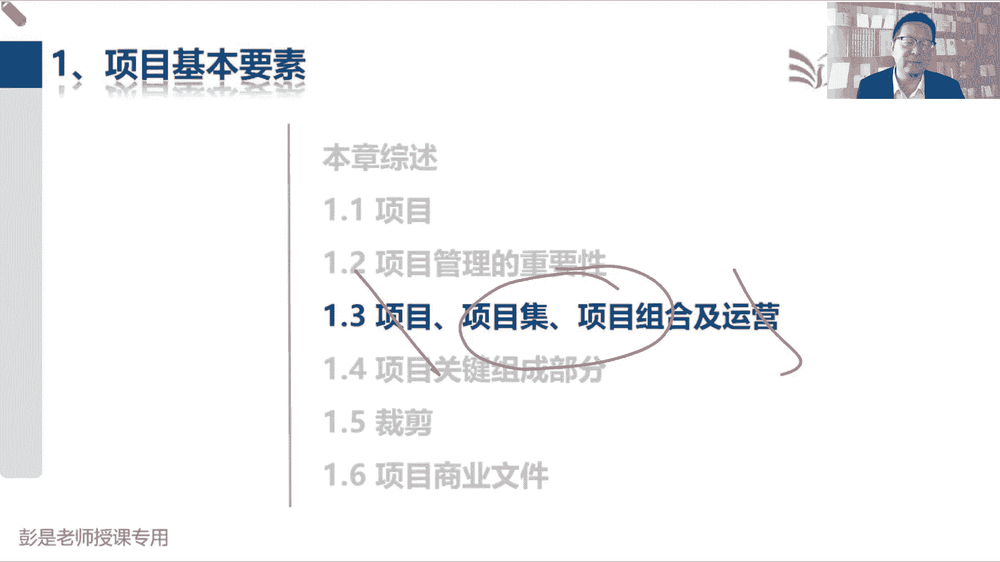

看看这段文字怎么说的，项目管理过程，工具和技术的应用，为企业达到目标奠定了坚实的基础，一个项目可以采用三种不同的模式进行管理，作为一个独立的项目，在项目集之内，或者是在项目组合之内，那需要大家猜吧。

项目集是什么呢，项目组合是什么呢，项目集是啥，项目组合又是啥呢，他俩本质上其实都是多个项目的管理，多个项目的管理方法，那到底什么是项目集，到底什么是项目集啊，他是说呀，多个项目之间如果存在着依赖关系。

或者叫关联关系，两个项目A和B如果存在着依赖关系，关联关系，那要不要把这两个事情给他协调好呢，能想到什么场景，两个事情如果存在着依赖关系，关联关系，要不要把这两个事情给他协调一下，最好理解的场景。

就像各位同学，你想一想哈啊买房，上学这两个事情会不会相互影响，会不会相互影响，买什么地方的房子就在那上学，是这个逻辑吧，并且现在有些地方还有学区房这个东西哈，嘿那万一买房买错了，小影响小孩的上学了。

这不就会相互影响了吗，唉这种情况下，那咱把这两个事情啊给他协调好，对不对，避免因为买错了房子影响小孩上学，那以此类推，就像各位同学，你们举个例子，比如装修家里面装修和买家具，这是两个项目啊，装修装地面。

刷墙壁和买家具，这两个事情要不要协调好呢，这边还没装修完呢，家具到了进厂了，弄得暴土扬尘的都给家具坏了，这事儿不行啊，我们需要把这两个事情啊给他协调好，给他协调好，以此类推，所以就是多个事情之间。

如果存在着这样的关联关系，依赖关系，我们要去思考好如何如何，怎么把这两个事情给他协调好，怎么把这两个事情给大家协调好，就这意思啊，这就是项目机管理的工作重心，就像滴滴同学说，两个项目之间存在着接口联调。

这也算吧算吧，对不对。

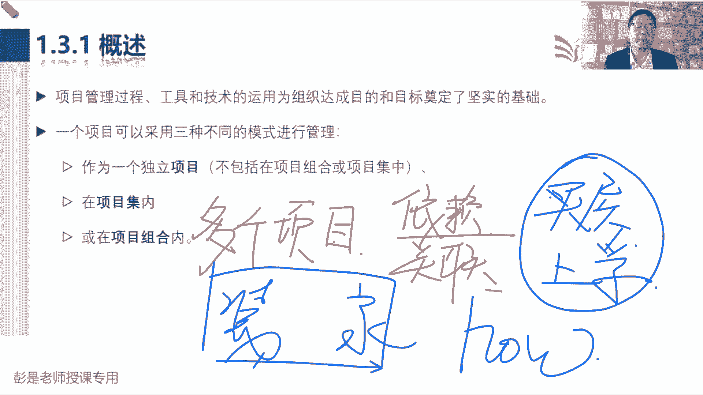

大家工作中这个太细了，要有印象就可以了啊，说A项目和B项目两个项目之间，你程序之间要调接口，那你要同步吧，等你准备好了，等别人也准备好了，并且大家都有档期，都有时间做这方面的调试，它就会相互影响诶。

那我们需要有一个人跳出来，把这两个事情给他协调好，这就是项目积极管理，所以他的他的管理的思想工作重心是什么呢，就是多个事情之间存在着这种关联关系，我们把它想办法协调好，这样呢想办法做到1+1大于二。

不要对我们的整体产生影响，这就是项目企业管理的中心思想嗯，嗯大项目下有多个子项目运转性，互相影响协调开始也是这个逻辑，道理是一样的，你只要明白了这个底层的逻辑怎么举例子，怎么有，过年过年。

我们张三李四王五赵六在这桌喝大酒，我们需要等他喝完酒，用这个桌子打麻将，你说这两个事情之间会不会相互影响呢，会那咱就需要有人跳出来给他协调一下，对不对，让你们尽快的喝完，不要影响我们打麻将啊。

就这个逻辑啊，总之就是多个事情，我们要多个事情，如果会相互影响，相互关联，相互依赖，咱把这些事情给他协调好，这就是项目集管理，他的工作重心，工作重心啊，所以他关注的是什么呢。

这叫如何怎么把这些事情给他协调好，怎么把多个项目给他管理好，项目管理关注的是什么呢，也是好，对不对，如何更好地完成任务，实现目标，得到期望的结果，他只不过是单项目单项目啊，怎么把这个饭吃好。

怎么把这个麻将打好，这是项目经理关注的中心，项目及经理关注的是什么呢，吃饭和打麻将，咱把这两个事情给他提调，哎这些东西，那项目组合工作重心是什么呢，他就不是号了，他的工作重心啊是what是做什么。

因为对企业来说，你要做的项目啊可能有很多呀，可能有很多吧，我们要研发个什么新的汽车，我们要改一个发动机，我们要研究麻辣烫，厨房那边还要改造，前餐厅还要装修，我们还要把我们的系统对接美团饿了么。

我们还要还要还要还要给大门换个保安，然后房间里装个监控，可能有很多项目，并且呢还有运营工作在开展，要做的事情，这么老多要做的事情这么多，对企业来说通常有限制的是什么呢，人财物，对吧。

我们的人财物是有限的，那怎么把有限的人财物投入到无限的事情之中，需要干啥，要做的事情那么多，有些是人财物，那我们就要考虑了，都说都说好钢用在刀刃上，如何有效地把我们这些精兵强将，用在重要的事情上。

把一些不重要的人用到不重要的事情上，诶就需要排序了，好钢用在刀刃，好钢用在刀刃，让我们项目组合关注的是什么呢，找到刀刃对不对，然后投入我们的精兵强将，所以他关注的是word，他关注的是做什么事情。

能够帮助企业，更好的是帮助企业更好地实现战略目标，做什么事情能够更有价值，更有意义，在什么事情上，我们投资投资投资投资的钱最多才有意义，所以他项目组合，项目组合其实就是从投资，从投资这个领域出来的。

大家比如说个人投资，个人投资，各位同学，你挣了钱以后把这个钱放到哪，有的人可能就花了，有的人呢有的同学可能就像现在来听课的同学，你不是把钱花在学习上了吗对吧，有的人是把钱投到女朋友，男朋友身上去了。

有的人呢是买理财，买基金对吧，存存定期诶，那这个钱投投到哪最有价值呢，项目组合管理，所以他的中心思想就是一堆事。

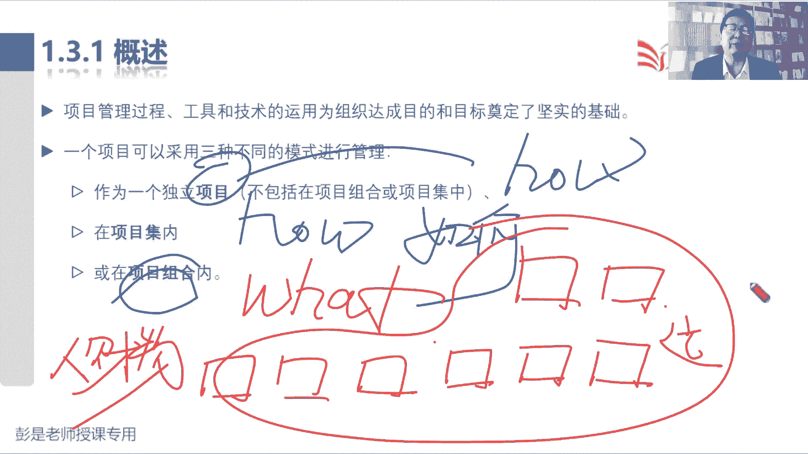

排排序，对企业来说要做的事情有一大堆，有项目有很多项目，还有很多，还有运营工作要做的事情这么多，那咱就需要四分轻重，缓急排排序，告诉我们什么事情更重要，什么事情不重要，从而合理的分配人才。

不所以中心思想就是好钢用在刀刃上，好钢用在刀刃上，那你要告诉老板刀刃在哪，所以他关注的是做什么，做什么，对企业来说是正确的，对不对，现在生意生意这么差，你还花钱去装修，还花钱装监控，没必要没必要。

咱先花钱转型吧，对不对，先上麻辣烫，上完麻辣烫，然后马上做宣传，再推做推广，吸引客户来等人进来，我们攒点钱再装修，以此类推，就是排序，就是排序，这就是这三个管理方法，他们的工作重心不一样。

项目经理关注的就是如何完成任务，实现目标，得到期望的结果，项目及经理关注的是呢，有很多事情他们之间存在着关联关系，依赖关系，那我怎么把这个事情给他协调好，从而想办法1+1大于二，避免浪费时间对吧。

避免浪费钱呢，就像买了房子，发现这个地方没有什么重点中学，没有重点小学，那我再买个房子，这不是浪费时间，浪费钱吗，所以他关注的是想办法1+1大于二诶，创造额外的收益，项目组合管理。

他的工作重心关注的就是how，就是word，就是我们要做的事情这么多，什么事情更重要呢，什么事情优先级高，什么事情优先级低，对这些事情做排序是分轻重缓急，从而合理的分配我们企业的资源和资金，好了。

这就是这三种管理方法，它的中心思想，这段文字。

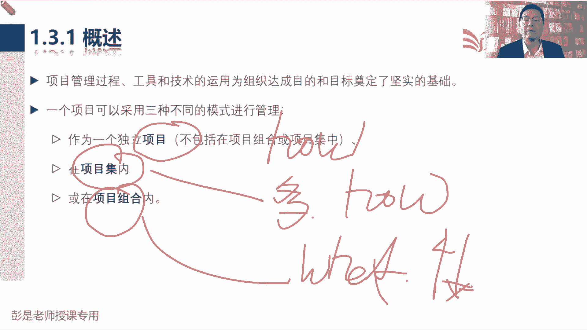

这段这段大道理听完了之后再看书上教材，这段文字就简单多了说呀，如果在项目组合和项目集管理某个项目，那么我们需要和项目集经理，项目组合经理互动，例如未达成组织的一系列的目的和目标，可能需要实施多个项目。

在这种情况下，项目可能会被归入项目集之中，项目集是一组相互关联，被协调管理的项目，子项目集和项目集的活动，以便获得分别管理所无法获得的收益，这段文字啊，第一项目其实里面的这些这些事情互相关联，互相依赖。

需要去协调，需要去运筹帷幄，第二项目子项目集和项目及活动，这不需要大家去背啊，但是只要能粗暴地理解这个字是什么意思，刚才也有同学说过，大项目可以拆成子项目诶，那道理一样，项目集如果太大了。

我们就可以把项目集拆成一大堆更小的项目集，项目如果太大了，咱就可以把项目拆成一大堆小项目，就称之为子子项目，以此类推了好，所以项目集里面可能包含一大堆东西，来获得分别管理无法获得的利益。

就想办法1+1大于二就可以了，然后再往下说，有些组织可能会采用项目组合，以便有效有效管理，在任何特定时间内，同时进行的多个项目集和项目，项目组合是指为实现战略目标而组合在一起。

管理的这一大堆工作是什么意思呢，就是你对事情符合战略目标的事情，放到一个圈圈里，然后呢排排序，合理的分配人财物，帮助我们更好地实现战略目标。

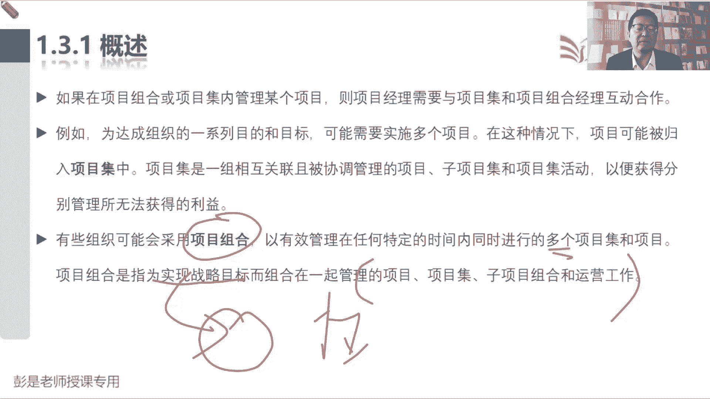

好再往下走了啊，所以书上给了这样一张示意图，这张示意图呢也不需要去背，不用背啊，听一遍就完事了，他就是告诉我们啊，比如说他举了个例子，说项目一是一个单独的项目，把它完成就可以了，他和其他事情没有相关性。

并且呢它和公司的战略没有相关性，就是临时事项，临时事项，比如说今天接到通知，我们去做核酸，咱把核酸做完就完成了，这事儿啊跟战略也不相关，对不对，把它完成就可以了，他就是这样一个临时的临时的事情哈。

那项目二和项目三把他俩放到了项目及A里，说明什么呢，说明项目二项目三存在着关联关系，依赖关系，需要有人站出来去协调，想办法1+1大于二，然后中间这一段的项目及B又被拆成了，项目及B1说明什么呢。

说明项目级别太大了，所以把它拆成了一个子项目级，子项目集里面包括项目四，项目五还能听懂这个意思就够了，最后呢就是项目组合，他关注的是能不能帮助公司实现战略目标，所以呢它里面可能包括项目及项目一大堆事情。

我们需要对它排排序，合理的分配人财物，最后最后记得结论是啥啊，运营这张图示意示意的不太好，运营有没有可能包含在项目组合里面呢，很可能我开了个牛肉面馆，现在手头上没有项目，我的工作重心就是运营。

就这个场景吧，不不是所有的企业在任何时间都有项目的，对不对，那现在我的主工作重心就是运营，运营追求的是什么呢，标准化规范化，让厨师做出来的牛肉面哪都一样啊，然后呢要降低成本，提高质量，增加收益。

提高效率，还工作重心就抓运营去了，所以项目组合里边可能会包括项目项目集，甚至可能会包括运营好，这张图能看懂啊，最后一个小问题，项目集里边有没有可能包括运营呢，项目经理边有没有可能包括运营，换句话说。

这是项目和运营之间，有没有可能存在着某种关联关系，依赖关系，项目和运营之间会不会存在着关联关系，依赖关系很正常啊，对不对，很正常，项目会不会影响运营啊，会啊，我们牛肉面馆转型麻辣烫麻辣烫。

我们买回来的麻辣麻辣烫设备啊，上面印的都是什么法文，俄文，俄罗斯文，操作手册，全都是外语的，我们服务员厨师看不懂啊，不会用啊，不会用啊，对不对，就会影响到运营，那我们要考虑把这两个事情给他协调好。

你买的设备厨师会不会用啊，对不对，现在尤其是一些什么智能设备呀，对吧，都拿手机啊，平板啊，噼里啪啦一顿操作呀，那人家会不会使用啊，像餐厅餐厅说接美团，接饿了么，嘿人家美团下了订单，你餐厅怎么就知道了。

那你不得上个什么系统吗，上了这个系统之后就用什么打印机，这事儿咱要影响到运营了，让厨师啊，服务员啊，适应这个新的工作流程啊，诶这种情况下，项目和运营，我们也需要把这两个事情给他协调好，避免浪费。

避免把活干错了好，所以是有可能的啊，有可能的，所以这种情况下，项目集也有可能会包含在运营，也有可能会包含在项目集之中，总之各种可能性总是一个人可能性啊，好那就我就再加戏了啊。

说运营可能会包含在项目组合之中，说明了他和公司战略相匹配比较重要，那咱就把它放进去排排序，合理的分配人财物，运营也有可能包含在项目集之中，因为运营和项目可能存在的关联关系，需要我们去协调。

希望我们去协调啊，最后一个小问题啊，运营有没有可能包含在项目之中，这才是刚才有些同学说的话，就想到那个表情包，不可能绝对不可能它不是一回事，它不是一回事啊，不可能去，这回真的绝对不可能了，运营是运营。

项目是项目，我们学项目管理要把这个概念给区分出来啊，所以刚才讲过项目管理的边界。

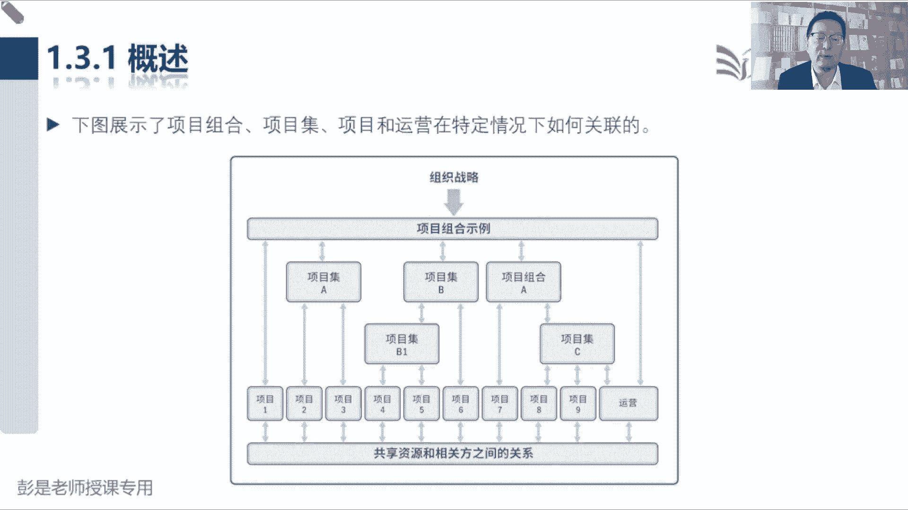

还记得吗，等我找一个空白的页，咱马上就中间就可以休息了，说这是需求评估，商业论证，效益计划的制定，这事是通常是项目启动之前的事情，项目中间呢项目经理带着兄弟们完成任务，实现目标，然后项目结束以后。

可能需要把我们的产品服务成果已交给运营，从概念上来说，运营不包括在项目之中，从概念上来说，运营不包括在项目项目之中，这个大家一定要一定要和工作场景里面，不要混到一起啊。

工作场景里面你可能会遇到这样的情况，叫什么呢，你签的协议是项目加运营的模式，能想到吗，你工作里面签的合同可能是项目加运营，比如说高速公路建设，我们给国家修公路，修个100km，高速公路修完了之后。

国家不出钱呢，那怎么办呢，我们运营啊，我们运营啊，运营是赚钱的，嘿这时候签的协议是项目加运营，但是项目管理有项目管理的方法，运营管理有运营管理的套路，概念上来说，这俩不是一回事儿啊。

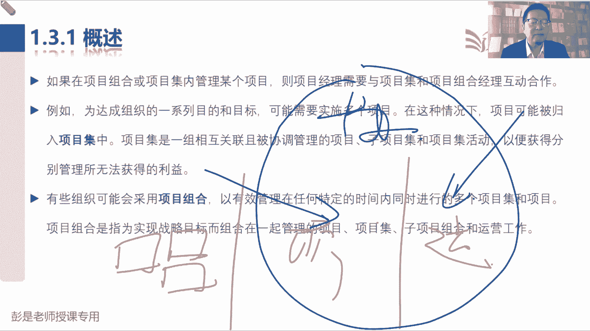

好知道这段文字，那接下来大家就可以重大利好一下，休息一下，然后我们再去看项目及项目组合，这些枯燥的概念啊。

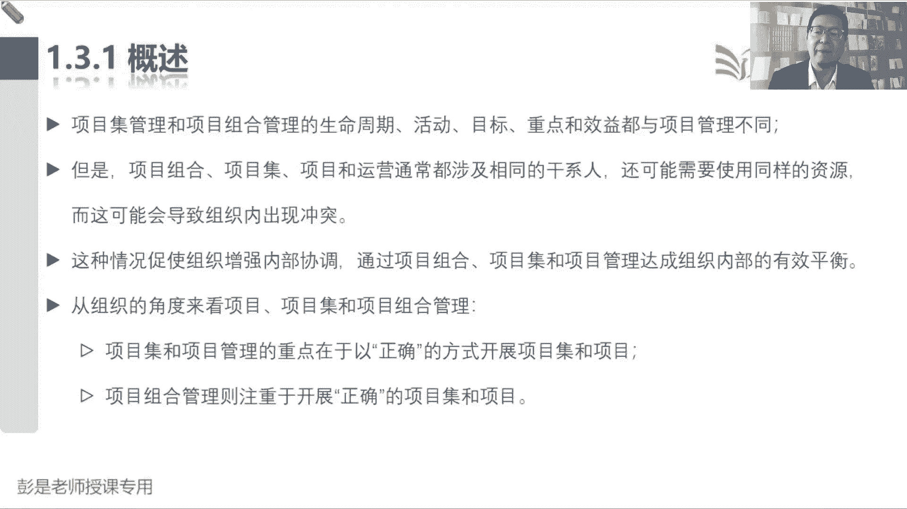

现在是14。25，咱休息8分钟，时间休息到14。33，好接下来各位同学，咱们正式开始第二小段课程，刚才大概说了这些项目啊。

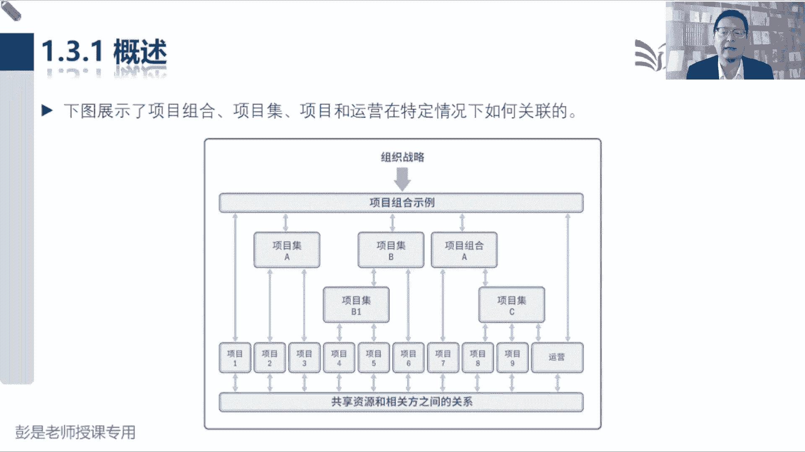

项目组合这个逻辑关系，再往下看文字就没什么东西了，好所以再往下找项目集管理和项目组合管理，他们的什么什么巴拉巴不行，不一样，然后呢，我们要什么什么干系人，什么什么资源冲突平衡，这都看一看就够了。

这句话以标搞定，从组织的角度来看，项目项目集和项目组合管理，项目集和项目管理，它的重点在于以正确的方式开展项目和项目集，所以他们关注的是好项目经理，关注的是项目经理关注的是怎么完成任务，实现目标。

得到期望的结果，项目结构经历，关注的是怎么把这多个事情给大家协调好，避免相互产生影响，对，而项目组合管理，重点关注于开展正确的项目和项目，及他的工作重心就是what，做什么事情对企业来说是正确的。

正确的事情，我们就要投入精兵强将，对不对，有价值的事情有价值的事情啊，这样帮助企业更好地实现战略目标，所以考试这种东西基本上也不大，考考试超简单，就那几个关键词，一堆事相互关联，相互依赖，项目集一堆事。

事分轻重，缓急排排序，合理的分配人财物，哎这就是项目组合。

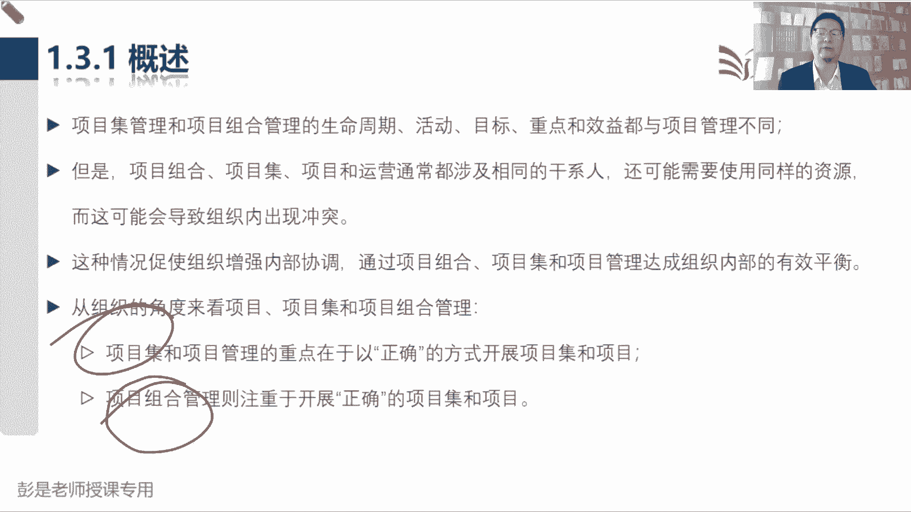

那1。3。2，从现在开始，这段文字呢，各位同学基本上也就是读一遍就完事了，说项目集管理又告诉我们项目集，然后项目企业什么关注的就是依赖关系，确定管理这些事情的最佳方法，然后呢什么重点就是依赖关系。

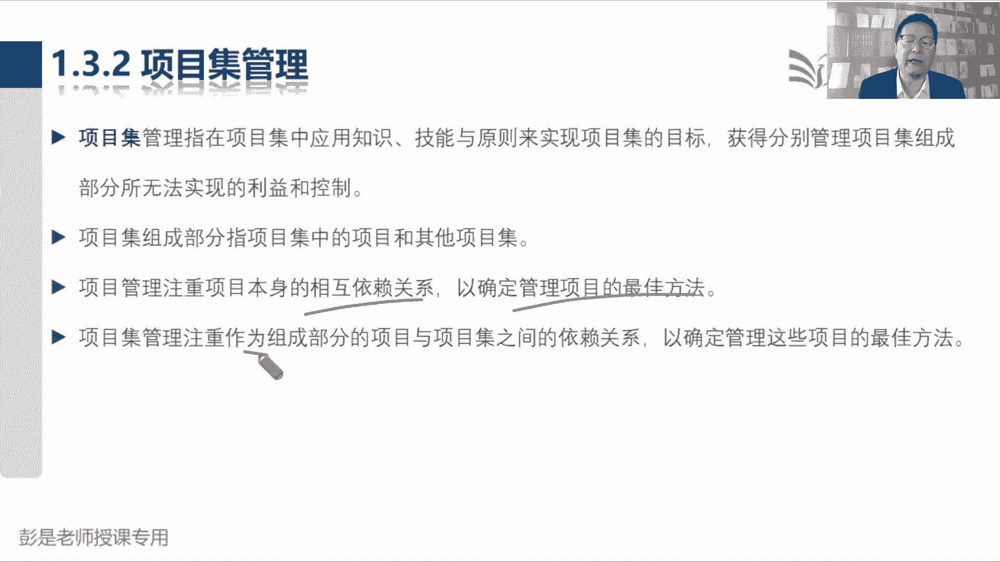

车轱辘话来回说了啊，咱就不念了，那项目集和项目间的依赖关系的具体管理措施，可能会包括这一大堆东西呢，大家也不需要去记住它，不需要去记住它啊，还是那几个单词来回说什么逻辑关系，关联关系，依赖关系。

怎么把多个事情协调好，但这里面藏了一些共性的东西，只要稍稍有点印象，共性的东西啊，其实不管是项目啊，运营啊，项目组合呀，项目集呀，包括企业行为，包括我们的日常工作生活，有四个讨厌鬼，到处都在。

这四个讨厌鬼一定是高频考点，什么四个讨厌鬼呢，这个玩意儿这个玩意儿，这个玩意儿和这个玩意儿四大恶人风险冲突，问题和变更，因为我们做好了计划之后啊，如果是顺风顺水，不会出现变更，不会出现问题。

不会产生冲突，没有风险，那通常来说这项目按时完成，按质量完成，按预算完成，可以做得很顺利的诶，这项目谁都可以管的，那问题就是对吧，问题现实现实情况就是，这四个桃园鬼无处不在呀，随时可能会发生一些变化。

随时可能工作会出现一些问题，随时可能会产生各种各样的冲突矛盾，随时可能会发现一些不确定的不确定的风险，它可能会影响我们朝着朝着目标去前进，这是我们路上的绊脚石，所以这四个东西一定是高频考点。

那风险怎么处理，它就是风险这个知识领域需要大家掌握的，识别风险，定性分析，定量分析，有一大堆管理方法，冲突怎么解决，它有冲突解决的策略，什么时候回避什么，什么时候缓和，妥协是什么，怎么来合作，怎么什么。

什么情况下用强迫这样的方式，那问题怎么处理呢，是有思路的，遇到问题把问题想清楚，然后找原因，对症下药，不要把鸡蛋放到一个篮子里，它是质量，这一章会单独说变更怎么管理呢，就要有规矩，不能胡来啊。

变更要有流程啊，诶怎么流程，怎么流程流程的去管理处理这个变更，这是放到整合这一章质量这一章资源，这一章风险，这一章会单独说的这四个东西，大家后面复盘复盘的时候，一定一定一定对这四个知识点多看。

它能帮助我们解决大部分题目中的这些这些，这些答案答题的方法啊，所以把这四个玩意儿一排除掉，剩下的就是项目集最核心的东西了，那就是什么依赖关系，什么组成部分依赖关系，然后协调好协调好。

确保实现1+1大于二。

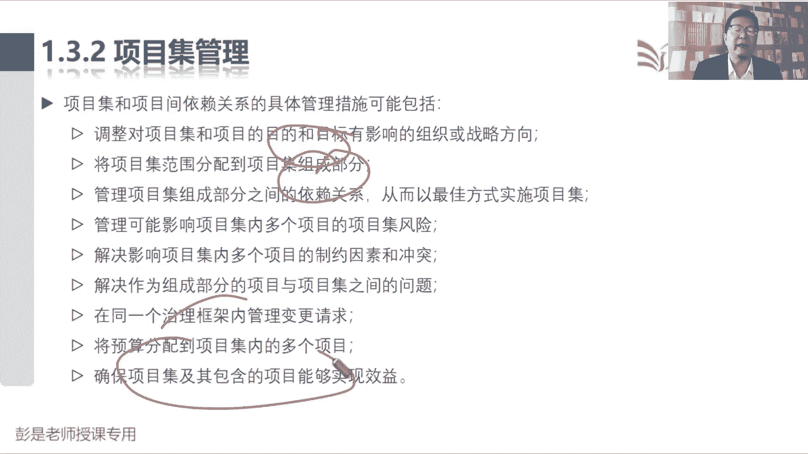

这是他的工作重心，那再往下书上给了一个项目集的例子，这也不念了吧，说建立一个新的卫星通信系统，就是项目级的例子，包括卫星和地面站的建设设计，建造发射以及系统整合，这事要协调好啊。

不能人家说我们造这么点一个卫星，你弄了这么大一个地面站，这这这这是浪费啊，反过来我们弄了这么大一个火箭，你这个地面站这么小，扛不住啊，这也是问题啊，那咱就需要把这些事情都给他协调好。

确保1+1加1+1加一，最后能够大于最后一个结论，这就是项目机关里的工作重心。

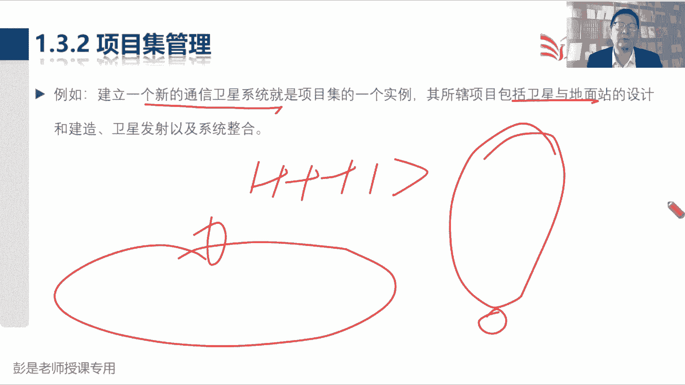

那133就开始说项目组合管理，关键词就这几个，一标完事了，战略目标一堆事儿，然后呢排排序合理的分配人才部。

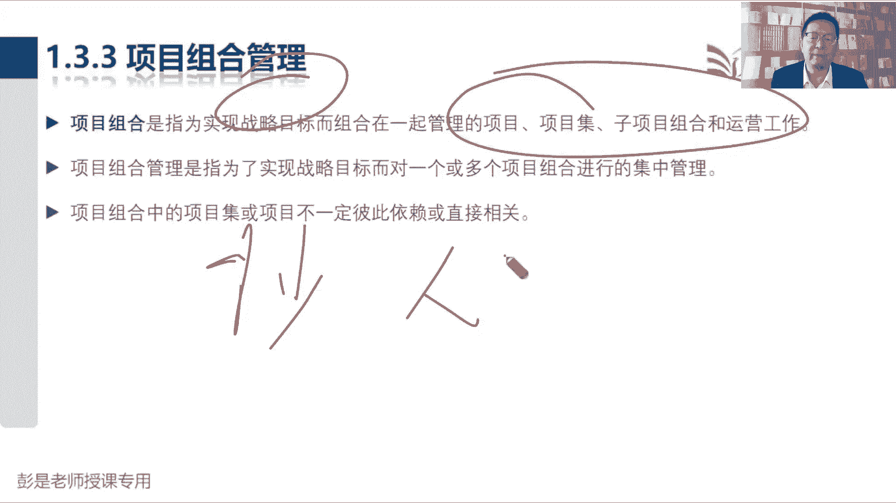

所以往下找。

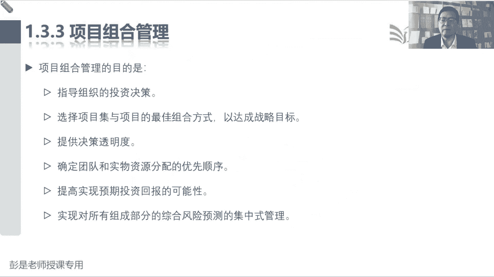

项目组合管理指的是巴拉巴不念了啊，此外巴拉巴不念了，就这句话，我们来确定项目组合是否符合组织的战略，我们要实现价值的最大化，所以呢我们需要精心检查项目组合的组成部分，找到里面包括什么事情对吧，A项目。

B项目，A项目集都把它放进去啊，找到这些组成部分，确定这些组成部分的优先级排排序，这样呢是最有利于组织战略，战略目标的组成部分，拥有所需的人财物，这是财力资金，人力和实物资源，好钢用在刀刃上。

好钢用在刀刃上，找不到刀刃啊，后背的例子咱也不念了，大家后面复习的时候看一看，说什么什么项目组合，这都不念了啊。

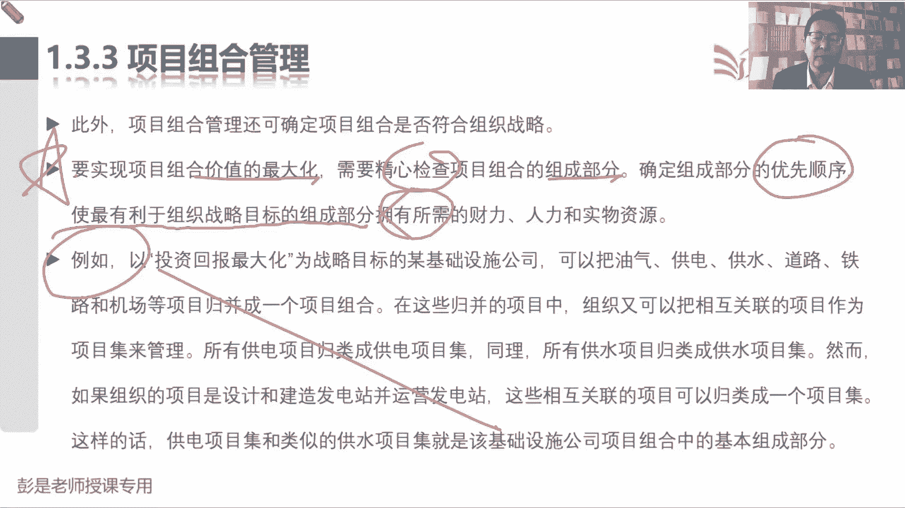

最后134运营管理，运营管理这段文字倒也没有什么东西了，前面我们给大家讲讲过啊，项目是项目，运营是运营，项目和运营之间可能存在的交集，比如说把我们项目创造的可交付成果，移交给运营，就像咱牛肉面改麻辣烫。

那不要把我们这些新的设备呀，新的菜谱啊，新的配方啊，包括新的菜单啊，交给运营，这样运营的同时就持续地持续地去赚钱去了，所以项目和运营之间存在着这样的关联关系，那项目中关注的是我们要关注项目的临时性。

独特性，运营追求的是标准化，规范化的，持续的产出，相同品质的产品服务或成果，所以就有了这两句话，运营他使用最优资源满足客户要求，来保证业务运作的持续高效，这是提高效率，提高质量，降低成本，降本增效。

体脂这套东西，那他重点管理把各种输入我们买的柴米油盐，酱醋茶转变为输出牛肉面，怎么把这堆食材变成牛肉面呢，并且呢变成标准的标准的标准化的产品，所以它需要加工过程，生产过程标准化规范化这些东西。

标准化规范化的作用是什么呢，弥补员工能力不足所可能导致的缺陷，张三水平不那么高，但是呢你按照我们的标准作业程序，12345去操作，仍然可以做出香甜可口的牛肉面，就这个道理啊，这是流程标准规范。

政策程序这些东西，这些东西存在的价值不是为了约束大家，是为了弥补有些人能力不行，水平不行，避免工作出错是一种有效的方法，这就是运营他的追求标准规范这套东西，这都是了解就可以了。

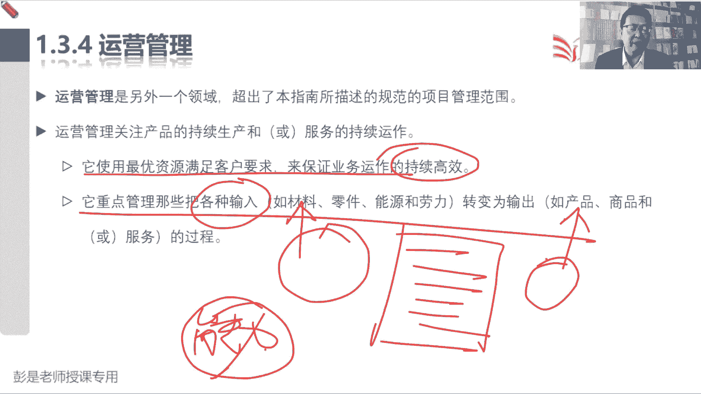

好后面在这一大段话，说呀第一持续运营不属于项目的范畴，刚才也说过了吧，项目是项目，运营是运营，虽然我们和甲方，虽然我们和甲方签的合同，可能是项目加运营的模式，这个非常常见啊，就像刚才给大家说的。

修高速公路，政府出出规划，然后我们公司啊给人家去修路，我们出钱出人财物去修路，那除了人钱，除了人财物，政府不给钱怎么办呢，我们可能还需要运营一段时间，所以咱中国高速高速公路为什么要收费啊。

就是因为就是因为我们建设单位，建设单位建完了之后没有收入啊，那我们需要通过运营的方式把这个钱收回来诶，那我签的合同可能就是项目加运营，这样一套模式，但是从工作性质上来讲，项目关注的是标准化。

向项目关注的是临时性，独特性这些特点想办法完成任务，实现目标，运营呢关注的就是标准化，规范化的这套运作的方法，所以概念要区分出来啊，然后现在教材上说运营不属于项目的范畴，但是它们之间存在着交叉点。

这里边有个小小的知识点，听一听就完事了，大家就想一个道理啊，我们做牛肉面的，现在想做麻辣烫，做做麻辣烫，我们要改造我们的设备啊，设施啊，菜单啊，菜品啊，启动这个项目，启动这个项目运营的同事参与进来。

是不是能够帮助我们更好地完成任务，实现目标呢，运营的同事，这些厨师服务员，让这些人参与到项目之中，提出他们合理化的建议和见解，这好不好啊，就这么一个小逻辑，我们需要听这些人的意见吧，因为厨师最了解厨房。

最了解猪碗瓢盆怎么放，最了解怎么做菜，效率高，效果好，对不对，服务员更更知道怎么改菜单，怎么设计，单价怎么定价，怎么吸引客户诶，以此类推啊，所以就有了这个逻辑，他们在运营的，我们这边呢打算启动一个项目。

这种情况下，我们需要从运营，需要从云啊拿资源，这里的资源可能是人，也可能是物，所以资源从运营搬到项目上变成大白话，就是让这些人加入项目组，让这些人加入项目组，为什么呢。

因为这些人由我们完成项目所需要的知识，他有他有知识啊，对不对，他有经验嘛，这就是从项目到运营，从运营到项目叫哪两个打两个啊，拿过来两个项目结束以后，还三个还什么呢，第一资源回去回到你原来原来的工作岗位。

第二他们在项目中学到了新的知识，他会做麻辣烫了，这不是新知识吗，诶还回去，第三就是我们项目创造的可交付成果，所以粗暴的去记借两个还三个好，借好还再借不难，这就是项目和运营的交叉点，我们在启动项目的时候。

可能从运营这边抽调资源，因为他们有我们需要的知识，项目结束以后，资源回去，资源掌握了新的知识，回去可交付成果。

移交运营，所以最后呢就带出来这么一句话，在每个交叉点可交付成果，以及知识在项目和运营之间转移，来完成工作的交接，另外呢还有一个资源，所以粗暴狙击啊，这两个还三个，而且好还再借不难，多了一个什么呢。

就是可交付成果，然后知识是新的，知识是新的啊，这些人就通过通过项目学到了新的知识，学到了新的技能，就这个东西只要了解就可以好。

再往下了，136组织及项目管理OPM和战略，组织及项目管理p mp考试不考，所以呢这个东西啊以前还大概讲一讲，现在讲不讲，其实不重要啊，但是这三句话还是值得大家去看一看的，帮助大家再巩固一下项目组合。

项目及项目他们的工作重心有什么区别，项目组合选择合适的事情，排排序，分配人财物，项目集呢对他管辖的这些零件，这些零件，多个项目之间，或者是项目和运营之间来进行协调，对这种依赖关系把它控制好。

然后项目呢就是更关注如何完完成任务，实现目标，得到期望的结果，这三个还是值得大家看的啊，那OPM到底是啥，粗暴的讲一遍，大家有点印象就够了，记不住的，理解不了，他完全没关系哈，组织级项目管理啊。

中心思想是啥呢。

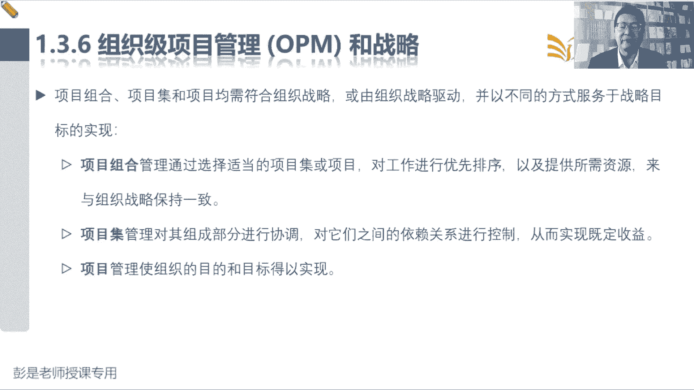

你看他是这么写的说，作为项目组合和项目集的组成部分，项目是时间战略和目标的一种手段，好了吧，为了使项目符合组织的战略目标，我们对项目组合，项目及项目进行系统化的管理，可以应用组织及管理OOM。

它只是为实现战略目标而整合项目组合，项目集和项目和组织驱动组织驱动因素的框架，这么做的目的是指旨在开展正确的项目，并合适的分配关键资源，确保组织的各个层级都了解组织的战略愿景，支持运营的举措。

目标和可交付成果，超抽象，超无聊的一段话变成大白话中心思想是啥呀，中心思想啊，就这个道理，这是我们公司的组织架构，我们这个牛肉面馆啊，这是厨师，这是服务员，这是管钱的，这是管采购的，采购原材料。

厨师做成牛肉面卖出去，服务员擦桌子，端茶倒水，收银员，确保钱收收，收对了，别说错了，每个人都有每个人的岗位，每个人都有每个人的角色职责，那我们是个集体，我们大家干活啊，一定要相互配合，相互协作。

不能各扫门前雪，我们为了公司能够赚到更多的钱，大家要众志成城，万众一心，相互配合，相互协作，从而能够保证企业有效的运转，这道理还能跟得上吗，那这逻辑一样的，现在这段文字就在说这个道理。

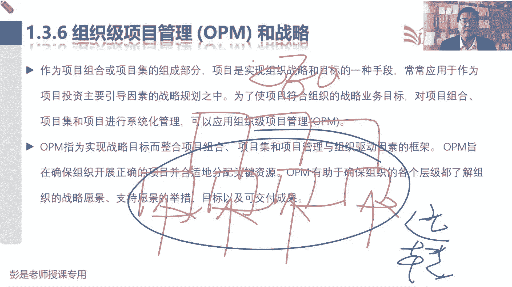

我们项目管理有项目管理的方法，项目组合有项目组合的管理方法，项目及有项目集成管理方法，我们需要把这三个东西呀给他协调好，不要脱节，不要各扫门前雪呀，这就是系统化管理这个单词的作用，系统化系统化。

什么叫系统呢，就是有一大堆零件，就是有一大堆零件，每个零件有每个零件的作用，当我们把一大堆零件组合到一起的时候，能够产生一个新的作用，比如汽车对吧，有方向盘，有发动机，有轮胎，有后视镜。

每个零件有每个零件的作用，但是我们把这堆零件组合到一起，还就可以开车了，就可以开车了，这就是系统化管理需要需要大家相互配合对吧，不能各扫门前雪压，这边一给油，你这个发动机要转的，发动机一转。

你这个轮胎要往前滚的，踩了刹车，你这个轮胎就要停了，咱们是个集体，咱们是个集体，我们为了大目标，为了共同的目标，对不对，我们要一起相互协作，这叫系统化的思维，所以这段话就在说这个道理。

OP m就干这个事情，就对这一句话有这么一个小小的印象就够了啊，他到底怎么管，不是谈PMP考试的重点，他这这段文字啊主要是打广告，因为PM推出了一个叫OP m3的东西。

OPM3对标到刚才有同学选了一个单词，叫什么呢，项目管理成熟度模型，it的同学，你肯定知道这个东西，c mm他是评价你公司企业在做项目的时候，这些方法呀，成熟不成熟啊，标准不标准的。

规范不规范的这么一套东西，它是评价你企业能力的这么一套东西啊，OP m3异曲同工，看看你企业这个能力强不强好，所以这段话听不懂的同学跳过它。

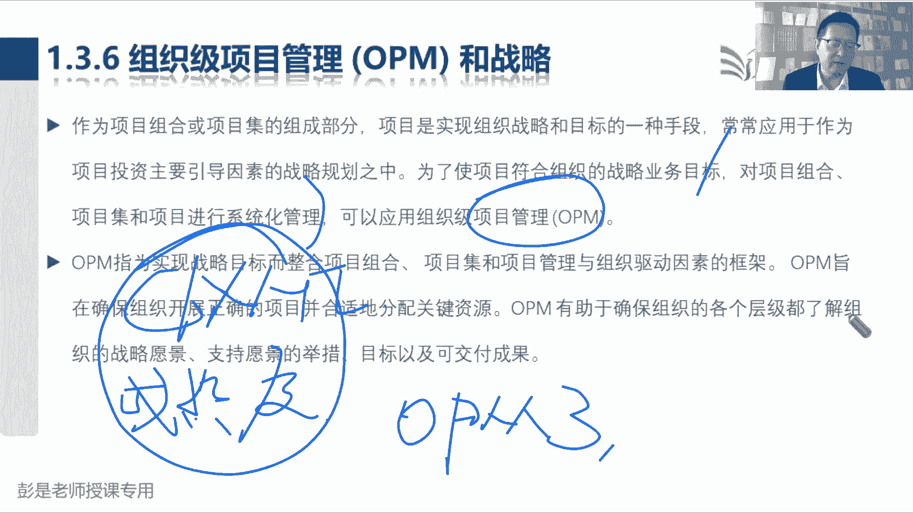

跳过他，忘了他，但是这段话就现在标标出来，这一行稍稍有一点点印象，印象就可以了，印象是什么呢，最关键的就是这个道理，系统化思维，系统化思维，不要客扫门前雪，我们是个集体。

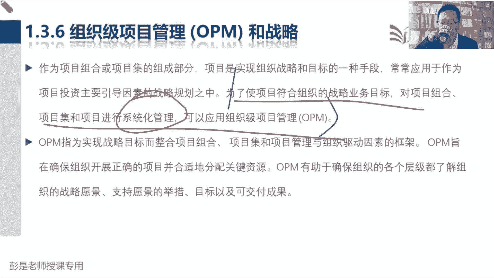

好所以这张图咱也不见了，这张图就是告诉我们，他们之间是怎么相互协作的，这个通过前面储备的知识，大家应该能猜懂，能猜对啊，讲一遍，项目集和项目，更关注的是怎么把这个成果给他交互好。

只不过项目集就是多个项目，多个成果，项目呢就是单个单个项目哈，他们更关注的就是如何交互这个成果，那如何交付成果，项目组合关注的是什么呢，这事儿这事值不值得花钱做，对不对，好钢用在刀刃上，好钢用在刀刃上。

做什么事情对企业来说最重要呢，所以它叫价值决策，价值决策粗暴理解啊，A项目投入100万赚一个亿，B项目投入50万赚一个亿，那B项目优先级更高，因为成本低，利润利润高啊，那我们把B项目优先级提的高。

提提上去，这不是价值决策吗，做这个事情更正更赚钱更赚钱，只不过这里的价值可能更广义，包括有形价值，无形价值，实际工作中一定要考虑很多因素，好这两个东西能搞定，那他们之间这种循环。

如果发现有的项目啊不赚钱怎么办呢，我们需要对组合里面做出一些相应的调整吧，比如对于我们公司来说，我们可能有很多条产品线，我们要做就拿手机举例子啊，我们可能有第一代产品，第二代产品还顺便做做耳机。

还顺便做做IPAD，再做个什么智能语音音箱，参考什么小米啊，腾讯啊，不都有很多产品线吗，要做的事情这么多，哪个事情优先级高，哪个事情优先级低呢，不赚钱的买卖，适当的适合断舍离，看过这样的广告吧对吧。

有的有的产品说下架就下架了，说不干就不干了，因为不赚钱的，所以他不断的不断的要根据企业的战略，对他所管辖的内容做调整，对不对，不符合战略目标的就踢出去了，然后有一些新的，比如现在SSASA比较火吧。

好那我们也上人工智能做人工影像合成诶，这东西把它优先级提上去，抽调精兵强将去重点突击这个项目，以此类推，他就不断地不断地根据我们企业的实际情况，对组合的内容做审查做调整，那他审查调整的依据是什么呢。

不就是项目集和项目，告诉我们这事儿到底赚钱不赚钱吗，就是这么一个小循环好，那第二个小圈是项目和项目及创造的成果，我们要把它移交移交运营，因为项目和项目的是创造价值，运营呢是想办法实现这个价值，对不对。

想办法提高效率，提高质量，降低成本，源源不断的生产很多的麻辣烫，把它卖出去啊，它是实现价值，那我们在企业在运营的过程中，要去看看商业环境有没有发生电话吧，就回到前面给大家说的那个那个套路了。

看看这东西好卖不好卖，赚钱不赚钱，客人喜欢不喜欢，如果发现，那没有人没有人吃麻辣烫啊，大家都不喜欢啊，说我们餐厅这个味道不好啊，那我们要通过价值基调分析去思考，要不要调整战略，对不对，麻辣烫不行。

咱再转型上烧烤，上了烧烤之后，这一系列连锁反应又传下去了，以此类推，以此类推，能听懂这个大道理OK了，对不对，如果整体串不下来，各位同学也没关系，咱考试不考这么深，对不对。

每个每个单独的知识点都知道是啥，OK了，总之我们不能各扫门前雪，我们要协调好项目集，项目组合有单独的，有啊，上午第一节课就说了吧，项目集管理是什么呢，PGMP有这个专业认证的项目组合呢。

p f mp都有这个专业认证的，有对应的教材，啊那继续了啊，所以OPM大家听课听完这一遍，后面复习的时候想看就看。

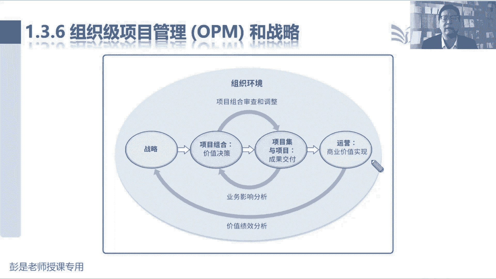

不想看，其实可以不看了，好做到这一小段知识点的随堂练习。

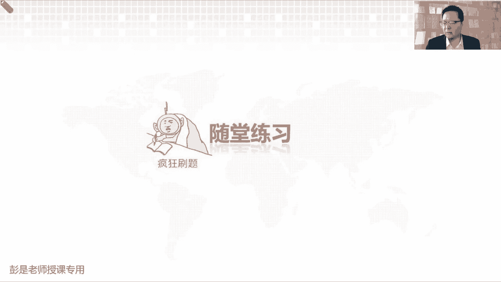

看看大家是不是昏昏欲睡了，有的同学应该已经睡着了，你能打字，还说明头大脑还清醒，完了不在，同学朵拉同学困了吧，范坤的同学再仔细看一看，四个选项都看完了，都看完了，好恭喜大部分同学这个大脑又恢复了啊。

所以正确的答案是什么呢，就是C在实施项目的过程中，我们应该认真考虑项目的项目，产品的维护和持续运营的问题，那么这种维护和持续运营应该怎么做呢，A是项目收尾阶段的一项重要活动。

排除掉运营不包不包括在项目之中，B是项目生命周期中的一个阶段，排除掉运营不包括在项目之中，C不是项目的一部分，这是对的，D是一个独立的项目，这肯定不能选啊，所以项目是项目，运营是运营。

它运营不包括在项目之中，虽然你的签的合同可能是项目加运营的模式，对吧好，所以正确的答案是C，那犯迷糊的同学啊，给大家传授一个学习的小技巧啊，如何有效地提神醒脑，如何有效的提神醒脑的话。

让自己不会昏昏欲睡啊，因为讲课这种东西啊，听多了自然就犯困了，讲得再有意思也犯困了，我看电影还会还会睡觉呢，怎么有效地提神醒脑呢，两种方法，写错字，原谅我啊，一种方法叫物理攻击，一种方法叫魔法。

这种方法叫魔法，物理方法呢就是头悬梁锥刺股，掐大腿对吧，什么抽根烟，喝点喝点红牛，哎，这都叫物理方法，然后我们还可以精神刺激，用魔法打败魔法呀，精神刺激是什么呢，就是各位同学想一想，今年工作好找吗。

据我据我了解到的一些项目经理啊，说很多行业项目经理的薪资啊开始降了，开始降了，原先以为能够达到二十二十五和30啊，今年一看行情啊，降到十八十六十五了，工作好找吗，工资涨了吗，买房了吗，买车了吗。

房贷是多少啊，工资够不够还房贷呀，有没有实现小小自由啊，唉就想一想这些恶心人的问题，想一想这些恶心恶心人的问题啊，后背发凉，后背发凉就提神了，对不对，看看股票哎，好好方法呀，放股票，股票里面放几万块钱。

十几万块钱，现在还剩多少钱呢，亲还有钱吗，还能翻盘吗，诶就想一想，想一想这些这些戳心窝子的东西，就醒脑了，就提神了啊，好拐弯拐回来给大家刺激，玩刺激完咱再专心的做做后面的题，看看正确率能不能提升下来啊。

看看这道题，当两个项目有内在的依赖关系，为了获得更好的利益，应该采用哪种方法，超简单，这是第二把一个项目和另外一个项目，存在着这样的依赖关系，关联关系，那咱看看把这些事情给大家协调好。

这就是项目集管理的中心思想，所以其实大家仔细观察一下，身边有很多这样这样的东西啊，很多这样的不良现象就是导致浪费了，就是说可能没有人去统一的去协调，比如说典型的看看你家门口的马路。

是不是有出现过这样的现象啊，大马路刚修好的时候，干干净净，整整齐齐，很漂亮啊，过两天就怎么样了呢，诶我们花开来弄弄线，我们是搞搞供水的，过两天再挖开弄一弄，我们是我们是搞供电的，过两天再挖开弄一弄。

我们是搞天然气的，对，然后弄得路上东一块西一块的，全是补丁啊，过两天我们再把它修一修啊，修完了再补，补完了再修，这就是对这件事情没有协调好，对不对，需要有一个更高级的领导，更高级的领导站出来。

把这个事情之间给他协调好，想办法不浪费1+1大于二，就这个东西啊，嗯所以存在着这种依赖关系的时候，我们这种管理方法就叫项目集好，以下哪一项属于运营的一部分，福同学看破不说破呀。

这种题考试的时候也不大会出啊，这是帮大家提神的，就去区分啊，什么东西是常态化的，什么东西是非常态化的对吧，像调整啊，什么更新啊，流程再造啊，这不一定定期的持续的重复的去开展，但是像会计业务这事儿啊。

一看就是定期的持续的重复的去开展，所以呢答案是A对不对，想想你企业的会计啊，财务出纳呀，干这个事了吧，给大家发工资记账，这需要定期的持续的重复的去开展了，这打主要是排除法了吧，好三个小三。

你看你这个昵称显示不出来啊，三个口同学慢慢的慢慢的学到了精髓，就像巧云同学同学说的啊，大家一定要记住，学习到最后啊，万能大法一定是排除法啊，学习到最后万能的方法一定是排除法，根据我们储备的知识去分析啊。

这个选项不太对，这个选项不太对，这个选项不太对，剩下一个相对来说还比较合适，永远是中，通过这样的思路去找到一个，相对来说最合适的选项，嗯但是别忘了啊，排除法好使的前提条件一定是有指使。

一定要一定要有知识，看到这个单词，看到这个术语能反映出来它是啥，知识储备的不足，其实排除法都用不了了，对不对，因为看起来哪个都像好。

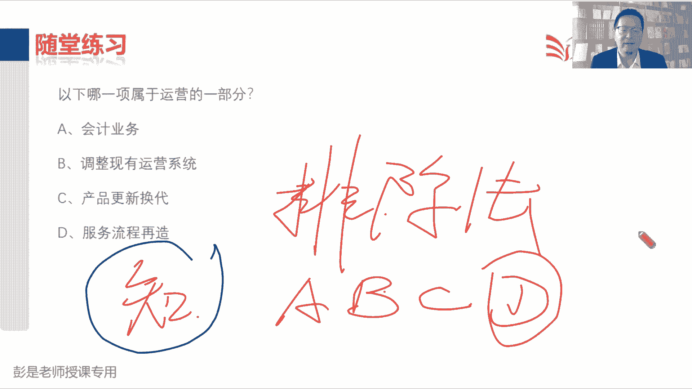

所以多看多听多看多听啊，看看这道题，就是这个，找一个不正确的东西，简单吧，紫霄同学是不是打错字了，好人家让我们找一个不正确的选项，就是哪个选项说错了，A选项项目和运营都受制于受制于有限的资源，这是对的。

啥事都受制于有限的人财物啊，B运营是持续不断和重复进行的，项目是临时的，独特的，这句话本身是对的，C项目和运营都需要规划执行控制，这句话本身是对的，对不对，今天到底到底买多少面，做多少牛肉面。

到底打算赚多少钱，这不运营工作也需要有工作计划吗，P d c p d c a，然后D运营是项目生命周期，社会阶段的重要工作之一，这句话本身是错的，题目上找一个错误的选项，所以答案是D啊。

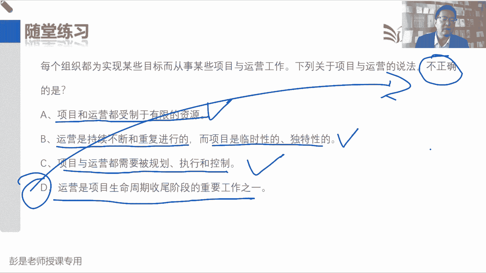

好项目集是什么呢，排除法A选项说持续时间持续较长时间，一系列相关任务的组合，这可不一定啊，持续时间长不一定代表着他是项目，一系列相关任务，或者后半句还对啊，但前半句不对啊，B1度相关相互协调。

相互关联别并且被协调管理的项目，这是对的，C和钱没关系，D用于归集，这胡说八道，所以恭喜大家答对了，再看组织战略发生变化以后，一下哪一项也会发生变化呢，随便想场景啊就可以理解了，我们公司以前是做油车的。

那咱把燃油车，燃油车相关的事情都放到项目组合里，然后排排序，便于我们合理地分配人财物，现在我们战略转型不做燃油车了，我们打算坐电车怎么办呢，就把这些东西给他扔出去，扔出去啊。

再把和电车相关的东西放到这个圈圈里，然后排排序，合理的分配人财物，这就是项目组合和组织战略，之间的这种关联关系，所以呢恭喜大家答对了，答案就是C项目组合。

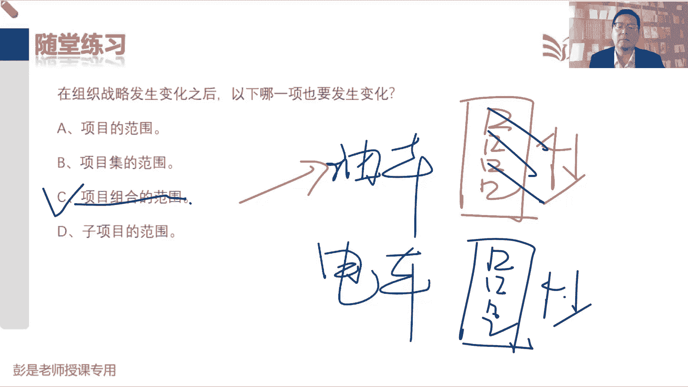

稍稍复杂一点点，看看这道题的公司会议，需确定计划后5年的一系列项目，与会者结合公司战略目标展开激烈的讨论，会议最后形成了项目的优先级清单，他们正在做的事情是啥，这题肯定不能选A啊。

组织及项目管理OPM关注的是什么呢，系统化管理关注的是项目，项目组合，项目集这些东西怎么给它有机地结合到一起，让这些事情可以相互协调，相互协作，对不对，所以这道题啊还是那个知识点啊。

这个优先级目标排排序分配人财物，项目组合，公司定了后5年的一堆事，然后结合公司的战略目标讨论，最后形成了一个优先级清单，十分轻重缓急，合理的分配人财物还是项目组合这种管理方法，所以答案是C。

抓关键词就可以了。

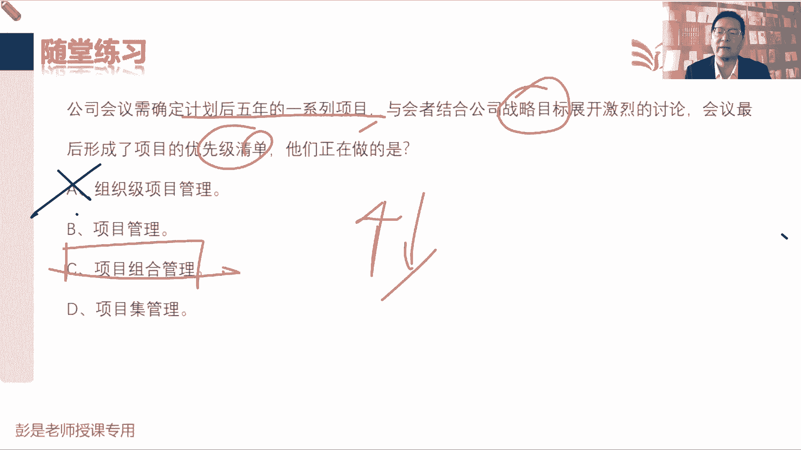

这道题呢组织商业价值的成功开始于啥，就是讲的那个大三角吧，先有啥再有啥，然后再有啥再有啥，现在对于这个整体的结构，大家应该看起来更清楚了啊，再给大家说一遍，开企业我们要定目标，愿景使命价值观。

做完这些方向呢，我们再去分析一下如何实现这个目标，愿景使命价值观呢，这是做企业的战略规划，就是思考如何就是好啊，怎么实现这些东西，战略规划一旦规划完了呢，就得到了一堆需要做的事情，这一堆要做的事情。

其中主要就是项目和运营，就是项目和运营对吧，我们要大力发展，大力发展基础设施的建设，咱国家不都经历过这样一个时期吗，大力发展搞基建，搞基建，基建狂魔呀，那咱就修路搭桥，修路搭桥修路不就是项目吗。

修路完了之后，然后保持这个路面的整洁干净，哎这不是运营吗，就决定了一系列的项目和运营，接下来我们又去思考，有些事情之间存在着某种依赖关系，所以就有了项目及这种管理方法，最后要再思考啊，这类事儿啊。

这些事儿这么多，不得排排序嘛，合理的分配人财物，所以呢它上面之间上面又加了一个项目组合，管理，这种管理方法，一堆事排排序，合理的分配人财物，这就是企业管理的全景，就这些管理方法，核心的管理方法。

项目管理，运营管理，项目及项目组合，战略管理五个，所以这道题商业价值的成功开始于从上往下找。

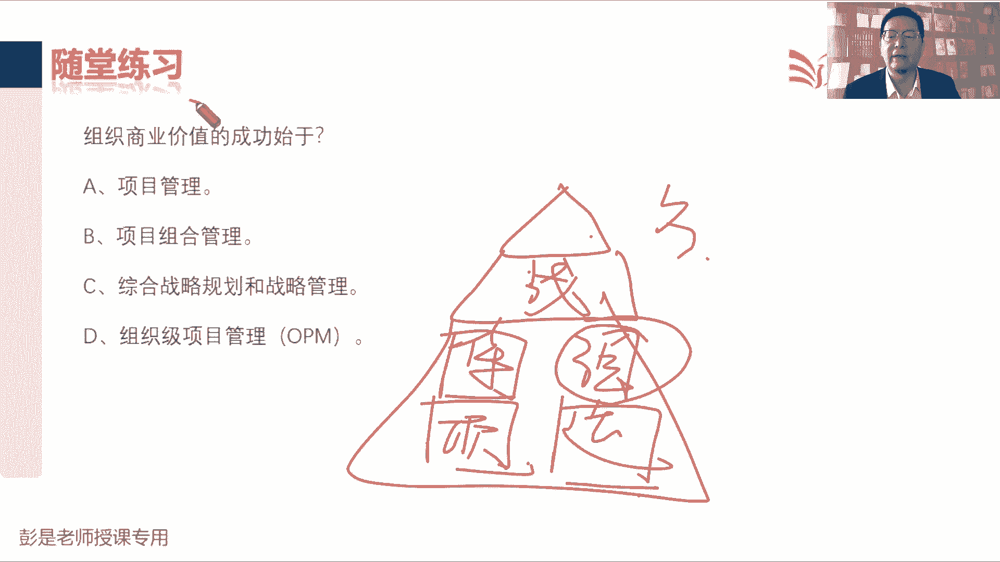

这是C，好以下哪一个不是运营运营工作的例子，天哪，这个啊这个也简单哈，好了找到了，说每周每周每年这一看重复，这一看重复，所以呢答案是A对不对，为支付支付账户构建一个什么订单系统啊。

这一看没有体现出重复的性质，所以呢通常把它做运营，好各位同学说什么，我看看啊，说不是不是成功始于什么什么什么战略的成功。

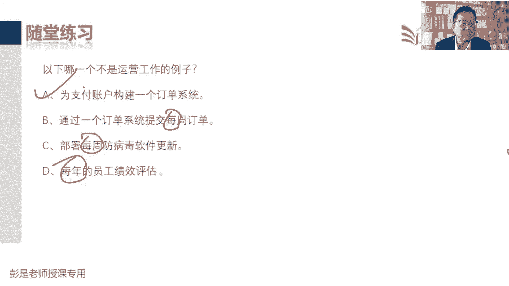

不得开项目的成功吗，那事前事后啊，事前事后啊，战略成功不成功又不又不是只看项目，还要看运营，还要看项目组合，还要看项目极大，对不对，所以成功开始于先做好后做好，事前事后怎么去区分这种东西啊。

先做好企业的战略规划和战略管理，然后呢，这个事情做好了之后才有才有后面这些东西啊。

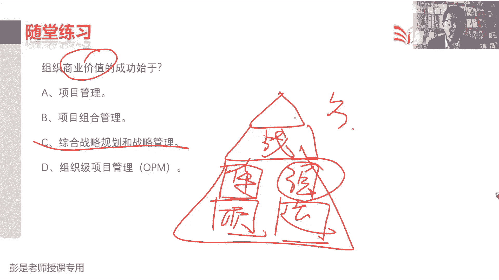

好这道题呢，关于项目组合管理，以下哪一种说法不正确，这个也简单吧，A其实说的不严谨，但是呢但是呢D说的更过分，友情提示大家，因为项目组合里边不可不一定是肯定有项目，也不一定肯定有项目集，有可能没有项目。

没有项目集，只有运营啊，对不对，所以A说的虽然不严谨，但是呢这话也不能算错，但D选项肯定错了，D选项肯定错了吧，项目组合总是一组项目集，这肯定过分了，所以答案是D，其他选项还好，其他选项还好啊。

记住这个中心思想，好的里面找最好的，坏的里面找最坏的，永远是找一个相对来说最合适的选项，仅此而已，不知道各位同学有没有听过火车难题啊，这个pp考试啊，跟那个方法是一样的，这是考逻辑，考思路。

火车难题是什么呢，你那个火车刹车坏了，现在有两条路可以走啊，有两条路可以走啊，左边呢告诉你啊，这里面躺着一个人，右边呢告诉你，这里面躺着五个人，那你往哪边开呢，你要做选择，你要做决策，怎么决策。

怎么决策，对不对，只能相对来说找出一个比较合适的选项，现在就两个选择没得选，那那我们就往左边走，因为这边一个人就这个逻辑好，A怎么说才合适呢，项目组合就是通过通过项目及项目。

或者是运营的数据来评价项目组合是否成功，这么说还说得通啊，因为它可能会包括运营，这是哲学问题啊，所以项目管理，项目管理是个边缘学科，边缘学科不代表说这个东西不重要哈，边缘学科是说他是个交叉学科。

涉及到很多很多学科的知识，好像什么工程的管理的组织，组织行为的，个人行为的心理学的哲学的都扔进去了。

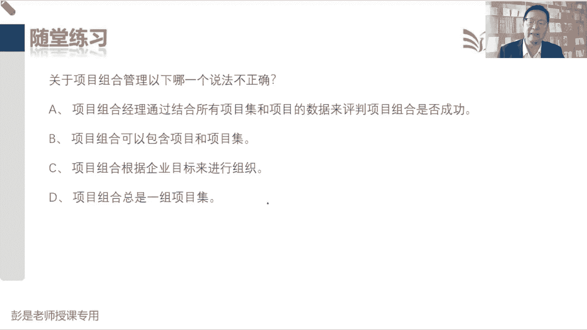

好拐弯拐回来回到这个知识点，说一家公司，好答案到底是什么呢，不少同学选了B啊，选B的同学是不是被这三个字忽悠了，一系列一系列，不代表着说这些东西存在着关联关系，依赖关系啊，不是一个意思吧。

不是一个意思啊，所以这道题啊就是变成常简单简单，理来理来理解啊，一家能源公司正在做一系列的投资预案，就是一堆十二一堆事，想要寻找替代能源，使公司在10年后保持竞争力，到底什么是替代能源，根本就不要记。

不要去管它，对不对，它不是考，不是知识点，寻找替代能源，是公司在10年后保持竞争力，就是现在什么煤越来越贵，能不能什么用电啊，用氢气啊，用氧气啊，用氢能源，哪不就这玩意儿吗，但中心思想是什么呢。

一堆事让公司保持长时间以后还有竞争力，10年以后还有竞争力，这不就是战略目标吗，那这些也预案要一起跟综合管理，因为这些这个目标对公司来说至关重要，这是什么东西呢，就是一堆事排排序。

帮助我们实现战略目标啊，这不就是项目组合管理吗，所以这道题相对来说就说的比较婉转了啊，他没有直接给出我们这些关键词的特关键词吧，没有说一堆事儿排排序，合理的分配人财物，但是需要我们自己总结归纳。

做什么一堆事儿，竞争力至关重要，这不就是战略吗。

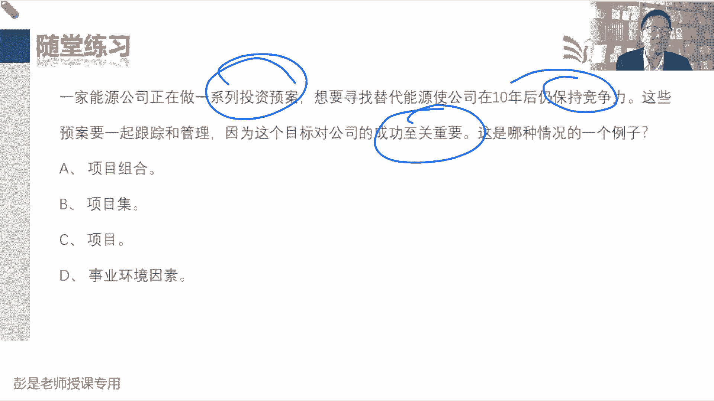