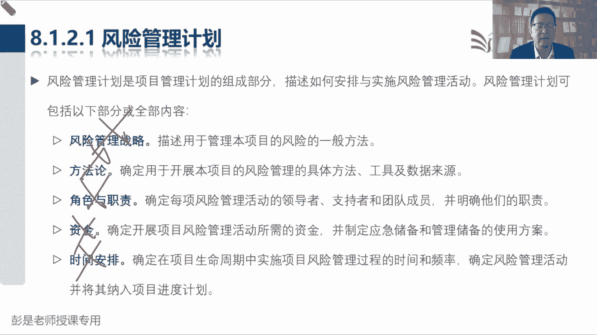

# 2024年最新版PMP考试第七版零基础一次通过项目管理认证 - P50：2.8.1 规划风险管理 - 慧翔天地 - BV1qC411E7Mw

好各位同学，下午好啊，继续啦，上午给风险管理起个头，回顾一下啊，规划风险管理，看一看风险怎么管，识别风险是找风险，找到风险之后啊，得排名啊，看看什么东西重要，什么东西不重要，所以实施定性风险分析。

是对找到的每一个单一风险做排序，看看什么是高风险，中风险，低风险，那实施定量风险分析是整个项目从整体上，大局观这种东西啊，从整体上评估我们整个项目的风险的程度，然后规划风险应对。

就是根据我们这些风险的重要性，优先级考虑都有哪些方法，可以有效的去管理风险呢，就是规划应对措施，实施风险应对，主打一个落实执行，所以要吃把我们规划出来的应对措施，不要有侥幸心理，要把它落实执行下去。

最后呢监督风险绩效变更，哎那接下来咱们看看这一章综述综述啊。

这一章的输出其实没什么需要大家去背的，为啥呢，整个风险这一章最重要的两个输出啊，一个叫风险登记册，一个叫风险报告，登记册里面呢就记住这一个一个单一的风险，报告呢，主要是体现整体情况，所以大家想想。

疫情期间，张三被隔离，李四被隔离，王五确诊了，赵六被隔离，这都叫单个风险登记造册，那整体情况呢就是整个地区对吧，整个国家整个地区整个省整个市诶，整体情况一共有多少个风险啊，有哪些高风险地区域啊。

有多少高风险人群，哪有多少中风险人群啊，疫情朝着什么方向发展呢，以此类推，所以单个风险即登记册整体风险及报告，那么我们识别风险的时候，从现在开始，单个风险就全都记录到登记册里，整体情况呢记录到风险报告。

定性风险分析是对找到的单个风险做排序分析，这些风险到底是属于高风险中风险呢，还是低风险，那咱就把分析的结果更新到风险能力侧，那整体情况以此类推，也要进行相应的更新，然后实施定量风险分析。

只有这个管理管理过程，单独计划实施定量风险分析，它是对整个项目做量化分析，说目测我们还有大概一周左右，我们就可以解解封了，目测还有一周左右，我们这些人群就可以康复了，以此类推，对整个情况做量化分析。

所以他不一定会更新登记册，它只更新风险报告，因为它是分析整体风险，那规划风险应对登记册和报告都有可能更新，实施风险应对登记册报告可能会更新，监督风险，登记册报告可能会更新，以此类推，所以这一章的输出。

最后一总结就是单个风险记登记册整体情况，写报告，除了第一个管理过程，规划风险管理出风险的管理计划好。

收入也没啥东西，那这一章看综述这段文字先搞定什么叫风险啊，他说呀项目风险管理包括这一大堆管理过程，风险管理的目标在于，提高正面风险的概率和或影响，降低负面风险的概率和后影响，从而提高项目成功的可能性。

风险的主要特点是什么呢，什么叫概率啊，风险和问题一定要分清楚啊，风险的主要特点就是不确定，那如果确定，那就有可能是问题，所以比如说明天我要出差，从北京去上海，您的航班，您明天的航班被取消了。

这是确定性的问题，您明天这个航班的有可能被取消，也许会取消，也许不取消，他不一定他不确定，这种不确定的东西才称之为风险，那有可能取消，有可能不取消，有多大可能性呢，所以就涉及到概率这个术语，对不对。

什么叫概率呢，就是百分之多少呗，张三张三二十天上班八天都会迟到，他迟到的可能性就是80%哎，它存在着不确定性，以此类推的吧，扔一个硬币，扔硬币最好理解了，扔硬币正面朝上的可能性就是50%。

它只有两种可能性哈，正面朝上，反面朝上，它立在那地方叫小概率事件，正面朝上的可能性就是一半，反面朝上的可能性也是50%，这就叫概率，那影响的就是对对我们的进度啊，成本啊，质量啊产生的造成的后果好。

所以知道风险，知道风险诶，他就是不确定的事件和条件，知道了啊，一定要牢牢记住这个特点，他不确定不确定不确定，存在着不确定性，咱们一开始说项目三大特性特性，项目创造独特的产品服务成果，而开展的临时性工作。

独特性，就意味着在某些方面和以往项目存在着不同点，就意味着可能存在着不确定因素，可就意味着风险搞定，那项目风险管理的目标在于提高正面风险，降低负面风险，所以这里面又带出来两个术语，正面风险就是好事。

好事，咱就把它称之为机会，负面风险，坏事坏事通常就称之为危险威胁，这就是机会和威胁这两个术语，好的事情叫机会。

不好的事情叫威胁好，所以再往下，就是说这七个管理过程的主要工作了，规划风险管理，看看风险怎么管，过去识别风险就是找单个风险和整体风险，所以呢我们把单个风险进入到风险登记册，整体情况，写到风险报告里。

定性风险分析，通过评估这一大堆东西，然后呢对风险进行优先级排序，后面会掌握这些工具啊，概率影响评估数据质量，评估查询矩阵，考虑其他参数，对风险做排序，所以呢排序结果更新风险登记册整体情况，更新风险报告。

而8。4实施定量风险分析，是对已识别的单个风险和其他不确定性来源，对整体项目目标的综合影响，进行定量分析的过程，啊就像咱学PMP，各位同学就叫单一风险，全班通过率就是整体情况，就这意思啊。

所以是对整个项目目标，比如说我们能不能按期完成啊，有多大把握呀，我们能不能按预算完成呢，有多大把握呀，这个把握不就是可能性吗，嗯这就是定量风险分析，所以这种东西啊就是从小到大考虑这个东西啊。

明天上班路上都有什么东西，可能会导致我迟到，可能会堵车呀，等电梯呀，排队呀，以此类推啊，这都是单个风险，那明天你有多大把握按时到公司呢，这就是整体情况做量化分析，8。4，然后再往下规划风险应对。

字面意思实施风险应对字面意思，监督风险呢就是绩效和变更，绩效变更一会儿要讲工具，就是一个G1个查，一个G1个查，后面再说单独说工具啊。

搞定这一章的输入输出，不太需要刻意的去背了，然后再往下说核心概念，这一段刚才解释过了，既然我们项目啊有独特性，就意味着在某些方面和以往不一样，和以往不一样，就意味着存在着不确定因素。

那就是风险意味着风险，所以呢我们要考虑巴拉后面就不见了，那项目管理这句话听一遍，项目管理只在识别和管理，未被其他项目管理过程所管理的风险，这段话就是说呀，比如说啊我们前面学过一个管理过程，叫收集需求。

收集需求的时候，当时说呀人家可能说不清楚需求，那怎么办呢，观察和交谈呢，对不对，人家不愿意说，没时间说，说不清楚需求的时候，我们通过观察这样的方法去了解对方的需要，对吧，那需求不确定怎么办呢。

我们还可以采用圆形法，嘿那人家需求不明确，我们是先开展风险管理，还是先开展收集需求管理呢，这段我们自己在说这个意思啊，先通过收集需求的方法，尽量的尽量的把这些不确定的东西给他搞定。

搞定之后得到了需求文件，我们再去分析这个文件里面，存不存在着一些风险点，所以是先开展其他管理过程，让人家干完活再来看看有没有风险，就这个道理，否则所有的东西都是不确定的，都叫风险的。

那咱就其他管理过程都干掉了，对不对，好再往下说。

每个项目都有两个两个层面上存在着风险，就是单个风险和整体风险，这个术语不解释了，刚才解释过了，单个风险影响我们这个东西，整体风险就是加了所有的单个风险整合整合，所以整体风险包括单个风险在内的。

所有的不确定性。

再往下就是说单个风险会对项目，项目的目标产生正面和负面的影响，那风险管理旨在强化规避或减轻，这是好的事情，让他上去，不好的事情让他下去，把负面影响最小化，正面影响最大化，这也搞定了啊。

然后中间这个术语啊，看看这句话听一遍，马上会抛那个术语，说整体项目也有正面风险和负面风险之分，我们这么这么这么做呀，什么削弱负面变异的驱动因素，加强正面变异的驱动因素来实现什么，什么项目目标的概率。

把风险敞口保持在可接受的范围之内，这个敞口是什么东西的思考，再想个大道理啊，这个开口扛敞口不就开口吗，对项目来说，这个开口越大越不靠谱，还是说开口越小越不靠谱，什么叫开口大呢，给我给老板汇报啊。

这个项目工期啊，一年加减10年和第二个给老板汇报，一年加减一个月，哪一个更靠谱呢，哪一个更靠谱，是越大越靠谱还是越小越靠谱啊，啊理解反了吧，越大越不靠谱啊，越小越可靠啊，对不对，所以一年加减10年。

你这忽悠人呢太大了，这个区间不可接受啊，对不对，开口越小越靠谱，所以这个区间其实就是我们前面讲到进度管理，成本管理，说到那个临界值，一会儿马上会看到啊，看到风险敞口就想到临界值，这个临界值我们要弄。

让他再在一个可接受的这个区间，这个区间越小越靠谱，能听懂吧，比如说咱俩明天约会，晚上吃饭，就想拖堂这个梗，我跟你说18：30左右，对不对，左右一分钟诶，左右一年，就这个道理。

所以我们要尽量的尽量的把这个时间啊，成本啊，它的浮动区间对吧，控制的越小就说明越靠越可靠。

这里逻辑啊，那再往下什么，什么风险会在整个项目生命周期内持续发生，所以呢管理过程啊也不是开展一次大，需要持续的开展，就像疫情期间对吧，每天我们可能一一睁眼就开始识别风险，定性分析，找到风险人群规划。

应对措施，落地执行监督风险，以此类推，这知道意思就够了啊，好往下找到这段，那为了有效管理项目的特定风险，我们需要知道对于要追求的目标，可接受的风险敞口究竟有多大，这通常用可测量的风险临界值来定义。

一个项目工期一年加减十天，它仍需有十天的浮动，一个项目预算100万加减5万台，它允许有5万的浮动，这个临界值就反映了我们可接受的变异程度，那这个临界值怎么出来的，怎么出来的啊。

接下来后面这句话就在说这个道理，第一，它反映了组织和项目相关方的风险偏好程度，这是大家对风险通常有主观上的偏好，风险态度，风险态度怎么理解呢，就像有的人有的人能愿意玩极限运动，有的人就不愿意玩。

不愿意冒这个险，哎有的人可能就比较激进，有的人呢就比较保守，因为大家的三观不同，大家的背景不一样，所以它取决于环境，我们要根据项目的环境，根据企业的环境对吧，甚至根据行业的环境啊去分析啊。

大家能够接受接受多大的这个这个浮动，这个变数，所以它取决于我们对这个事情的看法，就是主观上的这种认知，那主观上的认知其实不太难，不太不太容易评价它，因为它带有主观倾向性，所以我们需要一定想办法。

把它从主观的偏好这个东西变成客观的临界值，从而来反映出来，我们能够接受的这个浮动的区间，不然这事就说不清楚了，嗯对大家日常你约会约到晚上八点钟，我迟到一会儿有事吗，没事儿没事儿，这一会儿是多少啊。

这一会儿这个单词大家应该都被放过，鸽子或者烧过吧，这玩意说不清楚的，对不对，有的人可能觉得迟到一分钟哎还能接受，有的人迟到十秒钟就翻脸了，有的人迟到一个小时，觉得理所当然没关系。

大家对这个东西的感受是不一样的，所以我们一定要想办法把这种主观的东西给它，变成客观的可量化的临界值，这样的我们才可以有效的去分析，我们这个管理措施是否合适好，所以最后带出来这个非常重要的知识点。

也是规划风险管理最重要的工作之一，我们是根据项目的情况，去分析这些相关方的风险偏好，然后呢想办法想办法把这个客观的偏好啊，主观的偏好变成客观的临界值，这个临界值啊一个数字是不够的，为什么呢，想一想啊。

比如说大家想到对，对我们每个人来说，丢一块钱受得了吗，丢十块钱受得了吗，100块钱扛得住吗，1000块钱有问题吗，1万块钱有问题吗，10万块钱有问题吗，诶我们要把它的严重程度分成多少个档。

根据项目的情况，根据相关方的风险偏好，把这个临界值分成好几个档，告诉我们什么事啊，叫重大事件，什么事呢，一般什么事呢，无所谓，对不对，因为就像学PMP这个事情啊。

3900的考试费对于有些同学来说不叫事儿，他觉得无所谓，但是对我来说，三块九我都受不了啊，就这个道理，所以呢我们要把它分成不同的等级，就得到了这个术语叫风险影响级别，定义之中。

就定义清楚满足什么样条件的风险才是低风险，再定义清楚满足什么样条件的风险才是中风险，满足什么样条件的风险才是个高风险，比如说10万块钱以上，咱受不了，这就是高风险，什么5万8万还可以，这叫中风险。

小于5万，无所谓，毛毛雨，这是低风险，咱要把这个级别这个等级的定义给他说清楚，未来我们就知道这些找到的风险，它的优先级到底是多少了，这个这个这个概念参考疫情期间一个道理啊，疫情期间。

你们地区什么情况下会变成高风险地区呢，什么情况下会变成中风险地区呢，什么情况下才会变成低风险地区呢，不同的地区，不同的地区可能有不同的条件，为什么呢，取决于环境，环境造人，环境造人就这个道理啊。

知道这个意思，OK了好，这就是规划风险管理最重要的几个风险临界值，然后得到概率和影响等级的定义。

好再往下这一小段也是听一遍，大概知道这几个术语是什么意思就可以了啊，第一个叫什么呢，他说啊我们要关于这个风险啊，它有不同的类型，关于风险有不同的类型，第一种类型叫什么呢，就是这句话他的结论是说啊。

这种东西啊叫事件类的风险，千万不要被那个非事件类风险啊给迷惑了啊，第一句话，大多数项目只关注，作为可能发生或者是不发生的不确定性，未来事件的风险，这种风险叫事件类的风险，也就是说什么叫时间类啊。

这个风险呢有可能会发生，也有可能不发生，这叫实战的风险，就是明天可能会堵车，也可能不会，也可能不堵车，堵车这个事情可能发生，可能不发生，这就叫实战的风险，明天航班可能取消，也可能不被取消。

这个事儿可能发生，可能不发生，这是事件类的风险，通常我们第一反应关注的就是这种东西，那除了这个事件类的风险，那我们还要关注一些非事件类的风险。

非实在非时政类风险有什么呢，再往下就是第二种风险叫变异性的风险，变异性的风险是说我们已经规划的活动事件，或者是角色的某些关键方面存在着不确定性，就是啊他在某些方面存在着变数，这就称之为变异性的风险。

就像大家明天上班，后天上班要从家到公司，路上通勤需要多长时间呢，通勤肯定这事肯定要干的哈，上班这事儿肯定要干的，但是路上花多少时间呢，不确定了，他在某些方面存在着变数，可能一个小时。

可能一个小时零十分钟，也可能30分钟，有时候快，有时候慢的诶，他就是在某些方面存在着变数，存在着不确定性，这就称之为变异性的风险，第三种风险是什么呢，就是后面这个单词叫模糊性的风险，就是没有认知。

不知道会发生啥，咱说初生牛犊不怕虎，就是逻辑吧，出生的小牛不知道老虎是啥东西，不知道老虎会对他干什么事情诶，他就是没有认知无知，所以他要对未来可能会发生什么，存在着不确定性。

不知道不知道没有认知的是点二好，所以这三个东西啊，其实咱上课的过程中，大家都要从他就从第一模糊性风险，没有这个认知，当时对大家第一天上课来说，这就叫模糊性的风险，然后呢上到第二天课呢。

这个风险转化了转化成什么了呢，有认知了，有认知了啊，它现在它变成什么了，变成啊事件类的风险，就是说今天上课有可能拖堂，也有可能不拖堂，拖堂这个事情有可能会发生，也有可能不发生，然后到了第三个阶段。

这个风险又变成了什么呢，就是变成了现在现在拖堂拖多久对吧，咱们第三天，第四天，第五天，包括未来第六天肯定会拖堂了，这个事情基本上大概率事件了，那拖多久不知道，有时候拖一个小时，有时候拖30分钟。

有时候拖45分钟，他在某些方面存在着变数，它就又转化成了变异性的风险，诶，工作中生活中关于风险，他可能状态随时可能会发生变化，对不对，这是从未知到已知，从已知，从整体不确定到局部不确定，这意思啊。

这就是大概这三种风险，听一听，知道怎么回事就够了，好再往下拉啊。

那项目管理发展的趋势和新兴实践这段文字，后面这段文字啊看一看就可以了，因为现在还没讲到那个蒙德卡罗变异性风险，可以通过马马德卡罗加以分析，然后去分析它在什么区间里完成的，可能性大概是多少。

这听一听就完事了，模糊性的风险呢就解决认知的不同专业的事，找专业的人，所以我们才希望成员参与计划的制定，因为不是所有人都能够，都不是有人能够对所有的事情有人知啊，需要成员贡献出他的专业知识。

为我们提出合理化的建议和见解，好这敢停一停。

那再往下说项目风险的趋势和信息之间，包括项目韧性，任性这段文字啊也不念了，最后一总结是什么呢，就是意外说，随着所谓未知未知因素的增强，我们意识到啊，确实存在着一些突发性的风险，那面对着这些意外。

我们应该准备什么东西呢，这个术语只要能讲出来搞定了，那俩术语叫什么来着，说已知风险，我们要考虑准备一些应急储备，那未知风险怎么办呢，哎为了稳妥起见呢，我们要准备一些管理储备来以防不测。

从而能够提高项目的韧性，就这意思吧，所以就提醒我们啊，就像各位同学真的是早上上班啊，不要卡着点去对对，不要掐着点去，或多或少啊提前个几分钟做个储备啊，做个未知风险的储备啊，万一万一出现了一些突发性事件。

仍然有所准备，这不是做到风险可控了吗，这个意思好，所以这段文字其实就在说未知风险管理储备，我们要为突发性的风险预留，合理的应急预算和时间，这里面的应急预算和时间啊，把它变成那个术语，就叫管理储备。

千万不要理解成应急储备啊，它这个用词其实容易误会，它其实指的是管理储备。

好这就是大概这一章的综述。

那接下来咱看8。1规划风险管理，根据刚才那个小小的小音箱。

看看这个管理过程做什么事了，唉环境不一样，大家的风险态度可能会发生变化呀，过去穷的时候丢一块钱，我都能连哭三天，现在呢更穷了，只有一毛钱，我能连续四天，就这道理，环境可能会改变相关方的态度。

所以我们要拿到相关方登记册，根据项目的实际情况，开展相关方分析，分析这些人对于风险的态度，风险的偏好，就像大家去什么买理财，买基金，炒股票，银行证券公司要给你先做一个风险评估，看看你是一个什么样的人。

是保守的人呢，还是激进的人呢，这不就是偏好吗，那相关方分析分析的是它的偏好，并且呢想办法把它变成客观的可量化的临界值，零件是在分几档，咱就定义清楚什么样的风险是中风险，什么样的风险是高风险。

这些东西就写到风险管理计划，所以风险管理计划里边，还有一些内容是值得大家去记住的啊，这个计划值得看好，所以他的输入带个工具得输出，根据项目的情况，拿到相关方登记册，分析一下领导关于这个项目的看法。

得到他们的零风险偏好，然后呢咱再跟人家聊聊聊聊聊，把这种主观的偏好转化成客观的临界值。

那输入就没东西了。

输出8121，风险管理计划的内容，像什么战略呀，方法论啊，角色职责呀，资金啊，这都看看就够了，就是管风险，管风险用什么方法呀，大家在里面的分工是啥呀，谁去主导识别风险呢，谁来负责排序啊，谁来负责。

以此类推，把风险管理的活动大家都值得分说清楚。

然后后面重要的东西，第一个知识点就叫风险类别，这个一定要记住，这个玩意啊，书上给出的这张示意图只是示意啊，不要去背的，没用的，这个东西就是风险的分类，它有什么作用呢，比如说我项目一共找到了100个风险。

然后呢我看看这100个风险啊都在哪儿啊，可能有20个技术风险，20个管理风险，30个商业风险，十个外部风险，那现在我就能找到知道哪风险最多，可以做到针对症下药，有的放矢，所以它主要是高层级的这种东西啊。

适合用来做统计分析，所以就像疫情期间，我们统计一下哪个区域风险最多，哪个区域高风险人群最多，就这个东西，所以这是RBS第一第一个作用啊，适合对识别风险归类，这是它的主要第一个作用，第二个作用是什么呢。

再比如说看到外部风险，那我想一想，我这个项目，有没有涉及到一些法律方面的风险呢，是不是涉及到国际贸易与国际交易，涉及到汇率上的风险呢，有没有一些户外作业涉及到地点设施啊，什么环境天气的风险呢。

哎竞争对手狠不狠呐，会不会给我们给我们下下下黑手啊，对不对，以此类推，它对于我们识别风险，有帮助，对于我们识别风险有帮助，所以它未来会变成识别风险的工具，这个工具就叫提示清单，它对于我们识别风险啊。

能够形成提示，形成启发，就看看这些明细类别的风险，咱项目上都有没有诶，它是识别风险的工具，提示清单，所以这是RBS的主要作用，这是第四个分解结构，前面有说过啊，WBSOBS资源分解结构。

2BS风险分解结构也叫2BS，高层级的风险分类适合用来做统计分析，让我们知道哪儿风险最多，第一层级的风险分类适合我们识别风险的时候，形成一个提示清单，对于我们识别风险做启发做提示，只要知道这个知识点。

然后后面这一小段文字啊，听一遍就完事了，就是这个东西到底怎么做呢，RBS到底怎么整理啊，对于企业来说，可能有一些通用的RBS，它适用于不同类型的项目，然后呢每个类型项目啊，盖房子啊，开发软件啊。

每个类型的项目又有每个类类型项目的特点，所以我可以针对不同类型项目，在制度制定出一些适合这个类型项目的RBS，最后呢每个项目又有每个项目的独特性，我们还可以量身定制咱本项目个性化的RBS，总之三个字。

看情况对不对，裁剪就是裁剪，其实这听一听就完事了好，然后再往下就是相关方的风险偏好，这段文字很值得大家读的啊。

读完了之后呢，你就能知道这张表，先看这张表，刚才说这个管理过程，找到干系人登记册，然后呢分析下分析大家的风险偏好，并且呢想办法引导大家达成共识，共识的结果就是这张表，大家一致同意说概率50%到70%。

影响工期3~6个月，或者是影响成本100到500万美元，或者是对整体功能影响很重大，满足这些条件的风险，我们都认为它是高风险，那么就把高风险的定义搞定了，对不对，高风险高风险，高等级风险的定义就出来了。

所以啊这个这张表加两个字就超好，超好记了哈，风险概率和影响等级级别的定义，那以此类推了，什么样的风险满足什么条件呢，才才认为他是中风险呢，比如说概率啊，影响啊，以此类推，这张表记中啊。

他只是示意也不要求大家去背的，因为不同项目层级不一样，就像新冠疫情期间，咱就三个东西啊，低风险中风险，高风险，对不对，但是如果项目比较复杂，大家的看法有可能难以达成共识，我们可能需要分更多的层级。

总之取决于我们的管理控制需要，如果想省心的成绩就少一点，如果想实现精准控制，而成绩就多一点，这就是风险概率和影响等级的定义，这定义怎么来的呢，找到干系人登记册，对干系人做风险分析，然后呢引导大家。

引导大家达成共识，得到这些风险可接受的临界值范围。

这就是概率和影响等级定义好。

所以在拷贝回去后面，这书上这段话，相关方偏好这段文字就在说这个东西，我们应该在风险管理计划中，记录大家的风险偏好，这玩意儿会影响，导致导致我们对不同的风险有不同的管理策略，所以我们应该针对每个项目目标。

把大家的风险偏好表述成可测量的风险临界值，这玩意儿，就决定我们到底能够接受什么样的风险，比如说刚才那个影响不是不多的，低风险，几十几万块钱，对100到500万我们可能就接受不了了。

所以它用于制定概率和影响等级的定义，那刚才那张表干什么用的呢，就是根据概率和影响等级定义，我们就可以对单个项目风险排序了。

比如说我们找到一个风险说呀，供应商可能会跑路，他一跑路啊，我们这个货供不上，可能会影响项目工期六个月，那这是什么样的风险呢，找到诶，他符合这个条件，它发生的可能性满足这个条件，那么我们认为供应商跑路。

这是一个高风险，以此类推，发现风险在这个表格里的位置就知道了，这个风险的优先级。

然后中间藏了这一段啊，叫风险概率和风险概率和影响定义，就是刚才说三级呀，五级呀，看情况看情况，总之环境造人，所以我们要根据具体的项目环境，组织和关键相关方的风险偏好和临界值。

来制定这个概率和影响等级的定义，因为刚才大家达成共识，500万我们认为是高风险，那如果我这个项目500个亿，这种情况下可能500万都不叫事儿了，太小了，那如果我5万块钱的项目，如果能超支500万哇。

这事到到天了，就这个意思，环境可能会影响大家的风险偏好，所以要取决于每个项目的独特性，做适合于当前项目的概率和影响等级定义，好知道这个意思啊，这段文字看一遍就完事了。

那接下来这个管理过程规划，风险管理，最后一个重要的事情是什么呢，出矩阵。

矩阵怎么玩呢，就看这张示意图，矩阵里面啊，其实刚才那张表，概率和影响等级定义就是威胁或者是机会，那我们现在把威胁和机会在一张图里给它，呈现出来，在深颜色地区的风险，我们就认为它是高风险。

浅一点颜色地区的风险，我们可能认为它是中风险，白色地区的，我们就认为它是低风险，和在疫情期间看的那个地图一模一样，道理是一样的，那怎么知道这个这个深色地区的风险，到底是什么样的风险呢。

他就是从刚才见过的概率，会影响等级定义变形过来的，比如说一个风险发生的可能性，90。9%，然后一项工期500万，那你拿0。9×5000000，然后找到他在矩阵里的位置，答案就出来了，0。

9×5000000，5944百五十万没有啊，怎么办，所以这张表要对计量单位做个调整，比如说如果我们以千万为单位，千万级，千万级，以1000万为单位，那么450万就是0。45，0。45。

找到它在角取这里的位置，大概在这个区域，那么他就是个高风险，他就是对计量单位做了调整，好知道这个意思啊，所以规划风险管理，目前啊一总结就这么四个字，干系人登记册，了解大家的风险偏好，偏好变成临界值。

零件时呢变成等级的表格，最后呢化成矩阵就得到了这张图，那未来我们发现发现风险之后，用这个风险，用这个风险啊，看一看它在土里什么地方就知道了，这个风险的优先级在深色地区的就是高风险。

中浅色地区的就是中风险，白色地区的就是低风险，只不过这场矩阵里面同时包括了机会和威胁，这就是未来我们定性风险分析排序的工具好。

所以概率和影响矩阵这段文字巴拉巴拉，这也没什么可练的了，嗯说一下，我们列出机会和威胁，然后找看风险在这张图里什么地方就知道了，这个风险的优先级中间藏了这么一个知识点，说如果使用数值。

那么可以把两个数值相乘，得出每个风险的概率影响分值，以便据此在每个优先级组别之内排列，单个风险的叫相对优先级，这可能涉及到一个简单的计算啊，说在每个优先级组别之内排列。

单个风险的相对优先级变成人话是什么意思呢，就是说如果我们有两个风险，现在啊在图里边找到它的位置，这两个风险啊，如果都是高风险，谁更高呢，怎么算呢，它就是用概率乘以影响概率乘以影响，看谁大，谁就在前面。

就这个算法要掌握的，所以比如说呃A风险发生的概率80%，让你损失70块钱，B风险发生的可能性90%，可能性损失多少钱呢，60块钱，这两个风险谁的优先级更高呢，就相乘，然后看谁大785十6695 14。

所以A风险的优先级相对来说比B更高，这就叫相对优先级排序的方法。

搞定，所以这个管理过程最后一总结就四个字吧，了解大家的风险偏好变成客观的临界值，临界值呢把这个等级定义清楚，最后呢化成我们的矩阵，这是这个管理过程最重要的一件事情啊，画出这张这张图。

然后顺便我们再弄一个RBS，高层级的RBS适合用来做统计分析，让我们知道哪儿风险最多，第一层级的RBS就是那个明细，适合我们找风险作为识别风险的工具，提示清单，就这章这几个字。

记住它这个管理过程就学完了。

后面的什么报告格式啊，跟踪啊。

