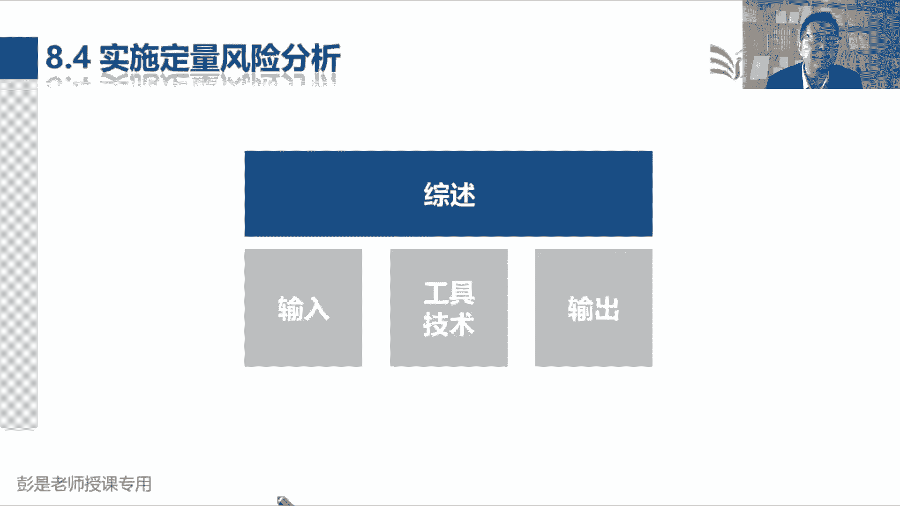
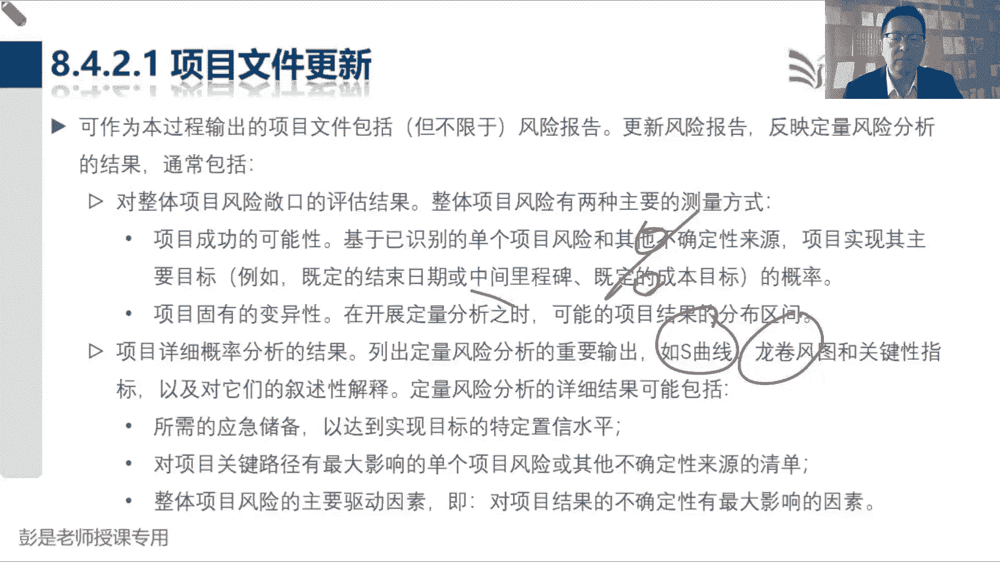

# 2024年最新版PMP考试第七版零基础一次通过项目管理认证 - P53：2.8.4 实施定量风险分析 - 慧翔天地 - BV1qC411E7Mw

那接下来8。4定量风险分析，这个管理过程仍然以工具为主，这个管理过程仍然仍然以工具为主啊，但是呢这个管理过程啊，基本上他的工具啊现在不大会考，所以需要大家掌握大道理，听懂就可以，记不住，没关系啊。

大道理是什么呢，等我变成黑板。

现在是黑板啊，专心听这段听起来超复杂的，但其实最后一总结就几个字，是说呀，我们要对整体项目做量化分析，对整体项目做量化评估，那我们前面说定义活动排列，活动顺序，估算活动持续时间的时候。

用到了一个工具叫三点估算，当时说用三点估算啊，我们来估算活动持续时间，比如说从加到公司到底需要多久，有的时候快，有时候慢，它存在着不确定性，这叫变异性的风险吗，它在某些方面存在着变数，可能有最小值。

有中间值，有最大值，就是最乐观，最悲观，最可能，并且默认我们用贝塔分布就可以算出来，期望时间，我们用贝塔分布用最小值加上四个中间值，加上一个最大值，然后除以六就可以算出来期望结果了，随便给个数啊。

比如说期望结果是一个小时，但是能确保一个小时肯定到公司吗，不一定了，为什么呢，因为它本身不确定啊，有的时候快30分钟，有的时候慢两个小时，大多数情况下可能就是一个小时，那有的时候快，有时候慢。

有时候堵车，有的时候不堵车，它仍然存在着不确定性，所以我们没有办法确保能够在一个小时到公司，所以要去分析概率了，对不对，有多大可能性，一个小时到公司呢，那这个概率分析啊，带出来另外一个知识点叫什么呢。

叫正态分布，接下来这段话都是能听懂就够了啊，关于正态分布的数字计算方法呀，现在不要求不需要掌握的，正态分布是什么意思呢，这是科学家说了这个事情啊，它发展的有规律啊，这个规律啊，你只要找到七个坐标值。

我们就能够告诉你它可能性大概是多少，这七个坐标值中间就叫坐标原点，然后呢左边分别叫减1-2减三个标准差，右边分别就是加1+2加三个标准差，然后科学家说了，科学家告诉我，这个事情在一个正一个标准差。

这个范围里发生的可能性，大概68%左右，68。26，在正两个标准差这个区间里发生的可能性，就是5。44，95左右，在正三个标准差这个范围里发生的可能性啊，99。72，那如果我们知道了坐标零点。

知道了标准差，我就可以判断它在一个区间里发生的可能性，大概是多少，那坐标零点坐标原点是什么呢，这是刚才算出来的一个小时，把它写到这个地方，那标准差怎么算呢，标准差的算法就是用最大值减去最小值。

然后除以六，用最悲观减最乐观除以六，所以假设标准差是10分钟，那左边就是减一个10分钟，所以是50分钟，然后第二个标准差就是减两个标准差，减20分钟，所以还剩40，再往下就是减三个标准差，还剩30。

右边呢就是加10+10再加十，所以就变成了70分钟，80分钟，90分钟写出来标准差之后，我们就可以判断，这个活动在任何一个区间里发生的可能性，比如说我们50分钟到70分钟，在正一个标准差范围内。

还到公司的可能性就是68。26%，我在40分钟到80分钟这个区间里，到公司的可能性就是95%，在30~90这个区间范围内，到公司的可能性就可以提高到90%，9。72，还能算哪，我在一个小时一个小时啊。

到负无穷这个范围里，到公司的可能性，那就是一的一半，所以呢约等于50%，我只有51%半的把握，能够保证一个小时到公司，那如果想提高这个概率啊，提高这个概率，我们就适当的适当的需要宽限一些时间吧。

以此类推，我们就可以求出关于这一个活动一大堆的数据，一大堆堆到什么程度呢，比如说这个活动有最小值，中间值最大值，然后呢我们用最大最大分布算出来期望时间，我们再用标准差算出来最大值减最小值除以六。

这个偏差，然后呢就可以结合正态分布，得到一大堆的可能性，比如说这个活动在一天内完工的可能性，大概是多少，两天内完工的可能性大概是多少，三天四天，五天六天可以得到一大堆的数据啊，还可以再继续变化的。

一天到两天内概率是多少，两天到三天内概率是多少，一天到三天内概率是多少，所以关于这一个活动，我们就可以得到成百上千个数据，这只是一个活动吧，那我们现在要对整体项目做量化分析。

你项目里边又不可能只有一个活动，所以还要用到网络图，因为有的活动是并行，有的活动是串行，因为网络图里面可能有成百上千个活动了，这事儿怎么算呢，就超复杂了，还要算什么方差，然后恩格独立事件同时发生的概率。

等于各自发生概率的乘积，所以这事儿啊靠人搞不定了，通常需要科学家闪亮登场，帮我们建立一个数学模型，就是算法，建立数学模型之后啊，咱把这堆数据啊交给科学家，他录到软件里，然后噼里啪啦一顿，噼里啪啦一顿算。

就可以得到整个项目工期，它的概率分布情况，比如说一年内完工的可能性大概是多少，两年完工的可能性大概是多少，3年四年五年，一年零一天，一年零两天，一年零一个月，以此类推，我们就可以不断的迭代，不断的模拟。

不断的迭代，不断的模拟，得到整个项目工期的概率分布，这就是从三点估算到建模到模拟到蒙特卡罗，这就是定量风险分析要干的事情，所以以此类推了，以此类推了啊，这就是定量风险分析最复杂的一个知识点。

就听起来稍稍洗车的步骤有点多，所以通常大多数项目不一定需要做这个事了。

对呀，项目工期不就是整体吗，项目工期就是整体吧，就这意思，好这就是定量风险分析，它最主要的知识点，结合到前面的三点估算，然后结合到正态分布，我们可以得到关于活动很多很多的数据，然后呢有的活动是串行。

有的活动是并行，我们这玩意儿就超复杂了，所以通常需要科学家利用他的专业知识，帮助我们建立这种科学的算法，就是模型再再总结，那就是大数据再总结，那就是大数据对吧，比如说什么百度啊，什么什么高德呀。

这些导航，他现在给出的这些估算估算结果为什么准呢，有模型，有算法，有大量的数据，然后通过各种各样的拟模拟来推算出，你最可能到公司几点，给出一个最靠谱的估算结果，对不对，好知道这个意思啊。

所以这个管理过程，这个管理过程主要工作就是做这个事情，听懂知道大概意思就够了，这东西啊，通常这刚才说啊，简单的项目不需要这么复杂呀，不需要搞这个这么啰嗦呀，通常是大型复杂项目，大型复杂项目才需要搞。

比如说登月，登月对吧，发宇宙探测器上月球上火星这玩意就啰嗦了，因为涉及到的因素太多了，又都存在着变数，弄多大火箭呢，带多少燃料啊，带多少装备啊，带多少人呐，什么时间发射呀，从哪发射呀，速度是多少啊。

然后怎么就登月了，几几月份发射呀，在什么纬度发射呀，这都有讲究啊，都有讲究吧，随便一个因素发生变化，可能就会登月失败，登火星失败，那我们要噼里啪啦一顿算，找到一个最靠谱的解决方法，这就是定量风险分析。

包括疫情，张三可能传染新冠，李四可能传染新冠，每个人都有一大堆的数据的，有的人三天就康就痊愈了，有的人四天痊愈了，有的人密切接触了，但是没传染，有的人密切接触了，可能潜伏期三天，潜伏期十天。

那其实当时科学家就建模型了吧，推测推测我们这疫情啊大概多长时间能结束啊，有百分之多少的可能性啊，这是大数据分析，建立一个算法，一个超牛的模型，把相关的数据全都扔进去，然后他经过成百上千上万次的迭代。

就可以得到整个项目工期，整个项目成本的概率分布，所以这个管理过程听完了这个大概意思，先看输出，看叔叔啊，说我们更新的是风险报告，风险报告里面写什么呢，什么S曲线啊，龙卷风毒啊，巴拉巴拉这些文字。

这些单词啊，S曲线是什么呢，就是啊，按预算完成项目的可能性，所以它叫S曲线概率分布图，S曲线概率分布图，100万完成项目的可能性是多少，110万完成项目的可能性是多少，120万完成项目的可能性是多少。

这叫S曲线的概率分布，便于我们合理的分析这个项目到底需要多少钱，它和刚才算时间那个逻辑一模一样，算时间，我们用进度模型算成本呢就用成本模型好，他所以更新风险报告，对整个项目给出这些分析的结果。

知道这个大概意思啊，那这个管理过程再看他的i d do的话，就需要大概记住这三个东西了，我们要对整个项目的工期，整个项目的成本得知它的概率分布情况，所以呢就用到了第一个工具叫模拟模型，模拟它的主要。

写错字了啊，它的主要需要记住的术语叫什么呢，叫蒙特卡罗，蒙特卡洛，蒙特卡洛老先生就帮我们搞这个事情，建立科学的数学模型，通过拿到数据不断的迭代，不断的模拟活动，A先假设它等于一天活动。

B假设它等于两天活动，C等于三天，算一算完工的可能性大概是多少，活动A改成两天活动，B改成一天活动，C改成两天，算一算完工的可能性大概是多少，求这个粗暴理解，就这个意思，拿到数据不断的模拟，不断的模拟。

最后呢告诉我们，整个工期一年完工的可能性大概是多少，一年零一个月完工的可能性大概是多少，得到整个项目的叫里程碑概率分布图，这就是蒙特卡洛分析方法，这个单词要记住，它就是定量风险分析，模拟对标到蒙特卡罗。

蒙特卡罗到底干啥用的啊，再拐个小弯，蒙特卡罗老先生，蒙特卡罗老先生把它称为人名，只是方便大家理解，方便大家记，但其实他不是人名，他是第一名，蒙特卡洛这个地方比较出名的是干啥的呢。

蒙特卡洛这个地方出名的出名的，出名的地方是什么呢，你只要能想到什么叫蒙特卡洛分析方法，就搞定了，博彩就赌博对吧，什么赌球啊，赌马呀，彩票啊，就这种东西，那博彩行业人家主要工作是什么呢，玩概率。

先进球队的可能性是多少，一比零的可能性大概是多少，二比零可能性大概是多少，三比零可能性大概是多少，对不对，一比一的可能性大概是多少，有多少人会买这个这个彩票卖多少钱，卖，卖贵了买的人就少。

卖便宜了买的人就多，但是呢还要考虑中奖的概率是多少，未来我们的收益是多少，这玩意儿靠人算肯定算不清楚的，所以需要用软件，需要有专业知识科学家帮我们建模型，输入相关的各种数据做模拟。

从而得到整个项目的S曲线，概率分布图或者是里程碑，概率分布图来帮助我们做辅助决策，这就是人家的主要工作，所以包括证那个证券保险公司都干这个事了，保险公司说我们要推出一个什么航班延误险，卖多少钱合适呢。

卖90块钱啊，可能有1万人买单，记住啊，可能卖80块钱，可能有2万人买单，卖70块钱，可能有33万人买越便宜，可能买的人越多，但是呢这航班一延误啊，我们有多大概率会赔钱呢，会赔多少呢。

这里边涉及到各种各样的概率，所以呢我们要对整体情况做一个量化分析，帮助我们做决策，那不得不提，接下来就是涉及到决策树了，决策树分析先有个印象啊，他就是在多种方案，多种方案如果存在着不确定性。

那到底怎么做选择，到底怎么做决策的一种辅助决策方法，首先说确定的方案，说现在有两只股票，A股票你买了之后会赚1万块钱，B股票你买了之后肯定赚2万块钱，它不存在着不确定性，这种情况下做决策其实很简单。

谁赚钱多就选谁，因为机会成本小对吧，机会成本选择A放弃B放弃掉的，放弃掉的代价小，但是如果存在着不确定性，这股票怎么买呢，A股票说有60%的可能性会上涨，40%的可能性会赔钱，B股票啊。

70%的可能性会上涨，30%的可能性会下降，那你怎么做决策呢，所以决策树就干这干那个事了，我们把每一种方案，它各种可能性用概率乘以影响，如果是赚钱的，就表示为正，这是机会，如果是赔钱的呢，就表示为负。

就意味着威胁，然后用概率乘以影响，概率乘以影响，把它全都加到一起，这样就得到这个方案的叫预期货币价值，EMV算出来每一种方案的预期货币价值之后，我们就可以看谁打就打就买，谁说明胜面大赢，他赢钱的可能性。

赚钱的可能性高一点，这就是后面要讲到的工具技术叫决策树，先听一听，有个大概印象，所有的工具，所有的工具后面会单独讲的，看看看工具那张图，超好理解的啊，现在先听一听意思好，所以模拟是蒙特卡罗老先生建模型。

输入数据，得到我们这个成百上千上万次迭代的结果，让我们知道它在什么区间里，发生的可能性大概是多少，决策树呢主要是多种方案之间，如果存在着不确定因素，那我们在两种方案之间做选择，就用到了决策树到底选谁。

他就是计算每一条分支的预期货币价值，那敏感性分析它主要干啥的呢，这个东西这个工具啊，大家要牢牢记住五个字叫擒贼先擒王，擒贼先擒王，比如说我们发现班上有张三，李四王五赵六四个同学，谁最调皮捣蛋。

就先把谁收拾的服服帖帖，就这意思吧，那我们敏感性分析啊，就是分析啊，谁会影响进度啊，谁会影响成本呢，找到影响进度，影响成本的这些因素，然后看看他们影响大还是影响小，谁影响大，谁就排在前面，谁就排在前面。

谁音响小，谁都排在后面，所以它的结构特别特别像龙卷风，又被称之为龙卷风图，大家记住这个中心思想啊，所以模拟敏感性分析决策树，这三个是一需要掌握的工具，知道他做什么事了。

但是到现在我先给大家说一说一个初步的印象，后面讲工具的时候，再大概说一说中间这个不确定性表现方式啊，基本上也不考这个不确定性表现方式，就是刚才说的正态分布，这基本上也不考正态分布。

现在这个数据也不要求大家记得，以前还要记得，大家记得三个常量，通过三个常量，我们能判断这个活动在一个区间里完成的，可能性大概是多少，还要掌握这个算法，现在的复杂计算基本上不考，所以不要求掌握了啊。

大概知道怎么回事就够了嗯，所以就像这套说辞啊，它可以适用于很多很多很多的场景，比如说大家有没有听过什么阿尔法狗，阿尔法狗，他怎么跟你下棋呢，玩什么呢，概率对吧，他怎么给你下棋啊。

他算各种各样的各种场景的可能性啊，对不对，你就不敢下五子棋呀，下围棋呀，我往这放了个黑棋，对方往这放了个白旗，我要去思考了，接下来他走这儿的可能性大概是多少，走这我会怎么对付他，他会产生各种各样的分支。

他算每一种分支赢棋的可能性大概是多少，算每一个分支赢棋的可能性大概是多少，这不就是决策树吗，找到对自己最有利的一个决策结果，然后呢他就走这了，以此类推了吧，再根据对手的下一步棋再去分析未来。

我往这儿走棋，往这走棋，噼里啪啦一顿算了，算出来对自己最有利的一步棋，然后往下走，以此类推，它就是模拟决策树，模拟决策树，模拟决策树，对不对，对，各种可能性成百上千上万次的模拟，上万次的迭代判断。

应期的可能性，在众多赢棋方案之中，找到一个对自己最有利的方案，就叫决策树了吧，好知道这个意思啊，所以最后一总结定量风险分析约等于大数据，就是干这个事了，大数据加人工智能哎。

一大堆数据科学家加上我们的程序员，就可以把这个阿尔法狗做出来了，嗯好知道了意思，所以这个管理过程，这个管理过程主要作用，对已识别的单个风险和不确定性来源，对整体目标的影响做量化分析。

接下来教材上这句话超级重要，需要记住，本过程并非每个项目所必需，这也是我们49个管理过程里面，唯一一个可以跳过的管理过程，因为刚才说了，这事靠人肯定搞不定，需要软件，另外呢怎么建这个模型啊，没有数据。

没有数据统计分析的这个专业知识也搞不定，需要专业知识，那噼里啪啦一顿模拟，一顿迭代，一顿模拟一顿迭代，这需要时间，需要资源，会产生成本，一般项目也没必要，一般项目没必要吧，比如说就像各位同学中午叫外卖。

商家在一分钟之内出餐的概率是多少，2分钟出餐的概率是多少，3分钟出餐的概率是多少，外卖小哥一分钟到餐厅的概率是多少，2分钟到餐厅的概率是多少，3分钟到餐厅的概率是多少。

外卖小哥10分钟到你家的概率是多少，11分钟到你家的概率是多少，12分钟到你家的概率是多少，诶就这么几个活动，它存在着各种各样的可能性，那我们呢建立一个科学的模型，把这些数据放到模型里，不断的迭代。

不断的模拟，最后呢就可以得出这顿饭多长时间能吃上，它的可能性大概是多少，10分钟送到你家，可能性大概是多少，12分钟送到你家，大概可能清楚多少，美团不就这么玩吗，好你说这小事咱有必要这么这么兴师动众吗。

对个人来说没必要，但你说对美团来说有必要吗，有必要啊，对不对，全国每天每天几10万个骑手在路上跑，他一定要去算概率，一定要算概率啊，然后呢给骑手一个最合理的时间对吧，其中一个最合理的时间。

他要去算各种各样的可能性，各种各样的可能性，其他商家平常出餐的速度是多少，高峰期非高峰期，这初三的速度不一样啊，对以此类推，以此类推好，所以大型复杂项目，那很有必要很有必要得到得到，得到各种各样的数据。

然后建立我们的数学统计方法模型，最后呢各种模拟得到各种各样的概率分布情况，知道这个意思啊，好那这个管理过程再往下看综述，这段文字就再说了，并非所有项目都需要实施定量风险分析，能不能开展这个东西呢。

取决于很多条件，数据可靠不可靠，模型靠谱不靠谱，需要用软件，需要有专业知识，需要人财物，仿真模拟你是算概率吗，还是只要只是在获取数据场景不一样吧对吧，比如说你研发汽车呀，研发飞机呀。

看看这个汽车汽车对吧，什么零件上受到的风力影响是多少，散热是什么东西，你是为了采集数据的，而不是算概率，虽然听起来意思差不多，对不对，但不一样好再往下拉啊，那项目风险管理，所以通常适用于什么项目呢。

大型复杂项目具有战略重要性的项目，合同要求进行的巴拉巴拉丰田了，总之简单的事情没必要对吧，什么玩彩票啊，证券啊，赌博呀这种东西才需要呢，所以赌场不也是算概率吗，打麻将算概率，各种各种概率吧，啊。

再往下这个管理过程，就没有什么需要去记的东西了啊，那接下来说，通过评估所有单个风险和其他不对不确定性，不确定性来源对项目的综合影响，这就是定量风险分析，看看这个事情，输入输入啊，其实啊粗暴的去记。

我们要想得到整个项目工期的概率分布，需要什么样的原材料呢，这是和时间有关的各种东西，资源时间，各种估算结果，包括持续时间，估算什么里程碑呀，这都跟时间有关系吧，就需要和时间相关的原材料放到我们的软件里。

放到我们的工具里，然后呢建模型噼里啪啦一顿算，就知道整个项目工期的概率分布了，以此类推，如果我想知道整个项目成本的概率分布，那就把和成本相关的数据拿过来，放到软件里，噼里啪啦一顿模拟。

得到整个项目成本的概率分布，所以他的收入不太需要刻意的去去记啊，就是和时间和成本有关的东西，包括资源，资源的数量，资源的水平都会影响的，包括网络图啊，什么事故活动持续时间大，总之和时间有关的。

和成本有关的都在这好，所以输入不太需要去记，大概知道什么，知道什么意思就可以了啊，然后输出呢也没什么东西了，这是刚才用的什么工具，就把这里把它往里写，S曲线告诉我们多少钱的概率是多少。

龙卷风图就是那个敏感性分析，擒贼先擒王，看看什么东西影响大。

