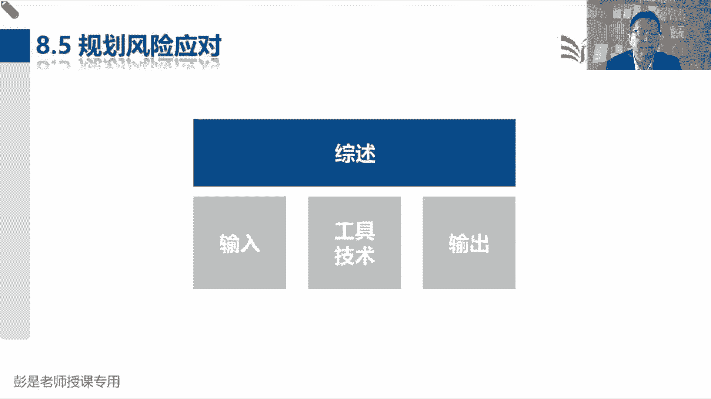
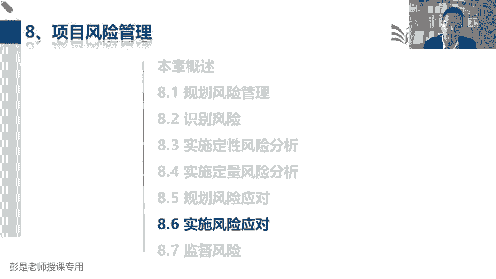

# 2024年最新版PMP考试第七版零基础一次通过项目管理认证 - P54：2.8.5 规划风险应对 - 慧翔天地 - BV1qC411E7Mw

那8。5规划风险应对这个过程了，如果先抛开输入输出，先抛开工具技术，其实没东西，就是啊规划应对措施，就像疫情期间戴口罩啊，居家隔离啊，测体温啊，消毒啊，喷酒精啊，做核酸检测，对集中隔离各种措施吧。

穿什么护目镜啊，防护服啊，这都是规划应对措施，但是对不同的不同的风险，我们可能采取的措施是不一样的，所以他给出了这么这么几个东西啊，第四个工具叫威胁应对策略，第五个工具那叫机会应对策略。

第第六个工具那叫应急应对策略，主要牢牢记住这三个东西就搞定了，威胁应对策略有五种，机会应对策略也有五种，先大概听一遍啊，威胁都能怎么对付他呢，威胁，等我换白板黑板。

回节等等，怎么对不对呀，抢银行可能会被抓对吧，抢银行可能会被抓，咱就不抢了呗，这是什么呢，回避，躲开它对不对，疫情期间出门可能传染新冠，咱就不出门了，这就是对风险的回避，规避，躲开他，躲开他，躲开他。

好在拿疫情说事吧，疫情期间出门可能会被传染，新冠戴口罩目的是什么呢，戴口罩，戴口罩能够做到不被传染吗，好像也不能，那能做到什么呢，减轻，减轻就是降低被传染的可能性，降概率讲概率吧。

哎就叫减轻降低被传染的可能性，然后你戴的口罩不一样，这个概率降的也不一样吧，普通口罩啊，医用口罩N95口罩啊，戴防毒面具啊，嘿这都是降低被传染的可能性，好搞定啊，规避减轻，那疫情期间出门可能传染新冠。

我不去了，让张三去，这是什么呢，我不去了，让张三去，让张三去，诶这很好理解啊，就叫风险的转移，把风险造成的影响转嫁给第三方，对不对，转嫁给第三方，所以就让大家日常买什么交强险，买保险，这是什么呢。

万一撞车了，保险公司给赔呀，把风险造成的后果转嫁给第三方，但买保险就需要花钱了吧，让张三去，需要给人家点好处吧，所以通常风险转移，风险转移我们得付出点啥，没有无缘无故的爱啊，这是风险的回避呀，减轻啊。

转移啊，然后再往下再往下啊，我发现了发现了别的城市有人传染新冠了，有人感染新冠了，这事跟咱没关系怎么办呢，跟咱没关系的事，或者这事儿啊，咱也做不了主，怎么办呢，告诉领导，和谁有关系就告诉谁呗。

这就是上报，这就是上报，对吧，你走在路上看到有看到有人交通违法了，有人就会拍，拍完了之后上报给交警啊，因为啥呢，咱也做不了主，这事儿跟咱也没关系，咱也没有这个执法权，那就谁能管报给谁。

所以通常跟咱没关系的风险，或者是超出了项目经理的权力边界，咱也做不了这个主了，就上报和谁有关系，报给谁，谁能做主，报给谁好，最后一个场景啊，疫情期间可能会被传染，新冠就这么着，爱咋咋地。

这是对风险的什么呢，这好理解吧，就这么着，无所谓，没关系，就叫风险的接受，你把躺平换成专业术语啊，接受接受就躺平摆烂，意思是这个啊这是对风险的接受好，所以风险威胁威胁威胁不好的东西，我们可以躲开它。

我们可以降概率，是减轻对降概率或降影响，然后呢可以把这个造成的后果要转嫁给第三方，这就是找风险的转移，跟咱没关系的事情，超出了咱权利范围之外的事情，我们就上报，最后呢我们也可以接受，对不对。

请通常用于什么低风险小事情，这叫威胁的音乐策略，机会的应对策略怎么学呢，机会的应对策略啊，后三个和威胁后面这三个一模一样，威胁有接受机会，也有接受一样的威胁，有上报机会，也有上报威胁，转移。

把不好的事情转嫁给第三方，那好的事情咱就不能叫转移了，换个词，发现好事和第三方，那应该怎么说呢，不要转移了吧，就想分享，对不对，就是大家，你看看你微信群里面肯定有人分享这个东西吧，结果发现京东今天发券。

发现今天淘宝什么什么有券，咱俩一起组团买呀，可以省钱的，发现了省钱的机会，分享给第三方，这是好事啊，唉所以分享和转移都涉及到第三方，它是一样的啊，私吞就不对了，好所以后面大家复习的时候。

唯一需要区分的就是你威胁，有回避，有减轻，那我机会呢有一个东西叫开拓和提高，减轻是降概率，降影响，提高呢就是提概率提影响，这好理解，对不对，一个是降，一个是提，那规避呀是想办法让它变成零。

提高呢开拓呢就是想办法让它变成百分之百，规避是想办法让这个风险跟咱没关系，咱躲开他，那开拓呢就是想办法让他做到百分之百，所以其实开拓和提高，他俩的本质区别就是量变和质变，量变和质变啊，所以接下来看看。

只要把他俩搞定就OK了，开拓是说确保机会百分之百得以实现，提高呢就是提高这个东西的可能性，提高这个东西的影响，比如说大家经常吃的那个瓜，我怎么做来提高买彩票中奖的可能性，怎么做来提高中奖的概率呢。

多买点怎么做能够确保百分之百中奖呢，怎么做，确保百分之百中奖了，全买这件事，这个行为性质上发生了变化，这个行为性质上发生了变化，对不对，多买几注，这就是量变全买，这就是质变，行为性质上发生了变化。

这就是开头和提高的本质区别，哎就这个意思啊，对吧对不道德的东西咱就不聊了啊，找内部人员串通确实能够做到百分之百，但是找内部人员串通一气，这是不是性质上发生了变化呢，对不对好。

所以他其实啊开拓开拓就叫非常规的手法，非常规的措施不一般不寻常，这叫性质上发生变化，还知道这个意思好，先听一听啊，后面讲到书上那段内容的时候，再看文字应该就没什么东西了。

然后接下来说了开拓，说了威胁，说了机会，那第六个啊，什么叫应急应对策略呢，应急应对策略，大家看看身边的人和事啊，看看身边的人和事，就是说气象台已发布什么预警，周围有没有人开始采取一些应急计划呢。

就这东西吧，一发一发，什么蓝色降温啊，大风啊，下雪呀，暴雨呀，诶那我们要采取一些应急计划，那气象台发布的这些东西称之为什么呢，信号，征兆，看到信号，看到征兆，某些风险发生之前可能会有一些征兆和信号。

看到这个征兆，看到这个信号，我们可以执行一些风险，发生风险发生后来采取的应急计划，应急措施对吧，人家一说马上天气天气到夏天了，要刮台风了，气象台发了台风预警，咱这个门炸窗啊，该加固的加固啊，对不对，诶。

看到征兆，看到信号，收到通知，我们就采取应急计划，这就是应急应对策略，我们要考虑有些风险发生之前可能会有信号，比如说各位同学，现在看看你房间里的烟感探测器，还有那个喷水的那个喷头，就干这个事儿吧。

着火之前烟雾浓度，烟雾浓度诶，我们弄个探测器浓度达到多少，我们认为已经着火了，那个喷喷水的东西就开始干活了，这就是看到信号采取应急计划，这就是456，大概是先听一听啊，然后第七个工具呢。

基本上都可以不记它这个名字，整体项目风险应对策略，因为456是风险责任人，根据根据他负责的风险规划应对措施，第七个工具呢就是项目经理，我们要对整体风险规划应对措施，所以实际上它的内容七就等于4+5加六。

内容是一样的，这个第七个工具名字不太需要去背好，搞定工具，搞定工具之后啊，最后呢再搞输入输出，仍然拿新冠疫情，拿这个东西去想做核酸，戴口罩，喷酒精护目镜，防护服，做核酸是吧，什么什么扫码登记。

这都需要时间，这都需要资源，这会产生成本，还增加了我们一些额外的工作，就改变了我们项目的范围，进度成本资源甚至天天天天捅嗓子，捅得心情不好，可能还会影响到工作质量，所以呢其实就是应对措施。

可能要调整其他知识领域输出，搞定规划，好的应对措施可能会改变我们的范围，进度成本质量，资源沟通风险知识你都有可能发生调整，那收入呢其实也没有什么，没有什么需要去记的啊，那我们这些规划好的应对措施啊。

我们有没有时间，有没有资源，有没有钱去干这个事情呢，涉及到相关的东西都可以作为输入，嗯好，所以这个管理过程知道他工作工作什么事情，输入输出不太需要去背，然后呢后面再复再讲工具基础技术的时候。

再把456给他搞定，那这个管理过程，这是根据我们的风险规划，应对措施，后面这堆文字以看为主，风险责任人的主要工作一定要记住啊，他来负责风险应对措施的规划和执行，然后后面这段文字啊。

就在说风险和方案应对匹配性，这段文字呢就在说刚才那个之前给大家讲过的，桃园三结义，刚才没说备选方案分析，成本效益分析，多标准决策分析，不要把鸡蛋放到一个篮子里，兑付风险可能有更多的方法，备选方案分析。

那这么多方法我们要做选择，就考虑成本效益，另外呢考虑其他因素，最后呢达成共识，达成共识，这段文字就在说那三个三个工具好，那输入没有什么新的知识点了，然后呢输出，8523，8523超级超级超级重要啊。

因为他把我们一大堆术语全放到这，所以这几个单词，接下来标记的一个单词还是需要记的啊，没标记的就停一停，知道怎么回事就够了，商定的应对策略就是回避啊，转移啊，减轻啊，提高啊，开拓啊，什么上报啊。

然后实施所选应对策略所需要的具体行动，这是根据策略到底怎么减轻被传染的可能性呢，可以戴口罩，可以喷酒精，护魔镜防护服，具体行动啊，想多听风险所发生的触发条件，征兆和预警信号。

某些风险发生之前可能会有一些条件，有一些征兆，有一些预警信号，比如说车快没油了，车就会滴滴滴提醒你啊，亲车没油了，那我们就需要执行应急计划，该加油的加油啊，就这意思吧，蓝色降温，蓝色大风降温。

这都是征兆，发现征兆，发现信号，执行应急计划，这是一对儿好，中间藏的这一行也不需要去记啊，实实施风险应对，我们需要资源，时间和成本口罩，这不要钱吗，做核酸，这不要钱吗，还要时间呢啊，这不用记。

所以第一个术语呢就是应急计划，看到他就想到征兆信号，第二个术语叫弹回计划，弹回计划是这么写的啊，供风险发生且主要应对措施不足以应对时使用，因为我们规划好的应对措施，一招可能不好使，还要想一个备选计划。

这个备选计划就称之为弹回，这是ab计划，比如说我要从北京去上海，然后人家航班公司通知我这个飞机啊，可能会被取消，现在发现了一个风险，那我规划了一个第一个应对措施，如果如果飞机航班被取消，我坐火车。

这就是我的A计划好，现在现在A计划万一不好使，B计划是什么，开车去再弄一个备计划，这样人家通知我航班被取消，我去买火车票，万一火车票没买到，还能开车去，所以B计划就称之为弹回计划。

当我们的主要应对措施不好使的时候，采用的第二套方案，这就叫弹回嗯，以此类推了，我在某宝上买东西，这个商家呀可能会发货晚或者是坏，可能是不发货，虚虚假发货，他万一发货晚了。

哎我的A计划可能是在某东上下订单，这样还来得及，万一某东上也是一个无良商家，我还得准备一个备用计划，比如说某多多，那这个某多多就是我的弹回计划，是为了应对风险的B计划，这就是弹回搞定搞定谈回计划之后呢。

剩下两对好朋友，一个叫残余风险，一个叫次生风险，这俩也超好理解啊，残余风险，残余风险就是旧风险，次生风险就是执行了应对措施，导致产生的新风险，还是新冠，戴口罩，戴口罩，戴口罩能有效的降低被传染的可能性。

但是呢还可能被传染，这就是残残余风险，这就是残余风险，那根据概率论，带多个口罩，这个概率就会降到很低很低很低，带一个带十个，带八个，随着口罩，口罩的增加，又可能导致产生新的问题对吧，大脑缺氧变植物人。

这就叫次生风险，由于实施了风险应对措施导致产生的新风险，这就是这对好朋友，好所以这段文字还是值得大家多看多看，要记住这些术语，征兆信号，对应急计划，另外呢应对风险，不要把鸡蛋放到一个篮子里。

还要有一个一主一备，尤其一些重大风险，重大风险能回避的回避，能转移的转移，万一不好使呢，还有第二套方案，然后呢，旧风险就称之为残余，由于采取了应对措施导致产生的新风险，就称之为次生风险。

那接下来现在是15。25，大家再缓口气。

然后我们讲8。6和8。7。