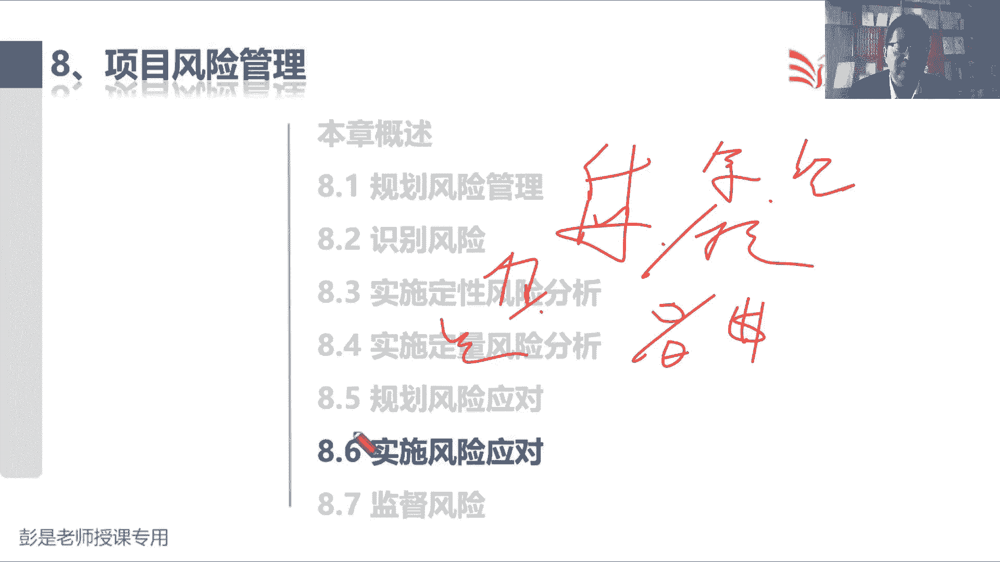
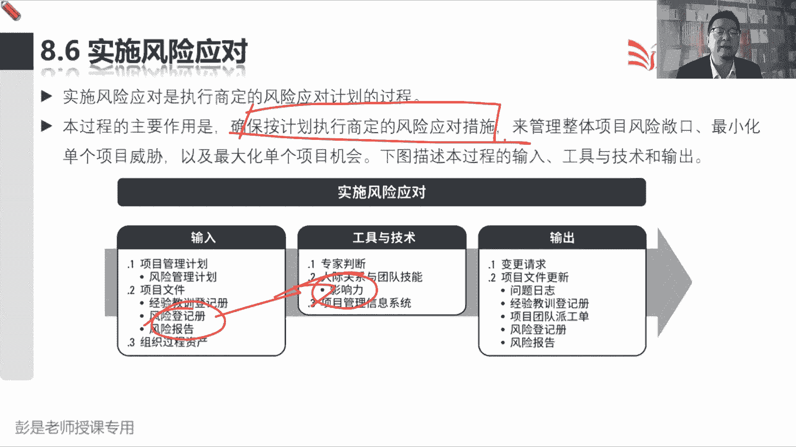
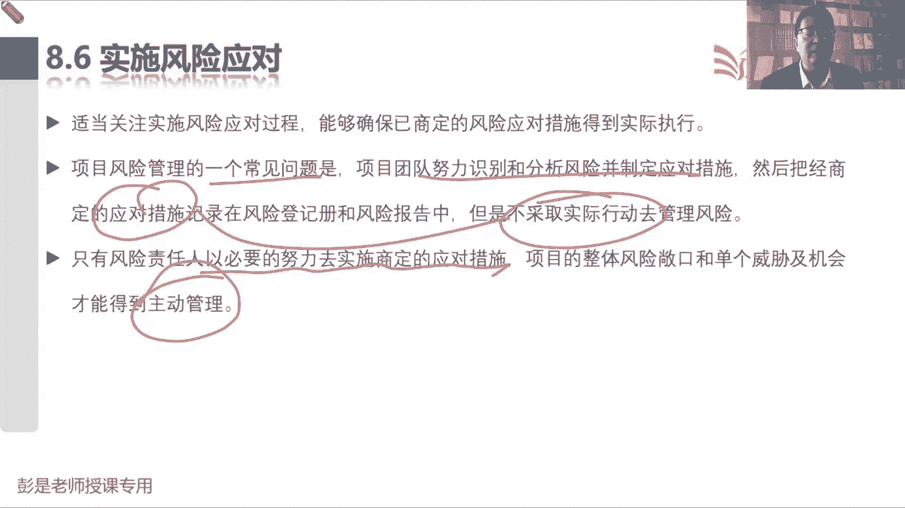
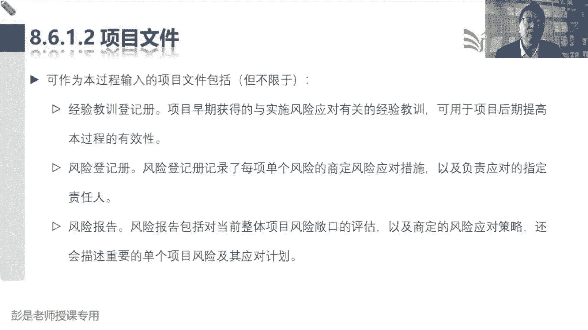

# 2024年最新版PMP考试第七版零基础一次通过项目管理认证 - P55：2.8.6 实施风险应对 - 慧翔天地 - BV1qC411E7Mw

好各位同学准备了，还有30秒钟时间，即将开始下一小段课程了，还有15秒钟时间，9876543210，信息量不大呀，先抓大放小，抓大放小是什么，搞定每个管理过程的工作，知道大概意思。

大概想一想他的输出工具技术啊，能记多少记多少，慢慢在不断的巩固，后边还会单独讲，对不对，规划风险管理，出一个风险管理计划，得到那个等级的定义，画一个矩阵，下班了再弄一个RBS识别风险记登记册。

整体风险及报告，定性风险分析管你用什么方法呢，对每个风险做排序，排序结果更新到登记册报告，重新统计一下定量风险分析，对整个项目做量化分析，看看整个项目工期多少都可能性大概是多少。

看看整个项目成本可能性大概是多少，有多大把握在什么时间内完成项目工作规划，风险应对，根据这个风险的情况采取不同的应对措施，回避呀，转移啊，减轻啊，这没那么难吧，然后呢，接下来8。6，这是实施风险应对。

这个管理过程啊，根本没什么信息了，就是执行，所以这个过程后面大家复习的时候，一秃噜就过去了，主要作用啊，把它放到执行过程组，强调的是什么呢，按照计划去落实去执行，这是该戴口罩，戴口罩，该消毒消毒。

该做核酸，做核酸，对不对，该洗手洗手啊，不要有侥幸心理，所以就是我们的风险责任人，根据风险登记册和风险报告，这里面的应对措施，该执行的执行怎么执行呢，晓之以理，动之以情，发挥我们的影响力。

让大家落实执行。

仅此而已，所以这个管理过程，输入输出工具都不需要去记住它，只要知道这个过程最主要的作用就是这句话好，所以书上告诉我们啊，说风险管理一个常见的问题是，我们努力完成了一大堆的规划工作。

然后呢规划好了应对措施，但是呢不落地，侥幸心理就牢牢记住这个术语唉，所以只有风险责任人，以必要的努力去实施商定的应对措施，我们的整体风险和单个威胁和机会，才能够得到主动管理。

就这么一句话搞定这个管理过程就下班了。

所以他的收入包括工具啊。

包括输出啊。