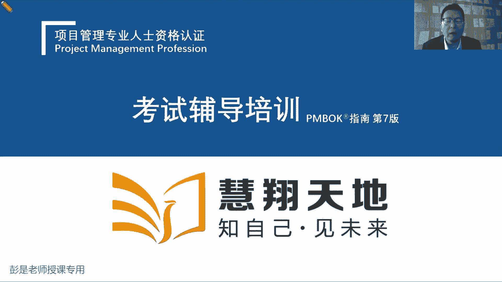
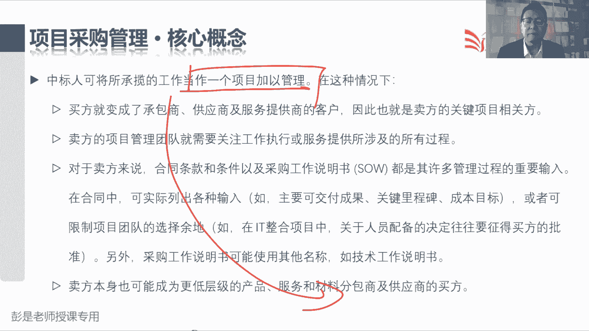
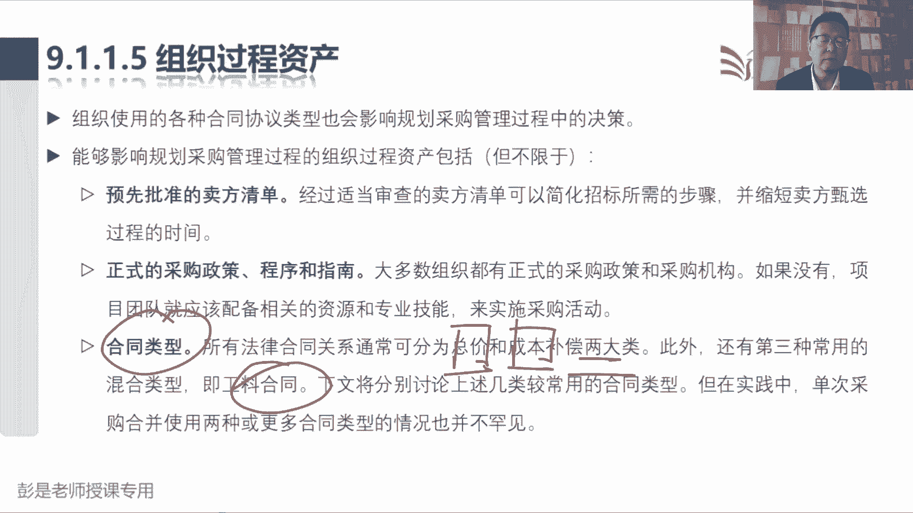
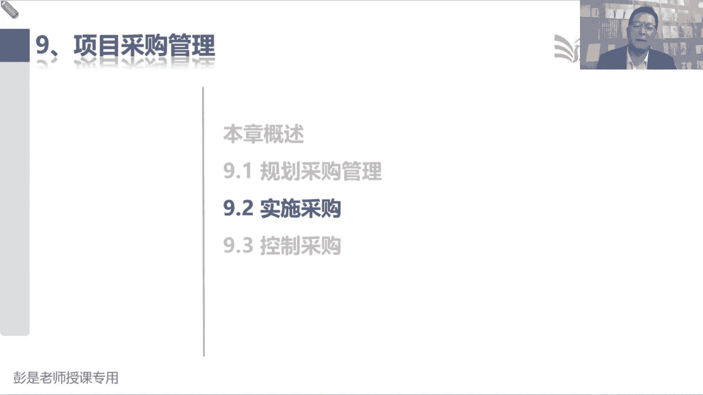

# 2024年最新版PMP考试第七版零基础一次通过项目管理认证 - P57：2.9.1 规划采购管理 - 慧翔天地 - BV1qC411E7Mw

采购这一章对各位同学来说啊，轻松加愉快，他过程少输入输出少，工具技术也没有什么复杂的东西，没有太多挑战的。

采购这一章范围进度成本质量，资源风险，搞定之后，采购管理就三个管理过程，超善良啊，第一个管理过程叫规划采购管理，第二个管理过程叫实施采购，第三个管理过程叫控制采购规划采购，实施采购。

控制采购规划采购主要工作是什么呢，就是看看有啥可买的，就像各位同学马上可能什么618呀，对不对，马上什么618了，哎，看看家里缺啥，看看家里有什么需要买的，柴米油盐酱醋茶，什么家具啊，家电啊。

这是规划采购，规划采购，据分析我们都有什么东西需要买，实施采购这个管理过程，在执行过程组干什么事呢，就两个两两句话叫选卖方，然后签合同，所以就是规划采购，今天晚上我不想做饭了，打算叫外卖诶。

就有了一个采购的决策，接下来实时采购，这是选卖方，怎么选卖方呢，打开什么美团啊，饿了么呀，然后在上面选餐厅选菜品，看看谁家质量好，看看谁家卖的便宜，看看谁家送餐，快来以此类推，选卖方，选好了卖方之后啊。

你一交钱，这不就是在线签合同了吗，所以实施采购就是选卖方签合同，这里这样一个过程，筛选供应商，让供应商给我们出方案，出报价，最后和人家谈判签约，那签好了合同之后，第三个管理过程就是检查合同的执行情况。

所以就叫控制采购，看看餐餐厅有没有按时出餐的，外卖小哥有没有到餐厅啊，外卖小哥到哪了，麦麦小哥送过来的菜呀，是不是撒了里面有没有什么小墙，里面有没有垃圾啊，诶所以就是控制采购监督合同的执行情况。

履行情况，然后呢钱货两清关闭交易，收到东西已确认收货验收，嘿订单就结束了，就是钱货两清，关闭交易，这三个过程其实学到这个程度基本上差不多了，超好理解，唯一唯一稍稍复杂一丢丢的，这是实时采购。

那需要给大家科普一下啊，先科普一下有几个术语，先听一听这几个术语啊，是这么玩的，就来这儿写了，还有空白的吗，这现在呀我是甲方，我打算我打算盖一个火腿肠工厂，然后呢，我希望啊大家给我出方案，出报价。

那我甲方这个事儿叫什么呢，叫招标，邀请大家给我出方案出报价，对我来说，这套招标张三李四王五赵六，听到这个消息之后，就给咱出方案出报价，他们来拼价格，拼服务，拼成本，拼质量，他们给咱出方案出报价。

对他们来说，这个操作就叫投标，说到张三李四王五赵六的方案和报价之后啊，我们要选择呀打分啊，看看谁家好啊，这个操作就叫评表来评价，张三李四王五赵六他们的方案和报价就叫评标，评完标之后啊。

哎我觉得赵六他们家的方案好，质量好，然后呢靠谱又便宜，那就把赵六称之为中标人，中标人中标人，接下来我们要和赵六干什么呢，谈判谈合同的具体条款对吧，首付款是多少啊，什么时候验收啊，什么时候交付啊。

什么时候画图纸啊，还以此类推谈各种各样的细节性的条款，然后呢就是签约和中标人谈判签合同，这就是实施采购，从招标到投标到评标到中标，到最后签约，记住这个步骤，记住这个顺序，实施采购就学差不多了。

好这就是大概这一章这三个三个管理过程，规划采购，看看有啥可买的，实施采购从招标到投标到评标到中标到签约，签好合同之后，拿着合同检查一下供应商该干的活，干了，干了没有，检查一下供应商交付的成果。

是不是符合我们的要求，如果没问题，钱货两清，关闭交易，咱这个采购就结束了，好知道了，这个中心思想，这章综述看一看，基本上，基本上啊这些单词啊，看到名字大概能猜出来他做什么用的就够了，规划采购管理。

除了标准的采购管理计划之外，还有一个输出叫自制或外购决策，并且呢这个输出啊其实记得住，记不住没关系，因为是纯粹的字面意思，就是今天晚上到底是自己做饭还是叫外卖，这就叫自制或外购角色。

就叫自制或外购决策吧，就是这个决策的结果，如果最终的决策结果是自己做饭，那后边这些管理过程可能就没了，如果最终的决策结果要是叫外卖，才有后评这一大堆事情，那有了自制或外购决策之后，我们还要写几个文档。

一个叫采购策略，采购策略，采购策略这个东西放到后面再学，放到后面再学啊，他一会儿不就讲了什么合同类型啊，这些知识点采购阶段划分的诶，这个记记记不住没关系的啊，然后招标文件，采购工作说明书，供方选择标准。

独立成本估算，这四个东西是需要记住的，都是规划采购的，输出招标文件干什么事的呢，只是告诉张三李四王五赵六，我们这有个事叫招标，给人家给人家说清楚，咱招标这个事对吧，怎么来，什么时候招标，然后怎么投标。

怎么开标，邀请人家来投标，就叫招标文件，采购工作说明书干什么的呢，就是你要买什么东西，说清楚，我要买个鱼香肉丝，然后呢肉的含量60%以上，少放糖，少放糖，多放点，多放点花生米，少放点盐，然后呢少放点油。

多放点辣椒，关于我们拟采购的产品服务成果的具体要求，这叫采购工作说明书，Sow，说清楚我们要采购的产品服务成果，都有哪些具体的要求，一个是说事情，一个是说东西这两个玩意儿，然后再往下呢，供方选择标准。

看名字，你只要能猜到，就是不用不用去记的供方选择标准，就是选供应商的标准都有啥，比如大家叫外卖，我要求好评率80%以上对吧，零差评，零差评成立3年以上，然后呢送餐30分钟以内诶，对不对。

成本不要超过100块钱，这就是各种各样的供方选择标准，和你那个择偶标准一样的，所以在粗暴理解啊，招标文件，我打算相亲采购工作说明书，相亲对象的去相亲对象，你要买什么东西，对详情对象你有什么具体要求。

然后呢供方选择标准，这些人过来之后啊，怎么给他打分，这些东西吧，怎么给他打分，年龄每长一岁减一分，深深体重每胖十斤扣十分，对不对，财产每多100万+1分，以此类推，供方选择标准，打分的标准。

最后呢独立成本估算，这是你打算花多少钱干这个事儿，我们内心的这个预算好，这是这四个东西啊，这就是这四个东西，招标文件不包含这些东西，不要不要用你的生活，不用这样，不要用你的工作经验去判断这个东西啊。

他既然单独写，你就单独记，书上怎么写，你就怎么记，不要结合到你实际工作场景，实际工作场景，你就是招标的文件包了，对不对，里面包括一大堆文档，好总之我们需要我们需要做这个事情，把怎么招投标说清楚。

把要买什么东西说清楚，把如何选择供应商说清楚，把你的预算说清楚，我们需要开展工作，把这四个文档写清楚，这四个文档写清楚之后，交给第二个同事，他去选卖方签合同，也就是说他去组织招投标。

他邀请张三李四王五赵六来投标，邀请张三李四王五赵六来投标，所以这四个文件就作为实时采购的输入，叫采购文档，负责采购的同时拿到这个采购文档啊，邀请张三李四王五赵六来投标，人家投标给我们出方案。

出报价就得到了这个收入，叫卖方建议书，现在咱是买东西，人家是卖东西，对不对，所以这叫卖方建议书，卖方投标的标书里面就包括了方案和建议，还有报价这些东西啊，那说到卖方建议书。

我们根据供方选择标准来给人家打分，打完分之后呢，选出来那个心仪的对象就称之为中标人，所以就有了这个输出，叫选定的卖方和中标人谈判谈成功签协议，所以他的输出还包括协议哎，这就是这个实时采购的输输入。

输出输入呢不太需要去记输出的，选定的卖方，纯粹的字面意思签好的合同，这也不难理解，所以就是这个卖方建议书要稍稍印象深，是人家给咱出的方案和报价投标的标书，然后到了控制采购，他的收入啊，先跳过啊。

控制采购，控制采购钱货两清，关闭交易，所以他的输出也不需要去记了，看看你的美团什么京东，淘宝上面都有很多订单的，有的订单前后两期确认收货就关闭了，这就是结束的采购，所以他需要大家记住的就是这个东西了。

批准的变更，批准的变更请求是实施整体变更控制的输出，他一共去了三个地方，第一个地方叫指导与管理项目工作，告诉咱成员计划有变化，不要干活，干错了，第二个去的地方呢是控制质量，需要指控的同时。

检查一下批准变更请求的落实和执行情况，第三个地方就缺了控制采购，为什么呢，他和那个去指导与管理项目工作的，道理是一样的，涉及到团队成员的变更，要及时的通知团队成员，那涉及到供应商的变更，一旦得到了批准。

也要及时的通知供应商干活，别看错了，就这意思吧，就和你叫外卖叫快递一样啊，今天不在家，然后呢告诉快递小哥，告诉快递小哥，明天再送，这不是遇到批准的变更，要及时的通知供应商了好，所以后面大家其实花时间。

花时间主要就是看规划采购，因为它涉及到的输入比较多，输出比较多，像实时采购啊，控制采购啊，基本上很好理解，就那几个话来回说，知道这个大概意思啊，再往下看这个综述，这段文字。

说规划采购管理记录项目的采购决策，明确采购方法以及识别潜在卖方的过程，就是看看有啥可买的，看看到底是自己完成还是外部采购，如果决定外部采购才有了19。2实时采购，获取卖方应答。

这是刚才那个输入叫卖方建议书，卖方建议书，卖方建议书，人家给咱出的建议和报价，这是投标的标书，然后呢我们对人家的建议书来评标，就是选卖方选出中标人，最后和人家谈判签合同。

他就是选卖方签合同这么一个管理过程，那签好了合同之后控制采购，这是什么管理采购关系啊，监督合同的绩效啊，实施必要的变更和纠偏啊，以及最后前后两清关闭交易，所以就是看合同的执行情况，有变更就变更对吧。

变更批准通知供应商，最后钱货两清，咱就关闭这卡交易，比较好理解啊，然后后面这段话，这段话就是告诉我们，告诉我们，实际工作中可能比教材里写的东西更复杂，教材里只是给我们一个粗略的指导。

告诉我们规划采购要做什么事情，实时采购大概做什么事情，控制采购大概要做什么事情，只是一个粗略的框架啊，好然后再往下核心概念，核心概念这里面字超多，但是呢没啥需要背的，没啥需要背的。

大家只要啊结合我们的生活常识，生活常识能看懂就够了，第一段说和采购过程相关的重大法律，义务和惩罚，虽然项目经理不必成为采购管理的法律，法规领域的专家，但是呢我们应该有所了解，所以教材里面写了这个知识点。

以便呢最后和管理合同的时候，做出一些明智的决定，这都停已经就完事了，第一个要点，通常情况下，项目经理无权签署对组织有约束力的法律协议，这项工作仅由具备相关职权的人员执行。

所以通常通常谁应该代表企业去签有法律效力，法律约束力的协议呢，谁应该代表企业能签这个字呢，哎这就叫法人，对不对，法人主要就干这个事啊，法定代表人呢他能他能代表企业去签这个协议，法人背锅号，所以各位同学。

有人找你开公司，说借身份证用，用我们注册个公司，让你当法人，这不一定是好事啊，要谨慎要谨慎啊，好法人，法人有法定代表人，代表企业，那项目经理通常不一定有这个权利，不一定有这个权利啊。

那通常啊对于对于一些有规模的企业来说，谁可能有权代表企业签协议呢，通常来说对有规模的企业来说，应该有一些专职的人对吧，得到了授权了哎，就是采购，他会得到法定代表人的授权，所以你要想投标代表企业投标。

需要得到一个授权委托书吧，对对今天授权张三代表代表后，本企业代表法人签这个协议啊，哎就这意思啊，得听一听，了解就可以了解就可以了，所以一会儿后面看文字会看到一个角色，采购管理员，对项目组来说。

我们需要这么一个角色，这我就简简写了啊，对项目组来说，我们需要这样一个角色叫采购管理员，他应该得到法人的授权，代表企业代表法人去管理这个合同，因为项目经理不一定得到这个授权，需要有这样一个专职人员好。

这是法定授权人，知道这个意思，听一听就可以，然后第二小段呢也是听一遍就完事了，说项目采购过程，项目采购管理过程，涉及到用协议来描述买卖双方之间的关系，这个协议啊可以简单可以复杂啊。

巴拉巴拉巴巴拉巴就是啊，在哪干活，我们就要遵守哪个地方的法律法规，这个常识性的东西吧，因为每个地方的规矩不一样啊，对不对，每个地方的规矩不一样，不同国家不同地区诶，这个法律法规可能不一样，所以在哪干活。

我们就需要遵守当地的法律法规，也不能违法，这听懂就可以好，再往下，合同应该明确说明预期的可交付成果和结果，这通常呢叫什么标的，这对双方签合同，你要买什么东西啊，购买什么样的产品服务和成果呀，说清楚啊。

包括从买方到卖方，从买方到卖方的认可知识转移，这是知识产权，这事也要说清楚，因为不同国家和不同国家和地区，他关于这个法律协议，他潜规则不一样，也就是合同法不一样诶，那我查阅当地的法律法规。

这了解就可以了啊，主要就是这句话，合同中未规定的任何事项则不具备法律强制力，这句话一定各位同学牢牢记在心里，合同中没有规定的事项，不具备法律强制力，这句话反过来理解啊，合同中规定的事项。

那么他肯定有法律的强制力，所以带出来的考点就是我们采取任何行动之前，一定要先看合同条款，看看双方在合同条款里面的约定，采取任何行动之前，为了避免我们自己的行动违约，都要先参考合同条款。

根据合同条款的指导采取行动，否则可能自己违约，那我们就要承担相应的后果，这就是带出来的考点变成大白话，就是找选项，先找合同，找选项先找合同啊，我想提前离职，我想提前离职，我是先看和公司签的劳动合同。

还是看看公司的人力资源政策呢，先看哪个呢，合同因为他有法律强制力，先看合同条款，再看公司的政策，这个意思吧，好好好记住这个知识点啊，那再往下就基本上听一遍就完事了。

说采购合同中包括巴拉巴拉巴拉巴拉巴拉巴拉，有什么应用领域不同，签订协议的名字不一样，这些名字啊都看一看，稍稍有点印象，什么合同啊，服务水平协议啊，谅解备忘录啊，协议备忘录啊，订购单啊。

诶不同情况这个协议的名字不一样，然后再往下就是刚才给大家说的那个，通常通常对一些企业来说，可能找一个专职的人去管合同，所以大多数组织都有相关的书面政策和程序，来专门定义的采购规则。

并规定谁有权代表企业签合同，比如说这堆这堆单词，购买部啊，好东部啊，采购部啊，收购部啊，这些人可能有权代表企业签协议，然后呢，虽然项目文件可能要经过某种形式的审，批和批准，但是呢因为涉及到法律常识了。

所以通常需要有专业的人帮我们来审合同，就是法务部出发，理解一堆一堆懂法律的人，来看你的合同里面有没有坑，就这意思啊，所以通常对企业来说，审合同审核同就三步走，采购看一眼法务，看一眼，财务也要看。

审批的目的是确保这个东西呀没有坑，对不对，没有雷，嘿双方公平合理啊，最后这个小细节是，通常把描述产品服务成果的文件，作为独立的附件或附录，以便合同正文使用标准化的法律，合同用语。

咳咳这个大家实际工作中是怎么干的，就是啊就像你买房啊，租房啊，和公司签劳动合同啊，各种各样的合同吧，这些合同条款，这些合同条款他不一定公平啊，对不对，他可能有坑啊，有的不良商无信无良商，无良商贩。

对他很明显的把不利于自己的条款都干掉了，把有利于自己的条款全都放大，它不一定公平，那怎么确保公平呢，所以什么国家市场监督局就出了很多，很多标准化的合同，这种标准化的合同对大家来说都是公平合理的。

你只要往里填空就可以了，不要去改条款，不要去删减条款哎所以这就是这个知识点啊，稍稍听一听，最好最好用这种标准化的合同，标准化的合同就是大家都达成共识的，它是公平的，它是合理的，这样的合同。

那往里面去填空，那你购买的产品服务成果，刚才说过那个SOW这玩意儿怎么往里填呢，我们要购买的什么电脑啊，汽车呀，包括什么软件啊，房子啊，有很多具体的要求，这太多了，填不进去啊。

所以通常把这个玩意儿作为合同的附件贴上去，以便于尽量的不要对标准化的合同，做出很大的调整，对把具体要求贴到后面去就可以了，他俩同等具有法律效力，这段文字就想说这个知识点这个大道理好，知道意思啊。

总之所以大家未来工作中啊，签合同啊，你看看你公司的流程完善不完善，通常第一步合同审批就要签，你要先选到底是标准化的合同还是非标合同，非标准化的合同可能里边比较阴险，对不对，可能人家出于自我保护意识。

把不好的条款，对自己不利的条款都干掉了，可能给你挖了很多坑，所以他审批流程通常会长一点，周期会长，因为律师要认真看，如果是市场监督局出来的，出台的这些标准化的合同，基本上很快就过了，因为没啥可改的。

对不对，嗯好这个知识点大概听一听啊，这个都是小细节，这种小细节考试基本上也不大会考，但是呢工作中肯定用得上，那再往下说，在复杂项目之中，可能需要同时或者先后管理多个合同，这也不难理解吧。

你项目中怎么可能就一次采购呢，这也不现实啊，我们这个工地每天钢筋水泥或者对吧，混凝土螺丝锤子工人随时可能采购啊，哎所以采购过程随时可能会开展规划采购，实施采购和控制，采购要买啥就把这堆东西开展一遍。

要买啥就把这堆东西开展一遍，然后后面带出来这段话，说应应用领域不同，说什么什么供应商，投标人，中标人，什么什么签约供应商，这还是值得看一看的啊，刚才说的实施采购这个管理过程干什么活呢。

我们买东西的人招标，然后卖东西的人投标，投完标得到卖方建议书，我们来评标，评完标之后选出得分最高的中标人，然后呢和人家谈判签合同，签了合同以后就变成了正式签约的供应商，他就是说在合同生命周期之中。

卖方整个身份角色的变化过程，这段还是值得听一听的啊，帮助大家更好的巩固一下，从招标到最后的签约那几个术语，那再往下说，中标人可以将所承揽的工作当做一个项目，加以管理，这种情况下，买方就变成了供应商。

承包商，巴拉这个名字啊，听道理听一遍就完事，他想说什么大道理啊，这叫大鱼吃小鱼。

小鱼吃虾米，接下来随便说了，我打算盖一个生产火腿肠的工厂，然后呢我现在分解出来有这么三个字，设计施工和装修这三个事儿啊，我都不想自己干，我决定全都外购，结果呢就找了张三李四王五，赵六。

找了四家公司来给我出方案，出报价，他们来投标，投完标之后呢，我们对这些人做评价，评标评完标选出中标人和人家谈判，签合同，他就变成我们正式的供应商，假设我最终签约方是赵六。

那赵六这家公司在签合同之前干什么事呢，在投标之前要干什么事儿呢，你还记得第一天上课吧，发现一个商业机会，发现甲方发了个招标公告，我们干啥呢，哎呀发现商业机会需求评估，先搞清楚甲方要干啥事。

然后呢做可行性分析，做是效益管理计划的制定，去判断这个事情对企业来说有没有可行性，有没有价值，如果又有可行性，又有价值，给老板申请，我们打算做这个事情，然后呢就参与投标了，投完标他万一一中标。

万一一中标，制定项目章程和咱签的协议，就作为制定项目章程的输入，另外呢商业论证啊，效益计划呀，都是制定项目章程的输入，他来任命他的项目经理，告诉他的项目经理，我们多快好省，多长时间，花多少钱。

达到什么样的质量标准和要求，把这个工厂给盖起来，他的项目经理干什么事了，收集需求定义范围，创建它项目的工作，分解结构，如果他发现了说第四我们要装修设计施工装修，如果他发现装修这个事儿啊，他不感兴趣。

觉得赚钱少，觉得累，觉得没意思，他可能继续外包，他怎么外包呢，他再发一个招标公告，然后呢邀请张三李四王五赵六来投标，以此类推，这些公司发现这个招标公告，看高产需求评估，商业论证，效益计划的制定。

看看有没有可行性，有没有价值，有可信性有价值，他就会给我们出方案，出报价，双方一旦达成共识，签了合同，他就变成我们正式的供应商，他就有了他的项目章程和项目经理，他在收集装修的细节，收集需求定义范围。

创建它的工作，分解结构，装修这事啊，他还得找供应商吧，得买地砖，二买地板，以此类推，就是最后结论就是大鱼吃小鱼，小鱼吃虾米，不断的不断的不断的传球对吧，诶有可能刚才这段文字就在说这个道理，以此类推了。

所以甲方有甲方的项目经理，乙方由乙方的项目经理，如果需要再转包，再分包，就继续再做这套东西。

好这咱们就知道这个中心思想搞定了啊，具体的细节性的东西，知道大道理就可以，好再往下核心概念这段文字啊，其实没什么东西看一看就可以了，说什么本假设什么买方或者来自于组织部门，来自于组织外部。

就是这些供应商啊，在你们签了合同之后，他才加入项目组吧，这道理啊，没签合同，他不可能加入你项目团队的，最后在小型或者是在小型组织或者是初创企业，以及未设置购买，这都看一看就可以了，这简单变成人话。

就是小小公司啊，可能没有采购部了，项目经理就有可能得到授权，代表企业签合同，但是呢对于成熟的企业来说，最好专业的事交给专业的人，有采购部，采买部，然后呢签国际合同的时候，我们要约定这个法律管辖权。

这超重要，因为在什么地方干活，到底去哪个地方的法律对吧，中国和中国和什么什么韩国签合同，咱到底遵守哪个地方的法律法规呢，这事要说清楚，因为不同国家和地区法律法规不一样，好趋势和新兴实践这段文字啊。

咱给大家缓口气再讲，现在是16。32，咱休息到16。40，休息一下，马上回来好，54321，接下来咱看看啊，趋势和新兴实践这段文字呢，各位同学基本上课上听一遍，后面其实都可以不看的。

你以为这套东西啊对咱来说基本上也不太新了，第一工具的改进就不定了吧，用软件什么用软件对吧，包括现在出的这些什么KIMI啊，什么叉叉的JBT啊，软件软件快呀，效率高啊，方便的诶，停一停。

知道怎么回事就够了啊，然后第二个更先进的风险管理要记住这个结论，并且呢生活常识中也应该判断出来，没有任何承包商有能力管理，项目的所有重大风险，希望大家你买保险，人家好多东西不赔的，对不对。

嘿没有一家供应商能够背所有的锅，就这个逻辑再听一遍就完事了啊，然后变化中的合同签署实践，这个其实我们刚才已经说过非常重要的原则了，这是最好最好最好用这种大家达成共识的标准，合同范本标准标准化的合同。

因为既然是公认的，可以有效的保护买方和卖方的关系啊，哎这听一听OK了，再往下物流和供应链管理，物流和供应链呢对各位同学来说，结合到生活常识是什么呢，就是啊这东西到底几天能做到呢，不一定有些东西送的快。

有些东西送的慢，有些东西啊需要提前提前好几个月，好几年下订单了，比如说大家天天看的什么路啊，修路搭桥这些大的构建，没有厂商有库存，需要预制，对不对，需要提前好几个月甚至好几年定制啊，就这个道理。

就是不是你想买第二天就能送到的，提前做好进度方面的规划，有些采购工作需要提前开展，好知道这个道理OK了，然后再往下一小段呢，就是技术和相关方关系，技术和相关方关系啊，看看这句话，听一耳朵就完事儿了吧。

能想到什么场景，在施工期间，我们在施工现场会安装一台，或者多台网络摄像机，我们能够及时的在互联网上查看项目的进展，另外呢有视频就有证据，对不对，谁撞了谁，谁打了谁谁。

便于我们管理各种各样各样各种各样的索赔，就是咱疫情期间全民监工，什么雷神山，火神山建设，对不对，大家可以及时的通过互联网，看看工程的进展情况，发现小蓝车把小黄车揍了，就可以当证据索赔诶。

这都听一遍就完事了哈，最后试用采购，试用采购，无论是对企业还是对个人来说，我们都不愿意当大冤大冤种冤大头，所以呢大批量采购之前，为了稳妥起见，就先少买一点试试，这大家基本上也很难不理解。

这没什么可念的好，这就是趋势和进行时间，停一遍就完事了，那接下来后面大家复习的时候，主要看这三个管理过程，规划采购规划，采购管理啊，具体的收入不要求背不要求背啊，就是啊什么范围基准啊，需求文件啊。

什么资源需求啊，就这些文档里边啊，我们都可以翻一翻，有什么东西可买的，需求文件叫外卖，需要餐具，对不对，资源需求吃饭需要餐具，以此类推，范围基准，这菜里边有没有什么鱼香肉丝，有没有鱼啊，这都说清楚啊。

所以拿到这堆收入去看一看这些东西啊，到底是我们自己完成还是外部采购，就用到了工具，叫自制或外购分析，自制或外购分析，对的输出就叫自制或外购决策，嗯自制外购分析分析啊，这东西自己做外卖。

自己做饭还是叫外卖，怎么方便怎么来吧，考虑成本效益啊，考虑时间啊，考虑各种各样的因素，备选方案分析，成本效益分析，投保证决策分析，最后呢形成自制或外购决策，如果需要买才需要写很多东西呢，这是一个工具。

带一个输出，第二个工具带第二个输出，供方选择，分析出供方选择标准，你打算选什么样的供应商，是送餐快的还是最便宜的，还是好评率最高的，还是什么样的东西，诶你必须给你分析一下吧，然后出供方选择标准。

所以两个工具带两个输出，其他的工具都不用去记的，比如说市场调研，那就是纯粹的字面意思吧，了解一下市场的行情，我想买个，我想买个手机，你上什么京东拼，多多搜一搜，先看看大概情况诶，这是市场调研。

那接下来输出，把刚才掌握的东西删掉，采购管理计划，纯粹的字面意思，采购策略，记得路基不收，其实没关系，招标招标文件告诉人家，我们打算买东西把这个事说清楚，采购工作说明书，把我们要购买的产品。

服务成果的具体要求说清楚，供方选择标准就是到底怎么选，供应商评分标准，自制或外购角色，就是我们最终到底要不要采购这个结论，然后呢独立成本估算就是你的预算，这几个输出，看到名字能够知道它是啥就够了。

不需要去背啊，说老师啊，规划采购到底都有什么输出，采购管理计划，采购策略，各方面的标准不用这么背，看到名字知道他是啥就行了，因为下一个同事要拿到这堆东西，去找卖方签合同，他得知道你打算怎么招投标吧。

诶招标文件他得知道你要买什么东西吧，有什么具体要求啊，他得知道你需要怎么对供应商做评，做评价，做评分，他得知道我们关于这个事情的总体预算，有了这些资料，他才能够去组织招标投标评标，中标签约。

所以这些东西我们把它放到一个袋子里，作为下一个管理过程的输入，就叫采购档案，采购文档搞定好，所以后面中这段文字就不念了，这个过程去分析我们到底要不要外部采购，没啥可说的啊，那规划采购管理说。

我们应该在规划采购过程的早期，确定和采购相关的角色和职责，这确保有人能够得到企业的授权，代表企业去签合同，通常来说对于项目上来说就叫采购管理员对吧，再弄一个什么法务专员，嘿，一个管搞采购。

一个管法律法规的相关的专业，这个挺有印象就够了啊，那再往下典型的步骤，这段文字也不念了，就是从规划采购到实施采购这个步骤，把这个文档写好，然后呢招标投标，评标中标签约就这么几个重要的节点。

最后这一小段说项目进度，计划对采购过程有重要影响，刚讲完很多东西不是我们想买，第二天就能送到的，有些东西可能需要提前很长时间去下订单，所以呢进度会影响采购，采购也有可能反过来影响进度，以此类推。

最后变成了九个知识领域，可能产生各种各样的相互影响，不用记啊，那具体的输入这里边头疼的问题又来了，输入啊，往后翻往后翻，找到字最多的这一段9115，这里面字最多了，这这段内容呢还是需要大家掌握。

什么情况下签什么样的合同，需要掌握合同类型，这个知识点好，开始讲了啊，那能够影响我们采购过程的组织过程，资产包括第一个知识点，叫预先批准的卖方清单，经过适当审查的卖方清单，可以简化招标所需的步骤。

并缩短卖方甄选过程的时间，这个大家换到工作场景里面叫什么呢，库存供应商还可格供方名录，大家工作中叫啥的都有吧，就是供应商目录，供应商目录在这个目录里的供应商都是合规的，都是合格的，这是白名单这种东西啊。

白名单黑名单，黑名单就是不合格的，给他拉黑了，白名单，那就是符合符合我们规，符合我们要求的诶，这是供应商目录，所以就是在供应商目录里的供应商都是合格的，合格的，合规的，符合我们资质要求的。

这样呢我们可以缩短选卖方的时间，对不对，不需要费劲了，就这个意思，所以就像各位同学啊，对企业来说，对个人来说啊，通常有两个目录都一样的啊，一个是供应商目录，一个是产品目录，产品目录就是你看看你的淘宝啊。

京东啊，这些app里面有一些东西你买过了觉得还不错，还要定期的常买常买就把它收藏一下，对不对，嘿这就是产品目录，在产品目录里的东西都是和合格合规的，符合你要求的，然后看看你有没有收藏过一些店铺啊。

这就是你的供应商目录，对企业来说也如此，省事儿，省事了对吧，选产品，选供应商省事了，尤其是一些要求比较严的国企啊，央企啊，这两个目录肯定是有大家能理解的程度，比如说教材，小学生中学生对不对。

酒店义务制义务教育什么样的教材咱可以买呢，这得合规呀，不能瞎买呀，诶这是会给你一个产品目录，这些产品目录同一本教材，可能有很多很多的供应商以此类推了啊，这个稍稍有印象就够了，然后还要能够推理出来什么呢。

这个供应商目录，这个供应商目录啊，有没有可能随着我们这些管理过程的开展，更新它呢，规划采购，实施采购，控制采购有可能吧对得到这个结论，OK啦，各位同学，这个知识点厨师搞定，对不对，因为随着工作的开展。

我们还可能会发现一些新的潜在的供应商，比如说实施采购这个管理过程，发了招标公告，发了招标公告，可能有新的新的企业来投标，我们发现这些新的企业唉，资质也不错呀对吧，比例也不错呀。

把它放到我们的供应商目录里，可以缩短选择卖房的过程，那控制采购也如此，在检查合同执行的执行情况的过程中，发现供应商啊，什么偷工减料啊，道德败坏呀，行贿受贿呀，嘿拉黑他，对绩效不好，拉黑他。

所以随时随着工作的开展，有可能会更新这个预先批准的卖方清单，大概对这个结论有印象，这个知识点就搞定了好，那什么正式的采购政策程序和指南，就是你企业由你企业采购的规矩，对不对，民企啊，国企央企呀。

采购的规则不一样的，这就是正式的采购，这不需要去记啊，那再往下就是合同类型，说，合同类型通常分为，总价合同和成本补偿合同两大类，此外还有第三种常用的混合混合类型，也就是工料合同，咱把这三个东西啊。

先给大家粗暴的搞定它到底适用于什么场景。

第一大类叫总价合同，第二大类叫成本补偿合同，他俩的主要区别是什么呢，总价合同，总价合同它通常适用于项目的范围是明确的，这种场景成本补偿合同，那就反过来通常适用于范围不明确，那如果范围明确。

为什么可以提出一口价，总价就是一口价啊，为什么可以提出一口价呢，因为范围明确，我们就可以分解，分解完了就估算资源时间成本，这种情况下，我们就可以给出一个，相对来说比较靠谱的总体价格，那如果范围不明确。

我们给出来的总体预算啊不一定靠谱，所以通常采用事后报销这种方式，事后报销不就是卖方，未完成买方工作而发生的合法成本，买方给予，补偿吗，对不对，人家给咱干活花了多少钱，用了多少材料，咱给人家报销。

给人家报销，所以呢就叫成本补偿合同，这就是大家常见的两种合同类型，一种叫总价，一种叫成本补偿，那把它编到场景，就是接下来这样的话术了，总价合同就是我们给出一个总体价格，这事咱清楚别蒙我。

比如说我现在需要一瓶可口可乐，我出五块钱，为什么给出一个明确的总体价格呢，因为我知道他多少钱呢，所以你蒙不了我诶，范围明确，范围明确啊，其实这个范围这个例子不精准啊，不精准。

因为可口可乐还分成不同的规格和型号，品一品，对不对，可口可乐还分成不同的规格和型号，有塑料瓶的，有玻璃瓶的，还有易拉罐的，还有不同口味，它的价格不一样吧，所以呢这里边是有风险的，那咱就需要把它细化吧。

把范围写清楚，避免失控嘛，对不对，比如说我需要一个塑料瓶的什么600ml的，然后传统味道的可口可乐，这种情况下给出的这个价格就靠谱，就可以做到风险可控，因为范围明确，所以这种总价合同对买方来说风险最小。

对于卖东西的人来说风险大，为什么呢，因为卖方卖方万一绩效不好，万一成本超支，没有人给报销，他必须把预算控制在五块钱以下，还要保持有一定一定的利润，对不对，所以它对于卖方来说风险大。

那什么叫成本补偿合同呢，就把这个买买这个可口可乐呀，换一个场景啊，比如说我现在想喝饮料，到底喝什么，我也不知道，没想法，需求不明确，范围不明确，那怎么办呢，谁帮我把这个东西买回来，你拿小票我给你报销。

你为我完成工作所发生的合法成本，我给予补偿，这是报销费，嘿他就是成本补偿合同，那这种拿小票过来报销，这种模式对买方来说风险大，对卖方来说风险小，因为成本人家给报销了，对不对，在此基础之上。

还可以要一定额外的利润，这就是成本补偿和固定总价，它适用的场景粗暴理有理解啊，范围如果是明确的，通常我们就可以给出总价范围，如果不明确，咱通常就用成本补偿，比如家里边装修这个事情。

装修这个事儿通常就是两个模式吧，第一个模式说我们要和邻居家装的一模一样，我们邻居我们邻居装修一共花了10万块钱，我们俩的户型一样好，你给我装修成和他家一模一样的，一样一模一样的这个这个这个风格。

那我们就可以给出一个总体价格，对不对，那如果说装修啊，装修什么什么什么风格呀，用什么材质啊，刷什么漆呀，用什么涂料装什么地砖啊，不知道走一步看一步了，那这种情况下就是包工包料吧。

嘿买方为买方完成工作所发生的成本，我们给予补偿，我们给人家报销，花多少钱，拿小票过来，我给你报销，为什么呢，因为范围不明确，走一步是一步了，这就是它适用的场景，所以打车以此类推的吧，打车也可以。

总价也可以成本补偿，我从家到公司天天打车，天天打车，我们就可以给出一口价，天天打车，天天打车，我知道就这么多钱，范围明确就可以给出一口价，那如果去一个陌生的地方，我不知道不知道会花多少钱，怎么办呢。

打表对不对，拿小票我给你报销啊，花多少钱，我们给予补偿了诶，它就适用于这样的场景，总之前提条件就是取决于范围是否明确，这是取决于范围是否明确，像现在同学说年度协议加单项字的订单的方式，你要看你要看你的。

你的价格是固定的还是不固定的呀，就这么多钱，这就叫总价合同，不知道多少钱，拿小票来报销，这就是成本补偿合同，对不。

就像你公司签的框架协议，不一定能够约定价格吧，对不对，框架协议还看具体条款了，里面可能各种各样的可能性啊，回到知识点啊，先听先听先听，先把这个东西听明白是怎么回事，再看看你公司里面具体什么情况。

所以接下来接下来啊，总价合同，此类合同为既定的产品服务成果，采购设定一个总体价格，这种合同应该在已经明确定义需求，并且不会出现重大范围变更的情况下，使用需求，如果确定了范围，就是确定的范围。

如果定了我们WBS就知道了，WBS知道了，我们就可以定义活动，活动清楚了，我们就可以估算完成活动所需要的资源，时间和成本，然后呢我们再从下往上做汇总，这种情况下，就可以给出一个相对来说靠谱的总体价格。

所以变成大白话，就是这事我清楚，你别蒙我，我知道就这么多钱，因为范围明确，这是增加合同，好那再往下了啊，那总价合同又分为三种，第一种叫纯纯的一口价，纯纯的一口价就这么多钱，通常不允许改变。

除非工作范围发生变更，需要一瓶，需要一瓶水，我就出三块钱，就这么多钱，对各位同学来说，能不能赚钱，取决于取决于你各自的情况，不要把它和你工作中，各种各样的场景去结合到一起，去理解框架协议。

框架协议分成很多种啊，看条款的亲，框架协议里面如果没有约定前，你能说你能判断出它属于什么合同类型吗，对不对，什么叫框架协议，就是一个粗略的达成共识的东西，不一定涉及到钱的，那可不可以涉及到钱呢，可以啊。

框架协议可不可以里面写具体的条款，说未来我们所有东西都是固定价格，或者是未来我们所有的东西都是实报实销，看条款吧，如果条款是固定价格，那就是总价合同，如果条款写的实报实销，就是成本补偿这两个知识点。

大家结合到你公司的出差这个事，想一想，有的企业出差是有固定价格的对吧，一线城市一天多少钱，二线城市一天多少钱，三线城市一天多少钱，这不就是范围明确，从而约定的一个总体价格吗，那有的情况下说这个地儿啊。

我们没去过，不知道多少钱呢，怎么办呢，实报实销他不就是成本补偿合同吗，它取决于什么呢，风险风险取决于什么呢，范围范围如果明确风险可控，给出一个总体价格范围不明确，风险你也hold不住啊。

所以通常成本补偿合同嗯，好固定总价搞定，那再往下总价加激励费用，合同还是这个场景，我需要一瓶可口可乐，我出三块钱，这种情况下，对卖方来说赚钱不赚钱不一定，因为取决于每个卖方的具体情况。

有的卖方进货价格两块二，有的卖方进货价两块五，有的卖方可能成本约等于零，有的卖方可能成本反而超过三块，赚钱不赚钱，不知道的对不对，它取决于每个卖方具体的绩效，具体的表现。

所以呢我们可以酌情增加一些刺激卖方，提高绩效的条款，来确保卖方有动力，这就是总价加激励，那追加条款了啊，我想买一瓶可口可乐，出三块钱，如果哪个同学在10分钟之内怎么写，哪个同学在10分钟之内把它买回来。

我给你，加五块钱加五块钱奖金，通过这样的条款刺激卖方提高绩效，这就叫总价加激励，所以他是说我们为卖方提供了一定的灵活性，它允许一定的绩效偏离，并且对实现目标给予相关的财务奖励。

通常取决于卖方的各种各样的成本啊，进度啊，或者是技术技巧，能听懂吧，嗯好，所以就是一口价加上一个4G，卖方提高绩效的条款，这个刺激卖方提高绩效的条款，可能从范围进度，成本质量各个方面都可以刺激啊。

想怎么刺激就怎么刺激，但前提条件一定是客观的东西啊，最后在总价加激励费用合同中会设置价格上限，高于此价格的全部成本将由败方承担，这句话先标一标标一标啊，大概知道怎么回事啊，它叫天花板价格，先标一标。

知道它是什么意思，一会儿再解释，因为它的算法，它的算法和成本加激励是一样的，一会儿会说，先有个印象，好继续往下翻，第三个常见的总价合同类型，叫总价加经济价格调整，这种合同适用于两种情况。

第一卖方履约期将恒将跨越几年时间，或者是用不同的货币支付价款，为什么采购周期长的东西，我们要允许调整价格呢，符合楼下，签了个协议，未来3年十年你给我送可口可乐，采购周期这么长对吧，采购周期这么长。

未来3年你每天给我送一瓶可口可乐上来，那这个物价可能会涨啊，所以呢双方双方双方要考虑啊，我们按照当时的价格来进行结算吧，今天是多少钱，咱就按多少钱做结算，就这道理吧，哎知道这个意思啊。

所以就是周期长可能涉及到通胀对吧，有些东西啊可能价格不稳定啊，比如大家加油去给汽车加油，这个油价不稳定啊，什么时候加油，就按照当时的价格来进行结算，不就这东西吗，哎这就是总价加经济价格调整。

看到这种采购周期长的反应过来，我们可能要签这样的条款，来对价格进行适当的调整，那以此类推，不同的货币支付价款，汇率这个东西你也是，变化多端，对不对，变化多端，所以就让各位同学。

不管你出国呀或者做海外购啊，人上面标标的是美元，你按照美元做结算，那一人民币等于多少美元，一美元等于多少人民币呢，当时的价格是多少，咱就按照当时的价格进行结算，包括大家什么PMP，未来你报名啊，税证啊。

诶150美金，那你在网上付款的时候，150美金等于多少人民币呢，当时是多少钱，就是多少钱，以此类推，这就叫经济价格调整，所以它是根据我们给出的条款，允许根据条件的变化，以事先确定的方式。

对合同的价格进行最终的调整，调单价好知道这个意思啊，考试超简单的考试啊，这三种合同呢就看到范围明确，总价合同范围明确，还想刺激卖方提高绩效，那就是总价加打鸡血激励合同，采购周期长，范围明确。

我们就考虑签总价加经济价格调整嗯，这就是常见的三种从家里合同那成本补偿合同，它的标准概念是这样的，此类合同向卖方未支付完成工作而发生的，全部合法实际成本，也称之为可报销成本吧，就让各位同学出差对吧。

酒店啊，住宿费呀，交通费呀，哎这应该公司都给我报销，因为这是我未完成工作而发生的全部合法成本，但是说得把工作制约啊，我请张三李四王五赵六去喝酒，去唱歌，去玩剧本杀，这钱是我自娱自乐的钱，这钱不应该报销。

因为它不是合法成本，这些东这段东西啊，第二个知识点是什么呢，那除了报销，人家就不挣钱了吗，还要让人家能有钱赚呢，所以我们外加一笔费用作为卖方的利润，这个知识点一定要记住，因为它和我们日常工作中的用语。

可能有一些出入，咱在日常工作中啊，一说到费用这个单词，很可能把它理解成，成本，对吧，今天上次出差，从北京到上海，费用是多少，我给你报销，这里的费用指的是成本，这里的费用是在成本，但考试来说。

未来我们教材里面还有包括做题的时候，看到费用这个单词啊，它不是成本，它是利润，他指的是报酬酬劳，他指的是报酬酬劳，除了成本之外获得的利润，交费用，这千万不要误会啊，好所以成本补偿合同就是花了多少钱。

我给你报销，另外呢给你一笔费用，这是你赚到的钱，是你的利润，所以谁帮我买一瓶可口可乐回来，成本呢，我给你报销，另外出五块钱作为你的费用，作为你额外的利润，这是让你赚到的钱，哎就这意思啊，千万不要利。

不要误解错了，那这种合同适用于工作范围，预计会在合同执行期间发生重大变更，工作范围预计会在合同执行期间发生重大变更，反过来说，也就是现在的范围不确定，对不对，现在装修现在的范围装修到什么样，我也不知道。

我也不确定，走一步看一步，到时候你们设计好了，然后呢装一装着看花了多少钱，花了多少人工材料，我给你报销，我给你报销，另外呢加一笔费用作为你的利润，这就是成本补偿，搞定那搞定之后再往下小细节就开始了啊。

成本补偿合同也可以分为三种，哎呀非得说数字啊，这样张三给我买了一瓶可口可乐，超市小票上写着这瓶可口可乐卖三块钱，另外我跟他约定好，再给他五块钱，作为他的费用，你说这五块钱是不是不是利润呢。

三块三块钱我给你报销，我给你，另外再给你五块钱，所以我一共给你八块钱，就这么简单了，都告诉你了，费用就是利润，费用就是利润，它的成本是三块钱，我给你报销了，另外给你五块钱的利润是你赚到的钱。

这这这案例要再听不懂，我不知道咋说，咋解释了，成本给报销，另外还要有利润，我们两块钱买了一瓶水，八块钱卖给张三，赚了六块钱，这六块钱就是利润，张三两块钱买了一瓶水，八块钱卖给了李四，他的利润是多少呢。

是六块钱成本，他给他报销利润是六块好，再往下了，那第一个，卖方的利润，它的成本三块钱，我给他报销了，另外他赚了五块钱，这五块钱不就是他的利润吗，这五块钱是不是他赚到的钱呢，就这么简单吧，这弯转不过来了。

它的成本是三块，我给他报销，所以呢他收到了三块钱，他也不能不赚钱，所以我再给他五块钱，这五块钱作为他的利润，没有那么复杂呀，你随便想个场景都能理解，超简单的，不要想复杂呀，好那再往下成本加固定费用。

成本加固定费用是什么呢，说为卖方报销，履行合同工作所发生的一切可列支成本，这三块钱，他的成本我给你报销，另外向卖方支付一笔固定的费用，成本是多少呢，取决于超市的小票，取决于超市的小票吧。

超市小票上印着三块钱，我就给你三块钱的成本补偿，小票上印着四块钱，我就给你四块钱的成本补偿，但是不管钞票，不管小票是三块还是四块利润，我只给你五块，这五块钱就称之为固定的费用，固定的利润。

这就是成本加固定费用，所以他对汉对卖方来说呀叫什么呢，旱涝保收，不管实际成本是多少，不管超市小票上面是多少钱，他总能赚到五块钱好，所以接下来变成官方术语，变成术语啊，就这么四个单词了，一个叫目标成本。

然后呢第二个就叫目标利润，就是目标费用，第三个单词呢就叫实际成本，第四个单词呢就叫实际实际实际利润，成本加固定费用啊，他的中心思想这是什么呢，这俩玩意一样，目标利润就等于实际利润，它不变。

所以称之为固定，它和实际成本没关系，就是那个就是那个超市小票，我打算花三块钱买一瓶可口可乐，结果呢人家拿拿过来，超市小票是四块钱，他来告诉我，他的成本是四块，那我就给你报销，给你四块钱。

如果超市小票是五块钱，我就给你五块钱诶，实际成本是多少，我就给你报销多少，但是呢最终只让你赚五块钱，作为你的利润利润不变，它就叫成本加固定费用，所以看场景看场景，就是这这这节课件教材上没有专心听。

我打算花10万块钱开一个火腿肠工厂，这是我的目标成本，我打算让让卖方赚1万块钱，作为他的利润，所以这个项目我一共打算出11万块钱，就得到了目标总价，这就是成本加固定费用，那如果张三他们公司A项目。

最终实际上花了8万块钱，就把这个工厂盖完了，我一共给多少钱呢，如果实际成本是8万块钱，我一共给多少，9万吧，对不对，你花了多少钱，我给你报销，所以呢我要给他8万块钱的成本进行补偿，这是我要给的。

另外呢我们给的是固定的利润，和实际成本没关系，那我给你1万块钱作为你的利润，所以最终付款总额是9万块钱，那以此类推了，如果李四他们公司把工厂盖完，一共花了13万，我们给多少钱，13万的成本给予补偿。

给你报销，另外另外咱约定好啊，这项目不管实际成本是多少，我只给你1万块钱作为你的利润，所以最终付款成本13万给予补偿，再给1万块钱的利润，所以最后付款总额就是14万，唉，这就是成本加固定费用。

所以就是刚才那个大道理，它和实际成本没关系，固定费用，固定费用，最终卖方获得的利润和成本的多少有不挂钩，对不对，不挂钩它不变，所以他对对卖方来说旱涝保收搞定，那搞定这个之后啊，第二个叫成本加激励费用。

合同成本加固定费用，对卖方来说，旱涝保收，干好干坏一个样，反正利润是固定的，所以我们要需要改一改条款，想办法刺激卖方提高绩效，就有了成本加激励费用，激励费用的中心思想啊，就是如果卖方你替我省钱。

你替我省钱，我好了，那你也好，你就赚的多，如果卖方啊你花钱花多了，超支了，我不好，我不好，你也不好，那你就赚的少，利益共同体替我省钱，你就赚得多，我省钱你赚的多，超支我花钱花多了，你就赚的少。

你的利润和我的和我的和我花的钱是绑定的，这就是成本加激励，所以还是那个场景，我需要一瓶可口可口可乐，谁帮我买回来，成本呢，我给你报销成本，给你报销，如果你替我省钱了，节省的钱啊。

我会拿出一部分作为你额外的奖金，如果你超支了呢，那我反而要扣你一部分利润，因为我超支了，你的利润就会下降，所以他是把利润和卖方的卖方的钱做了绑定，就是共赢，我好你就好，我不好，你就不好知道这个道理。

所以它是为卖方报销可列支成本，并在卖方达到绩效目标时，向向卖方支付确定的激励费用，比如说如果最低成本看后面这段文字啊，如果最低成本低于或者高于原始估算成本，低于就是省钱，高于就是超支。

那么我们需要根据事先商定的成本分摊比例，来分享节约部分或者是分担超支部分，如果你替我省钱了，我就分享从省的部分拿出一些钱给你，你替我省了1万块钱，我从里面拿出2000块钱作为你额外的奖金，你替我省钱。

你就赚得多，就这个道理，那如果是超支了，超支了1万块钱怎么办啊，超支啊，那里边的20%抹不出你来承担这个后果，花钱花多了，你的利润就会下降，唉知道这一招，所以看图看看表，看表成本加激励费用。

我打算花10万块钱盖一个火腿肠工厂，我打算让卖方赚1万块钱的利润，双方约定分摊比例是6040，通常买方来大头，卖方来承担小偷，买方大比例，卖方小比例好，知道了这个合同条款。

如果张三他们公司实际成本是8万块钱，这这个钱应该怎么算呢，实际成本是8万块钱，第一个小问题，省了多少钱2万，第二个小问题，他替我省的钱，我应该给他额外的奖金吧，给他多少呢。

2万里面拿出40%作为作为他给咱省钱，得到的额外的奖金，所以拿出来0。8万吧，好那第三个小问题，我原计划让他赚多少钱1万，现在根据我们计算结果，他应该赚多少钱呢，这是原来规定的1万。

加上现在额外的奖金0。8万，最后给1万8作为它的利润，1万8作为他的利润吧，哎就会发现了，原计划让他赚1万块钱，现在为什么赚了1万8了，因为他替咱省钱了，替咱省钱，他就赚的多。

那最终这个合同一共给多少钱，最终这个合同一共给多少钱啊，这是8万块钱的成本，我给你报销，8万块钱的成本给你报销，另外呢再加上1。8万的利润，最后付款总额9。8万，哎这就是这个算法啊。

那反过来13万怎么算，刚才是节约13万，就反过来超支就要受到惩罚，所以还是这几个这几个小问题，超支了多少钱呢，超支了3万，超支的3万里边啊，你替我都花钱了，你也跑不了对吧，我要罚你多少呢。

3万里边罚你40%等于1万2，也就是这1万2需要卖方来承担，咱不背这个锅了，那第三个小问题，原计划让他赚1万块钱，第四个小问题，现在实际上还能赚多少钱呢，咱用1万-1。2万的罚款，最后算出来等于负的0。

2，等于负的0。2啊，急着最后一共给多少钱啊，13万的成本加上一个负的0。2的罚款，所以最后给12万8，赔钱了吧，赔钱了哈好，所以道理就出来了，你替我省的多，你就赚的多，如果你替我超支超的厉害。

你就赔的多，这就是成本加激励费用这么一个算法，就这么几个小问题，超支了多少钱，或者是节约了多少钱，超支的这部分卖方要承担多少，通常他要承担里边那个小少数字百分之多少，然后呢原计划让他赚多少钱。

最后卖方承担这个分单之后，他实际利润还有多少，算出最终的实际费用算出，最后呢再把成本加上实际利润，就得到了最终付款总额，他这个计算的步骤是固定的，其他的步骤是固定的啊，这就是成本加激励费用合同好。

那知道这个知识点啊，再加两个小细节，什么小细节呢，按照刚才这个合同啊，按照刚才这个合同，我们噼里啪啦一顿算啊，算下来，最后啊B项目13万，最后付款总额12万8，人家赔钱了。

这活成本都没收回来哈哈并且呢超支的越多，赔的越多，如果万一实际成本是20万，超支了10万块钱，承担40%，40%，承担4万块钱的损失，然后原计划让他赚1万，现在呢需要倒贴3万，最后付款总额17万。

赔了3万，干的越多，赔的越多，现在有没有这么傻的卖方呢，成本越高，赔的越多，现在没有这么傻的卖方了，所以在这种场景之下，卖方通常会追加一个小条款，叫什么呢，叫最低费用来保护自己。

这里的费用就还是那个利润啊，最低费用就是最低利润，也就是做完这个项目啊，最少最少最少，你要保证我能赚到多少钱，否则谁干这活啊，干得越多，成本越高，赔的越多，谁也扛不住好。

最低费用也就是双方约定的约定的最低最低，最低让卖方赚到的利润，那如果我们签了成本加激励费用合同，在这个合同条款里面，如果双方约定了最低费用条款，约定最低费用啊，假设最低费用是3000块钱。

写了这样一个条款，那刚才那个计算结果怎么样了，想一想，你还能想到那几个数字吗，都变成空白，如果约定了最低费用是3000块，最后给多少钱，最后给多少钱，13万，这个项目还是那个算法吧，固定的啊。

第一超支了多少钱，超支了3万，第二个小问题，他承担多少，承担40%，所以呢是1。2万，第三步它的利润还有多少，原计划让他赚1万，现在需要罚他1万2，所以它的利润还是负的0。2万，接下来负的0。2万。

他的利润没了，还要倒贴2000，这个实际情况就违背了最低费用这个条款，所以呢这个计算结果呀作废，我们最终按照3000块钱的费用来支付利润结账，13万的成本给你报销，另外呢给你3000块钱最低的利润。

所以最后给13。3是这么算的，单独算费用，算完了费用看看是不是违背最低费用条款，如果冲突了，那咱就按照最低费用支付就可以了，最后再结账，好知道，第三啊，答13。1的同学，13。

1的同学是根据付款总额判断利润，这就反了吧，不能这么玩啊，坑人家好，所以在这个基础之上，卖方可能会提出最低费用这个条款，可能会提出最低费用这个条款来保护自己，保护自己啊，完成这个项目。

至少至少至少要赚到的钱，这种东西其实都不用算，13万的成本，你大概一口蒜，这东西他没钱赚，他要赔钱，但最后付款多少钱呢，没意义啊，有意义啊，这什么叫低保，各位同学理解吗，基本工资保障理解吗。

干了一个月的活，天天这罚那罚罚到最后稻草公司前，现在有这么傻的人吗，没有你要给人家最低保障的，对不对，不能让人家白干活了，至少赚点钱吧，就这个东西好，那反过来除了最低费用，买方也不傻。

所以呢我们有可能也提出另外一个条款，叫最高费用，交最高费用啊，就是最高最高最多的利润，它通常适用于成本节约这个场景吧，因为如果你替我省钱，你就赚得多，但是呢买方也要保护自己啊，对不对，你成本越低。

赚的越多，那不行，咱约定一个最高费用，就是计算出来最终的实际费用之后，看看是不是违背了最高费用条款，如果违背呢，哎我们就取最高费用条款就可以了，所以随便想场景，假设算算出来的实际费用是10万块钱。

他赚了10万块钱，如果双方约定了最高费用是5万，那10万这个数作废，我们去上线就可以了，这就是成本加激励，这样的合同计算需要大家掌握的啊，咱不一定考，现在基本上也不考这种题，如果出了呢，送分题。

因为1+1肯定等于二，好那搞定了成本加激励，知道了它适用的场景，接下来接下来就再复杂一点点，就是刚才我们听过的一个叫总价加激励，总价加激励，它实际上来说就是在成本加激励的基础之上。

在成本加激励的基础之上，他条款都一样的，给出了一个天花板价格，就是那个房顶，就是这个房顶在房顶以下，我们是成本加激励的算法，超过了房顶就不算了，就这么多，所以它就是仍然有一个总体价格限制。

这就叫总价加激励，所以总价加息利，如果A项目18万，如果A项目的实际成本18万，我们就该怎么算怎么算，因为明显没有超出价格上限，对对省了多少钱，省的钱，咱俩俩人怎么分摊，分摊了之后。

卖方会获得多少额外的奖金，再额外的奖金加上加上目标费用算出来，实际上给的费用，最后结账，对不对，刚才噼里啪啦一顿算，算出来大概是多少，记不住啊，9万8好像是吧，就直接给钱了。

因为这个钱算出来没有超过价格上限，那如果是B项目还用算吗，最后我们给多少钱呢，13万噼里啪啦一顿分摊，刚才算出来12万8，12万8，给多少钱吗，给12万8吗，不给为什么呢，过天花板了。

我最多最多最多就出这么多钱，这就叫总价加激励，所以从合同计算上来看，它看起来跟那个成本加击力算法一样，唯一的区别就是有一个天花板超过这么多，超过这么多就不给了，好，这就是大概这几种合同类型。

这段文字还是值得大家去多看看的，然后那个算法呢其实超简单，固定步骤啊，固定步骤超值了多少钱，超值的成本承担多少，罚多少钱，原来让他赚多少钱，承担分摊以后啊，还赚多少钱，最终付款总额就是成本加上利润。

最后呢如果是总价加激励，就看看价格上限，如果题目给出最低费用，最高费用，那我们就看看算这个实际实际利润的时候，考虑是不是和最低费用最高费用相冲突，这听听明白怎么回事啊。

那么再往下这个知识点就轻松加愉快了，成本加奖励费用，合同，刚才前面那个词一直在说激励这文字游戏啊，激励激励激励激励是什么呢，它的特点是客观，所以他前面咱们再说成本超支，成本节约小于10分钟。

大于10分钟，它是客观的可量化的刺激政策，那现在用了换了一个词啊，把基基基底换成奖励，就找关键词吧，它是为卖方报销一切合法成本，但只有在满足合同规定的，某些笼统主观的绩效标准的情况下。

才向卖方支付大部分的费用，这个奖励费用完全由买方，根据自己对卖方绩效的主观判断来决定，并且通常卖方没有话语权，不能申诉，这就叫这就叫成本加奖励，所以在变场景，谁帮我去买一瓶饮料，拿过来小票我给你报销。

我给你报销啊，成本我给你补偿，另外呢你的利润是多少，我怎么说呢，只要这个饮料啊好喝，我喝着开心，我喝着满意，我给你个10亿8亿的都不叫事儿，这玩意儿谁说了算，这玩意甲方说你行，你就行，不行也行。

说你不行，你就不行，行也不行，他甲方说了算，只要好喝就给你10亿，好不好喝呢，甲方爸爸说了算，卖方没有话语权，因为汤模棱两可，因为他不明确，对不对，因为他模棱两可，因为他不明确呀。

它取决于买方的主观判断和固定费用，不一样的固定费用是什么呢，固定费用你旱涝保收利润，你能拿到成本加奖励，这个利润你能拿到吗，想想成本加奖励，这个11块钱你能拿到吗，拿到一分钱都算我输，我说了算。

想给就给，不想给就不给，就这道理吧，好接下来延展出来的知识点再听，听完就可以休息了啊，延展出来的知识点是什么呢，甲方说了算，甲方说了算，买方说了算这种合同啊好吗，无论是对买方来说还是对卖方来说好不好呢。

为什么不好呢，对卖方肯定是不好的吧，因为他说了不算，对买方来说好吗，对买方来说好吗，你根据自己的主观判断来决定给多少利润，猛一听觉得挺好，猛一听觉得挺好啊，但想一想背后的背后的逻辑啊。

如果如果是这样的合同条款，你有没有办法有效的刺激卖方的绩效呢，有没有办法有效的刺激卖方提高绩效呢，卖方可能会怎么样啊，躺平，画大饼对不对，卖方不一定能够有动力了吧，不一定有热情了，不一定有积极性了。

因为啊没有话语权的诶，所以其实这种合同对甲乙，对买卖双方来说都不好，咱们一直强调的是，非常重要的一个原则是什么呢，把主观的东西变成客观的，这样才可以有效的刺激买房，提高绩效。

包括我们给成员建设团队的管理过程，给成员给我们的资源打鸡血，给资源打鸡血，一个道理吧，给员工不能画大饼，假大功啊，说你行你就行不行也行，这员工可能就躺平了，对不对。

所以呢这种条款其实对买卖双方来说都有风险，但不好不好啊，所以通常不会这么签，最好是实质性的客观的可量化，可衡量的激励措施，就是刚才说的那个成本加激励，最后一个小细节就是公开合同，工料合同。

兼具成本补偿合同和总价合同特点的混合型，又叫时间材料合同，它通常适用于什么情况呢，就是范围不明确，然后需要的资源是确定的，虽然总体的工作不太清楚，但是需要什么样的资源是明确的，就用公钥合同。

因为资源明确，我们甲方能够能够控制的是单价，但是控制不了范围，对卖方来说，虽然控制不了单价，但是范围呢他可以糊弄甲方，所以他对双方来说风险对等，哎大概知道的意思啊，什么叫范围不明确获取资源的。

比如说科普同学看病挂号，对不对，看病挂号到底去几次，我也说不清楚，可能十次八次，可能一次两次，范围不明确，但是呢我们还需要找医生，找医生，我们能控制的是什么呢，单价挂50号。

50块钱的普通号还是什么200块钱的特需号，还是什么800块钱的专家，以此类推法，我们能够控制单价，但是呢范围搞不定，看几次来，咱也不知道，咱也定义不清楚，没有这个专业知识。

所以它通常就适用于范围不明确获取资源，比如说人力外包这种场景好，所以最后一总结就这三种合同类型，一种叫总价类合同，它通常适用于范围明确的情况下啊，对买方来说风险小，因为我们门清，因为我们我们门清。

对卖方来说风险大，然后成本补偿合同和他刚好相反，范围呢不不明确，对买方来说风险就大，因为范围咱说不清楚，到底花多少钱，咱也不知道，卖方可能一坑你一个准啊，所以他对买方来说风险大，对卖方来说风险小。

然后工料合同呢就在中间范围不太明确，但是需要的资源是明确的，它风险对买卖双方来说基本上差不多，大家请记住这个结论，细节呢就加上各种各样的场景，什么周期长，经济价格调整，对不对，四级卖方提高绩效激励费用。

合同主观的就是奖励啊，然后呢旱涝保收啊，就是固定费用啊，加一些具体的条款，对这个合同做扩展，好知道这段内容啊，就是字多多看几遍，差不多了，考细节基本上也不会考很复杂的场景，因为实际工作中。

为什么不建议大家根据实际工作去推的，实际工作中啊，你这个合同想怎么签就怎么签，里面可能很多东西很多约定，很多条款是混用的，又有总价，又有成本补偿，又可能有工料，各种可能性了吧，各种可能性啊。

就像看病看病药品，这叫成本补偿，因为单价咱根本就不知道对，花多少钱咱给报销，但是我们能控制的是什么呢，医生看病一次看一次病花多少钱，我们能控制单价诶，这时候用功药，那有的时候看病能不能一口价呢。

有的时候看病能不能一口价呢，哎这还有可能啊，对不对，只要范围明确，上次拔牙花了十块钱，今天啊我觉得差不多也花十块钱，嘿所以各种可能性啊，合同条款里面取决于具体的情况了，但现在给现在说的不是具体条款啊。

现在是合同类型了，我们要根据项目的实际情况，考虑采用什么样的合同类型来控风险，这才是根对不对，如果想风险最小，就最好把事情搞清楚，用范围明确的总价类合同，那如果范围时代不明确呀。

还考虑用成本补偿这种模式，要考虑到这种奖励费用，其实对甲乙双方来说都不好，就那种固定固定费用啊，其实啊旱涝保收也不太好，最稳妥的方式仍然是想办法刺激卖方提高绩效，这才是这才是王道哈，好那咱休息一下。

现在是17。38，休息到17点，11。39了啊，咱休息7分钟，休息到17。46，接下来啊，这一章话最废话的这一段内容就过去了，剩下的内容呢基本上大家就是以看为主，没有特别复杂的东西了，就这段字儿多哈。

好轻松加愉快了，那再往下规划采购管理的输出，它的它的输出啊，大部分内容看名字知道他是什么东西，达到这个水平OK了，采购管理计划没什么东西，这是采购这事到底怎么管，做做计划，然后呢采购策略，采购策略啊。

这基本上也是看就可以了，他现在考的考到的概率很低啊，第一个就是交互方法，第二个呢就是刚才说过的合同类型，第三个呢就是采购阶段的划分，这三个单词稍稍有一丢丢印象就够了，不需要记住交互方法。

看看说买方或者是服务提供方不得分包，买方或者是服务提供方可以分包，可以什么设立合资企业呀，什么什么充当代表啊，这是交付方法的一种吧，就是能不能有二道贩子，能不能有中介，中间商赚差价，就以此类推了。

然后呢工业设计啊，什么什么商业施工项目啊，他可能涉及到什么交钥匙啊，设计建造设计建造运营啊，就是啊这些事情到底谁干，这些事情到底谁干，比如说我们也打算建一条公路，高速公路，政府做规划。

然后找供应商来设计啊，建造啊，人家花了钱设计，建造之后不赚钱呐，没人没有人给钱呐，怎么办呢，运营对经营权，经营权经营个30年，50年收回成本，赚点小钱完事了，以此类推，这了解就够了。

不同产品服务或成果可能有不同的交互方式，小到大家叫外卖，京东淘宝天猫买东西也可以有交互方法吧，就比如说上门自提呀，还是人家给你送货上门啊，这不也是交付方法之一吗，诶咱们可以在合同里边。

合同里边给做出相关的约定，在约定之前呢要定策略，这料理就够了啊，然后再往下就是合同支付类型，刚才说过了，通常看这个钱到底怎么怎么花呀，一口价呀，还是给你报销啊，还是什么加奖金啊，还是利益共同体价。

取决于双方双方能够达成的共识，这都不念了，采购阶段划分，纯粹的字面意思，采购工作分成多少个阶段，简单的项目就阶段少，复杂的项目就阶段多，叫个外卖，叫个外卖，基本上没有阶段，一拍脑袋。

这事儿就基本干完了吧，但是呢你要买点东西对吧，东西越多越复杂，就可能划分为N个阶段，这了解就够了，好招标文件，招标文件这里面有这么几个单词啊，说招标文件用来用来向潜在卖方征求建议书。

就是告诉人家我们这打算买东西，那告诉人家我们要打算买东西，接下来这三个场景告诉人家，把把我们买东西这个事儿说清楚，那三个场景就叫信息邀请，报价邀请和建议建议邀请信息邀请啊。

如果需要卖方提供关于拟采购货物或者服务的，更多信息，就用信息邀请，就是在家淘宝天猫京东买东西啊，亲把您家这个产品的说明书发给我，我看一看，这就叫信息邀请，对不对，让人家把什么说明书啊，规格呀发过来。

我们来了解对方的产品，这条信息邀请报价邀请呢就是询价，亲您家这台手机多少钱，亲您家这台电脑多少钱，这就叫报价邀请，让人家给我们出价格建议邀请是什么呢，方案如果项目中出现问题，并且解决方法难以确定。

就让卖方给我们提建议，亲我想买个手机玩游戏，您给我推荐一款，亲我想买个手机拍拍拍视频当网红，您给我推荐一款，所以是让卖方给我们出方案，出建议，他也称之为最正式的邀请出文件哎，就是让人家知道。

我们到底要到底要了解什么东西，才把招标这个事说清楚啊，这三种邀请书要能够区分出来，信息邀请要说明书，报价邀请要价格，建议邀请要方案，好后面这段文字哔哩吧啦没啥可念的，看一看就够了，然后采购工作说明书。

他看起来字虽然很多呀，就是，这句话工作说明书，sow会充分详细的描述出，我们拟采购要要要买东西到底是什么，具体要求规格型号对吧，你想买个手机多大屏幕啊，什么品牌呀，电池是多少啊，需要多少存储啊。

需要拍照漂亮吗，还是要玩游戏很顺畅啊，对我们要采购的产品服务成果的具体要求，那这个SOW它具体的内容可以从哪来呢，需要大概能猜到啊，需要能大概能猜到，这是我们的工作分解结构。

然后呢关于这个小方块的所有具体要求，我们写了个文档叫WBS词典，用来描述每个小方块我们具体的要求范围，进度成本质量，资源沟通风险，采购该型都可以往里写，那sow怎么写呢。

就是把w vs词典这部分内容拿过来改一改，就变成了关于这个小方块，我们拟采购的具体要求，知道这个意思，它的内容就不用去背了，道理想明白就可以了吧，我们这，我们打算开个淀粉肠的工厂，这是设计的包。

这是施工的包，这是装修的包，装修有什么具体要求呢，写到WBS词典里，什么无污染无甲醛，用什么风格小清新的，然后用什么地板，用什么墙都给他写清楚，这玩意儿拿过来改吧，改吧就变成了我们的采购工作说明书。

知道这个意思够了，好到后面的内容呢都可以不看了，都可以不看了，然后再往下供方，官方选择标准，这里面呢具体的内容啊也可以不看了，这是怎么选供应商，你有啥标准，他大概分数占比是多少，比如说什么公司的能力。

能力高的给十分，能力低的给八分，能力一般的给六分，没能力的给零分，这就是供方评价的标准，未来我们收到卖方建议书，根据建议出逐项打分，逐项核实，看看卖方能得多少分，和大家招聘啊，这个道理基本上一样的。

具体什么标准呢，不要求咱去G2，嗯所以他就是如何评价，如何给供应商打分的一套标准，取决于每个项目的具体情况，然后再往下自制或外购决策，纯粹的字面意思没啥东西，独立成本估算就是什么呢，就是你的预算。

对于大型项目，我们可能自行准备独立估算，或者是找第三方的估估估估算师给出估算，并将这玩意儿和我们的卖方的报价对照，基准是什么意思呢，就看看第二句话，这个小细节需要稍稍记住它。

如果二者之间存在着明显的差异，也就是我们的预算和卖方的报价，如果出现明显差异，则可能表明采购工作说明书存在缺陷，或者是模糊，或者是潜在卖方误解了，或者是不能完全响应采购工作说明书的内容嗯，变成场景啊。

基本上就两个场景，第一个场景啊，啊我想我想买个笔记本，我的预算是2万块，供应商报价两块钱，这是什么问题呢，第一我没说清楚，到底是笔记本电脑还是纸质的笔记本，第二卖方误解了。

卖方可能以为是写字的那个笔记本，所以呢是二者之间存在着明显差异，这是第一种可能吧，我没说我没说清楚，对忘误解了，第二种可能性是什么呢，通常我们在投标的时候要写一个偏离表。

偏离表的主要作用就是告诉告诉买家，我们什么东西能搞定，什么东西比你要求的好，什么东西比你要求的不如什么东西我们不搞定，嘿，这叫体现出到底能不能完全响应，我们的采购工作说明书，如果很多东西人家不干。

可能也有明显的价格差异，比如说我们那个工厂设计呀，施工啊，装修啊，哎我们这是交互方法，卖方给我们出方案，出报价的时候，张三他们公司说，我们公司不会搞设计，我们公司不会盖房子，我们公司只会装修。

这种情况下给出来的报价，和我们的预算可能会有明显的出入，所以通常投标的时候要写个偏离表，这样就不需要再沟通了，一看偏题表就知道人家什么能干什么不能干了，大概知道这一扎，那再往下变更请求没啥新的知识点。

然后呢文件更新啊，这都可以不看了。

