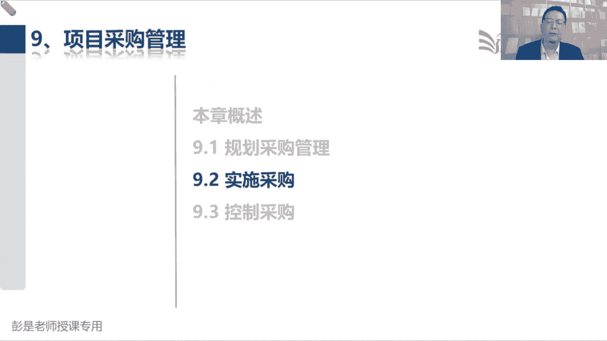
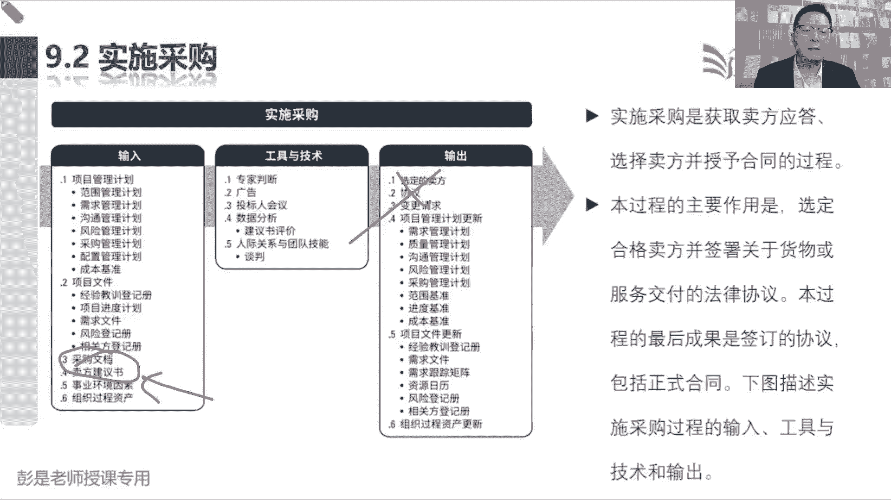
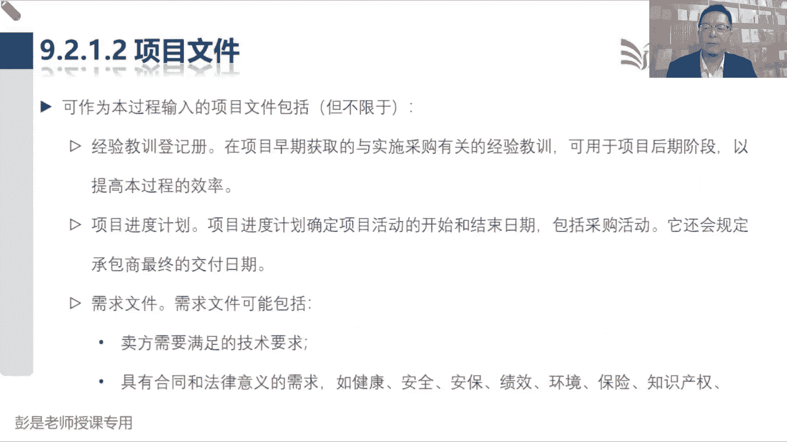
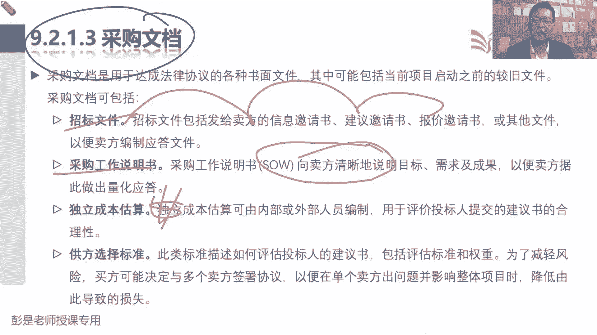
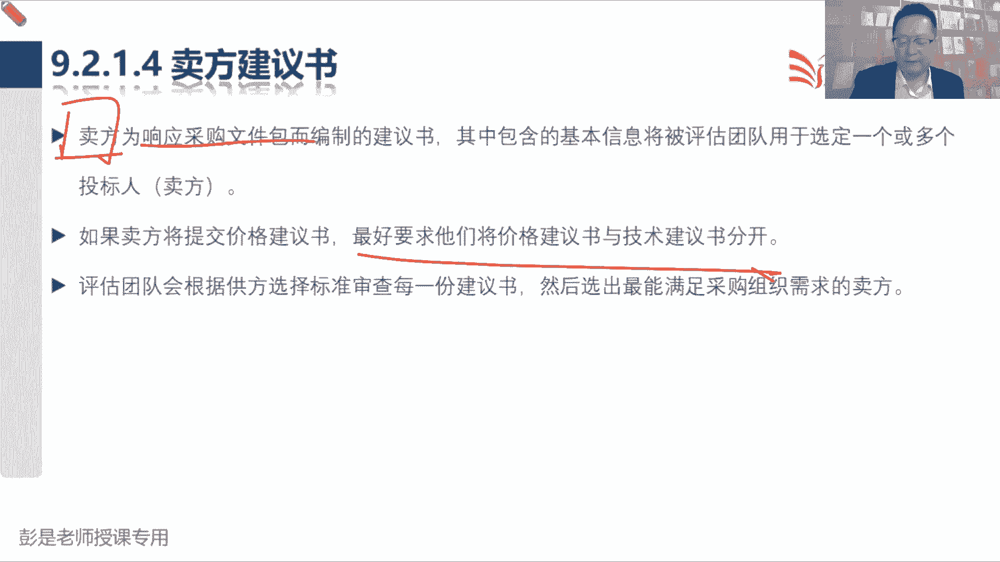
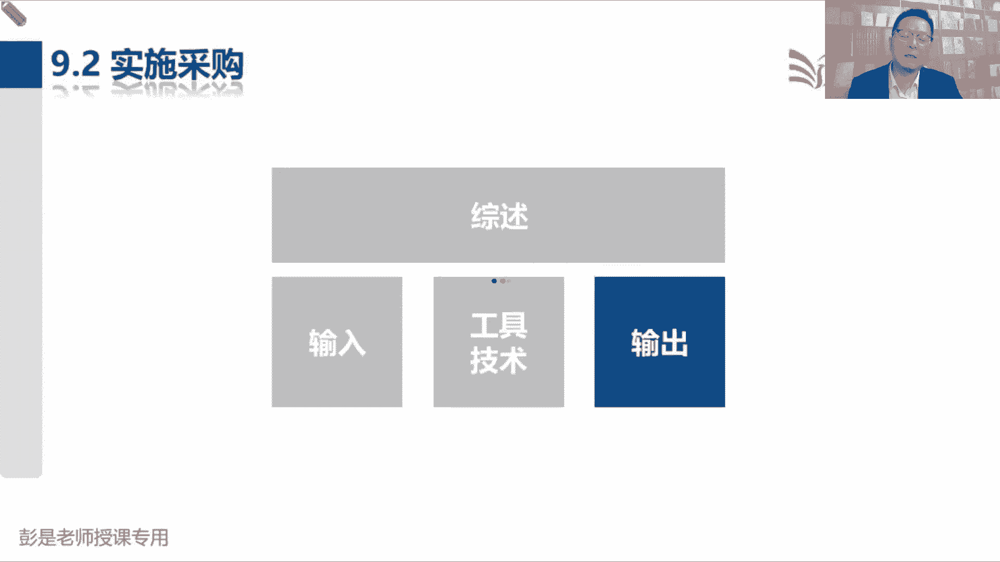
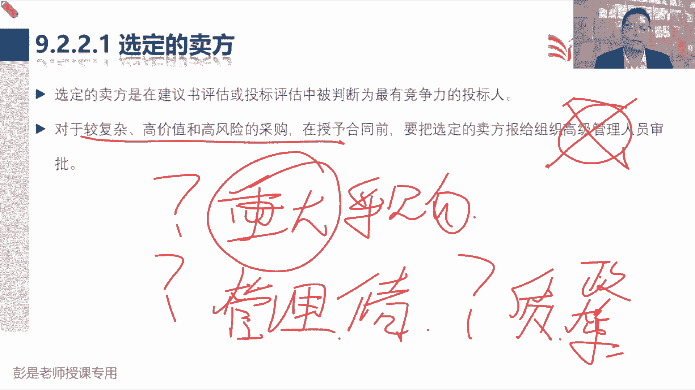
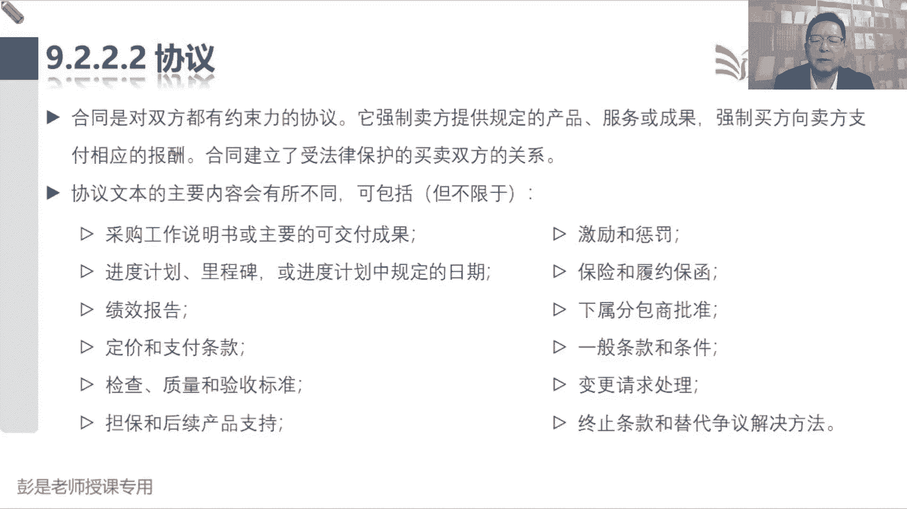
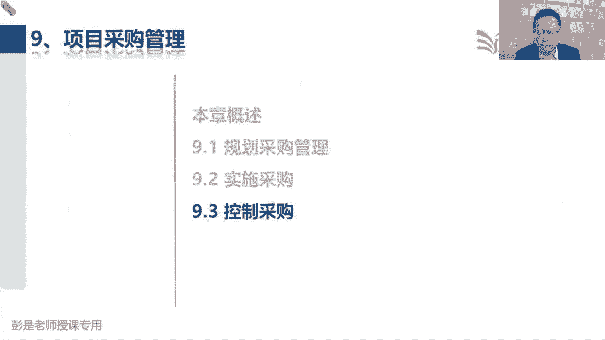

# 2024年最新版PMP考试第七版零基础一次通过项目管理认证 - P58：2.9.2 实施采购 - 慧翔天地 - BV1qC411E7Mw

9。2实施采购这个管理过程开始啊，记工具了，就把工具按照顺序和招标到投标到评标到中标，这几个环节联系到一起，这个管理过程就下班了，我们拿到刚才规划采购，同时写出写出那一大堆东西，供方选择标准。

采购工作说明书，独立成本估算招标文件，拿到这一大堆东西，我们来选卖方签合同，那选卖方就是从招标到投标到中标对吧，到签约招标怎么玩呢，广告通过广告找到更多潜在卖方，给人家发邀请书，邀请人家来投标，诶。

这就是招标，那邀请人家来投标，刚才说了啊，如果双方啊可能文档没写清楚啊，对方误解了，可能就会导致啊做无用功，写了半天，这个方案和建议和我们的要求有出路，这不就是无用功吗，为了避免浪费大家的时间。

所以呢关于这些问题呀，误解呀最好啊，在人家投标之前说清楚，就有了投标人会议发了招标招标公告之后啊，在人家投标之前，组织大家开这个标前，会看看有没有有没有误解呀，有没有疑惑呀，有没有不理解的地方啊。

咱做澄清做澄清，避免人家最后做无用功浪费时间，所以他叫标钱会，也称之为投标之前开的会，嘿这叫投标人会议，开完了这个投标人会议啊，大家消除了疑虑对吧，做完了答疑之后，他了解清楚了。

他们就组织人给我们出方案，出报价，出方案出报价我们就会收到，收到第四个收入，收到卖方给我们提出的方案和报价，就得到了卖方建议书，有了卖方建议书啊，咱找专家组织专家评标团来对卖方建议书打分。

根据我们的供方选择标准来对卖方投标的标书，也就是卖方建议书打分，这叫建议书评价，打完分之后啊，这不就是平标吗，打完分之后，评完标之后啊，我们就选出得分最高的第一中标人，得分第二高的第二中标人。

确定谈判的顺序，然后呢就可以和人家去谈判，谈条款，谈细节，一旦谈成功达成共识，我们就签合同，签了合同之后就有了这个输出，叫选定的卖方和签好的协议，所以其实这个管理过程超好学，就把招标投标评标中标签约。

把这五个步骤结合这几个工具，这么一一捋就完事儿了，然后呢中间插适当的工具啊，通过广告找到更多潜在卖方，然后呢投标之前开这个标签会对对，投标之前开标前会，然后人家投标我们就会收到卖方建议书。

收到卖方建议书啊，我们组织专家来评标评判标，请注中标人确定谈判顺序，和人家谈判签合同诶，这么一捋这个管理过程就学完了，并且呢它的输出不太需要具备，选择的卖方和签好的协议，这没啥可考的。

但是呢输入要知道三和四是怎么回事儿，三是刚才规划采购写的那堆东西，装到一个袋子里，作为我们选卖方签合同的主要工作依据，就叫采购文档，然后卖方建议出这东西不是咱自己写的，是投标的人给我们出的方案和报价。

好这个管理过程搞定。

所以他的收入就着吧，刚才我们见过的那一大堆资料。

就213，稍稍印象深一点，这四个东西都来自于规划采购招标文件，说清楚招标这个事儿，我们是要信息呀，要报价呀，还是要建议，要方案，然后采购工作工作说明书，把我们要购买的产品服务成果说清楚。

独立成本估算你的预算，然后公开选择标准，字面意思，这个不太需要去背下来啊，看名字能知道它是啥就够了。

然后卖方建议书，这肯定要知道卖方未响应我们采购文件包，而编制的建议书给我们的方案和报价，并且通常在实践之中，价格单独有个小型分，对不对。

然后他这个管理过程的输出就是选一个卖方。

后面那句话呀，以前也给大家大概说一说，也不要求大家去背啊，对于较复杂高价值和高风险的采购，在签合同之前，要把选定的卖方报给组织的高级管理人员审批，因为后面考试的时候，通常涉及到我们要判断这事啊。

超出我们权利范围找谁，通常呢第一反应找发起人，找什么PO，找项目指导委员会，这些单词都是可以找到啊，但是呢通常来说啊，不建议找高级管理层这样的选项，因为高管对吧，董事会董事长这样的大领导人家主要干啥呢。

什么组织治理，项目治理和规定企业的这些什么权利分配，然后呢在项目中可能涉及到这么几个点，稍稍不太需要去背了，现在基本上也不考，第一个就是现在题目里面，现在教材上说的这段文字啊，叫重大采购。

这个玩意儿基本上不考，为啥呢，因为什么叫重大采购，对于不同的企业，不同的项目，它给的条件肯定是不一样的，拼一拼，所以他如果想考这个知识点，没办法，只能谜底就在谜面上想一想，对标到大家家庭里面啊。

对你们家来说，什么叫重大采购呢，不同家庭情况不一样了吧，土豪同学没事遛个弯儿，买个房子，哎这不叫事儿对吧，对于我这种没钱的人来说，买根冰棍儿都得掂量掂量，这对我来说已经很重大了，以此类推吧。

项目的环境不同，企业的环境不同，什么叫重大采购条件不一样，所以呢这东西如果想考，一定是给你说清楚，否则我们没有办法判断，这个采购到底重大不重大，除非给你写得很清楚，那就没什么考的必要了，这是第一个点啊。

第二个点是什么呢，这个需要稍稍稍微一印象深一点，就是用管理储备，因为通常管理储备，管理储备是用来应对意外的，为什么叫管理储备呢，通常使用管理储备需要得到管理层的审批，咱项目经理啊。

发起人那都不一定不一定有这个决策权，所以通常动用管理储备走完变更流程，还需要找管理层做签字，这个钱咱们才能用这个稍稍硬加一丢丢就够了，第三个点呢其实讲过了，但是呢基本上现在看也不大考啊。

就是定那个玩意儿，质量这一章我们说首先一定要明确什么东西，这事儿应该是公司领导顶，那个叫组织的质量政策，这事咱也做不了主啊，因为我们要根据政策定标准，根据政策定标准，所以这个东西也需要公司高层来定。

这是管理层的责任好，除此之外，基本上这么多年的题啊，基本上就不找高级管理层这样的选项，因为不确定，因为不确定要不要找到他，所以大家考试的时候，你看到高层啊，千万要脱离实际工作经验啊。

你就把它想象成一些中等规模，大公司的那些领导，什么马云，马化腾，就这些顶到头的这些人呐，董事会董事长一般小事情啊，不一定需要不一定需要打扰人家，重大的事情，才需要这些高层做决策。

好知道这几个东西啊，那协议协议呢就是合同，实际上法律意义上是不一样的，前面讲过吧，协议是协议双方达成的共识，不一定涉及到弃手交钱，一手交货，合同呢就是加了一些细节，是通常涉及到一组交钱，一手交货。

所以它的内容不要求大家去记，不要求聚集啊，后面具体的内容，具体的知识点我们会讲到工具基础，讲那个索赔的时候再说了。

好再往下变更，请求没啥东西啊，这个管理过程就把那个工具招投标。

