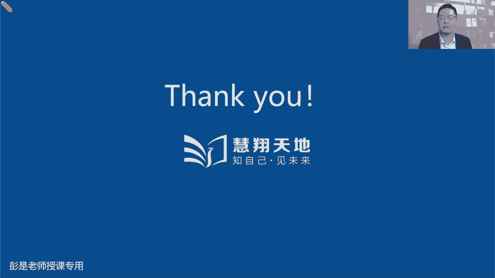

# 2024年最新版PMP考试第七版零基础一次通过项目管理认证 - P59：2.9.3 控制采购 - 慧翔天地 - BV1qC411E7Mw

那9。3控制采购仍然是需要掌握工具，它的输入输出啊，其实记得住，记不住还好，刚才强调过哈，涉及到供应商的变更，我们也要及时的第一时间通知供应商，避免供应商的工作受到影响，所以收入有了一个批准的变更请求。

然后呢输出啊就可以不记了，结束的采购送分题啊，这不可能考，再看中间的工具，结束的采购就是钱货两清，交易关闭，再看中间的工具啊，就这仨仨东西啊，这两个敢不敢猜干啥的，质量强过了风险讲过了，那轮到采购。

以此类推，审计采购，采购工作要不要合规呢，对不对，要不要货比三家呀，这尤其是什么国企，央企，政府机关，咱不能胡来呀，这玩意要合规啊，就这道理吧，所以审计过程，看看你采购的过程是不是符合相关的政策标准。

程序流程规范，要确保合规，然后呢看看什么地方做得好，什么地方做的不好，总结经验教训，以便于不断的改进过程，这个大家实际在工作中，在生活中都在用，对上次上次订酒店忘了货比三家，上次上次叫外卖忘了货比三家。

然后下次叫外卖要货比三家，以此类推，哎这是审计过程，那检查查结果查的是谁的结果呢，查的就是供应商的工作和成果，对送餐小哥送过来的餐，看看有没有傻呀，看看量对不对呀，名字是不是你的呀。

看看看看这个东西是不是符合你的验收标准诶，我们是对供应商交付的成果，对供应商完成的工作做验收查结果好，这两个东西其实和三大审计讲完了，质量审计，风险审计，采购审计，这是咱来审计质量过程的合规性。

咱来看看风险管理过程做得好做，做的不好，再来看看采购工作做得好，做得不好，他的话术都是一样的啊，找到差距，缺陷不足，找到最佳实践，形成经验教训，进行过程的改进，那再往下找找找找找找到这个单词。

嗯索赔管理这个大家实际工作中，生活中也都在用啊，首先搞定啊，第一个单词索赔是什么意思呢，各位亲，你在淘宝天猫京东买了东西，发现这个东西送到你手里碎了，你怎么办，发现这个东西到你手里坏了对吧。

刚一打开包装发现摔碎了怎么办，索赔啊，就这意思吧，所以双方关于采购过程中有了什么争议啊，纠纷啊，诉求啊，统称为索赔管理，这索要赔偿吧，那第一反应你先找谁，第一反应你先找谁呢，发现这东西坏了，卖家吧。

好找卖家干啥呢，再往下想找卖家干啥呢，谈判你得赔我钱，你得给我重新发一个，对不对，你得赔我钱，你得给我重新发一个，谈判双方谈判协商，谈判的目的是想办法达成共识，这是第一反应啊，好如果你和卖家难以谈判。

难以达成共识，第二反应这事儿怎么办，买家不同意说跟我没关系，不赔你找谁，比如说某东某宝找谁呢，找平台干嘛呢对吧，商家商家不同意不同意，找平台干嘛，仲裁调解哎这就叫什么呢，找第三方调解和仲裁。

它就叫ADR替代争议解决，就是找人替我们做主，粗暴理解啊，所以要替代争议解决，这也好理解吧，好我们先和卖家谈判，想办法达成共识，如果谈不成功，找第三方找平台给我们做主，所以呢叫ADR替代争议解决法。

找第三方调解和仲裁，那如果平台给出的调解方案，仲裁结果你仍然不开心，不满意怎么办，商家欺负人，平台欺负人，接下来找谁呢，找谁给你做这个主呢，诉讼诶，咱有法可依啊，打官司，这就是第三个第三个步骤，诉讼好。

这就是索赔管理123，按照这个顺序找选项就OK了，谈判这是优先优先解决索赔的方法，实在不行呢，找第三方调解和仲裁还不行，打官司，所以其实这种这种这个思路啊，不管任何一个场景都是这个套路。

比如说你和和公司有劳动纠纷，首先谈判呗，对不对，最好双方能够通过谈判协商达成共识，如果谈判谈不拢怎么办，你是不能直接去法院打官司的，对不对，那如果拿到这个仲裁调解的结果还不开心，不满意怎么办呢。

这时候就可以去民事法庭打打打官司去了吧，可以打官司去诉讼了，哎就这个顺序啊，一定记住这个顺序，这就是索赔管理中心思想，三步走好，搞定前后两厅交易关闭，控制采购下班了，好，对人家供应商的成果进行验收。

再看看我们这个采购过程有没有人行贿受贿，对不对，有没有这个过程做的不好的地方，做得好的地方，总结经验教训，进行过程的改进，那双方万一啊，钱货两清的过程中有了一些什么争议啊，纠纷啊，诉求啊，咱最好啊。

谈判协商谈不成呢，找第三方调解还不行呢，去法院打官司，控制材料的同时就下班了，就干这点事好，所以再往下找找找找找，800颗星，800颗心眼子的一个重要的原则，刚才说过了，因为合同关系的法律性质，要求。

项目管理团队必须了解我们在控制采购期间，所采取的任何行动的法律后果，所以合同有法律约束力，有法律效力啊，所以采取任何行动之前，需要先去看一看合同条款，就刚才说过非常重要的一个原则啊。

避免因为我们采取了一些违反合同条款的行动，导致了我们自己有过错，导致我们自己违约，所以他通常给出来的坑就是这样的啊，比如说供应商没有没有及时交货，A选项扣钱，B选项谈判选哪个，谈判扣钱选哪个，直接扣啊。

直接扣就中招了，为什么呢，合同条款你不知道，这个合同具体的条款你不知道啊，那能不能扣钱呢，这个行动合法不合法的，合规不合规呢，不确定了，但确定的是什么呢，双方有了这种争议啊，纠纷啊，诉求啊。

谈判是可以的，对不对，索赔管理里面通过谈判达成共识是挺好啊，所以唉只能选谈判了吧，这就是这道题，可能未来你会看到这样的题啊，给你挖这样的坑，这个行动能不能采取这样的行动，不确定，因为具体条款不知道。

取决于你怎么签的合同，对不对，好，那再往下控制采购，基本上就没什么东西了，后面这段文字都是看一遍了解就可以了，这些东西都是大家，你叫外卖呀，美团天猫京东买东西呀，都在干这些活啊，对不对。

看看人家初三了没有，看看人家小哥取餐了没有，小哥现在到哪了，这不是收集数据吗，然后经过你的分析变成机票信息，以此类推吧，包括付钱，这都不念了啊，好再往下说，在控制采购过程中，需要开展财务管理工作。

包括监督向卖方付款，需要重点关注的一点是，确保向卖方付款和卖方实际已完成工作量之间，有密切的关系，这个其实后面讲政治分析的时候会再说的啊，其实超好理解，就是啊，比如说我点点外卖叫了五个辣腿辣腿堡。

结果呢人家只送过来四个，你是按照五个给钱，还是按照四个给钱呢，就这意思吧，确保我们向卖方的付款，和卖方实际已完成工作量之间有密切的关系，送几个给多少钱呐，就这个道理，其实这就是正直，干多少活挣多少钱。

干多少活挣多少钱，这都是正直好听一听，这很好理解的场景啊，然后具体的什么输入啊，没什么需要去记得了，采购文档就记住这个这个东西的中心思想，这次采购过程中所有的东西全放进去，放到一个袋子里，就粗暴理解。

放到一个袋子里，我们单独存档，以便于未来人家审审，难以便于未来追溯，所以采购文档包括我们开始从规划采购，就把这个管理过程串一遍啊，规划采购出了一大堆东西啊，招标文件，Sow，供方选择标准，独立成本估算。

然后到了实时采购啊，我们招投标招投标过程，所有相关的这个文档资料继续放这个袋袋子里，包括什么招标文件对吧，人家的投标书什么开投标人会议做成精，所有的东西都要存档，都要存档，都要存档。

包括我们人家给我们出的方案和报价，卖方建议书，包括你最后的评标的结果，包括你和人家签的合同，全都继续放到这个袋子里，那到了控制采购环节呢，我们签了合同监监督检查供应商，关于合同的执行情况，就包括什么呢。

供应商的工作绩效，供应商，我们给供应商出的什么验收报告，什么付款的记录，往来函件，什么发票全都继续往里扔，最后这个钱货两清，交易关闭的时候，这个小袋子单独存档，这样的人家审，咱就看这个资料和我们的过程。

可以发现一些合规呀，不合规呀，什么做的做得好的，做得不好的诶，看这个袋子就够了，所以他就包括了所有的东西，什么完整性完整性知识性的记录，包括这些东西啊，这些具体内容不要求背啊，了解就够了。

好批准的变更请求，这也没什么新的知识点了，刚才说过了吧，不解释了，这玩意即使都要通知供应商计划有调整，数据呢没啥东西啊，输出输出其实就这个第一句话看一看，买方通常通过其授权的采购管理员。

向卖方发出合同已经正式完成的，已经完成的正式书面通知，因为他得到授权，他有才才有权利代表企业，才有权利代表企业告诉人家，我们钱货两清了，就这意思吧，然后一般而言什么条件下才可以前后两。

那才可以关闭交易呢，这生活常识不难理解吧，一手交钱，一手交货，该给的钱都给了，什么发票都给了，双方没有什么争议的，没有什么纠纷了，咱就可以关闭交易了，好这节课管理过程基本上就完事了。

然后最后这段听一遍就完事了啊，9327听一遍是什么意思啊，刚才说过了啊，供应商目录可能随着采购工作的开展，随时的各位更新的表现好的对吧，或者发现一些新的合规的供应商，让人家走申请，走流程。

再把它加到供应商目录，这样呢选供应商就省事了，那现在我们结束采购的时候，发现这个人绩效不好，可能把他拉黑了，所以可能会更新，那更新之前你也不能想删就删呢，所以要给一个客观的评估结果对吧。

就说这家其他供应商总是延期交付，质量又不好对吧，和道德违法乱纪，道德败坏，伤风败俗，做到有依据，师出有名啊，好大概听一耳朵就完事了啊，那采购这一张加班了，恭喜各位同学，今天最后这一小关又过去了。

那最后呢，咱再花10分钟左右时间给大家回顾回顾，做做简单的题啊，巩固一下知识点，对买方来说，对卖方来说，这些合同类型，它的风险所代表的含义是不一样的，总价合同对买方来说咱门清，所以呢风险小。

对于卖方来说，赚钱不赚钱取决于项目的具体情况，所以对他来说风险大对吧，那成本补偿合同反过来他对买方来说，因为范围不明确，所以风险大，对于卖方来说呢，风险小，因为成本有人给报销，另外呢还有一笔费用。

对双方来说基本上对等，所以这道题说，你为一家竞标某个合同的卖方公司工作，对你的公司来说，风险最大的是哪一类合同，那就需要能读懂题了，现在题目在说的是你是买方还是卖方呢，你是买方还是卖方啊。

把这事搞清楚啊，竞标张三李四王五赵六来竞争，这不是他是卖方，所以像竞标啊，包括来投标啊，它承接呀，承建呐，承接就是我接了个活儿，城建就是我来承担这个东西的建设工作，哎这些东西这些单词都是都是卖方啊。

卖东西的人加石头啊，这个知道了之后呢，答案就出来了，所以答案是C，对卖方来说，固定总价固定总价合同风险最大，嗯因为固定总价合同没有人给报销，按一卖方成本超支，他就不赚钱了，我出一瓶可口可乐。

出三块钱一口价，卖方的成本，卖方在珠峰大本营卖水瓶可乐，它的成本hold不住了，各位有条件的同学，未来你可以试一试，珠峰大本营一瓶可乐卖多少钱哇，吓死人了，好知道这个意思啊，所以对卖方来说。

取决于他项目的实际情况，因为有的卖方可能成本低，有的卖方成本高，万一成万一进度再延迟一下，对不对，万一再没有按期完成，进度再拖一拖，哎呀，这成本噌就上去了，所以赚钱不赚钱取决于卖方的实际情况。

对他来说风险大，但是成本补偿反过来风险小，为什么呢，至少能捞回本，还能获得一些，还能获得一些费用啊，好再往下拉啊，汤姆是一个最简单，汤姆是一个软件公司的项目经理。

他把一个长期的软件项目外包给一个外部公司，这个外包公司啊，按人头收费，这是什么合同呢，按人头收费，对吧，就像大家日常过日子，家里面想请个保洁阿姨啊，给我什么擦擦窗户，我也不知道。

我也不知道这工作范围大概是多少，总工作量是多少，但是我能控制的是单价一小时多少钱，这咱能说了算哎所以它就是什么呢，题目没有提到，没有提到成本补偿了，好再往下，你在为合同创建，这简单在为合同创建。

供方选择标准正处在哪个过程中，这个简单吧，规划采购出采购招标文件，SOW采购工作说明书，出供方选择标准，出独立成本估算，所以呢答案是A，恭喜大家答对了，这个也简单。

你在B条找一个卖方和公司自行完成工作的，相对优缺点，正处在哪一个管理过程，这是传说中的俩工具带俩输出，自制或外购分析，形成自制或外购决策，供方选择，分析出供方选择标准，题目来说，我们到底自己完成啊。

还是叫外卖呀，这就是在自制外购分析，所以是规划采购管理，对不对，在比较到底是我们自己完成还是外部采购，然后选C的同学应该是稍稍迷糊了啊，什么时候选C呀，是全是卖方没有自己了吧对吧，张三李四王五赵六。

我们在比在众多供应商之间做比较，这才是选择卖方签合同这个过程，现在题目再说，我们到底是自己完成还是外部采购，这就叫自制外购，分析了好说买方和卖方，这送分题，希望建立一种跨越10年的长期关系。

我们希望啊避免什么金融不稳定的情况的影响，这签什么合同呢，没没得选了哈，恭喜大家答对了，所以看到周期长或者是用不同的外币，这基本上也不考，也就考一个周期长这个典型特征，看到周期长就想到物价可能会有浮动。

对不对，物价可能会有浮动，这是通胀，也是金融情况啊，那我们要考虑按照当时的价格去进行结算，好这道题呢，这就是一字之差，简单吧说根据合同中规定的某些主观标准，卖方收到了较低的费用，那就是甲方爸爸说了算。

所以呢他就是成本加奖励费用，合同取决于买方的主观判断，如果取决于客观标准，客观标准，这叫成本价激励，这道题其实需要大家静下心来读读，题，写的比较弯弯绕，翻译的不好，考试有可能都是缩写吗，有这个可能性。

但概率比较低，现在出题老师啊比较善良，大部分的题还是会给你全称的啊，可以明确的用中文给你写，全写完整还是很善良的啊，好看看这道题选什么呢，说我们接受委托管理一个采购工作，然后甲方爸爸要求你管理谈判。

现在呢你找到了一个，找到了一个卖方，然后呢进行合同条款进行谈判，然后接下来谈判的目标是什么呢，嘿各位同学已经找到找到点了啊，这道题实际上读完了选项，你就会发现的职业道德，对不对，高大上起来就可以了。

看到这种什么行贿受贿啊对吧，什么个人个人受益啊，看到这种职业道德的一样就高大上起来，A选项说你让你的客户做一笔最划算的生意，确保卖方价格尽可能的低，而无论他们成本是多少，这也不科学。

因为通常在实际工作中，不管是理论还是实际，如果卖方啊成本是十块钱，给你报价八块钱，这后果不用不用解释了吧，后果是什么呢，明明十块钱的成本给你报八块，低于成本，真低价中标，那后面就很可能偷工减料。

或者是通过索赔再把这个钱找不回来，对不对，嘿所以通常A这选项不对，B选项C选项说你希望希望卖方尽可能的挣钱，尽可能挣钱啊，这肯定不对吧，不道德呀，你希望延长谈判，赚更多的钱，不道德呀。

所以只有B这是谈判的原则，大家签合同有没有关注过，合同里面第一句话通常写什么呢，对吧嗯，甲乙双方本着公平友好，公平友好对吧，本着公平公公平友好的原则，达成以下协议呀，嘿就B选项了啊。

这种题不会考到职业道德的题，还是有可能会考的啊，并且呢，这种题通常呢大家读读一遍就能找到感觉了，好看这道题呢，准备了啊，快快买定离手，第一次做这道题的，做这道题的同学通常很容易中招。

不可抗力是什么东西啊，这稍稍有一点点印象啊，什么叫不可抗力啊，这天灾人祸对吧，什么地震啊，暴风啊，降强降雨啊，自然灾害啊，战争吧，还不可抗力，不可抗力条款是什么呢，它叫免责条款，互不追究责任对吧。

由于受到强降雪的影响，我们这个航班取消了，互不追究责任，跟你没关系啊，免责免责可不代表着说咱这个合同就终止了，这不是一回事吧，免责不等于合同就终止了，爹妈说，外卖小哥跟你说，这边下大雨了，有人打仗。

地震了，那就顺延顺延，我不追究你的责任就可以了，所以他不代表这合同终止，所以呢这个这个坑只要跳过了，答案就出来了，这是A虽然名字看起来很粗鄙啊，提前取消条款，什么情况下合同可以提前终止。

可以写出这样的条款，然后没有这个没有B这个东西啊，D呢竞业限制，这不结束了吧，竞业限制不要去竞争对手，这个大家工作中，如果你签了这样的协议，签了这样的协议啊，思考啊，公司要不要给你钱呢。

这很多企业也在这上面挖坑啊，如果你签了竞业限制，要不要要不要公司给你补偿了，对不对，凭什么我就不能去人家公司，你得给钱啊，要不然你限制我，限制我，限制了我的发展呢，让我少赚钱的，通常要给补偿的。

这这个东西不要随便签，保密协议是可以签的，对我们有责任，有义务为为为我们的雇主保有商业秘密，但是呢这个竞业限制不能白签啊，要给钱的，给多少呢，参考你业界的标准不一样的，取决于你的重要程度了好。

但是不能无不能平白无故无故的签这个东西，好，这道题，哎0927同学就开始说了哈，可以迂回迂回，但是人家有证据就表明，对不对，拍了拍了，拍到你上班的照片了，这就跑不了，好再看这道题选什么呢。

这道题比较弯弯绕啊，你在寻找一个卖方来完成你项目的工作，什么时候邀请人家来投标，排除法就可以了吧，什么时候邀请人家来投标呢，D选项肯定不行，我们都签了合同了，再邀请张三来投标，这也是零命，C选项也不对。

投标人会议我们都粗暴理解啊，我们给张三李四王五做了澄清，澄清了之后啊，邀请赵六来投票，这不是给人家做局吗，这肯定不行，应该在人家腰对吧，应该在人家投标之前就邀请，邀请完了，看看有什么需要澄清的再澄清啊。

而不是先成亲后邀请，这烦了，那B规划外包之前就明显胡说，所以就是A在创建采购文档之后，但是在选择败方之前，规划采购输出一大堆采购文档，然后呢实时采购，选卖方签合同之前邀请人家来投标，这还说得通。

排除法好，最后几道题咱们快速了啊，马上就下课了，这么多人选C啊，你们怎么不选D啊，看来大家脑子还比较清醒啊，为啥不选D啊，那我质疑了，为啥不选D呢，你不刚说过所谓管理谈判啊，什么打官司啊。

调解说的天花乱坠的诶，沈飞同学给到点没有争议好了，都同意了吧，现在我们已经达成共识了，那就没必要再再谈判了吧，这也神经病了好，恭喜大家头脑清醒，所以呢比较合适的就是C了，改合同改合同。

按照合同变更控制系统，可能变更控制系统，纯粹的字面意思啊，就是控制关于怎么改合同的一套体制，然后对合同做出相应的调整，不一定不一定要签新合同，所以B选项是有可能有可能但不一定的东西，B选项就有可能。

但不一定确定的是什么呢，达成共识了，我们要把这东西写到合同里面，合同怎么改呢，按控制系统的要求来就可以了，因为它实际操作里面有各种各样的可能性吧，有可能签补充协议，有可能签新协议。

有可能直接改各种可能性，好最后几道题，几分钟了啊，争取3分钟解决战斗这道题，一个项目经理有麻烦，因为它承接的合同超出了预算，现在他必须负担超出预算的成本，他签的是什么合同，变成大白话就是钱花多了不报销。

钱花多了没人给报销啊，这是什么合同呢，就是固定价格吧，哎所以答案是B钱花多了，他现在必须负担超出预算的成本，这里面没提到分摊比例啊，对不对，所以呢这花多少钱就自己背这个锅就完事了，这就是一固定总价合同。

所以通过这道题更好的理解，为什么说固定总价合同对卖方来说风险大，因为就这么多钱不给报销，超预算的东西没有报销这个事，好这道题应该对各位同学轻松加愉快啊，这道题其实都跟不用看，不用看题目了啊。

看选项就记住那个顺序，先干啥后干啥，先招标，然后呢人家来投标，然后呢我们评标，评完标选出中标人，最后呢最后呢签合同，签了合同之后才能称之为供应商，这题简单哈，所以找选项，恭喜大家答对了啊，投标人。

招标人，投标人，中标人，供应商，最后两三道题了，就问他替代争议解决什么终止条款，这玩意包括在什么里边呢，这送分题吧，替代争议解决合同终止条款都包括在协议里，不念了哈，好这道题，最后2分钟。

各位同学们加油哦，7782，小丸子同学说打他说的对不对呢，这么多人给A啊，为什么不选D呢，你不是说过吗，咱按合同条款来啊，这说的非常高大上啊，说的非常正确啊，为啥不选D啊，我们按合同条款来呗。

就需要读题了吧，这种题都比较阴险啊，总之啊总结出来就是项目出了问题，然后呢合同对于如何处理这种情况不明确，所以现在啊合同已经没有参考，参考参考的价值了，合同里面不知道不知道这事应该怎么办。

但确定的是什么呢，双方有了争议，合同里面条款又不知道，那咱就索赔管理，该谈判的谈判，该仲裁的仲裁，该诉讼诉讼，按照这个顺序把这个事管理完成，就完了就可以了吧，所以呢答案就是A，答案就是A啊，解决问题。

他就是控制采购过程中解决问题的一个方法，B选项肯定不对，因为直接诉讼不不合适，先谈判，在第三方调解和仲裁，最后再打官司，然后C选项也不对啊，买方对卖方执行审计，咱为什么要审人家呢。

为什么要审人家的合规呢，不一定对不对，好这道题，这应该是最后一道题了，能读明白这道题对应哪一个知识点就好选了，在寻找卖方之前，我们需要写一个文档，说清楚他做什么事，说清楚对采购的产品服务成果的具体要求。

就要规划采购，写一个采购工作说明书，那这个东西刚才说过吧，他就是拿我们的范围基准里面的WBS改一改，WBS和词典改一改，所以A是对的，它包括合同交易产生的可交付成果的具体规范，具体要求B选项是对的。

他必须完整的定义承包商必须做的工作，这个选项是对的，所以题目上找一个不正确的选项，S o w s w w，采购工作说明书里面不包括具体的合同条款，所以答案是C，因为这句话是不正确的啊。

好这就是今天给大家讲到采购范围，进度成本质量资源风险，采购都搞定对吧，然后咱整合也搞定了，那下次上课呢，接下来我们干什么呢，讲沟通，讲干系人，讲工具技术，讲工具技术，这堂课程啊。

其实啊就是按照从整合一直到干系这个顺序，把我们49个管理过程用到的工具，带着大家回顾一遍，因为重要的工具基本上都讲完了，所以下节课上课之前，各位同学一定一定一定要做的事，就是把前面这些管理过去了。

给的基本概念搞扎实了，并且呢在讲课过程中，给大家标记的这些有代表性的工具，稍稍再想一想他是干啥的，看看还有没有印象，因为这些有代表性的工具一定是高频考点，沟通干闲最重要吗重要，但是呢考点其实很少。

因为超简单，这两个管理过程理论上来说30分钟就能搞定，理论上来说，这两个知识领域很快的过程，过程啊，工具啊，输入输出啊都没啥，所以大家下节课呀，下节课上课之前可以先干啥呢，把工具技术这道文字看一看。

然后回顾前面讲过的这个除了沟通和干系呢，除了沟通和干系，把其他管理过程收入啊，输出啊，工具啊，课上讲的这些重要的知识点再回顾一下，这是下次上课之前，大家最好做这两个事情啊，一个叫复习，一个叫预习。

只看工具技术过一遍，听起来挺多，大部分工具你看名字都不想看文字，比如说访谈想看吗，不想看没什么东西，所以不要被不要被困难所吓倒，没什么太多的东西啊，好那恭喜大家，今天我们的课程结束了。

固定总价买方成本最高，这不一定啊，它取决于取决于具体情况，具体分析了它和买方的成本，你怎么知道呢，不一定吧，有可能报销的方式比总价成本还低呢，停一停，我出三块钱买一瓶可口可乐，如果人家拿小票小票过来啊。

可能两块五啊，所以判断不出来哈，能讲完吗，能讲完能讲完，把心放到肚子里，讲不完，加课呗，好各位同学听课辛苦了，那我们下次上课再见。

