# 2024年最新版PMP考试第七版零基础一次通过项目管理认证 - P5：1.1.4 项目关键组成部分 - 慧翔天地 - BV1qC411E7Mw

1。4项目管理项目项目关键组成部分。

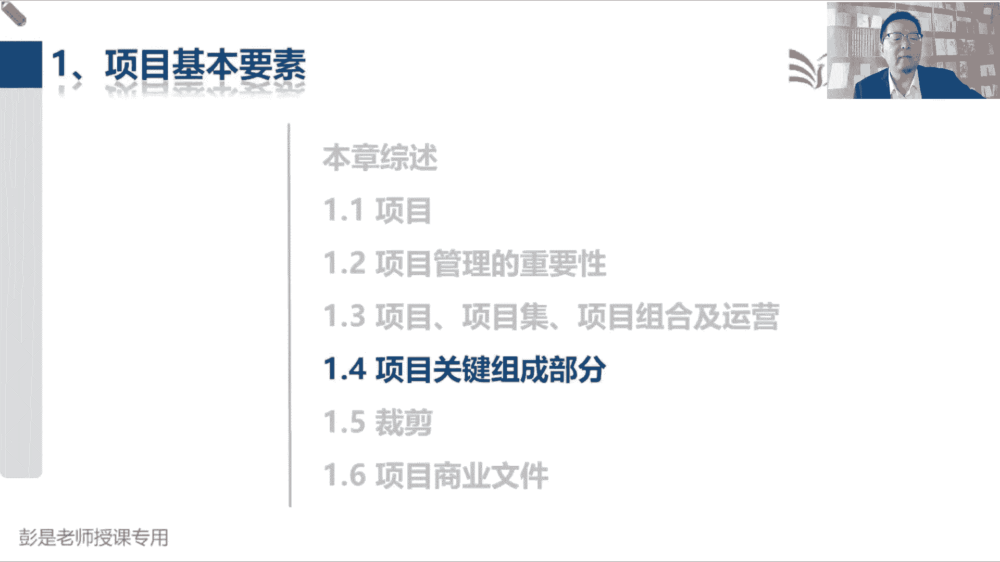

说我们要做一堆事情去实现这个大目标，这是个大目标，这不是前提条件，这个阅读能力确实需要训练啊，实现这个大目标，大目标需要开展这么一系列的事情，问这是什么东西，对不对，所以寻找替代能源。

这根本就不是这道题的题眼，他根本是什么，根本就不重要，我根本就不关心他，关心的是这个这个这个一堆事情，让公司有竞争力，对公司生死存亡至关重要，公司的长期目标，长期目标，短期目标，这不是战略规划吗。

对不对，所以读题读题需要大家慢慢去训练，训练找关键字的这个能力，好再往下了啊，就是主谓宾定状，补主语，谓语，宾语要一定要能分清楚，看人家在说什么东西。

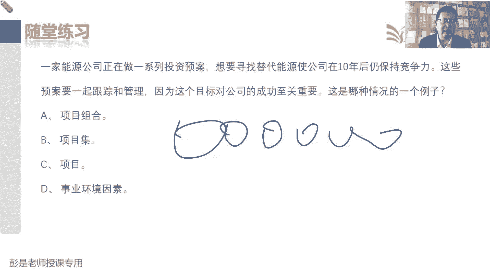

不要不要解读错了啊，然后说项目及存在，某一个项目依赖于另一个项目的产出，项目组合只是项目之间，项目集里面也可能涉及到共同的资源，所以共同的资源不是判断，不是判断它是项目集还是项目集。

项目组合的一个重要的重要的判断的依据啊，啊，就记住反复给大家说的那几个关键词就可以了，不要去加戏一堆，是排排序，合理分配人才物，项目组合，多个事情之间存在着关联关系，依赖关系，把它协调好。

想办法获得额外的收益，1+1大于二，这就叫项目集，就这么简单，就这么简单，就这么粗暴，其他就其他的单词，适不适用于作为判断的依据呢，不知道不知道不知道具体情况具体分析，好那接下来1。11。21。3。

这些背景搞定了之后呢，1。4在说什么呢，这是开始下下沉式的讲解了，现在我们知道了一个大的背景环境，项目启动之前三件事情，需求评估，商业论证，效益计划的制定，需求评估是找项目发现一些商业机会。

发现了商业机会，不代表着我们马上要投入人财物去做，为什么呢，因为不知道这事靠谱不靠谱啊，所以在投入人财物之前，我们需要开展可行性分析，去分析这个事情的可行性和价值，就有商业论证。

既有可行性又有价值的事情，还要通过效益管理计划，告诉老板，我们什么时间会获得什么样的回报，就有了效益计划，这些东西都都都写完了之后，找老板来做决策，老板一说一听这这事儿靠谱，就愿意投入人财物。

让项目经理走马上任，完成任务，实现目标，得到期望的结果，那我们项目完成以后，项目完成以后，还可能会把我们的可交付成果一交给运营，让人家想办法想办法实现这个价值，让这个价值最大化。

这是整个目前我们掌握的这个项目生存的背景，这些这些相关的术语在此基础之上，再往上看呢，就是项目之间如果存在着某种关联关系，依赖关系，需要有人站出来，用项目集的这种管理方法来进行组织协调。

这样呢可以想办法1+1大于二，不浪费，再往上走呢，就是要做的事情这么多对吧，要做的事情这么多，老板我这个项目需要用最好的资源，张三说，老板他那个项目需要更好的资源，那需要排排序了，需要改排序了。

我们要去判断这些项目哪个项目更重要，帮助企业更好地实现战略目标，所以就有了项目组合管理这么个管理方法，他对里面的一堆事情排排序。

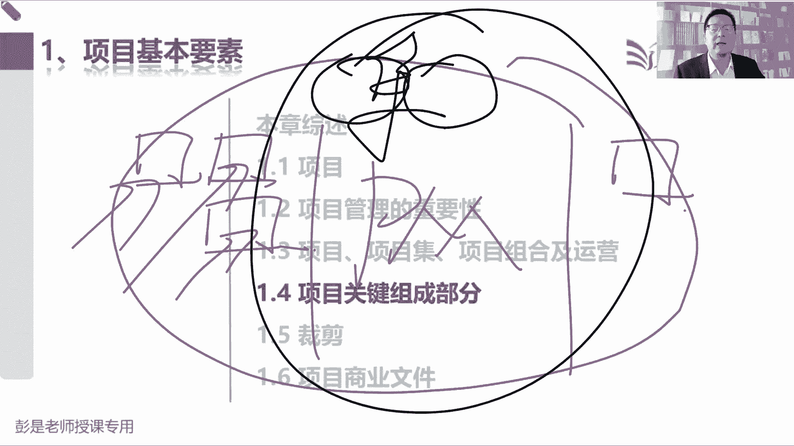

合理的分配人财物，这就是整个整个目前大家储备的这么一个结构，那1。4开始呢，就从项目开始到结束开始往下讲，开始开始开始下沉了，开始细化了，告诉我们这段文字讲什么呢，这是五大过程组，十大知识领域。

49个管理过程，告诉我们作为一个项目经理，去关注项目的哪些特点，从而更好地完成对这个事情的管理工作好，所以1。4主要就是讲这些东西，就是项目生命周期阶段划分啊。

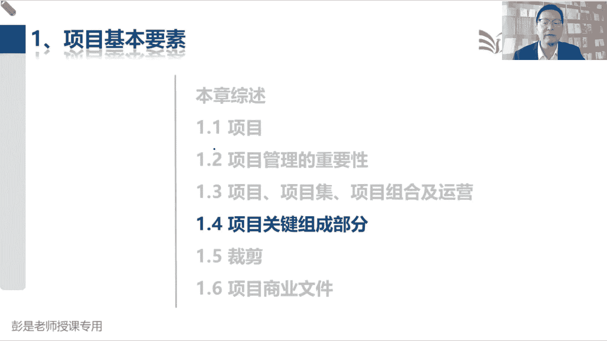

一大堆非常非常非常重要的知识点，讲这些重要的知识点之前。

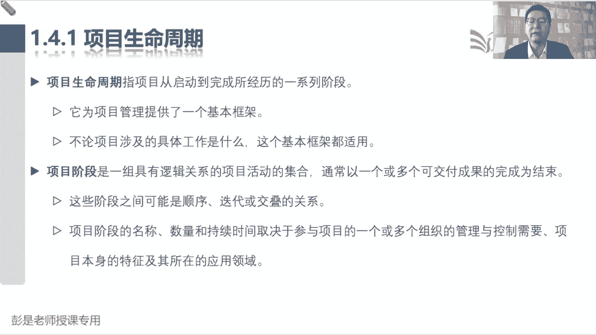

各位亲爱的同学，需不需要缓一缓大楼呢，现在是15。19，咱们休息到15。27好，各位同学，接下来我们开始下一小段课程，活学活用，高伟同学说，按这个进度，按这个讲课速度啊，今天第一部分讲不完。

那确实确实讲不完啊，那怎么活学活用呢，就这四个东西都快好省都会好，省，讲不完的话，我们能不能说哎有些东西咱就不讲了，砍范围不行不行啊，大家会大家会投诉我的范围不能动，该讲的地方还是要讲的。

该讲的地方还是要讲的，那我们能不能改成本呢，不行对吧，说正课讲不完，让让大家再花点钱，然后我们再开个班，不行啊，这你们肯定肯定会弄死我的啊，我们能不能牺牲质量，说时间讲不完呢。

那我们有些东西啊就大概讲一讲，糊弄糊弄大家，这也不行，我们还要确保质量，希望大家都能够听得懂，都能够消化吸收理解，然后呢举一反三，活学活用，质量不容不容不容调整啊，那范围不能动，成本不能动，质量不能动。

我们能做的是什么呢，进度还不能赶进度，子子孝同学说错了，说错了啊，不能赶进度，赶进度赶进度，着急忙慌的语速超快的讲完念完质量出问题，对不对，所以进度进度进度不能改，只能拖只能拖。

我们要适当的适当的延长延长我们的讲课时间，所以今天讲完课之后呢，后边的课程各位同学就做好拖堂的心理准备，拖堂的心理准备啊，啊拖堂，适当的时候，我们以前的课程都经常还会加课，加课啊，免费的加课。

不收钱的加课，我们只能增加时间，还是希望大家通过我们的课程，能尽量的尽量的把大部分的知识给它消化吸收，理解到位了，这样可以有效的帮助大家缩短一些看书，缩短一些看书的时间，帮大家提高这个效率。

提高这个质量好，晚上汤圆不吃不现实啊，我今天晚上要赶场，要回到回到家里面去去吃汤圆，所以今天先不加课，今天预计下课时间15点，后边呢我们结合项目，结合咱的讲课的进度情况，适当的适当的会拖堂。

比如说下次上课呀，可能就18点下课了，再下次上课呢可能就18：30下课了，时代还讲不完，那我们还可以加课，总之保质保量保质保量，这是范围，质量不能动啊，活学活用，大家实际自己在工作之中。

你看看你身边身边或者是手头正在开展的工作，也是这个逻辑吧，一定是根据领导的，根据领导的期望，还记得刚才我们那个一道题吗，范围进度成本质量哪一个更重要呢，看情况对不对，有些情况下可能需要在质量，在成本。

在进度，在范围上做出一些让步，做出一些牺牲，做出一些调整，或缺活用好，接下来了啊，那1。4项目关键的组成部分是说巴拉巴，这这这前两句话不念了。

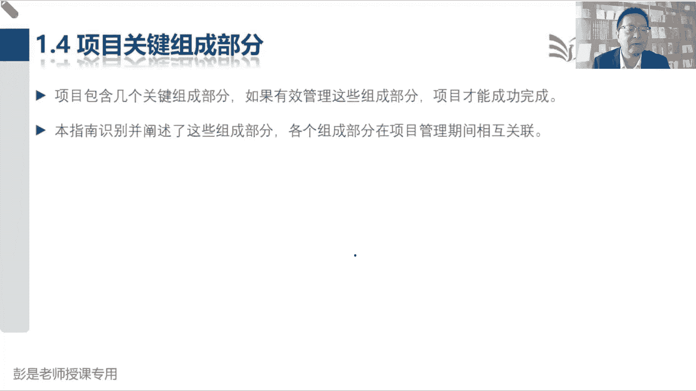

那接下来带出来一个新的概念叫项目生命周期，项目生命周期是指是指二项目从启动到完成，所经历的一系列阶段，他为项目管理提供了一个基本框架，不论涉及到具体的工作是什么，这个基本框架都适用，那什么是阶段呢。

阶段是一组具有逻辑关联，项目活动的集合，通常以一个或者多个可交付成果的完成，作为结束，这一阶段时间可能是顺序迭代交叠的关系，阶段的名称数量，持续时间取决于我们管理和控制的需要，项目和项目本身的特性。

以及所在的应用领域，这一大段枯燥的概念最后变成人话，就是这么个这么一个道理。

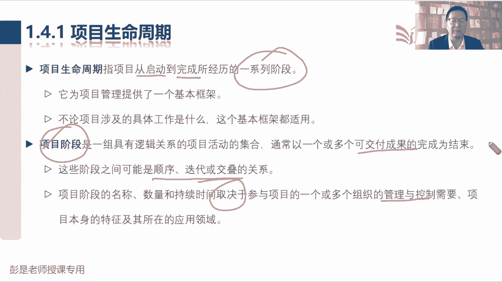

最后的结论先说啊，就是不同项目阶段划分是不一样的，不同类型的项目，它的阶段那肯定是不一样的，不同类型项目阶段划分不一样，比如说我们这个真的是开个牛肉面馆，真的要开个牛肉面馆。

那怎么把这个房子给他装修好呢，怎么把这个房子给他装修好呢，有一个阶段的工作肯定是做设计，对不对，看看装修成什么风格，然后刷什么墙，弄什么地板，弄什么桌椅板凳诶，肯定是做设计，设计工作做完了之后。

我们装修的蓝图就有了，对不对，然后呢就按照图纸去施工这些旧旧的墙，旧的地板砖什么该砸的砸，该翘的翘，砸完了，撬完了之后啊，在什么弄墙啊，弄地砖啊，施工啊，就是按照我们的蓝图。

按照我们规划设计的这个东西去实去执行，去实施，那施工完了之后啊，你不得打扫打扫一下卫生吗，对做保洁，做开荒，打扫卫生，打扫卫生，然后呢家具进场，唉这个事儿就结束了，所以它有设计阶段，有施工阶段。

有最后的交互阶段，交钥匙工程啊，把钥匙交给你，诶，亲您家的房子装修好了，它可以大概粗粗略地分成这么几个阶段，这是装修这个事儿啊，那换一个事，比如说真的是各位同学搞it的同学，你们做软件。

搞软件开发有施工吗，这我今天今天上班要写个写个程序，要做个游戏，我们施工来砸承重墙，这不对对，他没有这个阶段，没有这个性质的工作哈，所以你搞软件开发，可能做开发计划，做需求，做产品的规划设计。

做概要设计，详细设计，做技术解决方案的设计，然后呢找一找程序员敲代码，敲完了代码呢测试测试完成之后呢，可能就部署发布出去了，它是划分成这么多个阶段，还这两个项目它的它的类型是不一样的。

那取决于工作性质对不对，工作性质不同，它阶段划分就不一样，那随便再换个场景对吧，比如说搞药品研发，我们真的是做什么新冠核酸的特效药，做新冠的特效药，做一些什么感冒糖尿病的药，药品研发有施工吗。

没有药品研发有敲代码吗，也没有，我们可能现在实验室做实验，拿小白鼠小白兔做做实验，然后搞临床一期二期三期交叉测，盲测，各种各样的实验来验证这个东西到底有效没效，最后呢如果一旦没没啥问题，申请注册是对吧。

得到得到得到许可证之后审批上市了，它的阶段划分又不一样，所以记住啊，最后的结论就是，不同类型的项目阶段划分不一样，不同类型项目阶段划分不一样啊。

这个其实无论对企业来说，还是对个人来说，想想逻辑是不是一样的，对每个人来说，你的人生阶段划分也不一样，我就是上完幼儿园，然后呢就混迹江湖了，就去打工了，就去打工了，打工打工打打到没意思了。

然后呢变成老师了，变成老师了以后呢，实现财务自由啊，我什么都不干，天天躺平了，我就这么四个阶段，那有的人呢是幼儿园，小学中学大学研究生，博士博士后，然后结婚生子，他可能是这个阶段的。

每个人的人生阶段划分也不一样，它取决于每个人的实际情况，项目也是这个逻辑啊，所以记住啊，取决于项目的独特性，还根据项目的实际情况做调整裁剪，所以把龙飞同学和处事不惊的同学，你们俩的这个这个单词加到一起。

加到一起就得出这个结论了，我们要根据每个项目的实际情况去分析，据分析，按照工作性质，应该把这个项目分成多少个阶段比较合适呢，分析，然后分阶段的这个过程不就是裁剪吗哈。

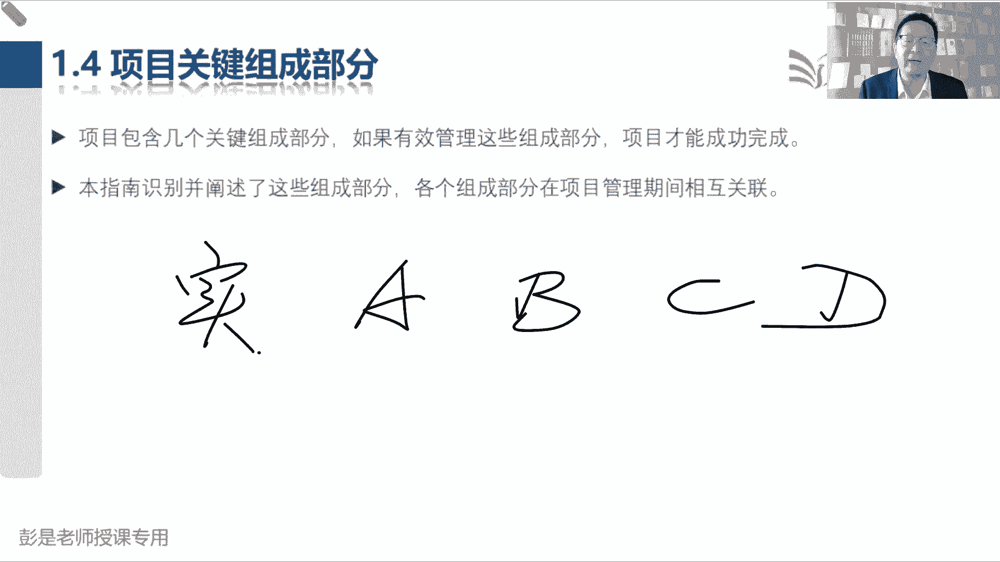

所以记住这个结论，不同类型项目阶段划分不一样，所以最后这个结论是阶段的名称，数量和持续时间，取决于我们管理和控制的需要，有的人有的有的同学可能就是9年一贯制，9年一贯制，然后呢再加上什么3年高中。

然后呢又本硕博连读诶，他可能分成这么几个阶段，那有的人他可能上完初中啊，高中啊就去工作了，就去工作了，然后再再专升本，再去再去复读，以此类推吧，它取决于我们管理和控制的需要，好记住这个东西啊。

所以不同类型项目阶段划分不一样，这就是项目生命周期和项目阶段划分，这两个知识点，搞定了这两个知识点之后呢，这三个单词能能看懂吗，顺序迭代或者是交叠顺序很好理解，这是A阶段完成了之后，在B阶段。

B阶段完成了之后，在C阶段排着队，一个一个来交叠，关系是什么呢，如果顺序顺序是指的是串行交叠，就是并行，这也很好理解吧，像半工半读，半工半读，我一边上班一边读，读什么研究生，硕士生，博士生哎。

就这东西啊，它是存在着存在着并行这种可能性，因为你实际工作中不可能全都是串行，很多事情可能是同时开展的，所以就是交叠关系，并行关系啊，那迭代指的是什么呢，重复，重重复迭代指的是重复重复重复。

就是说啊这个工作呀做的做的可能不到位，有问题，咱再把它重复开展一下，最好理解的场景就是过年过年嗯，我们家吃饺子，让我和面，和面这是一项工作，这项工作呀我没干过，怎么办呢，反复尝试呗，水多了放面面多了。

放水水多了，放面面多了放水，不断的不断的不断的重复开展这些事情啊，直到找到一个合适的配比诶，他就是重复，所以就像大家工作里面，比如说你老板让你写个文档，写个资料，你写完了第一稿，老板说这个地方这个地方。

这个地方这个地方需要改一改，那咱就迭代一下，把这些车把这些工作改一改，对不对，改完了之后再让老板评审，老板审批啊，老板说这个地方这个地方再改一改，那咱就再改一改，它就是指的指的是重复重复。

重复开展相似这个这个同一个工作，直到满意为止，直到合格为止，这就叫迭代，所以就像上学的时候，一年级我蹲班了，这就叫迭代啊，因为没学好，没学好，得把这蹲班了再重新学一遍，一年级诶，这就叫迭代。

所以生命周期这些阶段之间，这些阶段之间啊各种各样的关系啊，可能是A阶段完成了之后再开展，B阶段，也有可能实际工作中，A阶段和B阶段，在某些时期存在着这样交叠重叠的关系，也有可能呢A阶段的工作没做到位。

我们需要重复开展，重复开展，这就是阶段之间最常见的三种这种关系，好知道这个意思啊。

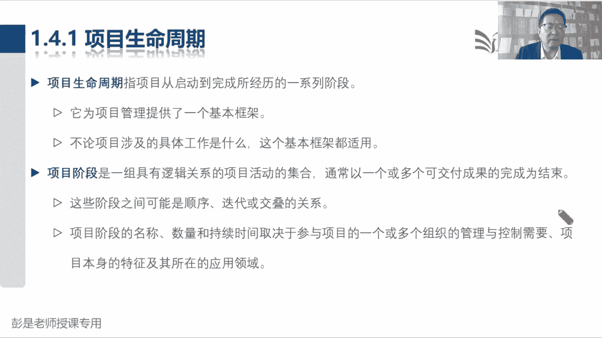

搞定了搞定了，然后再往下拉，说项目阶段可基于各种因素而建立，其中包括这段文字呢，不念了，再看一看就可以了，就总之啊取决于我们我们的管理控制的需要，对不对，我想分成几个阶段，就分成几个阶段。

他中心思想是什么啊，不知道大家有没有听过这句话呀，天下大势合久必分，分久必合，就是这个事情啊，如果它的规模太大了，我们就把它拆一拆，拆成一些比较合适，比较适比较适当的，适当的达到一个适当的颗粒度。

确保我们能够做到有效的控制，这是他的中心思想，其实就是我们学到范围这一章分解这个逻辑，所以简单的道理就像大家中午啊，比如各位同学，你中午叫外卖，叫外卖这个事情，你有没有把它仔细的分成了N个阶段呢，没有。

为什么呢，这个事儿太小了，对不对，大家耳熟能详的事情太简单了，咱就没必要分这么细，基本上几分钟这个这个餐就点好了，那你像你给公司办年会，10万人1万人聚餐，这事儿就大了，事情这么大，要做的事情很多。

规模复杂程度就上去了，那你可能就需要把它分成多少个阶段了吧，订会场订餐厅怎么订会场，订节目，订菜品，好多事情呢，你就可以把它分成N个阶段去进行处理，这么做的目的是进行更好的管控，进行更好的管控啊。

所以带出来这个结论分为多个阶段的方式，有助于更好的掌控项目管理，同时呢还评估评估项目绩效，并在后续阶段采取必要纠正和预防措施的机会，所以接下来这个结构就是这样的，我们从项目开始到项目结束。

根据这个项目的规模和复杂程度，可以酌情的把项目分成N个阶段，分成了N个阶段有什么好处呢，便于管理和控制，有问题有问题可以及时的纠正，可以及时的纠正，可以及时的采取一些预防措施，防止后面工作出错。

这么做的最终的目的就是降低失败的风险，这是降低失败的风险，能听懂吧，还能跟得上啊，就像牛肉面馆装修，为了稳妥起见，为了稳妥起见，我们最好先做设计，你先把这个图纸啊给我画一画，让我看一看。

效果满意不满意啊，效果满意了，你再画这结什么结构图，施工图，把这些图纸画完了之后啊，我们再评审一下，看看有没有画错，没问题的话，我们再找施工队来进行施工，这么做不就是为了防止失败吗，这是为了规避风险。

唉我们就把它分成了这么多个阶段，这是餐厅的装修，你说过年我家回家呀，哪个哪个鸡窝搭个搭个哪个哪个猪圈盖个鸡窝，这小事有必要画个效果图示意图吗，没必要，我们家里就两只老母鸡，这事一拍脑袋就开干了，对不对。

那我就把设计呀，规划呀，施工啊，三个阶段合三为一了，直接就干活，直接就干活就完事了，这么简单的事情没必要搞这么啰嗦，对不对，所以具体情况具体分析，但通常来说，中等规模的项目比较有复杂程度的项目。

为了稳妥起见，最好最好最好把它分成N个阶段，这样呢可以帮助我们有效地控制失败的风险，降低失败的风险，嗯好，这道题段中心思想啊，那再往下走了啊。

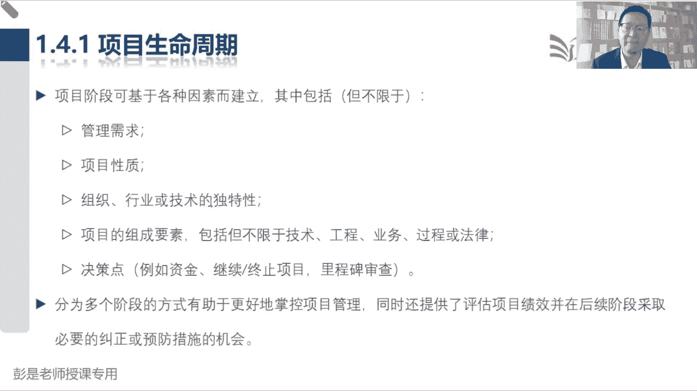

再往下1。4。2说项目生命周期的特征，这段文字开始啊听就可以了，刚才那一段一定要记住，那个非常非常重要的知识点，那142项目生命周期的特征，现在这张图包括这几段文字，听一遍，知道怎么回事就可以了啊。

说项目生命周期会受到，受到各种各种因素的影响，因为每个项目有每个项目的独特性，然后呢我们要根据项目的实际情况，把它从开始到结束分成N个阶段，但是但是话又说回来，虽然不同项目阶段划分不一样。

不管是你盖房子，开发软件，开发游戏，开研发手机，研发汽车，或者是哪怕一个小项目，研发一个什么汽车方向盘，汽车发动机，七个汽车的零配件，不管是什么类型的项目，总有一些阶段工作，总有一些阶段的工作呀。

是开始开始一个项目，对不对，总有一些阶段的工作，是做好这个项目的组织和准备，比如我们那个装修那景象画图纸做设计，以软件做设计做规划，这不都是组织和准备吗，对不对，包括你过年过年做年夜饭，那你买原材料。

然后洗菜切菜，这不都是组织和准备吗，等组织准备到位了，接下来炒菜不就是执行吗，诶敲代码二盖房子，这都是执行了，最后呢执行完成之后，得到我们那个主要可交付成果呀，就做好收尾，对不对，做好收尾。

所以这是四个共性的阶段，有了这四个共性的阶段，记记不住没关系啊，这叫通用阶段，不管你是什么项目，总能找到这四个共性的阶段，这四个共性的阶段呢，我们要考虑花的钱是不一样的。

我们的成本和人力投入水平是不同的，花的钱不一样，通常来说能不能猜出来哪一个阶段，我们投入的钱是最多的，这简单吧，通常来说就是执行，对不对，热火朝天的去干活了，通常这个阶段投入的钱最多。

所以大家随便想几个数字，大概理解一下这个意思啊，比如开始项目的时候，我们花了5万块钱，画图纸的时候可能花了10万块钱，施工的时候啊，我们可能花了30万块钱的，最后做保洁，做开荒，做交互交钥匙。

我们可能成本是5万块钱，这就叫分阶段的成本和人力投入水平，通常是这样一个特点，开始的时候投入少，中间投入的是最多的，到了后面呢投入又少了。

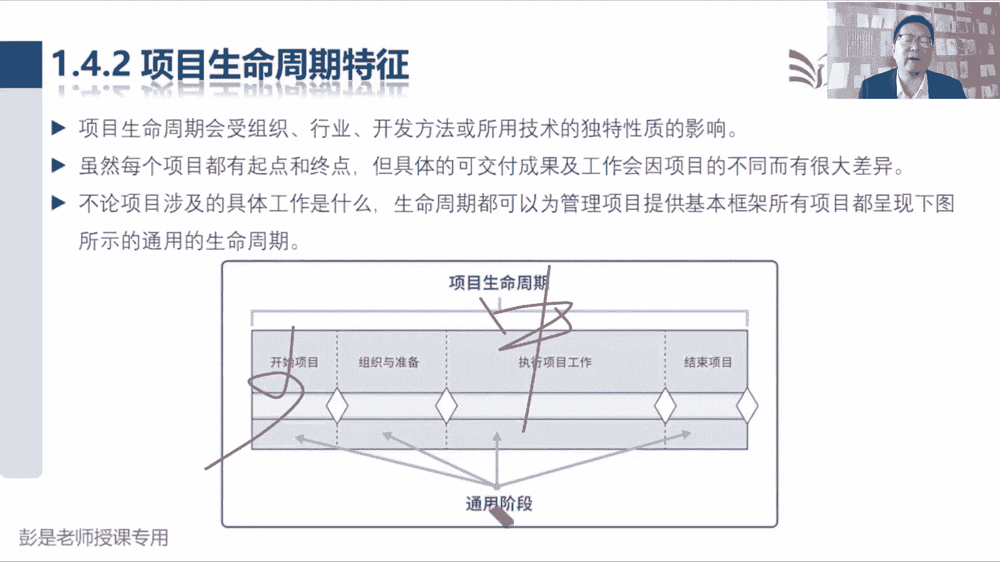

这叫分阶段的成本和成本和人力投入水平，好知道了这个分阶段的成本和人力投入水平啊。

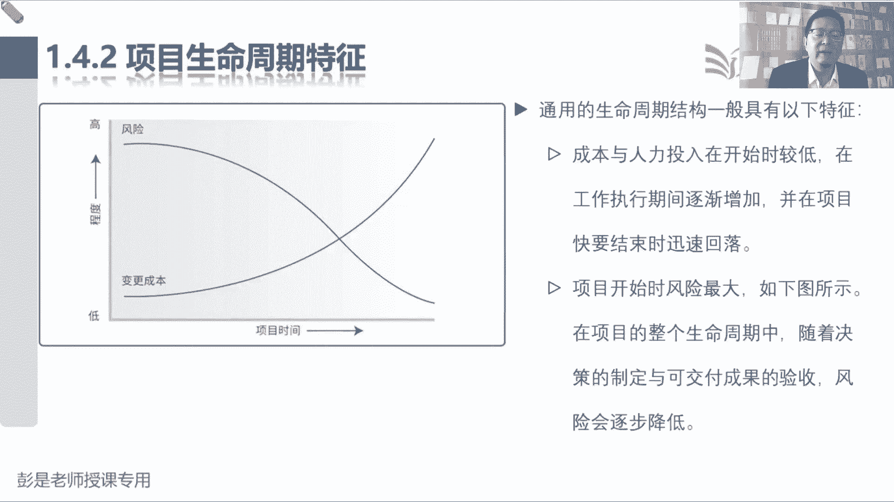

再看啊，这是5万，这是10万，这是30万，这是5万，分阶段是这样的情况，那接下来整体情况是什么样的呢，就是成本累积累积，累积到最后是一个什么效果呢，第一个阶段过去花了5万块钱。

第二个阶段一共花了15万吧，第三个阶段一共花了45万，第四个阶段过去一共花了50万，我们会发现总体的成本是在不断的上升的，因为时间就是金钱，每天对你企业来说，你的人啊，房租啊，水电啊，像人员的工资啊。

薪酬福利呀，这不都是钱吗，所以整体的成本是在不断的上升，不断的上升，不断的上升。

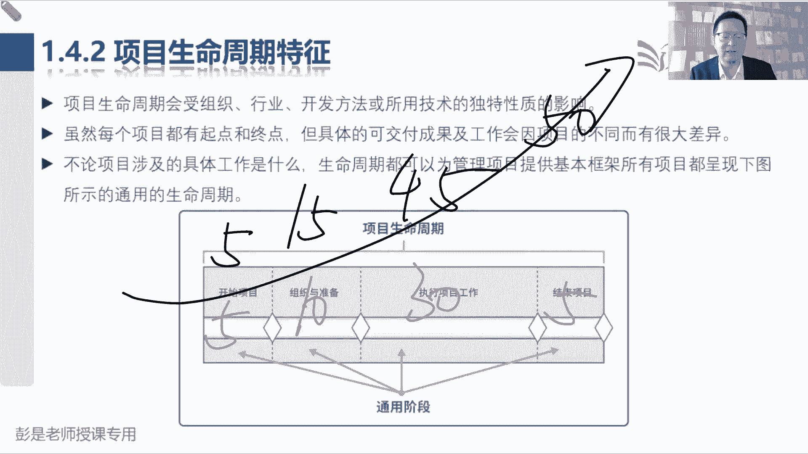

就带出来非常非常著名的这条交叉线，这是非常非常重要的知识点，需要大家记住啊，所以结论就是，通用的生命周期结构一般具有以下特征，成本和人力投入在开始时较低，在项目工作执行期间会逐渐增加。

工作期间会逐渐增加，并在项目快要结束时快速回落，这段话就在说分阶段的成本，人成本投入，开始投5万，做设计的时候投了10万，做施工的时候花了30万，做保洁，开荒的时候再花5万块钱，哎。

这叫分阶段的成本和人力投入，然后第二行就再说这种风险，项目开始的时候风险最大，为什么呢，在项目早期，这种不确定的程度是最大的，在项目早期，因为信息少，因为细节不知道，因为各种各样的不确定。

所以叫不确定的程度是最大的，然后呢在整个项目生命周期之中，随着决策的制定和可交付成果的验收，这种不确定的程度会逐步降低，这是这条往下走的这条线，这是第二小行，再往下说。

在不显著影响项目成本和进度的前提下，干系人改变项目产品最终特性的能力，在开始的时候最大，并且随着项目进展而减弱，这句话呢还是和风险这条线是一模一样的，项目早期改变项目产品最终特性的能力。

开始的时候最大是什么意思啊，这是早期我们这个餐厅还没装修呢，还没开始画图呢，您您怎么说，我们就怎么干，但是到了项目后期，生米煮成熟，饭木已成舟了，他改变产品最终特点的这个能力就越来越小，越来越低。

这段文字就在说这个道理，项目早期我们在纸上谈兵，现在只是在画图纸，您怎么说，我们就怎么画，对对很简单啊，随着项目开展，随着工作的开展，然后呢，房子都装修完了，您再说改呀，不容易了，为什么呢，因为。

最后这句这句话，因为我们的成本在不断的上升，我们的成本累积的成本在不断的增加，就是下面这条线，那累积的成本在不断的增加，不断的上升，所以呢做出变更和纠正，错误的成本就会越来越高，越来越高越来越高对吧。

我这个给甲方盖个楼，盖个什么30层的住宅楼，到了项目后期呀，我的成本已经很高了，甲方跟我说呀，这种情况下你就疯了，生米煮成熟饭了，亲在家地下室啊就要推倒重来呀，对不对，变更的代价非常高。

那我前面在画图纸的时候说，亲我给你画了个设设计图，这个这个大楼一共30层，下面有两层地下室，人家说亲，你给我加两层地下室，可不可以改成四层，没问题，变更的成本低，我们现在只是在做规划设计，在纸上谈兵啊。

想改他这个被改动的代价比较小，所以就带出来，最后这个结论，干洗在早期说啥是啥，影响产品的最终特性的能力是最大的，然后呢随着项目的进展越来越小，越来越小，为什么呢，因为变更的代价越来越高，生米煮成熟饭。

木已成舟了，这就带出来非常著名的这条交叉线，这段听明白之后啊，说项目早期不确定的程度最大，随着项目间接明细的特点，这种不确定的程度会逐渐减小，然后呢项目早期啊，我们的成本比较低。

所以变更的成本变更的代价比较小，比较容易接受变更，但是随着成本的不断上升，到了项目后期变更的成本越来越高，这种情况下再想改没有这么容易了，知道这条交叉线之后，再想最后一个终极小问题啊。

说这种风险这种不确定的程度，到了项目后期虽然越来越小，但是风险一旦发生，风险一旦发生，产生的影响是小还是大脑，爸爸你这往上看呗，现在成本这么高了，大非常大，所以随便带场景还是盖楼对吧。

比如说我们这个地方要盖楼，这下面呀土质松软，土质松软不结实，诶，那我不确定不确定这个楼盖完了，这个楼会不会倒，这不是风险吗，等我把这个楼盖好，这个风险一旦发生变成了问题对吧，这个楼不结实了。

就比萨斜塔不就这回事吗，他就倒倒倒就歪了诶，变更的代价就非常大了，所以到了项目后期，风险一旦发生，变成了实质实际的问题，它产生的影响可能非常非常非常大，那怎么破，这事儿咋整啊，到了项目后期。

一旦出现了问题，解决问题的代价，解决问题的成本不是变更的成本吗，非常高啊，咋破呀，开展一个项目补救，那叫亡羊补牢，那叫亡羊补牢诶，李倩同学说到提前两个字了，就这个意思啊，早发现早治疗早康复。

我们要想办法，想办法把这个问题给他提前暴露出来，不就完事了吗，对不对，早发现早治疗早康复和我们个人的健健康管理，身体管理不一样吗，还想办法让问题前置，提前发现，提前发现可能会带来的带来的各种各样的。

各种各样的影响啊，那怎么做到提前发现呢，我们需要有各种各样专业知识的人，尽早地参与到项目之中，给我们提出合理化的建议和见解对吧，什么结构工程师啊，建筑工程师啊，他也需要这些有专业知识的人。

尽早地参与到项目之中，去，分析我们项目，后期有没有可能会出现各种各样的问题，然后早发现，早治疗，早解决，早康复，所以需要这些人广泛地参与到项目之中，给我们提出合理化的建议和见解。

这里东西啊张同学说的就更更专业了吧，失效模式和影响分析，这个偏僻不考啊，偏偏不考嗯，好拐弯拐回来啊，对这个结论现在有一个印象就可以了，所以为什么后面我们有一张单独，这一章叫什么呢。

叫相关方管理干系人管理嗯，好再往下了啊。

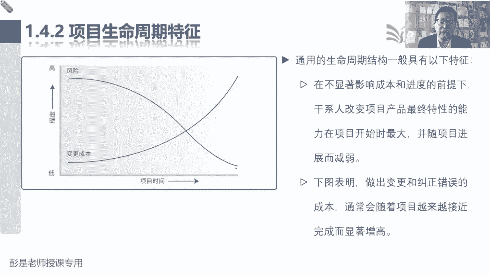

D43再往下走，阶段关口又带出来一个新的概念，阶段关口是在项目阶段结束的时候进行，将项目的绩效和进度与项目和业务文件比较，这些文件包括商业论证，项目章程，项目管理计划，效益管理计划，这这四个东西。

大家现在有的同学可能没有预期到，不知道它是啥，不重要啊，不重要，重要的是什么呢，重要的是什么呢，往下看，根据比较结果作出决定，以便于巴拉巴拉巴拉巴拉，有各种各样的决策结果进入下一个阶段。

整改后进入下一个阶段结束，项目停留在当前阶段，重复阶段或者是某个要素，那在不同的组织行业或者是工作类型之中，阶段关口可能会被称为阶段审查阶段，门关键决策点或者是这段入口阶段出口，他到底想说啥呀，想说啥。

看PPT项目启动之前三件事情，徐州评估商业论证效益管理计划的制定，项目结束以后，可能需要把我们的可交付成果已交给运营，这是我们的整体结构，然后通过前面的学习，我们都知道啊，不同类型项目阶段划分不一样。

我们把把把项目分成N个阶段，可以有效的帮助我们规避一些失败的风险，对不对，就是为了便于管理和控制，可以及时的发现问题，早发现，早治疗，早早康复，及时的纠正预防措施啊，就这些东西。

所以从项目开始到项目结束，我们把项目就分成了N个阶段，总之是为了规避风险，这就是生命周期，从开始到结束阶段划分这个知识点，那刚才说的阶段关口是什么呢，是说阶段结束的时候，我们需要有这样一个管理控制点。

这个管理控制点啊，做决策来决定是否进入到下一个阶段，那他决策的依据是啥呢，他怎么做决策呢，就是我们刚才之前听过的都听过的两个单词，嗯可行性和价值，我们在项目启动之前，就要分析这个项目还有没有可行性。

有没有价值，如果既有可行性又有价值，我们才愿意投入人财物去做这个项目，那在项目开展的过程中，可行性可能会发生变化呀，价值也有可能会发生变化呀，对不对，刚才也说过了吧，发现呢第一个阶段干的越多，赔的越多。

那我们可能考虑啊止损啊，这项目咱就不玩了，这就是阶段，单口仍然要去分析项目是否还有可行性，项目继续往下做下去啊，还能赚钱不赚钱吗，哎这是价值和可行性，那继续分析可行性和价值，他怎么做这个分析呢。

他就是用理想和实际情况做比较，咱通常都说理想很丰满，现实很骨感，他就是用理想和实际情况，理想就是我们那些纸上谈兵的东西。

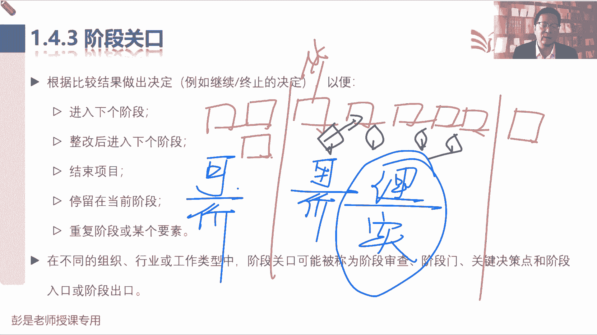

刚才见过的这个这个单词啊，项目商业论证，项目章程，项目管理计划，项目效益管理计划，这都是我们一厢情愿的东西啊，这都是理想啊，实际情况是什么呢，绩效对不对，所以他就是用理想和现实来做比较。

原计划原计划我一个月成本是5万块钱，然后呢收入是10万块钱，好赚他5万块钱，现在一个月干下来发现成本是8万，收入是6万，那就会发现这个餐厅这个牛肉面馆开得越长，赔的越多，咱就不干了，或者是转型，对不对。

就是这样的决策方法好。

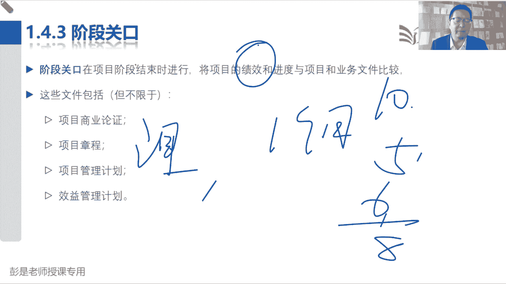

这就是阶段关口，再加上现在给大家画出来的这些小方块，你能够理解它这个结构就OK了就OK了，就这几个单词来回答啊，好所以第一根据比较结果，我们做决策来决定是不是进入到下一个阶段，这个决策的结果不需要背。

这大家靠日常的生活常识就能猜出来的，对对，这是断舍离，断舍离，就像各位同学，你现在在公司里面要不要换工作呀，要不要跳槽啊，你不要决策吗，对吧，我原计划今年在公司变成什么总监，然后工资待遇翻一翻。

结果现在一年干下来，发现啊工资也没涨，活儿还还还还很多，一大堆事，还天天加班，一大堆人还骂你，那你要评估了，继续在这个公司干下去，还有没有可行性，还能不能赚钱，对评估完了，根据你评估的结果来做决策。

对不对，那决策的时候前面我们特意强调过啊，项目经理还要有大局观的决策的时候，决策的时候，实际工作中，包括大家个人跳槽啊，还要看大环境对不对，整个行业目前景气不景气啊，经济形势好不好啊，好吧。

找工作方便不方便呐，看看人别人混的好不好啊，结果一发现大环境也不好，那咱就忍辱负重再扛一扛，再扛一扛，项目上做这个决策也是这个道理，我们不仅仅要看自己的项目情况，还要结合整对吧，项目经理要有大局观呢。

上到政策，下到什么什么行业呀，企业呀，各种各样的因素综合分析，综合决策，好，这一段知道这个意思啊，讨厌的东西来了，它有很多名字，阶段关口可能被称为阶段审查，阶段门关键决策点，这段入口阶段出口。

那你说老师这些术语要记住吗，不用小技巧，带阶段的你都能猜到，那就不需要特殊的去记，像这个单词看名字容易蒙，不不不容易能够猜出来啊，就需要单独有一点点印象了吧，万一考试的时候遇到题目的场景。

描述了一个叫什么关键决策点，你要能够反应过来，这个玩意儿等于阶段关口，达到这个效果就OK了，不太需要刻意的去背啊，并且咱考试的题目现在基本上都用阶段关口，这个这个大家更容易接受的术语好。

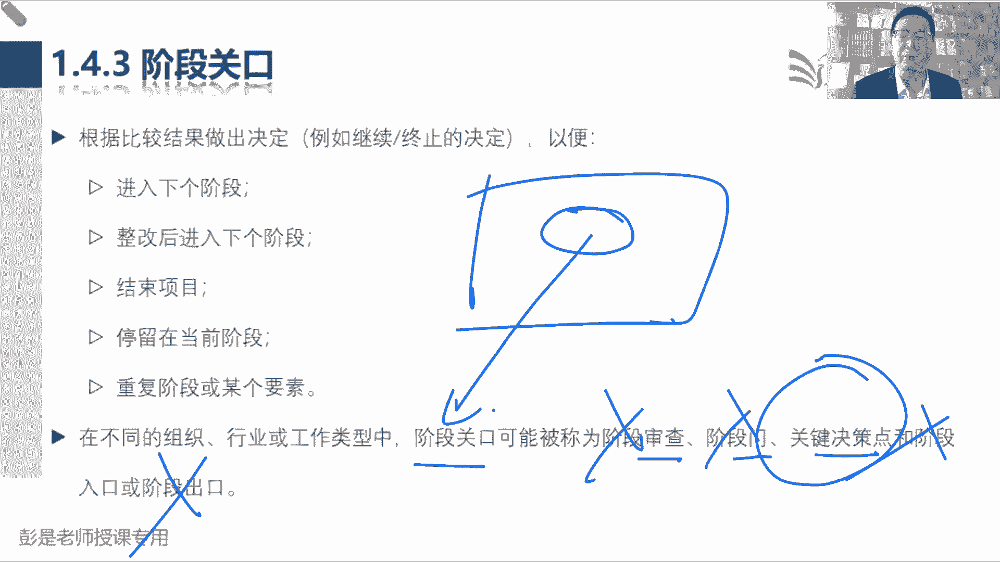

这是关于这段知识点，再往下1。4。4，1。4。4啊，又来了一个新的单词叫开发生命周期，然后传说中的敏捷，传说中的敏捷说项目生命周期可以是预测型，适应型，然后项目生命周期内，通常有一个或者是多个阶段。

和产品服务成果的开发相关，那么这些阶段就被称为开发生命周期，接下来这段文字大家先听，其实不复杂，你把它想清楚就可以了，先听大道理啊，咱就说从项目到开始，从项目开始到结束，这就称之为项目生命周期。

项目生命周期啊，根据这些工作性质的特点，我们把它分成了ABCDEN个阶段，这就是生命周期阶段的划分，那什么叫开发生命周期呢，比如说BCD这三个阶段和产品的研发，成服务的研发有关系。

那咱就把这三个阶段称之为开发生命周期，O就这么简单，红色的这个区间就叫项目生命周期，蓝色的这个区间就叫开发生命周期，有了这两个生命周期啊，有了这两个生命周期，还有最后一个生命周期，咱把它讲完了。

最后一个生命周期是什么呢，叫项目管理的生命周期，文字游戏，项目管理的生命周期又是什么鬼呢，很好理解啊，项目管理，项目管理，只要这个项目还存在，我们作为项目经理，就要完成对这个事情的管理工作。

所以项目管理，生命周期和项目生命周期是共存的关系，项目从开始到结束，我们都需要对它进行管理工作，管理工作就称之为项目管理的生命周期，管理生命周期，它的划分依据是五大过程组，一会儿会收到。

先稍稍有一丢丢印象就可以了，这就是我们需要掌握的三个生命周期，开发开发项目和项目管理好，那再往下了啊，说可以是预测型和适应性。

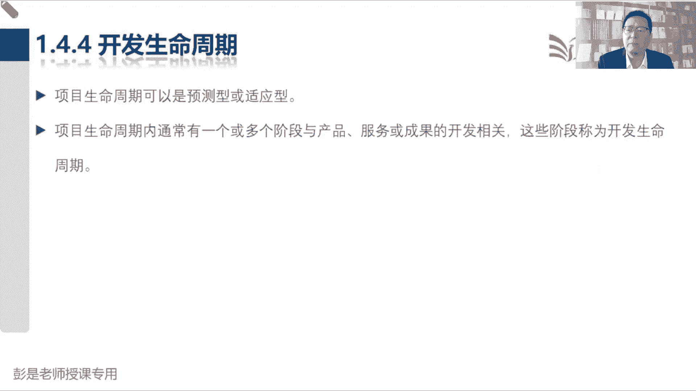

接下来这一段内容超重要，咱粗暴举个例子把它搞定，看看啊，开发生命周期可以是预测型，迭代型，增量型，适应型和混合型的模式，预测型生命周期，它是指在生命周期的早期阶段，就能够确定项目的范围，时间和成本。

那我们对任何范围的变更都需要进行仔细管理，所以呢它也被称为瀑布型的生命周期，变成人话就是说呀需求是确定的，在项目早期我们就能把需求给他定下来，并且呢这个需求基本上不大会发生太大的变化。

所以呢过程中我们尽量的尽量的尽量的不要改，它就叫可预测，对不对，为什么叫预测型呢，就是结果可预测，因为需求是定的，因为需求是定的，这是预测形式，命周期的特点，好结果可预测，结果可预测，所以带场景。

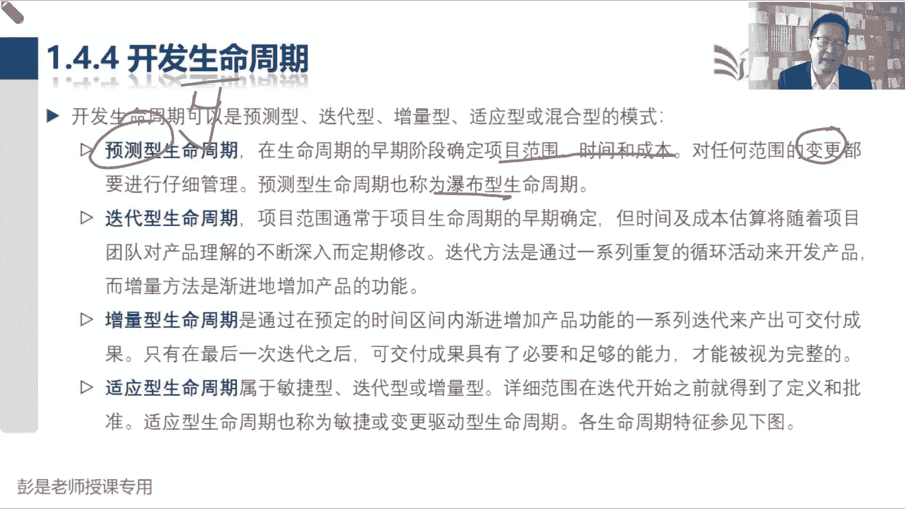

就像富士山下同学说到这个经典的场景啊，接下来咱一起来创业，亲，各位同学，我们一起创业，前面说过啊，创业的时候我们要定目标，愿景，使命价值观，做企业的战略规划，然后呢有了项目，有了运营。

就是企业管理地图那个大三角，那现在现在啊，假设我们一起来创业，我们成立一家什么样的公司呢，成立一家什么样的公司呢，以前给大家讲的场景是超微信，超微信是因为大家天天天天都在用微信，所以比较好理解。

咱继继续沿用这个场景啊，现在啊我们要做世界上最大的互联网社交平台，我们定了定了啊，我们的公司啊就叫巨信公司，自信就是要打败微信，我们的竞争对手就是微信，那我们战略计划三步走，战略计划三步走，第一个阶段。

第一个阶段我们要研发出自己的这种社交平台，这种软件产品，那我们定的策略就叫抄，就叫抄，微信有什么功能，我们就做什么功能，你给我做一个一模一样的，这种情况下用什么样的生命周期类型呢，超超超。

我们在项目早期就能确定到底要做什么东西，对不对，需求是确定的，并且在过程中不要改，微信有啥咱就做啥，要限制各种各样的变更，还结果可预测，结果可预测吧，就用预测型生命周期就可以了，我们以结果为导向。

你给我弄一个一模一样的东西，开牛肉面馆也是这个思路吧，我要开一个牛肉面馆，看看什么兰州拉面啊，什么什么这牛肉面，那牛肉面看谁家的风格好，找个装修公司，你给我弄一个一模一样的结果，给我抄，这不是预测行吗。

它就适用于这样的场景预测型，预测型需求是确定的过程中没有太多的变化，结果可预测，所以呢它也被称为瀑布型的生命周期，为什么呢，为什么叫瀑布啊，超微信超微信嗯，那你先定一个开发计划，然后呢你去设计产品。

画各种各样的界面原型，把界面产品功能都给他定定好了之后啊，找人敲代码，敲完了代码做技术设计，详细设计，敲代码做测试对，就像流水的那个瀑布一样，把前一个阶段的工作成果传给下一个阶段。

再把下一个阶段的工作成果再传球，传到下一个阶段，可就像瀑布一样，所以呢也被称为瀑布型的生命周期，这是第一个第一个战略计划啊。

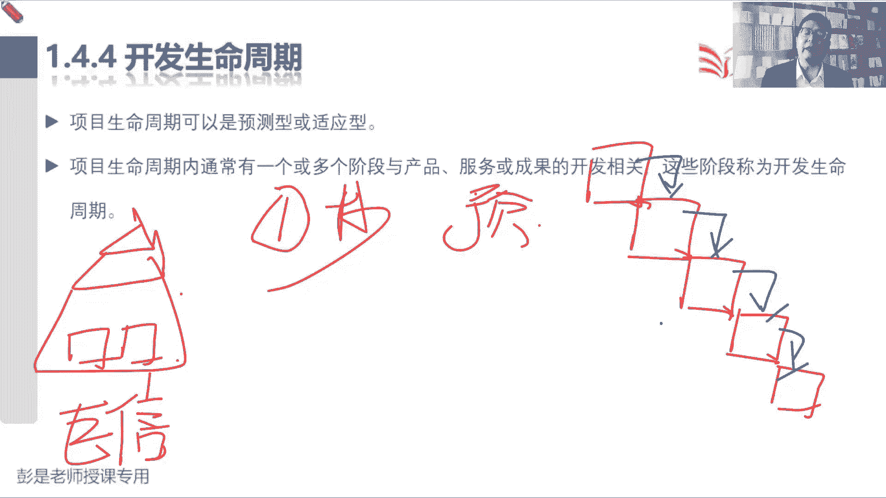

好知道了这个大道理之后，再看教材，看PPT啊，最后这一行适应性生命周期，它适用于什么情况呢，它也称之为敏捷型迭代或增量型，他是说详细范围，在迭代开始之前就得到了定义和批准。

它也被称为敏捷或者是变更驱动型的生命周期，这书上这两句话你听完了之后就懵了，所以适应性生命周期或者是敏捷啊，它适用的场景和预测型刚好相反，预测型的需求是早期就可以敲定的，适应性呢就是到底做什么。

不知道他需求不确定。

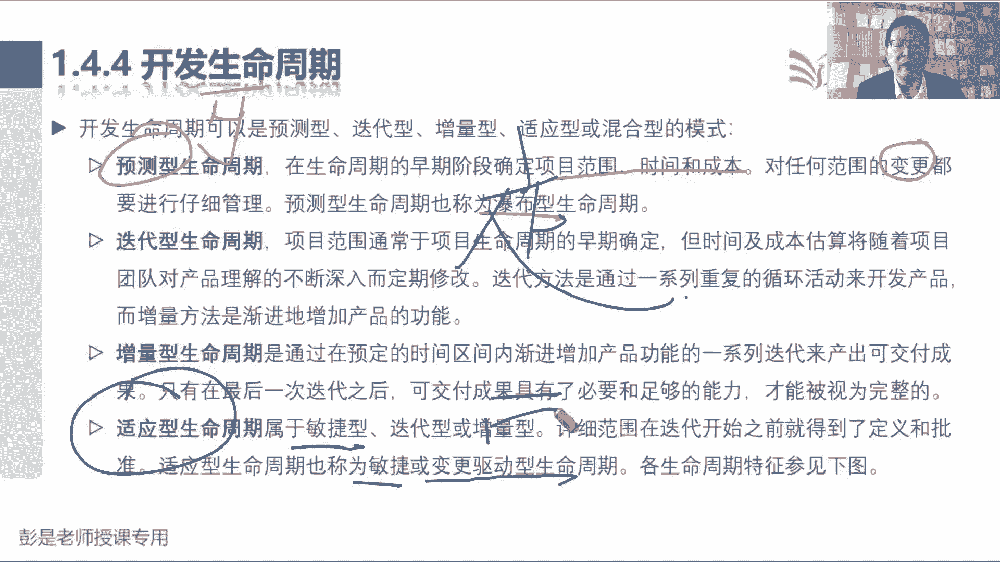

既然需求是不确定的，所以在我们开展工作的过程中，可能会有各种各样的变化，哎这就是预测这是敏捷型，它适用的场景，那到底怎么做敏捷，到底怎么做敏捷啊，这个我们后面讲到第三部分会详细展开讲的。

现在大家先有一个大概的认知就可以了，那它适用的场景，第二个我们战略计划第二步，第二步是一个什么场景呢，就是啊，我们现在假设呀，抄了一个和微信一模一样的东西，把这个东西发布了。

现在呀广大百姓啊纷纷去下载我们这个app app，下载这个下载我们这个软件去使用，那根据用户的反馈，根据竞争对手的，根据竞争对手的一些动向啊，到底要做什么新的功能啊，到底要完成什么新的功能啊。

咱也不知道，难以预测，需求不确定，但确定的是什么呢，我们需要能够快速响应，快速根据用户的反馈开，快速根据竞争对手的动态来想办法，想办法尽快的对我们的产品做出调整，来适应一下这个多变的。

多变的竞争激烈的这样一个环境，这种情况下用什么样的生命东西类型啊，快速响应，快速响应现在做什么，不知道，到时候再说，见机行事，这是什么呢，这是敏捷，需求不确定对见机行事，到时候再说，到时候再说。

根据实际情况快速的进行调整，这就是敏捷，它就适用于这样的场景，那我们战略规划第三第三步。

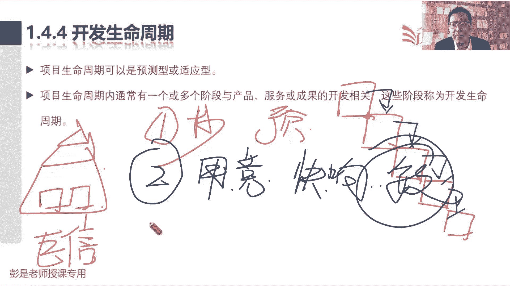

第三步就需要大家搞定迭代和增量迭代，刚才给大家说过了吧，它适用于什么场景呢，通常适用于四个字叫方案不确定，技术不确定，他就是IT项目出来的，这是IT项目出来的敏捷开发，但其他行业的同学也都在用。

所以先大概知道怎么回事啊，那迭代型生命周期它适用于什么呢，叫技术方案，技术方案，解决方案，不确定的场景，刚才给大家说的那个场景还有印象吗，这过年这个做牛肉面里头一个道理啊，开了个牛肉面馆。

我也不会做饭的，这到底放多少水，放到底放多少面，这个技术方案我心里面没谱，不知道怎么办呢，探索对不对，放点水再放点面，水多了加面，面多了，加水，反复尝试，反复尝试，找到一个合适的解决方案，这就叫迭代性。

这叫迭代性，它通常适用于技术方案不确定，所以就像各位同学啊，你去咱去医院看病，是不是也是一个迭代的过程对吧，医生给你吃了一个什么感冒了，吃点感冒痛不好使，那我们再试一试，白加黑。

总之啊不断地探索一个正确的解决方法，诶这就是迭代型生命周期，这就是它适用的场景，那增量增量指的是什么呢，增量是说呀，我们在预定的区间之内渐进的增加产品的功能，他指的是间接的增加产品的功能。

为什么要逐渐增加产品的功能呢，那就是需求不确定了，对不对，需求如果确定，我们就没必要今天做一个，明天做一个了，对不对，所以它通常适用于需求不确定，还是做饭对吧，还是做饭，就像年夜饭到底做几个菜啊。

不知道啊，怎么办呢，怎么办呢，做一个吃一吃，做一个吃一吃，不断的增加，增加这些东西啊，不断的增量啊，不断的增量，直到吃饱为止啊，这不就适用于需求不确定的场景吗，唉这就是迭代和增量，它适用的场景。

迭代通常适用于技术方案不确定的场景，那咱就不断地探索，找到一个合适的解决方法，那增量型通常适用于需求不太确定，需求不太确定这样一个场景啊，那需求不确定，咱就今天做个功能，明天做个功能诶。

不断的去通过这些功能的增加，去确认是不是满足是否满足用户的要求，嗯好知道了迭代和增量适用的场景，知道了迭代和增量适用的场景啊，一个是技术方案不确定，一个是需求不确定，那敏捷最终它适用于什么场景呢。

就是技术和需求都不太确定啊，技术方案可能也存在着不确定，并且呢需求啊也不太确定，这两个东西都不确定，不就是变化更多了吗，更复杂了吧，它就适用于这样的项目，好知道了这个道理啊。

那有同学说到手机再举再举几个例子，那差不多就得了啊，说到手机好，我真的是花一个亿打算成立一个手机企业，成立一个手机企业，那第一我要花很多钱，把市面上手机有的功能全都给他做出来，这有可能浪费呀，对不对。

不知道用户愿不愿意买单呐，那为了稳妥起见，是不是我们先先从基本功能做起呢，先做个手机，然后呢再做个能拍照的，带摄像头的手机，能打电话，能拍照，能录能录像，把基本功能做出来，然后再不断的渐进增加功能。

去看看看看用户愿不愿意付费，用户愿不愿意买单，这不是保险吗，对不对，知道这个意思啊，所以这四段文字，这四个这四个生命周期类型，一定要通过刚才的讲解，粗暴地理解一下它适用的场景，预测型就是需求比较确定。

技术方案也确定，所以过程中没有太多的变化，那我们要尽量的限制变更，他就可以做到一次交互，这是超微信，然后适应型呢就是多变技术方案可能不太确定，需求也不太确定，能不能做也不知道啊，那我们就走一步是一步。

走一步是一步，所以它本质上来说就是迭代加增量，这两种模式加到一起，他就是迭代加增量，只不过迭代周期短短非常短，一周两周三周，其通常小于四周，适应型敏捷，它的本质就是迭代和增量加到一起。

那迭代适用于什么场景呢，就是技术方案的不确定，那咱就不断的探索，就像就像和面放多少水，放多少，放多少，放多少面，那增量型呢通常适用于需求不太确定对吧，需求不太确定什么叫需求啊，就是你这顿饭到底吃多少面。

咔一下煮十斤，你也吃不了，煮一两吃，再煮一两再吃，再煮一两再吃，吃饱了为止，这不是不浪费嘛，就这道理吧，所以需求不确定，那我们就逐渐增加产品的功能来做一个功能，您看看是不是满足您的要求，再做个新功能。

看看是不是满足您的要求，再做个新功能，看看您需不需要用得上，不断的增加产品的功能来探索，探索是不是是不是符合对方的业务要求，它就适用于这样的场景啊，最后适应性那就是技术方案不确定，需求也不太确定。

那咱就迭代加增量，不断的不断的循环，不断的增加功能，从而来从而来分析，让用户来用户来反馈，是不是满足他的需求啊，好现在大家只要掌握到这个程度就够了，后面讲到具体的敏捷的游戏规则的时候，讲敏捷实践的时候。

再详细给大家讲细节性的知识点，到底怎么迭代啊，到底怎么增量啊，后边再说第三部分。

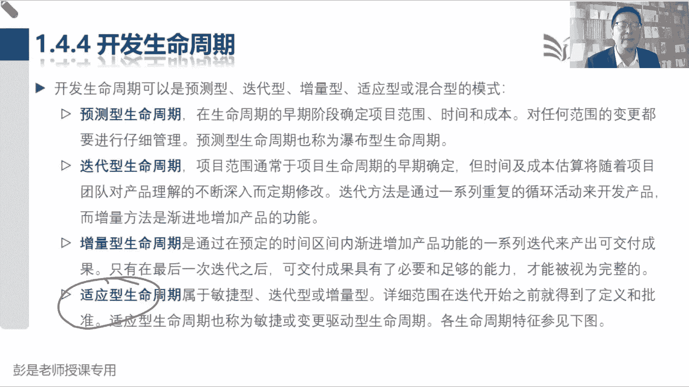

记得啊，第三部分再把它搞定好，那回到场景。

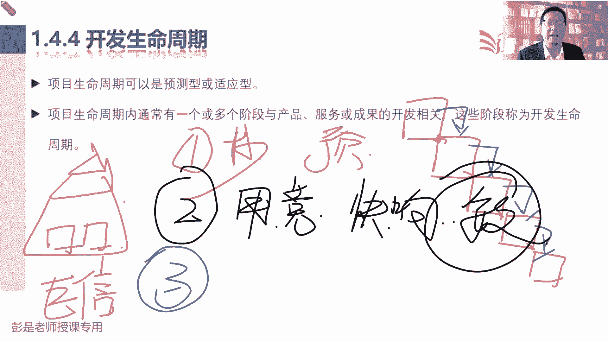

回到场景啊，大家接下来就可以随便举例子了，对不对，刚才有同学说到健康码二哎，还是这个逻辑，健康码刚出来的时候，健康码刚出来的时候用的什么生命周期类型呢，因为疫情变化多，因为疫情复杂，因为变化多。

因为需求不确定，因为变化快，因为要快速响应，所以就用了适应性，也就是敏捷这种方法，四天就出了一个版本，然后随着疫情的发展，不断的不断的快速的，快速的推出一些新的功能对吧，什么行程啊，扫码扫码登记呀。

哎就用敏捷，那健康码什么时候用预测型生命周期呢，只要能猜到就出事了，健康码在什么情况下用的预测型生命周期，下一个疫情，这这这么说不吉利啊，这么说不吉利，换一个场景，换一个场景，换一个场景。

哎大家觉得这个其他省份其实是有道理的吧，我发现什么，你们北京市做了什么老油代查扫码登记诶，这功能挺好，我们抄一个，这是不是就是预测了发现某个地区对吧，什么你们广东有一个新的功能挺好的对吧。

比如说老年人用老年机，小孩可能也没有健康码啊，那我们出一个老优待茶的功能诶，这功能挺好，那我们其他地区就抄一下，就抄一下，学习借鉴一下吗，这不就是预测吗，或者是移植对对手机微信里面有健康码。

支付宝里也有健康码诶，那我们比如说我们要在小红书上，在抖音上也做一个健康码，抄好，它就适用于这样的场景啊，还横向推行展开的时候，以此类推了吧，大家就是主打一个灵活，主打一个灵活，总之需求不确定变化多。

需要快速响应，那咱就小步快跑就敏捷，如果我们的需求是明确的，结果可预测，那咱就稳扎稳打一次，把这个东西全给它做出来，做一个一模一样的好，知道这段知道这段中心思想搞定搞定啊。

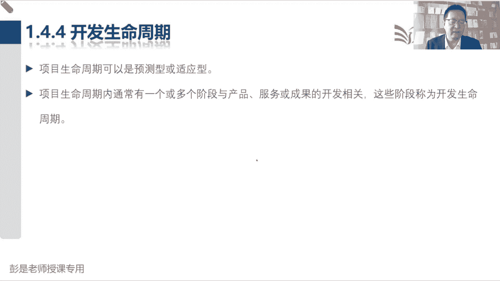

好再往下走了啊。

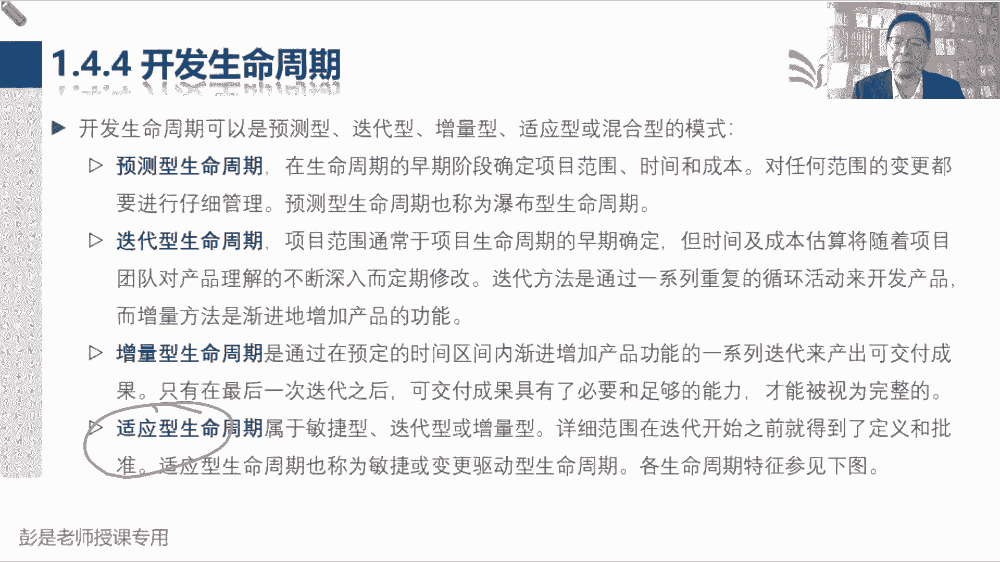

接下来这张表，这张表就需要大家把前三行搞定就可以了，并且并且中间这种模式啊，咱PMP考试现在基本上也不考，就把左边和右边预测型和和敏捷型区分出来，记得咱考试180道题，50%考预测，50%考混合。

混合是什么呢，就是敏捷加预测，所以搞定左边搞定右边，左边预测型是需求，在开发前预先确定超，对不对，超那这种情况下，我们针对最终成果制定交互计划，然后就可以做到一次交互，我们以结果为导向。

你给我抄一个一模一样的就可以了，过程中啊我也不参与，不想参与，所以尽量的限制变更，因为我们要一次交付，尽量的不要改，那敏捷型呢是说需求在交互期间频繁细化，需求在交互期间才能够频繁细化。

不只是说现在需求不确定吗，对不对，干一步试一试，干一步试一试了，那这种情况下我们需要频繁交互，对客户有价值的各种子集，这句话大家目前听不懂，就想刚才那个场景不断的增加功能，增加功能来确定。

确定一下是不是满足您的业务需要诶，这是迭代加增量，迭代加增量，所以这种情况下，我们就可以在交付期间实时把变更融入项目，这句话稍稍深一点啊，为什么能够做到在交付期间把变更实施，融入项目呢。

它的大道理是这样的，预测型，根据现在我们储备的知识啊，到了项目后期变更的成本非常高，所以我们尽量的限制变更，那如果需求是明确的，就不要改了，我们就可以做到一次交付了，对不对。

那在敏捷这种需求不确定的环境下，到了项目后期，如果您在提出提出一些新的需求啊，这我们扛不住，这个成本太高了，这个成本太高了，那怎么办呢，小步快跑，我们用一个很短的周期来实现一些功能。

用很短的一段周期来实现一个功能，这就是大事化小，小事化了啊，周期短，成本就低，周期短成本低，也就意味着试错的代价小，我们一周出一个功能，在一周出一个功能，在一周出一个功能，这种情况下变更的代价比较小。

所以呢我们可以做到把平衡实施融入项目，先听一听这个小道理，听完了之后，后面讲到敏捷的时候，再详细展开说了，知道这个意思就可以了啊，总之啊就叫以最小的代价去试错，嗯好知道这个意思啊，各位同学啊。

刚才说我们后面讲详细知识点的时候，会展开说的，现在你不要不要再个人建议啊，不要再把这个细节性的问题就一个一个去问了，不然太发散了，能理解吧，我们迭代周期是固定的，两周两周的成本是不是可预测，它是定的对。

虽然总体的成本难以确定，但是这个期间的这个周期的小节奏的，这个这个成本是固定的，对客户来说仍然仍然可以有效地控制风险，嗯先听一听意思，后面再详细的展开说这个细节了，细节搞定了之后，你再翻过头来复盘。

这段就超简单了啊，没关系，有问题随时问到，但不代表着所有问题我都回答呀，这个后面讲到变更管理，你会知道这个原则好，这下接下来继续了啊，所以这张图，这张图大家现在可能会有一些小小的疑惑，没关系。

因为这个结构就导致了现在讲啊，不可能讲的很细，对不对，所以先提大道理，粗暴理解就可以了，有点懵啊，在对标的实际工作中，比如说我们要做一个，做一个和微信差不多的东西，听场景。

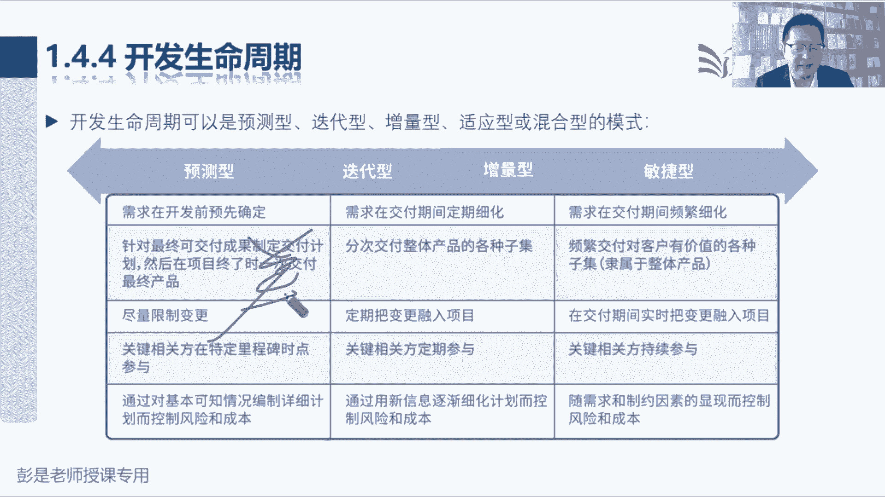

我也想做社交平台，我要做一个和微信差不多的东西，我看那国外有些社交平台，国外有些有些我们访问不了的网站也挺好，我还想抄一抄钉钉，什么陌陌，还有我还想抄一些小红书，我还想学一学抖音，总之啊需求不定。

我也不知道要做什么，你怎么办，这种情况下你怎么办，用户用户什么都想要，用户什么都喜欢，你怎么办呢，你一次把所有的功能都做完吗，我们做了参考了，抖音，又把拼多多的功能做了，再把微信的功能做了。

再做一个陌陌，再把小红书也做了，再做个王者荣耀，再做个吃鸡游戏，把这些东西全都做完，一次交互你就死去吧，这能听懂吧，这个代价太高了，万一用户说呀，抱歉抱歉，这些都不是我要的，成本太高，那怎么办呢。

诶小步快跑，对不对，我先做一个微信聊天的功能，您看看这东西你用得上吗，嘿我再根据您的反馈，我要做一个朋友圈的功能，您看看您需要吗，我在做一个微信视频聊天的功能，您看看您需要吗。

我在做一个做一个什么什么抖音刷视频的功能，对吧，就是这个视频号，您看看您需要吗，不断地做一个功能确认一下，做一个功能确认一下，这不是有效的，可以规避风险吗，他就是这个逻辑吧，唉这就是敏捷。

那我们做每一个功能的周期短，它的试错的代价就低，对不对，成本就低啊，总比你一次把这些东西全都做完，用户说这不是我要的这个试错的代价要小得多，就是这个道理，好最后再给大家讲一讲麦当劳的场景，没办法。

这超好理解，麦当劳推出一个套餐就这么说了啊，这敏捷这种方法呀，大家工作中，生活中其实都在用麦当劳推出了一个套餐，有一个A汉堡，还有一个B饮料，还有一个什么C破玩意儿，还有一个D什么破玩意儿。

这个套餐卖50块钱，我这四个东西我从来没吃过，从来没吃过，你怎么规避风险，你是一次花50块钱把ABCD都买回来，大而全，还是说有没有其他方法呢，这四个东西我也不知道好吃不好吃，对不对。

我也不知道好吃不好哎，南安同学加上NIKI同学，你们俩的观点加到一起吧，先买一个最便宜的一个一个单买，这次是不是规避风险了，这不就是迭代和增量吗，对不对，下订单然后交钱，然后拿到拿到拿到食品。

然后尝一尝，尝一尝，不就是确认需求吗，对不对，看看这东西是不是符合我的需要，看看我爱吃不爱吃，得到了一个心得体会，这不就是增量吗，然后如果好吃啊，我再下订单再交钱，再拿到第二个东西再尝一尝。

哎就又得到了一个好吃不好吃的感受，那如果我如果我呀就不断的不断的不断的循环，循环，完了发现A呀，B呀，C呀，D呀，发现这四个东西都好吃都好吃，下一次你怎么办呢，还需要敏捷吗，还需要敏捷吗，不需要了。

下一次就一次交付呗，预测不就完事了吗，对不对，结果可预测，这东西这东西我都吃过，它好吃啊，就可以做到一次交互了，所以敏捷的中心思想就是多次交互啊，多次小规模的交互，因为规模越小，成本越低。

试错的代价越小，就这个就这个就这个道理吧，所以大家工作中生活中，你看看是不是这种这种这种思路，你到处都有，就像各位同学，你有没有买，有没有囤货的经历，对什么，双11双12囤洗发水，囤一年的囤一箱。

那万一不好使怎么办，怎么以最小的代价趋势做呢，先买一瓶，成本仍然高，对不对，能不能去超市啊，弄点小样儿啊，这成本更低了吧，哎试用装小样成本更低了，总之我们要挖空心思，想方设法地以最小的代价去试错。

对小样用一用发现还不错，诶，我们在批量购买，大规模购买，做到一次交付，道理都一样，道理都一样啊，所以敏捷他其实就是个思路，他的中心思想啊，这叫以最小的代价来试错，为什么叫试错呢，就是因为需求不确定。

就是因为方案不确定，所以才需要探索，所以才需要探索，需要尝试，大家有没有听过这句话，这句话挤牙膏哎，都是这个中心思想啊，好搞定了啊。

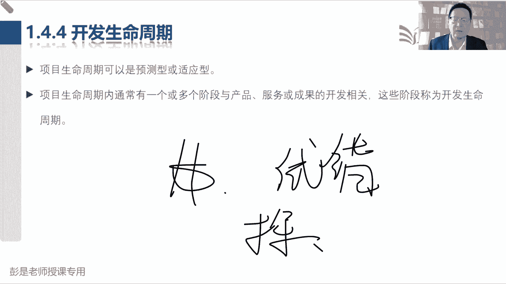

搞定了之后休息休息啊，我看看后面还有啥东西好，这个混合先讲完，最后一分钟混合形成的周期是什么呢，这是加到一起，就是加到一起，因为从项目开始到项目结束，我们把项目分成了A呀，B呀，C呀，D呀，N个阶段。

有一些阶段的工作呀是可预测的，咱就用预测型生命周期，有一些阶段的工作不可预测，不确定，我们就用敏捷把他俩加到一起，不就是混合吗，好知道这个意思啊，这就是后面最后一个单词叫混合型生命周期，大部分项目。

但现在大部分IT的项目都是混合型，然后最后呢这不解释了，看情况具体情况具体分析，主打一个灵活，因为预测型生命周期最后一个知识点，预测型生命周期啊和敏捷，我们换视角来看，从总体成本上来看。

总体成本啊哪一个更高呢，想一想这个道理，敏捷形式告诉我今天买一瓶，明天买一瓶，后天买一瓶，在后天买一瓶，预测形式告诉我一次买一箱，总体上来看，敏捷的方法反而成本会高于预测，对不对。

因为我们还加了很多很多的管理管理工作呀，能听懂吧，加了很多的环节啊，所以呢他总体成本反而会高，通常高到30%甚至更高，40%左右，你就想一瓶一瓶买和批量一次买一箱，对不对，买一箱有优惠啊。

哎就这个逻辑啊，所以总体成本虽然看起来比预测性更高，但是它是错的，代价小，对不对，好知道这个意思啊，所以最后结论就是根据项目的实际情况，该预测的就预测，因为它的总体成本会低，该敏捷的就敏捷。

因为他有风险，需求不确定啊，基础不确定啊，有风险，那怎么办呢，想办法以最小的代价去试错，去探索，主打一个灵活，这就是最后一句话，好各位同学，我们今天预计下课，5。15点下课啊，咱再来个短休息。

短休息完后完成之后呢，再给大家讲一讲后面那个什么什么一四，哎不翻页了。

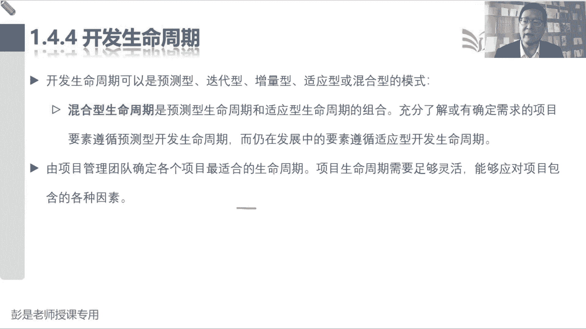

145项目管理过程，这道内容超简单，咱现在是16。28，咱休息5分钟，休息到16。33，好，各位同学准备了准备了准备了最后一小段课程，所以就像潘敏同学说的，敏捷开发。

在新一代产品的尝试或者新的idea尝试的时候，用的最多，大家有没有看过那个马斯克干什么的，火箭回收，那叫什么呢，迭代对需求是明确的，然后不断地探索，找到合适的解决方法，让这个火箭能够成本低又快又好。

还能够回收，再次利用，可就这个道理啊，不断的探索，不断的探索，找到一个正确的解决方案，然后是不是同时可以考ACB呢，可以实际上大家学完了PMP之后，关于敏捷，关于敏捷基本上应该算相当于差不多了。

ACP在此基础之上需要掌握一些，需要掌握一些额外的敏捷事件方法，在后面讲敏捷的时候再说了啊，好再往下145145项目管理过程，这段文字基本上大家想看就看，不想看可以不看了，这是传说中的49个管理过程。

什么叫管理过程呢，就是这些管理工作不可能一次就搞定，对不对，通常需要一系列的操作，所以呢就称之为干这个事情需要一个过程，有一个过程，学习有学习的过程，看病有看病的过程，吃饭有吃饭的过程，这就是管理过程。

那么一个管理过程呢需要得到一个劳动节，劳动结果，这是我们的输出，然后呢需要什么材料呢，就是输入中间会用到什么工具技术呢，就是纯粹的字面意思啊，工具技术想想49个很害怕呀，不害怕不害怕。

后面讲到检测过程的时候，嗯一加你就明白了，超简单的，大家学习过程中心理建设很重要，不要焦虑，不要惶恐，你想想换一个场景去想啊，换一个场景去想，我公司好几千人，这么多人都需要大概了解一下这些人是干啥的。

张三是干啥的，李四是干啥的，这么多人怎么记得住啊，越焦虑越没用啊，逐个击破，对不对，逐个击破，这不就是增量吗，想一想是不是增量啊，49个管理过程，一次把它全都背下来，不现实，今天记一个，明天记一个。

后天记一个，在后天记一个增量，增量增量不断的增加，不断的增加，这些过程就会越积越深，越学越越积越多呀，所以不要焦虑，化繁为简好，再往下了啊，所以过程这段文字没什么东西。

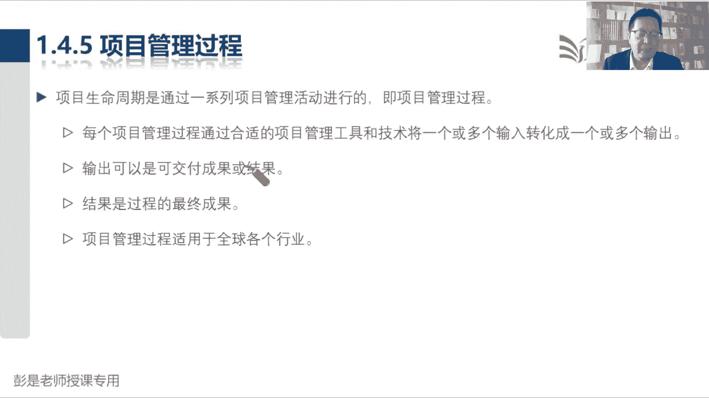

什么过程啊，输入啊，输出啊，想看就看，不想看可以不看了。

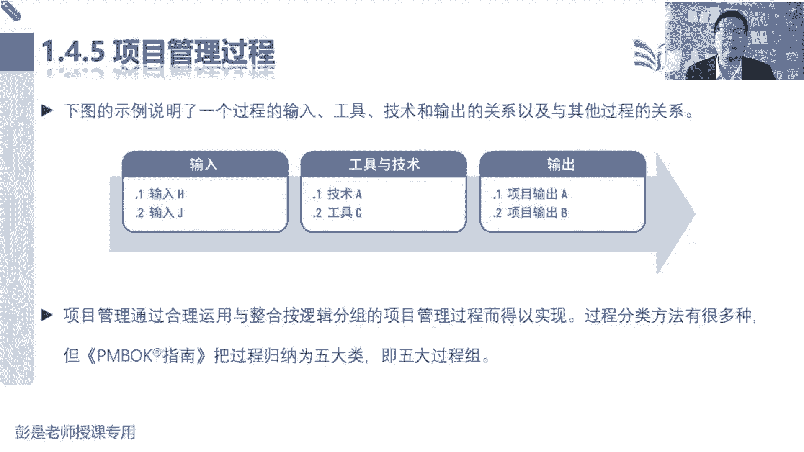

那再往下五大过程组，这是没得商量的啊，146说呀，我们项目管理过程组，是对项目管理过程进行的逻辑分组，来实现特定的项目目标过程组过程组，这又是个什么东西呢，这是前面反复说的，我们有49个管理过程。

这49个管理过程啊，我们需要它有条理，这个条例是什么呢，它的根叫PDCAPDCA是什么东西啊。

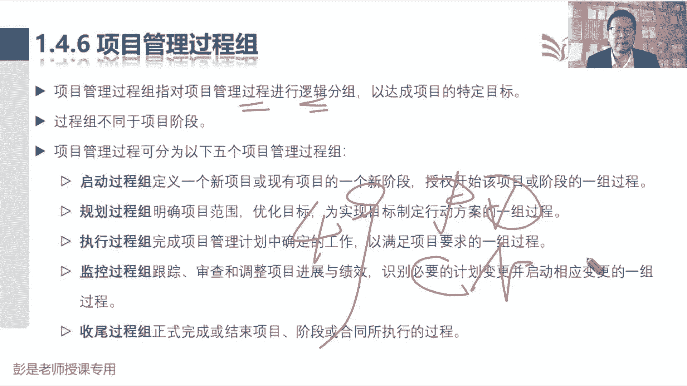

有知道的同学吗，什么是PDCA呢。

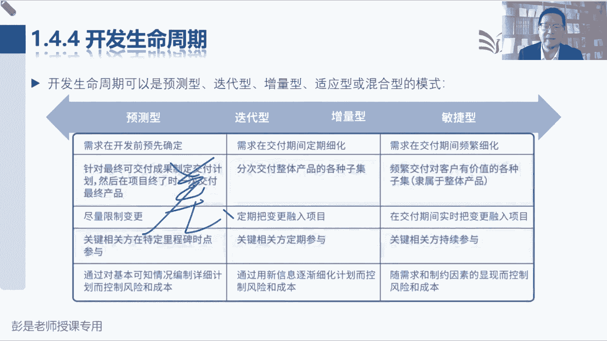

戴明环哈，好非常棒啊，不知道的同学没关系，PDCA是一个大道至简的道理，他非常非常通用啊，他是告诉我们呀，它是告诉我们什么呢，做一些事情的时候都peach的什么plan，要有规划，规划好了之后呢。

就按照你的规划去执行，这是do90度执行执行执行执行的好与不好呢，执行的好与不好呢，就要去检查，不是那个什么，看看这事干得怎么样，然后看看这事干的怎么样，发现一些差距啊，缺陷啊，不足啊，要怎么办呢。

改进，所以pd c a p DC a就是持续改进，持续改进，一个pd c a接着另一个pd c a，大家就这个底层的东西，其实工作中生活中都在用，上一次去哪儿玩儿，订酒店，先规划一下行程。

这不是PLA规划完了行程啊，该卖就卖，该买机票，买机票，该订酒店，订酒店，订酒店，然后执行的过程中发现一些差距偏差不足，上次订酒店的时候没有货比三家，没有看差评，那我们就得到了一个经验教训。

想办法下次订酒店的时候去改进，对不对，那你淘宝上买东西还是这个东西吧，做计划执行，看看东西买的好不好，再去分析反思，总结经验教训，下次买东西货比三家，看一看差评，以此类推。

他是万事万物都适用的一个通用的道理，通用的道理啊，这就是PDCA那PDCA回到五大过程组，回到五大过程组啊，看PPT转型，听了争取一遍过，现在我们知道从项目开始到项目结束，我们需要把这些工作。

根据工作性质把它分成N个阶段，比如说我们那个餐厅装修，牛肉面馆装修啊，我们找设计院给我们做装修，装修工作的规划和设计，规划设计完成之后呢，我们需要找施工队给我们来给我们来铺地板，刷墙做施工。

施工完了之后呢，我们找几个保洁的大姐，保洁的阿姨给我们做保洁，然后呢打扫打扫干净，这个装修好的房子就交到我们手里了，这是根据工作性质把它分成了三个阶段，那第一个小问题，第一个小问题啊。

设计工作要想开始说我们哪天开始设计，哪天开始设计这个工作，这个事情要想开始需不需要得到授权呢，就像各位同学，你在日常工作中，你要出差，需不需要得到授权，财务想给你发工资，需不需要得到授权。

你想和甲方去签合同，需不需要得到授权，都一样吧，你想请假，领导批准了才能才能休假呢，这不是授权吗，嘿嘿授权无处不在，那我们开始一个阶段就需要得到领导的授权，对不对，批准了以后，我们才开始这个阶段的工作。

那以此类推了，实施的时候，施工的时候也需要授权，能不能开始做保洁呢，仍然需要得到授权诶，所以这是授权，那得到授权，我们开始这个阶段的工作之后啊，设计工作要不要做计划呢，需要吧，张三什么时候画什么图纸。

李四你来负责画什么图纸，什么时候画效果图，什么时候大家来碰撞，什么时候什么时候给甲方看一看，来做审批需要啊，需要有工作的规划，对不对，这是PDC了吧，做完了计划之后，按照计划去落实，去执行。

在执行的过程中，再去看看大家工作做得好与不好，张三你这活两天了，加快点进度啊，李斯啊，你这个活儿做的不对啊，图纸画错了，王五王五以此类推，监督大家工作的进展，所以有了计划执行监控，这是PDC。

那最后设计阶段工作做完了之后要做什么事呢，需不需要把你的什么图纸啊这些东西啊，交给施工方啊，需要把这些文档啊，资料啊，你公司要不要归档呢，要不要总结一下这个阶段的工作，工作做得好不好。

总结一下经验教训呢，需要啊，所以呢最后我们又加了一个收尾过程中，他就干这个事情，总结归档移交，把当前阶段的工作做好做好，做好善后工作，该归档的，该存档的存档，该移交的移交，总结经验教训对吧好。

所以启动规划执行监控，收尾就带出来五大过程组，就这个东西再看一遍啊，我们从项目开始到项目结束，可以把它分成N个阶段，A呀，B呀，C呀，在每个阶段开始的时候，开始的时候都需要得到授权，所以有了启动过程组。

每个阶段的工作都需要规划执行监控，这个阶段工作做完了之后啊，都要做收尾，那到了第二个阶段，仍然需要五大过程组启动规划执行监控收尾，到了第三个阶段还需要启动规划执行监控收尾，这就是项目管理工作的生命周期。

它是按照管理工作的启动规划，执行监控收尾，这个过程组去梳理我们这些管理过程的。

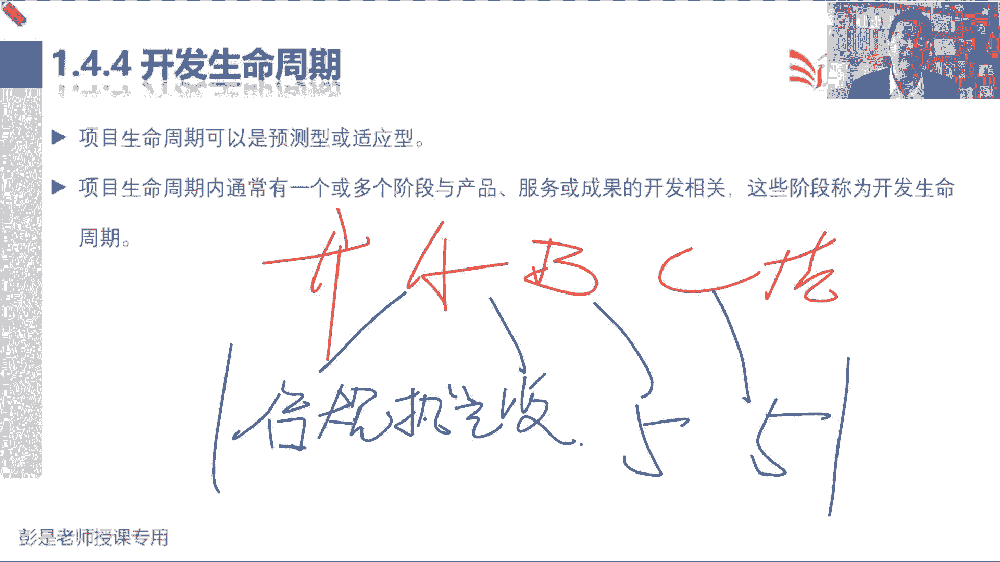

这个听懂了之后，后面这段文字就没什么东西了。

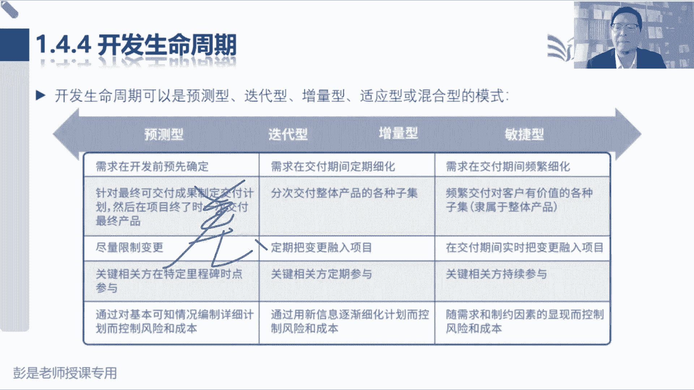

翻到1。4。6，说项目管理过程组，五大过程组是对管理过程进行的逻辑分组，他的逻辑是什么呢，这根就是PDCA，再加上善始善终，善始善终，启动过程组做授权，收尾过程组打扫战场好，所以过程组不同于项目阶段。

莫妮卡同学回答了处事不惊同学的问题，就是我现在画五角星的这句话，过程组不和生命周期阶段不是一回事，在项目生命周期的每个阶段都需要五大过程组，都要得到授权，都要做规划，做执行，做监控，做收尾。

下一个阶段仍然有五大过程组，以此类推，所以它不是一回事啊，好再往下，那五大过程组做什么事情呢，刚才我们知道了五个单词，启动规划，执行监控收尾，在此基础之上再加一个单词，下班了，启动授权授权。

开始项目或者是项目的阶段，能理解吧，项目开始需要得到授权，项目的A阶段，B阶段，C阶段，这些阶段的开始都需要得到授权，授权，无处不在的，第二规划呢就是为实现这个阶段的目标，制定行动方案，纯粹的字面意思。

执行呢就是按照计划去干活，得到结果监控，它有两个关键词，一个叫绩效，一个叫绩效，这次需要解释吗，什么叫什么，什么叫绩效，什么叫绩效啊，啥叫绩效啊，大家工作里边有没有什么KPIOKR啊，绩效考核呀。

绩效考核吧，原计划今天我要搬500块砖头，拧100个螺丝，实际上实际上搬了400块砖头，拧了300个螺丝，比原计划完成的工作少，这不就是绩效嘛，对不对，好今天我要包200个饺子。

结果呢包完的饺子啊都破了一组，全都破皮了，这不是质量出问题了吗，这就是技巧，看看我们的理想和实际情况是不是有偏差，对不对，所以他其实最后啊就是情况就这两个字，所以监控项目工作就是跟踪审查和调整。

项目进展和绩效，第二件事情是什么呢，管变更，这也不需要解释吧，处理好各种各样的变化，因为计划没有变化快呀，工作中子人生十有八九不如意啊，可能会出现各种各样的变化，对不对，原计划张三今天搬100块砖头。

实际上搬了50块，比原计划完成的工作少，明天需要继续搬砖呐，或者是晚上加班加点啊，这不都是变更吗，所以监控过程组两个关键词，一个叫管绩效，一个叫管变更，最后呢收尾过程组没什么东西。

就是结束项目或者是结束项目阶段对吧，过程看五大过程组，六个关键词，启动授权，这需要单独记规划，执行，纯粹的字面意思监控了两个字，绩效和变更收尾呢纯粹的字面意思。

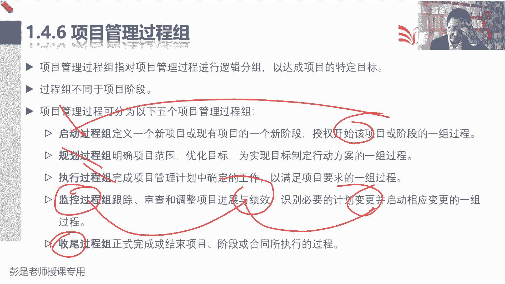

好再往下了嗯，后面这一段文字啊，147大家现在可以不看了，因为我们后面马上马上要讲的，就是十大知识领域，可以不看了啊，十大知识领域怎么学呢，也很好记啊，很好记，我们知道了项目的目标通常多快好省范围。

进度，成本质量作为我们评价项目成功的标准，在此基础之上又带出来六大制约因素，就有了资源管理和风险管理，资源指的就是团队成员和干活需要的物资，唉就是这两个东西变成了六大制约因素，在此基础之上啊，再加一个。

我们还要管客户呢，客户又不是团队成员，对不对，所以加上一个干系人管理，包括客户啊，用户啊，领导啊，供应商啊，全都算干系人呐，对不对，包括什么政府部门项目及经理，项目组合经理，你能想到的人啊。

把他全都扔进去啊，加了一个干系人管理，那有人的地方就需要和这些人干嘛呢沟通，所以加了一个沟通管理，最后呢不是所有的事情都是我们自己去完成的，大家干活需要买东西，就有了采购管理，就有了采购管理对吧。

你房租租房子，这不是要采购吗，买水买电，办公用品，包括人员招聘，对不对，包括人力外包，不是人员招聘，人力外包，这不都是采购吗，诶再加一个采购管理，这就一共共共同构成了九个子知识领域。

九个子知九个子知识领域，在上面盖个帽子，为什么呢，因为啊我们是个集体，不能各扫门前雪，不能只关注范围，不考虑其他因素，不可能不能只关注沟通，不考虑其他因素，我们牵一发动全身，所以需要有人去统筹，去协调。

去组织，去运筹帷幄，就这盖个帽子就是整合管理。

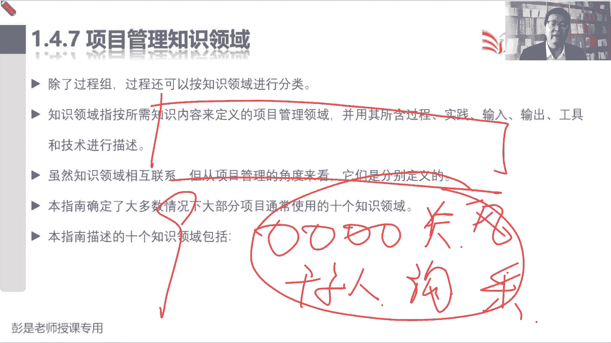

共同就构成了十个知识领域，所以后面我们讲到十大知识领域的时候，各位同学啊，你就粗暴地带场景，那咱就是黄历，我们就干整合，下面呢有九个大臣，九个大臣帮你管范围，管进度，管成本，管质量，还就干这个事啊。

我们需要统筹协调，让大家让大家众志成城，万众一心，相互协作，帮助我们更好地实现目标，得到期望的结果，这先听一听后面那十个知识领域，你会听吐了的好，这里不用看了啊，然后后面这个结论啊。

大家结合实际工作中也很好理解吧，说某些项目可能需要一个或者多个，其他的知识领域，书上写的十个知识领域啊，只是通常来说涉及到这十个东西，那结合实际工作，可能在此基础之上需要增加一些东西。

比如说这很好理解啊，财务管理，安全管理，健康管理不难理解吧，包括环境管理，现在关注的就是钱钱，社会影响，环境影响嘿，那我们在此基础之上，可能会增加一些其他的知识领域，但现在教材里面写出来的。

只是通常大多数项目所涉及到的知识领域，咱们要考虑每个项目的独特性，去增减，去调整，去裁剪，好再往下了啊。

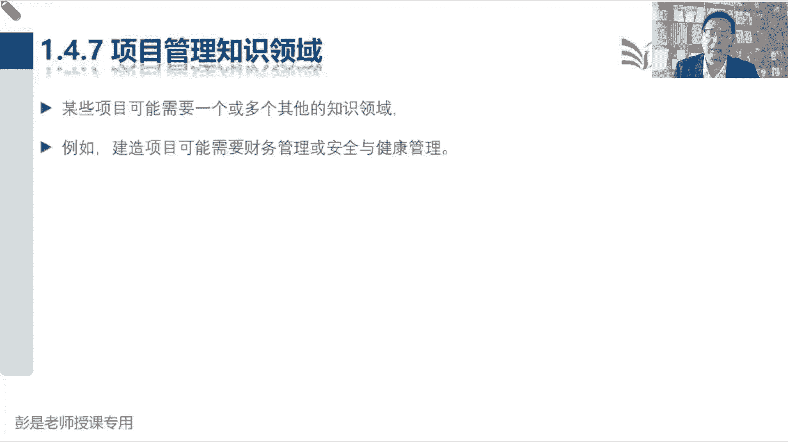

那现在这张图就是反复刚才给大家说的。

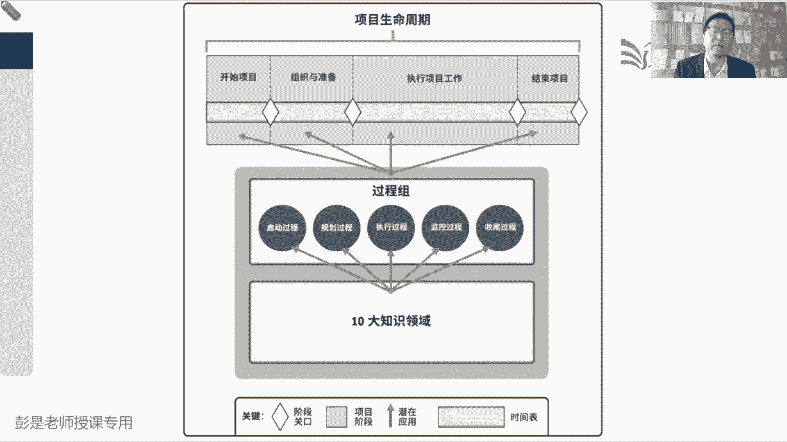

那个大的框架的结构再说一遍啊，项目开始之前，需求评估，商业论证，效益计划的制定，然后呢咱作为项目经理啊，咱是项目的皇帝啊，咱就是完成任务，实现目标，得到期望的结果，项目结果呢我们可能需要把它移交给运营。

因为有些项目，有些项目可能和运营具有这种关联关系，那在项目过程中，我们要根据项目的情况把它分成N个阶段，每个阶段有每个阶段的工作工作工作特点对吧，设计呀，施工啊，开发啊，编码啊，以此类推，为了稳妥起见。

阶段和阶段之间我们放了个菱形的小方块，这叫阶段关口，阶段关口干嘛呢，继续去分析项目是否还有可行性，是否还有价值，做决策，决定是否进入下一个阶段，如果没价值，如果不赚钱，咱就止损。

这个阶段关口帮助我们规避风险，那在每个阶段之中，在每个阶段之中，这个阶段要想开始，需要通过启动过程组得到授权，这个阶段啊需要做这个阶段的工作计划，这是规划过程组，这个阶段呢需要按照计划去执行。

就有了执行过程组，这个阶段工作做得怎么样，需要监督和控制管绩效管变更，最后呢这个阶段完成之后啊，我们要总结归档一交，就有了收尾过程组，所以在项目生命周期的每个阶段之中，都有五大过程组，十大知识领域。

49个管理过程，每个阶段都有五大过程组，十大知识领域49个管理过程。

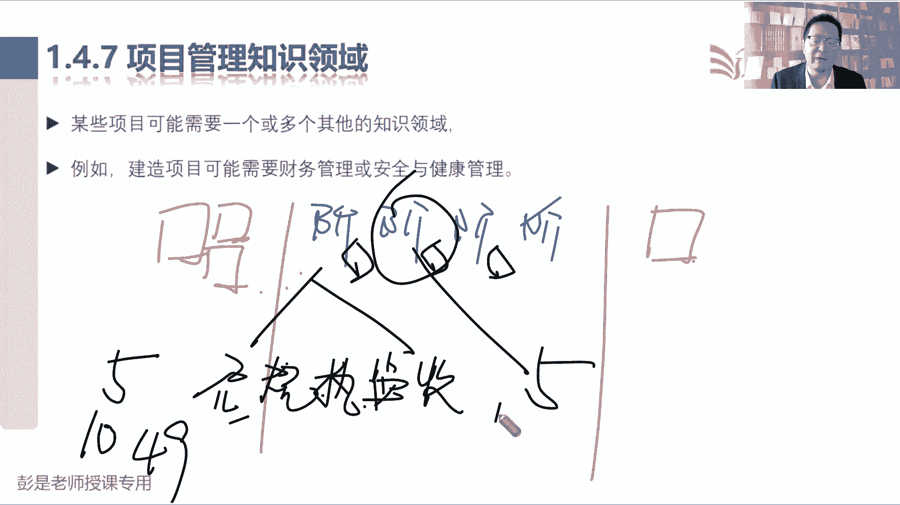

就是这张图的这个结构，然后上面这个阶段呢他就列列了四个，我们还记得把共性的阶段，具体工作中的阶段划分，取决于工作的实际情况。

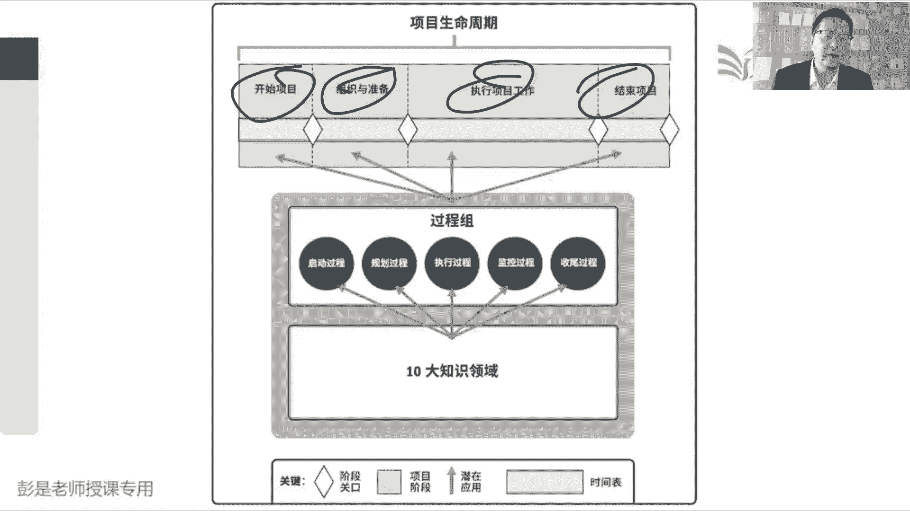

要把这个层级关系能够从上往下推一推出来啊，好148，148呀又带出来项目的绩效绩效。

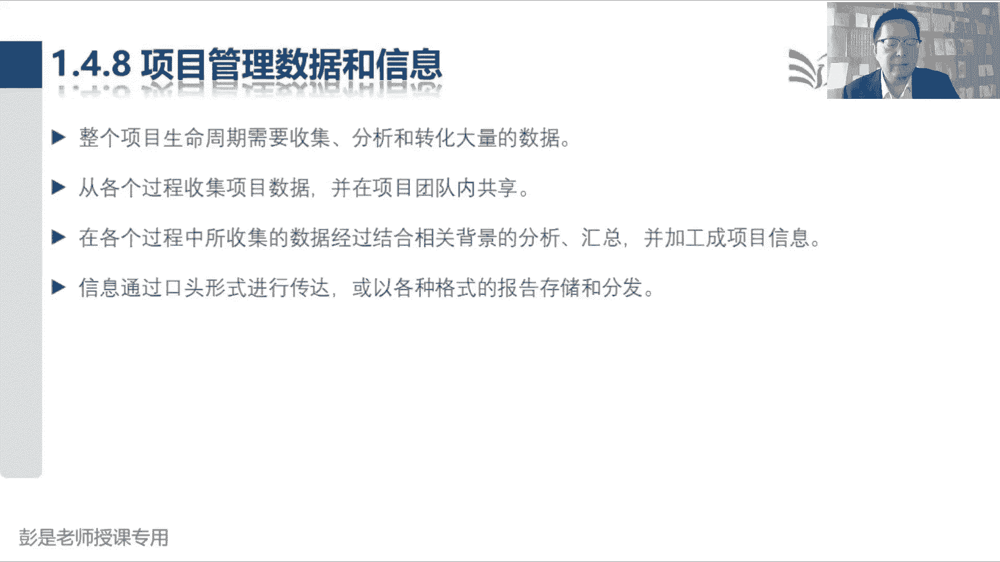

涉及到绩效管理的这三个单词，三个术语叫工作绩效数据，工作绩效信息和工作绩效报告，这三个玩意儿也超简单。

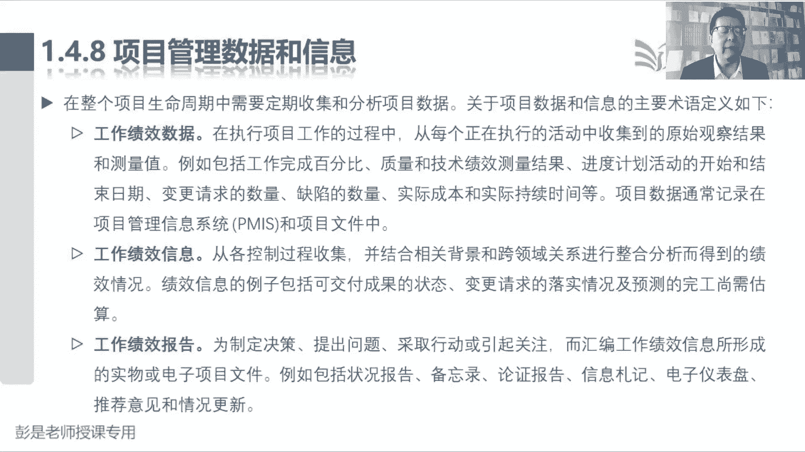

就是大家经常犯的错误，就是记不住绩效数据，绩效信息和绩效报告，他这个逻辑关系啊，大家生活工作里面都上班了吧，不上班的同学参考你学校啊，道理都一样啊，参考组织架构啊，这是老板，我们牛肉面馆啊。

下面有三个部门，有厨师，有服务员，有管钱的厨师，服务员，管钱的厨师，下面有张三李四王五赵六，服务员下面有张三李四王五赵六，以此类推，那大家实际工作中每天写的什么东西呢，不知道各位同学。

每天工作中需不需要写一些东西啊，汇报一下今天的工作情况，张三要写一个工作日志，第四要写工作日志对吧，就是日报吧，哎就这东西咱先写一写啊，日报日报就体现我们每个员工在做什么事情，每个员工在做什么事情吧。

今天工作完成了什么事，完成了什么事情，工作中效率质量怎么样，有没有遇到什么问题啊，困扰啊，阻碍啊，那接下来再带出来的问题啊，所有员工的日志是直接交给老板吗，还是说我们需要部门经理。

部门经理你要做一个汇总，变成部门的日报，怎么做比较好呢，哎这是上一级领导吧，我现在画的架构，特地中间有了一个部门经理啊，逐级汇报吧，逐级汇总啊，所以呢我们需要把员工的日志变成部门的日志，变成部门的日报。

这样呢就能够体现出这个部门的工作情况，那接下来我们把部门的各个部门的工作情况，交给老板，老板再来汇总，就可以得到整个公司的工作情况了，就要就这样层级层级层级这样一个层级关系，从员工到部门到公司。

那接下来我们换一个场景带到项目上，还是这个逻辑，刚才特意说了啊，我们高高在上，项目经理主要工作就是整合，我们下面有九个大臣，有人管范围，有人管进度，油管成本，油管质量管，资源管，沟通管，看系人管风险管。

采购管相关方预测推我们下面有九个大神，九个大神啊，这不就是九个部门经理吗，那每天大家工作中到底干了什么事，花了多少钱，对不对，就得到了最底层的叫什么来着，叫员工叫员工啊，那对包到项目上。

最底层的最底层的每天具体干了什么事情，花了多少钱，做了多少沟通，采购了什么东西，这都叫最底层的，最底层的最原始的就称之为工作绩效数据，最底层的就称之为工作绩效数据，这个绩效数据不直接交给项目经理。

我们需要把这个玩意儿啊，交给各个各个部门的负责人，粗暴理解就是交给九个大神吧，九个大神干什么事呢，把这个原始的数据经过他们的分析和评估，变成各个部门的工作情况，所以呢他分析的结果就是范围的绩效情况。

进度的绩效情况，成本的绩效情况，质量的绩效情况，以此类推，还就得到了各个部门的绩效情况，各个部门的绩效情况，我们又给他起了个术语，叫什么呢，叫绩效信息，数据和信息的差别是什么呢，就是信息是经过了分析。

经过了总结归纳概括汇总，做了处理，就称之为信息，那拿到九个大臣的绩效信息之后，交给谁呀，交给朕，交给项目经理，交给项目经理，我们在经过我们的分析对吧，我们从更高一层啊，再去再去对整个项目做分析啊。

从而得出整个项目的工作情况，整个项目的工作情况，我们给他又起了一个高大上的术语，这叫绩效报告来汇报整个项目的情况，就包括了范围进度成本质量，资源沟通风险，采购相关方，以此类推了，这就是绩效数据。

绩效信息，绩效报告这个逻辑关系，这个逻辑关系也是共性的，共性的逻辑啊，它放到任何一个场景。

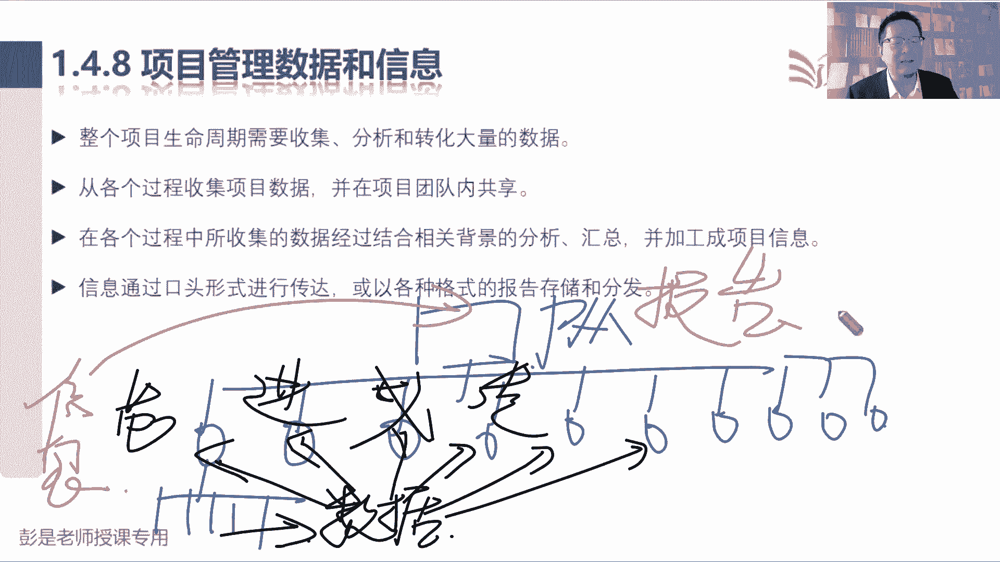

你都能听懂，比如说各位同学有没有做过体检呢，对吧，健康检查，健康检查，包括你上学的时候也做过体检吧，体检下面有各个科室，然后呢你身高体重，这叫啥呢，这叫最原始的工作绩效数据，这个聚焦数据啊交给各个科室。

他们经过分析就变成了各个科室的信息，所有的信息交给我们的总检医生，他来归纳概括总结就变成了你的健康体检报告，这个逻辑关系一模一样。

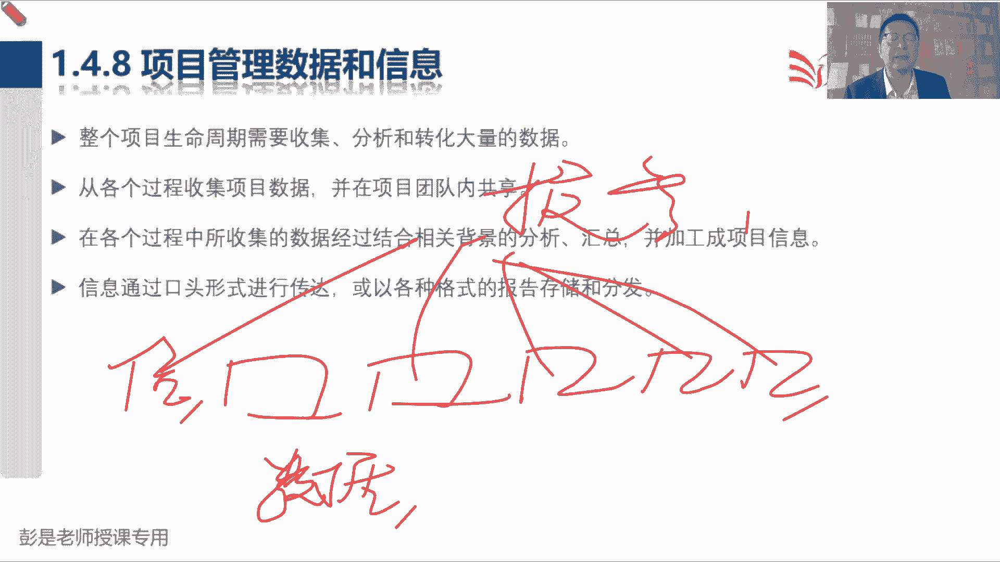

哎知道这个中心思想，后面这段文字就可以不看了，就可以不干了啊，大概这么一标完事了，工作绩效数据没有经过任何的分析，就是最原始的东西，所以叫原始的观察结果和测量值，工作绩效信息是什么呢，从各控制过程收集。

并结合相关背景和跨领域关系，经过分析而得到的绩效情况，所以粗暴理解就是，九个大臣拿到原始的工作绩效数据，变成每个知识领域的工作绩效信息，变成范围的情况，进度的情况，成本的情况，质量的情况。

还就有了九个知识领域的工作技巧，拿到九个知识领域的工作绩效，全都扔给项目经理，我们对整个项目做总结归纳概括分析评估，最后就得到整个项目的工作绩效报告，这就是这三个数，这三个单词他这个层层递进的。

层层汇报的这种逻辑关系，好知道这个意思啊，嗯这套信息就包括了进度的绩效信息，成本的绩效进度关注的是什么呢，提前还是落后，成本关注的是什么呢，超市还是节约了范围的绩效，关注的是什么呢。

是不是该干的活都干了，质量的关注的是什么呢，是不是缺陷太多了，以此类推了吧，哎所以范围进度成本质量，九个子知识领域都会得到这条信息，范围的进度的成本的质量的，资源的沟通的风险和采购的相关方的都有啊。

得到这个知识领域的计效信息之后，全都交给项目经理，我们出一份计划报告，PH同学后面这个问题太细了，等我们学到政治分析再说，因为某些情况下需要跨领域，需要跨领域去分析啊。

就是政治分析这个知识点等后面再再说了，政治分析是跨什么呢，跨范围，跨经度，跨成本，把这三个领域结合到一起去综合分析好，先先抛开这个小小复杂的知识点哈。

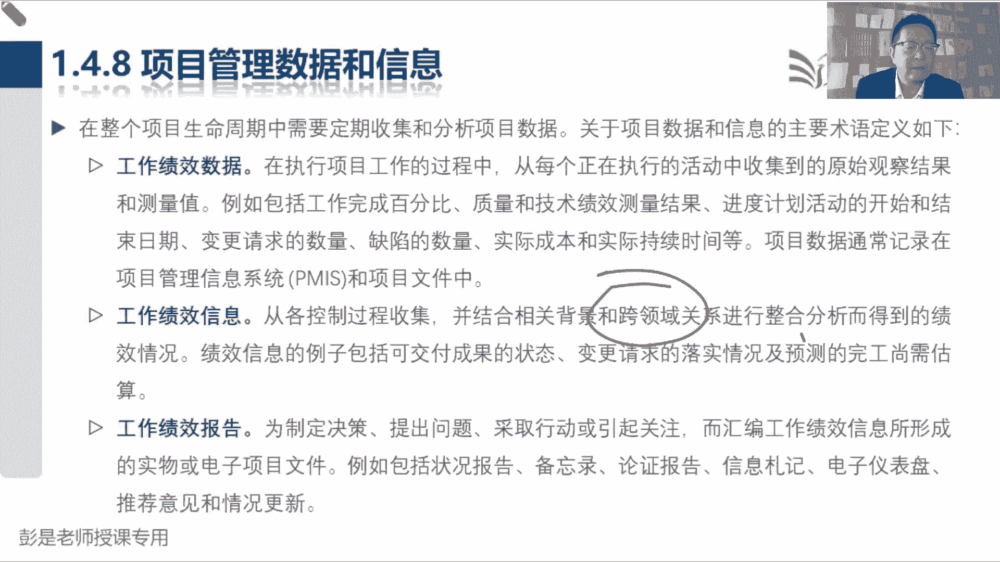

那这一章的随堂练习，咱们今天呢就不做了，下次上课呢先带着大家做做前面这一段知识点，教，包括什么生命周期啊，节能划分啊，开发方法呀，过程组啊，知识领域呀，绩效书记教习题要做做这些章节练习题。

相当于文故而知新，看看大家记还能记，还能记到多少，然后下课之前，能不能简单介绍一下发的五本书啊，大家目前发的五本书啊是啥，其实我记不住啊，其实我记不住的啊，但是我现在能猜，咱手里应该有一个叫通关宝典的。

通关宝典，应该还有一个叫练习题，还有一个叫模考题，还有一个叫综合练习题，对不对，有章节练习题，也就是课后练习题，有模拟考试练习题，还有综合练习题，今天下课给大家留的作业是什么呢，这些题呀不着急。

时机不到，串讲串讲其实是预习用的啊，那个可以不看了，串讲可以不看了，好时机不到，时机不到，所以今天下课之后啊，大家什么课后练习题呀，模拟考试题呀，综合练习呀都不要做，这些题什么时候做呢。

看班主任在微信群里发的通知，看班主任在微信群里发的公告，班主任让干啥咱就干啥，咱唯一要做的就是听话，就是听话啊，班主任让咱干啥，咱就干啥，那今天课后的作业是什么呢，就把今天讲过的内容看书就够了。

诶就是看书再去看看视频，课后课后班主任会发通知的，说我们把今天的课程整合到平台上了，大家可以去看视频了，诶就是听课看书听课看书就可以了，题不着急呢啊不着急，打好基础，循序渐进循序渐进啊，好各位同学听课。

辛苦了一天，辛苦了啊，好5543210，各位同学，大家早上好，上次课讲到了1。4。8，工作计算数据及到题信息技巧报告，然后呢，接下来做做这一小段练习题，看看大家还记得什么东西吗，啊忘完了，先画个小三角。

企业目标愿景使命价值观，然后告诉我们是一家什么样的企业，what接下来去思考如何实现这个宏图大业呢，就是好做企业的战略规划选择，我们走什么样的路去实现这个目标，达到这个愿景，走什么样的路。

就决定我们在路上需要做什么事情，有两类，一类事情啊，把它完成就可以了，它具有独特性，临时性，渐进明细的特点，就称之为项目，还有一种事情呢，需要企业呀定期的持续的重复的去开展的工作，就称之为企业的运营。

对每天大家每个月都要给大家发工资，还运营，每天修完了高速公路，看看这个路上打扫打扫卫生运营，持续的重复的定期的开展的工作，然后呢又会发现呢，有一些事情之间存在着关联关系。

依赖关系A的结果可能影响到B这种情况下，我们需要把它俩统一的协调一下，所以呢就有了项目及这种管理方法，关注的是怎么想办法，1+1大于二，获得一些额外的收益，最后啊又去分析。

在不同时期我们要做的事都有很多事情了，那这些事情我们精兵强将派到哪个事情上去呢，诶在哪个事情上投入更多的资源和资金呢，怎么合理的分配人财物呢，所以呢就有了项目组合管理，更关注的是把这些事情啊。

和我们战略相匹配的东西放到一个圈圈里，然后呢排排序，以便于合理的安排人财物，想办法炒钢用在刀刃上，所以项目组合更关注的是做什么事情，对企业来说能够帮助我们更好地实现宏图大业，项目集项目管理。

运营管理更关注的是how，我们怎么把这个项目管好，怎么把这个运营管好，怎么把这个项目集给他协调好，组织好诶，关注的是方法，最核心的就是这一小段内容嗯，好那介绍数据介绍信息介绍报告是什么东西呢。

这是员工部门整个公司诶，从个体到一堆人到所有人，就这个逻辑关系吧，我们到底干了什么事，这叫原始的工作绩效数据，这些事情干干的怎么样呢，哎范围进度成本质量对不对，资源知识管的到位不到位呢。

所以呢就有就有了九个知识领域的工作，绩效信息，范围的进度的成本的质量呢，以此类推了那九个知识领域的绩效信息啊，我们需要整合汇总一个整个项目的情况，所以呢就有了项目工作绩效报告这个术语嗯，好，接下来啊。

说建议把这本通关宝典裁剪成几本薄的吗，以前以前听过课的同学，应该呃第六版还建议大家去撕书，那宝典要不要裁呢，个人建议啊，想裁就裁，不想裁也可以不裁了，这种太大的东西才能把它变成一大堆小东西。

可以降低心理压力，所以呢其其实可以按照第一部分，第二部分，第三部分，第四部分把它撕开，第一部分呢就是基本概念这一段，第二部分呢就是就是基于过程的项目管理方法，五大过程组，十大知识领域，49个管理过程。

一直到项目的相关方管理这一部分，第三部分呢叫多边的项目管理，就是敏捷的知识点，单独写一个小本本，最后呢就是第七版，第七版那个知识嗯，想猜就猜，不想猜可以不猜了啊。

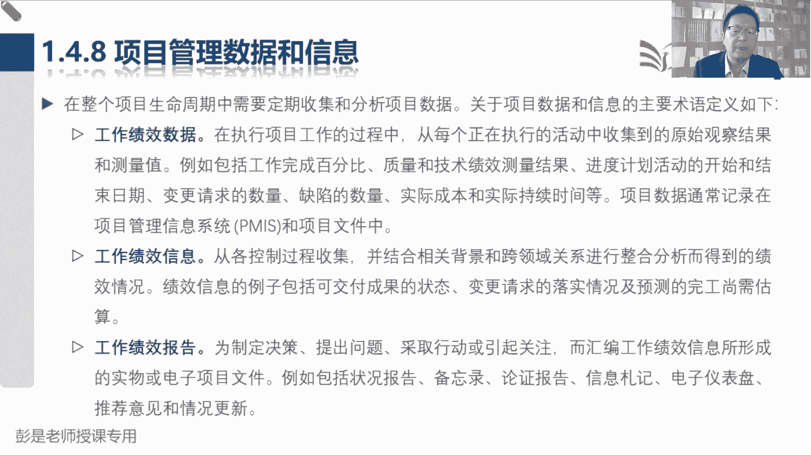

好接下来做做这一小段练习题，检查一下学习成果。

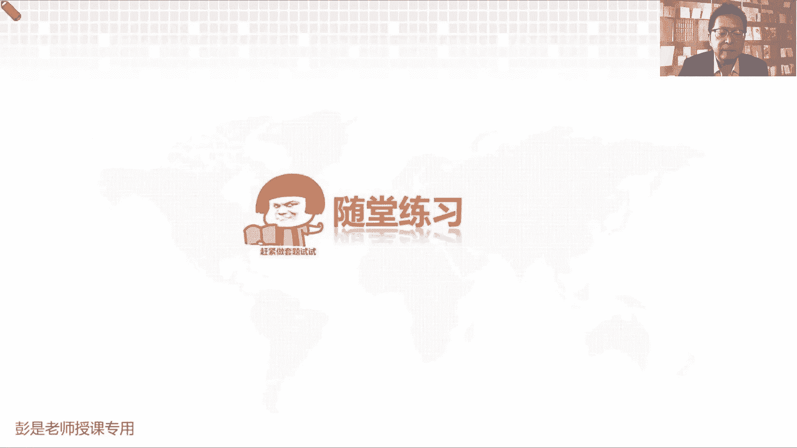

这几个术语还有印象吗，项目生命周期，项目管理生命周期和产品生命周期，ABCD都全了，找一个正确的选项，哪一个相对来说更靠谱呢，好准备了，买定离手啊，54321A选项说项目变化和发展时。

项目生命周期通常随之变化，一定要记住，项目生命周期是说从项目开始到项目结束，我们要根据工作性质的特点，把它分成很多个阶段，这个项目的生命周期它取决于工作性质，对不对，想想我们那个开个餐厅，我们要装修。

装修完了打扫卫生，装修之前要设计一下诶，这这都是基于工作性质，我们把它分成了N个阶段，这条项目的生命周期，什么是项目管理的生命周期呢，在每个阶段之中，我们都要对他完成管理工作，那管理工作按照他的逻辑。

我们需要PDC加善始善终，就有了五大过程组，启动规划，执行监控收尾，在项目生命周期的每个阶段都有五大过程组啊，哎这叫项目管理的生命周期，产品的生命周期是什么呢，就像咱研发产品什么设计一款新的手机呀。

把手机给他制造出来呀，然后投投入市场，引入市场，然后呢买手机的人越来越多，我们这个手机啊哎就进入到上升期，成熟期指的是产品从生到死这一系列阶段，知道了这三个基本概念再去判断，应该就能找到选项了。

A选项说项目变化的时候，项目生命周期通常随之发展和变化不一定啊，这有可能不一定，对不对，像装修的时候改改需求，不一定会导致我整个生命周期的阶段发生变化，所以A不一定啊，B选项说。

项目管理生命周期对于每个项目都是独特的，这话不能这么说呀，管理生命周期指的是五大过程组，启动规划执行监控收尾，这玩意儿是共性的，不管你是什么类型的项目，不管是项目的某一个阶段，都有这五大过程组。

对其中得到授权规划做计划执行，按照计划去干活监控，看绩效管变更，首尾呢就是做好善后总结，归档移交，做好这种做好打扫战场这个这样的事情啊，所以他是共性的，那B选项就不对，C选项说项目管理生命周期。

就是项目生命周期不对，项目生命周期指的是从开始到结束，所经历的一系列阶段，管理生命周期指的是五大过程组，项目生命周期每个阶段都有五大过程组啊，他俩不是一回事，那他俩这话怎么说才对啊。

项目生命周期和项目管理生命周期，他俩的时间是一样的，共存亡，也就是说只要项目还存在，我们就需要对项目完成管理工作，对不对，不能不管不顾啊，所以他俩在时间上是一样的周期，长时间长度是一样的好。

所以C也不对，那相对来说比较合适的就是D了，虽然也不一定，典型的产品生命周期包含多个项目，像产品的研发啊，产品的宣传推广，做广告，找明星代言，拍广告片，拍宣传片，这不都是项目吗，产品的升级更新诶。

这都是项目，所以产品生命周期是指从产品没有产品，一直到把产品推向市场，到产品退出市场所经历的一系列阶段，它里面可能会包括多个项目，相对来说比较合适了，好绕口令一样啊，A选项说这个玩意儿项目变化。

项目生命周期通常随之发展和变化，不一定不一定再回顾一下项目生命中，什么叫阶段，说项目发生变化，阶段就一定会变吗，不一定吧，今天早上我迟到一下，迟到一下，这个生命周期阶段就随之发生变化吗。

不一定不一定不一定就这个逻辑嗯，好再往下拉啊，第二道题，在每个阶段开始的时候进行，启动过程怎么样呢，这个比较简单吧，能想到什么知识点呢，那个术语叫啥来着，说在每个阶段启动开始的时候进行启动。

启动的作用是什么呢，授权，授权授权开始项目或者是项目中的某个阶段，那A选项说是一种资源浪费，这不对啊，B选项说，有助于确保项目符合其预定的业务需要，并验证项目成功标准，看完B啊。

就能想到他是对照那个术语叫阶段关口，我们需要在阶段之间放一个菱形的小方块，阶段关口啊，在阶段关关口我们要做决策，决定是不是继续往下走，对那决策的依据是什么呢，就是分析项目还有没有可行性啊，继续往下走。

还赚钱不赚钱呢，有没有价值啊，所以阶段关口去判断项目是否还有可行性，是否还有商业价值，如果两个条件都具备，那我们就会得到授权，开始第二个阶段，以此类推的话，C选项有助于确保项目按原计划进行。

这肯定是不对的，对不对，肯定是不对的啊，得到授权等，确保按原计划进行吗，不是这不是一回事啊，D选项说有利于确定每个阶段所需要的，团队成员的种类数量，技能水平不对，启动过程组不是来完成估算的对吧。

估算一下完成这个阶段需要多少人，哪需要这些这些人有什么样的专业知识啊，不是这个事，到了规划过程中去分析完成当前这个阶段规划，不是做计划吗，计划计划计划就包括资源的计划，所以呢比较合适的答案就是B了。

考的是阶段关口，这个知识点生命周期是说从开始到结束，把它分成N个阶段，有A阶段，B阶段，C阶段，每个阶段开始的时候，我们需要得到授权，授权的来源主要取决于什么呢，就是这种阶段关口的审批评审来分析。

来分析项目是不是还有可行性，是不是还有价值，拐了个小弯吧，好了，不要焦虑啊，这是那个阶段关口，这个知识点不要焦虑，做题做错很正常很正常，对，没有人知道所有的知识点，所以有问题有问题继续对。

有质疑有疑惑啊，继续发继续发，不要慌不要慌，好重要的是什么呢，听完讲解之后能想到知识点，对不对，好再往下了啊，项目生命周期的哪个阶段，具有最大的风险和不确定性，罗宾同学应该是应该是基于工作经验在判断哪。

根据知识点去判断，对想到那条交叉线，想到那条交叉线的项目越早越早，这种不确定的程度越高，项目越早，这种不确定的程度越高，对不对，然后选C的同学应该是记到那个知识点了，通常在执行阶段。

我们投入的人力和成本是最大的，它不是一回事啊，所以呢答案是A越早越好，概念计划编制实施收尾，在项目早期，这种不确定的程度最高啊，概念阶段就是先有概念再有计划，对不对。

get翻译的这个单词确实是容易容易误会啊，先有概念再有计划，把概念就是我们要做什么呀，定项目的目标，我们要做什么事，对不对，好再往下了啊，所以背后的知识点一定要记住那个交叉线。

交叉线早早早期不确定的程度最大，但是呢这种风险一旦发生造成的影响小，为啥呢，成本低到了项目后期，这种不确定的程度在降低，但是风险一旦发生变成问题造成的影响就大了，为啥呢，因为成本高了。

这个交叉线一定把它印在脑子里啊，好多看书是不是需要不断的巩固，再往下了这道题呢，这个简单了吧，好，A肯定不能选，那刚讲完的关于项目阶段的说法，正确的是A选项，说项目阶段就是项目管理过程组。

这不对不是一回事，对不对，项目生命周期，我们要把它从开始到结束分成N个阶段，到底分成几个呢，具体情况具体分析啊，大型复杂项目可能阶段就多，小事呢阶段就少，但是在每个阶段之中都有五大过程组。

所以他俩不是一回事，B选项说一个阶段的结束，通常包括核准下一个阶段的开始，这肯定不能选的，对不对，能不能开始下一个阶段，我们需要有这么一个决策点，需要有这样一个决策的机制诶，就是阶段网关口。

在阶段关口我们分析项目还有没有可行性，还有没有价值，对对经过经过大家评审之后，再来给项目经理做授权，开始下一个阶段，所以B不对，C在可交付成果被确认符合技术要求后，就可以结束该项目阶段，这可不一定啊。

基础要求把话说窄了，对不对，所以呢C不一定，D项目阶段结束涉及到可交付成果的交接，这是对的吧，要把每个阶段的成果移交到下一个阶段，所以呢最正确的答案就是D，比如说我们那个牛肉面馆，我们要完成设计图纸。

画图纸，画完图纸，我们这个阶段的主要可交付成果不就是图纸吗，然后接下来准备施工了，按照图纸去干活啊，凿墙铺地板刷墙，那这需要把当前A阶段的可修复成果，就是图纸移交给下一个阶段，好记住啊。

收尾的时候是总结总结经验教训归档，把这些文件存档，最后呢最重要的一件事情就是移交，B再解释一下阶段关口，刚讲完呢，各位同学专心专心专心啊，不要让咱在这些讲过的知识点上反复讲，反复讲，这就没价值了。

好阶段之间放一个菱形的小方块，这个知识点还记得吗，这叫阶段关口，阶段结束不代表着就可以自动开始，下一个阶段需要得到授权了，在粗暴理解你买完火车票，买完火车票还有检票呢，对不对，检票人家让你减。

你才能得到授权去上车呀，不代表车买完火车票就可以直接上车了，它是两回事，这叫授权，好再往下了啊，以下哪一项是对适应型生命周期的正式解释，阶段关口不包括在阶段之中，它是一个独立的事件，独立的事件。

独立的事件，重要的事说三遍，想想一想你上节课见过的这张图，如果这张图印象不深，接下来就需要做什么事情呢，今天讲完课之后再去回顾之前的课程，看教材，看教材啊，对于这个知识点还有质疑的同学，还有疑问的同学。

就是说明可能没复习了，对不对，咱就不倒车了，好这道题是什么呢，这道题有的有的知识点，细节性的知识点还没讲到啊，所以大家是允许做的，适应性适应性上节课大概说了啊，我们需求如果明确。

通常就用预测性的方法12345去干活了，所以呢又被称为瀑布型的，前一个阶段，把成果移交到下一个阶段，就像流水一样，像那个瀑布一样，那如果需求不确定对吧，说做什么事，不知道我们还这么顽固的顽固的往后走。

就可能遇到很多很多问题啊，那怎么办呢，为了稳妥起见，我们就不断的不断的少做一点，然后来获得获得对方的反馈，所以呢正确的答案是C，又称敏捷方法，我们确定什么最优先交互，然后每次迭代结束的时候进行客户审查。

现在有个印象就够了，其他选项不对，咱在敏捷环境之中，时间和资源相对固定，它是范围需求不确定，A选项肯定不能选啊，充分了解你交付的产品，充分了解产品就可以做到一次交付，所以呢就是预测性的方法。

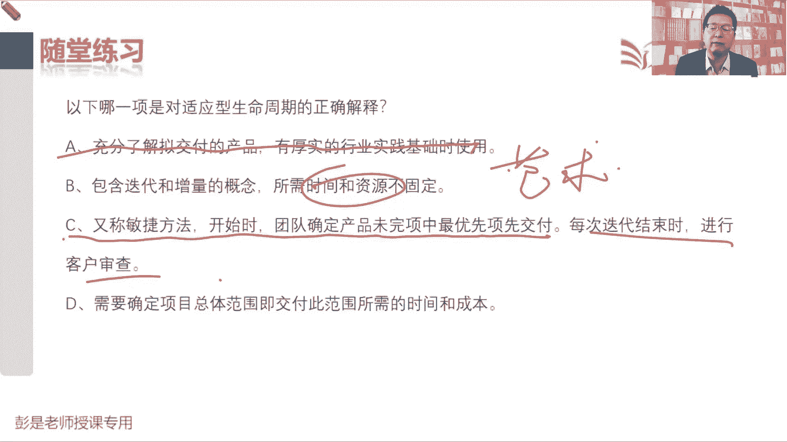

好这道题，这道题选啥呢，换一个54321说，项目经理准备再运作一个软件项目，这个项目准备分阶段交付，他计划将资源划分为两个不同的团队，来同时完成这两个阶段的工作，他提倡的是什么呢，叫并行吧。

同时开展同时开展，不过主要一个高级成员建议使用一种敏捷方法，这个建议得到了他的认可，也就是说现在有人提倡提倡用敏捷的方法，于是呢就同意了，同意的意思是什么呢，并行这种这种这种就被推翻了。

然后问以下哪种关系，可以最准确的描述这个项目，各个阶段之间的关系，那敏捷的根就是不断的循环加增量，循环加增量，它就叫迭代增量，所以呢答案是B没有C这个阶段关系啊，A顺序关系是什么呢。

是串行重叠关系是并行，所以这道题再说敏捷，敏捷就是迭代加增量，这个数也要记住，好再往下了啊，看看以下各项都是项目管理过程组，除了什么了，这是送分题啊，五大过程组在生命周期的每一个阶段之中。

这个阶段不得做一下计划吗，这是规划，按照计划去执行，就有了执行过程组，执行的好与不好，管理变更就有了监控过程组，然后呢我们需要启动过程组得到授权，收尾过程组呢总结经验教训归档，做好阶段成果的移交。

所以没有可行性研究，对不对，所以恭喜大家答对了，答案就是A这题考试不可能考好，启动过程组旨在获得授权，以便于什么呢，送人头的题啊，在项目生命周期中可以有多个阶段，在每个阶段开始的时候。

都需要通过启动过程组得到授权，没有授权就没有办法开始这个阶段的工作，所以呢恭喜大家答对了，答案就是A，好再往下了，这道题想一想，23333，这道题选什么呢，成本风险。

说一个项目经理和承包商之间发生一点问题，他不确定承包商是否遵照合同，哪个知识领域中的过程，最适合帮助他解决这个问题，这种玩意儿啊，大家一定要这么去想场景啊，我们是项目经理，高高在上，负责整合。

我们下面有九个大臣，有人管范围，有人管进度，有人管成本，有人管质量，有人管资源，有人管风险，有人管采购，有人掌管干系人，有人管沟通，那接下来不确定承包商是否遵照合同，先找哪个大臣核实情况呢。

先找哪个大臣负责核实情况呢，九个知识领域，先开展哪个知识领域的管理工作呢，那就C了吧，这就简单了吧，诶采购找负责管理采购的同事，去确定一下承包商有没有遵照合同，所以是C千万不要想当然啊。

说不确定承包商是否遵照合同沟通沟通，这么一想就错了，对不对，千万不要这么想，说，不确定不确定这种这三个词一爆出来就是风险，那我们开展风险管理不对不对啊，就是找负责采购的同事。

先确认一下承包商有没有遵照合同呢，对不对，确认具体情况是什么，然后再去分析下一步应该采取什么样的措施，就这样去想问题好，再看这道题呢，好这道题应该问题不大了啊，说了好几遍了。

所以啊您正在进行一个大型项目，然后积分这项目分成以下阶段，可行性概念设计原型和构建，您希望将过程组与不同的阶段一起使用，推荐的方法是什么呢，在每个阶段之中都有五大过程组，在每个阶段之中都有五大过程组。

所以答案是B，还在选A的同学，这个知识点还没给你唤醒吗，五大过程组是什么，启动规划，执行监控，首尾为每A选项，每为每个阶段分配一个过程组，那你就想吧，规划的时候是做计划，那我们这五个阶段。

每个阶段哪个阶段做计划呢都有吧，概念性要不要做计划呢，设计工作要不要做计划呢，原型工这个阶段要不要做计划呢，构建这个阶段要不要做计划呢，都要做计划呀，所以这个知识点，这个知识点每个阶段都有五大过程组。

他是个非常重要的结论，每个阶段都有记知识，记结论吧，记结论啊，没有那个知识点，所有的鸡蛋不是没有五个过程组吗，都有都有都有，你就想想人生上节课讲了，这一定要复习，不复习，过两天就忘了你。

人生每个阶段是不是都要有计划呢，对小学阶段，中学阶段，大学阶段上班，包括嘎了都要有计划呀，对不对，嘎了以后还有计划的，对不对，怎么善后啊，都有啊，这些管理工作是和生命周期的，每个阶段如影如影相随的啊。

好知道这个意思。

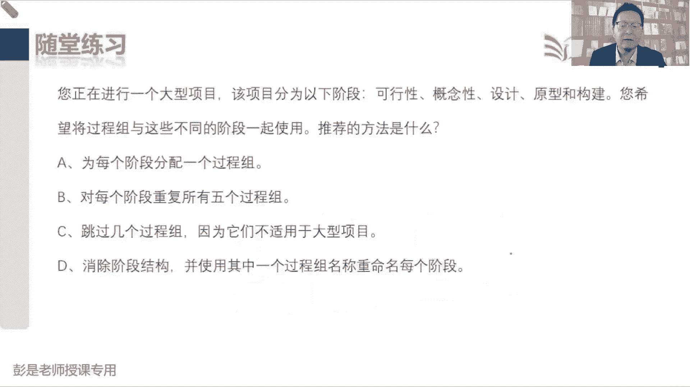

这结论这就是关于1。4项目关键组成部分，生命周期阶段划分这些东西啊，这些知识点，然后还不太熟的同学，就这个事情，包括下周你们你们的学长下周就要考试了，现在有同学基本概念还不知道。

你说这个通过的可能性大不大呢，就很愁人了，所以大家千万千万千万不要，不要把这个事想得太简单了，对不对，千万不要把CPMP这个事情想的太容易，千万不要因为大家正常第一反应都是都是这个，这是正常的啊。

一听全明白，自己一上手就懵了，不知道怎么回事了，为什么呢，为什么一听全明白呢，因为老师讲的好，做个广告确实是这样给你讲的，明明白明明白白清清楚楚的，很有条理，但是呢听明白不代表不代表自己就学会了。

这完全是两回事了，我看我看人家打那个打那个游戏比赛哇，那冠军我一看人家打的也没啥嘛对吧，这躲着藏，开一枪就把敌人噶了，这很简单啊，但是你自己玩两把试试，哪有这么容易啊，对不对，所以一定要上手。

一定要自己去参与，多训练，怎么训练呢，还是该听的这个课呀，至少两到三遍，然后呢只听课，不看书也不行，还要通过阅读，第一看看检查对知识的掌握情况，第二呢通过阅读加深巩固对这些知识点的印象，概念越熟悉。

读题就越快，判断的解，判断的就越准，就这个逻辑啊，所以之前的课，之前的课，今天下完课之后啊，该听课听课，该看书看书，听完课看完书，今天下课应该给大家留作业了，做那个课后练习题诶。

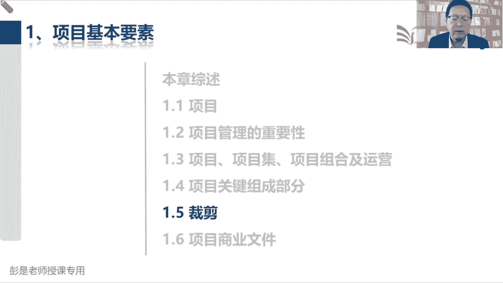