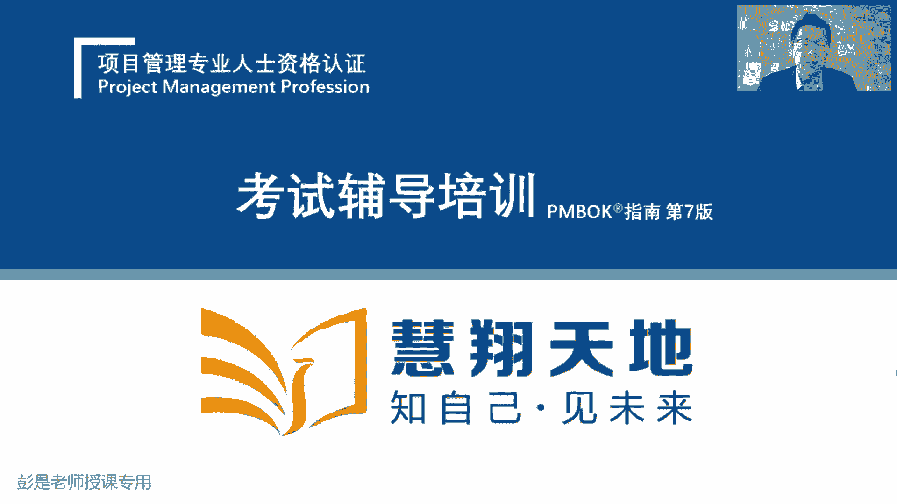
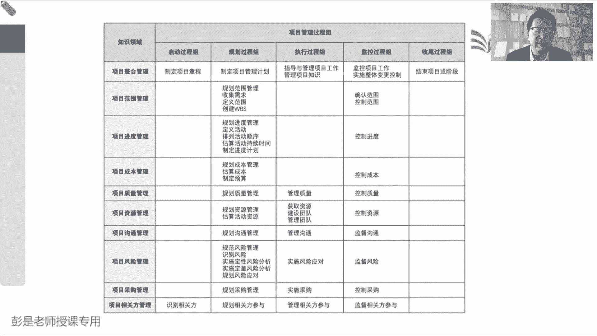
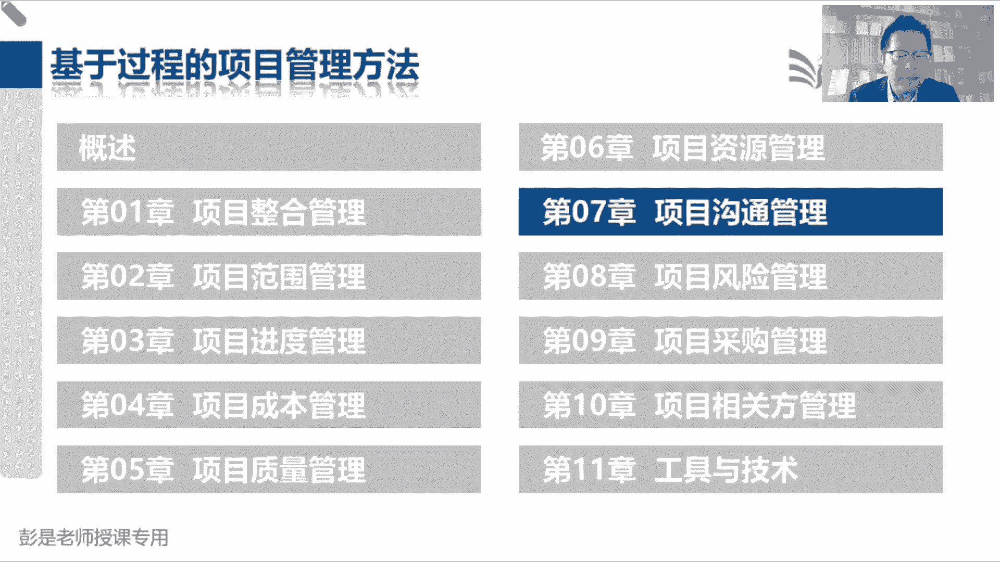
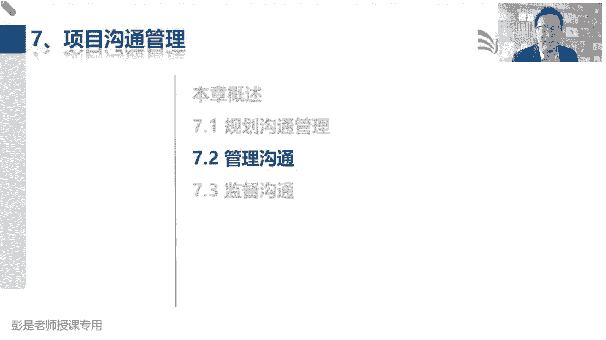

# 2024年最新版PMP考试第七版零基础一次通过项目管理认证 - P60：2.7.1 规划沟通管理 - 慧翔天地 - BV1qC411E7Mw

好早上好，各位同学们，正式开始今天上午的考试啊，6月1号考试来得及啊，还有4月14号还有45天，还有将近50天时间呢，对不对，咱教材一共500页左右，一天看十页，一天看十页，这这工作量超小的对。

努努力就一天看20篇诶，可以看两遍，再努努力，一天看个25篇，可以看三遍左右，并且大部分虽然听起来500多也挺厚啊，大部分东西看几遍看一遍看两遍差不多了，好各位同学，咱们正式开始今天上午的课程。

再快速回顾一下前面都讲了什么东西啊。

看PPT说呀，五大过程组带出来六个管理过程，然后五大过程组带出来六个六个关键词，然后就有了整合这张七个管理过程和启动，我们需要授权，所以制定项目章程，通过项目章程给项目经理做授权，标志着项目的正式开始。

章程写什么东西呢，告诉我们到底做什么事，范围进度，成本质量这些总体要求化，所以包括了目的目标，成功标准，退出标准各个方面的总体要求，说清楚项目经理是谁，说清楚发起人是谁诶，为我们指明工作前进的方向。

有了这个方向之后呢，制定项目管理计划，总分总二，项目经理先根据项目的情况去分析一下，我这个项目分成多少个阶段呢，诶就有了生命周期阶段划分，再去考虑这些阶段工作有什么特点，范围明确不明确呀。

有没有复杂性啊，技术明确不明确呀，哎呀不行的话就预测哈哈不行，不行的话就敏捷，对不对，行的话就预测对，就是生命周期阶段划分，开发方法给出总体指导，根据这些总体指导，我们大臣就知道我们这个各个知识领域。

怎么管了，所以规划范围管理，规划进度，规划成本，规划质量，规划资源，包括一会儿要抢到的规划，沟通和规划风险规划，采购规划概参与，以此类拔，根据项目经理给出的总体指导。

我们就分别完成各自知识领域的工作的规划，规划一下这些知识领域这一大堆管理过程，到底这活怎么干，就得到了各种各样的子计划，所以我们有了九个子计划，再加上单独的一些需求啊，变更啊，配置啊。

诶加上三个单独的子计划，咱就汇总汇总到一起，这一共有12个子计划，然后接下来，我们要开展一些实质性的管理工作了，所以呢收集需求定义范围，创建WBS就得到了范围基准，然后接下来根据范围基准。

我们去分析能不能按期完成了，就有了定义活动排序，估算活动持续时间和制定项目进度计划，就得到了进度基准，在思考能不能按预算完成项目工作呢，所以我们需要估算成本，然后汇总就得到了整个项目的三笔钱，成本成本。

应急储备和管理储备，把成本和应急储备就变成了项目的成本基准，三大基准搞定，那在此基础之上，我们又思考了这三个基准的，只看一个基准没什么意义，我们要去分析啊，什么时间花多少钱，干了多少事，综合的分析范围。

进度和成本基准才有价值，所以三个基准的打包到一起，就得到了绩效测量基准诶，这一大堆乱七八糟的东西准备好，全都交给项目经理，所以制定项目管理计划的收入，就包括了规划过程组这一大堆输出，项目经理在最后汇总。

就得到了整个的项目管理计划，那整个项目管理计划按照计划去干活，所以就有了指导与管理，项目工作得到可交付成果，另外呢就涉及到一个绩效的三个层级，按照计划去干活，就会得到原始的工作绩效数据。

这玩意交给监控过程组，九个九个大臣，这一大堆管理过程，这一大堆管理过程，拿着我们的原始工作绩效，绩效数据和我们的计划去做比较，看看有没有出入，有没有偏差，就得到了各个知识领域。

目前工作情况得到了绩效信息，这玩意交给项目经理，我们写报告就得到了，就变为监控项目工作的输入诶，他的输出就是工作绩效报告，这就下班了吧，然后接下来我们要为了避免知识流失，所有的管理项目知识。

让大家什么已经知识显性化，接下来梳理一下，让大家在交流沟通探讨互动，从而帮助大家学到新的知识，在学以致用，产生新的知识，源源不断持续的循环，就有了管理项目知识，它主要输出呢经验教训登记册。

更新我们的组织过程资产，然后到了监控过程组，监控项目工作就有用那一大堆分析系统，什么偏差，分析趋势，分析根本原因，分析备选方案分析，想办法想办法评估项目的情况，然后再去分析是否需要采取措施。

采取什么样的措施，预防啊，纠正啊，什么缺陷补救啊，噼里啪啦一大堆诶，那实施整体变更控制呢，主打一个就是对变更做综合分析，然后做决策，所以他需要拿到所有的变更请求，然后做正式的记录，然后综合的分析和评估。

最后在做决策来决定是否批准否决或推迟变更，然后呢最后更新以及通知肝协，所以批准的变更请求，作为指导与管理项目工作的输入，要及时的通知团队，团队计划有调整，另外呢批准的外观请求还缺了控制质量。

因为我们要检查它的落实执行情况，诶这就下班了，最后呢结束项目或阶段，就不得不提到非常重要的可交付成果的数据流，指导与管理项目工作，按照计划去干活，就会得到可交付成果，这个玩意儿最最踏实的方法就是。

我们现在内部做指控，我们团团队对成果做检查，做测试，看看这些东西能不能去验收，如果检查测试通过的，就会得到核实的成果，这玩意儿再去确认范围做验收，验收通过，再把验收的成果交给结束项目或阶段。

我们负责完成最终产品服务成果的移交，所以结束项目或阶段的主要工作就是总结，然后归档，然后移交A所以它的输出就包括了总结，就是报告被归档，就是组织过人资产的更新，移交就是最终产品服务成果的移交，搞定好。

整合搞定之后，范围搞定之后，进度也搞定了，成本也搞定了，矢量里面就不得不提到质量的五种水平，最差的是直接去验收，好一点的是我们先做内部做指控，再好一点的是我们找一个人做质保，对不对。

拿着核对单审计审计审计过程的合规性，过程合规了，那么结果呢可能就会更好，所以管理质量关注是过程是否合规，过程还能不能进行持续的改进，就不得不提到两个重要的工具，一个叫审计，一个叫过程改进方法。

就是PDCA和6C格码这种东西，所以管理质量三件事，质量保证过程改进，还有最后一个就是D3X产品设计哎，都放到这个管理过程里面去了，这是他非常有代表性的工具，还有主要工作事项，那这只是第三个水平啊。

第二个水平是什么呢，就是好的质量都是规划设计出来的，所以规划质量的时候，我们要考虑组织的质量政策，然后选定我们相关的标准，再确定我们具体需要达到什么样的指标，以及相应的测试方法。

便于未来我们衡量和评价项目的质量情况，所以它会输出质量管理计划，包括了标准和质量测量指标，最后呢就是把这套东西让所有人都掌握，这个大道理，变成一种全员质量意识，变成质量文化，嘿这就是质量的最高等级。

这一章那个五个等级一定要记住，就便于我们推理这些管理过程，为什么存在这样这样的逻辑关系，那到了资源管理，规划资源管理干什么事呢，就是啊中心思想，资源这一章中心思想就两句话，人尽其才，物尽其用不浪费。

所以规划资源管理就有了，就有了很多实质性的内容，人尽其才，那我们要看看保安负责干什么，张三张三会武术干保安去对吧，李四李四擦桌子擦的干净干保洁诶，那我们就需要画三个东西了，第一大家分大家的组织结构。

把我们的员工分成多少个小组啊，谁和谁是领导啊，谁是员工啊，上下级汇报关系啊，给他梳理清楚，另外呢是画一个表格，说清楚分工，张三保安负责守守北门，李四保安负责守南门，王五保洁负责擦玻璃，以此类推。

便于便于防止三个和尚没水喝这种问题的出现，说清楚大家的职责，最后呢再写一个文本，说清楚每个岗位你的职责权限，这个文本就像大家比如说你去找找工作，找工作你不得搜一搜嘛，人家招项目经理。

你看看项目经理的主要实则是啥，对不对，需要具备什么样的条件，需要具备什么样的能力水平，以以此类推吧，就跟那个东西差不多的，哎咱就把人尽其职安排的差不多了，剩下的事呢就考虑啊给hr干的那些事啊。

哎呀我们公司配几个保安呐，配几个保保洁呀，人员配备管理，然后呢，这些人你怎么招聘啊，怎么培训啊，怎么团建呢，怎么奖励呀，怎么惩罚呀，怎么辞退呀，把这些东西都给他说清楚，那人尽其才，下班了。

接下来就是物尽其用，所以就涉及到物资管理的这些常规，常规的方法吧，就像家里边什么什么东西放冰箱，什么东西放冷冻，什么东西放冷藏，什么东西放在什么地方啊，那企业来说，我们工作中用到的设备设施资源耗品呃。

你也不能随便扔，随便放，也不能随便拿，有的东西借了还要还的，所以就是物资的这一大套管理，包括库存管理呀，什么介入啊，还借呀还呐，把这些规矩大概说一说，这是规划资源管理最重要的一些东西。

除此之外呢还要定一个什么呢规则，所以就涉及到了团队章程，定规矩，干活不能没规矩，坐地铁有规矩，坐公交车有规矩，坐飞机有规矩不能吸烟，坐火车有规矩不能吸烟，所以最重要的考点就是。

一定要把什么样的行为可以接受，什么样的行为不能接受说清楚，哎，这涉及到基本规则，下班了，那估算活动资源管理过程，这个管理过程，其实我们在进入的时候就提到了吧，并且大家不知道有没有复习过哈。

把这个过程和这三个过程三合一，因为资源会影响到时间，因为资源会影响到成本，因为时间会影响到成本，他擦擦牵一发动全身，并且呢它的输入输出工具技术，看起来基本上差不多什么类比啊，参数啊。

三点估算的专家判断的也差不多了，所以这三个管理过程把它合到一起，基本上意思是差不多的啊搞定，然后最重要的呢就是资源这一章，在执行国争主这一大堆多里吧嗦的东西了，就是获取资源，按照我们的进度计划。

根据我们的资源需求，把需要的资源拿到手，五一打算出去玩，今天该买票了，就叫获取资源吧，诶那物资呢就叫分配这个这个这个酒店订的，这个房间归张总，这个火车票归李总，这个飞机票归王总，物资叫分配人呢。

叫工作安排，对张三负责保安，李四负责保洁，所以他会输出一个叫分配单，一个叫派派工单，把资源拿到手，拿到手之后呢，接下来建设团队和管理团队主要就是管人，建设团队打鸡血，想办法提高团队的士气。

一切是为了团队绩效服务的，诶，他的输入输出工具基础，没什么有代表性的东西啊，都好猜的东西，然后管理团队主要工作重心是什么呢，问题和冲突，因为问题每天都会出现的，对不对，今天张三情绪不好。

明天李四态度不对了，后天王五违法乱纪，再再后天发现赵六能力不行，水平不行，解决的是人各种各样的问题，还有呢人之间各种各样的冲突，张三和李四观点不一致，李四看不上张三，张三讨厌王五，王五报答赵六。

以此类推，解决人之间各种各样的冲突，这就是建设团队管理团队，最后呢控制资源主打一个管物资这一章下班了，然后接下来上节课我们大概讲到了风险和采购，那风险管理内容超多了啊，但其实呢学到最后发现也没那么多。

那规划风险管理最重要的是什么呢，定规则啊，什么风险，什么是什么风险是高风险，什么风险是低风险，咱得把这个东西说清楚，所以找到干系人，了解大家的风险态度，风险偏好，把这种主观的偏好变成客观的临界值。

临界值在分级档就得到了，概率和影响等级的定义，定义清楚什么是高风险，什么风险是中风险，什么样的风险才是低风险，然后呢把这张图把这张表变个形，就得到了概率和影响矩阵，在深色地区的就是高，在中点。

浅色地区的就是中，以此类推，这是规划风险管理最重要的工作了，然后接下来就是识别风险，那就是不得不提到一堆概念，一个叫单一风险，一个叫整体风险，单一风险就是会影响到范围进度，成本质量资源，以此类推。

还影响到项目目标的某一个具体的风险，整体风险呢就包括了所有单个风险，汇总总体情况，那单一风险就叫登记册，整体风险就叫报告，接下来咱就围绕着这两个文档，开展一系列的风险管理工作。

定性风险分析是找到单个风险，分析它的概率影响，然后看看他的，看看他的优先级对不对，看看他的优先级对风险做排序，所以他要评估每个风险的概率啊，影响啊，看看这个风险的优先级呀，再考虑到一些其他的风险特点。

来对风险的优先级做调整，从而得到一个更靠谱的排序结果，定量风险分析呢就是对整体项目做量化分析，看看整个项目工期到底能在什么时间，有多大的把握能完成，看看整个项目的成本能够在多少钱完成。

项目工作有多大的把握，这个把握不就是可能性吗，就是对整体项目做这种可能性的量化分，析和评估，然后接下来规划风险应对，就是纯粹的这么意思了，规划应对措施，并且威胁啊，机会啊，有不同的策略。

然后接下来就是主打一个强调的是落实和执行，所以实施风险应对其实没有什么特点，就是晓之以理，动之以情，让大家不要失去风险意识，让大家要把这个思想转化为行动，坚定不移地落实和执行我们规划的应对措施。

才能够有效的去管理风险，最后呢监督风险，就是看看状态有没有发生变化呀，应对措施好使不好使啊，干这个事儿，那到了采购这一章就这么三板斧，看看买啥东西，然后找供应商签合同，最后呢看看供应商买的东西怎么样。

所以规划管理，规划采购管理是通过自制外购分析，形成自制外购决策，一旦决定需要外部采购了，需要写一大堆文档，什么招标文件，采购工作说明书，官方选择标准，独立成本估算。

写这些文档的目的是交给我们负责采购的同事，他好知道到底买什么东西，他好知道到底怎么买，他知道到底怎么评价供应商，他好知道到底你预算是多少吧，然后负责采购的同时就开展实施采购，就从招标投标评标找中标人。

然后谈判签合同，按照这个逻辑，他就把那些工具呀输入输出啊，噼里啪啦一顿用，最后和人家签合同签合同，签了合同之后呢，控制采购的同事开始干活，看看什么呢，就监督检查供应商的执行情况，履约情况。

看看人家发货了没，有发到的货是不是都符合你的要求啊，对人家的工作和成果进行检查，进行验收，前后两厅之后呢，交交易就关闭了，然后他单独的一个需要重点，印象深一点的就是一个叫索赔管理的东西，对不对。

当然还有什么争议啊，纠纷啊，诉求啊，咋整啊，谈判找人调解，实在不行，打官司，嘿控制采购下班了，那接下来今天我们讲什么呢，沟通管理和干系人管理这两章，后面的包括大家复习的时候。

其实也可以看的非常非常非常快，因为它超好理解，大部分都是字面意思，规划沟通就是想一想咋沟通，就是想一想咋沟通对吧，你们公司有了通知怎么发呀，是让老板站办公室喊一嗓子，还是说给大家发邮件。

还是咱拉个微信群，还是说咱用钉钉，还是说咱纸质的东西打印出来贴墙上，以此类推，就想一想，包括开会，对不对，因为沟通的本质是什么呢，叫传递信息，就想一想你项目中工作中各种场景啊，这些信息怎么传递啊。

用嘴说打电话，发微信，发邮件，开会一次类推，就想一想这些信息如何去传递，出一个沟通的管理计划，告诉我们未来如果这些信息怎么传，告诉我们未来这些信息如何传递，那管理沟通呢就是按照计划去执行，沟通。

去进行沟通，该发邮件了，该发邮件了，汇报今天的工作情况，微信群里面汇报今天的工作情况，今天上午开例会，今天晚上开例会，以此类推，按照计划去落实和执行沟通，该开会开会，该写周报写周报，该该发周报，发周报。

该写日报写日报，以此类推，他就是落实和执行，所以他没有什么需要去记的东西，监督沟通呢就是看看沟通有没有问题呗对吧，每天早上九点钟开例会，发现那大家早上九点钟一上班啊，萎靡不振对吧，精神颓废。

没有热情没有热情，你好，我们调整一下，改成十点钟开例会，这样呢让大家九点钟上班，先适应一下，适应一下，调整一下情绪，对不对，然后呢快速的进入工作状态，工作状态达到达到一定水平了，我们再组织大家开会。

这样的可能效率高，效果好，他就是看看我们沟通有没有问题，来对沟通进行优化，进行改进，结果这个事儿啊，发现我们项目组啊，大家拉到微信群太多了，这个群说这个事儿，那个群说这个事儿，导致信息满天飞呀。

咱能不能改成一个群呢，以此类推法对于沟通进行优化，所以这一章学起来可以超快，然后呢干型管理这一章呢其实也没什么东西，学起来也可以超快的，他最重头戏就是前两个管理过程，一个叫识别相关方，识别干系。

一个叫规划干型，参与识别干型的主要作为作为工作是什么呢，就是看看谁是干洗呗，看看我们这个项目涉及到哪些人，哪些人能够影响项目，哪些人受到项目的影响，哪些人自认为受到项目的影响，然后呢我们去分析啊。

这些人呐都要重点管理吗，好像不对，领导啊肯定是重要的人，像普通员工啊，可能还好像边边角角的什么保安保洁厨师啊，可能相对来说重要程度又低了一下，所以他的中心思想是什么呢，找到干系人，然后考虑人分369等。

需要对肝肾的重要性做排序，这就是识别干系人最重要的工作，找人找人之后排序，那排序的依据是什么呢，对不对，不能随便拍脑袋呀，说张三最重要，李四不重要，那你凭什么这么说，所以它中间关键的一步就叫干性的分析。

就是打标签，就是打标签，张三张三，我们开了个餐餐厅，张三是土豪啊，这重要客户重要客户对吧，李四是屌丝啊，这一般客户，王五每天早上每天来我们餐厅就吃一碗牛肉面，这是屌丝，还普通客户，以此类推。

是哪些人是VIP，哪些人是普通用户，这不是排序吗，所以它主要就是分析我们相关方的权利作用，影响利益，兴趣爱好，方方面面，打标签，记住用户画像，做用户画像一个东西啊，对相关方做完了分析之后。

我们就根据分析的结果可以想想方法，对他做排序了，分清楚这些人的重要性和优先级，然后规划肝型人参与最重要的工作是什么呢，知道了人分369等之后，有些事情啊不得领导参与一下吗，对有些事情啊领导要知情啊。

不能不知情啊，有些人有些事情吧，有些事情啊，诶看看领导的态度，他到底是支持你呀还是反对你呀，反对你的人怎么和他沟通呢，支持你的人怎么和他交流呢，以此类推，他主要是分析干型对我们项目的态度，就是参与度。

然后定策略来想办法引导干系人，最好最好最理想的模式就是都支持我项诶，这是规划干系人参与，但是后两个管理过程呢基本上就没啥可说的了，一个在执行过程中，就是和大家天天做的事情一样的啊，和张三沟通一下。

和李四沟通一下，看看王总还有没有什么什么需求啊，期望啊，想法呀，看看周六你工作上有什么问题呀，以此类推，他着重于去处理干系人的干系人的什么问题啊，冲突啊，变更啊，所以理论上来说，原则上来说。

或者是大道理上来说，他和他和我和管理团队差不多，但是管理团队管的是咱自己人，对不对，所以管理干系人参与管的，更倾向于外人这种东西啊，最后呢监督干行监督相关方参与这个管理过程，主打一个啥。

就是看态度有没有发生变化，王总反对我，王总反对反对这个项目，那我和王总经过了沟通，经过了交流之后呢，看看王总的态度有没有发生变化，如果没有发生变化，可明可能说明我们之前定的这个套路。

之前定的这个策略不好使，需要想办法换一个套路，所以在粗暴理解一版，比如说我这地方在拆迁，这主公啊，这不是反对我的人吗，那我定了套路，定了个套路啊，先晓之以理，动之以情，结果发现呢天天劝，天天劝。

就是不听，那可能说明我这个策略不好使，再换一个黑社会的策略，能听懂吧，对不对，天天给你加个什么，泼雪墙上写个沙字，然后雇一帮黑社会呀，天天凶神恶煞的在你家门口啊，吓唬你啊，诶测这些策略的目的是什么呢。

传递信息呀，传递信息呀，对不对，不支持我就没有好下场诶，所以根据这个策略，我们再看看他们的态度有没有发生变化，是不是慢慢的从反对变成了支持，以此类推，这就是干型管理最重要的，这么一套东西啊，识别。

然后规划参与定策略，然后解决问题，处理冲突，最后呢看看态度有没有发生变化，好大概花了20分钟，大概花了20分钟给大家回顾一下之前的东西，然后呢带入今天要讲的东西，最后呢今天讲完这两章之后呢。

再给大家串工具，基础，粗暴理解啊，你实际工作中实际工作中对吧，虽然不一定那么敏感，但或多或少会涉及到威逼利诱这样的套路吧，张三好好干活，不好好干活，辞退你，这不是吓唬人嘛，对不对。

理论上来说和和黑社会的手段差不多，只不过是物理攻击和魔法攻击的区别啊，今天会把攻击技术讲完吗，会的会的好，那接下来咱开始开始了啊，承上启下搞定，接下来我们讲沟通管理。

沟通管理其实已经讲完了，其实已经讲完了好。

所以沟通刚才说过，沟通的本质就是信息的传递，就像咱们班主任怎么给大家发开课通知诶，我们要规划一下吧，对不能说今天上课800天前，通在群里面通知一下打架，800天前在群里面通知一下大家。

然后再也没有通知了，这不对不科学，不合理思考一下对吧，可能要昨天提醒一下，今天上课之前20分钟再提醒一下，今天上课之前一分钟再提醒你一下，这就是规划沟通管理吧，看看什么时间我们用什么样的方式。

用什么样的技术，用什么样的手段，把这些信息呀通过什么样的渠道传递给谁，传递给谁，包括班主任给大家发那种报名的时候，你们看吧，私信发邮件群公告，想方设法的把信息传达给咱们的人呐，为什么用这么多的渠道呢。

就是因为大家可能没有反馈，对不对，就是因为可能有些同学可能平时忙看不看剧，平时忙不看私信，平时忙不看邮件，甚至要打电话，唉他才给你反馈了，就是无所不用其极的，想尽各种方法把信息传递给感谢好。

所以这是沟通这一章的最主要的工作啊，那再往下看具体内容，这一章的输入输出没什么需要去背的，对话沟通管理处沟通的管理计划，这是信息到底怎么传呢，刚才说过了，什么时间，用什么样的方式，通过什么样的技术。

走什么渠道传递给谁，把这些东西给它梳理清楚，那管理沟通呢就是按照计划去落实去执行，包括今天上课之前，班主任发了群公告，就是管理沟通吧，按照计划该该传递信息的时候，就把信息传递出去。

所以他就会输出项目沟通记录，因为好记性不如烂笔头啊，班主任发了，发了群群公告了吗，发了咱有记录，防止扯皮，对不对，所以包括大家开会会议纪要，这不都是沟通记录吗，就是把我们传递的信息给他存下来嗯。

所以这个单词需要记住啊，项目沟通记录其实基本上也不大会考，最后监督沟通，提交数据，计算信息变更请求，没有什么输入输出，没有什么需要去记的，这一章学完了好再往下看具体的文字描述。

所以啊项目沟通包括开发工具，用于执行以及执行，用于有效交换信息的各种活动，来确保项目及相关方，信息需求得到满足的各个过程，那项目沟通管理由两个部分组成，第一部分是制定策略，确保沟通对相关方行之有效。

第二部分是执行必要的活动来落实沟通策略，实际上就是规划沟通管理，看看大家都需要什么信息，然后呢管理沟通和监督沟通，按照我们的沟通计划去落实去执行，所以再看后面的具体文字，规划，沟通管理是说。

基于每个相关方或相关方群体的信息需求，对吧等，这我们需要班主任在上课前发群公告，那有的人不看群公告，我需要班主任给我发邮件，有的人不看电子邮件，我需要班主任给我微信里面发私信对吧，有的人不看微信。

有个需要班主任打电话通知我，总之基于大家的信息需求，基于大家的信息需求以及项目的需求，项目的需求是什么来着，实行这个事儿，我们是怎么沟通，什么会议呀，周会呀，例会呀，以此类推，这个收集需求找谁呀。

和谁沟通啊，定义范围找谁呀，和谁沟通啊，以此类推，然后呢根据这些沟通需求，为项目沟通制定合适的计划，这就规划沟通管理，然后管理沟通呢是确保信息及时的收集生成，发布存储，巴拉巴拉，最终处置的过程。

就是把信息从生到死给他照顾好，对不对，发上课通通发，上课通知，上课通知，不知道大家有没有注意过观察过这些东西啊，它包括什么内容呢，你不得收集相关的信息吗，比如说直播的链接地址是多少啊。

诶咱把这个直接直播链接地址，通过我们的其他同事获取到之后，对不对，然后呢拼成拼成咱们这个群公告的内容，这个内容就生成了吧，生成之后检查一下有没有错别字，然后呢正式的通过微信群发公告就不发布吗。

发完之后啊，发完了之后其实也不大需要存啊，其实不大需要去存的，通知类的不一定需要存档啊，但是比如说你企业里边的什么人事调动啊，上下通知啊，涨工资的通知啊，这些正式的代表官方的这种东西，是不是要存档吗。

以此类推了好，这就是按照计划去落实去执行，最后监督沟通呢就是看看沟通好还是不好，有没有什么问题，所以这一章其实输入输出啊没什么东西啊，工具基础呢也要超好理解，后面复习的时候可以看的非常非常非常快。

那接下来看这一章的核心概念，说沟通是指有意或者无意的信息交换，沟通，沟通的本质就是传递信息，那传递的信息可以包括很多种东西，包括想法呀，指示啊，情绪啊，这哎这个东西我有什么看法，我有什么见解。

我有什么观点，这是想法，可能需要和别人交流探讨指示，那就是命令张三去把这个桌子擦了，这不是命令吗，甚至包括情绪对吧，给老板汇报工作，手机项目进度落后，成本超支，质量问题一大堆，老板脸色越来越难看。

这也是在传递信息，说明他不满意，以此类推，那再往下信息交换的方法看起来挺多，这些东西都不需要记啊，12345要不要把它背下来呢，不用看到单词，你能反应过来它是什么东西，OK了，所以像书面形式对吧。

就是写写写出来的东西，包括现在大家看到的PPT，和大家拿到的纸质的讲义，这就是书面的东西吧，口头呢就是用嘴说，现在我叨叨叨叨叨叨，说了这么多东西，就是口头啊，然后正式和非正式的形式。

用正式的纸质或社交媒体就是官宣这种东西，对不对，小区发了个公告，签字盖章贴在你们家楼门口，这就是正式的吧，或者是代表企业，在我们官网上发了一个什么通知公告，唉这种东西，然后手势就不解释了吧，什么媒体。

什么图片行动遣词造句，什么都不念了啊，不知道他是什么东西就够了，那再往下说，沟通是指用各种可能的方式来发送，或者是接收信息，巴拉巴拉，这都不念了，这项目经理的主要工作就是沟通，然后呢沟通沟通。

不同的人群有不同的什么背景啊，经验啊，专业啊，观点的意思，这都没啥可解释的了，好再往下沟通活动可以按照多种维度进行分类，包括但不限于内部沟通，字面意思，外部沟通，字面意思，正式沟通，字面意思。

非正式沟通诶，稍稍留一丢丢印象，稍稍留一丢丢印象，因为看完这段这一行内容，可能会觉得啊，和我们正式工作里面的场景不太一样，目前PMI全球上来看，仍然把电子邮件，社交媒体这些东西。

认为它属于一种非正式的沟通，这个和咱实际工作中是有出入的，所以这需要记住它，考试的时候看到各种场景，看到题目，只要一旦描述电子邮件，那第一反应这一定是一个非正式的沟通方式，就要打个问号了。

是不是需要采取一些更正式的沟通方式，沟通方法呢，以此类推吧，这个和工作有出入的知识点，就需要记住他，好，再往下长期沟通，这纯粹的这个意思吧，垂直沟通就是上面可能有领导，下面可能有员工，咱在中间是中层。

这叫垂直，水平沟通呢就是平起平坐，对对张三也是经理，李四也是经理，很很好，我也是经理啊，咱都平起平坐的，这就叫水平沟通，然后再往下什么官方啊，非官方书面口头哇，见过了吧，没什么可解释的了。

官方沟通代表企业代表机构发布信息，非官方沟通就代表个人，对不对，私底下先交流交流，你看电影看电视剧不都有这种东西吗，今天咱这个会，我仅代表我个人和张总来交换一下意见，就这意思吧，好然后书面和口头。

那像这些东西都是可以传递信息的东西啊，用词语气声调变化，但有的人一着急就嗓门大了，有的人一着急就说话节奏快了，有的人一着急，这个语气就不友好了，对这种东西都在传递信息，包括肢体语言。

什么眼神都属于都属于沟通的方式啊，肢体语言对吧，就有人讲话容易喜欢用手比划说被绑架了，你就眨眨眼，如果说话言不由衷啊，就看屏幕左下角，这都在传递信息诶，所以除了声音之外，我们其他东西包括什么用词啊。

音调啊，语气呀，肢体语言啊，也可以传递信息，总之无所不用其极，知道了啊，然后再往下说，沟通可以成功完成项目，为什么那么建立必要关系的性质，这段文字没什么需要去记得了，也这为什么需要解释的了。

说我们开考虑各种各样的方式来进行沟通，包括什么语言，面部表情手势，这都不亮了，然后为了成功和项目干行进行什么时候沟通，两部分，包括制定策略，刚才见过了吧，制定策略，然后按照我们的策略。

按照我们的计划去落实去执行，所以第一部分第二部分不垫了，再往下说，在项目沟通之中，我们需要尽力预防理解错误和沟通错误，并把规划过程所规定的各种方法，发送方，接收方做出谨慎选择，为什么呢。

就是因为这种文字啊，字儿多了也不好，字少了也容易误会，所以就提出来一个书写的书面沟通的5C原则，这5C原则到底有什么东西呢，也不需要去背，不会考的啊，不要不会考这种这种定义的，不需要去背。

各位同学后面复习的时候，你看一遍就可以了，没啥可解释的，什么语法呀，拼写呀，不字太多也不好啊，简洁呀，然后说清楚啊，然后承上启下呀，逻辑连贯，那意此类推，没啥可解释的，看看就可以了，好然后再往下说。

书面沟通的5C原则，需要以下技巧来配合，这里面呢其实在工作中超重要，但是考试来说没办法考，比如说积极倾听，什么叫积极倾听呢，就是有没有在专心听你说这东西咋考，张三张三在开会的时候聚精会神。

李四在开会的时候一心二用，那谁没有积极倾听呢，很明显李四就这东西吧，好然后理解文化差异，因为这种文化差异后面会讲到一个重要的东西，叫沟通模型，文化差异，文化背景，这是大家的什么学历不一样。

所在的行业不一样，所拥有的知识不一样，唉这种文化差异可能会导致一些误解，对不对，鸡同鸭讲，对牛弹琴，那我们要想办法想办法消除这种误解，所以用到了什么呢，引导技术，第一个制定项目章程。

这个管理过程就涉及到了引导基础吧，想办法让大家互相理解，同理心对，避免避免鸡同鸭讲，避免对头对牛弹琴，从而能够达成共识，达成共识啊，好，所以这段文字呢，基本上各位同学也是看一遍就可以了，然后再往下说。

有效的沟通活动和共建创建具有如下基本属性，第一沟通目的明确，明确做什么事，就和制定项目商城前两个重要的关键词，一个叫目的，一个叫目标，啥事都得先定目，得先定目标吧对吧，为什么要做这个项目啊。

需要达到什么样的目标呢，为什么要开这个会呢，目的是什么呢，目的要明确，第二个呢就是规划沟通管理最重要的考点是啥，就是后面那句话，我们也需要尽量了解沟通，接收方满足其需求及偏好。

就带出来规划沟通两个重要的工具，一个叫沟通需求的分析，一个叫沟通风格的评估，需求分析很好理解，张总想了解项目的什么情况，张总关注项目的预算，李总关注项目的质量，赵总关注整体项目情况，以此类推吧。

看看大家的信息诉求，然后沟通风格，沟通偏好是什么东西呢，这个大家实际工作中就行吧，有的人喜欢打电话，有的人喜欢发微信，发微信里面，有的人喜欢打字，有的人喜欢发语音，有的人喜欢发表情包。

有的人喜欢上午开会，有的人喜欢下午开会，以此类推啊，这都叫风格偏好，风格偏好，那我们要评估他喜欢什么样的沟通方式，对不对，好这个稍稍微有点印象啊，一会看那个工具，一会一看就知道了。

最后呢还要监督并衡量沟通的效果，这涉及到沟通模型，一会儿会收到沟通模型，你要看把信息发过去，还要看看对方的反馈，看看对方对方对这个东西的理解，最后呢去评估一下诶，是不是给他讲明白，说清楚了，这一砸。

这不需要去背的东西啊，好搞定嗯，那接下来几点一规划沟通管理，这个管理工程学起来超快的输入，没有什么需要去记的，输出就是沟通管理计划，然后工具技术呢专家判断不讲了吧，沟通需求分析自然很重要。

但是纯粹的是字面意思，了解大家对整个项目的信息诉求，对周报要发给谁呀，日报要发给谁呀，这这个会议需要谁参，需要谁参加呀，这个会议纪要要发给谁呀，这个邮件要发给谁呀，以此类推啊，了解大家的信息诉求。

然后沟通记住，这也不需要去记住它，因为纯粹的字面意思，微信啊，钉钉视频会议啊，视频会议可以用什么腾讯的，用阿里的，以此类推，把用钉钉的，然后打电话发微信，这不都是沟通可以使用的技术吗，这不用背啊。

沟通模型是这一章相对来说，概念性偏强的一个工具，这需要记住后面今天工具技术会单独讲的，沟通模型就是几个单词嗯，就这几个单词啊，我在讲课，我就是信息的发送者，各位同学在听课，你就是信息的接收者。

我再想一想这个知识点怎么讲，在脑子里面想这个这个这个思考的过程，这叫编码，各位同学听到我的嘴说的话，看到我画出来画出来的圈圈，你要去想一想诶，你做的操作就叫解码，然后我说出来的声音，说出来的声音。

这就叫媒介，我写出来的字显示在屏幕上，这也叫媒介，它在它是承载信息的东西啊，最后呢信息在传递的过程中，可能受到噪声的干扰和影响对吧，比如楼上楼上邻居在装修，这就是噪声会导致信息失真。

这就是沟通模型最基本的这么几个术语，就先听一听，然后沟通方法后面会单独说什么，推迟沟通啊，拉式沟通啊，它有什么特点，变成变成场场景的话，就什么时候和人家和人家面谈，这不是互动吗。

什么时候把信息往那一贴就可以了，比如说你们公司里面发通知，发公告，对不对，以此类推，就是考虑采用什么样的方法，因为要考虑对方受众的情况是啥，然后像风格评估，这就联合联合到刚才听过的那么一句话吧。

我们要了解相关方的信息诉求，还要了解相关方的沟通上的偏好，其中就包括了风格，风格就是偏好啊，对不对，谁喜欢面对面的沟通啊，谁喜欢看邮件啊，谁喜欢看纸质的东西啊，以此类推好，所以规划沟通管理比较重要的。

需要基础的工具，就这两个，一个叫需求分析，一个叫评啊，技术分格评估，想沟通技术沟通模型，沟通方法，这是沟通这一章通用的东西，政治意识，文化意识不需要解释了吧，相关方参与度评估矩阵是放到相关方。

再去单独记得，这也不需要去记住，它是不是属于这个管理过程啊，下班了，那再往下说，需要在项目生命周期的早期，针对相关方信息化做什么，什么多样化的信息诉求，制定有效的沟通管理计划。

然后呢我们应该还定期审核沟通计划，并进行必要的更改，例如相关方社区发生变化，或者是每个星期项目阶段开始的时候，这段话变成人话流程了，计划制定完成也不可能不改，看情况，那通常什么情况需要改呢。

相关方社区这个单词，一定要把它做一个小小的修正，避免误会啊，这里的社区可不是咱们这个住宅小区的社区，它指的是群体社群相关方人群发生变化对吧，比如有人有新人来公司加入项目组，有人离职。

然后不同阶段参与的人不一样，不同阶段参与的人不一样，这不还是在说人发生变化了吗，人有了变化，可能就需要去考虑这个沟通要不要做调整好，这大概解释一下这个单词就够了啊，后面这段文字就不念了，总之就是看情况。

看情况可能需要及时的调整我们的沟通计划，那这个管理过程，输入没有什么需要解释的东西了，输出7121，沟通管理计划的内容看起来字很多，也不需要大家12345去背，我们一定要记住。

第一个他重要的考点就是未来如何沟通，全都写到沟通计划里面去了，未来如何沟通全都在这个计划里面，这个文件发给谁，怎么发，什么时间发都在里面了，因为未来我们要传递信息，一定是严格按照沟通计划去落实去执行。

就牢牢的记住这个原则啊，好那再往下了，他计划包括如下信息，后面这一堆文字呢就是看一遍，知道怎么回事就可以了，你能想到的涉及到沟通的方方面面的，需方方面面的这些要求都在这儿了，那第一相关方的沟通需求。

张这周报张总要看这日报需要发给李总，依此类推，这个会赵总需要参加，然后需要沟通的信息，包括语言形式，内容详细程度，这不用解释了吧，因为你要做国际项目，可能还涉及到涉及到翻译，不同的语言。

不同的国家和地区可能采用不同的语言，中文英文，日文，韩文，以此类推，然后上报步骤，这需要解释吗，什么东西什么情况下咱也做不了，主需要上报上报给谁呢，这事不得说清楚吧对吧，所以粗暴理解啊，看到有坏人啊。

找找找民警，看到着火了，找消防队对吧，看到有人受伤了，找急救中心，以此类推吧，这不是上报部做吗，粗暴理解，所以大家在工作中，你想一想，你日常工作中什么事情需要找谁汇报，什么事情需要上报给谁，以此类推。

这都要说清楚吧，不然群发呀或者是发错人了不好，然后发布信息的原因，这不用解释了吧，然后发布所需信息，确认收到什么实现和频率，对一分钟汇报一次还是一小时汇报一次，还是一天汇报一次，不就变成了日报周报哎。

这都要说清楚，然后负责什么保密授权，这都不解释了吧，什么意思啊，再往下说，接收信息的群体，包括他们的需求不解释，然后技术不解释，这句话需要记住它为沟通活动分配的资源，包括时间和预算。

因为沟通需要用到资源，你在微信群里面沟通，你需不需要资源的需要啊，要有网络呀，对网络也是资源的，在微信群里面沟通需要需要装app，需要手机，还需要手机有电，这都叫资源，资源可大可小。

你开会需不需要组织弄一个会议室呢，开会的人太多的话，公司会议室坐不下，要不要去外面找个大会议室呢，以此类推吧，所以沟通需要用到资源，第二沟通需要时间，那用到了资源，又用到了时间，咱刚才刚刚回顾过啊。

估算资源，估算时间，估算成本，紧密协作呀，因为资源和时间会直接产生成本，对不对，所以沟通会有成本，沟通有成本有成本，那么我们就要考虑成本效益，我们就要考虑成本效益的吧，有没有必要做这样的沟通呢。

它有没有效益，有没有价值呢，没有价值的事情，我们可以考虑不做或者少做，对不对，每天早上开例会开四个小时啊，这浪费时间，浪费大家的时间呢，没必要啊，每天早上我们老板都喜欢，对我们的员工开例会的时候。

叨叨叨叨叨叨，说个十几分钟，20分钟了，几千人陪着他，陪着他过过了个瘾，没必要，没必要，这意思，以此类推，我们一定要分析沟通有没有价值，有没有意义，无价值的活动或者是低价值的活动。

我们可以考虑拒绝少干不干这个意思啊，这是非常重要的一个理念，然后再往下就没啥可解释的了，什么社区经济变化呀，术语表啊，术语表就解释解释术语的，可以有效的帮助我们防止一些误会，防止一些误解。

比如说哎连不通同学刚才说的那个，刚刚才给大家说的那个社区这个单词，这个单词放在咱这个文件里面，最好最好后面有一个有一小段文字，来解释这个东西吧，防止大家产生误会啊，这就是数据表的重要作用。

所以你要去思考，比如说大家工作中你要写一些文档，写一些资料的时候，你会发现一下一些标准化的文档，前面都会写术语表对吧，术语表之前要你要分析这个文件，它阅读的人群是什么样的人，是技术人员呢还是业务人员呢。

是涉及到哪些人群，那在这些人群之间，他们的一些对于一些术语的用法是不是不一样，那如果有可能会产生一些一些误解，那我就需要在这个文件之前，把一些容易常见的一些容易产生误解的单词，给他解释一下，描述一下。

避免大家看正式的文档，看正文的时候产生误会，产生误会不就得沟通吗，沟通就有时间，就有资源就有成本，这就浪费了，为了消除这种浪费诶，最好最好也好做一些分析，做一些考虑，这就是术语表的价值。

再往下什么什么流程，这都不念了吧，什么什么制约因素我不念了，所以这是我们把我们把沟通的方方面面都给他，考虑到未考虑周全之后，下一个管理过程就是严格的，按照沟通计划去落实去执行，为什么主打一个严格呢。

因为，因为沟通就成本，嗯好了对吧，就像大家日常比如说日常的约定对吧，一般的一般的事情啊，咱就再拉个微信群，在微信群里面聊就可以了，但是呢有一些可能有些是有些事情，可能需要面对面的沟通和交流。

有些事情我们可能需要开个视频会议就可以了，以此类推，把这些事情都给他说清楚，避免浪费时间，避免无效沟通，避免低价值的沟通好，这就是大家后面复习着重看着重看，就看完这个管理过程后，两个管理过程超简单的啊。

好那再往下计划更新过电脑文件更新，没什么东西，这就是第一个管理过程，学到这个程度基本上就过关了，那7。27。3学起来超快的，他的收入啊，输出啊，工具啊，没有什么东西。

