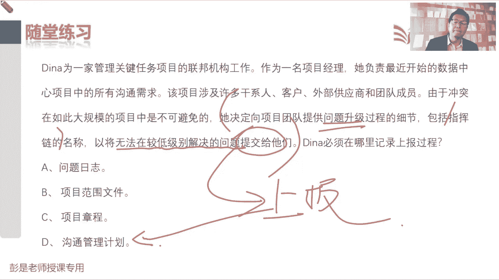

# 2024年最新版PMP考试第七版零基础一次通过项目管理认证 - P62：2.7.3 监督沟通 - 慧翔天地 - BV1qC411E7Mw

那最后一个管理过程监督沟通，就是看看沟通有没有问题啊，需不需要改进，需不需要优化，刚才也解释过了吧，所以这个管理过程包括输入，输出啊，工具啊，都没有什么太多新的知识点，这个工具啊。

虽然虽然放在这个管理过程里面挺重要的，但实际上其实也不大会考啊，这个东西我们首先见到他是哪个管理过程，还记得吗，观察和交谈，是哪个管理过程重要的考点呢，哎好记性啊，收集需求吧，当时说话对方可能不愿意说。

没时间说，懒得说，不想说，说不清楚需求的时候，我们需要观察，通过观察了解对方的诉求，对不对，然后呢再通过交谈去进行确认，那把这玩意放到监督沟通，甚至未来我们会看到啊，肝血管里也用到了这种方法，在工作中。

这玩意这玩意儿说监督沟通，观察和教材的目的是什么呢，这是大家可能天天都在用了，叫啥呢，猜猜对了就不用记了，就是你和对方在交流的过程中观察观察，观察什么呢，能猜对吗，人情世故，期望啊。

意图啊变成大白话就是反应，变成大白话就是反应，察言观色，啊这实际大家工作中生活中都在用吧，对给老板汇报情况，发现老板眉头紧锁，面色深沉，一脸黑，哎呀好像他不太开心，好像他不太满意，是我哪说错话了吗。

就这东西吧，诶嘿嘿嘿对吧，生活中工作中都在用的，只不过现在把它变成这种术语啊，有印象就够了，所以这种东西你说考试怎么考呢，也不大会考，没法考啊，对不对，除非谜底就在谜面上对吧。

描述说张总项目经理张三在给李四做汇报，发现李四心情不好，对马面色深沉，嘿他在用什么方法呢，这不会考啊，好但是工作中，生活中为什么要在强调这个东西呢，因为你要看对方除了这种心情的东西啊。

还要看对方是不是听不懂啊，听不明白呀，工作中会用到吧，给人家噼里啪啦说了一大堆，不要只顾着自己说，还要看看对方的反应，反应在高大上一个词就叫反馈，因为除了用嘴说，他的眼神表情语气甚至肢体语言。

一般有的人挨批评了就容易抠手，喜欢扣一角，这种小动作都在传达信息，都在传递信息啊，好知道这个意思啊，这个管理过程，这这这工具不需要去背的，下班了，总之看看我们沟通的地方是不是有问题，要不要做改进。

所以主要看后面复习的时候，主要看看综述就差不多了，那通过监督沟通过程，我们来确定规划沟通的公建和活动，是否如预期提高或保持了相关方剂项目的，巴拉巴，就是看看咱沟通的效果，有问题的话，就改进就优化了。

所以项目沟通的影响和结果，应该接受认真的评估和监督，来确保刚才其实说过了吧，正确的时间，正确的渠道，将正确的内容传达给正确的受众，从而看看是不是产生我们期望的，正确的影响和结果。

这句话稍稍印象深一丢丢就可以了，如果这些东西都有问题，咱就改进它，就优化它，不要半夜为大家工作龙头在用吧，不要半夜总在微信群里面给给我们发工作上，什么工作的通知啊，工作任务啊，这这大家还得睡觉呢。

对不对，就这个东西啊，好知道意思啊，所以这个管理过程学到这个程度，下班了嗯，那再往下这个管理过程输入啊，输出啊，这后面复习的时候看一遍看看一遍就可以了啊，不要只看标题啊，各位亲还要大概看一看这些文字。

便于不断的去巩固这些术语好，所以什么什么输出啊，没有新的知识点，做做这一章的题差不多了，看看第一道题，CATHY给客户发一个发货单，他使用的是哪种沟通，这种东西啊，大家千万千万不要用自己的。

工作中的场景去分析啊，不要用工作中的场景去分析，你要换个角度考虑考虑问题啊，就是根据我们储备的知识，根据我们储备的知识，你去分析一下用什么样的沟通方式，最好，最踏实最安全，找到这个选项，仅此而已。

因为实际工作中怎么沟通都可以是这个意思吧，实际工作中你可以用嘴说对吧，可以写文字，也可以非正式的，对不对，各种可能性啊，因为实际工作中，我们要结合当前的沟通的场景去分析，采取什么样的方式比较合适。

比如说我跟张三关系好，我跟张三关系好，我找张三借钱，你就用嘴说就行了，不需要写字啊，对实际工作中一定是具体情况具体分析，但考试的时候怎么办呢，考试的时候就找一个最稳妥的方式呗。

最好的方式就是张三找我借钱，那咱写个字据正式书面，对不对，写个字据签名，为了保险还要按手印，按手印啊，然后呢再稳妥一点，你拍个短视频，拍个视频，举着你的身份证对吧，把这个内容陈述一遍，这样的咱心里踏实。

永远是按照这个思路去找选项，哪一个选项最踏实，最安全，最保险，所以呢这是正式书面搞定，其他的方式不予考虑，我们找一个最稳妥最踏实的方法，仅此而已啊，所以这道题建议的答案是B正式书面，所以中心思想就来了。

这是咱的项目组，我们和项目之外的人进行沟通，不管是什么客户啊，政府啊，供应商啊，总之这种外部沟通最安全的方法就是正式书面，它可以帮助我们有效的避免扯皮耍赖，不认账，永远按照这个思路去找选项。

就这就这个道理啊，好看看这道题，这玩意儿去哪儿看的，刚刚以项目经理的身份开始一个项目发起，要求您通过电子邮件和每周的状态会议，什么每周更新状态来审查项目的进度，这些要求逻辑到哪儿了。

就是刚才说过的规划沟通管理，最重要的输出沟通管理，计划好搞定了吧，这道题呢，所以沟通这一章做几道题，做几道题，只要把思路讲思路纠正了，基本上问题不太大，难度比较低啊，好发现啊，团队会与顾客直接交流。

只有在出现问题的时候才召开状态会议，然后呢，大家关于这些东西的想法又不也没有达成共识，那我们先看看都现在都在描述什么呢，信息信息信息传递有问题吧，咱就把这个信息怎么传递给他，收拾收拾。

所以要写一个沟通计划，解决这些问题，你在询问一位干系人，他那部分项目进展的如何时，他用一种嘲讽的语气说，都很好呀，你看哪一项能最好的描述他使用的沟通类型，roger同学再看看志伟同学，再看看小杨同志。

再看看哪一个更准确呢，都很好呀，都很好呀，关键词是什么呢，不是这个，嘲讽的语气，这是什么呢，都很好呀，这是语言沟通，嘲讽是什么呢，非语言沟通吧，这东西吧，所以答案是C眼神表情。

语气声调都在传达除了语言之外其他的信息，所以就像这个知识点，比如说啊各位同学各位同学啊，辅助语言沟通，就是除了嘴之外的什么PPT图片，刚才见过的那些那些东西吧，语气不代表语言的语言，就是字语言。

什么叫语言，这百度一下不解释了吧，这是字啊，什么都很好呀，这四个字是什么意思，这就叫语言对，Hello，这是语言萨瓦迪卡，这是语言，除了语言之外，用什么样的声调，用什么样的语气。

这不能改变语言的本来的意思吗，是不是结合到不同的语气声调，是不是改变了语言本来的意思，比如各位同学，你看过的看过的各种电影啊，就男生女生谈恋爱对吧，女生对男生说讨厌诶，他是在说你真讨厌吗，好像不一定了。

改变了这个语言本来的含义，本来的意思，这就是非语言沟通，大概这个东西有印象就够了吧，好再往下拉啊，反正那种撒娇的语气我学不来啊，知道意思就够了，这道题，各位同学，谭女士，着急啦着急啦，再看看54321。

所以呀你们创建了一个什么沟通计划，正在开展项目工作，一直在与团队沟通，现在在查看工作绩效信息，来估算项目的绩效，哪一项描述描述了接下来要做的事呢，先考虑怎么估算项目的绩效吧。

所以实际上这道题不是沟通这章的知识点啊，是监控项目工作管理过程，我们拿到各个知识领域的工作绩效信息，用这个玩意儿，和我们的各个知识领域的基准和计划做比较，看看是不是存在着偏差。

有了偏差之后再去分析是不是原因是啥呀，怎么解决呀，哪个解决方案最好啊，就用到了根本原因，分析备选方案，分析成本效益分析，招标准的决策，分析，各种各样的分析方法，最后呢采取了措施之后。

未来朝着什么方向去发展呢，再做一个趋势分析，做预测哎，这就是监控项目工作这些东西，然后出了工作绩效报告，再去按照我们的沟通计划，看看这个报告应该传达给谁，是发邮件呢，还是组织开会呀，以此类推。

所以答案是B，好这道题呢，顾客突然要求对蓝图做一些重大变更，你要与他谈谈这件事最好使用哪一种沟通，刚才说的那个考试技巧啊，这是咱项目内部涉及到这种外部的，最好最好稳妥起见，对不对，就是正式书面。

所以恭喜大家答对了，记住这个原则啊，好你查阅了正值计划，来找出项目的ea c和etc，这个信息最好放在哪一个位置，做过预习的同学应该对他提问题不大，没做过预习的同学需要需要给大家解释了。

这俩玩意是什么呢，没做过预习的同学，或者是不明白这两个单词是什么意思的同学，给大家粗暴粗暴理解一下，什么叫EACETC啊，因为一会儿我们讲工具技术会讲到政治分析。

政治分析最主要的最主要的工作之一是什么呢，做预测，分析未来项目的进度和成本的情况，就是趋势分析做预测，那EACETC现在先给大家科普一下啊，这俩东西是什么鬼，比如说比如说我现在计划一下。

明天上班需要多长时间，这是规划吧，诶打开百度，你从家到公司需要一个小时，这就是我规划时候做的做的计划，然后呢，明天早上啊，在上班的路上，这不是过程中了吗，在上班的路上啊，前半段路花了30分钟。

前方路段拥堵，剩下这段路啊还需要40分钟，前半段路已经花了30分钟，导航告诉你，后半段路还需要40分钟，这40分钟我们就给它起了个名字，叫什么呢，叫etc完成剩余工作还需要多少钱。

完成剩余工作还需要多少钱，所以就叫完工尚需估算，那这EAC又是什么鬼呢，EAC呀，就等于30+40，他叫完工估算，我们用这两个数据，对整个项目未来的发展方向做预测，这意思吧，剩下工作还需要。

剩下这段路还需要40分钟，这不是预测吗，然后整个整个这段路啊，一共需要70分钟和计划有10分钟的偏差，为什么呢，因为前方路段拥堵，这不是趋势分析吗，所以这道题正确的答案是B预测，这就是咱控制进度。

控制成本，为什么单独输出一个预测，我们要今天讲完政治分析，我们要根据政治分析的情况去做趋势分析，评估啊，我项目大概能不能按期完成啊，能不能按预算完成啊，会超支会节约会超支多少呢，如果是节约的，节约的话。

会节约节约多少钱呢，这都叫趋势分析，展望未来的事情好这道题呢，你正在为项目的干系人提供相关信息，以下哪一个不是你要使用的工具和技术，再说个沟通技术，基本上其实也不大会考啊，就是纯粹的能用的技术啊。

微信啊，钉钉啊，电子邮件啊，网盘啊，这都是沟通使用的技术吧，所以邮寄给干系人的文档副本，纸质的书面的东西也是可以采用的技术和方法，召开会也是技术啊，在线文件夹网盘也是技术啊，所以呢这道题正确答案是B。

这一会儿我们讲到干性管理是对干系人做排序，一个重要的工具，重要的方法，这道题没学没学过的同学也不着急啊，这就是考试的最大技巧了，排除法呀，虽然B选项我没学过，但是呢我能判断沟通技术。

那什么纸质的文件哪开会呀，打电话发微信啊，云盘网盘的视频会议啊，这都是我沟通可以使用的工具，或者是技术排除法，好这道题呢，好可以，恭喜大家答对了吧，这道题比较好判断吧，说另一个团队总是什么延迟五天。

当你想聊这个这个这个人询问情况的时候，他说公司的质量控制测试过程需要五天，变成变成大白话，需要总结归纳一下这个题目的描述的场景啊，就是我们得到了一个消息，对不对，我们得到了一个消息。

那需要想办法把这个消息呀定个计划传递出去，让大家了解这玩意儿，就这玩意吧，好所以答案是C，你是项目团队的成员，项目经理经常使用电子邮件向你提供，他对你在项目中工作进展的详细感受，这是什么沟通呢。

这叫这道题，纯粹为了加深这个知识点啊，这玩意儿，这叫，非正式书面，恭喜各位同学，这个记性还不错，好看看DNA有什么问题啊，看完这道题要能够反应过来啊，刚才我们依稀记得，沟通计划里面有一个什么东西。

依稀记得沟通计划里面有一个什么东西，才诶没错，李健同学说的很准啊，这是上报吧，仔细看题，他决定向团队提供问题，升级过程的细节，包括指挥链的名称，以及已将已将无法在较低级别解决的问题，提交给他们。

这段文字就是在说那个上报不上报的过程，上报的过程，上报的步骤啊，哎就这个事啊，影响有多大，应该上报给谁，对对，所以呢这玩意要写到沟通计划之中，当这些东西我们做不了主，解决不了的事情，我们应该找谁。

找哪个领导，就这东西吧。

好就是那个问题，升级上报步骤，大概听一听这个术语，稍稍印象深一点，这就是沟通这一章的关键知识点。

搞定沟通之后啊。