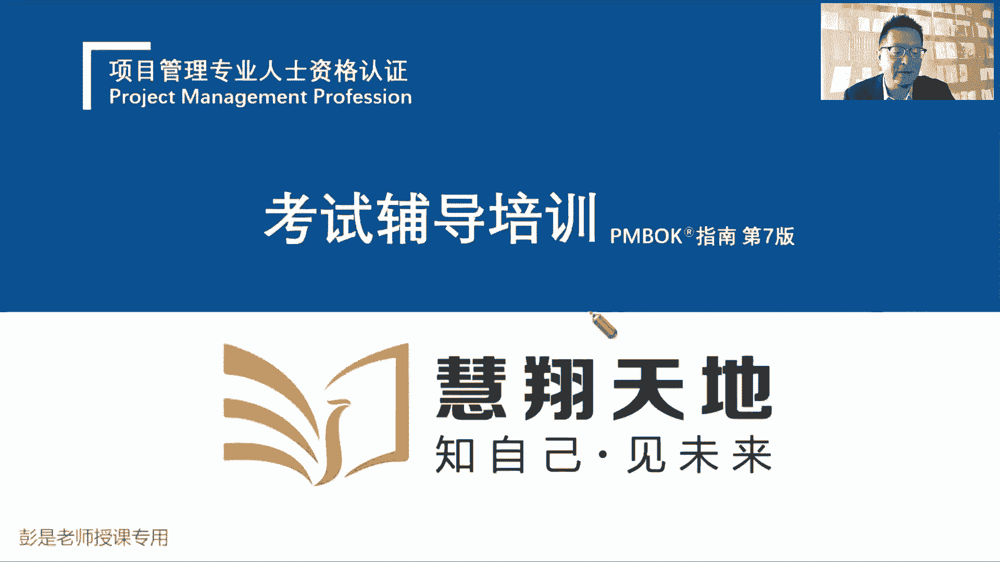
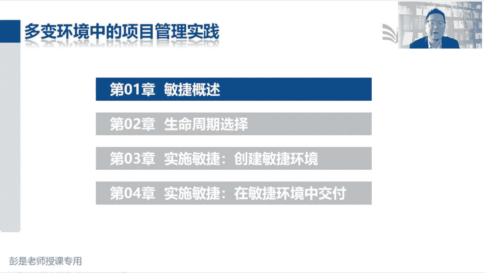
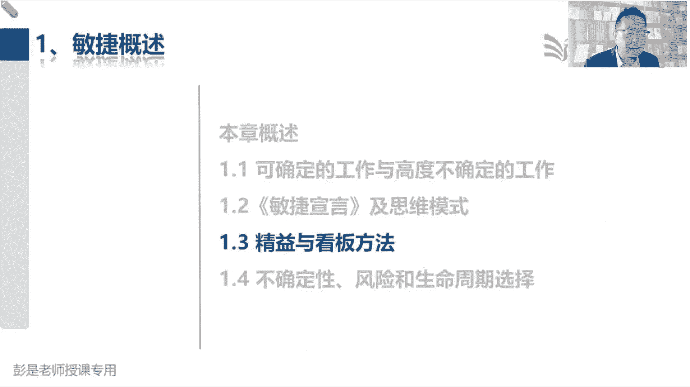

# 2024年最新版PMP考试第七版零基础一次通过项目管理认证 - P68：第三部分  多变环境中的项目管理实践 - 慧翔天地 - BV1qC411E7Mw

十秒钟即将开始，接下来一小段学习旅程，54321，那恭喜大家，目前为止我们已经学完了，传统的项目到底怎么管对吧。

这叫预测预测，预测型生命周期的项目，预测型生命周期是什么呢，指结果可预测，需求比较明确，范围能够确定啊，这不是可预测可预期吗，还讲了前面讲了生命周期类型，这代课啊要要巩固回顾了。

好看课件啊，是说呀，如果咱们的需求是确定的，咱的范围是确定的，咱就可以稳扎稳打对，就按照我们传统的五大过程组，十大知识领域这个思路去开展了项目，从开始到结束，可以把它分成N个阶段。

然后呢我们就收集需求定义范围，创建WBS定义活动排列，活动顺序，就按照这些管理过程的逻辑，12345去干活，哎，就把这个阶段的工作给他梳理清楚，然后呢就会完成工作，得到成果，再开始下一个阶段。

再开始下一个阶段，以此类推，这就是这种预测型方法的特点，我们就可以做到一次交互，对不对，一次把东西做出来，然后呢该干啥干啥，该交接交接，该移交移交，那如果需求不确定，如果需求不确定怎么搞啊。

说客户提到什么好多需求，好多需求，什么A呀，B呀，C呀，D呀，E呀，F啊咳，稍等啊，如果这些需求不确定，那我们还是一次根据收集到的这些需求，写了范围说明书，根据范围说明书创建了WBS。

根据WBS估算资源时间成本，然后排进度计划，然后出项目预算，然后去执行，然后产出我们的可交付成果，这时候客户跟你说呀，你做出来的这个成果，这个需求我改一改，这个需求我不要了，我再加点，抱歉啊。

嗓子有问题了，好这个需求我改一改，这个需求我不要了，我再加点啊，什么G啊，H啊，什么什么什么W啊，M呀，我再加点乱七八糟的其他需求，这种情况下容易出现什么问题呢，还记得那条交叉线吧，嘿到了项目后期呀。

我们成本太高了，变更的代价很很大呀，变更的代价非常高，变更的代价非常高，这么做不好啊，所以在这种情况下，我们就要慎重了，要考虑啊，有没有必要一次把所有的需求都给它实现，都给它完成呢，好像不行。

因为变更的成本比较高，所以在这种需求不确定的情况下，那咱要怎么思，这个思路是什么呢，少干点干的越少，成本越低，周期越短，成本越低，哎就少量多次交付，对，先搞这两个东西，A和B您看看对不对。

然后再搞搞C和D，您看看对不对，对不对，在高考什么EFO，您看看对不对，哎就这样不断的不断的反复尝试呗，所以他的思路就出来了，我们把所有的需求啊先弄个列表出来，列表里边可能有A呀，B呀，C呀，D呀。

E呀，现在有五个需求了，我们写少量多次交付，少量多次交付，我们在这五个里面先排排序，看看什么东西优先级高，什么东西优先级低，把最有价值的东西先给他搞出来，并且呢考虑啊尽可能的少，尽可能的少。

因为工干的活越少，对不对，周期越短，成本越低，成本越低，一旦需要改动，一旦需要变更，那么这个改动变更的代价就越小，所以叫试错的代价就越小，最后思路就叫以最小的成本，以最小的代价去探索去试错。

所以比如说我们先把A和B给他干了，让对方看看对不对，对方看完了，对方体验了之后啊，有可能说这个东西C我不要了，A你再改一改，我再加个什么G啊，H啊，哎以此类推，收到对方的反馈，收到对方的反馈反馈之后啊。

我们再对这些东西排排序，看看什么东西价值高，什么东西价值低，比如说哎我们在E价值高，G价值高，咱再把这个小批量的东西给它做出来，让对方看看对不对，从而获得对方的反馈，可能对方又提出一些什么需求的改动啊。

新的需求啊，新的想法呀，那咱下一轮下一轮啊，再看看什么东西价值高，什么东西价值低，再排序，排完序，再把最有价值的东西给他做出来，让对方看看对不对，再获得对方的反馈，就这样不断的不断的循环。

不断的不断的迭代，那循环叫什么呢，循环就叫迭代，迭代之后，迭代之后，干完活得到的新的产品服务成果的功能啊，这叫什么呢，这就叫增量，所以就是生命周期这类型里面那段吧，讲的叫迭代加增量，迭代和增量嗯。

这个迭代周期要尽可能的短，因为周期越短，成本越低，试错的代价就越小，周期短，也就意味着我们能干的活就少，对不对，所以我们从众多要干的事情之中，选择最有价值的东西，先把它干完，这样呢就以最小的代价去试错。

并且呢我们还是干到最有价值的登机，就可以做到以最小的代价做到价值交付了，就这样持续不断的持续不断的迭代和增量，迭代和增量诶，所以这几个单词这几个单词，接下来我们再把它变成专业的术语。

我们找一个地方记录所有的需求，这个东西叫什么呢，叫产品待办事项，产品代办，什么叫代办呢，就是还没干的活吧，哎等待我们去完成的工作，等待我们去干的事，就叫产品代办，然后每次啊每次迭代一开始啊。

我们来决定这个迭代到底做什么事，把这次迭代需要干的事儿，哎我们还需要有个地方给它写清楚这个单词，这个东西叫什么呢，这个叫迭代的待办事项，这也好理解吧，所以粗暴理解啊，产品代办，那就是我今年要做的事。

从今天开始，一直到年底我要完成的工作，这是所有要要要做的事，那什么叫迭代呢，下周要做的事，下周我去分析啊，今年要做这么多事，什么东西优先级高，什么东西优先级低，哪个东西价值高，哪个东西价值低。

先把最有价值的活先干了，就是下周要干的事，不是迭代代办时效吗，每周就是一次迭代，就这样错吧，理解好，所以粗暴理解大需求池小区周耻，那迭代代办实现一旦敲定了，咱就按照这里边的东西去干活，去干活。

按照计划去干活，就会得到我们的成果，这就是增量，得到成果之后，需要对方看一看，获得对方的反馈，然后我们再继续下一次迭代，再从大池子里东西搬到小池子，再去干活，得到成果，再去获得对方的反馈。

就这样不断周而复始，周而复始，不断的循环，不断的迭代，好就这么意思啊，那这就是敏捷里面最核心，最核心最核心的这个中心思想，知道了这个中心思想教材上，接下来我们再听课就可以轻松加愉快了。

敏捷最核心的东西基本上就讲完了，好看PPT，说呀这段内容专心听专心听啊，都是听明白这个逻辑，他为什么这么玩就可以了，所以啊项目工作包括可确定的工作和高度，不确定的工作，可确定的工作。

我们就按照传统的传统的基于过程，基于流程的方法去干就完事了，哎所以在完成设计后，制造汽车，什么电器，建造住宅，这都是可确定工工作，为什么呢，最难搞的就是设计呀，设计汽车的时候，这个需求就不确定啊。

到底造一个什么样的汽车呢，对一旦完成了设计，这个设计一旦定稿了，哎，去执行的时候就确定了吧，所以呢它所涉及的什么什么都很好理解，并且呢执行的不确定性和风险通常较低，你家里面装修装修的风格，去执行。

去去去干活的时候，哎这就可确定了，好这道题思啊，那新的设计解决问题和之前没做过的工作，都是探索性的，我们要设计一款新的产品，这个需求可能不确定啊，对不对，然后解决问题，然后之前没干的没干没干过的活。

这都叫探索性的，因为他不确定，所以需要什么呢，我们需要找专和什么专家，什么和这些人合作来想办法，想办法更好的完成这个工作，哎知道意思可以了啊，不太需要去背的，那高度不确定的项目变化速度快。

复杂性和风险也高，这些特点可能会给传统的预测型方法带来问题，传统的预测型方法只在事先确定大部分需求，并且呢需求一旦确定了，我们12345去干活，对对干活的过程中要严格的管理我们的变更。

因为项目变更的成本会随着工作的开展，越来越高，所以才有了我们要实施整体变更控制，然后呢还要去思考这个变更会不会影响到基准，对不对，有权利的人来做决策，要慎重慎重慎重，那就带出来左边这张图。

这叫瀑布型的生命周期类型，因为前一道工序完成，会把成果移交到下一个工序，下一个工作完成又把成果移交到下一个环节，诶，特别特别像那个水流一样的那个瀑布啊，这就是预测型方法，结果可预测。

尽量的要对变更进行控制，进行管控，而敏捷方法的出现，是为了在短时间内探讨可行性，根据评估和反馈快速调整，所以就带出来刚才我们那个大徐州池全干完，这不现实，我们先干一部分，然后呢干出来之后啊。

让对方来反馈，根据对方的反馈怎么调整呢，再重新排定优先级啊，看看什么新的需求，新的想法是不是更有价值，更有意义，再重新排定优先级，再来决定下一次迭代，做什么事更有意义，对不对，干完了之后呢再获得反馈。

并且呢这个周期越短越好，因为周期短，成本就D是错的，代价就小，知道这个意思啊，那再往下在阅读的话看看这张图，看看这张图，传统的预测型方法的特点是，我们完成了汽车的设计。

然后呢就12345去把这个车造出来，他有什么缺点呢，叫只闻其声不见其人，你们设计呀造好一个轮胎呀，造好一个底盘呐，装上汽车壳啊，装上发现方向盘呐，在最终这辆汽车制造完成之前。

我不知道这个车到底是个什么样子，对不对，不知道这个车到底是什么样子，那就没有办法去真正的进行体验，所以它通常基于需求明确，这是超参考借鉴这样的场景啊，那你们这么干就可以了，但是啊如果如果对用户来说。

他的需求现在不确定，我也不知道到底未来这个东西是个什么样子，如果这个东西不确定，需求不确定，我们还闷头的把这个车造出来，可能不符合人家的要求，变更的成本非常高，那我们中心思想就化繁为简。

尽可能的尽可能的尽可能的以最小的代价，先把这个东西做出来，让人家用一用，看看是不是满足他的业务需要，根据用户的反馈来调整，来分析我们下一步做什么事，所以呢它的主要工作方法就是这个思路了。

用户现在提出需求，说我需要一个交通工具，那您到底要一个什么交通工具呢，用我说我说不清楚怎么办，先造个滑板车，代价小，您看看这东西您先往前透露着，对不对，根据用户的反馈，用户可能说啊，我想控制方向，哎。

这东西方向不好控制啊，没问题，我给您加个加个方向杆，仍然在以最小的代价去试错，对不对，用户又说了，用脚往前秃噜，用脚往前秃噜啊，太累了，费鞋呀，没关系，我给您加个脚蹬子，加个座，您坐着舒舒服服的往前蹬。

嘿省邪了，用户说呀灯太累呀，能不能让它自动化一点啊，好给您加个发动机，变成摩托车，用户说这摩托车肉包铁不安全，没问题，加个壳，咱变成小汽车，总之我们会不断地根据用户的反馈。

看看目前对用户来说什么东西最有价值，优先把它做出来，这只是个事例啊，假设用户反馈变成别的，我们可能最后造出来的不是汽车了，比如说你造了个造了个滑板车，用户说我这玩意儿要在水上跑，没问题，给您造个小船儿。

用户说这个小船它不走啊，没问题，给您挂个帆，用户说现在没有风啊，没问题，给您弄个桨，用户说拿桨划太累了，没问题，给您弄个发动机，因为说发动机这东西太晒了，没问题，加个壳变成游艇，对不对。

总之在需求不明确的这种环境下，我们一定要根据根据用户的反馈去分析，下一步应该干啥，那根据用户的反馈去分析下一步应该干啥，最核心的来了啊，我们小步快跑，小步快跑，每一步做出来的产品一定要可以使用。

只有可以使用的东西，用户才能够去进行体验，那用户体验了才能够给，才能够给我们真实的反馈，客观的反馈，因为体验这个东西只看是说不清的，给你看一看照片，你看看这个菜好吃不好吃，看不出来呀。

对一定要可以吃到嘴里，体验带有主观倾向了吧，一定要吃到嘴里，我才能够知道哎，这个东西是不是适不适合我的口味啊，就这个逻辑啊，鞋舒不舒服，只有脚知道穿上去才知道，只看照片起这网购的缺点罢，只看照片。

鬼知道到底好舒服不舒服呀，以此类推，所以非常重要的原则，就是我们我们的产品服务成果，在质量上是不可协商的，他的底线是一定是可以使用不可用的东西，半成品的东西没有办法获得客户真实的体验，好理解哈。

去餐厅吃饭，这菜炒一半血渍呼啦的放到你面前说，亲您看看这个菜好吃不好吃啊，吃不下去啊，做熟了再端上来，只有这个道理，所以半成品不行，一定要可以使用，这是底线，这是红线啊，没得商量。

这就是敏捷的中心思想了，我们有所有的需求，然后呢选出一部分需求，造出来一个可以使用的产品服务或成果，这就是个增量，然后呢再看看让客户来体验，来通让客户来使用，让客户来体验，从而获得客户的反馈。

再根据反馈来看看，我们要不要对下一步的作战计划，做出相应的调整，就这样不断的迭代增量，迭代增量好，这就是他最主要的工作模式，所以接下来基于这个工作模式，我们需要大概了解一下敏捷提出的宣言。

还有他的主要原则，了解就可以了啊，这东西不用背的，说2012001年，软件业一堆大神就共同发表了敏捷宣言，正式宣告敏捷开发运动的开始，他是从软件行业衍生出来的，为什么软件行业先提出这个主张呢。

就是因为做软件，做软件，需求是最难搞的，需求是最说不定是说不准的，对对就像大家大家想场景，大家目前在听课用的这个鹅直播小额通，小额通这个东西哎仁者见仁，智者见智，每个人都能表达出自己的主张和观点吧。

我觉得这个颜色不好看，我觉得这个按钮风格平面化我不喜欢诶，我觉得这个这个字儿太小了，这个字体也不开心，这个头像题我显得好奇怪呀，对不对，我想需要这个功能，张三需要那个功能，大家一定是众口难调的。

员工有员工的需求，管理者有管理的管理者的需求，学员有学员的需求，班主任有班主任的需求，老师有老师的需求啊，很难搞啊啊，所以这位大神就想出了刚才说的这些工作模式，那他就提出了敏捷宣言。

非常非常的叫什么抽象的四个大道理好，那敏捷宣言不需要记住它的内容，记不住没关系啊，后面考试的时候如果出了很好猜，第一我们更关注的是个体以及互动，而不是过程和工具，更关注左边而不是右边。

但是要看看最后这句话，右栏中的项目它是有价值的，我们不是全盘的说呀，我们要否定所有的过程和工具吧，章程该有还得有啊，对对，识别风险该有还得有啊，这些过程，这些工具，这些方法，这些流程，这些文档。

这些资料它有它的价值，但不代表着说对不对，不代表着说，我们要全盘的遵循我们的49个管理过程，所以我们更重视左边这些东西，因为在这种多变的环境之中，我们一定要一定要及时的及时的和客户去沟通，去交流。

去互动，让人家看看我们做的对不对啊，这样可以避免我们在错误的道路上越走越远，能听懂吧，避免在错误的道路上越走越远，比如各位同学随便想场景啊，你打电话对吧，肯定张三张三，你们家住哪儿啊。

如果在没有导航的情况下，是不是希望这个电话不要断，随时的给我指导啊，随时的交流啊对吧，我进到小区了，往哪儿走啊，第二栋楼啊，再往右走还是往左走啊，以此类推呀，对不对，所以在这种多变的环境下。

在这种多变的环境下，我们一定要保持这种沟通的时效性啊，从而避免避免避免因为这个时不及时不及时，因为如果沟通不及时，过了两天三天四天词儿成本就上去了，我们中心思想永远是想方设法的以最小的代价。

最小的成本去试错，所以一定要及时的沟通，及时的交流，及时的互动，这样呢可以帮助我们有效的去避免浪费时间，浪费钱，浪费精力，哎，最小的代价趋势错也是消除浪费，对不好，第二我们更关注可用的软件。

而不是完整的文档，传统的工作方法啊，预测型的工作方法需要关注文档的标准化，规范化，设计图设计一款汽车，你这个设计资料设计图纸要不要标准，要不要规范呢，如果不规范哇，这吓人呐。

之前之前无数无数先贤就遇到过这样的困扰啊，大家好理解的，比如天上飞的那个大飞机，空客A380，在研发设计的过程中就出过这个问题啊，飞机有这么多零件，这些零件由不同的厂商把它做完。

我们需要给不同的厂商提供图纸，对不对，提供我们的需求，人家来完成图纸的设计，设计完了去把它零件做出来，结果呢大家坐的这个坐飞机的过程中，用的这个制图的软件不一样，制图的软件不一样。

当时那个标尺还是什么东西不一样啊，规格不同啊，就导致导致造出来的零件，对不上，对不上，对不对，还损失了十几个亿，以此类推，什么火星车也出过这个这个故事吧，当时什么英寸呐，还是用英里还是公里。

这个是计量单位不一样唉，就导致最后最后这个这个火星车造出来，和想象中的不一样，唉损失了好多好多时间，好多钱呐，就这个道理，所以我们不追求这种文档的标准化和规范化，但不代表着说我们要抛弃所有的文档。

该有的东西还是要有的，对不对，什么我们知道的什么问题日志啊，什么风险登记册呀，干行登记册呀，我们要去分析它里边有没有什么无价值的，低价值的东西，可以考虑考虑把它去掉的。

我们还要保留一些它有价值有意义的东西啊，所以不代表着我们要消除，要放弃所有的文档，该有还要有，但是呢我们更关注可以使用的软件，因为它只有可以使用，才能够让客户去进行体验，刚才说的非常重要的原则。

不要纸上谈兵，你给我一堆什么设计图纸啊，效果图啊，我看不出来体验不了，对不对，一定要可以使用使用啊，可用性，然后我们更关注的是客户合作，而不是合同谈判，咱们刚才说过，我们在控制采购的过程中。

对控制采购是咱管供应商，那反过来我们和客户也是这个逻辑，双方有了争议，纠纷诉求有了分歧怎么办呢，哎谈判对吧，然后第三方调解和仲裁打官司，那现在呢我们其实啊弱化这个谈判，这个这个这个术语。

因为在这种多变的环境下，我们及时的沟通，及时的交流，及时的互动，您及时的给我们反馈，避免我们在错误的道路上越走越远，这不是合作吗，一起更关注的是如何有效的合作，面对问题，解决问题，对不要浪费时间。

浪费钱，浪费精力去谈判，没必要，但不代表着说我们就不谈判了，该谈还要谈呢，咳因为谈判谈判是合同，涉及到一手交钱，一手交货，该谈还要谈啊，但是我们更关注的是合作，面对问题，解决问题好，再往下。

最后我们更关注的是，如何有效地应对这种多变的环境，多变的场景，而不是墨守成规，循规蹈矩，遵循计划，那怎么做到适应变化，拥抱变化呢，还是刚才说的周期短，周期短，成本就低，成本低，我们就更容易改，对不对。

成本低就更容易改，好了，这就是敏捷的中心思想，敏捷宣言啊，好再往下，那这源于敏捷宣言啊，根据敏捷宣言就衍生出了12个原则，这12个原则也不需要大家去背，不用背的啊，不要12345把它背下来，没用的。

先给大家听懂就可以，听懂之后等等咱们敏捷课讲全都讲完了之后，你再翻过头来复盘，看这12个原则，越看越清楚就可以了，好第一，我们最高的目标是通过尽早持续交付，有价值的软件来满足客户的需求。

现在提了这么多需求，我们一次把它全都做完不现实，那咱先排排序，优先完成对客户有价值的产品服务或成果，可以做到持续的价值交付，然后呢，为什么要尽早呢，周期越短越好啊，周期越短，事做的代价越小。

不要等到两个月，三个月，四个月以后再让客户来反馈，对不对，所以我们要选择合适的交互节奏，交互频率就是这个确定这个迭代周期，所需的时间到底是多长，通常要小于四周，好这是最高的第一个原则。

那第二我们欢迎对需求提出变更，即使在开发后期也不例外，我们要善于利用需求变更，帮助客户获得竞争优势，所以课后反馈的时候，就会提出各种各样的新奇的想法吧，这个需求不要了，这个需求改一改，再提点新的需求。

这不都是变更吗，不过没关系，放回大需求尺，放回我们的产品代办事项，再去根据这些需求的变化，然后呢排排序，分析什么东西对客户来说最有价值，优先把它干完，从而做到价值交价值交付，价值交付，价值交付。

得帮客户取得竞争优势，这不挺就是价值吗，好所以周期越短，我们变更的代价就越低，那第三要经常交付可以使用的软件，周期从几个几周到几个月不等，并且越短越好，扯轱辘话来回说了吧，周期越短，是做的代价越就越小。

做出来的可交付成果一定要可以使用，不可以使用的东西，没有办法获得客户的反馈，好第四在项目实施的过程中，业务人员和开发人员必须始终通力协作，因为还记得那个引导记住吗，QFD卡诺模型什么莫斯科方法。

不同人群需求不一样，对不同人群观点不一致，不同人群他的背景不一样，所以可能会在需求方面存在着差异，那在这种多变的环境下，谁都别跑了，为了避免在错误的道路上越走越远。

我们需要持续的持续的持续的互动交流沟通，注意避免干活干错了，然后呢想方设法的有同理心，互相理解，达成共识，从而在确定我们的需求到底是啥好，第五个我们要善于激励项目人员，给予他们所需的环境和支持。

并相信他们能够完成任务，这句话听完了能反应过来是什么，知识点就超赞了，打鸡血，这咱知道啊，给他们环境和支持，相信他们能够完成任务，诶，这能想到什么玩意呢，成熟沾沾边了啊。

哎所以我们希望打造一个成熟的自组织团队，相信他们能够完成任务，我们就可以，他只要成熟，我就敢授权，由他们自己来做决策，自己完成工作的规划，执行控制，那在这种情况下，我们就变成服务型的领导。

给他们所需要的工作环境，给他们提供所需要的支持，这是帮助啊，辅导啊，引导啊，启发呀，教育啊，打配合咳，所以根据这个原则，就带出来未来敏捷的工作模式，三种人，一会再说啊，团PO。

然后开发团队还有服务型领导，好记住这个能想到领导力风格，能想到成熟团队，再次能想到自组织团队就齐活了，这是告诉我们怎么管人，怎么带队伍好，最后第六个，无论开发团队还是内部团队。

信息传达最有效的方法都是面对面的交谈，这咱知道吧，讲到沟通啊，讲到资源管理那一章都说了吧，线下面对面的面对面的沟通，沟通交流，时效性高，效率高，效果好，所以敏捷提倡的是最好最好最好叫集中办公。

那再往下第七个可用的软件，第二次提到了啊，可用的软件是衡量进度的首要衡量尺，衡量标准就是我们花了什么，两周三周做出来一个半成品，那您的进度绩效，抱歉，零没成果，没进展，因为做出来的东西不可以使用。

对不对，好就这个道理啊，这是最低要求，最低要求，第八个说敏捷过程，提倡可持续的开发，发起人，开发人员和用户都应该能够始终保持步调稳定，他追求的是什么呢，持续的稳定的输出，因为啊。

我们每次迭代都会产出增量，每次迭代都会有成果，我们追求的是稳定的绩效，不希望啊天上一脚，地上一角，对粗暴理解啊，这周第一周我打螺丝打了1万个，第二周打螺丝打了100个，这不稳定啊，不稳定吧。

所以这个原则最粗暴，对标到粗粗暴对标到在这种多变的环境下，多变的环境下，制造业参考这个道理，对市场需求不确定，上一周天气热了，可能这周需要生产1万箱11万箱雪糕，下周天气下点雨凉了。

可能只需要生产100箱，这种运作模式对企业来说，它不好准备资源，不好协调工作吧，上周需要1万箱雪糕，我可能四个设备对吧，四个设备是四个生产线都赚飞了，这周订单只有一箱，粗暴理解啊，这周订单订单只有一箱。

我可能设备都不需要开，从仓库里面拿一点，设备闲置了哎，设备闲置，这也是一种浪费，那对企业来说，我们追求的就是能够持续的稳定的输出啊，假设我有两条生产线，每周每周都能够产出相同品质的产品，服务或成果。

我这些设备，我这些用我这些人，我这些物料对不对，都能够保持一个稳定的稳定的稳定的运作，这是最理想的模式，那敏捷在这种多变的环境下看看啊，我们也是迭代增量，迭代增量，迭代增量。

这也是一个持续的重复的定期的开展的事情啊，那我们也希望像生产线一样，能够达到一个稳定的输出，能够有一个稳定的绩效，哎有一个稳定的交付节奏，而不要天上一脚，地上一脚，否则这这这活也不好干，对不对。

知道这个中心思想啊，那再往下第九，对技术的精益求精，对设计的不断完善，将提高敏捷性，这没啥可解释的，纯粹的字面意思，咳这是我们要不断的提高员工的能力，员工的水平，对不对，能力高了，能力高了。

适应性不就强了吗，能力高了，韧性就高了，哎可以让我们更更适应这个多变的，多变的多变的环境啊，好第十简洁即尽最大可能减少不必要的工作，刚才说过，我们更关注什么互动啊，更关注什么交流啊，对不对，这些文档啊。

这些制度啊，这些流程，政策程序诶，这些东西我们要考虑精简，轻装上阵，与其花很多时间对吧，去走流程，去写一些标准化，规范化的文档，与其把时间花在这个上面，不如把时间花在干活上，不如把时间花在执行上吧。

尽或尽早的把这个东西，把这个东西做做出来，尽早地获得客户的反馈，可以更有效地避免在错误的路上越走越远，所以粗暴理解吧，与其纸上谈兵，与其把时间花在纸上谈兵，不如出去打一仗就知道了。

就知道这仗好打不好打了，就这个道理啊，所以简洁但不代表着说我们要消除，我们要抛弃所有的流程，所有的文档该有的还要有，对不对，所以要精简，这是智化的原则好第11个，那么最佳的架构需求和设计。

将出自于自组织团队，这刚才解释过了吧，我们希望打造一个成熟的自组织团队，每个人都有能力，每个人都有担当，每个人都有主人翁意识，在这种情况下诶，他们就能够更好地带着主观能动性去完成任务。

他们来完成工作的规划，执行控制，他们来做决策，咱就不管了，就是放任型领导力风格加上服务型领导力风格，最后团队要定期反省怎么做，才能够更有效并相应地调整团队的行为，这句话听完了之后能想到什么知识点啊。

回顾复盘改进哎过程，对不对，我们不断的要总结经验教训，看看我们什么地方做得好，什么地方做的不好，进行改进的，这是PDCA的那个A持续改进，持续改进好，所以这就是关于敏捷的12个原则，不需要背啊。

但是后面还复习的时候还要多看看，看的时候要能想到，想到未来我们涉及到敏捷的这些小的知识点，那再往下说，给了给了我们一个思维方式，给了我们一些原则，根据这四个价值观，根据这12个原则。

就从此衍生出成百上千上万种，还不到万达大上千是有了啊，现在全球大家在用的这种各种各样的敏捷实践，上千种是有了，什么叫实践呢，什么叫实践，就是根据理论制定适合自己企业，自自己公司自己项目的最终最终方法。

到底炒鸡蛋，西红柿放糖还是放盐，每个家庭都有每个家庭的最佳实践唉，所以他就不断地衍生出了各种各样的实践方法，但这些实践方法咱学学不完，对不对，所以考试最考就考最核心的两个东西，一后面会说啊，三个东西好。

知道这个道理就可以了，所以这些原则源自于软件行业，但是目前呢在全球上来看，已经扩展到了很多很多行业，就这种思维模式，大家在工作中，在生活中或多或少都在用对，只不过有一些企业把它总结成自己企业的。

最佳实践，然后呢再和其他企业沟通交流探讨，哎，就变成了一些行业地区对，甚至是全球的最佳实践方法，就给了这么一张示意图，知道这个道理就可以了哈好，所以说在里在，什么艾哈艾哈迈德启发的提出的模式。

将敏捷明确表现为一种思维方式，它由敏捷宣言的价值观所决定，受敏捷的12个原则所指导，然后通过各种各样的实践方法，来实现这个价值观和这个原则，知道这个意思就可以了啊，好所以再往下说。

敏捷方法是一个囊括了各种框架和方法的涵，盖性术语，不管你是什么样的方法，是什么样的实践，只要他满足我们宣言和原则这个套路，这个思维模式，那么我们就认为它处于敏捷的方法之一，所以它是一个常态性术语。

是这个意思，但不管什么涵盖性术语，所以给了一张图，说将敏捷方法和看板方法视为精益方法的子集，先看这张示意图啊，刚才说，并且课上反复再说，以最小的代价去试错，最小的代价去试错，还要保证这个过程稳定。

总之中心思想就是消除浪费，所以它的根儿都是来自来源于精益思想，经济思想主要就是制造业的同学，你们在工作中要考虑，如何有效地消除各种各样的浪费，大大浪费好，就是经济思想就涵盖了，涵盖了所有的所有的东西。

在此基础之上，根据这个理论，根据这个理论的指导，就衍生出未来我们需要掌握的看板，SCP和基线编程，这是咱PMP考试，需要大家掌握的三个最核心的实践方法，右边这一大堆呢不需要咱掌握。

这是大家如果想有兴趣啊，考取ACP认证，就是PMI推出的关于敏捷方面的，这个是这个认证或者是工作中涉及到的，你想去学，可以去了解相关的内容啊，这咱可不是咱考试内容的考试内容之类的东西，这不需要咱掌握啊。

好知道这个意思啊，所以就是敏根据敏捷宣言，敏捷价值观，他的根其实都是精益思想，然后呢，在此基础之上衍生出来各种各样的实践方法，太多了，这些实践方法不需要咱考PMP全都掌握，只要知道这三个东西。

看板scam和XP就够了，所以不管什么样的实践方法，它们的中心思想都一样，根儿是什么呢，第一关注价值，我们要确保能够做到价值交付，所以需要不断的不断的，对剩下这剩下的事情做排序，看看什么东西价值高。

什么东西价值低，优先把最有价值的东西，最有价值的东西给他完成，第二呢我们关注的是什么呢，小批量，对不对，这么多需求，我们不是一次把它都完成，先选取一部分最有价值的东西，把它做完，这个周期越短。

这个批量越少，干的活越少，成本越低，成本越低，在这种多变的环境下，试错的代价就越小，第三我们该精简的精简，对不对，该精简的精简，然后呢做出来的东西要可以使用周期越短越好。

还要持续的产出相同品质的产品服务和成果，追求一个稳定的绩效，这么做的目的都是为了消除浪费，没必要浪费时间，浪费钱，浪费人财物，嘿哎这是经济思想最核心的三个主张，好知道这个意思啊，这就是关于1。11。

2给大家大概讲完，就是敏捷的根儿，敏捷的中心思想，只要只要牢牢的记住刚才说的这个大需求池，小需求池去干活，得到增量获得反馈，然后呢我们周期越短越好，还追求持续的稳定的输出，能记到这。

能理解这些东西存在的意义就够了啊，好各位同学上午听课辛苦了，那咱下午就开始详细说一说什么精益啊，看板呐，SCM啊，这些知识点好。

咱下午上课时间01：30。