# 2024年最新版PMP考试第七版零基础一次通过项目管理认证 - P6：1.1.5 裁剪 - 慧翔天地 - BV1qC411E7Mw

那1。51。521。5，裁剪这东西基本上不考，我们就主要掌握中心思想，第一什么是裁剪，第二为什么要裁剪，就掌握到这个概念，这个逻辑就够了，第一什么是裁剪，裁剪就是量体裁衣，对症下药，量体裁衣，对症下药。

我们有这么多的方法，这么多的知识在工作中都能用得上吗，不一定，所以呢要做选择，对不对，这是你什么叫踩点，你家里柴米油盐酱醋茶，然后有黄瓜西红柿鸡蛋这些东西啊，每天吃饭全都把这些东西都用一遍吗。

不对对不对，具体情况具体分析，这不做选择吗，就是裁剪，昨天炒鸡蛋西红柿放了两勺盐，大家反应太咸了，今天炒鸡蛋西红柿只放一勺盐，这仍然是裁剪，这是不断的改进，我们的过程，不断去分析。

我们需要用哪些知识去把医生本领对吧，完成任务，实现目标，得到我们期望的结果，做选择的这个过程就叫裁剪，量体裁衣，那我们有生命周期，有阶段，有过程组，有管理过程，有输入工具，技术输出，对不对。

有这么多东西，我们要选择选择哪，哪些东西适用于我项目，这就叫裁剪，第二呢，为什么裁剪呢，就是因为每个项目有每个项目的独特性，每个项目有每个项目的独特性，昨天特别饿，炒鸡蛋，西红柿放了两个鸡蛋。

今天的比较穷，没钱了，少放点放一个鸡蛋，后天呢后天呢又不太饿，不太饿啊，少放点西红柿，少放点鸡蛋大，后天呢又特别渴，多放点水，多弄点汤，以此类推，考虑到每个项目的独特性。

所以呢我们才需要更需要去慎重思考，去思考怎么量体裁衣，怎么对症下药，想办法提高项目成功的可能性，这就是什么是裁剪，为什么裁剪。

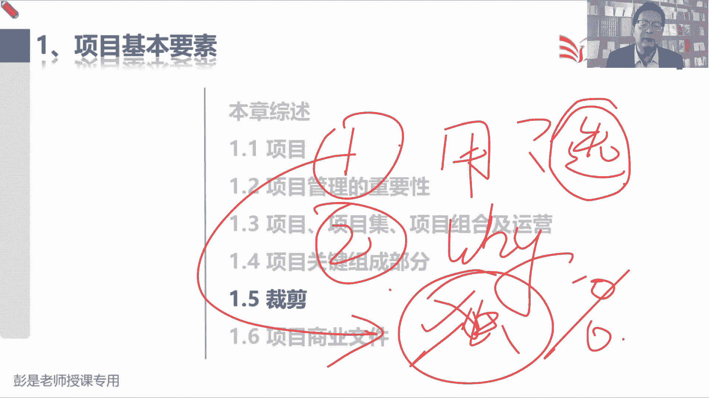

只要这两段话听完了1。5，大家后面复习的时候，其实是可以不看了好那接下来带着大家过一遍，可以不看了啊。

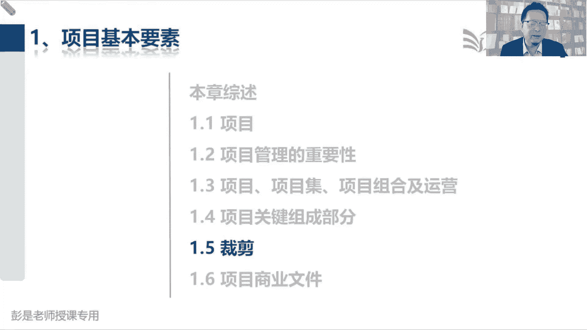

听一遍就完事了，所以呀我们通常将项目管理方法论应用于工作，方法论，是由于我们什么什么专业人员采用的实践技术，程序规则组成的体系，那根据这个定义，本指南不是方法论，什么叫方法论呢。

就是你根据你公司的情况定的这些标准制度，规范程序政策，那项目管理，咱们现在学的不是一个标准化的东西，对不对，它要根据你企业的情况，根据你行业的情况，根据你各项目的情况去选择合适的方法，就这个中心思想啊。

好知道这个意思，后面就全都不念了，我们要什么良好时间，然后具体情况具体分析。

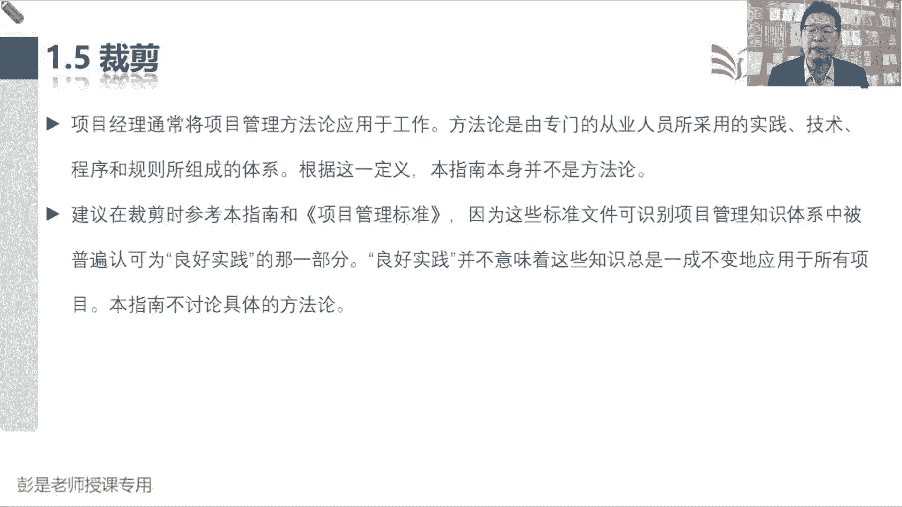

选择合适的方法，输入输出工具技术，就这么一句话告诉我们什么是裁剪，我们应该选择恰当的项目管理过程，输入工具，技术输出生命周期阶段划分来管理项目，那这个选择活动就是叫裁剪。

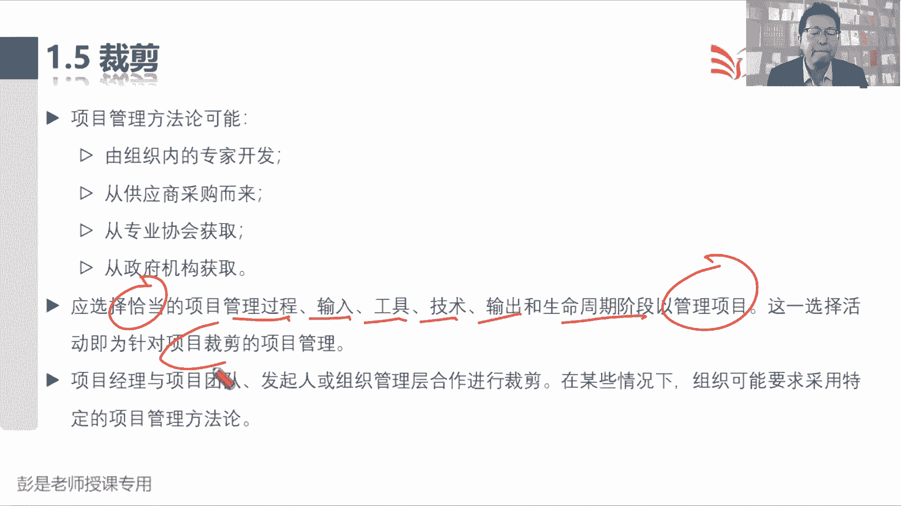

就大概知道这个概念是啥就够了。

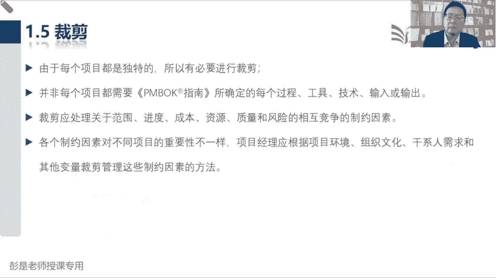

好了后面这段文字也不考，大家基本上都给大家反复讲过。

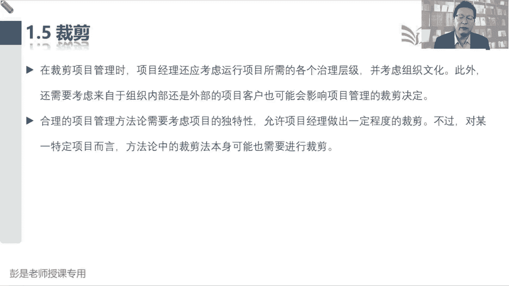

咱也不念了，不浪费时间了啊，习题做完还有别的题吗，有有有多的是好，接下来看看裁剪知识点掌握。

掌握到什么什么什么程度啊，好54321，大家现在现在思路应该OK了啊，说项目管理知识体系，是一部公认的项目管理标准，规定了项目管理的方法过程和做法，从而可以怎么样呢，A成为可以共享和反复使用的规则。

实现项目管理中的最佳秩序，这是对的吧，它可不可以共享呢，可以对不对，他能不能反复使用呢，可以啊，能不能帮助我们实现项目中的最佳秩序呢，这里良好实践的可以啊，所以A是对的。

B选项说成为具有强制性的项目管理规范，这过分了吧，对不对，所以它排除掉，这不是一个强制性的强制性的标准，那我们要裁剪的，我们要量量体裁衣，C选项说可以不加修改地，运用于任何行业的项目管理，那也不对吧。

不能不修改啊，不能不能招本宣科呀，需要裁剪，所以BC都是在说裁剪，那就把它排除掉了，D选项说成为对项目管理知识体系的完整描述，这话说的太大了，如果是完整完整描述啊，完整描述真要完整描述的话。

这本教材可以等身高了，可以跟你身高差不多了，所以他不是，他是把适用于当前这个时代，当前这个时代大家工作中经常用的知识抄过来，变成我们的教材，所以呢D选项不对好。

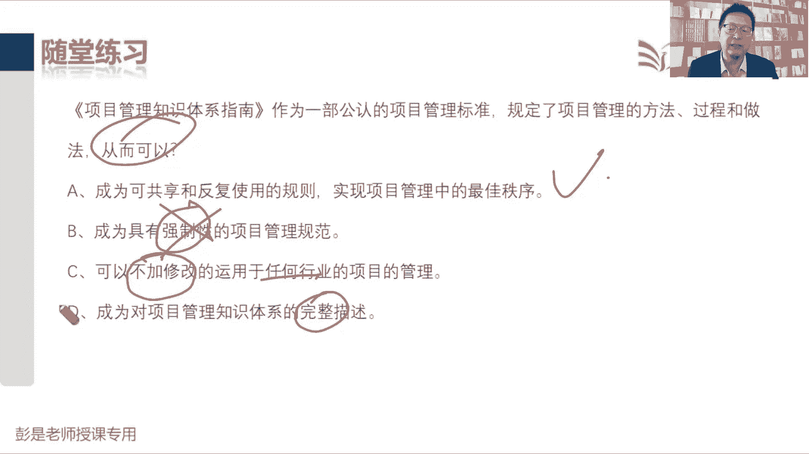

所以最合适的选项就是A，再看看这道题选啥呢，准备了啊，54321这道题，这道题第一次做，经常做呀，先搞清楚啊，我们这个约束是什么呢，什么叫约束，什么叫约束的强制性要求，就这这这个意思吧。

公司规定必须九点钟九点钟到公司上班，诶，这就是约束啊，那我们如果迟到了，如果迟到了，只会受到惩罚，对不对，好，那说一个干系人，我们在运作一个数据中心安装项目，他发现干系人很恼火，因为超出了预算。

这是违反了什么约束呢，这好理解哈，说你要你要帮我买瓶买，中午帮我买个盖饭，买个盖饭不要超过十块钱，结果你买回来要20块钱，这不超预算了吗，这就违反了成本约束，所以呢D肯定不是答案。

那原因是人员费用高于原先的计划，另外项目结束时，服务器未能提供干吸人所需的空间，未能提供干系人所需要的空间，这违反了什么约束呢，那肯定是资源这行很容易判断啊，他是不是也是质量约束，是不是也是质量约束。

想这个道理，你随便换场景去理解这个玩意儿对吧，我说你买一瓶买一瓶买一瓶82年的拉菲，它里边应该是一，我也不知道多少啊，600ml，结果一打开瓶塞啊，发现里面只有10ml啊，少这么多呀，这质量不过关呐。

诶它是质量吧，所以它既是资源需求，也是质量需求。

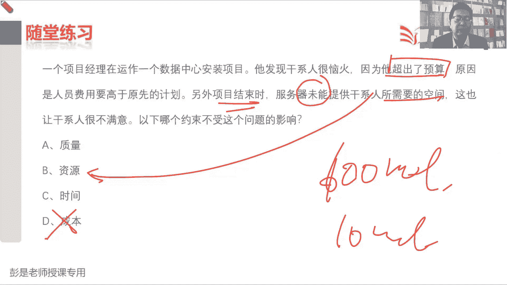

即使即使资源需求，空间为什么是资源呢，空间为什么是资源物资啊，你打车需要五个座位，这是不是资源需求，对不对，你开会说我们这个会议室啊，需要需要能坐100人，这是不是资源需求，这是不是是不是资源需求。

是啊，所以它既是质量也是资源，你买手机，我说我需要一个128G的。

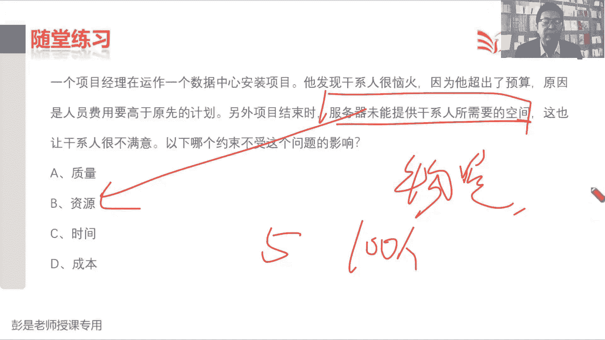

这不是资源需求吗，结果拿到手机啊，发现可以使用的空间，可以使用的空间只有十个G，你会怎么说呢，质量不合规不合格呀，所以未能提供所需的空间，又违反了质量，质量约束，又违反了资源约束。

那么为什么为以下哪个约束。

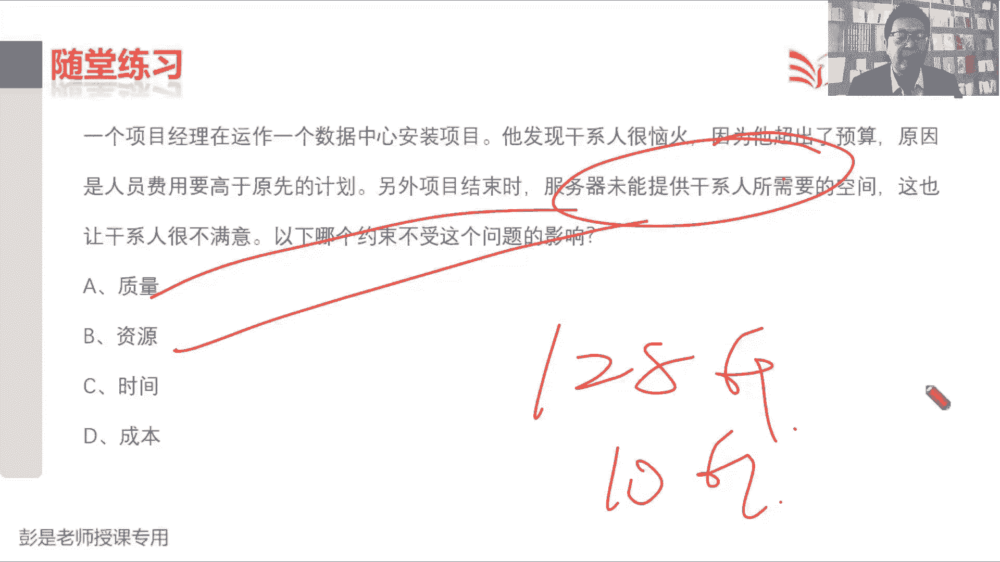

不受这个问题的影响，他没有提到说迟到了，没有提到说迟到了吧，好所以呢答案是C，判断判断去分析一下就可以了，现在没现在现在现在没没超时，对不对，题目通过题目，题目通过题目没有判断说现在项目延期了。

判断不出来，对不对，结果不是要花更多的时间去返去返工吧，但是现在还没返工呢，对不对，现在还没有违反时间约束，另外你也判断不出来以后，就真的会违反时间约束，对不对好，所以答案是C，慢慢绕了一下啊。

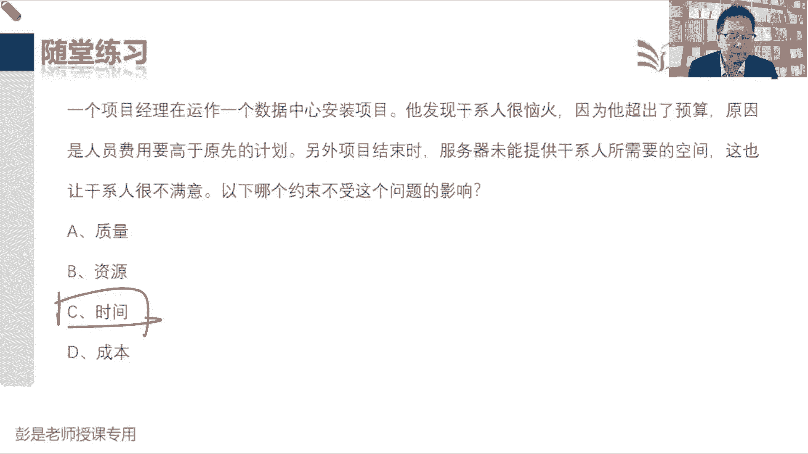

嗯这道题呢再看看，资源需求经常跟质量有关的，通常，通常，这道题继续弯弯绕，哎贝特尔同学已经找到答题的答题的思路了，千万不要多想，一多想就容易想歪了，好这道题大家第一次做的时候通常会纠结啊，正常啊。

54321买定离手，说项目开始时的时候，我们得到一个日程安排，其中给出了每个人的度假计划，他发现由于这个软件会交付给质量评价小组，如果恰好恰好在质量评价小组成员假期重叠时，提交软件。

就很可能存在质量问题，因为就这两个字超重要，因为在软件投入生产阶段之前，没有人对软件做测试，导致问题根本的原因就是因为没有资源，人和物在项目管理领域统称为资源，人呢就是指的我们的团队成员。

物资呢就是那些什么电脑啊，设备设施啊这些东西啊，对不对，大家上班需要需要办公桌，需要需要凳子，需要座椅，需要电脑，需要网络，需要卫生间，这都是物资，这都叫物资，那根本原因就是没有人。

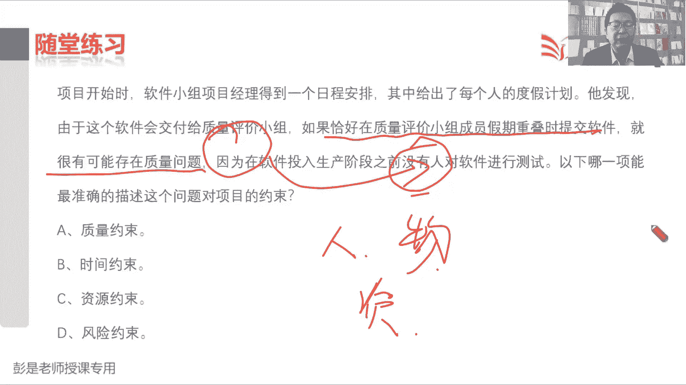

根本原因就是没有人，所以呢是违反了资源约束，受到资源的限制，受到了资源的约束，嗯好，所以答案是C，其他选项都不对，根本原因，根本原因导致此问题的根本原因就是因为没人，前面其实都是烟雾弹，都是干扰因素。

不多想不多想啊，越想越纠结。

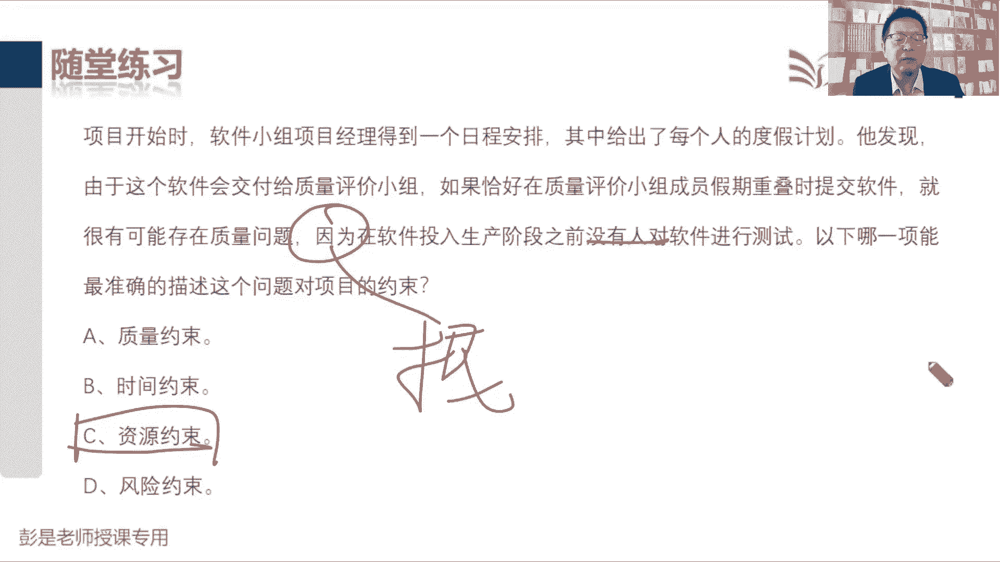