# 2024年最新版PMP考试第七版零基础一次通过项目管理认证 - P71：模拟考试（91-180） - 慧翔天地 - BV1qC411E7Mw

说呀战会上有人指出一个障碍，导致有人活儿干不下去了，我们发现障碍是由一个技术问题造成的，项目经理应该做什么，优先处理这个关键障碍因素呢，A脑报解决这个问题，将解决方案添加到冲刺中，B为成员解决问题。

C找供应商，D指导成员提出自己的解决方案，并将之添加到下一个冲刺中，选哪个呢，这这排除法了吧，就A了，脑爆来解决问题，添加到冲刺之中啊，我以为我卡了，没人有反馈意，反对意见过了啊，一下一下一个。

现在活儿干不下去了，现在活儿干不下去了，为什么添加到下一个冲刺呢，不确定是否下一个迭代了吧好所以鼓励呀，别别只别只找一个知识点啊，每道题一定是很多知识点结合到一起啊，这种下一个下一个通常不靠谱B呢。

为什么我们要去为这个成员解决问题呢，哪报啊，这问题到底谁解决，我也不知道啊，好所以B直接排除掉。

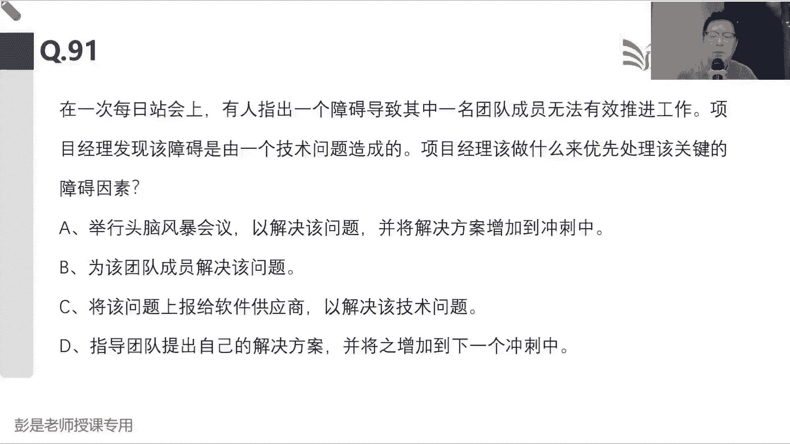

就是二，谁说技术问题就一定是有软件商呢，做饭有做饭的技术，看病有看病的技术，你怎么就确定是软件供应商呢，好92，你的项目管理体制经验告诉你，对于成本偏差做出的不正确的反应，可能会产生质量或者是进度问题。

或者不可接受的风险，前面都是废话，控制成本，工作重心是什么呢，监控过程组那一大堆事情是啥呢，绩效和变更绩效呢就是看看工作做得怎么样，变更呢就是不好的变更，尽量的不让让它不发生，少发生好的变更，好的变更。

想办法促进他，所以就是A了，B选项一看就是规划干的事，C选项一看就是规划干的事，D选项一看就是规划干的事，直接排除了。

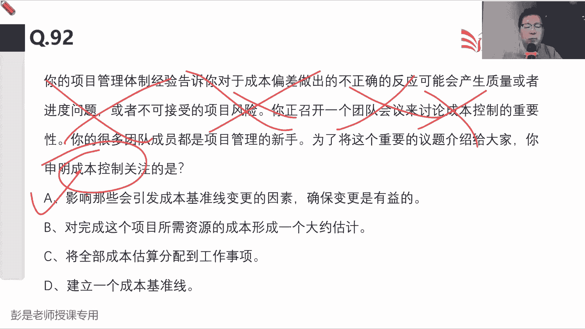

93在敏捷团队之中，一个人的吞吐量是不相关的，专注于一个人的吞吐量可能是有风险，因为就是有人干活快，有人干活慢对吧，关只关注一个人的对吧，咱大家知不知道什么木桶理论呢，就这东西啊，有长板有短板。

我们要看看整体啊，所以呢就是A吧，为其他成员造成瓶颈，B增加冲刺时间不一定不一定，冲刺过程中也不能改这个时间的，这也不是范围蔓延的。

也不一定增加成本，但确定的是瓶颈好，94，94变更批准批准审批，审批拿到审批结果就两步了，更新通知改写，找选项就可以了，说CCB拒绝变更，排除掉B更新通知钢琴，其他选项不合适，变更，经过审批。

拿到审批结果，更新相关的资料。

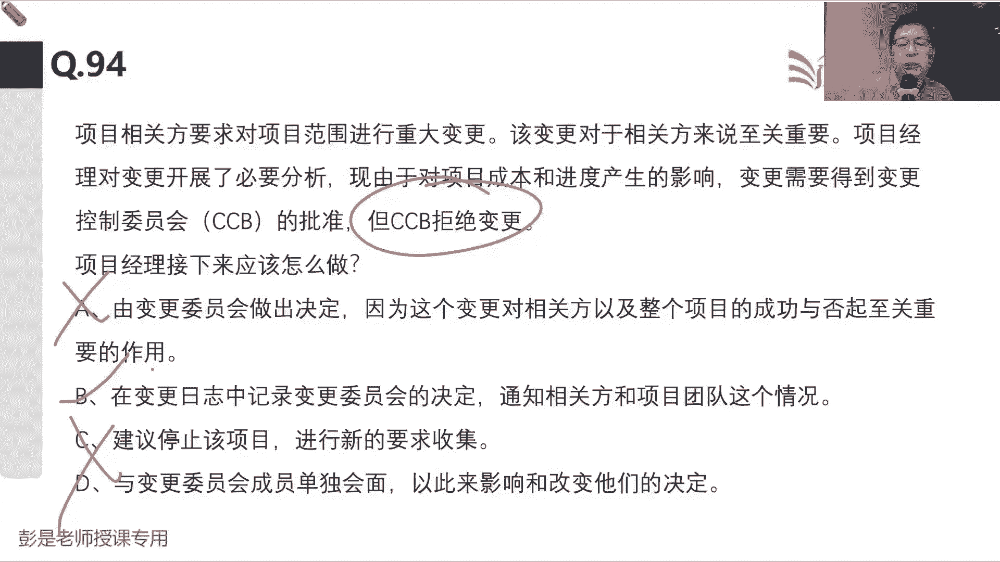

更查后通知干写好，95嗯，为啥会造成瓶颈，不太记得了，就是这例子也不好啊，现在在答疑的过程中，很多人是这个理解水平，有的人呢是这个水平，这就平静，就对我们的工作形成了阻碍，就这道理好，95。

一个新资源加入一个迭代型的项目团队，项目经理注意到这个人无法按时完成，可交付成果怎么办呢，能力不行，水平不行，治病救人呐，所以这是C了，为成员提供指导，解决技巧低，好又来瓶颈了。

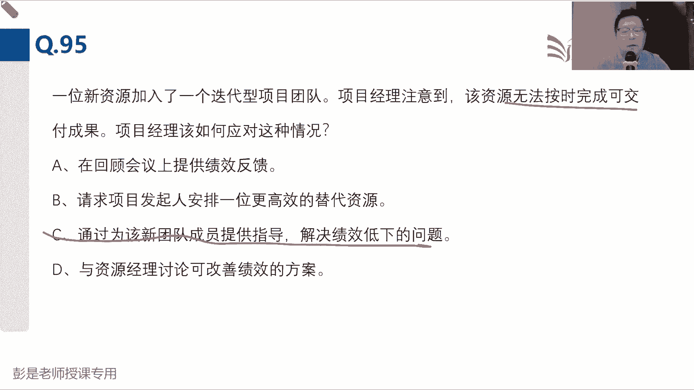

为啥要告知成员呢，因为比其他选项好，因为比其他选项好，因为对其他选比其他选项好。

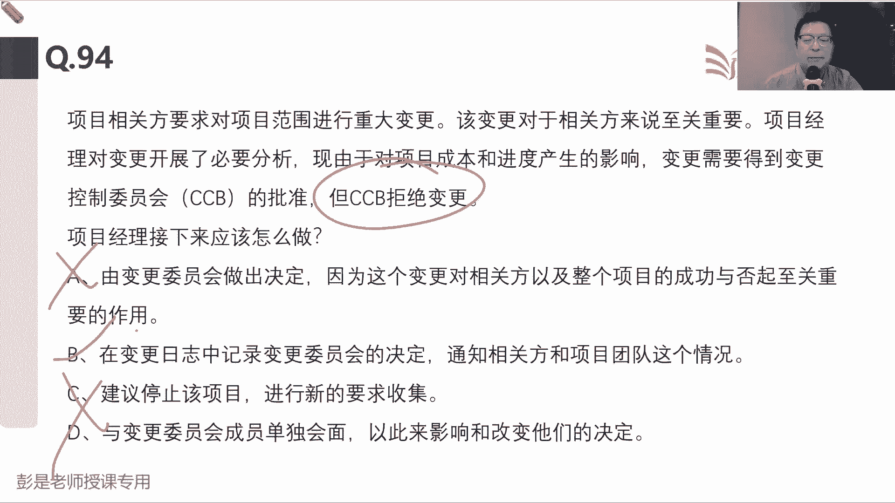

没有更合适的选项了，好九十六九十六啊，说你们准备一个新项目，需要从其他项目中分出资源，因为你的部门目前正在全负荷生产，从其他项目中拿出资源，一定会拖延其他项目，你从下列哪个项目中拿资源是造成的影响最小。

从其他项目拿资源影响小，给了ABCD，为什么答案是A呢，哎前面说过这个知识点了吧，没章程说明，没授权，没授权，那占用四种资源不合规不合法，他没有权利动用组织的资源完成项目的工作。

就你坐火车发现这人没票没票，乞丐乞丐对吧，把座让出来，就这个道理啊，没有这个合法使用资，没有这个使用资源的合法性。

好97，说某公司，某产品公司，正在改革产品开发和市场发布的方式，高管认为这是个高风险的机会，而且该计划必须成功，在这种情况下，我们应该怎么做呢，改革产品开发市场发布高风险还要想成功，那就探索呗。

找选项A制定沟通计划，排除掉，B制定包含明确的可交付成果的详细冲刺计划，排除了敏捷里面怎么可能有详细的计划呢，C采用迭代型的推出方法，尽早就这就这东西就这种意思吧，要做的事这么多，要做的事这么多。

以价值为导向排排序，优先完成价值交付，D针对该新假设，新模式的假设，开发商业论证商商业论证，这活儿归谁呢，发起人，所以能选的就是C了。

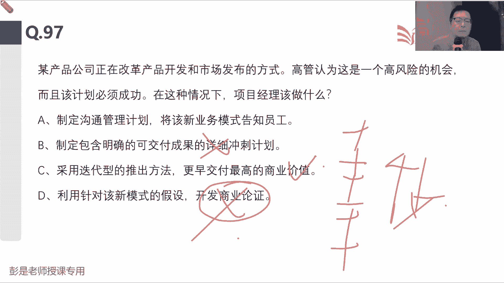

98这也可以过了吧，这么多人，并且题目非常友好啊，需要和三个人沟通，我需要和三个人沟通，一共几个人呢，44×3除以二，所以告诉你有六条沟通渠道，现在来了个新人，那就是5×4除以二，N乘以N减12。

所以呢答案是B10个。

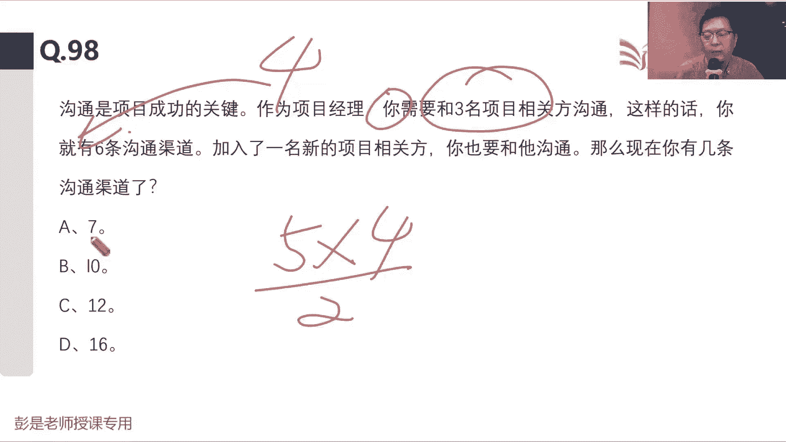

99，项目经理正在为一家大公司管理一个创新项目，项目经理计划把电子邮件作为主要的沟通渠道，但是呢，PO更喜欢使用另一种经批准的沟通工具，而非电子邮件，那咱应该怎么做呢，这种题咋选啊，需要操这个心吗。

爱用啥用啥沟通技术，爱用啥用啥呀，对吧，你爱打电话，打电话，爱用邮件，用邮件，爱用微信，用微信，爱喜欢喜欢钉钉就用钉钉，因为根据题目目前的描述，我们没有办法判断说他们使用不同的沟通技术。

会对工作形成障碍，形成阻碍，判断不出来吧，对不对好，所以A选项说根据产品负责人的偏好，更新沟通计划，并就这个了吧，沟通风格评估，沟通需求评估风格就是偏好啊，B请求产品负责人使用电子邮件。

因为使用另一种工具会增加工作负荷，没有办法得出这个结论嗯，C建议团队开始使用PO建议的沟通工具，PO喜欢用那个，然后你你用邮件爱用啥用啥呀，为什么要建议使用PO的呢，不确定，D联系发起人请求集。

什么时候是发起人不干这个活儿，所以能选的就是A，这几实际工作中不都这样吗对吧，人家需要用，人家善喜欢使什么工具，尤其是关键成员，关键人爱用啥，用啥判断不出来，现在这个现象会对工作形成障碍。

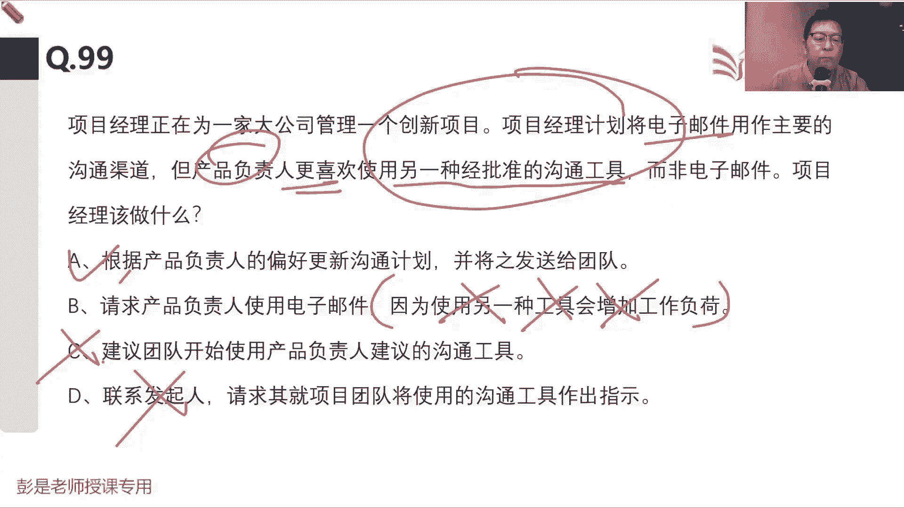

好100。

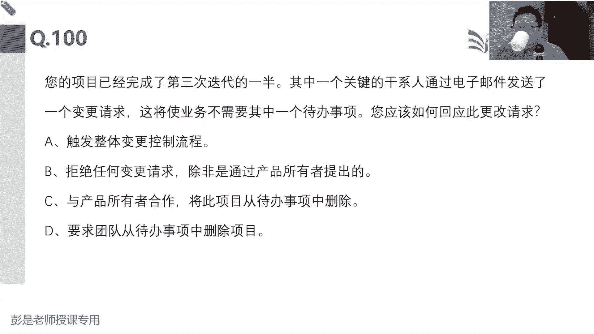

C又一刀切了吧，建议团队使用产品负责人建议的沟通工具，人家爱用啥就用啥就变成大白话呀，咱团队用电子邮件跟PO沟通，用微信，给P个好被批被批准的目的是告诉你啥呢，哎合法，所以不要操这个心了。

不要操这个心了啊，就告诉团队，你们用微信连CPO就完了，也不一定说咱整个团队都用微信，对不好。

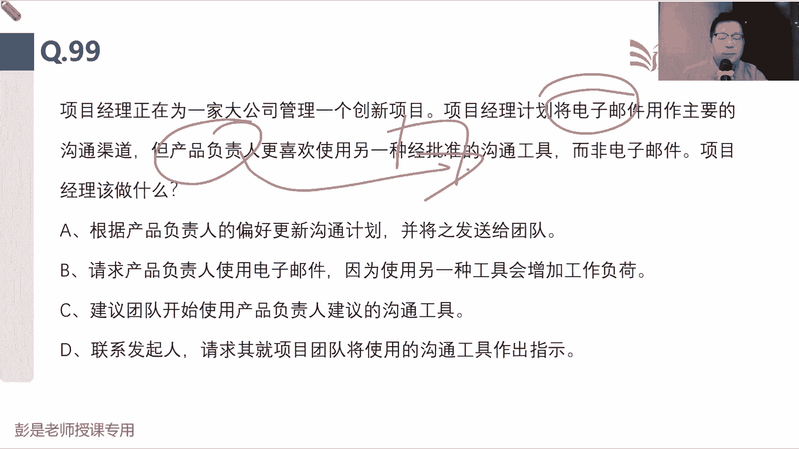

100，说您项目已经完成了第三次迭代的一半，一个干净，关键干系人通过电子邮件发了一个变更请求，这使得业务不再需要其中一个待办事项，你应该怎么回应这个事了，找谁呀，敏捷里面变更。

敏捷里面的what都找PO，所以是C和产品所有者合作，将此从将此项目从待办事项列表中删除，找PO，找PO产品所有者来创建和维护产产品，代办事项，拒绝拒绝拒绝这个操作也是谁干的，PUPU干。

所以排除掉敏捷里面没有这个玩意儿，没有整体变更控制流程，团队不能删这个东西，PO删，只要沾到这个单词就找PO做决策就可以了，敏捷里边没有变更控制，没有实施整体变更控制。

这个管理过程去看一看敏捷那部分知识点，亲看看里面有没有写实施整体变更控制，没有没有再说一遍啊，精讲课和敏捷课，你只要两个听一个其实就可以了，反复讲反复讲啊，所有的东西不管是啥都叫变更。

这玩意都是找PO放回产品代办事项好。

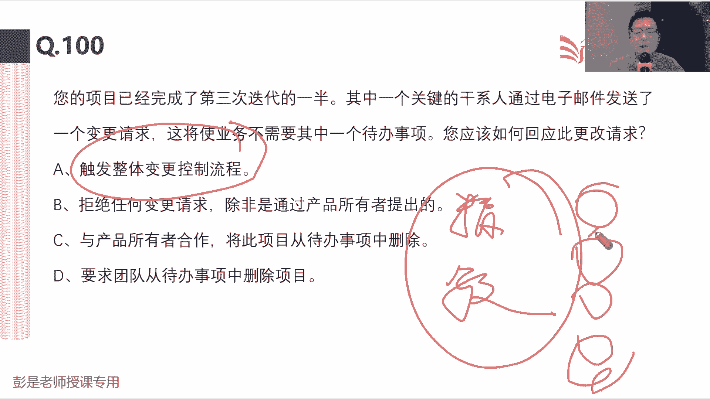

101，说大型计划的项目发起人，不断地改变多个模块化工作包的优先级团队，已经习惯于采用三周的冲刺，对每天都会发生的范围变更日益沮丧，我们应该做什么呢，这能不能判断出这个人神经病。

现在可不可以判断出发起人神经病，不断改变多个模块化，不断不断不断，每一天都有变更对吧，每天都有变更啊，翻脸不认人，能判断出来吧，找选项A按天计算冲刺除夕，这是排除掉啊，不敢B和发情人开会向其解释。

严格保持冲刺周期的重要性，这可以吧，不要天天改，天天改，这好谁家好人天天变，就这道理啊，天天改咱也受不了啊，C转而采用看板策略，这个排除掉排除掉看板，看板的目的是什么呢，过程流程可视化。

便于及时发现阻碍，D和团队开会就后续行动向其征求意见，谁负责帮助团队排除阻碍呢，撇开敏捷教练，那没有敏捷教练就找项目经理，可不可以呢，可以啊，所以就是B了，这是必答啊。

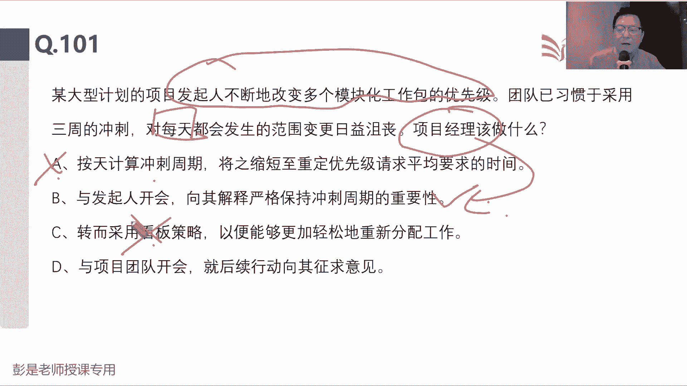

好102，话语权高就一定听吗，话语话语权高就一定要听吗，化学化学跟你说啊，明天早上九点钟去天津，09：10分去上海，9。15去广州，你听吗，题目就在说这个意思吧。

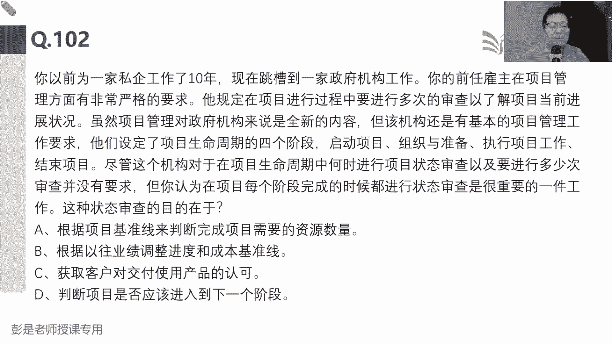

随时改随时改随时改，已经告诉你了，作对吧，团队士气受到了严重影响，每天都有范围变更啊，太累了好102。

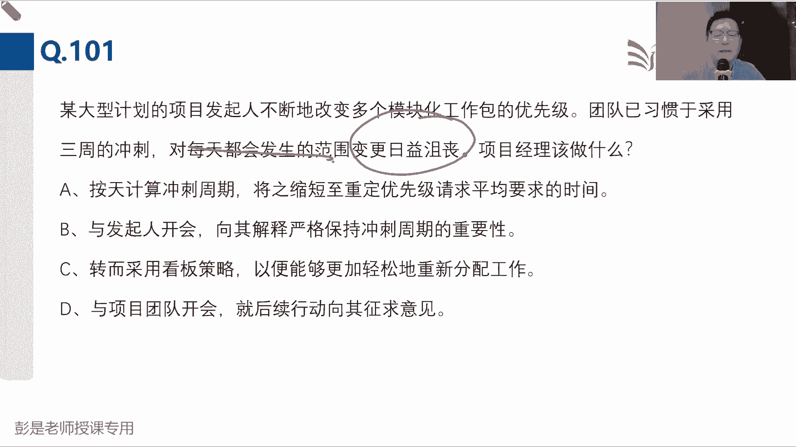

102，记住答题小技巧啊，如果题干太长，先看最后两行，两行说你认为在每个阶段完成的时候，进行状态审查是一个很重要的工作，这个审查的目的是什么呢，考点叫啥，那个术语叫什么来着，阶段关口对。

判断这个阶段判断我们还有没有可行性，还有没有价值，用理想和现实做比较，展望未来分析，继续干，继续干，还有没有价值啊，赚钱不赚钱的，所以是D判断项目是否进入到下一个阶段。

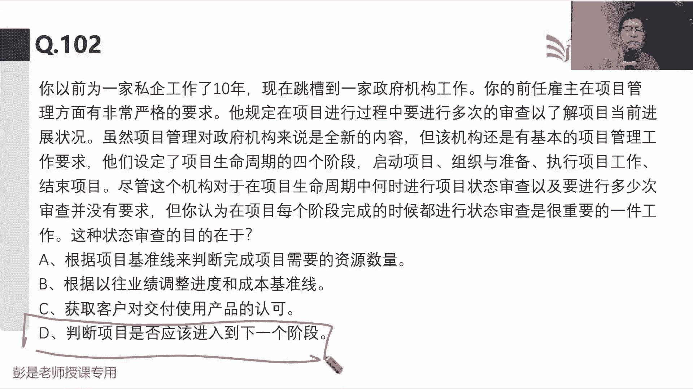

这是阶段网口啊，关键决策点103，103说一个产品开发项目的工作，分解结构有四个层级，这这简单吧，有WBS，然后有了WBS之后得到了范围基准，我们定义活动得到了活动清单，排列活动顺序诶，就有了网络图。

并且呢估算活动持续时间，还做好了进度表，进度表就是我们那个项目进度计划，Schedule，项目进度计划，制定进度计划的输出，接下来干啥呢，做好了项目进度计划，找关键相关方敲定所有的时间日期得到批准。

咱就有了进度基准，所以就是D了，其他选项，这已经过去了，过去了还没没要控制进度的啊。

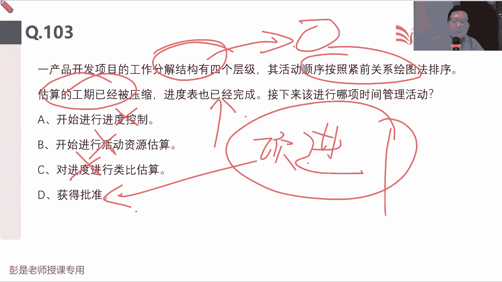

这题隐晦吗，这题我觉得送分题啊，这送分题吧好104，批准以后有基准按照基准去执行，再监控啊，流程不清楚啊，回顾课程了啊，104，这个简这个简单吧，不简单，您为组织，您负责为一个组织设计一个新的经验教训。

管理系统，作为项目的一部分，您需要咨询一些高级干系人，并评估他们的需求和要求，然后您必须促进就系统功能，工作流程过程和程序达成共识，一旦开发出这个玩意儿，就必须在整个组织中推广。

所有员工都必须接受有效使用该系统的培训，您已经选择混合型生命周期，那么项目的设计和建造阶段，应该采用以下哪个生命周期，这题超阴险，混合型生命周期意味着啥，又有预测，又有敏捷，好说，这玩意儿一旦开发出来。

必须在整个组织中推广，所有人都必须接受培训，这是用什么生命周期类型，预测行吧，那倒推项目的设计和建造应该用什么呢，所以选敏捷这道题比较恶心啊，比较阴险啊，嗯大家随便带场景啊，就现在你们听课的这个小合同。

这个小额通对吧，包括老师这边管理后台和你还有学员端，一旦把这个软件做出来呀，必须给大家培训，对不，在整个组织中培训，所有人都要听这个东西怎么用，这是预测吧，因为培训出呃开发好的系统，开发好的系统。

教大家用是不是确定的对，这是一个确定的环境啊，所以这个时候用预测，那就倒推其，所以他其实根儿啊就是玩数字游戏，文字游戏了啊，数学知识，这是混合型，混合型等于预测甲敏捷，然后又告诉你这个东西是预测倒推。

剩下的就是敏捷，这道题比较阴险，敏捷就是迭代加增量。

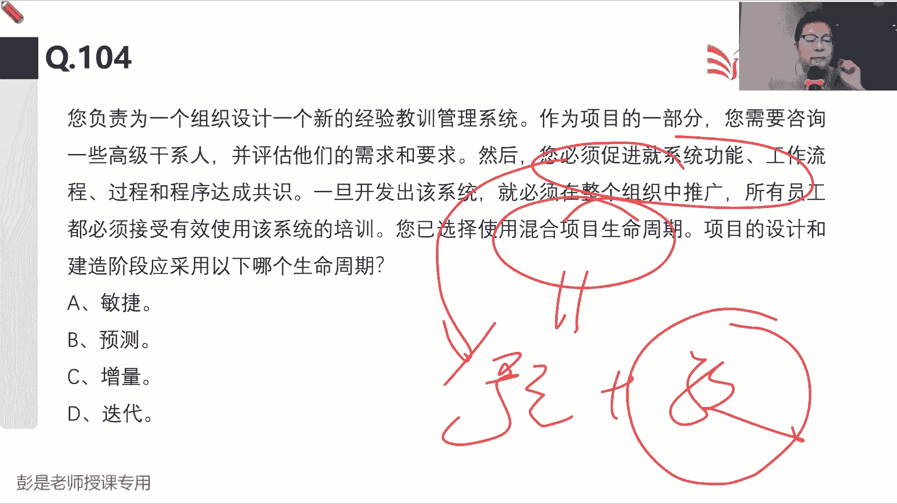

敏捷就是迭代加增量，好105，说几几个月以来，一直在开展一个项目，但核实完成不明确，因为随着新情况的不断出现，范围经常变化不定，有一些成果已经完成，新相关方加入团队的时候。

他们抱怨这个玩意儿不符合业务目标，如何才能才能防止未来发生这种情况呢，那就不求大而全，但求小而美，小而精呗，不直接干汽车呀，先把滑板车做出来呗，来确认一下需求是不是满足要求呗，成果是不是满足业务需求。

A创建详细的工作分解结构，排除掉范围经常变化不定，这种环境下传统的方法不好使啊，B创建优先级已经确定的待办事项列表，和相关方一起进行迭代审查会，这没错吧，前面是解决需求变化的问题。

评审呢是看看成果是不是，成果是不是符合业务目标，B是对的，C安排每日例会排除掉，D安排每个阶段的启动位排除掉，需求变就是待办事项列表对吧，不符合业务目标，咱就小铺快保做出东西。

通过评审会审查会看看是不是你要的东西。

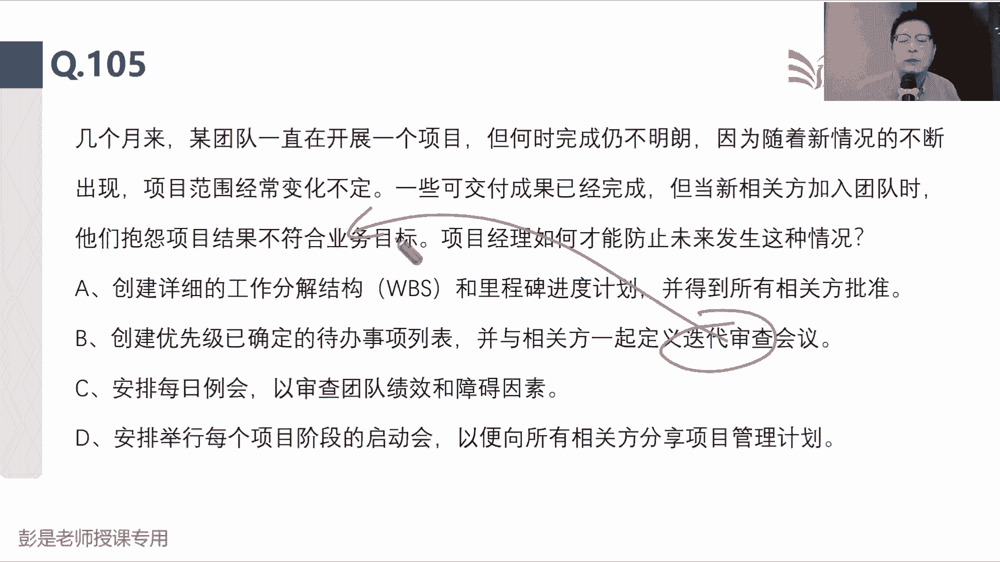

所以呢是B，106说，您的项目执行到阶段第三周的时候，注意到关键路径上的一项任务可能会延期，进一步调查后发现是由于两个人意见有分歧，说要避免这种情况，我们事先应该做什么，选啥。

规范阶段成熟RACI需求跟踪矩阵，这道题最后的根儿是为什么呢，为什么选C呀，三个和尚没水喝呀，三个和尚没水喝不就耽误事吗，对不对，两个成员对于特定的工作包意见有分歧，影响了进度，权责不清啊，哎所以是C。

需求跟踪矩阵的作用是啥，跟这跟这道题没关系吧，需求跟踪矩阵跟这道题有关系吗，现在说进度延误，由于分歧导致延误进度，张三不听李四的，李四也不听张三的，他俩在那掰扯啊，张三说去吃麦当劳，李四说吃肯德基。

权责不清，讨论一天可能也没结果，那不如让一个人能做主哎，所以是RACI责任分配矩阵排除法，需求跟踪矩阵，确保做到价值交付，对于做决策这个事好像没关系啊，RCI在第几页啊。

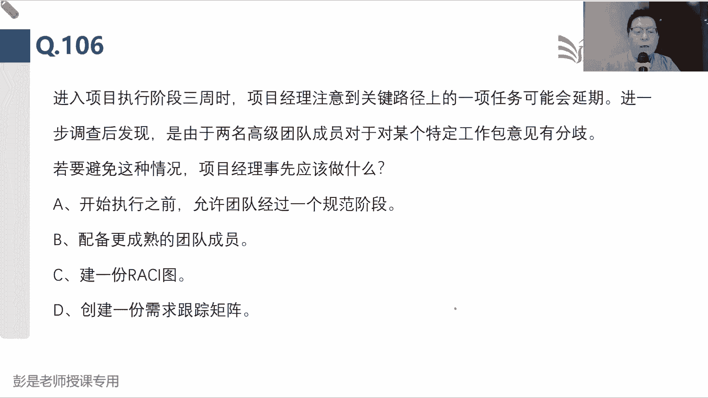

不知道啊，在教材上资源那一章吧，规划资源管理好，107，说对于特定的外包项目，我们决定在主协议中保留大部分固定项目，比如保修仲裁，然而范围进度，预算等更具动态性的项目，可以通过以下哪一种方式正式化呢。

这道题纯粹考那个知识点，规划采购管理输出，招标文件，供方检测标准，独立成本估算和采购工作说明书，这个东西通常作为合同的附件，对不对，主协议不就是合同正文吗，然后sow通常作为合同的附件。

那这东这这东西这东西如果具有动态性能，那就请两级呗，轻文档轻规划，对不对，大概写一写，所以呢这是D，因为传统项目我们写采购工作说明书，关于我们拟采购的产品服务成果的具体要求，会写得很规整很很标准。

很规范，对不对，但是在这种多变的环境下，哎那咱这个文档啊就该精简的精简精简简洁，就叫轻量级，因为题目刻意说了。

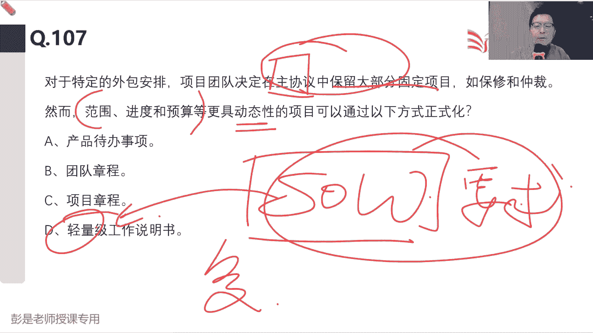

这东西动态呀变化呀，好108，108送分题可以不说了吧，哪项文件应该在项目章程前创建呢，效益管理计划就是C，虽然实际工作中是有D这个玩意的啊，D这东西现在在输入里算合同的附近。

D这东西在合同里是合同的附件，这是项目工作说明书，甲方给咱的采购工作说明书，对咱来说就叫项目工作说明书，这玩意其实也有的啊，只不过现在作为合同的附件好，所以回到这道题，这是纯粹考输入的。

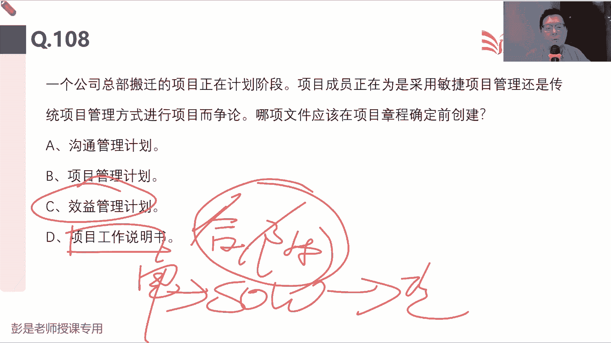

这是C效益管理计划，109说项目经理如何制定项目管理计划，以保持项目持续交付预期效益，这个人狠话不多，什么叫持续交付预期效益，对每次发布进行集成测试，测试是保证这东西正确性，完整性好像和效益没啥关系哈。

将整个项目团队纳入测试，向发起人澄清项目效益C好像说反了，D确定各个工作产品的目标，这三句话最后以理解在规划过程，规划过程如何如何确保项目持续交付预期效益，这是什么呢，产品，产品路，线图啊。

我们要有产品愿景，根据产品定产品路线图，MVP第一版，第二版，第三版，以此类推吧，去设计一下，规划一下产品未来各个版本是什么东西，然后再定产品的发布计划，定产品的发布计划就敲定时间，什么时间发布第一版。

什么时间发布，第二版，以此类推，所以能选的就是D确定各个工作产品的目标，这是我们的路线图，这是个滑板车，这是个自行车，这是个摩托车，以此类推啊，产品路线图是不是工作产品的目标呢。

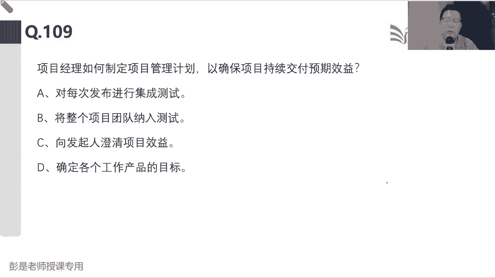

且听会风云同学好，110，目标造一个滑板车，目标两个月造个摩托车目标现在造一个新能源，再往下造SUV，以此类推，111，一家施工公司为一个建筑项目采购，召开投标人会议，收到投标人建议书并评审。

其中一家供应商提出非常优惠的价格，但是呢我们分析一下这玩意不现实，接下来应该怎么做，投标人会议做澄清，然后人家给他报价很便宜，但是呢你分析啊，这个不靠谱，说明什么呢。

考的是书上那个独立成本估算那几句话啊，什么情况下双方的报价会有差异呢，咱没说清楚，人家误解了，或者是不能完全响应我们的采购工作说明书，就想想那个笔记本的例子，例子啊，我想买个笔记本，预算是两块钱。

供应商报价两块，我预算2万，供应商报价两块是什么呢，我心中的笔记本是电脑，人家的笔记本是纸质的，说明有误解有误解有误解，那有了误解怎么办诶，让供应商提供他的估算依据呀，这是A吧，迅速签订合同。

不道德处罚条款，不道德，直接去改基准草率了，还让人家提供补充信息。

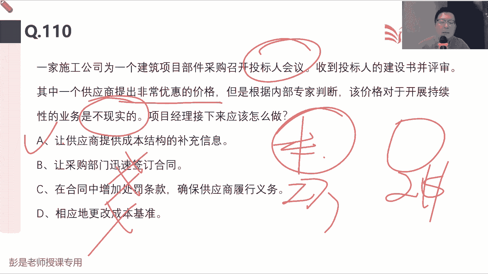

看看是不是双方有了误解，有了误会，好111说项目经理负责建设一个桥，该项目的高层级要素是使用预测型方法处理的，设计，用来收起桥梁的软件，那么是根据敏捷原则开发的，在软件开发过程中，由于缺少信息工作流程。

经常受到多种延误障碍，什么干扰怎么办呢，流程经常有障碍，有延误，有有阻碍，那咱就透明呗，透明及时的看看看看哪儿堵了，就是A了，看板具有可可见性。

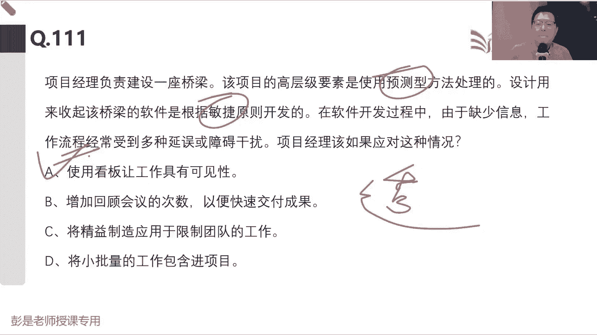

这不解释了啊，好112说，您最近被一家组织评为敏捷教练，该组织最近认识到，敏捷方法在项目管理中的好处，并且呢几个试点项目中还取得了成功，您无意中听到该组织的经理卢比什声称说，敏捷项目不需要计划。

我们应该随时准备好适应各种变化，对此你有什么看法，这好像做过了，嗯对吧，我们文档啊，计划呀，说这东西呀不太重要不太重要，不代表着说就不需要该有的，还是要有，对不对，只不过我们要简化它。

简洁它这些过程该精简的精简，这些文档的该简洁的简洁，它少花点时间，纸上谈兵，多花点时间去干活，所以呢就是C了。

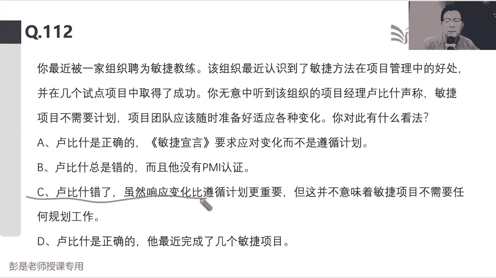

113，说您负责为客户组织部署新的供应链系统，您需要分析客户组织当前的流程和程序，与客户组织的主题专家协商，咳咳来设计状态流程，并定什么流程，根据合同规定，提交给客户的所有原型，都必须附带用户操作指南。

您的团队反对这种文档要求，并坚持只在最后我们才开发用户手册，那您应该怎么做，说要有手册，团队说最后再写，咋办呢，A接受团队要求团队协商，客户协商就这个了吧，A没错，合同合同有法律效力，对不对。

合同最大咱不能违约啊，所以就是D了，合同有法律效力，这都不用协商，对不对，除非改合同，除非改合同啊。

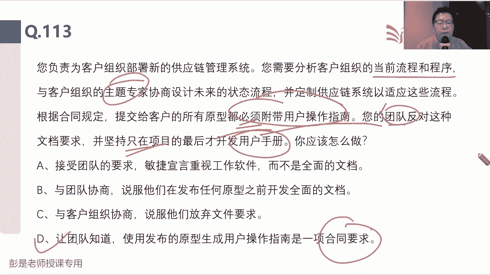

114，一个项目经理被他的项目的各种问题，折磨的狼狈不堪，我现在啊就被各种问题折磨的狼狈不堪，我想找出问题的根源，以便于把注意力放在哪，用什么工具呢，找原因找原因就用鱼骨图什么五外分析法，五外分析法。

石川图什么YY分析图，好，因果图不讲了啊。

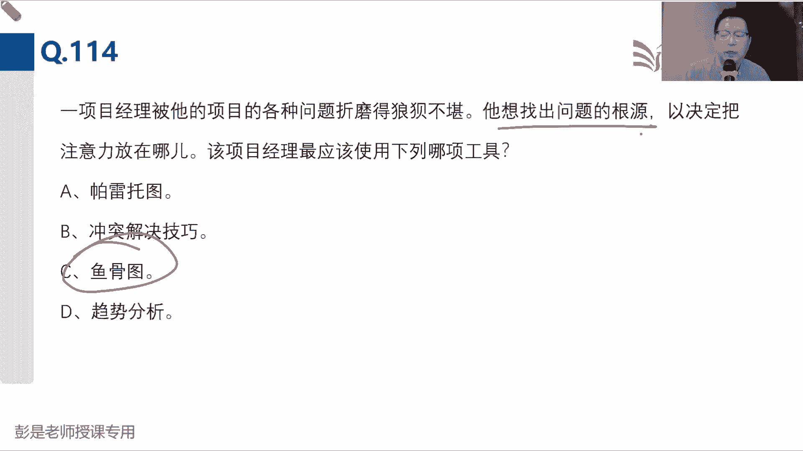

这知识点超简单的，115，在一个混合型项目之中，客户发布了合同规定的，客户发布的合同规定了每个季度的可交付成果，客户希望在第一季度展示一个有形的成果，并希望把第二个什么里程碑前移到第一个季度。

项目经理向客户解释说，这不可行，除非第二个里程里程碑的需求有所变化，应该采取哪两种措施，变成大白话，就是人家第一季度要A然后呢，希望把第二季度则B能不能弄到第一季度里面，找选项A询问开发团队。

与其讨论第二个里程碑的哪些需求，可以放到第一个季度实施，这可以吧，可以吧，根据团队的交付能力限制团队开展的工作，如果他们能干呢，还也行还行啊，并且只是询问可以的，B选项，就第二个里程碑的需求。

了解客户的优先要务，这翻译的不好，优先级对不对，优先药物优先要主要的业务需求可以吧，看看什么东西更重要，你把它细化一下，B 1b2 b 3b4，到底哪个东西优先级高，需要放到A里面呢，就这东西啊。

C告诉客户，里程碑前移会对项目成本产生很大影响，排除掉，成本影响大，你知道吗，不知道，不确定啊，不确定这东西会不会对成本产生很大影响，没有办法得出这个结论呢，D将问题上报给上层管理人员，以便解决该问题。

并提出计划排除掉，显得咱没本事啊，一说服客户将第二个里程碑保持原样，不要对之做出变更，如果AB问完了之后，觉得拿不过来再考虑E，所以相对来说比较合适的就是前两个。

好116，在生成成本绩效基准之后，我们意识到，曾丹同学，这东西不一定会提高成本的，我这个月计划每天买一个口罩，一共是30块钱的预算，我今天把30个口罩都买回来，整体预算不超支，能听懂吧。

把后边的事情提到前面来，成本不一定发生变化呀，好生日成本低效真基准之后，我们意识到项目估算的成本，超出章程中预算的成本，接下来应该怎么做呢，A建议取消项目找死，排除掉B调整WBS撤销成本较高的活动。

保留成本较低的活动可不可以呢，B选项可不可以帮助我们降成本可以，但是，能不能擅自做主呢，不能哎，不能这么干啊，C向发起人提供降提供降低成本的方案，这可以吧，D向发前寻求额外的资金，先C呗。

积极积极主动解决问题，实在不不行，再考虑要钱的，所以比较合适的就是C了。

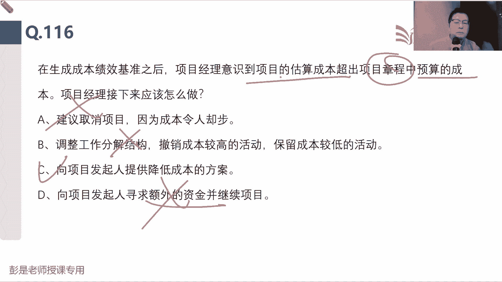

117，这纯粹那个知识点啊。

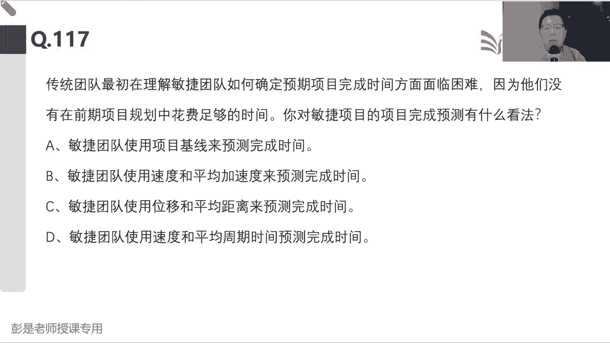

啊什么叫提供，什么叫提供学友同学好。

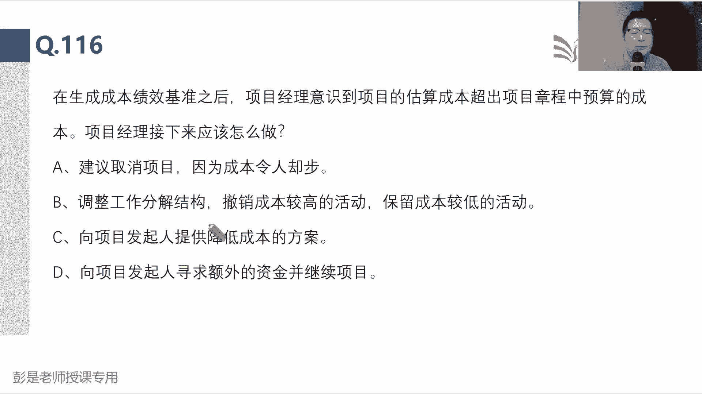

117，说这简单吧，就记住那个知识点呗，我们怎么算速度呢，什么叫平均周期时间，摊一个煎饼需要多久，就这东西吧，周期时间是完成一项工作所需要的时间哦，做一个核酸检测需要十秒钟。

哎我们使用这个东西和我们的速度去预测，这是D没有什么基准呐，什么什么加速度，这出题老师超善良啊，还有什么平均距离，这都神经病啊，没见过这个词啊。

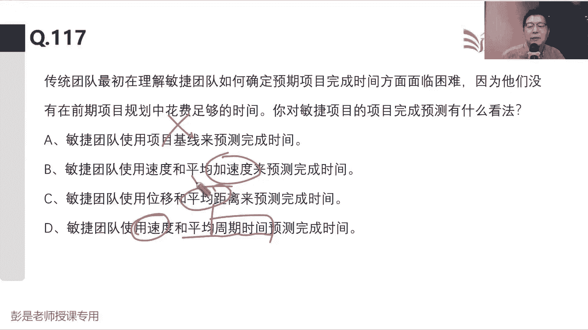

好118嗯，说项目经理被任命管理一个为期多年的项目，我们是在创建WBS的过程中，项目团队将无法分解，在后期发生的某些阶段怎么办呢，近期要完成的工作详细规划，远端的工作可以考虑粗略规划。

这种方法就叫滚动式规划，所以就是A纯概念啊，砍范围不行不行不行。

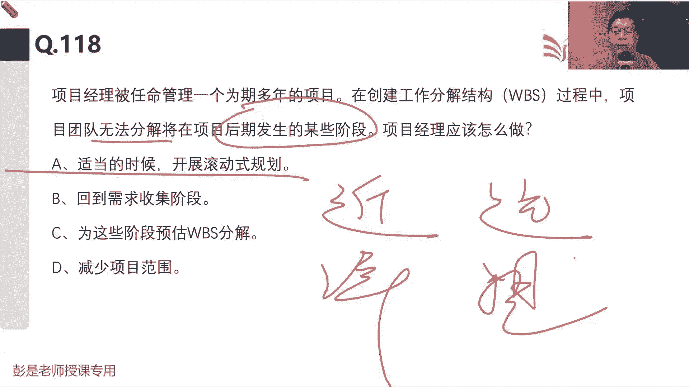

119，滚动式规划说的很好啦，119说哇，您正在管理一个复杂项目，看数据，平均每次迭代完成75个故事点，通过查看待办事项，大概还有750个点的剩余，如果每个间隔都有两周的时间。

和每个迭代周期是两周多长时间完成的，这好算吧，750÷75=10次迭代，十次迭代一次迭代两周，所以需要20周。

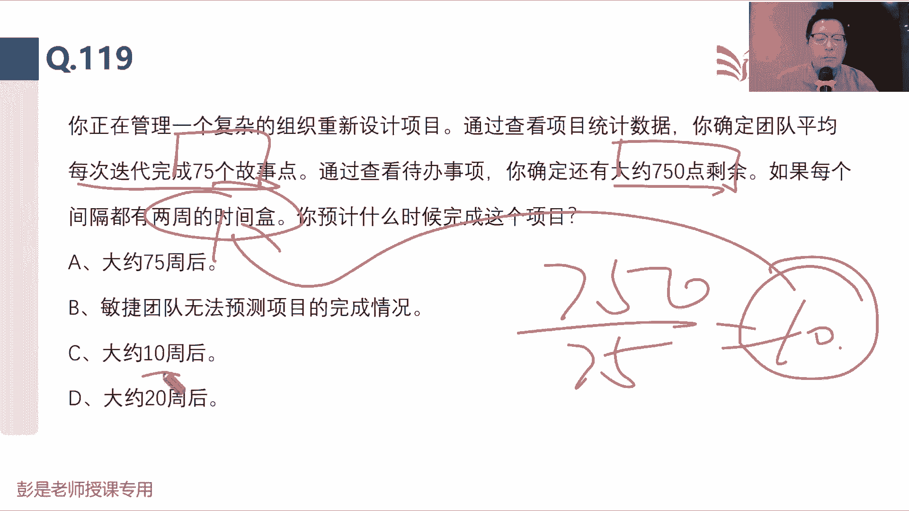

好120，这送分题吧，老大说没不差钱，不杀线怎么办，赶工，所以就是D没有钱快速跟进，有钱就赶工，因为加班加急加资源通常导致成本的上升，如果说没有钱或者是什么优先逻辑关系，软逻辑关系，就考虑快速跟进。

资源平衡肯定不行啊，资源平衡会导致关键路径变长，A是干啥的来着，A是干啥的，假设未来出现什么情况，咱能咋整怎么办，他是分析风险的。

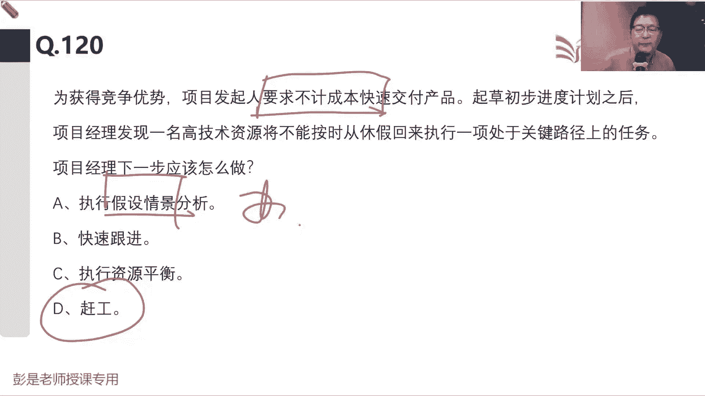

好121，说项目团队采用混合框架进行项目交付，在执行某项目的时候，团队获悉客户提出一项新的合规需求，必须先与任何其他需求交互啊，咋整，A与合规团队成员开展协作审查，并优先交付该需求可以吗。

B将合规负责人纳入相关方名单，并等这通常等就排了吧，C将该新的合规需求添置待办事项列表，这很好啊，但是一定要完整的看哦，因为技术团队无法腾出人手开展相关工作，没有办法得出后半句的这个结论。

前半句是对的啊，后半句神经病，D，让该团队将合规需求纳入当前冲刺就不一定了，所以比较合适的就是A了，确定优先级呗，排除法，排除法大部分的题都是排除法，因为它考的是什么呢。

咱考的叫项目管理专业人士资格认证，看看我们作为一个专业的项目经理，你的能力水平是什么样的，什么怎么证明能力水平呢，哎项目经理主要考的就是你的决策能力，对不对，在众多选项之中。

找到一个相对来说比较合适的选项。

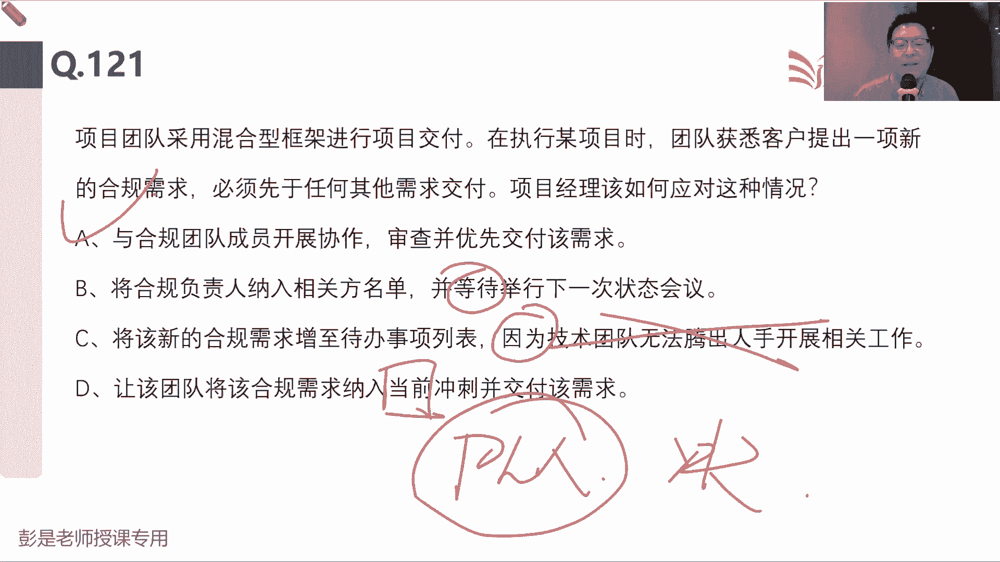

好122，说下这送分题过了吧，什么东西可前面也说过了，什么东西用来评估风险管理过程的有效性，这就找审计，如果说应对措施的有效性才是审查会。

123，您正在领导一个敏捷团队开发工厂自动化系统，您不时依靠客户反馈来验证开发系统的功能，哪个敏捷是送分题，过了吧，就一直说的那个双R带双反的，一个叫一个叫评审会，是为了获得反会反馈，一个叫回顾会。

是为了是为了反思反思过程，所以这是迭代演示，其他选项跟这事没关系啊，这个东西就对反馈。

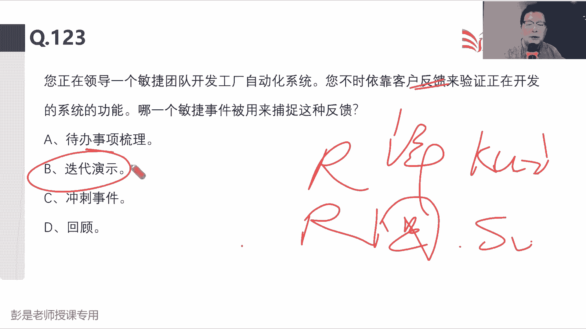

124，说项目上一个项目即将结束的时候，一部分相关方发现，你的项目会影响到他们的利益，于是提出了额外要求，使得你很不开心，很难受，将来项目怎么做才能更好的避免此类问题，不大是吗，就到了项目后。

T突然跳出来一个人，就像这样的场景，都找相关方管理就D了，都是相关方管理识别的不到位。

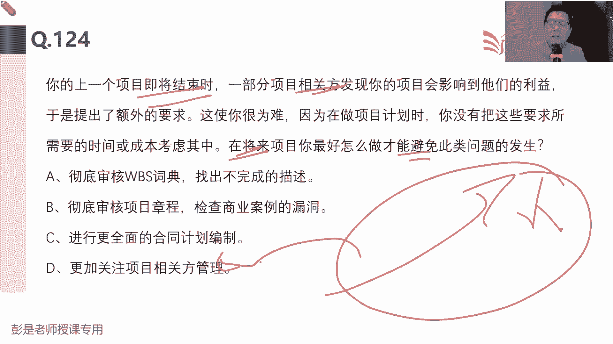

好125，大型水电厂开发项目处于实施阶段，运用混合型方法管理的，我们应该做什么，来确保执行阶段完全符合质量要求呢，规划持续看成果，分析质量要求，制定质量成政策，先把B排了吧，好的质量是怎么出来的。

好的质量是怎么出来的，对吧，人家老师都说了，预防剩余评估，预防剩余检查是咱提前规划设计出来的呀，提前规划设计出来的，所以规划质量就那几句话啊，第一我们要根据质量政策分析，我们需要达到的标准。

根据标准那就得到了一大堆具体的要求，具体的要求对待我们的质量，测量指标和测试方法，根据这一大堆东西，我们再定我们需要开展怎么做，怎么做，质保怎么做指控，所以就是A因为A包括了C和D，C和D只是一方面。

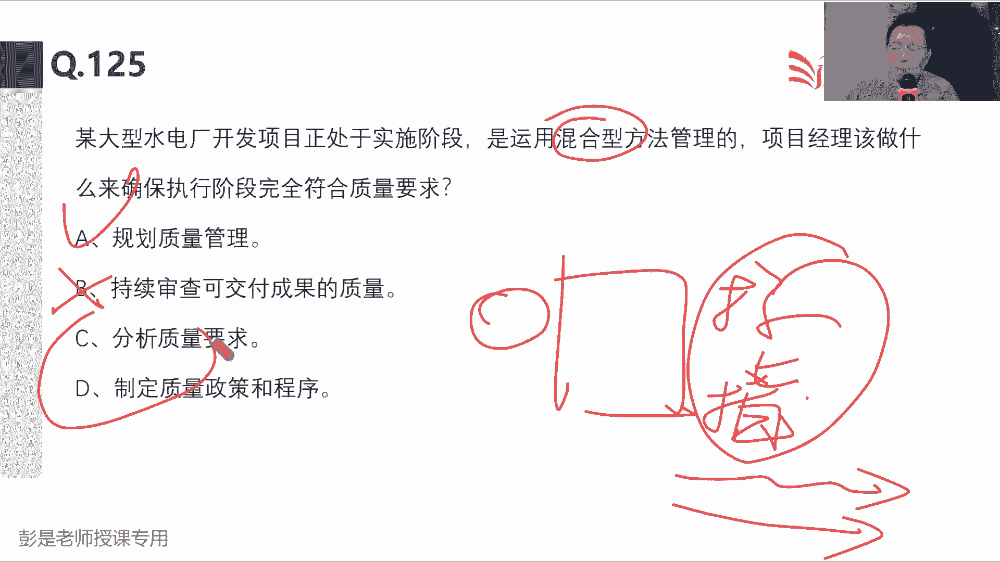

相对来说就A了，好126，根据相关方登记册和项目章程，项目的业务需求，必须从组织的各职能组获得，为了去去最终确定业务需求，要求这些职能组意见取得一致，应该用什么工具呢，哎就看到什么不同职能部门。

不同人群，不同群体就想办法去要什么，让大家达成共识，就是这个了吧，引导式研讨会书上写的那个叫什么JAD呀，QFD呀，就这种东西吧，想办法引导大家达成共识，不同人群不同职能不同文化。

这就需要引导其他这个选项跟这个事没关系啊，A是干啥的，对为聚焦问卷调查是干嘛的，收集需求，收集需求不是为了取得一致，是为了人多对吧，不在同一个地方快速获得反馈，德尔菲方法的作用是。

德尔菲方法的作用是是啥呢，是为了防止人和人之间产生干扰影响对吧，受到对方什么身份啊，地位啊，权威哎，受到这些因素的影响，但是为了防止影响的。

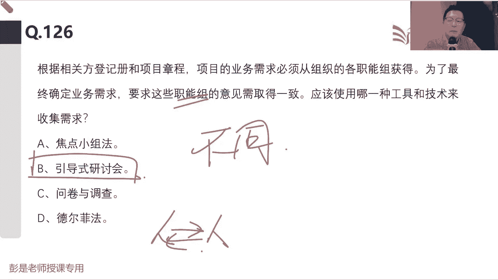

好187，说PMO啊已经开始实施迭代工具，项目经理运作一个新项目，并已经发现了一个可以使用迭代工具的机会，其中一个高级经理啊，对修改过的框架有顾虑，因为对公司来说，它是个新的框架，我们首先应该干啥。

PMO这边用新工具，我们发现了一个用它的机会，有人呢有顾虑怎么办，A和各相关方单独开会，使他们增强对新框架的意识和信任，这单独开会沟通需要资源，时间会产生成本，这好像有点浪费了。

必将该高级经理的顾虑上报给发起人，这神经病吧，排除掉，C向该高级经理发送有关该新框架优点的文档，可以吧，D了解是否有关新框架的外部培训，来消除相关方参与度低的风险，C和D哪一个看起来好一点呢。

好发文档还是让他学一学这个新东西啊，嗯还是那个道理啊，治病救人的，所以呢比较合适的就D了，A说和高级经理单独开会了吗，什么叫相关方，什么叫各相关方，这就不不确定了吧，各相关方就等于高级经理吗。

如果你认为等于我也没话说啊，如果各各相关方等于高级经理吗，这八个字没一个相同的啊，它不是一回事，但如果把它改成改成隔一选A高级经理啊，和高级经理开会，了解他的顾虑，了解他的担忧。

然后什么这还这还说得过去吧，也不一定培训啊，不一定培训的，只不过现在四个选项里能选的，就D了吧，给人家发文档，给人家发文档，和人家让人家培训相对来说好一点。

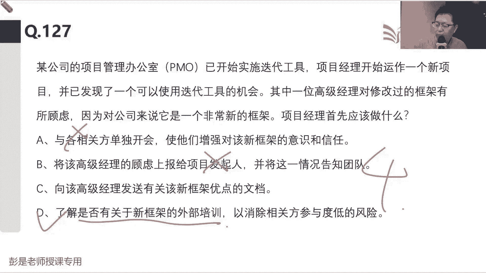

好128，潘同学，如果你认可发文档，那从现在开始我就不会不说话了，大家看书去吧。

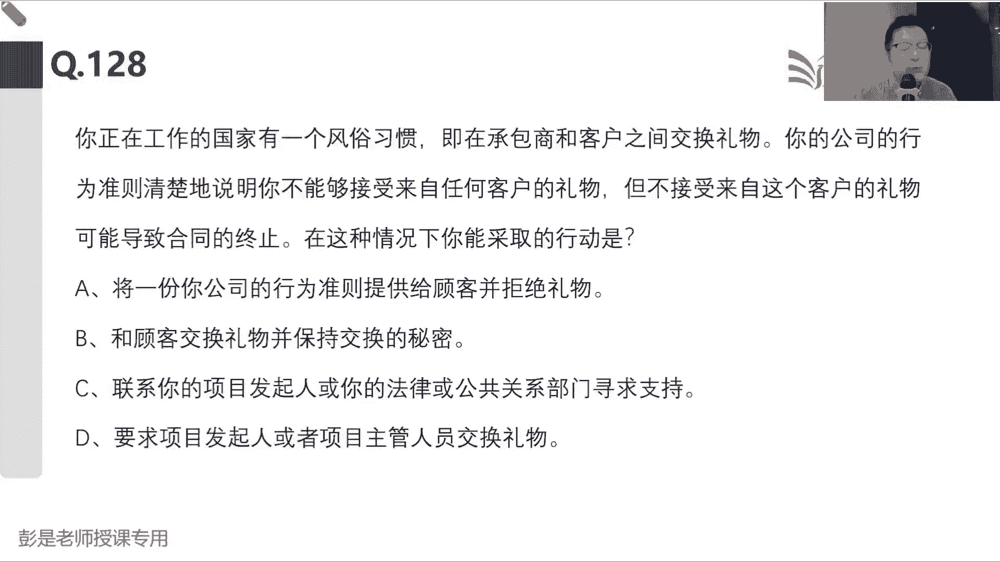

看班主任给大家发的文档，大家现在开始啊，我就不说话了啊，教材也发了，对不对，什么各种资料都发了，然后那个答案和解析都发了，诶你们看吧，我就不说了，下课了，如果你觉得不好对吧，觉得不好。

那咱就咬着牙选D就这就这个道理吧，D其实说的也不完美，对不对，什么外部培训呐，不知道啊，就不能内部培训了吗，对不对，他说的也片面不完美啊，但总比C好一点点，咬牙选啊。

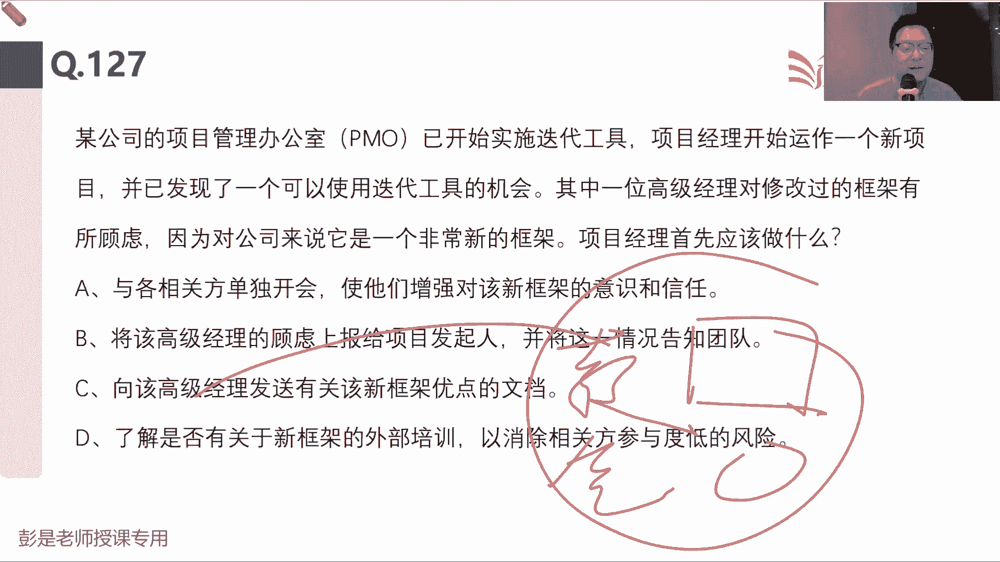

好了过了那一百二十八一百二十八，这看看你们道德水准高不高啊，就是工作工作回家有一个风俗习惯，什么交换礼物，人家国家有封锁机关换礼物啊，但是公司的行为准则清楚地说明，不能接受礼物，不接受礼物好。

不接受礼物会导致合同终止怎么办，就我们我们公司八项规定，A将一份拟公司的行为选择提供给客户，并拒绝礼物，这可能会导致合同终止，这这险咱不能冒啊，和客户客户交换交换礼物，并保持交换的秘密。

如果你选了B我是PMI，我就直接给你不及格，唉这不道德啊，C联系发起人和什么，就这个了，甩锅啊对吧，甩锅甩锅高大上啊，超出我们权利范围之外的事情，可以找发起人，另外涉及到这种什么什么交交换礼物。

这种东西啊，涉及到公司的行为准则，这不是法律吗，对不对，还找找找找法务还可说的公说得很好，D要求发起人换礼物，这也不一定就C了。

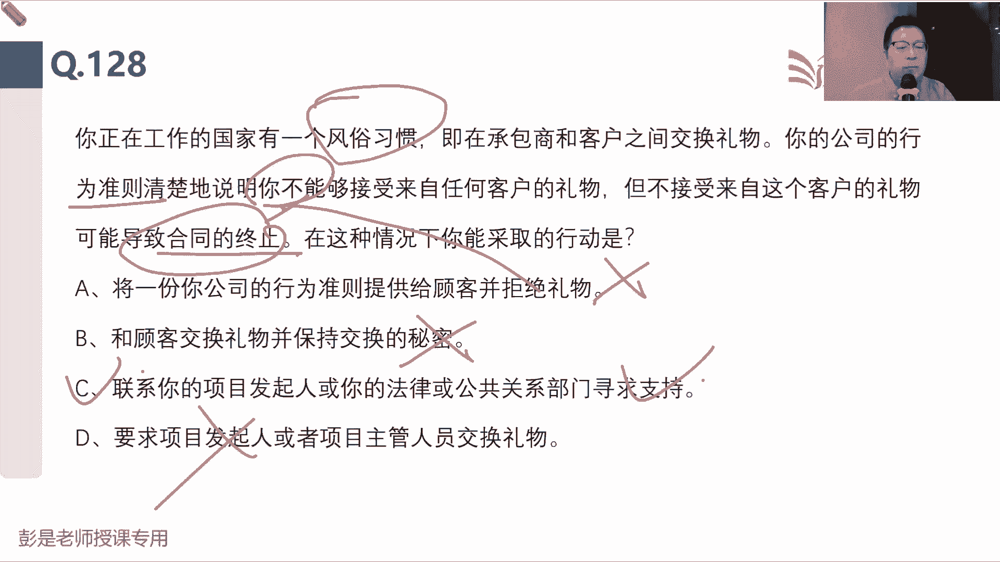

这道德水准，道德水准顶到天花板啊，好后面你还会看到类似更更过分的题啊，一定记住啊，只要嗅到职业道德的味道，就一定是顶到头，对不对，上帝视角看世界，好129。

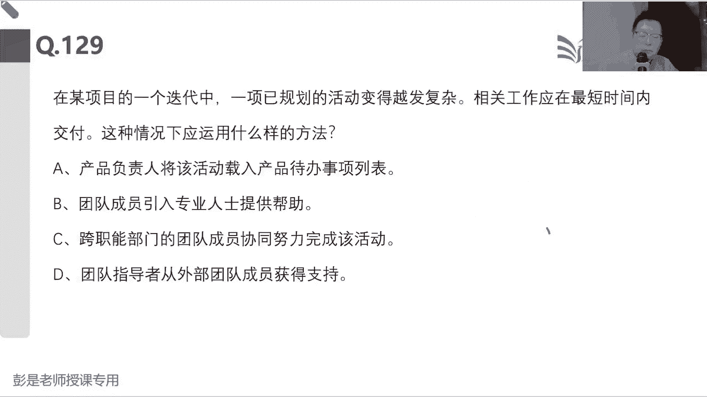

A可能会导致合同终止，说明你对公司不负责，对不对，你不能只考虑客户啊，还要考虑工资啊，还要还要考虑成员呐，我们是中间那个最操心的人呐。

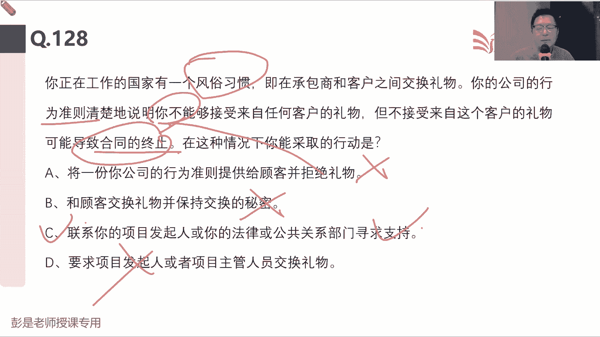

好129，在某项目的一个迭代之中，一项已规划的活动变得复杂，相关工作应该在最短时间内，这简单了吧，短时间短时间怎么整呢，A产品负责人将该活动载入产品代办事项列表，团队人员引入专业人士提供帮助。

就你们合作呗，跨职能部门的团队成员，共同努力协同努力完成该活动，就这个了，合作面对问题。

解决问题，好要三零，说市场动态发生变化，由于项目绩效不确定，发起人希望终止项目，应该看啥呢，这送分题一，刚前面也说过了吧，还是那个阶段关口啊，我们要去分析理想和现实做比较，看看有没有可行性。

看看有没有价值，就是B了，还是接种关口，阶段关口这个知识点，通过分析可行性，通过理想和现实做比较看看继续往下看。

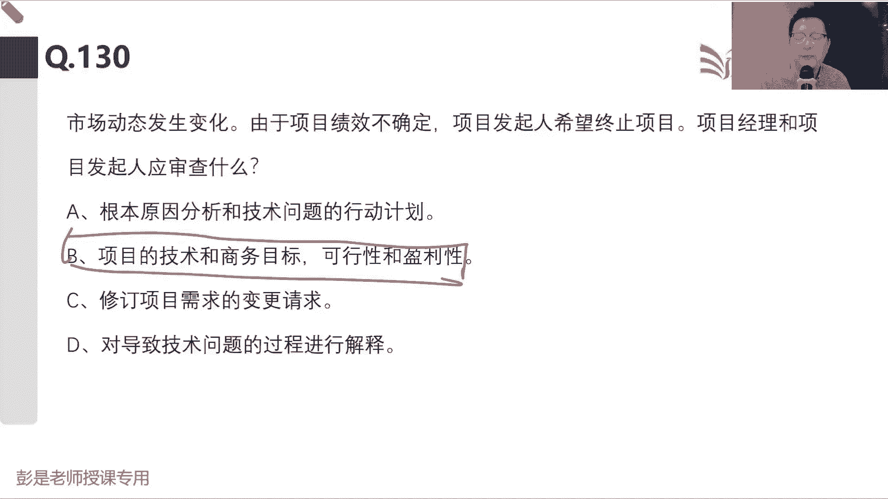

赚钱不赚钱，131说敏捷在迭代到一半时，会觉得需要对一些特征进行详细的反馈，怎么办呢，这找谁开什么会呀，反馈反馈看看我们做的对不对，那不就凭什么找选项了，就A了吧，迭代最后两个事，一个叫评审。

一个叫回顾，但是迭代中可不可以开呢，看情况，如果需要就可以。

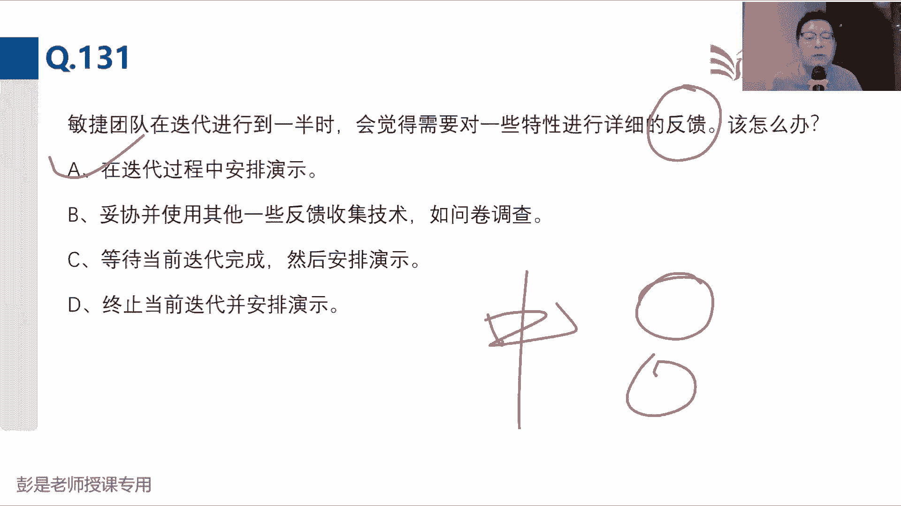

所以就是A132，说有个人犯了一个错误，掩盖错误，还故意误导，这这人咋整，就违法乱纪，伤风败俗，道德败坏，咱就直接毫不犹豫，就是A强强迫。

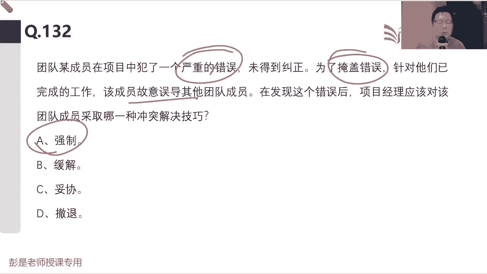

不用不用考虑啊，133说，如果敏捷团队发现了一种新的管理方法，这种方法可能会减少所有故事的周期时间，下列哪项敏捷指标随后会受到影响，这是考的这个概念，周期时间是炸，做一个煎饼可能从2分钟变成一分钟。

那什么东西会都会会会会变短呢，就交付周期吧，这肯定的啊，就是A了，交付周期是这一批活多长时间能完成，他会受到积极影响。

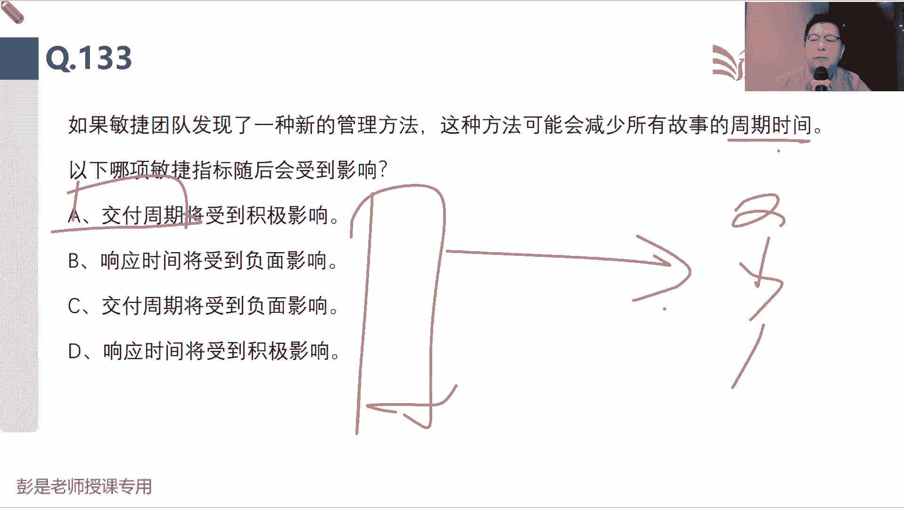

134，在处理一个时间敏感项目的，资源制约因素问题时，项目经理评估了来自公司各个不同地点的方案，让这送分题啊，来自公司不同地点成员的方案，这个方案叫虚拟团队，虚拟团队的优点是什么呢，资源选择更丰富。

资源选择面更广，第二个就是可以减少出差，减少差旅，降成本，它的缺点就是沟通和凝聚力，所以优势就是定提供更多的技术资源，选择和降成本。

佛罗里达同学积极的就是好事，后面的就是坏事儿，135，说用什么东西给发起人展示，所以添加了许多功能，从哪看呢，这个送分题吧，添加的功能，添加的功能展示这个情况啊，给它干啥，什么八个月不高兴。

六个月吞吐量加工能就让他看看啊，原计划我们应该是这样的，实际上呢在工作的过程中啊，工资构成了干着干着哎嘚儿上去了，这说明啥，实际情况如果往上走，这说明啥呢，余量应该是越来越少，如果余量往上走。

这说明啥呢，增加功能了吧，余量如果好几天不动了，这说明啥堵了对吧，这块没进展啊，诶所以现在他这道题在说，他原计划应该六个月完成，现在为什么推到八个月呢，就是因为你们加东西了。

就会导致我们这个工期往后顺延，所以给他看这个特征，燃进燃体图，产品待办事项看不出来进度，看不出来进度啊，燃尽图，燃体图能看到进展趋势分析。

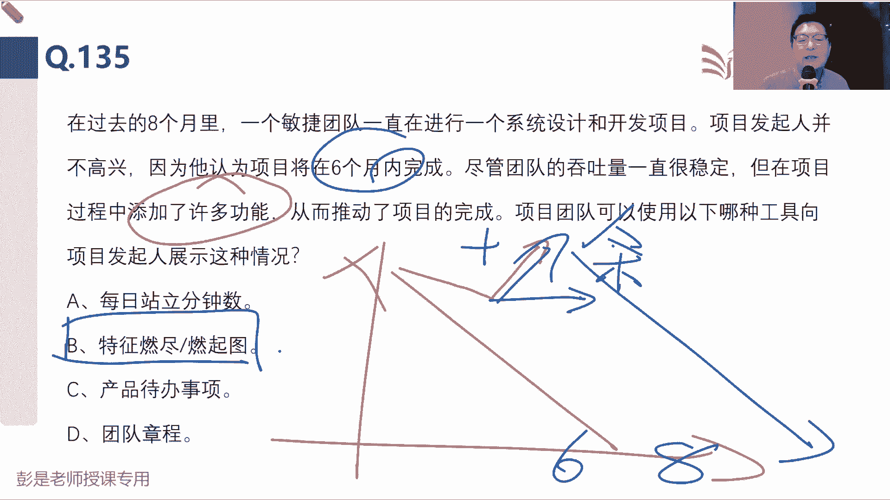

好136。

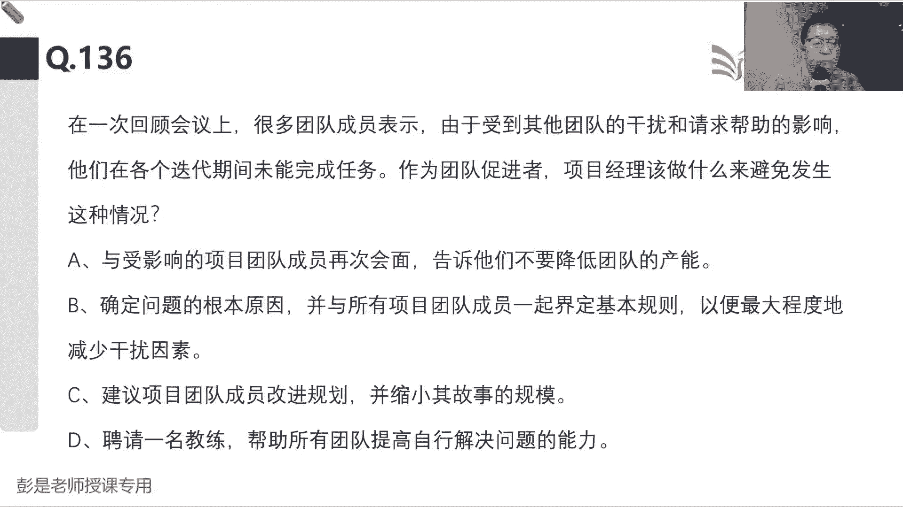

纯粹的字面意思，应该是出题老师随便写了个单词，来迷惑一下你啊，每天站几分钟和这道题也没关系啊，他应该是翻译的问题啊，我记不住那个英文了，应该是DELEGRAM吧，这是每日dai swam。

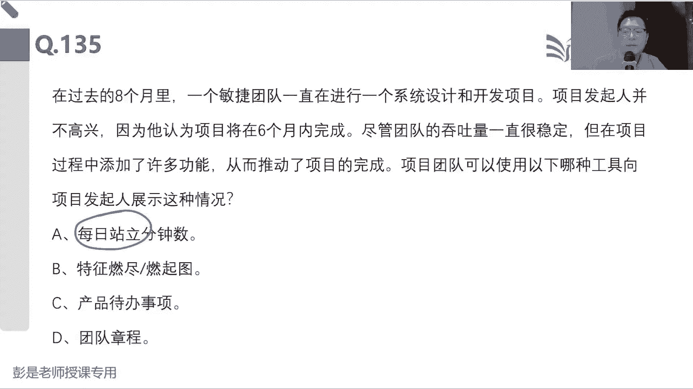

好136，这个136在一次回顾会议上，有成员表示啊，说说说什么什么，其他团队注意啊，这两个字很重要，其他团队的干扰，和请求帮助的影响，他们在各个地各个地带期间没能完成任务，作为团队促进者。

我们应该怎么做呢，其他团队A与受影响的成员会面，告诉他们，这排除掉吧，不是咱自己成员的问题啊，B确定问题的根本原因，并语里巴乱定规则定哎，这可以吧，C建议团队成员改进规划，并缩小其用户故事规模。

不是咱自己成员的锅呀，所以排除掉聘请一名教练，帮助所有团队成员提高自行解决问题的能力者，排除掉比较合适的就是B了。

好137，在项目执行期间，这纯粹的考这个东西啊，记住啊，就这俩知识点，资源优化，记住一个叫资源平衡，它会导致关键路径发生变化，通常导致关键路径变得更长，这恒变横变滑不变。

还有第二种资源优化技术叫资源平滑，他是说在不改变关键路径的前提下，来进行资源的优化，不改变关关键路径，所以说所以他可能没办法完成所有的资源优化，那无论是资源平衡还是资源平滑，我们的目的是什么呢。

让资源的工作安排更稳定更平稳，所以叫减少资源负荷的变化，A，而不是给大家减少工作量，是让工作的安排更平稳更稳定，每周工作七小时，每天工作七小时，每天工作七小时，不要今天16个小时，明天三小时。

这就不稳定了，所以不是为了减负，是为了减少这个负载的变化，工具技术资源优化好。

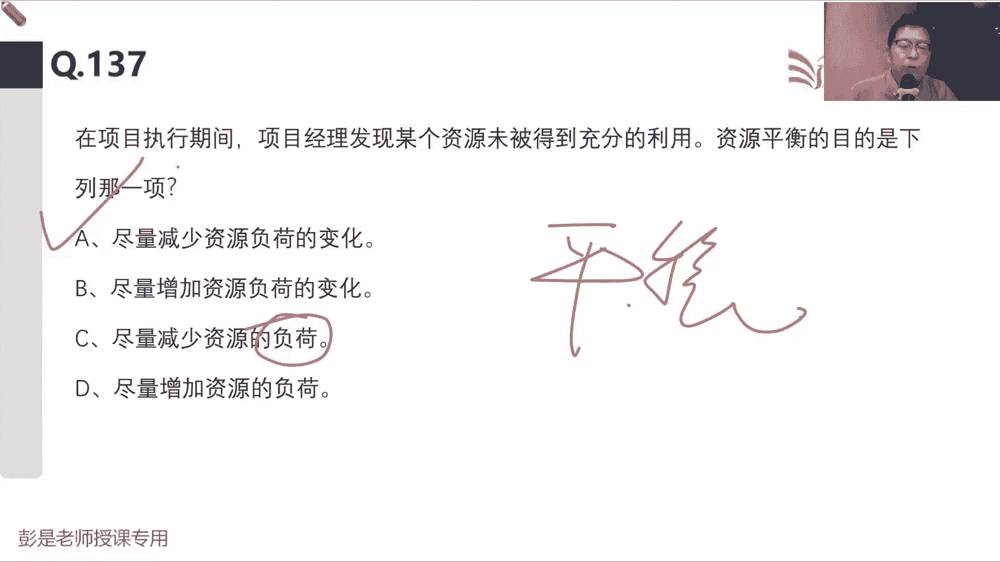

138，这简单了吧，就那几个指标啊，投资回收期告诉我们多长时间收回成本，这个周期就越短越好，剩下一大堆其他指标，有一个叫BCR的，这兄弟需要大于一才说明有钱赚，除此之外其他指标大于零就说明有钱赚。

那这种赚钱的指标都是越大越好，所以找选项，那就C这这个项目赚得多。

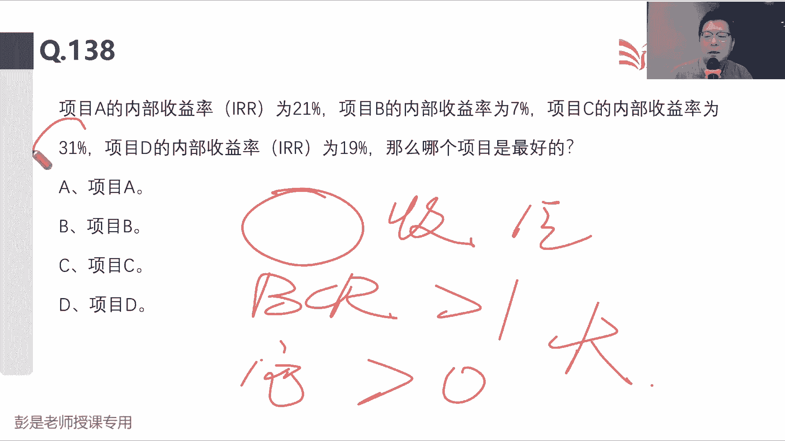

好139，139这道题就挺有意思啊，说你弄了一个什么计算机系统，管理层希望低成本高收益，你希望时间成本充能结合起来，范围进度成本整合起来，但是呢有一个承包商，还雇了一个什么高级程序员，使得他成本高。

那当与相关方一起工作时，你应该A把相关方分成几类，便于管理，这没问题吧，B对于那些会给相关的反带带来反面影响的，相关方，提早对其行为进行干预，没问题啊，C要认识到不同的相关方往往持有不同的目标。

所以相关方管理非常困难，没问题，D认识到角色和义务可能会出现交叠，没问题，四个选项都对，咋选啊，四个选项都对，咋整呢，需要总结了，需要总结了，需要总结了，管理层有他的希望，你有你的目的目标。

承包商这么干，有他的目的目标哎，所以不同人群需求不同，期望不同目的目标不同，所以所以只有C在描述题目这个场景，就这么解就这么解啊，可不是三长一短选最长啊，这是拿知识点去分析啊，四个选项说的都是对的。

只不过C和场景相关性最强，只有C和场景有联系，我没说B选项，这句话是错的，我只是说C在描述这个场景管理层，你希望什么叫希望呢，这不是目标不一样吗，C后半句就是因为相关方，就是因为大家期望不一样。

所以呢这课答疑不好答呀，大家的水平不一样，有的人听课了，有的人没听课，有的人看书了，有的人没看书，有的人想了解范围管理，有的人想了解进度管理，所以讲课答疑不好讲好。

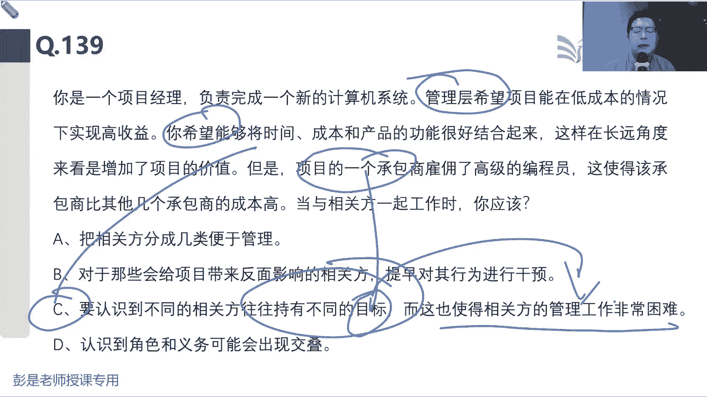

就这意思啊，不理解，跳过它140，这个简单吧，哎你这决定实施一个软件平台，一些需求明确一些需求，需要更多细节，这事咋办，这事儿咋办，A确定最合适的生命周期方法，那要理解什么叫生命周期方法，这啥意思啊。

把项目从开始到结束分成N个阶段，确定每个阶段用什么样的生命周期类型吧，该预测的就预测，该敏捷的就敏捷，该迭代就迭代，该增量就增量，所以就是A了，这裁剪呐对制定项目的总体蓝图，B选项中将所有需求不一定啊。

人家说有些需求明确，哎，咱就用预测型方法呗，对然后C排除掉，D排除掉比较合适的就是就是A了，好现在17。41是吧。

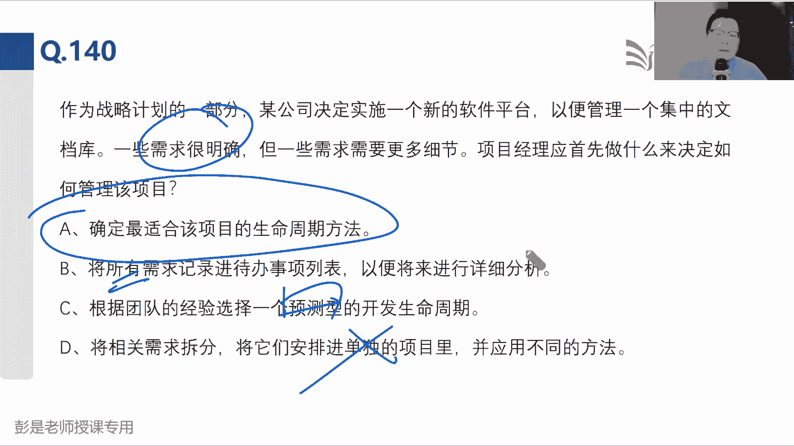

你因为您的项目很复杂啊，这题可以过了吧，说您指出一个变更，可以不通过任何委员会的参与而自动得到批准，这一定是法律，好紧急情况只有紧急情况，只有紧急情况下可以先斩后奏，法律的法律不一定啊，想长景啊。

我要造个滑板车，一年以后再造个摩托车，政府发了什么电动车最新的标准，这以后再说呀，该走流程走流程，对不对，新的法令不代表着说就没时间走流程，新的法令不代表着没事说，不代表着没事。

不代表着说没时间走流程吧，找一个最确定的选项，仅此而已啊，紧急情况肯定是没时间走流程了吧，什么叫紧急，那就是很着急啊。

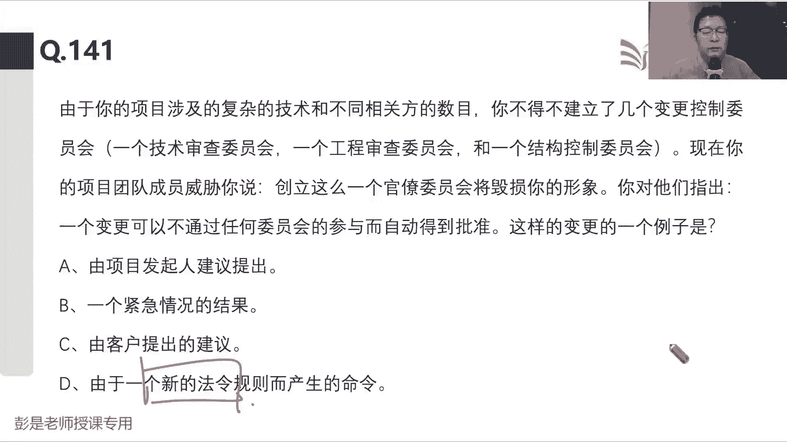

好142哇，说克里斯弄了个幻灯片，然后列出好多东西，克里斯犯了什么错误，找个错的，这不需要背啊，但是可以要猜呀，哈将响应变化显示为一个价值观，而不是变更管理，这是对的吧，这是对的，所以不能选啊。

必将可工作的软件显示为价值观，而不是个体和交互，这对吗对吧，咱关注的就是可以使用的产品服务和成果呀，这是对的啊，咱关注的是客户，客户协作，这是对的吧，A所以就是C没有这个价值观。

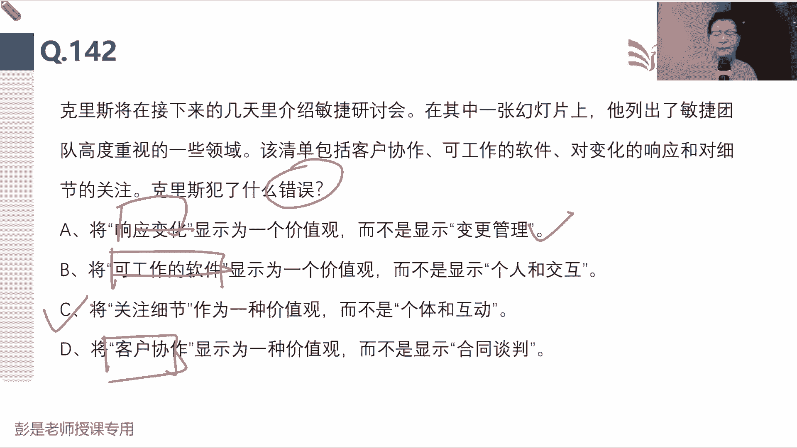

143，143说一家聘用公司盖一个什么大楼，发起人要求21层这个办公不发发起人变更，提出了个变更，然后项目经理，经理要求发起人批准标准的项目变更请求，但是发起人拒绝，并且认为啊电子邮件批准已经足够充分。

那什么玩意儿来避免这个问题呢，最后一总结啊，就是这活怎么干，现在好像没说清楚，那这活到底怎么干呢，就参考管理计划，所以就是A，对就是如何管理变更到底怎么审批。

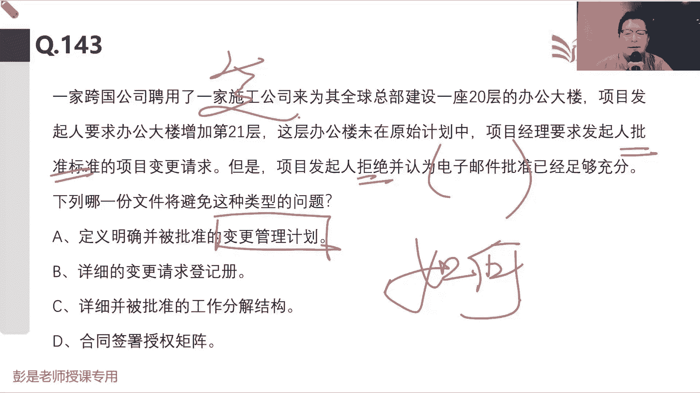

走什么流程，怎么申请，怎么记录，以此类推，144，这个就是考书上那个原话吧，说我们设计了一个敏捷合规奖励计划，旨在为表现最好的成员提供一定的奖励，这种方法有什么问题啊，就是怎么做更稳妥呢。

希望每个人都能成功，希望每个人都能成长，希望每个人都能保持士气，希望每个人都能满意，嘿所以就是B普瑞是领导模式，创鼓励创造一个人人都能成功的环境。

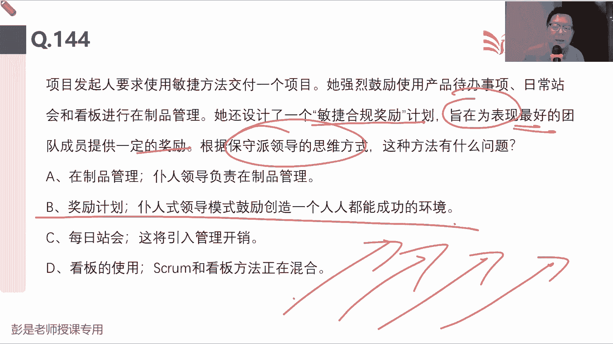

好145这种题啊，这种题就看看规划采购管理，讲的那段计算方法呀，第一个小问题，超支了多少钱呢，预计成本10万，实际成本12万，所以超了2万，第二个小问题，这2万块钱要罚卖方多少钱，2万从里边拿出30%。

对不对，所以要罚他6000块，第三个小问题，原计划让他赚多少钱呢，它的利润原计划是1万，第四个小问题，受到惩罚之后，他的利润还剩多少呢，就是1万-6000，所以还剩4000块钱的利润。

好结账成本给你报销利润给你4000，所以是124000。

144，看不懂在说啥呀，看不懂在说啥，我都不知道咋讲了，就是大家考试是不是希望都能通过呢。

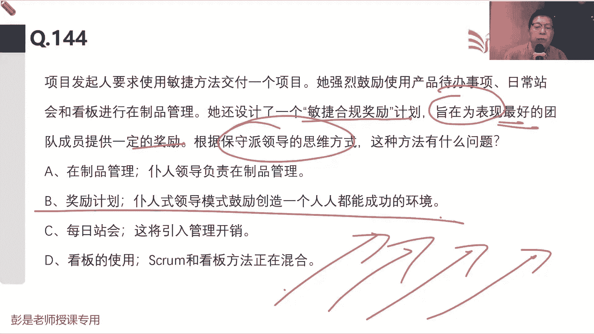

就在说这个事儿。

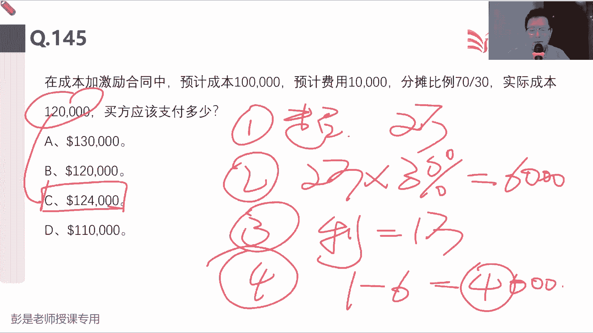

好146，啊，说重大组织转型项目，该项目涉及到范围大量的不确定，那这个东西呢对公司很重要，您认为实际的业务需求和声明的业务需求，往往存在着差距是吧，就是理想和现实有差距，因为不确定怎么办，这简单吧。

哎小步快跑，有目地的构建就毙就毙了啊，没啥可说的了，小步快跑，滑板车啊，什么自行车啊，摩托车，不断的不断的快速的构建出可以使用的产品，服务或成果，来确认是不是满是不是满足业务需求。

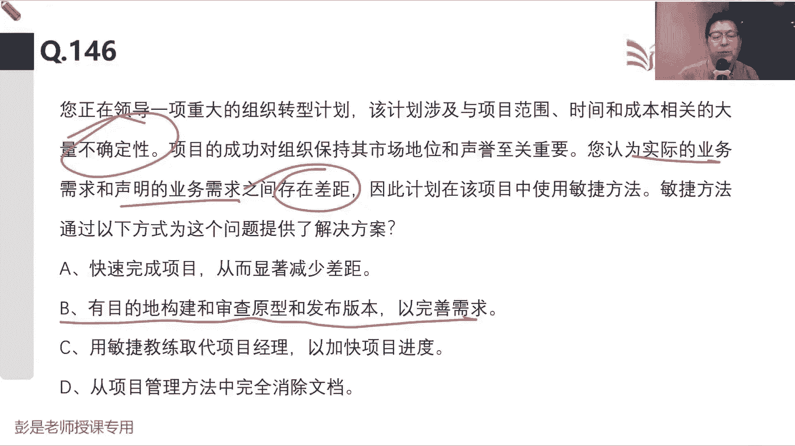

147，这也是那个单一的知识点啊，由于不可预预料的经济情况，发情通知项目经理终止项目，那接下来应该怎么做呢，项目异常终止，半路夭折，第一我们要核实工作的完成情况，第二呢收尾收尾的时候还要有一个小细节。

就是记录一下为什么为什么把这个原因说清楚，好找选项了，所以就是D提供一份已完成，未完成的可交付成果的报告。

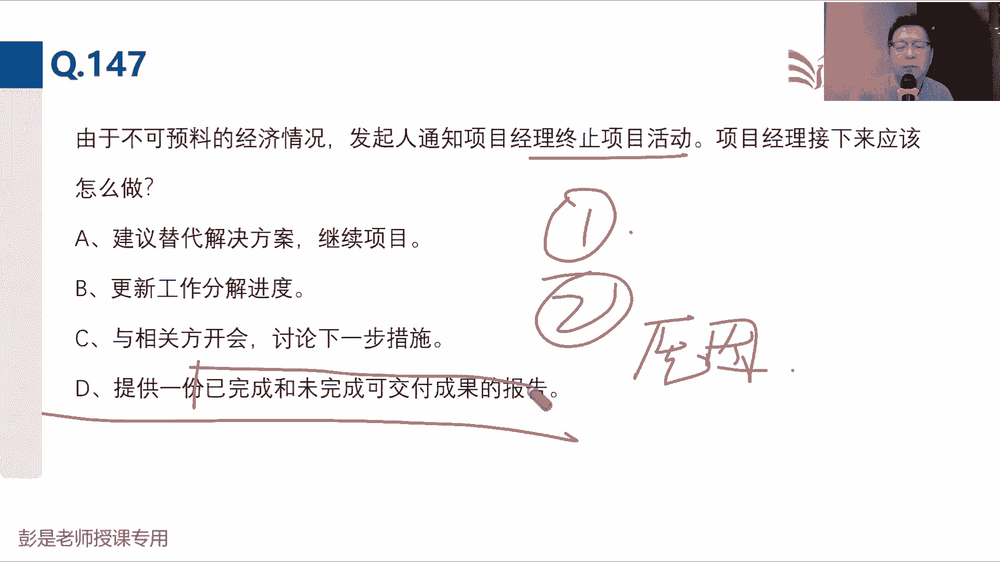

148，148是可可可以做可以做啊，这种题现在好像考得的概率比较低了，说某公司一直在对当前业务模式实施变革，该变革需要借助多个名称才得弄一个复杂项目，我们让测试团队，将以下哪三个方案作为测试的机制。

A涵盖所有可能选择项的实验性方法，这敢选吗，把所有可能性都试一试，这么测会累死的对吧，这么测会累死的啊对吧，那B选项基于行为的和测试驱动开发的测试，哎这词儿咱听过哈，什么叫测试驱动开发的。

怎么让这个墙垒的值呢，先把这个测试标准给它弄出来，对不对，怎么让你画出来一条2cm的直线呢，拿尺子比着画呀，诶这就叫测试系统开发，先把这个验证的方法给它弄出来，以便于我们干活，干得对，A不是极限编程。

去看看极限编程里面说啥不解释啊，B是对的，C独立的个人测试，这是个什么鬼啊，不知道B故事测试是测什么呢，功能对不对，作为一个角色，我需要一个功能，以便于实现什么目标，作为上课的老师。

我希望教学平台啊有一个关小黑屋的功能，以便于把调皮捣蛋的学员给他拉黑，诶，那我们这个软件开发好就去功能故事测试，故事测试，看看这个功能对不对，诶，D是可以的啊，E呢就是安全性和性能测试。

纯粹是字面意思吧，哎所以就是BDE，D和E其实对标到需求文件里面，有个知识点叫什么来着，功能需求和非功能需求，那咱要通过故事测试来验证这个功能，说的对不对，通过什么安全性能测试，看看非工程需求对不对。

哎所以建议的答案是BDE，这题允许错啊。

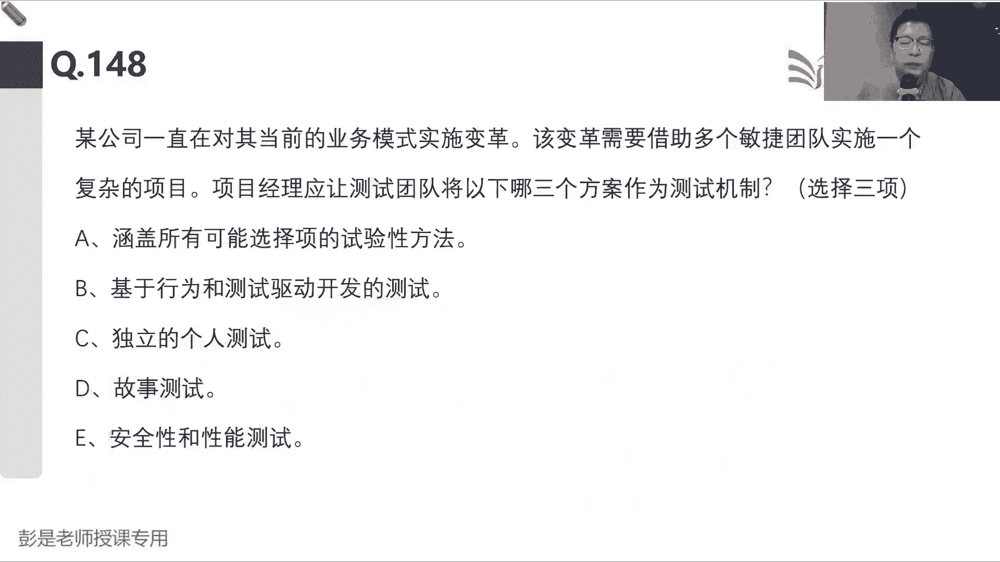

好149，所以呀你们弄一个视频游戏行给了什么范围，说明现在他提出了一个范围变更，希望把这个游戏做成一种，在电视和电脑上都能玩的互动游戏，这种范围变更，至少会表现在底下来哪一个方面呢，范围变更。

那肯定改范围基准，范围基准有什么呢啊范围说明书，WBS和WBS词典，所以就是A了吧，B不一定啊，C不一定都条啊，D呢也没看出来是咱自己工作出了问题，对不对，没有办法得到一个经验教训。

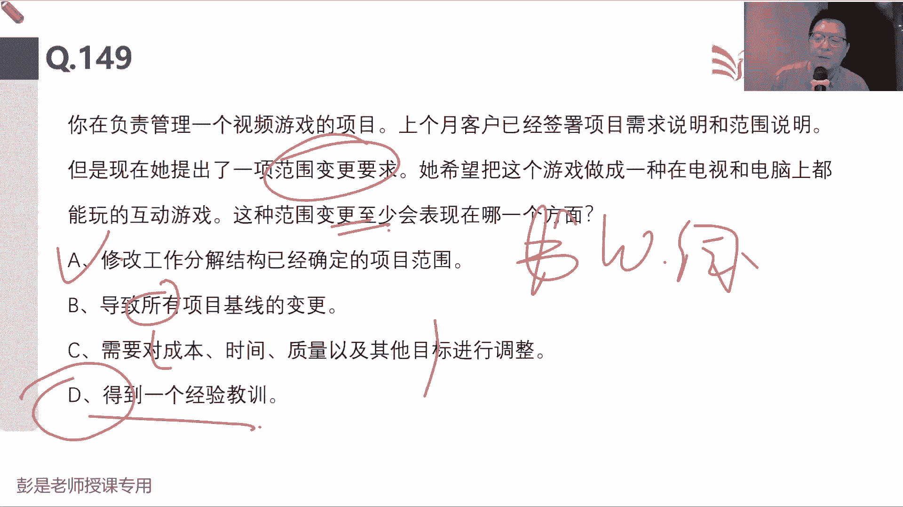

所以比较合适的就是A了，150嗯，说项目经理开始了一个新项目，必须确保相关方什么什么成员经过适当的培训，在与团队会面之后，我们发现所有资源都拥有不同，敏捷方法方面的经验，那咱应该做啥。

A充分而完整地提供一种敏捷方法方面的指导，这个可以吗，可不可以，为什么呢，只用一种方法行吗，咱现在至少应该听过三种方法了啊，SCP是一个吧，极限编程是一个吧，看板是一个吧，嘿经义思想是个超级。

包括了很多很多很多的敏捷实践方法，实际工作中呢，实际工作中只用只用一种行不行呢，不不行，对不对，要结合到一起用啊，所以A不一定，B确保大家对敏捷形成共识，其实也就能选这个了。

C确保团队成员了解所有的敏捷技术，这不对吧，不现实啊，好几百种好几千种了，D不组织培训排除掉，所以B到合适的就是B了，好，模拟考试以中文为主，英文考唉，正式考试以英文为准，记住啊，模拟考试以中文为准。

英文考试以啊，正式考试以英文为准，因为咱模拟考试是中译英，政治考试是英译中，模拟考试中文中文说得对，英文可以不看，正式考试，正式考试如果发现中文看不懂，看英文，哈哈因为太长了，正式考试看英文啊。

对正式考试以英文为准，英文英文是人家的母语，但他中文99%不会出错吧，好正式考试的时候啊，你说中文会不会有问题啊，会啊每次考试都会啊啊啊，我这个就是头发不会影响通过率，不太会影响成绩的啊。

不但会影响成绩的啊，不要担心，不要担心会有一些小问题，但问题不大，问题不大啊，好那再往下了。

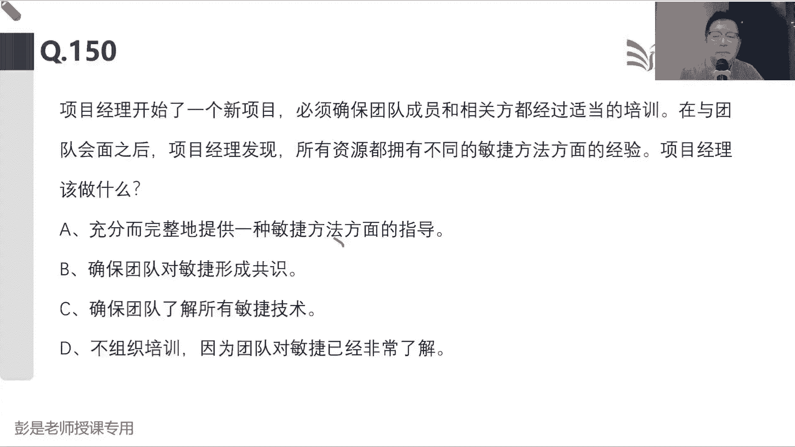

151，这个只要算一算讨厌项目一的投资，一定坚信啊，我数学比你们还不好呢，个位数能算明白就不错了，你们肯定数学比我强，项目A的投资回报期20一个月，项目币的成本是17万5，第一年预期挣现金流7万5。

第一年收7万5之后，每季度5万，所以科普一年有12个月，再科普一个季度，三个月，三个月收回，有了7万5，又收回来5万还不够吧，再三个月才能够收回全部成本，所以B项目的投资回收期是1。3，是18个月对吧。

18个月哈，所以我们选项目B，因为A的投资回报期长，这绕过来就可以了，投资回收期越短越好。

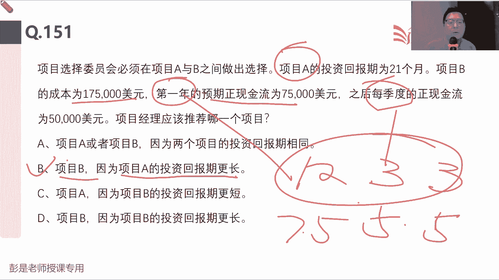

好152，这题也简单吧，找到关键词你们找吧，两个字两个字，传统项目我们叫推动式进度计划，对敏捷项目叫拉动式进度计划，大家主动去领取任务，所以分配这两个字就决定了，答案是D，对不对，他们没有得到授权。

不是自组织的，那这种题啊，再换个场景，如果说你团队拿了个新手，要不要分配任务呢，该管还得管啊，该管还得管啊，李飞就想想你家小孩，你家小孩你要不要告诉他今天晚上做啥呢，需要啊，因为他不成熟啊，你不告诉他。

他就玩游戏去了，就这个逻辑啊，这个不是说那咱们管太多哦，是不是管太多了，不知道啊，我看看我看看题啊，马克是一个项目经理，审查第三计划，并并且把任务分配给团队，他还收集报告，并与职能经理谈判。

以解决这个问题，觉得这敏捷怎么样，团队不是自组织自组织的，这是不是百分之1万正确，团队需要敏捷方面的指导，这你确定吗，不确定吧，因为因为你不知道这些成员的成熟度，是这个逻辑吧。

你不知道他在塔科班的哪个哪个阶段呢，对吧，如果来个十个十个毕业生，十个小学生，你肯定要分配任务，好，所以我们没有办法判断他这个决策到底对不对，到底好不好，但我们能判断的是什么呢，团队还不成熟。

对没有达到自组织这个状态，马克是PO，这没有办法啊，不一定啊。

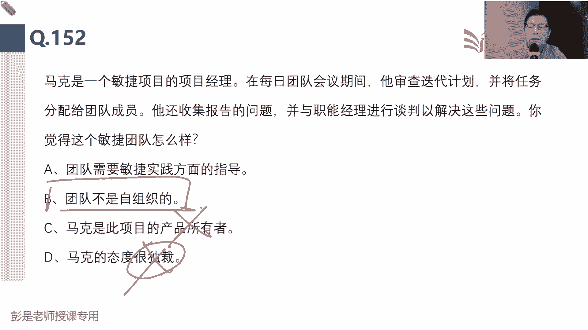

对各种可能性吧，好这道题呢153，这简单吧，有人建议增加范围，说坐且仅坐，还这就是AB纠结一下哪个选项更准确呢，B控制范围对不对，因为范围这一章强调的就是做企底座。

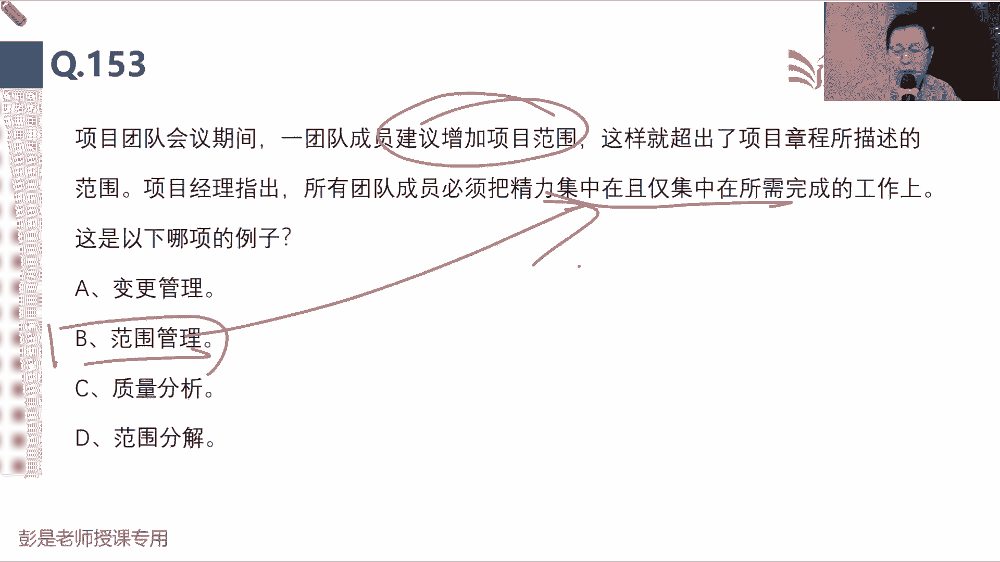

好饿了啊，坚持一下，马上就下课了，我也饿了，154，说领导一个复杂的学生服务设计项目，阿鲁坚持要求团队开始工作之前，这关键字是什么，非常可，关键字是什么，哎就是这个东西啊啊怎么办，A刷新你的简历。

开始申请外部工作，这个选项说的对对吧，但是不能选啊，不能学啊，B脚踏实地，不要再再排除掉，排除掉就这个了吧，就这个了啊，教育教育他，让他知道敏捷的时间的好处。

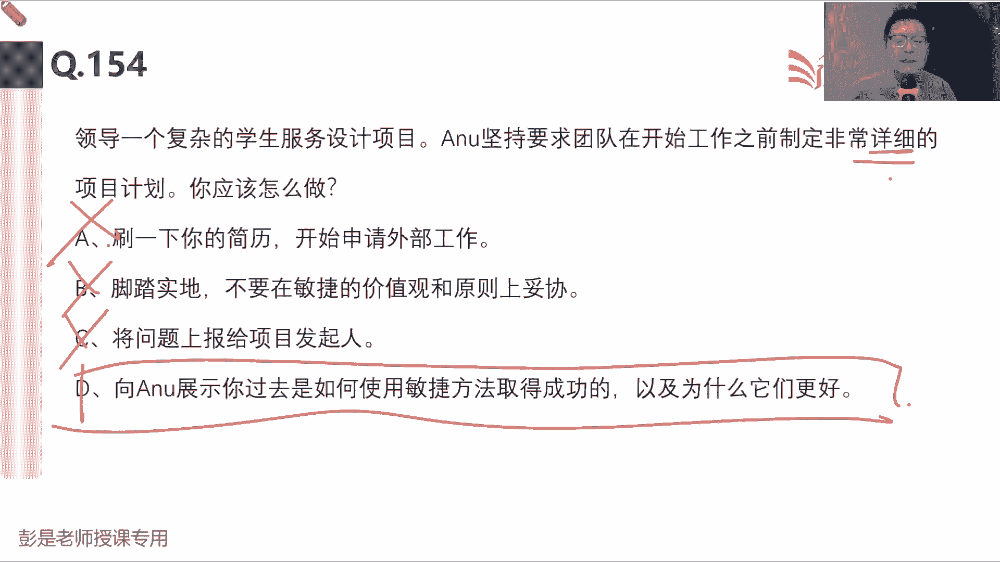

好您正在打算安排一个会议，当检查一个成员的日历时，发现这个人呐和关键相关方预定了一个会议，但是呢你不知情怎么做，A坚持，B告诉了你的老板，DC找他的老板D就有这个了吧，了解情况没。

这种龌龊的选项肯定不能选对吧，显得自己没本事，找自己老板不能选出问题，有情况直接找人家老板也不一定啊。

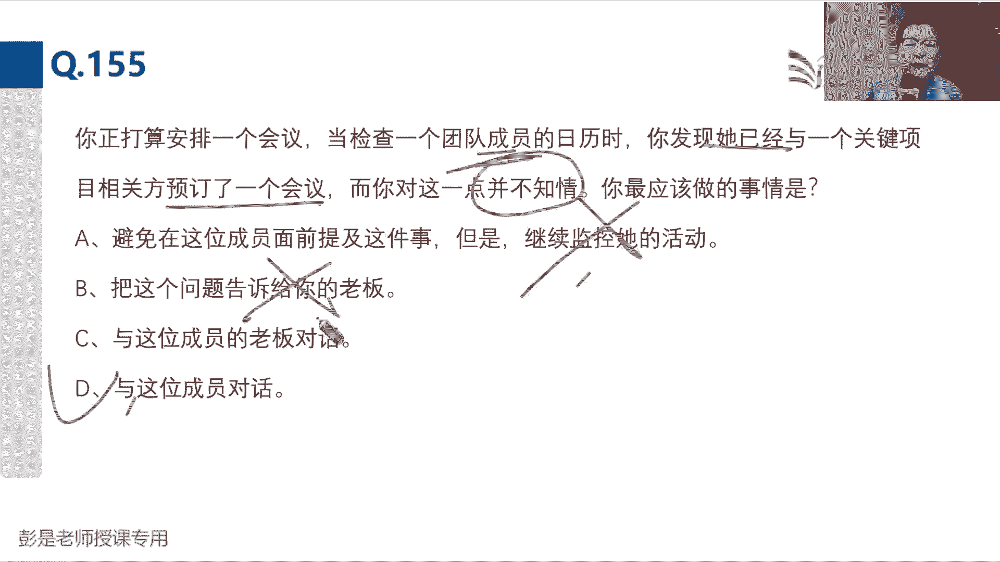

好156不强。

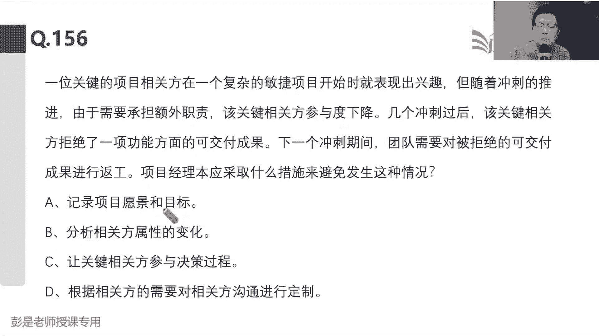

其实你没有办法判断，没有办法判断啊，他这个事情到底对不对吧，也可能跟你没关系呢，是这个道理吧，我发现张三和李四人家开会去了，哎我不知情。

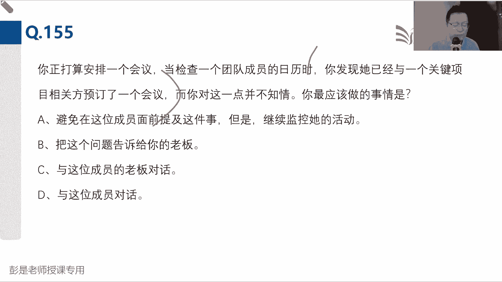

不一定跟我有关系，对不对，所以找这个人确认情况，只能这么选好，156，说呀我们干活参与度下降，冲刺过后，他拒绝一个东西，我们需要返工，本应该采取什么措施来避免发生这个情况好。

那你更关注的是我就画圈圈了啊，是A这个圈还是B这个圈，更关注A和B哪个圈呢，是反攻还是参与度，参与多吧，好找选项了，题目非常善良啊，就是B的吧，为什么选A呢，记录项目的实现景和目标。

能解决相关方参与度变化的问题吗，嗯嗯那第四个呢根据相关方的需要，对相关方沟通进行定制，这道题实际上考哪个管理过程啊，监督干系人参与监督干行参与，监督干行参与下降是什么意思啊，看参与度变化。

哪个管理过程管参与度变化呢，就是B，现在不是说人家对这个东西什么不知情，对不对，然后你要想办法让相关方参与，现在在强调什么叫下降，什么叫下降，什么叫下降，讲这个道理啊，真六有那么深奥吗。

哪个管理过程监督相关方参与度的变化，嗯好，所以答案是B去看一看，刚才给给你剧透了啊，看一看监督干系人参与这个管理过程，49个过程，最后一个管理过程。

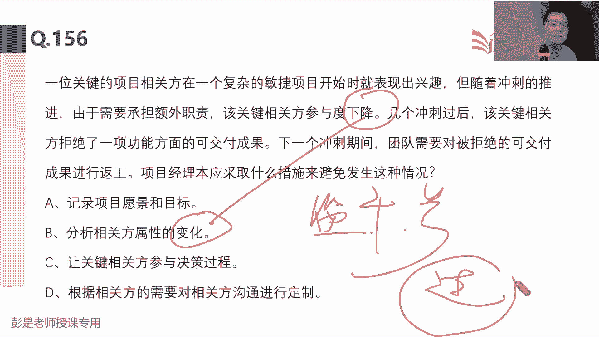

157嗯，天气条件是巴拉巴拉飓风来袭，拟定了应急计划，咋整，那就A了呗，更新风险账号，执行应急计划走变更，前面那道题还不理解的同学，你现在需要做的事情就是课后踏踏实实去阅，去阅读啊。

咱答疑课答疑课没必要。

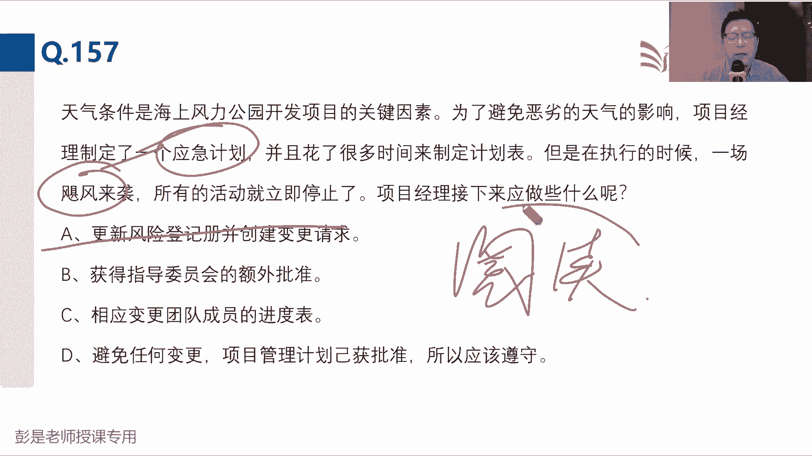

我逐字逐句的中文帮你去解释，你说大家要训练自己的阅读能力啊，你媳妇儿开始跟你关系好，现在对你越来越冷淡，你更关注什么呢，你更关注什么呢，察言观色呀，观察和交谈不都这些知识点吗，对他变了他变了。

你要持续的看看他有没有变化呀，还不理解的同学亲自去看一看，监督干系人参与这个管理过程。

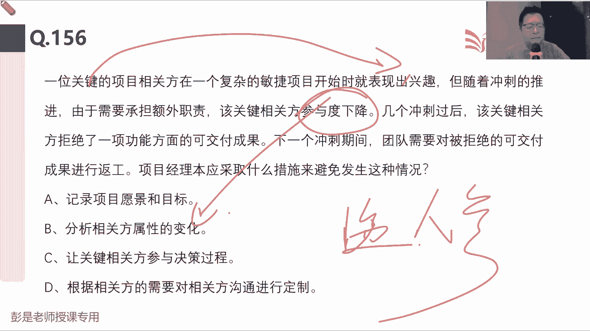

识别规划，参与规划完了参与它会变，所以要定期的监督好。

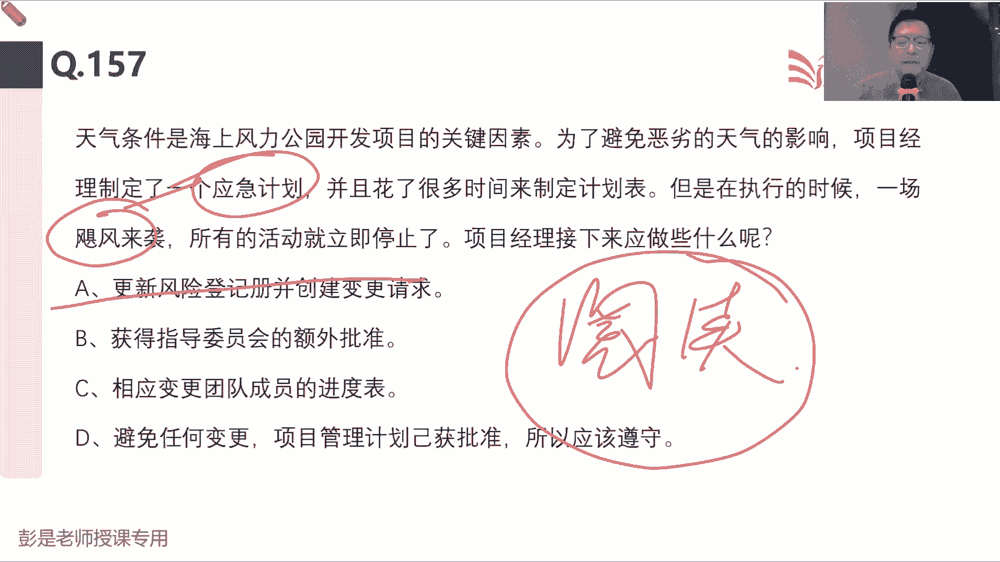

没对象的同学忽略我啊，忽略我对你造成的伤害，就是想一想亲戚好友，亲戚好友也能理解吧对吧，我朋友现在对我不搭不爱答不理的，说明什么呢，他变心了，对不对，你要定期的定期的监督这个事了，题目就在说这个场景。

老师就说首先恋爱先进的变化，其次这要根据它的变化进行定制，对识别干系人规划干行人参与，再创立三板斧啊，识别干系人，规划干系人参与，然后根据参与度，根据参与度的评估结果定策略。

这个策略才知指导我们如何去有效沟通吧，那在定期监督的过程中，不是还是这么干吗，发现这个人变心了，在调整策略，在规划沟通，好158团队士气，团队士气低落冲突，这不解释了吧。

就想一想塔克曼那个大对勾答案就出来了，最不好的就是震荡阶段。

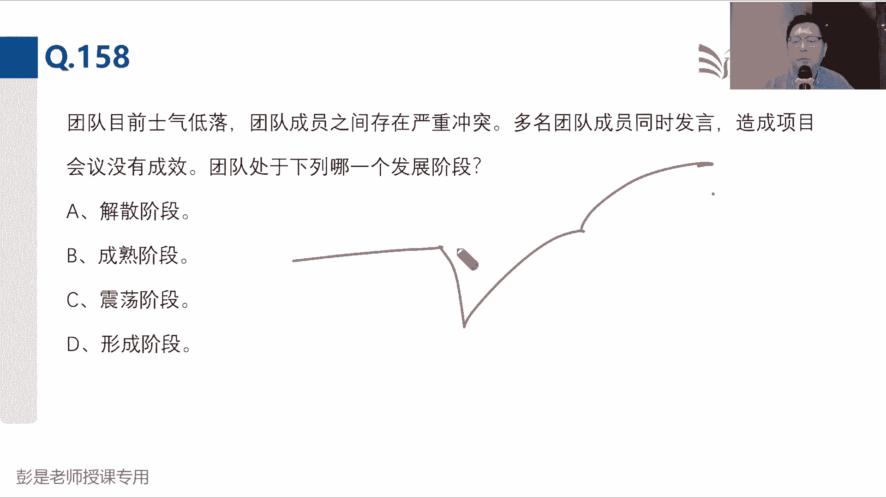

C没有，为什么，这是知识点好，159，159是说敏捷，敏捷团队正在与许多问题作斗争，包括错误的开始，157没讲吗。

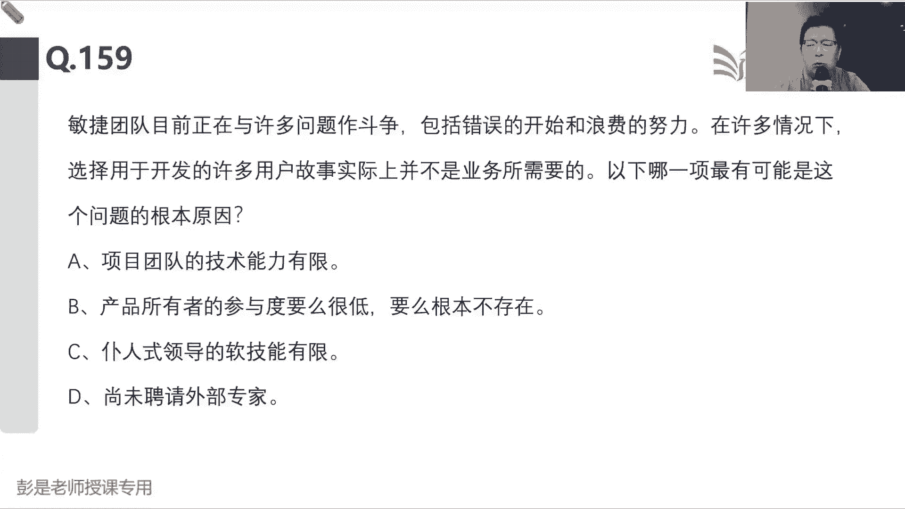

讲了讲了，风险发生更新风险登记册，执行应急计划，创建变更请求应急计划也是计划之外的东西啊，要走流程啊，其他选项不合适啊。

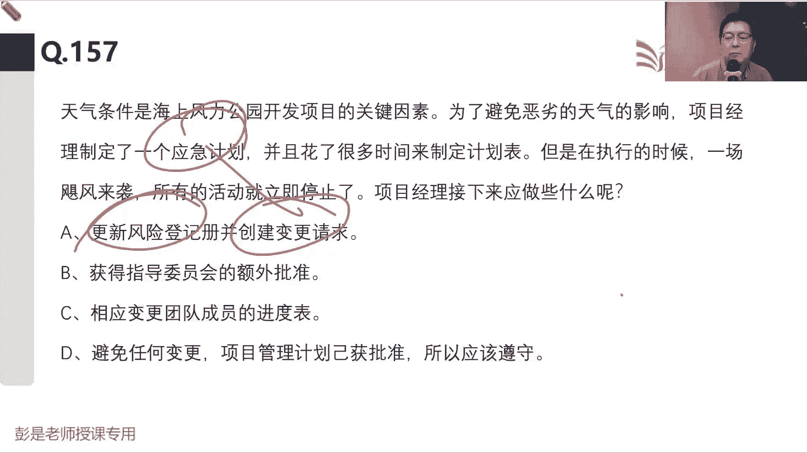

好159，说团队正在和许多问题做得中，包括错误的开始和浪费的努力，在许多情况下选择用于开发的许多故事，实际上并不是人家需要的，以下哪哪项最有可能呢，那就是，这东西出了问题吧，选择用于开发的故事。

这玩意儿不是人家要的，那就谁的锅当PPO，所以是B。

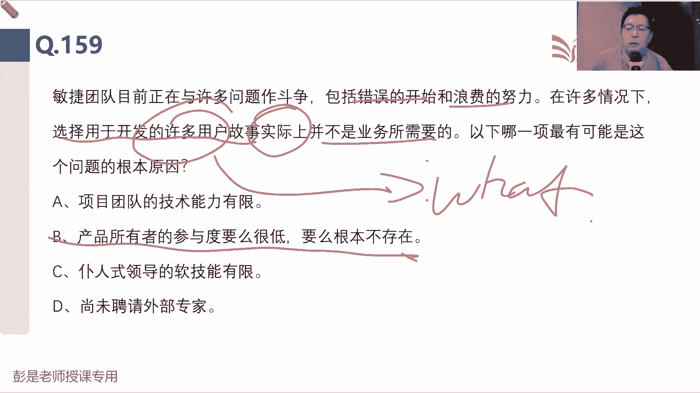

160，这道题考的就是纯粹的那个，蒙特卡洛分析方法呀，如果我们想知道整个项目工期的概率分布，那就需要建模型，然后把和时间和进度有关的东西扔进去，这是你的什么活活动清单，网络图，持续时间估算扔进去。

然后建模型噼里啪啦迭代模拟，就得到整个项目工期的概率分布了，所以这道题选，基础是什么呢，模型的输入进度，网络图和持续时间估算，老师为啥选题，这个咱还有一个基本B甘特图啊，甘特图是你做好的进度模型啊。

把进度模型弄到模型里，这话不能这么说呀，对不对，甘特图是你制定进度计划的，输出项目的进度计划，它是你模型模型啊，你不能把模型扔到模型里，这就不对了，嗯对为什么要模拟呢，因为要模拟模拟各种可能性啊对吧。

这个活动一天两天三天四天五天六天，整个项目工期是一个什么情况，B活动一天两天三天四天黑，这东西不是干的图了吧。

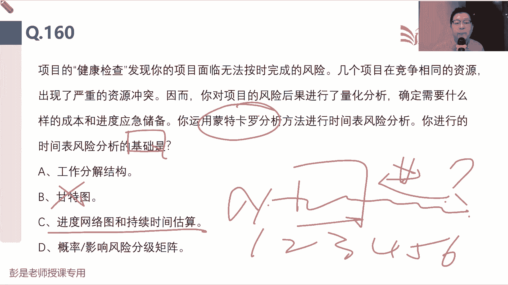

好161，所以蒙特卡罗模型模拟牢牢记住这三个词啊，161说，指导委员会决定终止和分包商的合作，并建议扣发票，为了实施指导委员会的决定，我们应该怎么做，和下面这道题异曲同工。

这个考点采取任何行动前先看合同条款，因为这玩意有法律效力，刚前面那道题选C进度。

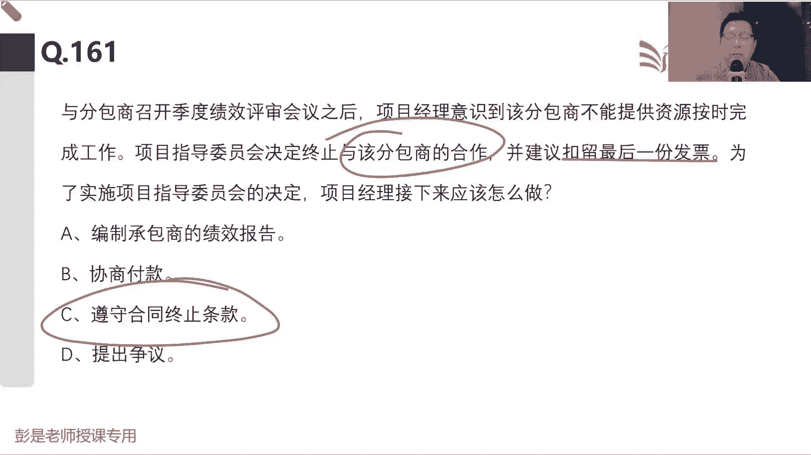

网络图和持续时间估算好，162，还有最后20道题，一图的就过去了。

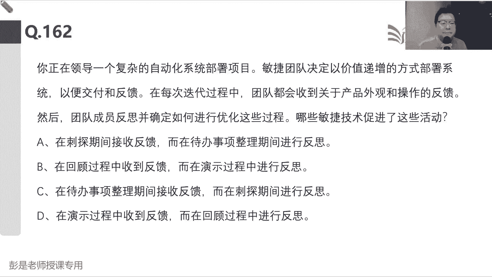

采取任何行动前，先看合同，牢牢记住这句话，如果你想不想在公司干了，想离职，看什么呢，看合同租的房子不想租了。

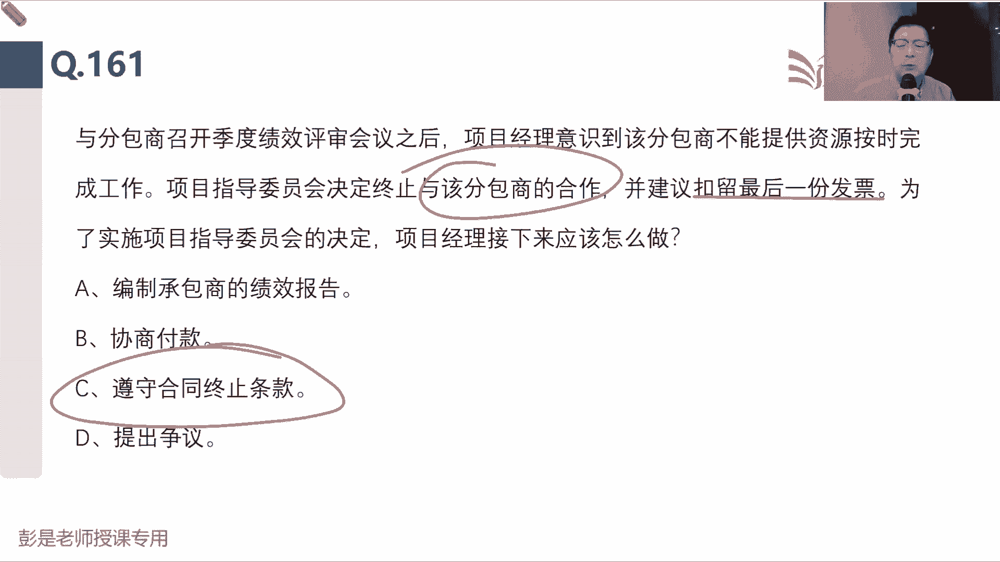

想要退钱，看什么呢，看合同买的房子不想买了，看什么，看合同，避免自己违约，162，你正在领导一个复杂的自动化部署项目，民间团队决定以价值增量的方式部署系统，以便交付和反馈，这简单吧，在每次迭代过程中。

我们都会收到反馈，然后反思呀，都说了，那什么东西呢，就D了吧，双R带双反对，给一个叫preview获得反馈。

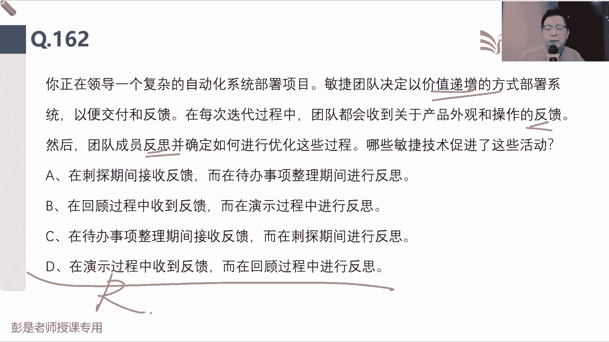

一个叫real回顾获得反思，163，这题讨厌项目A成本12亿，潜在收益60亿，未来运营成本15亿，运营成本也是成本，所以60-27=33，项目B的成本是14亿，前台收益70亿，运营成本一个亿。

70-15=55，推荐哪个项目了，项目B因为赚钱赚的多，所以就是C选项收益减去两个成本所得的值，大于AC是对的啊。

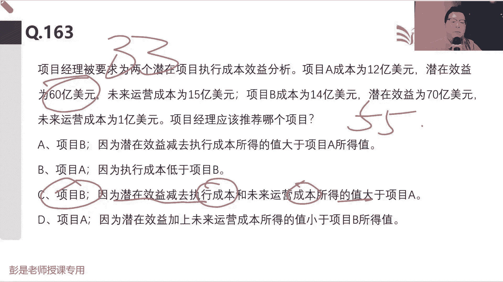

164说，与关键相关方一起对项目计划审查之后，我们被被告知，18个月的发布计划是不可接受的，我们应该在六个月退出，根据新的时间表，我们应该做什么，那能干多少干多少呗，就这个道理吧，审查项目代办事项列表。

确标确定哪些是优先级，高优先级事项，并指出符合预期期限的最小可行性产品，就这个了吧，18个月造个滑，造，造个摩托车，让人家不接受，那六个月先给你出个滑板车，这都是这都是这都是不行的。

敏捷里没有这些乱七八糟的东西啊，用不着啊，敏捷团队归团队构成是稳定的稳定的。

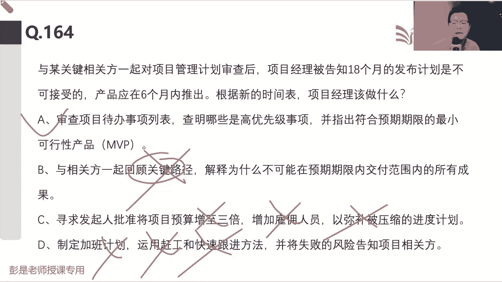

165，这个也简单，参考以前项目的人工时间，来预测项目的成本是啥呢，不少同学这玩意还分不出来啊，什么叫发布计划，敏捷发布规划至少说了十遍了亲，什么叫发布计划呀，愿景路线图，发布计划。

传统项目没这破玩意儿啊，好人工时间预测项目，这是什么呢，这是噼里啪啦一顿算A参数估算，直接得到估算结果，就叫类比，参考什么人工时间呐，单位单位成本啊，单位变量啊，这就是参数啊。

需要计算才能得到具体的估算结果，就叫参数好。

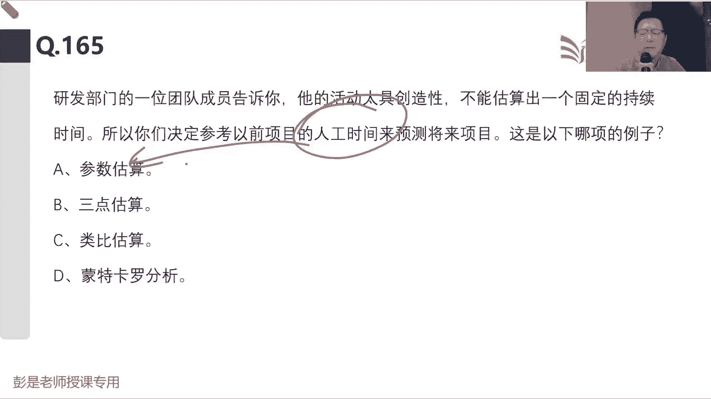

什么叫人工时间，搬一块砖摊一个煎饼需要2分钟，做一个核酸检测需要一分钟，你看看一共多少人，我算一算，就这东西，166，呃当新进公司的发起人替代人变了，肯定要更新干琴邓丽册，不要问为什么，不要问为什么啊。

问就是记住它，人一旦有变化，一定要更新肝写登记册，没啥可解释的。

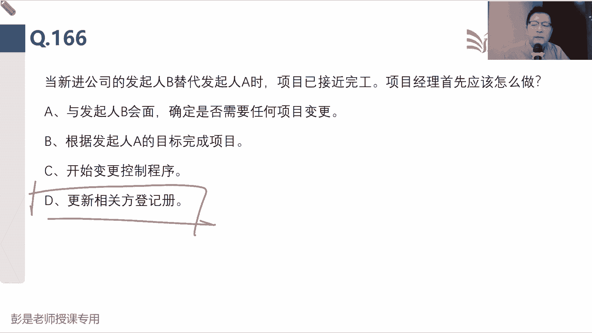

167说，jenny负责将组织中使用的关键是某意迁移，这道题，恶心了，迁移到云平台，当与这些关键应用程序集成到非关键应用程序，将当前什么什么中高度不确定性怎么办呢，唉到底什么叫迁移呀，什么叫云平台呀。

理解理解不理解根本就不重要，重要的是什么呢，不确定那怎么办，嘿不确定就少干点少干点，避免在错误的道路上越走越远，所以是B其他选项不合适啊，不确定的瀑布式方法肯定不行，同时这也不一定啊。

什么一断开一次迁移一个，这不定不一定啊。

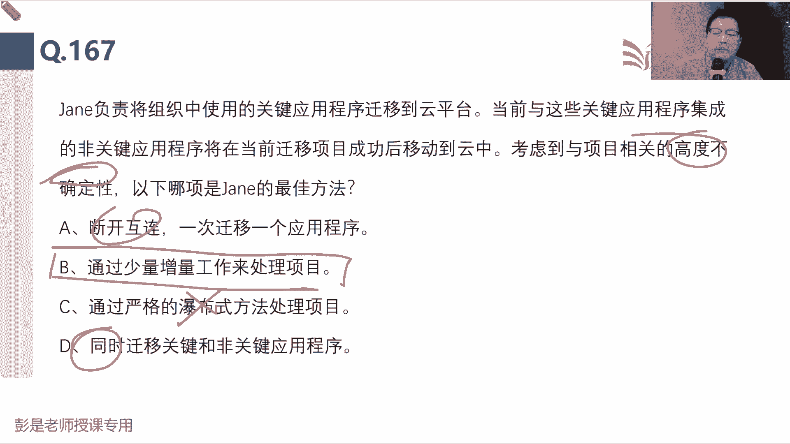

好168嗯，这也送分题吧，周期长不能改变网络图，这说明啥，排列活动顺序有俩仨工具，一个叫逻辑关系，一个叫依赖关系，还有一个叫提前量，滞后料不能改变网络图，也就是这个关系不能动。

但是我们有足够的人怎么办呢，嘿加资源赶工C。

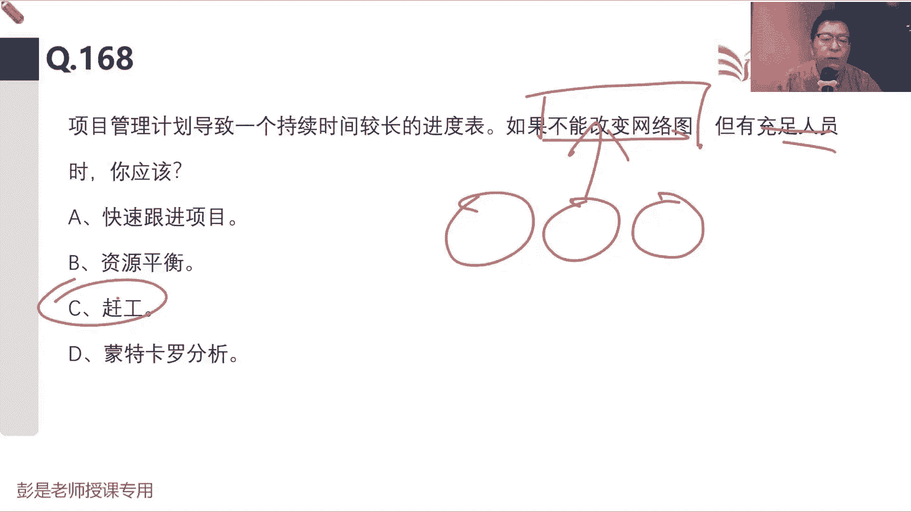

169，这道题啊说我们弄一个新机器来提高工厂产能，该工厂将保持运作和生产，运用敏捷方法完成软件更新，最大程度地减轻风险，但机器的采购安装和集成将用预测型方法完成，那么我们不得不把哪些类型的沟通。

涉及到进度计划之中呢，以确保项目按进度计划，这排除法也行了吧，每周集中办公会，双周书面状态报告会，与每位相关方举行的一对一会议，然后双周电话会反正就排除呗，每位相关方一对一，这好像成本太高了。

浪费时间哈，然后双周什么集中办公，书面状态，电话会议，敏捷敏捷，这个周期越短，周期越短，成本越低，周期越短，成本越低，尽早的尽早的尽早的就这道理发，所以双周不如儋州，另外呢从沟通的有效性和丰富性去理解。

书面沟通，电话沟通不如面对面，所以定位到A，排除排除，因为选项都差不多，比比看就行了对吧，尽早尽早沟通，尽早反馈，持续参与，所以从频率上看，A这个每周比大西的好啊，其中办公呢又比书面啊，电话呀好一点儿。

成本高，题目也没，题目里也没说你没钱，题目里面也没说你没钱吧，对不对，没说你穷啊，并且呢敏捷方法本身就提倡最好集中办公，题目也没说他们不在同一个地方，看不出来这些因素啊。

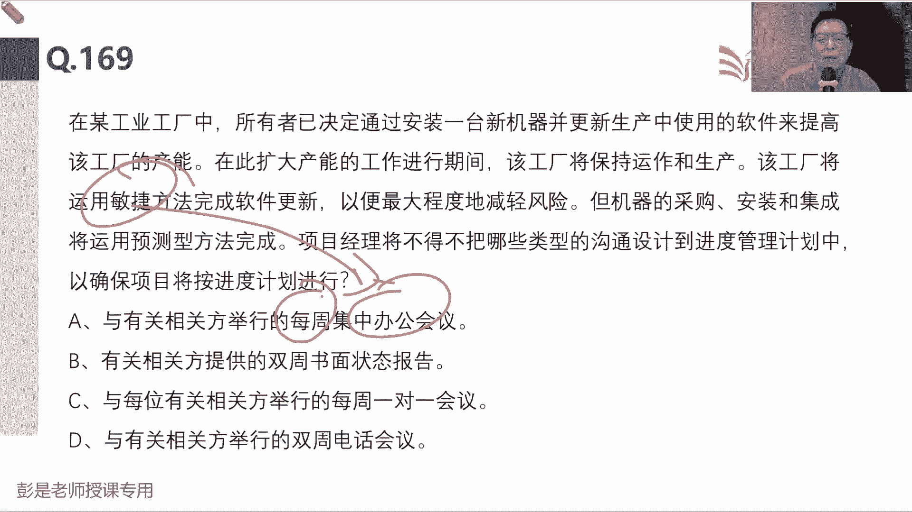

所以不要想那么多好，170嗯，这个也是纯粹的那个单一知识点吧，说如果不是百分之百专注的时候，关键问题是什么呢，是脚踏八条船，这切换，这是浪费啊，所以就是B多任务和不断的在在任务之间切换。

会影响干活的效率，干活的质量啊，在这种敏捷的环境下，你是一周沟通一次还是两周沟通一次，风险小劝劝同学，如果这句话还挺不过来的话，就敏捷课程再听一听再听听啊。

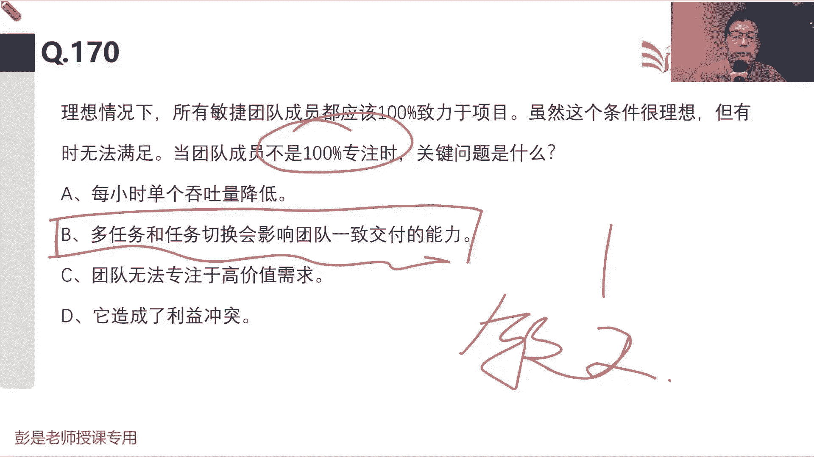

最理想的模式，最理想的模式就是周期越等越好，171说，开发阶段的工作已经外包给一支海外团队，执行期间，海外团队说有一信息被遗漏，设计团队说我们发了，这最有可能的原因是啥，能不能判断出人际关系不好。

不能没有这个必然因果关系吧对吧，那就是A了，其他选项和这个没关系啊，也不说不一定项目经理缺乏沟东西掉，这风险跟这事没关系。

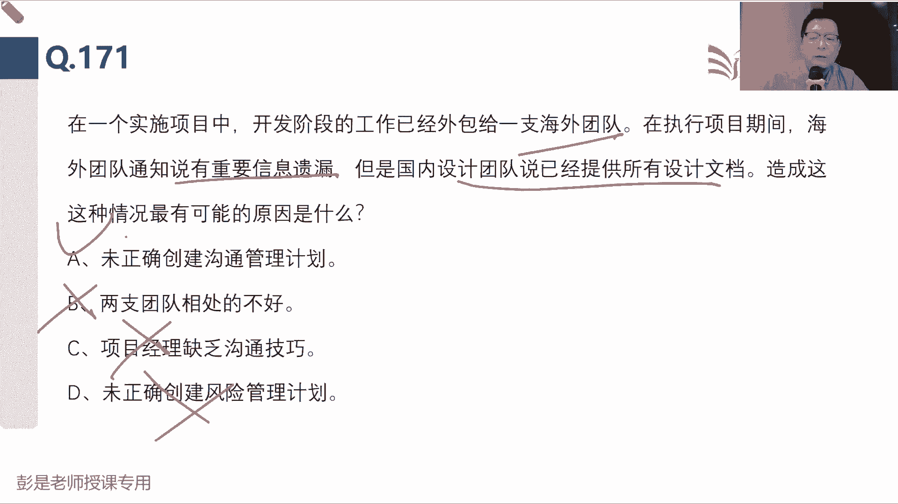

172，这个这前面说过了吧，D选项项目D赚钱不赚钱，不知道机会成本，没有办法通过这个术语判断盈利能力啊，效益成本比需要大于一才能有钱赚，所以呢一比三科普一下，一比三意味着它等于1/3，那么它小于一。

所以不赚钱，最后赚钱的只有项目A内部收益率，这种其他指标大于零，说明有钱赚，回收期不等于赚钱，回收期是告诉你多长时间收回成本。

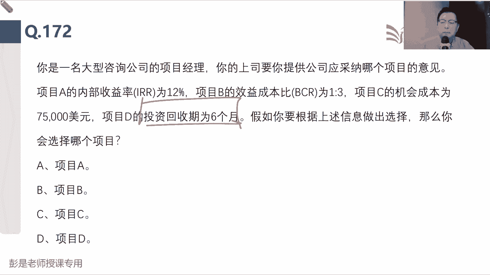

173，选项比题还差，说正在管理一个混合项目，参加完一次迭代审查会，一个相关方告诉叫项目经理啊，他们很忙，问你如此频繁开审查会的原因是啥，中心思想就是避免在错误的道路上越走越远，找吧，这A了吧。

避免干做无用功嘛，避免干活干错了，其他选项不合适啊。

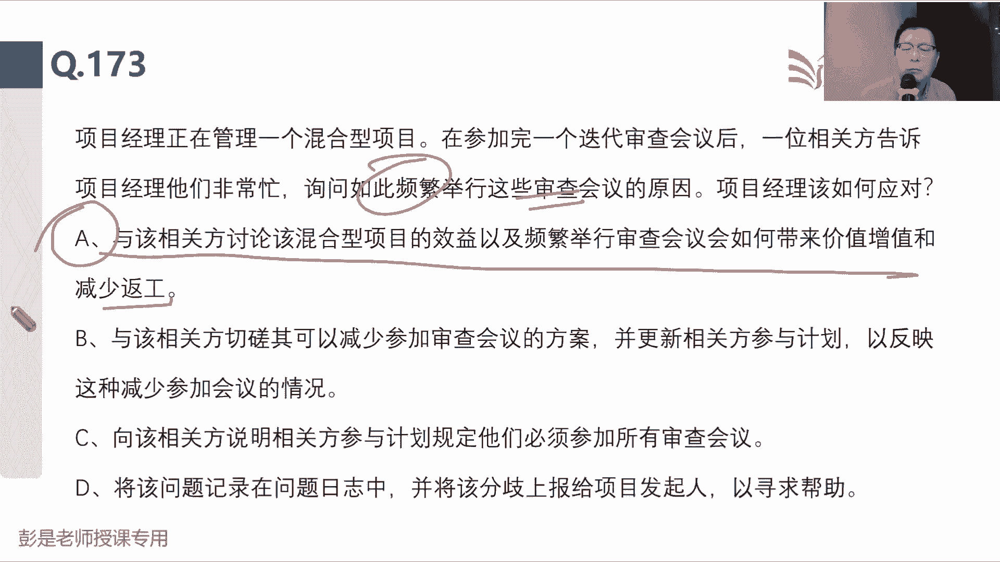

174，这送分题吧，说一堆事儿，排排序，分配人财物推到啥，项目组合管理，对不对，要做的事情这么多，排排序，看看干什么事，干什么事更有价值，好钢用在刀刃上。

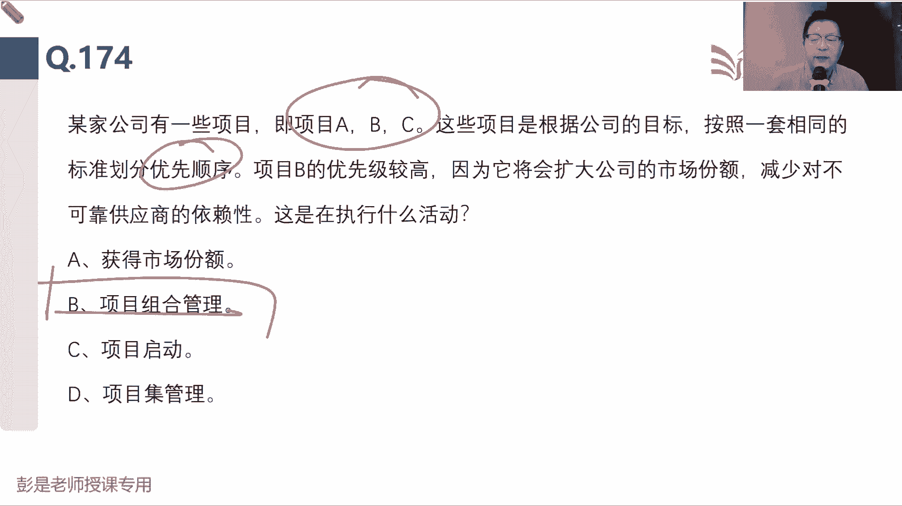

便于我们合理的分配人财物就是项目组合管理，175，说一个相关制定项目章程的时候，有人没有提供意见，你们反复咨询，让相关方提供必要的意见，以便完成宏观需求，虽然努力了，但是呢没有得到改善。

接下来应该怎么做，A肯定不行啊，假定需求找死CD挑一个先做哪个呢，显得我们积积极主动就C了，先分析评估，分析评估完了，该找发钱，找发钱了，要给领导出选择题，不要让不要让领导回做问答题。

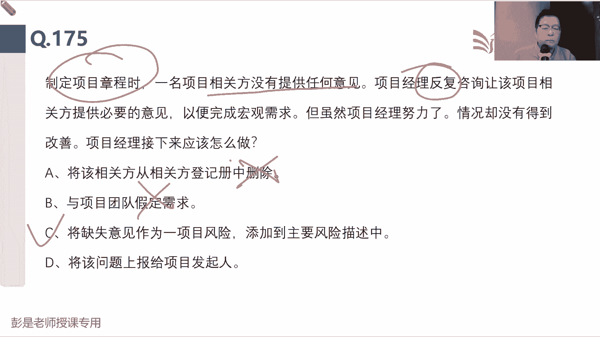

173啊，去看73，不想解释了，可以吗，什么挫伤可以减少，为什么要减少呢，师出无名啊，在敏捷的环境下听一听敏捷的课程吧。

什么叫主要风险思考，项目章程里面的内容不解释了吧。

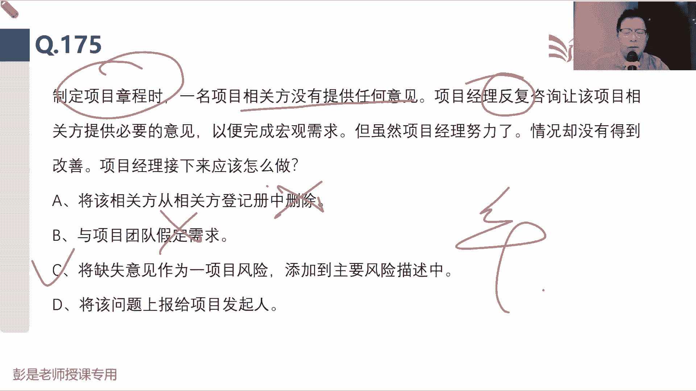

这些整体的整体的宏观的，概括性的都是一个意思啊，176，176好猜吗，您是敏捷实践组织的项目经理，第一周注意到还有人不接受敏捷，怎么办呢，这要敢选啊，敢选他其实是那个英文戴上什么的帽子，是什么意思呢。

扮演角色，所以英文那个直译过来就是戴帽子，其实就是扮演什么样的角色好，所以就是C。

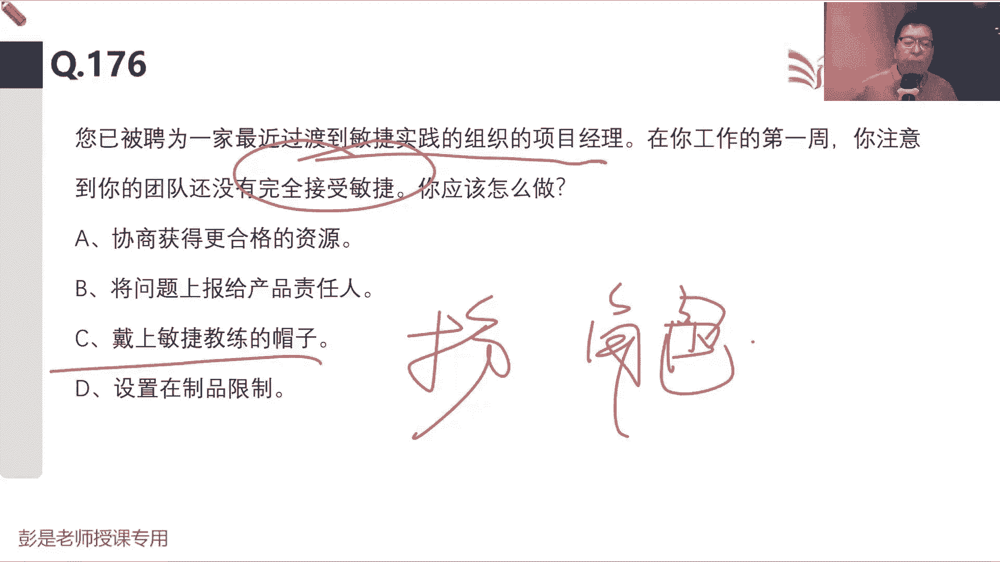

177说有人活没干完怎么办，聊呗，对沟通，面对问题和合作，面对问题，解决问题，出了问题，分析原因，为其他选项不合适啊，排除排除。

好再往下178，这个这个刚才前面说过了，说这个错误本应该由团队检测到，以下哪种技巧可以鼓励养成防错纪律，就不说人话，什么是防错纪律呢，怎么把这个墙弄得很直呢，怎么把这个线画的很准呢，测试驱动开发。

怎么保证每个人奥运会都跑到点呢，测试驱动开发呀，这不是防错吗。

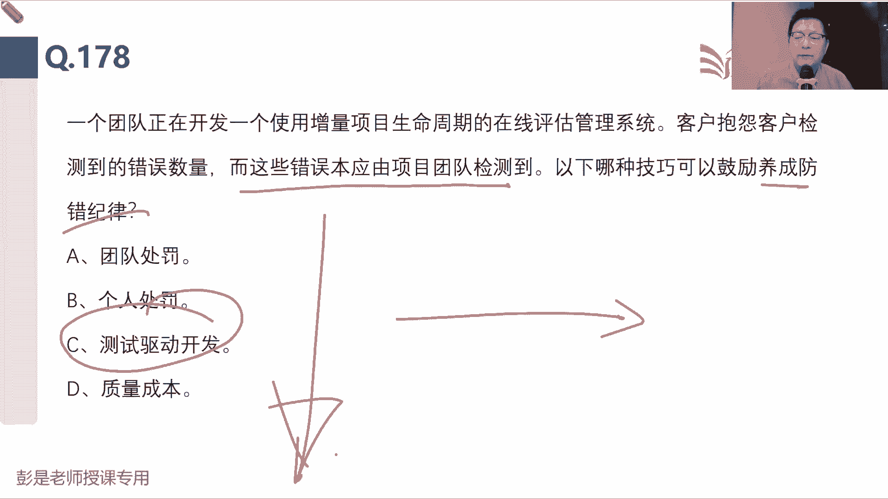

好179，179需要算吗，任务A的成本估算是1000美元，计划完成，12月30号，总工期是十天，结果呢12月30号看状态，截止到目前应该完成多少工作呢，那就是1000倍，所以是D。

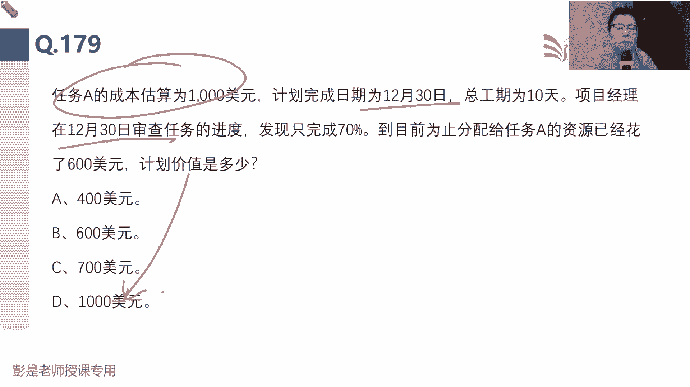

180，这个也要纠结吧，这个大家这种题一定要脱离实际啊，有成员表现很好，然后没钱，然后他请假，但是假用完了，想预支下个月的休假，公司规定公司规定啊，不能预知怎么办呢，那就不批准呗，没办法啊。

啊不批不批不批，特例是特例是啥，还记得那个什么窗口效应，羊群效应吗啊规则规则规则一旦被破坏，这口子一开就搂不住了，一定是这样的啊，好所以相对来说能选的选项就是B，能选的选项就是B啊，怎么做更好呢。

怎么做更好呢，可不可以去考虑啊，咱组织的组织成员，咱一起来想办法优化我们的章程呢，这可以吧，对不对，所以你看很多公司不都这么这么干的吗，对吧，业绩突出的人，你有没有有没有企业。

有没有同学听到过什么叫迟到卷儿，这是不是在优化我们的规章制度啊，就这东西啊好所以相对来说不能开这个口子，口子一开，有人闯红灯没人管哎，有人加塞儿没人管，一旦有了特例处理，特例处理规则一旦被打破。

哎就形同虚设了，对不对，所以其他选项都不合适啊，好各位同学，今天听课辛苦了，然后接下来你们要做的事是什么呢，咱学学学完了要用啊，反思啊，看看自己当时是财迷心窍了，怎么就把题稀里糊涂就给做错了啊。

并且应该能找到至少十道题呀，20道题呀，是什么马虎啊，没看清楚啊，困啦这种这种因素啊，这种因素丢分不值得不值得，还是需要大家想办法想办法提高士气的啊，好不浪费大家太多时间了，后面有有疑问有疑问。

咱随时微信群里面沟通讨论交流，拜拜拜拜拜拜，质量成本能放松吗，质量成本就包括了预防评估内部失败，外部失败，好的质量是规划设计出来的，质量的五种水平，质量的五种水平，这是一定是重要的考点，难度大。

不知道具体情况具体分析下，每个人感受不一样啊，今天我还听到有同学说啊，哎呀今天的题90%都是敏捷，其实没有哈，其实没有那么多，所以这很很带有主观倾向性，这东西说不清的好，辛苦了辛苦了。

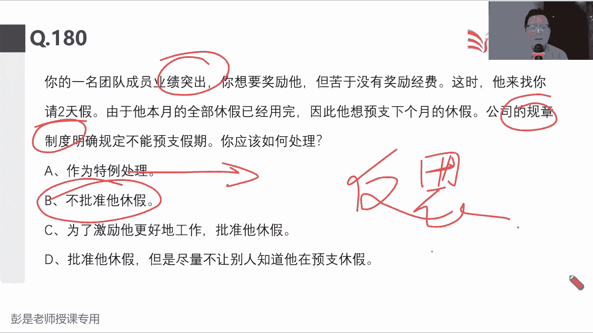

各位同学下次上课再见，拜拜大家好，本视频为up主，给大家争取到了第一次模考的全部试题。

大家记得一键三连支持一下，正式学员会在考前有三次模拟考试。

想要了解其他试题的同学。

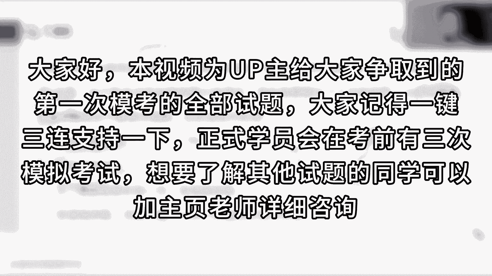