# 2024年最新版PMP考试第七版零基础一次通过项目管理认证 - P10：1.2.3 组织系统 - 慧翔天地 - BV1qC411E7Mw

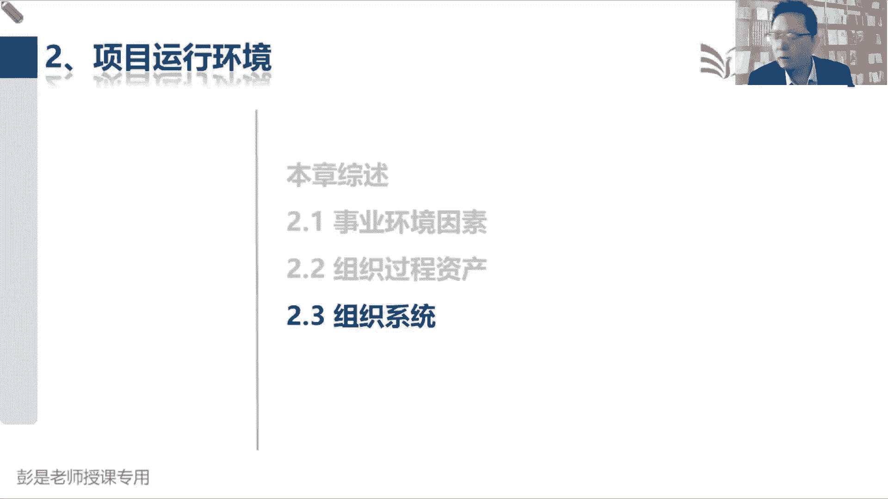

2。3组织系统啊，好0917，这个同学说改了改去啊，一堆文件夹都不知道改了啥，所以版本管理要有规矩啊，这些文档这些资料的命名要讲技巧了吧，这不能胡来啊，这个命名一旦规范的话。

你就知道你的能够更好的更好的更好的追溯了，另外呢为了安全起见，你最好最好是不是，每个文档之前有一个修改记录啊，这都是工作里边的具体实践了啊，每个文件里面一开篇，第一页是第一页是这张这张文档的标题命名对。

第二页通常就是修改记录，对不对，1。0版本谁起草的，1。1版本改了什么内容，1。2版本改了什么内容诶，便于追溯，好这个具体实践方法，考试肯定不考的太细了，回到知识点，那231这段文字组织系统。

我们组织系统，组织系统讲这段知识点之前啊，因为它超抽象，先给大家搞定一个单词，说我们运行项目时，需要应对组织结构和治理框架带来的制约因素，为了有效高效的开展项目，项目经理需要了解企业内的职责中。

责职权的分配情况，有助于项目经理有效的利用权力，影响力能力，领导力，政治能力，完成项目，说什么独特的系统，什么权力，政治能力，什么管理要素，超抽象一堆单词啊，变成人话是什么意思呢。

咱们就书接上回说我们要创业，记得吧，要创业要先想想清楚我们做什么事，接下来做企业的战略规划，然后呢有些事情把它完成就可以了，还有项目管理，另外呢每天重复的买菜做饭，卖出去运营工作。

然后呢有一些项目之间存在着关联关系，我们需要有项目及这种管理方法，要做的事情这么多，需要排排序，帮助企业更好地实现战略目标，合理的分配人财物，又发现了项目组合这种管理方法好，所以最后一总结企业管理地图。

这是目标管理战略管理，项目及项目组合，项目运营管理，这是我们现在把事搞清楚了，接下来该干啥了，把要做的事情梳理清楚，梳理明白了，接下来得找人去干活了，对不对，得找人干干活了吧，嘿我们需要一些投资人。

需要一些公司什么董事会高管，我们定方向，定目标，需要由公司领导定做，企业的战略规划需要有人管，项目，需要看看我们公司需要运营的时候，需要什么职能部门需要有采购物，买柴米油盐酱醋茶，需要有服务员擦桌子。

打扫了上菜，需要有收银员，以此类推导，接下来思考的就是人干活需要什么样的人，那人人人接下来要分什么呢，架构，对吧，公司最上面是什么董事会，董事长，CEO总经理，再往下，我们分成几个部门对吧。

有人有有前台，前台主要包括什么服务员，有人管钱对吧，有会计，有出纳，有财务，有收银的，有人管，有人管啊，采购，因为管仓库管管，买东西可买原材料，以此类推，就有了组织架构，组织架构，组织架构就是分析啊。

干这些活儿需要什么样的人，这些人呢分别负责做什么事，他有什么权利对吧，这能听懂吧，这是大堂经理，这是大堂经理，主要管服务员吧，下面带着张三李四王五，这三个服务员，张三啊，你管这两张桌子。

李四你管这两张桌子，王五你管这两张桌子，这是我们的收银员，他主要负责收钱，你就站在前台对吧，让人家扫码交钱就可以了，这是我们的采购，张三负责买柴米，油盐酱醋茶，李四负责买萝卜白菜，王五负责买羊肉牛肉。

以此类推啊，职责职权，忠犬做好分工，做好分工，这就是组织架构的重要作用，说清楚大家的工作职责是啥，那有了工作职责呀，还不够啊，还需要有什么呢，最重要的企业企业企业运转啊，要有刚才我们见过啊。

组织过程资产的要有流程，对不对，怎么买东西呀，怎么去给客人上菜呀，客人客人点餐，点餐之后怎么给人家上菜呀，怎么告诉厨师做什么菜呀，除了菜做好了，怎么给人家端上去啊，要有流程吧，说清楚大家在流程，在流程。

在流程里的什么呢，分工啊，对不对，要想让这个流程走下去，大家在流程的各个节点里面，谁负责做什么事情，谁负责做什么事情，以此类推，所以就有了那一大堆政策流程制度，程序标准规范，那这些东西它存在的目的。

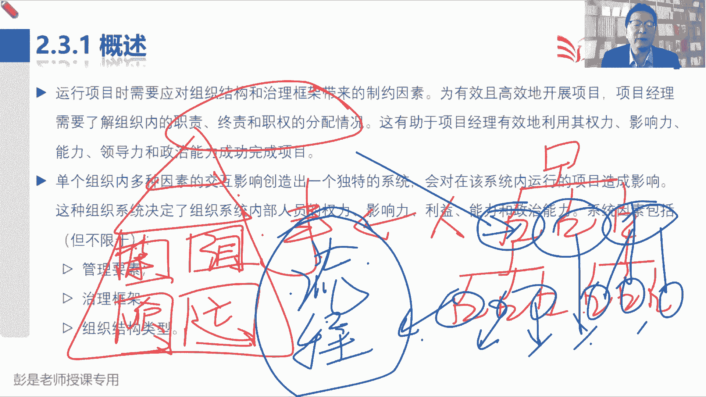

存在的意义是什么呢，就是为了中心思想这一个字，职权权责唉，权力的游戏就这样粗暴理解权力的游戏，这个单词叫什么呢，叫治理，这叫这个操作叫什么呢，叫治理好了，就这个东西，所以啊231啊。

前面这一大段文字呢就在说呀，公司高层，公司高层要要确保你公司啊能够有效的运转，不管是项目，项目及项目组合还是运营，确保这些事情能够有效地运转下去啊，你需要把这个权利啊，责任啊给大家掰扯清楚。

这样我们企业按照我们既定的这些政策流程，制度标准，政策程序规范，就可以有效地运转下去，然后呢还要根据企业的情况，不断的不断的去改变，去优化，去调整这些玩意儿，总之就叫治理好，知道这个意思啊。

所以大家生活中你听到新闻，听到新闻说这个地方这个地方我们对吧，什么组织几个部门，什么消防啊，卫生啊，安全啊，工商啊，税务啊，组织几个部门联合治理，联合治理为什么要治理他，为什么要联合治理呢，就说明乱了。

乱不就代表着政策流程制度程序标准规范，这些东西都不清楚吗，三不管对不对，三不管的才会乱，所以才需要治理，治理是说呢这事归工商，这事归税务，这事归公安，这事归消防，把这事掰扯清楚，这就是治理。

说清楚大家的分工，说清楚大家的职责，确保这些事情能够有效地运作下去，好知道这个中心思想这些抽象的概念，你说老师要不要背下来呢，根本就不用背啊，不用背就约等于权力的游戏。

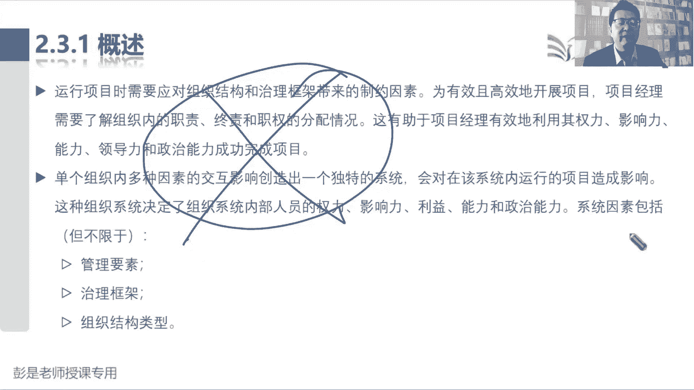

记住这个结论就够了嗯好所以后面这段话啊，听一听就完事了，说治理是指组织各个层面，有组织的或有结构的安排，他的目的是确定和影响组织成员的行为，因为我们要说清楚大家的全责，对你负责干啥就负责干啥。

把这个全责全责全责说清楚，他就不不就知道该干啥干啥了吗，所以这里要考虑人员决策结构，政策要求，通过数据和反馈提供指导和监督，总之权力分配，确保这些人能够有效地运转下去，客户发了一个消息，发了一个合同。

合同咱怎么怎么怎么流转，对不对，张三体力给请求，我们怎么怎么走流程，把他把他把他落地，以此类推了啊，让大家工作更有序，不至于像无头苍蝇一样，好继续了啊。

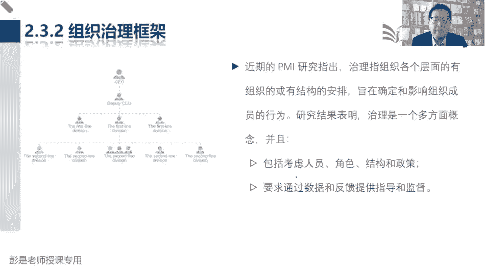

再往下那治理是在组织内行使职权的框架，权利的框架，权力的游戏权利，说清楚，权力的边界就包括规则，政策，程序规范关系系统过程，这些单词不用记不用记，记住也没意思啊，那这个框架会影响不念了。

会影响我们企业运转的方式。

对不对，好，那233管理要素，管理要素这段内容啊，基本上也不考管理要素是什么呢，这是你想一想我公司分成几个部门啊，所以是指组织内部，关键职能部门或一般管理原则的组成部分对吧。

有的时候有的公司你想想什么市场啊，营销啊，销售啊，哎呀这听起来都差不多呀，那到底部门怎么划分呢，他有原则，这个原则咱也不考了解就可以啊，所以后面大家复习这段内容啊，想看就看，不想看可以不看了。

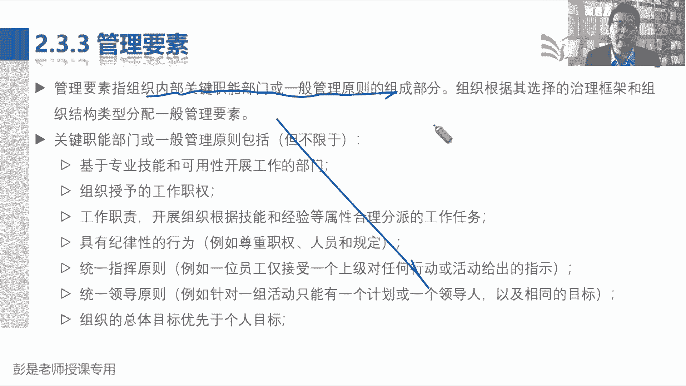

好什么，关键职能部门管理原则非常高大上的东西。

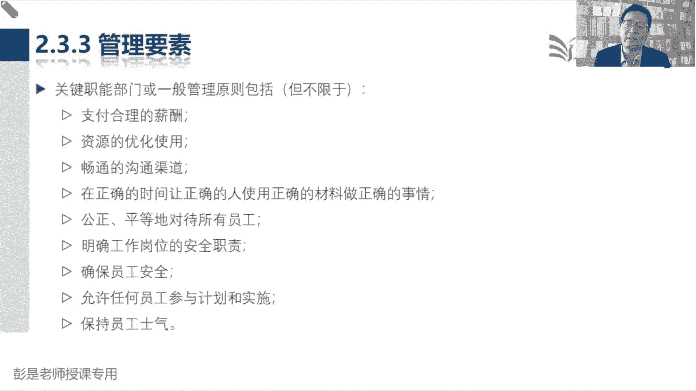

非常抽象的东西，可以不看了啊，不念了，那234就带出了新的知识点，这需要大家掌握了吧，根据现在我们的理解，总之结论就是刚才有一道题还有印象吗，高层来说清楚权力的分配，权力的分配，权力的分配。

权力分配最重要的作用啊，就是告诉我们呀小事交给不重要的人，大事这个人就需要权力高，品一品这个意思，小事啊，他不需要有很高的权力就可以做这个主啦，大事一般人可能做不了这个主，就需要权力高一点。

所以就带出来后面组织结构类型，这个知识点我们要根据企业的情况，这些大事小情，什么样的事情分配分配给做这个事的人，什么样的权利，对不对，就这个意思啊，嗯就像家里面日常啊，我买柴米油盐酱醋茶。

我自己说了就算了，但是你家里边要什么，买房子呀，买车呀，还这大事大事啊，咱可能需要家里面成员协商商量着来，就这个中心思想，所以给出来这么一张表。

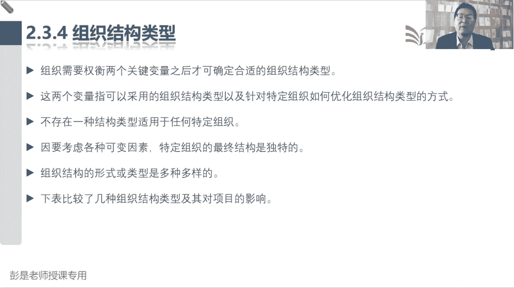

这张表这张表啊，先先不要着急去看书，做笔记啊，先听，因为涉及到好几种讲法，听听明白意思，最后记结论，最后我总结的时候记结论就够了，第一个叫系统型或者是简单型，它主打一个什么呢，灵活主要人员并肩工作。

人员并肩工作，在强调啥，能猜到吗，什么叫人员并肩工作，这四个字搞定，哎同级对不对，平起平坐，大家都是兄弟，大家权利是一样的，权利平等吧，只有这个中心思想吧，在某些场景之下，大家都是平等的，这能听懂哈。

就为什么什么坐公交车，这个座这个座到底谁坐呢，大家都是平等的吧，哎都可以坐呀，都可以坐，但是呢国家根据相关的相关的我们的道德观，世界观，价值观就给了某些人特权，比如说老幼病残弱诶。

我们要照顾这些弱势群体，这些人有权利可以先做，对不对，这就是治理啊，说清楚说清楚这个权利的边界，说清楚这个权利的大与小，以此类推，所以对于对于什么样的企业适用于，对于什么样的企业。

适用于平起平坐这样的场景呢，嗯但是对于什么样的场景，适用于平起平坐这样的权利分配的模式呢，倒推倒推什么样的场景适用于说我们都是兄弟，大家都一样，平起平坐，来预习过的同学，就知道这个知识点还能猜出来哈。

所以倒推你就随便想场景，比如说我们公司10万人，我们公司10万人呢，大家都是都是兄弟啊，都是平起平坐，都是平等的，这种情况下，你企业做决策容易吗，众口难调啊，张三希望八点上班，李四希望08：30上班。

晚五希望九点上班，周六起不来，希望11点上班，这很难达成共识的，对不对，所以人多人多，自然就要分上下级，就很难做到平起平坐，所以人少，所以通常初创公司。

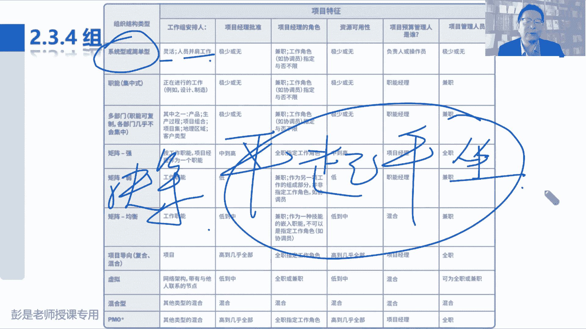

初创企业对创业公司人不多呀，七八个八九个，四五个，三六个诶，人少，大家都是兄弟，都是创始人，平起平坐，这是气动型简单型，通常这样的模式了解就可以哈，然后再往下，接下来就是权力，从小到大。

项目经理在项目上的权利，从小到大到大，常见的五种组织结构类型，第一种啊叫职能型，我们在项目上的权力是最小的，第二种叫弱矩阵，第三种叫平衡矩阵，第四种叫强矩阵，最后一种叫项目型，在这五种组织结构之中。

项目经理是按照这个顺序，12345这个顺序啊，这个标号权利从小到大的，因为刚才说过这个逻辑大事，项目经理需要权力大对吧，比如我们公司打算对办公楼重新翻修，翻新一下，打算把我们公司这个办公楼啊拆了。

重建这么大的事，这个项目经理就需要很大的权力啊，才能够让我们企业这些人呐，这些人去听命于他，帮助他更好地完成这个任务，实现目标，因为这涉及到你要需要做一个临时的办公场所，让各个部门呐搬家。

然后呢搬完了之后啊，等新楼盖好了之后再搬回来呀，这事儿就需要这个项目经理权力很大，才能够更有效地促进这个事情往前推进，那像小事对吧，公司门口门口大门找张三临时给刷刷漆，这小事找个保安就把这事儿办。

项目经理就不需要有很大的权利，以此类推吧，所以其实就是组织治理的中心思想，权力的分配，权力的分配，我们要考虑企业要开展的这些这些项目啊，10万块钱的项目，100万的项目，一个亿的项目，十个亿的项目。

不同规模的项目，需要给项目经理配什么样的权利，哎就这个中心思想好，所以记住这个结论，从职能型到弱矩阵到平衡矩阵，到强矩阵到项目型，项目经理的权力是从小到大的，从小到大。

也就意味着我们掌握的资源从少到多啊，掌握的资源粗暴理解你的下属，你的下属，对不对，我没什么权利，照顾好自己就可以了，没什么资源啊，我有很大的权利，这个项目组啊，100个人呐都听我的呀。

诶掌握的资源从少到多，然后再往下项目预算和管理人是谁，只要记住这一行这一列就够了，看看啊，在弱矩阵组织结构之中，谁管钱呢，职能经理，谁管钱谁就说了算，谁管钱谁手手里边有权，这个能懂吗，带场景的话。

就各位同学想一想，你家里谁管钱，在我们家，我母亲管钱唉，说了算呢，对不对，诶，那在我们自己家里边，我媳妇儿听我的，以此类推了，所以谁里边管谁管，项目的预算就说明他对这个事情负责。

他是这个事情的中责任责任人啊，好所以弱矩阵组织结构之中，接下来结论是什么呢，项目经理在项目上的权力是小于职能经理的，人家说了算，各个职能部门，各个职能部门参与项目的职能部门，人家说了算，人家管钱。

人家管资源，我们呢就是干活的，就是干活的，所以叫美其名曰项目经理，基本上没有权利以此类推了吧，好所以最后的结论看啊，职能型组织结构之中，职能经理掌握前人家说了算，若矩阵组织结构之中。

只能尽力掌握前人家说了算，所以这两种组织结构之中，项目经理在项目上的权利基本上等于零，基本上等于零吧，没什么权利，那接下来最后做做笔记，怎么记呢，就用这个授权符号，在职能型组织结构之中。

我们在项目上的权利小于职能经理人家做主，在弱矩阵组织结构之中，我们在项目上的权利小于职能经理人家做主，在平衡矩阵组织结构之中，双方混合掌握项目的预算，所以就变成了等号，在项目上的权利啊。

项目经理有一些职能经理，有一些预算的项目经理，管一些职能经理，管一些平起平坐，这才是各管各的，对不对，我们家我管我的工资，我媳妇管我媳妇的工资，哎我们平起平坐，各管各的，双方混合掌握家庭的预算。

就这个逻辑啊，好那按照这个结构，职能型弱矩阵平衡矩阵，那到了项目型啊，到了强矩阵就不一样了吧，强矩阵是项目经理单独掌握项目的预算，所以呢咱在项目上的权利啊就大于职能经理了，咱说了算了，翻身翻身，把歌唱。

最后项目导向型项目型它的特点是什么呢，唉也是项目经理，也是项目经理管钱吧，这种组织结构啊，就是我们把职能部门挂到项目经理下面去了，把各个职能部门归到项目组里，由项目经理直接管理职能部门。

比如说工程建筑通常就载，就采用这种组织结构类型，你路过什么，修地铁，该住宅小区，看看人家那个名牌对吧，项目经理是谁，看看这个项目组上什么设计人员，施工人员呐，都归项目经理管，把部门归到项目里面去。

所以叫直接管理职能部门。

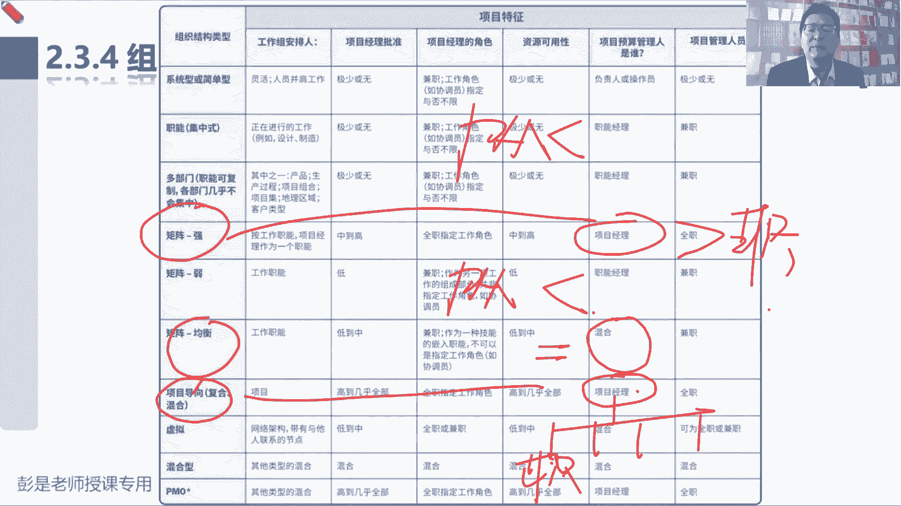

这样一个逻辑好，这就是关于组织结构类型，这一页内容就是根据刚才记得这个结论哈，系统型扁平型初创企业，小规模企业大家平起平坐都是兄弟，这个学到最后敏捷，通常用这种模式，现在先不先有个印象就够了。

然后像后面这几种啊，就从惨从最惨到最好，最惨的就是职能型，好一点的落矩阵，再好一点的平衡矩阵，再好一点的强矩阵，我们大到拥有全部权利的，就叫项目型，直接管理的职能部门，他归咱管，是咱的下属。

那从这五个等级上来看，我们拥有的权利从小到大，我们掌握的资源从少到多，然后呢在弱矩阵，在智能型里边，我们是小于职能经理的，在平衡矩阵，我们是等于职能经理的双方混合，掌握项目的预算。

在强矩阵我们是大于职能经理的，咱们在项目上的权利大于职能经理，咱说了算，单独掌握预算，在项目型我们叫直接管理职能部门，直接管理职能职能经理就记这个结论就够了。

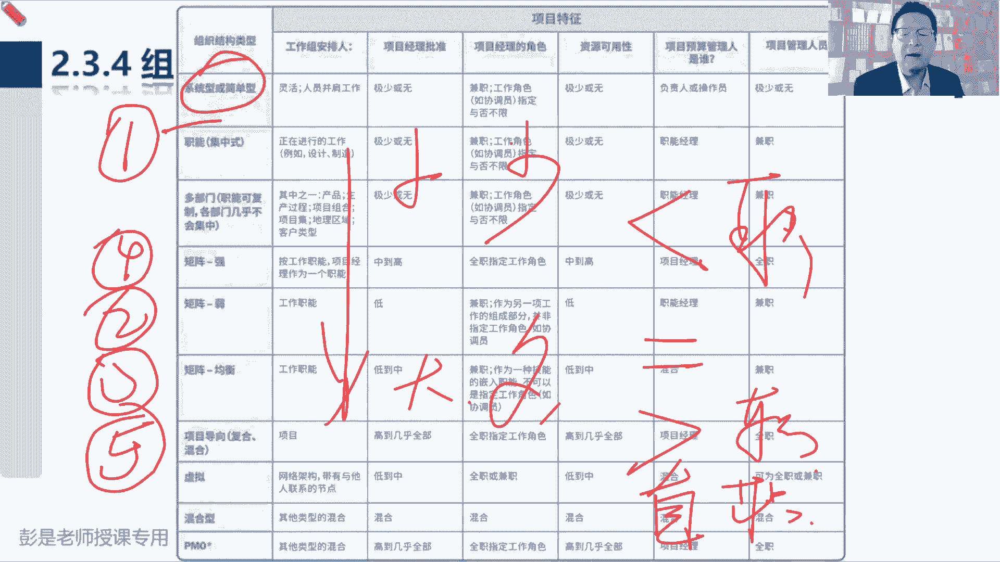

好这就是关于这个啊，然后中间没讲到的什么多部门啊，什么混合型啊，pm啊，后面再说，天猫会一会单独讲混合型呢，就是具体情况具体分析，虚拟啊，它其实不是组织结构类型，他们讲到团队管理才说了啊。

这就是关于这张图，大家需要掌握到这五个东西，这个这个这个这个这个这个，矩阵的就是结构，就是结构，就把它想成组织结构，组织架构，因为我们要约定上下级关系，同级别关系，这不就叫矩阵吗。

就是表格就是表格能够体现横平竖直这个结构，所以这张表老外通常也把它称为矩阵，表格形式啊对吧，张三和李四，你们俩平起平坐王五啊，是他俩的上级，然后赵六呢是张三的下级，这种横向纵向的结构就称之为矩阵。

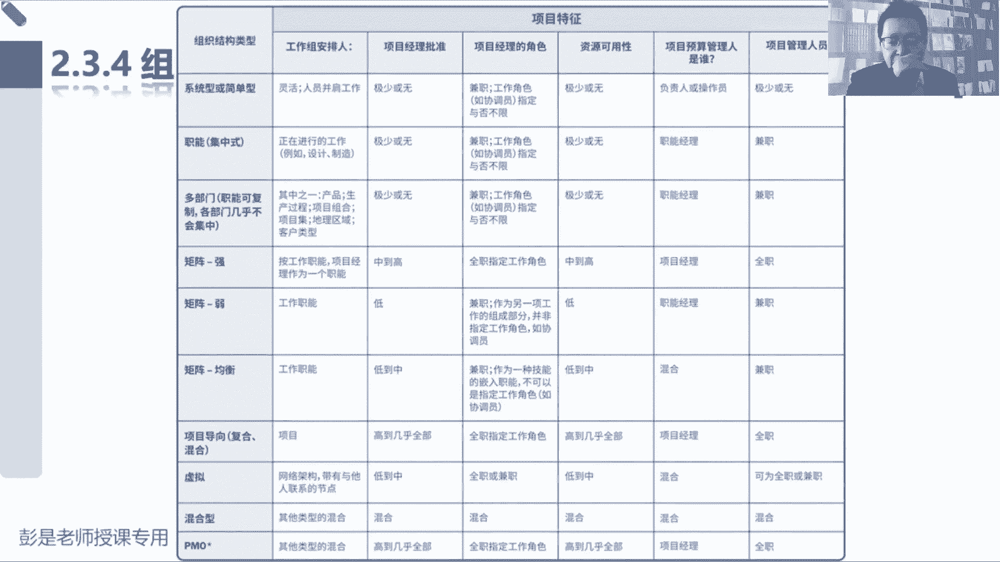

好那再往下了啊，智能型和弱矩阵的区别啊。

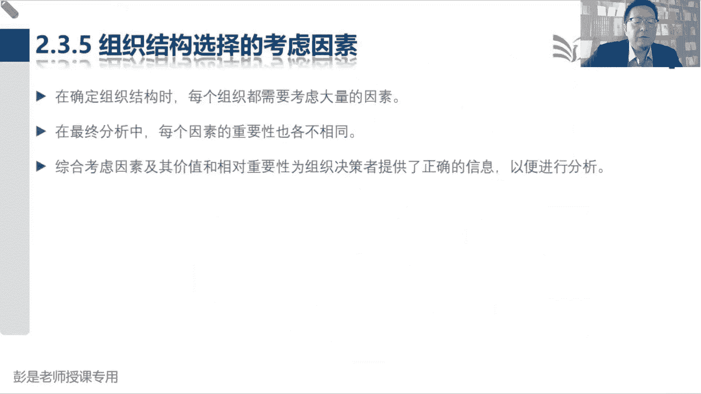

其实考试来说，现在这种细节基本上不大好，智能型弱矩阵如果真的要区分呢，如果真的要区分啊，就是在职能型组织结构之中，项目经理屁也不是，所以通常把它称之为叫联络员，这停一停就完事了。

现在基本上不太会考联络员，就通风报信，每天看看张工，你工作日志写完了没有发给我呀，我来收集一下，哎呀您挺忙的，没时间没时间没关系啊，我可以等，就这么怂啊，因为我们没有权利，这是联络员，然后若矩阵呢。

我们可能有一定的协调的权利，这个权利啊基本上也少的，少的可怜，基本上有限，好知道意思就够了啊，现在这种概念基本上不考，基本上不考，好再往下了。

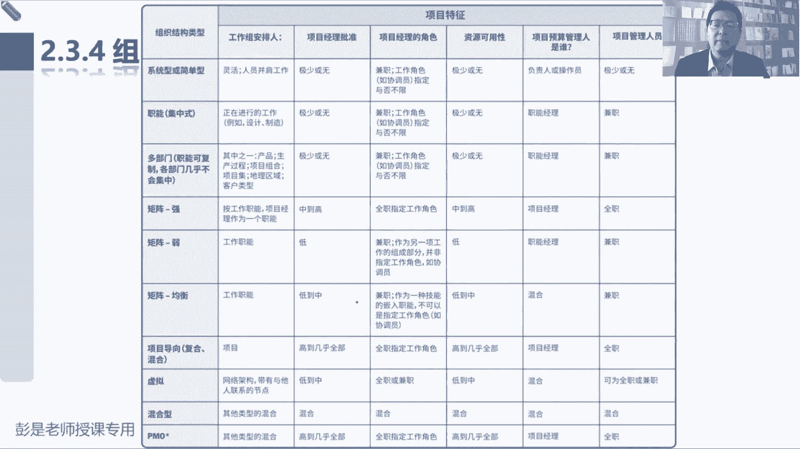

那接下来235听完这一段，大家就可以休息了啊，马上重大利好了，组织结构类型要考虑的因素，这段文字啊，最后一总结三个字，看情况，我们确定组织结构结构的时候，要考虑大量的因素，在最终的分析中。

每个因素的重要性也不相同，综合考虑可以帮助我们企业做正确的决策，就是这个小事交给谁，大事交给谁，实在不行，老板亲自挂帅，各种可能性啊，对就是看情况。

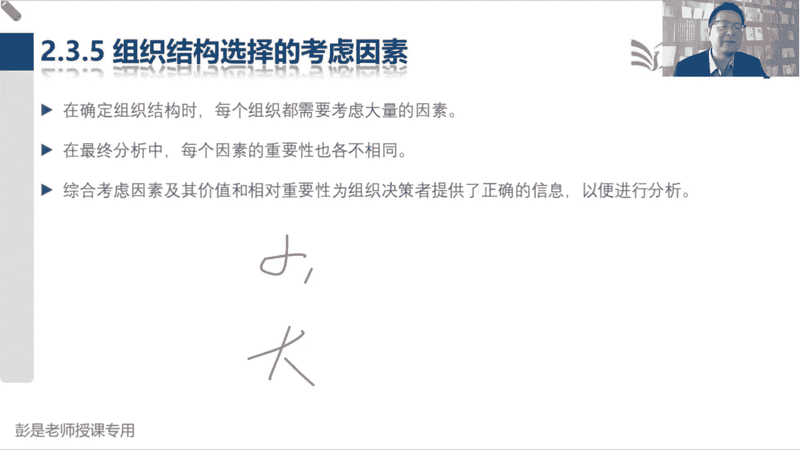

所以这些情况包括什么呢，不需要大家去记得，咱又不考组织，这里对不对，不考如何进行组织，这里好，所以这段文字呢可以不看了，他写出来就是说未来各位同学呀，真的如果需要，如果需要，所以啊这个项目啊。

这个项目我在项目经在项目上啊，没什么权利啊，张三李四王五赵六各个部门那也不配合我呀，那这种情况下，我们要给领导提出我们的建议，对不对，建议什么呢，咱要不要对企业进行开展一下治理工作呀。

把这个权利呀咱再重新收拾收拾啊，我这个项目啊会影响到公司的生死存亡了，既然这么重要的事情，咱是不是适当的适当的考虑，提高一下项目经理的权利呢，便于更好地推进工作呀，还给老板提出相应的合理化的建议和见解。

但考试来说吧，不会考这么这么复杂的场景，所以呢这段文字想看就看。

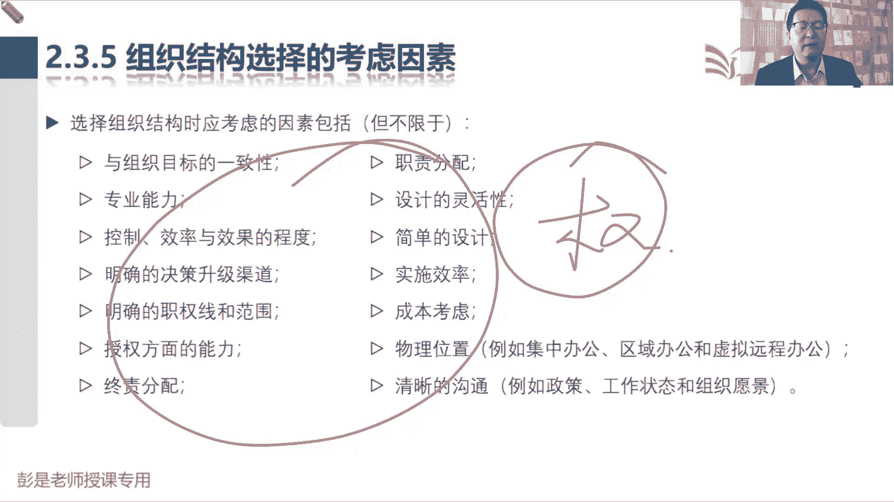

不想看可以不看了，好236，这就需要大家记住了啊，这个知识点是这一章第三个重要的术语，前两个叫事业环境因素，组织构成资产，第三个呢就是PO那讲PO之前参债缓口气了，现在是11。09，休息到7分钟。

时间休息到11。16准时回来，最后一小段课程开始冲刺了，哎学习不易啊，应该有些同学已经睡着了吧，说老师啊，这个课是有的时间，有的时候一个小时，有的时候像现在这节课呀还剩40分钟啊，为什么有的长有的短呢。

拐个小弯啊，提提神呐，为什么有的长有的短短啊，这意志力耐力体力也是咱们考试的重要事项啊，为什么呢，正式考试还记得多长时间吗，四个小时了，早上九点钟开始考试，你要在那个地方坐四个小时，这是煎熬。

这绝对是煎熬啊，没有足够的意志力，没有足够的体力，没有足够的耐力就疯了，真的是疯了，大家是目前在工作中做四个小时的场景，很少很少啊，现在包括大家听课，有的人可能坐着，有的人躺着，有的人趴着，有的人站着。

对不对，累了累了，困了就想方法想办法溜达溜达，所以咱的课程呢有的时候长，有时候短，训练训练大家的意志力，耐力体力，这玩意一定要这玩意也要训练啊，所以各位同学啊，各位同学在考前到时候再说了。

要想办法想办法调整自己的生物钟，让自己呀让自己能坚持四个小时对吧，战斗力满满，精力旺盛，达到这个状态嗯，好拐弯，拐回来，那236项目管理办公室，项目管理项目管理的一个办公室，他的主要工作职责是什么呢。

就是项目管理，希望我们公司啊不管是什么类型的项目啊，大家干活啊都标准都规范，有规矩，就这意思吧，让我们的这些项目管理的方法呀，更贴合我们工作的场景，让这些方法能够帮助各位项目经理，更好地完成任务。

实现目标，得到期望的成果，所以它的主要工作重心就是这个方法，就是这个方法，所以是对项目相关的治理过程进行标准化，规范化，你就按照人家这个流程，12345管项目，就可以帮助我们更好地完成任务，实现目标。

所以他最重要的作用就是定什么，项目管理相关的政策流程制度程序标准规范，从而帮助项目经理能够更好地实现项目目标，提高项目成功的可能性，好拐弯拐弯拐弯拐弯来啊，所以项目管理，项目管理办公室最重要的作用。

搞定之后呢，再往下。

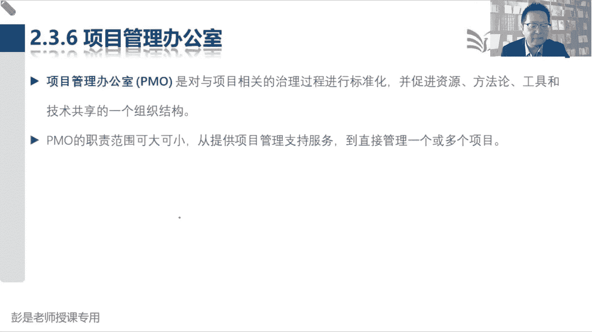

那常见的有三种类型，说PO有几种不同类型，他们对项目的控制和影响程度各不相同，叫支持型控制型，第三种叫指令型，啊从小到大，所以大家带场景就超好理解这个知识点，什么场景呢，比如说各位同学啊。

假设你们公司目前没有PO，然后呢，老板让你成立一个项目管理办公室，然后你就拉上张三李四王五赵六，叫上几个项目经理，咱一起啊来商量商量啊，我们公司啊，我们公司这些项目到底怎么管呢。

这种情况下刚成立的时候啊，没底气，对不对，定出来的这些政策流程制图标准，程序规范，可能觉得不那么完美，不那么优，不那么优秀啊，怎么办，知识型就怂一点，我们给各个项目经理啊提供支持，担任顾问的角色。

向项目经理提供模板的最佳时间啊，培训啊，来自其他项目的经验教训，所以对项目的控控制程度很低，因为他心里没底啊，对不对，所以我们的意见仅供参考，就是顾问吧，这叫知识性，然后随着工作的开展。

我们不断的不断的诶，帮助各个项目经理完成各个项目的管理工作，总结出来，总结出来很多的经验，这种情况下我们就可以出规矩了，定标准定政策，严格的要求项目经理啊，按照咱的规矩来，所以控制性不仅给项目提供支持。

而且通过各种手段要求项目服从，你得按我的这套方法来了，这就是控制型，这是第二个等级，第三个等级叫指令型，我们做大做强了怎么办呢，直接管理和控制项目，我们招一大堆专职的项目经理。

归到项目管理管理办公室里面去，这些专职的项目经理，我们直接参与项目的管理工作，直接接手了，哎这就是指令型，所以我们对项目上的控制力度就是要从小到大。

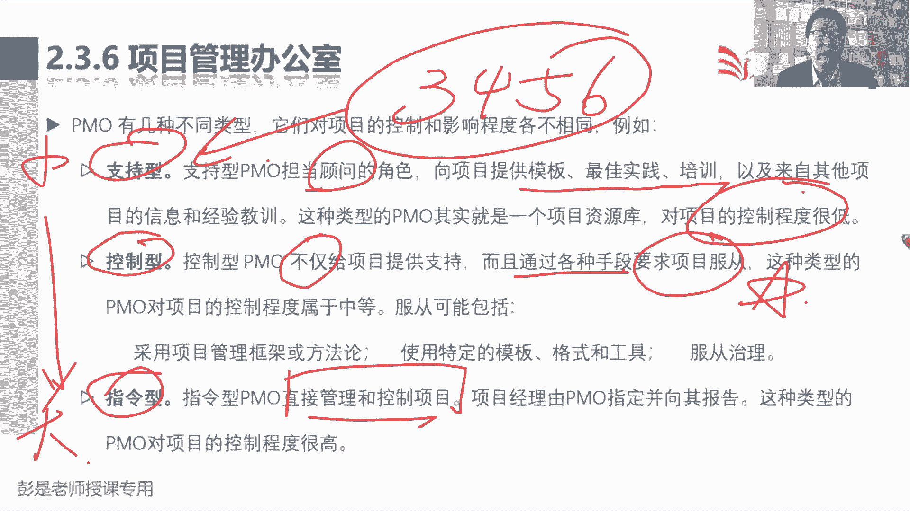

最小的支持型，反正我说了你爱听不听，对不对，我说了你爱听不听，我们没有权利要求对方服从规定，控制型呢，我们有了相关的制度，政策流程标准规范，你们必须按照我们的要求来，所以叫要求项目服从规定指令群。

我们直接带着一大堆专职的项目经理，这些项目啊由我们直接管理，记住这个结论啊，权力从小到大，这就是pm的主要工作，总之这么做的目的，就是关注的是项目管理的方法。

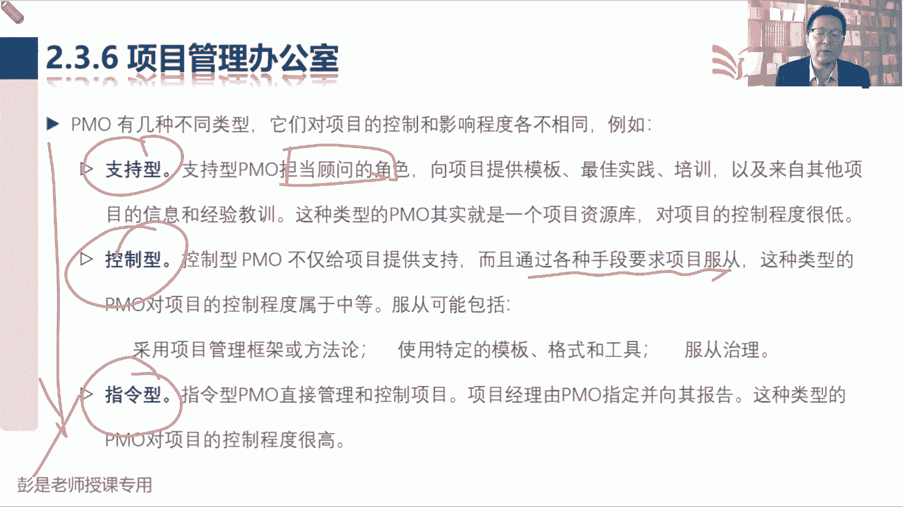

好后面这段文字呢，后面那段文字想看就看，不想看，可以不看，什么项目管理，办公室可能会承担组织那个什么职责，发挥重要作用，获取信息综合分析，然后什么什么建立体系可以不看了啊，再往下翻说。

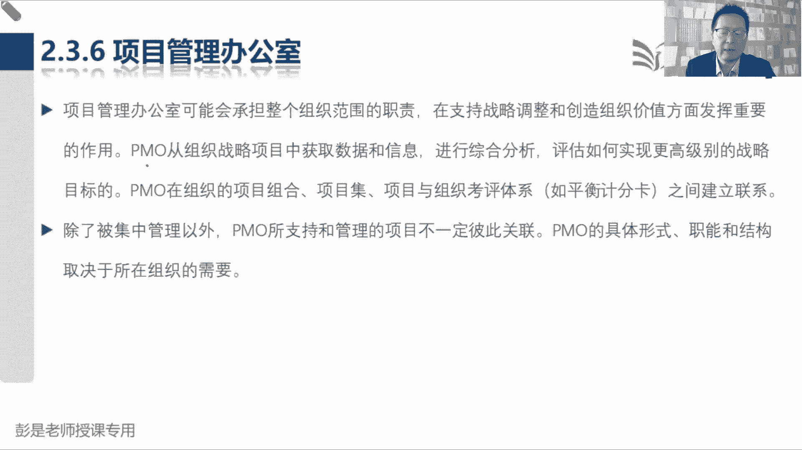

为了促进我们可能提出建议，都看看就可以了，不念了啊，接下来重要的东西又来了，pm的主要职责是通过各种方式，向项目经理提供支持，这些方式包括这段文字，还是值得大家后面复习的时候多看几遍的。

总结归纳就可以了，识别和制定项目管理的方法，最佳实践和标准，然后呢给各个项目经理提供指导辅导监督，然后呢制定项目相关的什么政策程序模板，然后通过审计检查大家对这些东西的遵守程度。

这些都是关注的是项目管理的方法，项目管理的方法啊，项目管理办公室是在项目组合项目地之上吗，不一定啊，对不对，公司可不可以有项目及管理办公室呢，可不可以有项目组合管理办公室呢，想清楚这个逻辑对对。

这边是项目，那我们就配一个项目管理员工时，给我们提供指导，这是项目集，可以配一个项目集管理办公室，给项目经理提供指导，这是项目组合，我们可以配一个项目组合管理办公室，以此类推了啊。

总之不管是项目项目集还是项目组合，配上这样的把管理办公室的目的是什么呢，让大家干活干得更规律，更规范，对不对，以此类推，好话那话说回来啊，现在这段文字呢，这一大堆东西都是关注的是方法。

第二第二人家的工作职责呀，除了方法之外呢，就是最后两句话，对pm所辖的全部项目的共享资源进行管理，对跨项目沟通进行协调，换句话说总结归纳一下，就是如果PO啊下面带着ABCD4个项目。

那这四个项目之间我们可以去组织协调，像四个项目之间，就涉及到一些什么共享的资源的，对项目之间的什么沟通，对项目之项目之间的什么问题，项目之间的什么风险，总之啊想办法想办法管这些具体的事情，对什么组织啊。

协调啊，所以就叫项目之间，项目之间记住这个结论好，这段文字大概知道意思就够了，也不需要12345去背二，但是刚才三种类型是一定要记住的，这个单词超重要，审计说通过项目审计监督对项目管理标准。

政策程序和模板的遵守程度，什么叫审计啊，看起来像，虽然可能工作上存在着一些交，存在一些成果，但一作用不一样，PO的主要工作是方法论，好小点，同学说到点了，审计审计遵守程度，主要就是一定要记住这个东西啊。

合规合规性合规性合法性，就这玩意儿，对吧是不是符合规定啊，这叫合规性吧，公司规定采购的时候要货比三家，听一听随便想场景了啊，公司规定采购的时候呀要货比三家，那我们看一看张三上次买电脑，是不是货比三家了。

这是检查他的合规性吧，张三和李四关系好，直接就从李四他们公司买了电脑，你没有货比三家，没有公开招投标不合规，这就叫审计所，审计的主要作用，就是看看我们实际干活的一个过程，实际干活的一个过程。

它是不是符合我们相关的标准政策程序模板，以此类推了。

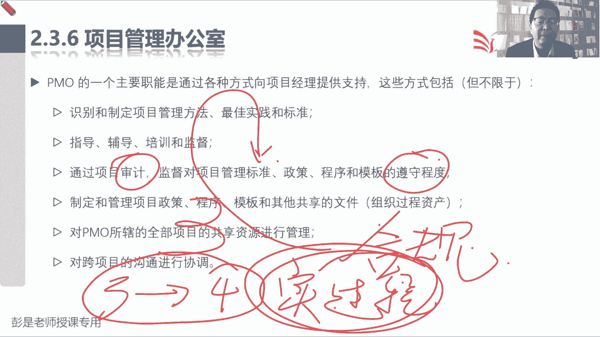

唉对吧，公司家庭或家规定吃饭之前要洗手，那问问我家小孩刚才吃饭的时候，吃饭之前你洗手了没有啊，他说没洗诶，就发现了缺陷差距和不足，这就叫审计，所以审计就是看看我们实习的过程，是不是满足这些条条框框。

合规性，好知道这个意思啊，这是tm ocean，项目经理PO对项目经理进行审计检查，项目经理在管理项目的过程中，是不是满足人家的各种各样的规定，那未来我们还有项目的采购审计，风险审计质量审计。

这是项目经理在管在管项目的过程中，检查我们这些东西的合规性，知道这个意思好，这个单词先听一听，后面还会反复讲，最最标准的话术，就是接下来这套话术了，审计审计是审计咱的实际过程是不是合规。

然后呢发现什么地方，看看啊，哪些环节做的不好，张三采购的时候没有货比三家，发现了不合规的地方，就叫缺陷，差距和不足，再看看张三什么地方做得比较好，发现这些不好的和好的地方，最重要的作用是什么呢，经验。

总结经验教训，这作为组织作为作为企业最重要的组织，构成资产资产吧，总结经验教训的目的是什么呢，有了经验呐，吃一堑长一智啊，改进，这是PDCA的那个A，更好的改进我们的这些过程，从而得到更好的结果对吧。

让张三下次采购的时候能够做到货比三家，这样呢咱避免避免啊吃吃亏，避免上当这些东西，好知道这个知道这个知识点再往下了啊。

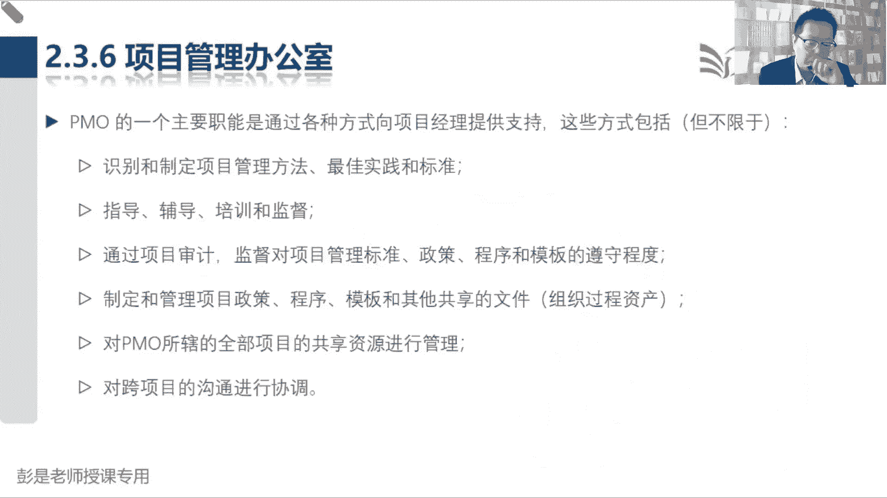

后面就可以开始顺风顺水了，PDC是啥，PPC是啥，PPC是一个方法论，告诉我们要干任何事情，P是什么呢，plan要有计划，D呢就是按照计划去执行，那执行的好与不好，不得检查一下吗，所有了c check。

最后发现差距缺陷不足，A指的就是采取行动进行改进，大家这个超简单的知识点，随便带场景，随便带场景啊，我打算打算在淘宝上买东西，这不是计划吗，今天今天下订单，然后呢周二就能收到了，这是做做了计划。

有了计划之后呢，我就打开淘宝，然后搜索我要购买的商品下订单，这不就是执行吗，对不对，然后检查呢就是该下订单的时候有没有下订单，该交钱的时候有没有交钱，看看这个物流到哪了。

货到了以后打开包装看看是不是你要的东西，这都叫检查呀，所以就是C对不对，最后呢发现啊买的东西和我的预期不一样，哎呀当时买东西的时候忘了看差评了，那就吃一堑长一智，改进下次买东西的时候啊。

看看人家的评价这个道理吧，从而不断的改进我们这些过程，为了得到得到更好的结果，所以从现在开始啊，PDC不要再问了啊，牢记未来我们学到的很多知识点，它的底层逻辑都是这套东西。

那接下来看看这一小段一小段的学习成果。

这道题，好准备了啊，554321说一下某组织内的办公室政治，曾对之前的项目造成了负面影响，为了防止办公室正式影响当前项目，项目经理开始的时候应该怎么做呢，什么叫办公室政治这个词，政治政治你能想到啥。

不是咱上学的时候学的那个政治啊，权力斗争就这些东西啊，好所以其实就是权利，对不对，想想什么甄嬛传，你看过的那些电影啊，对大家什么勾心斗角，希望拥有更高的权利，希望变成皇后能量，嘿，职位越高，权力越大。

争的不就是这个东西吗，好所以办公室政治就是权力斗争，那权力斗争才能坐的住吗，就像刚才有同学说的非常好啊，BCD啊，不能把自己干了吧，D选项，让干系人为项目选择合适的项目经理，咱就不干这个活了。

找一个第三方的项目经理，这不可能吧，老板给我安排一个活，我跟老板说呀，咱外包吧，我不干，这这也不合适啊，推荐一个有实际能力的新向项目经理处理，办公室政治，项目经理能不能管这个权呢，管不了啊。

所以一定要记住刚才说的一个结论啊，权利权利这谁说了算的，高层，有权利的人才能够完成权力的分配，就这个逻辑吧，有权利的人才能够完成权力的分配，所以你企业的什么法人呐，董事会啊，董事长啊。

这些领导才能够完成权力的分配，所以呢这事咱做不了主，这是A寻求管理层的支持，寻求管理层的帮助。

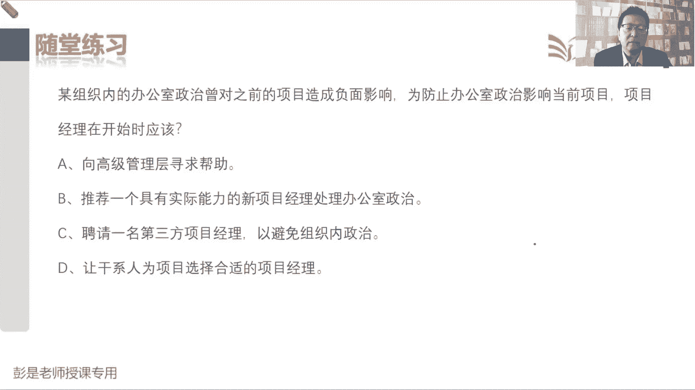

好再往下了啊，说一个建筑的项目经理发现，好54321虽然都答对了，大家接下来听一听，听一听，分析这道题的思路是不是和老师一样啊，说呀公司政策要求，在他的团队继续完成这个项目之前。

必须先填写一个什么城市环境变化的表格，到底什么是城市环境变化的表格，做环评测评啊，不需要我们掌握这个专业知识，但是从逻辑上来说，我们要能够看清楚啊，公司政策规定，公司政策规定必须干一个什么事。

对我们的工作形成了一个限制，公司政策这玩意儿叫组织过程，资产一个组织过程，资产如果对工作形成了限制和约束，那这种情况下它就属于事业环境因素了吧，嗯这就是这道题的答案，所以呢大家答对了啊，是C是C。

那如果这道题，如果这道题给大家纠结一下的话，我再加一个E选项，组织过程资产，你选啥呢，高伟同学这么配合呀，中招了，公司政策属于组织过程，资产这个政策又有一个强制性的要求，这种情况下又构成了事业环境因素。

那咋选呢，C都可以啊，咬牙选，现在它哪一个属性，哪一个特点更鲜明，更强更更强烈呢，优先级更高呢，你现在更更看重他哪一个特点呢，就这个吧，他对工作形成了限制，那现在我更关注他事业环境因素这个特点。

所以仍然是选C好，如果多选题就不纠结了吧，多选题这道题选什么呢，C和E因为他公司政策属于组织过程，资产这个政策，这个政策又对项目形成了约束，它又具有事业环境因素的特点，多选都简单了，C都选好。

这属于外部因素还是内部因素呢，这是你企业的企业的，所以属于内部环境因素，外部是公司之外的东西吧，法律国家的法律法规，国家的相关标准诶，这叫外部环境因素啊，好知道这个知道听一听。

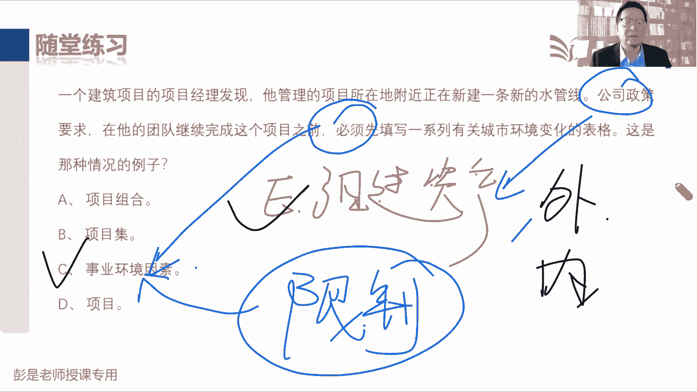

这道题非常非常经典的解题思路的讲解，考试的时候就让他这样去分析他，哪一个选项更靠谱，哪一个选项更确定，如果现在这道题就是ABCD4个选项，那C肯定是对的，如果再加一个E选项呢，虽然C和E都对。

但是呢我们更看重C这个特点，如果是多选呢，那就C和E都选，就这个逻辑永远是找一个相对来说最靠谱，最合适的选项，仅此而已，好再往下走了啊，这道题。

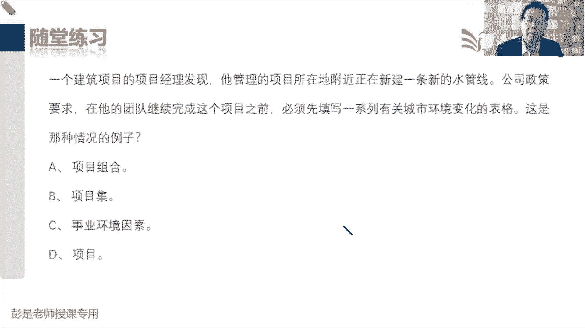

想一想刚才听过的五个五个组织结构类型，职能型，若平，权力从小到大，资源从小到多，然后两个小于号，一个等号，一个大于号，一个直接管，就记住这个结论就可以判断了吧，好题目再说。

你是一个弱矩阵组织结构中的项目经理，以下哪一个说法不成立，A选项说你的成员向职能经理报告对吧，这是对的吧，因为职能经理管理预算，人家是项目的项目的负责人，咱就是给人家打工的，对不对，咱是人家在夏季唉。

所以谁管钱谁就说了算了，A是对的，B选项，你并不直接负责资源，谁管钱谁就有权，谁有权谁就负责资源，B是对的，C职能经理做出的决策可能会影响你的项目，人家说了算呢，对不对，他让干啥咱就干啥呀。

所以C是对的，D你要对项目的成败负责，为什么选这个呢，这个说法不成立，为什么不成立啊，全责全责，就这个一定要记理论知识啊，原则上来说权责应该是对等的，这个一定要脱离实际工作。

大家实际工作中通常权责对等吗，通常大家实际在工作中，权利啊基本上没有，但责任呢叫权力薄如纸，责任重如山，对不对，这个问题出了问题，唯你是问你背锅，你扛雷，但是你又什么事都做不了，主就背锅侠吧。

诶所以这段这段知识点一定要脱离实际情况啊，实际工作中权责不对等，考试来说，我们默认全责要对等，这是非常好的一个原则，所以既然在职能型弱矩阵组织结构之中，职能经理说了算，那咱就不背这个锅，不背这个锅。

诶所以答案是D。

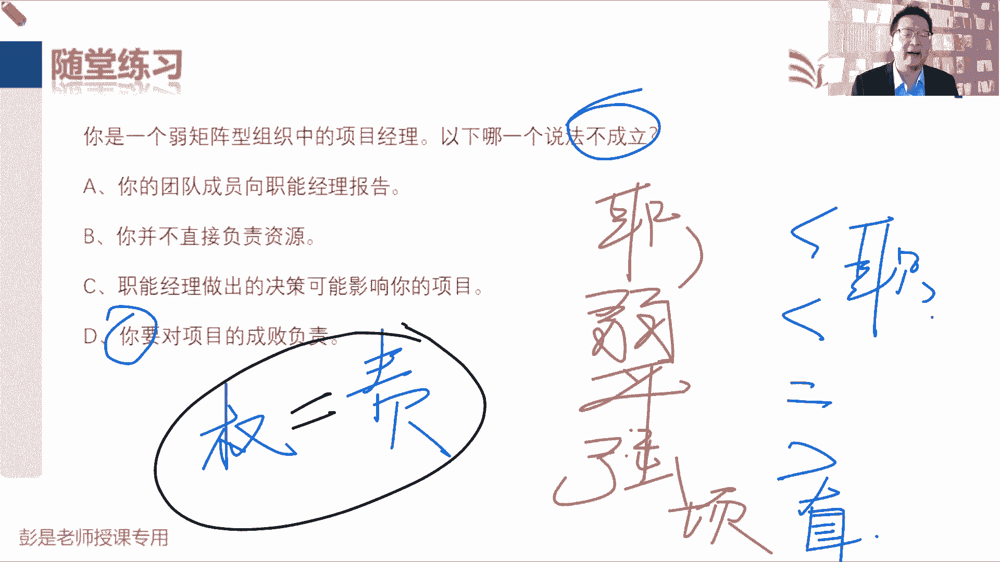

好好记住这个记住这个结论。

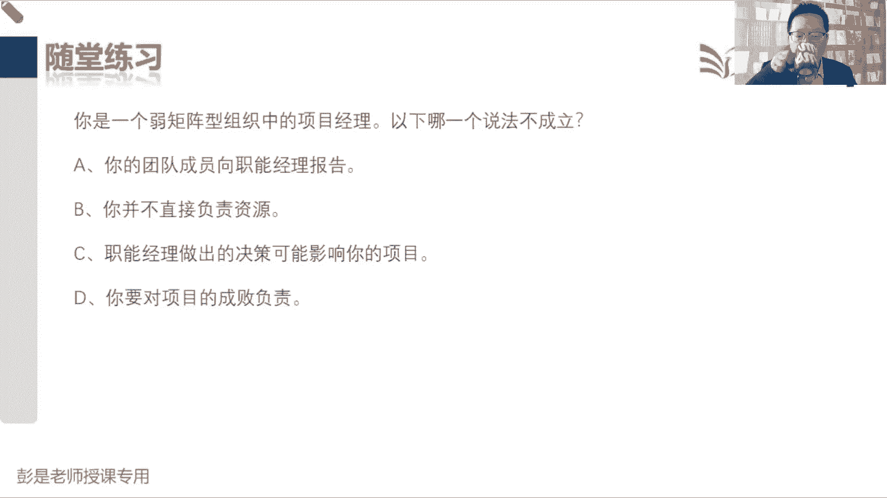

再往下拉看看这道题带场景就好记，这就是场景题啊，不粘锅什么意思，就甩锅甩锅甩锅就是推卸责任，对不对，什么万花丛中过片叶不沾身甩锅，这意思啊，这脱离工作时间啊，好回到这道题，这道题简单吧，比较容易判断了。

在项目实施的过程中，在你不知情的情况下，两个成员被职能经理，调到另外一个新项目上去了，给咱的项目实施带来了很大的麻烦，所在的组织结构类型是什么呢，这是通过阅读题目就可以判断得出结论了。

人家只能经理把人调走了，都没告诉咱说明什么呢，说明人轻言微，人轻言微，说明权力小，那就找吧，哎不配，知道哈哈知道这个意思啊，所以就是大家答对了，弱矩阵组织结构类型，因为在弱矩阵组织结构类型之中。

我们在项目上的权利小于职能经理嗯，卑微就这意思啊，好就像这种题啊，紧密矩阵是什么啊，咱先紧密矩阵，紧密矩阵不是组织结构类型，后面学到资源管理，它是集中办公，后面再说了，然后再往下，如果我加一个E选项。

加一个E选项啊，职能型组织结构你怎么选呢，为什么不是项目型啊，项目形式，项目经理直接管着职能经理啊，他敢把人调走，不通知你不弄死他，对不对，项目行项目经理是皇帝是老大呀，好这道题如果加一个E选项。

选什么呢，选E为啥呢，为啥呢，考试的中心思想就是好的里边找最好不好的，里面找最不好的，永远找一个相对来说最确定的选项，在职能型组织结构之中，项目经理基本上没啥全是最惨的了，那最确定了吧。

所以呢这种情况下就选E了，诶没错啊，只能形比弱矩阵权力还小啊，所以叫永远找一个相对来说最合适的选项。

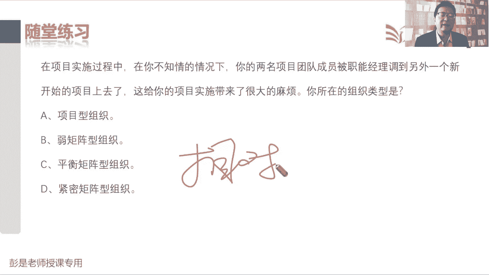

仅此而已，搞定好再往下，在下列哪一种组织结构之中，项目经理在收尾阶段感到忧心忡忡，这个刚才没讲，稍稍有一丢丢印象就够了，那选C呀，为什么呢，哎小丸子同学说到点上了，项目型组织结构的特点。

有一个特点是什么呢，项目结束了，大家就地解散散伙，因为咱把职能部门挂到项目上去了，对不对，所以项目一结束就散伙了，除非去一个新的项目，稍稍有一点点印象就可以了，在项目型组织结构之中。

我们我们干完了A项目，大家就地解散，无家可归，无家可归啊，没有办法回到职能部门了，因为职能部门挂到项目里面去了，对不对，除非再接手第二个项目，这就是它的特点，那其他组织结构呢就是回到各自的工作岗位。

各回各家，各找各妈，项目情是无家可归，稍稍有一丢丢印象啊，就因为无家可归，没有地方去，对不对，不一定有新项目啊，所以才慌了，所以才慌的吧，大家带场景帮助大家更好的理解，比如说你家里装修，你抓点装装修。

请几个施工的师傅来帮你刷墙，刷完墙之后，他感到很担心的，为什么呢，不一定有下一个项目对，就地散伙了吧，这些工人就回到真正真正回到自己的家里去了，对不对，没地方去啊，除非再接受一个新项目。

所以他会感到忧心忡忡，好矩阵形式是什么呢，矩阵型包括三种，弱矩阵，只能弱矩阵，强矩阵，平衡矩阵，但是不管是智能型还是矩阵型，大家是可以回到职能部门的啊，好再看这道题呢，好大部分同学有人选A啊。

有人选D啊，看清题目啊，项目管理办公室，PMO对项目结果负有直接或间接的责任，以下哪一项不是PMO的职责呢，A选项给项目提供行政支持服务，支持型控制型指令行，给项目经理提供行政支持，这是人家的职责呀。

项目管理办公室也是职能部门的职能部门，给项目提供行政支持，可以吧，A是对的，所以呢他不是答案B选项，指导培训指导和辅导，项目经理教我们管项目，教我们怎么管项目，这是他的职责，C项目之间的人员协调。

刚才也说过呀，A项目B项目，C项目在众多项目之间去进行协调，哎这是人家可以做的事情，那D制定项目干系人之间的沟通计划，这是项目经理要干的活了吧，放到项目经理经理的权利范围之内了，哎所以答案是D。

这不是项目管理办公室的职责，所以要记住啊，项目边界，项目边界一直在讲这个东西，需求评估，商业论证，效益计划的制定，这事越界了，咱没权利，我们只是提出本合理化的建议和见解，然后项目经理走马上任。

带着兄弟们完成任务，实现目标，对不对，包括制定项目的沟通计划，这是咱要做的事情，项目结束以后的运营，这事儿啊，咱也做不了主，对不对，项目结束以后的运营，我们也是参与。

可能参与其中来验证有没有实现这个长期效益，但是呢运营咱说了不算，我们是参参加，仅此而已，最后呢就是咱这个项目啊和其他项目，咱这个项目和其他项目，这咱也越界了吧，张三负责项目，不能管到李四的项目。

所以超过边界的事情可以找PO，可以找发起人，总之可以找有权力的人，去帮助我们进行这种协调，咱咱不能伸手伸到界外，所以就这个逻辑啊，那接下来给各个项目给我们项目提供行政支持，包括什么财务的PO的。

采购的诶，每个职能部门给我们提供行政支持，这是人家要做的事，一定要清楚这个边界好。

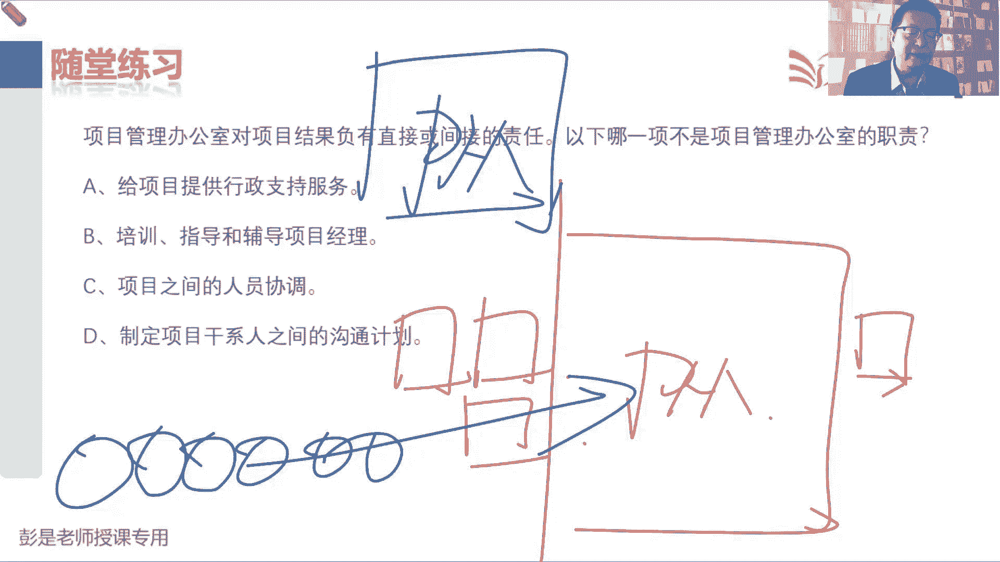

再往下就超简单了，说公司成立了一个项目管理办公室，判断它是什么类型，这种知识点刷刷题就可以记住了，最怂的权力，最小的叫支持性，咱不听中间的那个叫控制性，咱需要听他的，最大的叫指令性，直接管理的。

所以题目在说直接管理着许多项目，拥有全职的项目经理，然后同时可以包括控制项目的预算，巴拉巴。

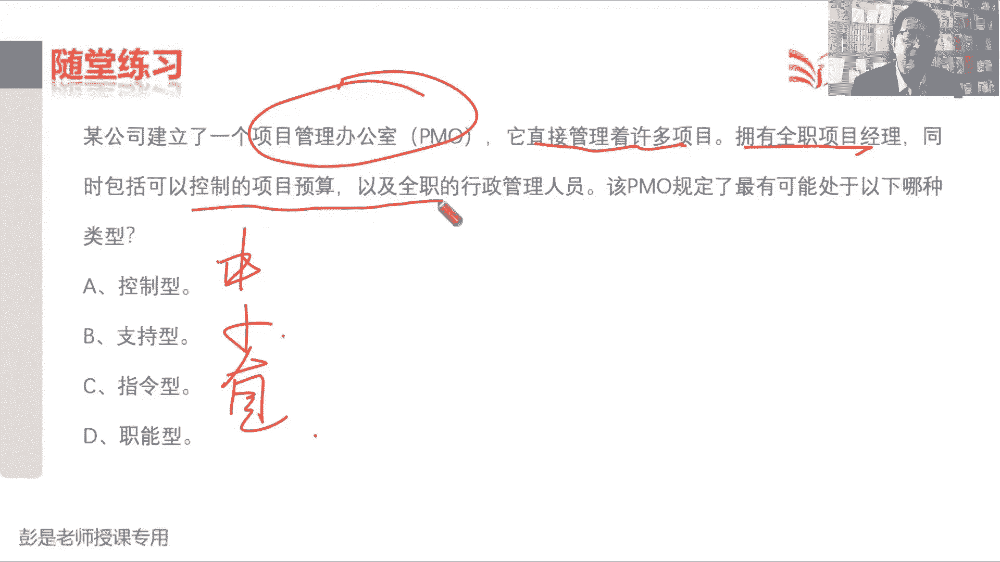

它就叫指定型，恭喜大家答对了，再判判判判断一下这道题，这道题超简单的，好恭喜大家答对了啊，控制型可以通过手段要求项目服从规定，这是对的，P指令行直接管理和控制项目，这是对的，对项目控制程度从高到低。

从大到小排序就是大中小，对不对，指令型控制型支持型这句话是对的，题目上找一个错误的。

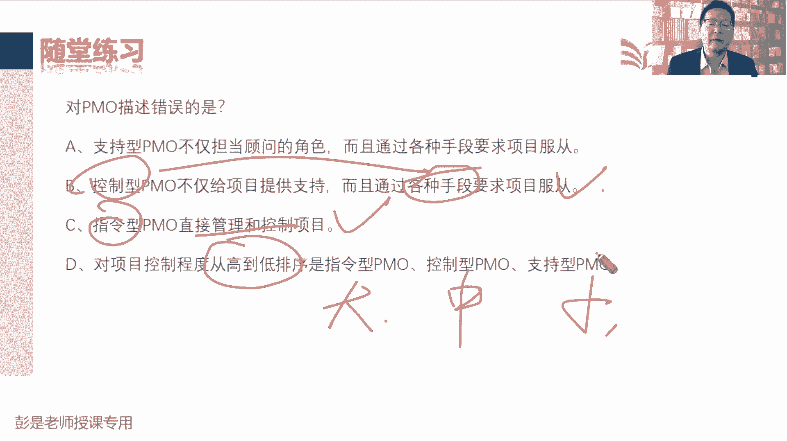

所以答案A答案是A，好复杂一丢丢啊，大家这个状态不错不错啊，题简单哈，好说，我们加入组织，了解这个组织的文化，说为了更好地了解他们，以下哪一项，可以为丹尼尔提供一些，关于干系人参与先前项目的历史信息。

谜底就在谜面上，既然说到历史信息，那就想到组织过程，资产两种，一种叫企业相关的过程，政策程序这些东西啊，第二块呢就是各种各样的历史信息，历史信息最大的价值是什么呢，前人栽树，后人乘凉，以史为鉴。

避免犯同样的错误，嗯所以答案是D。

好这道题刚才讲过了，应该可以对了，诶巧云同学慢慢的慢慢的就掌握到解题的技巧，对不对，通过阅读题目，阅读这些话术去了解他在说什么意思，如果能找到我们印象深的，印象深的这些知识点的关键词。

就可以很快的给出答案了，所以要记住啊，前面每个每个知识点都给大家画了关键词啊，一定要记住的东西，便于我们更精准地去判断好，回到这道题，说项目完成的时候，大家散伙了，没地方去呀，无家可归啊。

除非去另外一个项目，这就是标准的项目型组织结构类型无家可归，对不对，其他其他结构就是回到各自的职能部门，回到各自的工作岗位上去了。

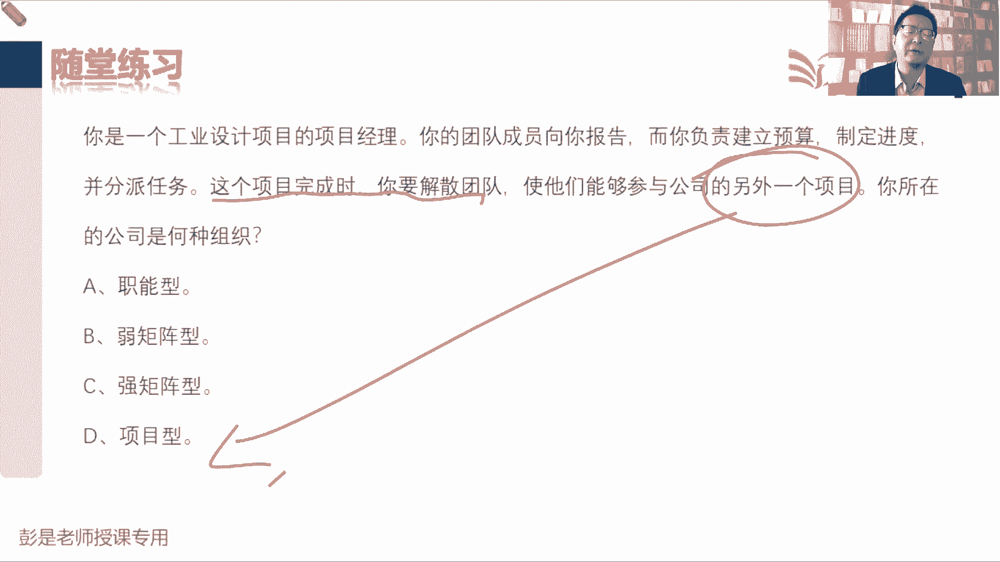

这就是第二章项目运行环境。

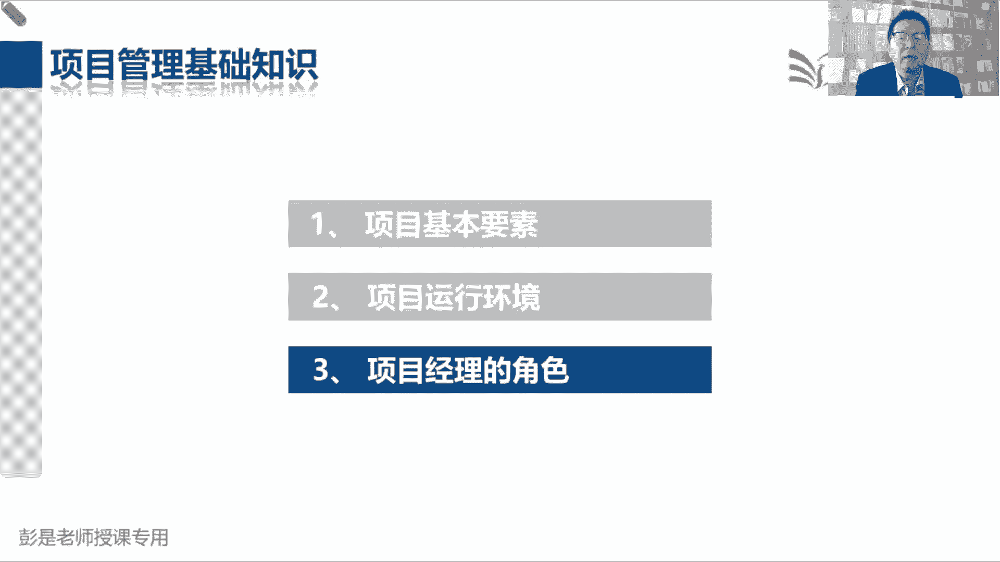