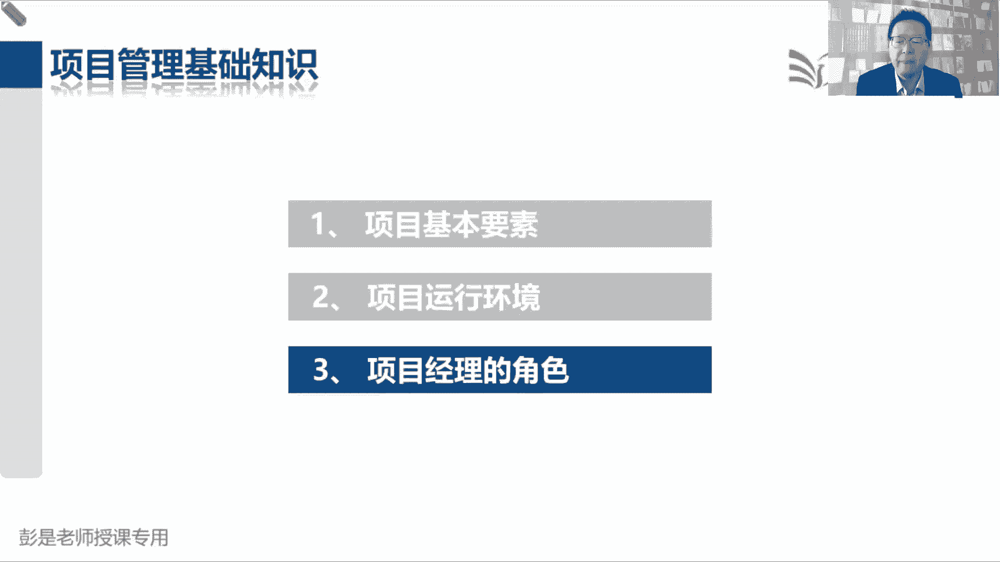
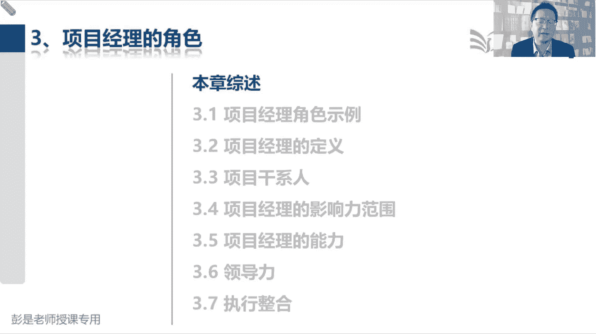
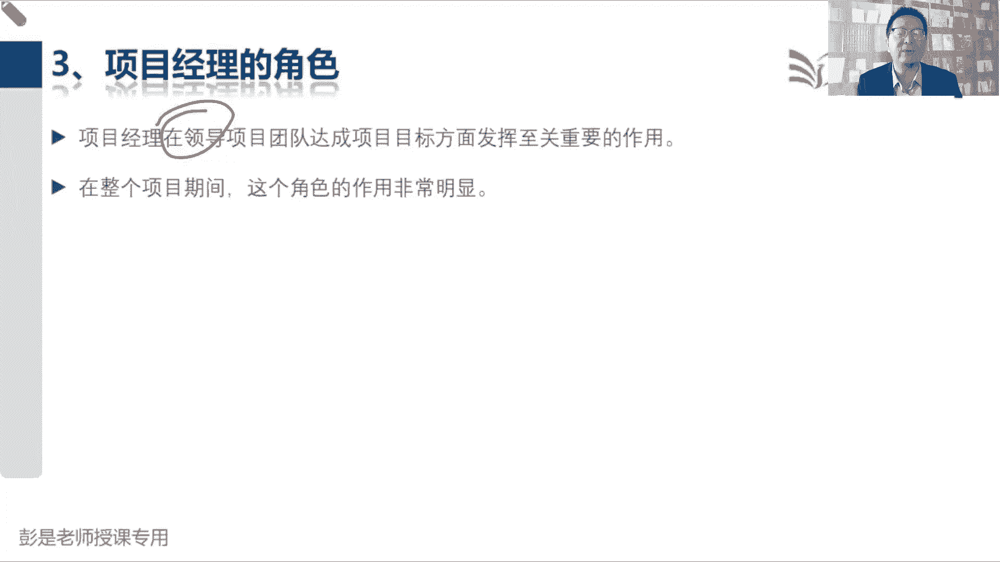
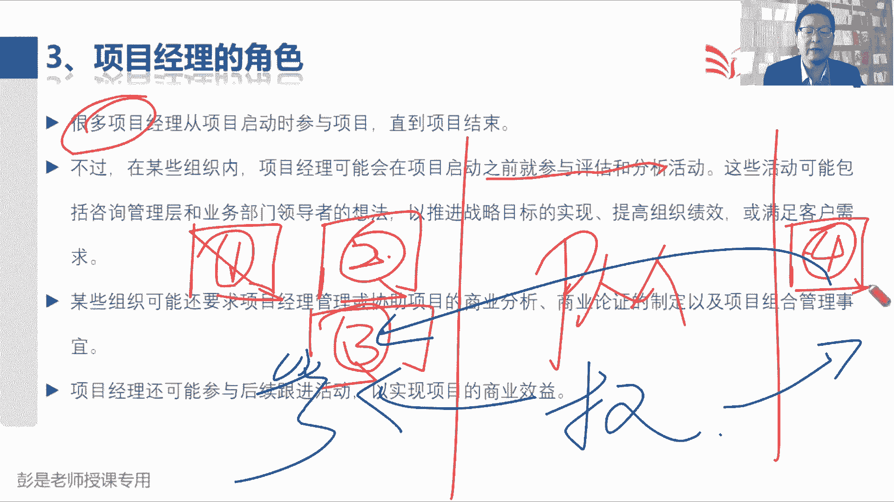
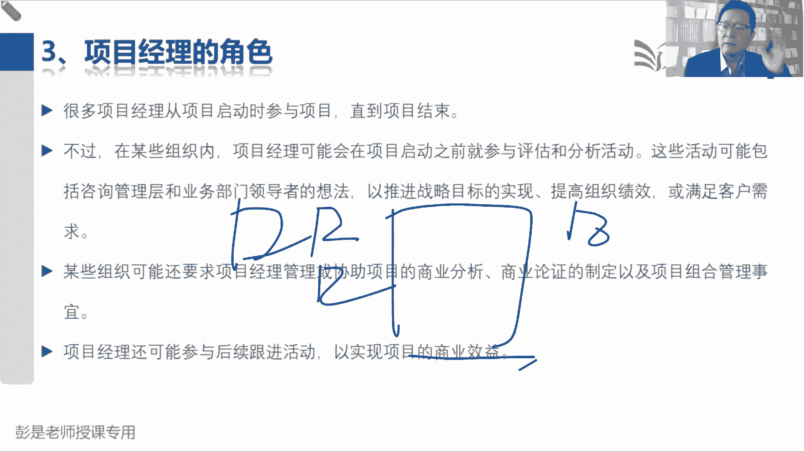
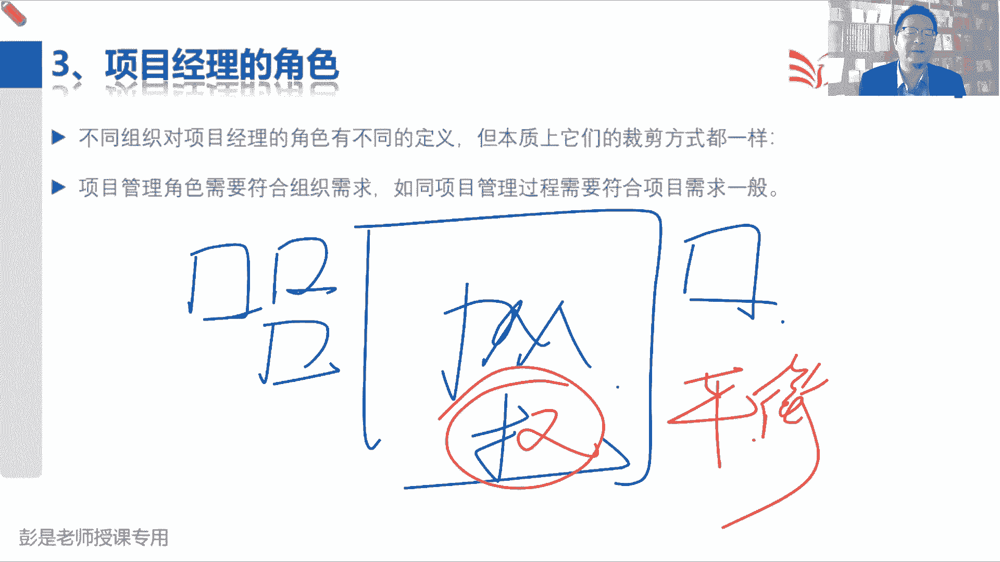
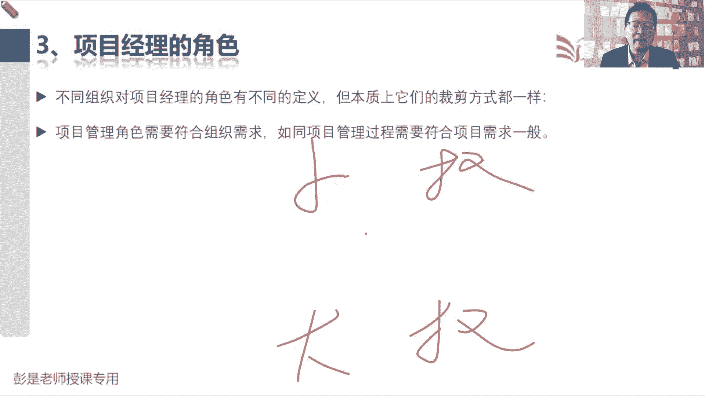
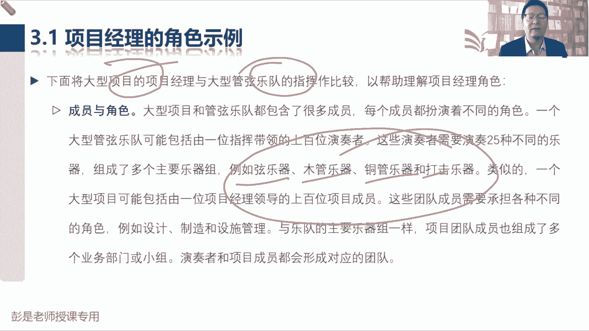

# 2024年最新版PMP考试第七版零基础一次通过项目管理认证 - P11：1.3.1 项目经理角色示例 - 慧翔天地 - BV1qC411E7Mw

接下来今天上午下课，还有，还有几分钟时间，大家就当听小故事一样听一听，因为第三章啊其实看起来字多对吧，说这么多小节啊，3。1到3。7，看起来字多，但实际上呢要求大家掌握的知识点没有这么多。

大部分的东西啊，都是字面意思，并且通常不大会搞一会儿，你看看文字，看看文字就知道怎么回事了，所以复习这段内容的时候啊，就是根据课上讲的重点去多看几遍，没讲到的内容呢。

看一遍，知道意思就够了，说呀项目经理的角色，项目经理在领导项目团队达成目标方面，发挥至关重要的作用，在整个项目期间，这个决策作用非常明显，对吧，很很好理解啊，组织大家协调工作。

全妈妈让大家按照计划完成工作，得到我们期望的成果，确保都快好省，确保大家都开心，大家都满意，就需要这样一个卓越的出色的优秀的管理者。

那接下来说很多项目经理从启动时参与项目，一直到项目结束，看看啊，然后说在组织内可能会参与，启动之前参与什么玩意儿，可能会要求项目经理什么管理或协助商业分析，可能还参与后续跟进活动，来实现项目的商业效益。

这段抽象的概念看完了之后能反应过来是啥吗，这是反复给大家画的那个权力的边界，我们可能会参与评估和分析活动，项目启动之前第一件事就需求评估，找项目，找到项目之后啊，我们还可能会参与商业分析。

商业论证的制定，嘿我们可能还会参与到可行性分析，包括效益计划的制定，这些事情是第二，另外呢很多项目经理从项目启动到项目结束，中间，项目经理全权负责带着兄弟们完成任务，实现目标，得到期望的结果。

另外呢最后一句话说，我们还还可以参与后续的跟进活动，来实现项目的商业效益，那有些项目结束的时候啊，可能没赚钱的，可能需要持续的经营运作一段时间，需要运营一段时间才能够实现目标交易。

所以呢我们还可能会参与项目结束后的运营，去验证有没有实现目标效益，所以记住考试一定要清楚这个权利的边界，中间中间是咱全权负责，项目启动之前，我们不做主，我们只是参与其中，提出我们合理化的建议和见解。

项目结束以后的运营，我们也是参与其中去验证有没有实现目标效益，运营有运营的管理者，咱呢就是参与，还有这个权利的边界好，所以这段文字大家后面复习的时候，要能把这个术语啊给他带出来。

就想给大家反复画的这几个小方块啊。

好那再往下说，不同组织对项目的决策不行，我得给给你们再再玩玩烧脑的小游戏，说需求评估，商业论证，效益计划的制定，这事跟他没关系，中间项目经理全权负责，带着兄弟们完成任务，实现目标，项目结束以后的运营。

我们参与其中，参与其中，去验证有没有实现目标效益，这不对啊，中间过程项目经理全权负责，只能形若过矩阵怎么解，只能行弱矩阵，项目经理说了也不算的，咋整啊，你这讲的不对了，乱了乱了，想一想是这个意思吧。

只能行走矩阵组织结构之中，只能经理说了算，人家在项目上的权力比我们大呀，咱也管不了这个事儿啊，你这个教材写的混乱七八糟的，所以需要大家再稍稍有一点点印象啊，潜规则潜规则。

咱整本教材默认是一个什么样的组织结构类型，包括未来看到的试题啊，默认是一个什么样的组织结构类型呢，就思考从什么组织结构开始，项目经理有权了，从什么组织结构类型开始，项目经理手里有权了，平衡矩阵。

哎这就是考试看书听课潜规则之一，不是项目型，不是项目型啊，默认默认所有的题，默认我们都是平衡矩阵，我们是一个专职的项目经理，手里边能有能有权利，能有权利管项目，对不对，好记住这个小稍稍有点印象啊。

所以题目没有明确的描述，你是一个什么组织结构类型，感觉默认我们有权就行了。

不认为我们是职能型和弱矩阵，好那再往下说，不同组织对项目经理的角色有不同的定义，但本质上裁剪方式都一样，我们要根据企业的情况去分析，小的事情可能不需要项目经理有很大的权利。

大的事情反而需要给项目经理提高权力，组织治理，对项目治理权力的分配，权力的游戏。

那接下来3。1项目经理的决策事例，这段文字呢咱们课上也不念了，大家课后啊，基本上你复习的时候啊，想看就看，不想看可以不看了，因为这个例子太好理解了，就告诉你啊，项目经理和什么乐队的指挥。

他俩看起来好像啊，对吧，乐队的指挥就这些什么弹吹拉弹唱的人呐，都归你管的，你要在你的带领下，用你的指挥棒让大家演奏出美妙的乐章，项目经理就干这个事情，什么叫整合呢对吧，让这些这些声，这些声音，什么弦乐。

木管乐呀，让大家整合到一起，每演奏出美妙的乐章一个道理，所以这段文字呢看一看调解就够了啊。

