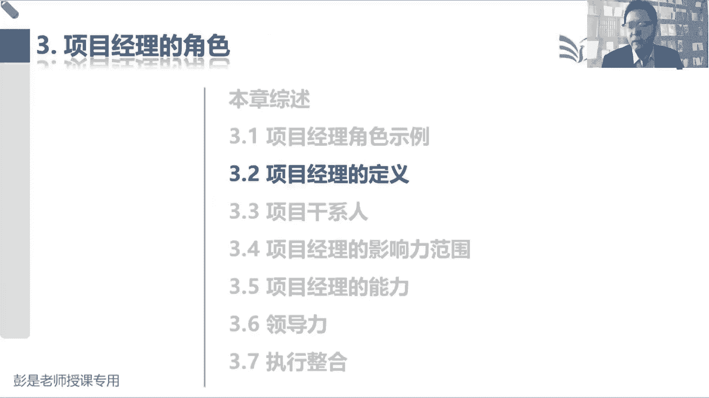
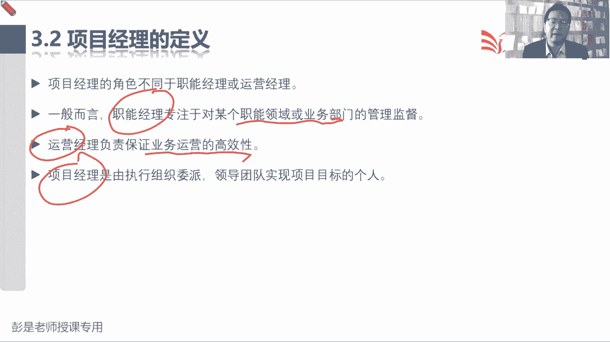

# 2024年最新版PMP考试第七版零基础一次通过项目管理认证 - P12：1.3.2 项目经理的定义 - 慧翔天地 - BV1qC411E7Mw

那3。2项目经理的定义，这段内容呢也超简单的，就三个角色，也是前面给大家剧透过的，职能经理专注于某个职能领域，或者是业务部门的管理和监督，所以你都对搬到你企业里面，财务啊，行政啊，销售啊，市场啊。

哎这就是各个职能部门的管理者对吧，什么采购法务没有工作经验不那么丰富的同学，你就对班到你学校，你学校有人管研究生吧，有各个学院吧，有各个学院哈，还有人管，时常有人管行政，对不对，以此类推，有人管招生。

有人管安保，这都叫职能经理啊，运营经理负责保证业务运营的高效性，确保我们各个职能部门有效的配合，能够让我们这个流程有效的运转，唉知道这个角色项目经理就是完成任务，实现项目的目标。

