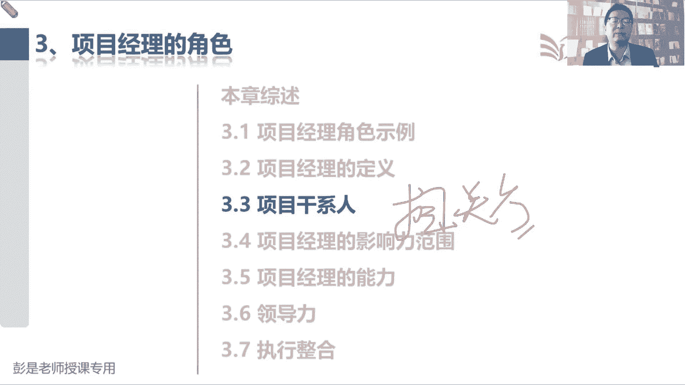
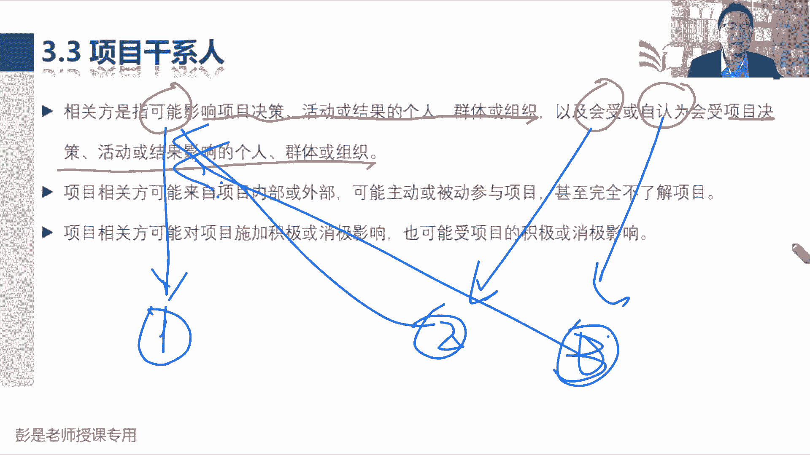
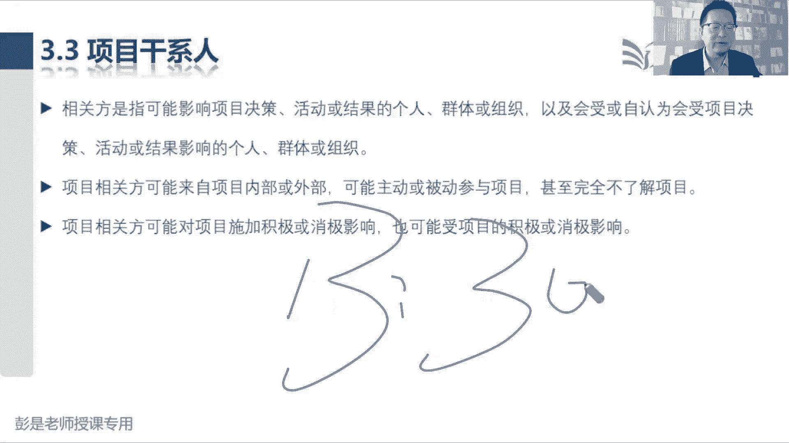
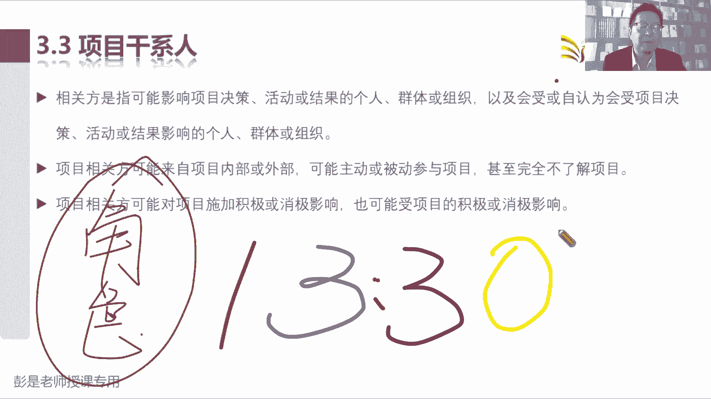
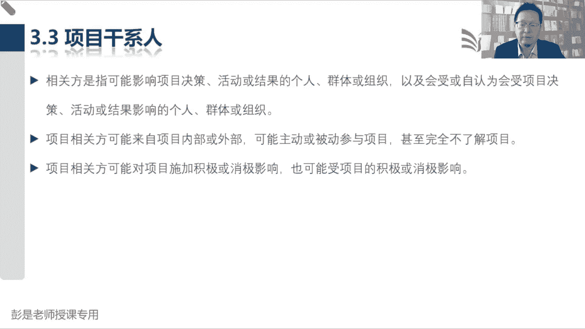
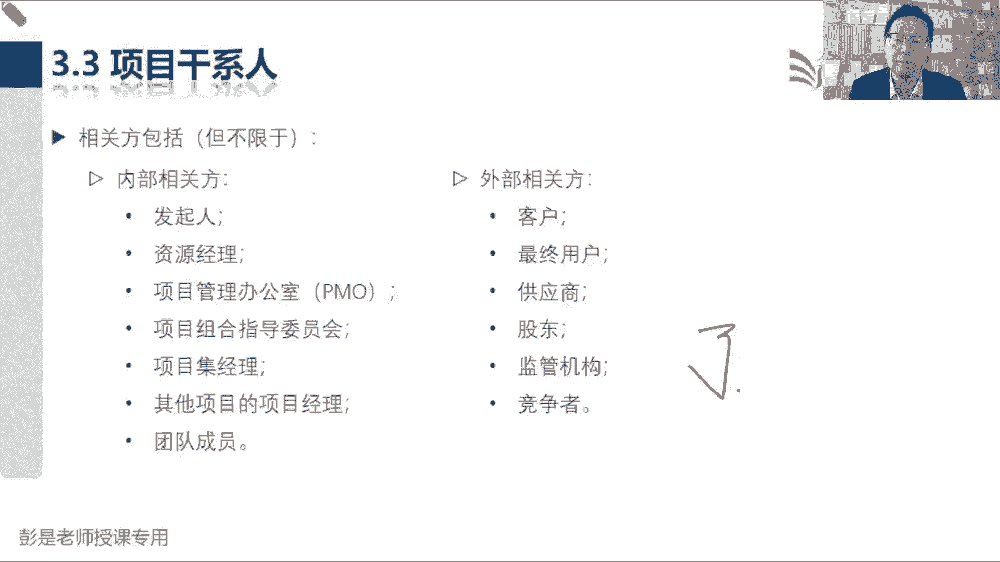
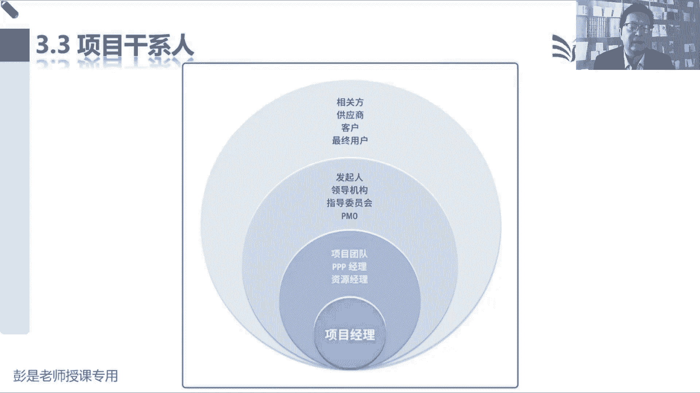

# 2024年最新版PMP考试第七版零基础一次通过项目管理认证 - P13：1.3.3 项目干系人 - 慧翔天地 - BV1qC411E7Mw

3。3，刚才有同学问啊，什么是干系人，什么是相关方，这两个单词意思是一样的，就是因为历史版本不同，用词不一样。

项目干系人，项目相关方和项目有关的人呗，所以看一看它标准的概念啊，项目干系人，相关方，是指可能影响项目决策活动或结果的，个人群体和组织，以及会受项目决策活动或结果影响的个人群，抵扣组织。

或者是自认为会受项目决策活动或结果，影响的个人经历和组织，罗里吧嗦三句话挺长，他其实本质上来讲啊，这三种人是同一种人，为什么呢，能够影响到项目的人，张三今天请假了，还工作推进不进去了对吧。

财务这边不打款，财务这边不打款，客户那边不发货，影响我们的进度，以此类推啊，唉这些人，他的行为可能会对我们的项目产生影响，第二种人是什么呢，会受到项目影响的人，受到我们项目影响。

那这些人可能会有什么样的行为呢，会受到项目的影响，这些人可能会有什么样的行为呢，好分析吗，比如现在我在讲课，我在讲课，我邻居咣咣咣来敲门，你说话声太大了，小点声啊，睡觉都睡不着啊。

他受到了咱培训这个项目的影响，他就有可能采取行为，反过来对我们的项目产生影响吧，唉第二种人和第一种你发现是一样的，对不对，那第三种第三种还是这个道理，自认为受到这个项目的影响，自认为是大项目的影响啊。

我觉得你影响我了，那接下来他可能会采取什么样的行为呢，还是这个逻辑反过来，可能会采取一些行为或措施，对我们的项目产生干扰，产生影响，所以最后啊就是一种人，总之就是各种各样可能会影响项目的人。

对不对，第一种就是我们影响他了，然后他反过来，第一种就是直接影响，第二种呢就是我们影响它了，它可能反过来影响咱，第三种就是他觉得他自认为啊，他觉得我没影响到他，好知道这意思啊，所以就像前两前一阵。

前一阵热搜的那个，有个小姐姐觉得有人偷拍她诶，她自认为对吧，自以为是啊，结果他接下来采取了一系一系列的措施，就产生了影响，这例子，所以其实这段文字的意思中心思想是什么呢。

就是啊希望我们把干系人的范围想象到更什么，是想象到更广比较好，还是想象到比较窄更合适呢，越宽越好吧，尽量把这个范围啊想象的更大一点，避免什么呢，哎这是全面避免有遗漏，避免有遗漏啊，因为一旦有了遗漏。

你也不知道他会对你产生什么样的影响，尤其是到了项目后期，这个知识点靠bug回来了吧，尤其是到了项目后期，我们的成本在不断的上升，万一这个人他的行为，他的措施对我们产生影响，那代价很大呀。

所以尽量的尽量的不要有遗漏，把这个事情考虑周全，这就是相关方的定义好，所以后面那句话呢就在解释了，相关方可能来自于内部和外部，他可能主动或被动参与项目，甚至都不知道不知道这个项目啊。

它可能对我们产生正面的负面的影响，也可能受到项目正面负面的影响，就是总之考虑周全，考虑周全，千万不要想少了好，所以各位同学这个知识点讲完，咱上午的课程基本上就结束了，最后一分钟最后一分钟啊，各位同学。

你就想着一会下课的时候，你就想啊，各位同学，你们的家属是咱培训p mp这个项目的相关方吗，是吧，他受到我们这个项目的影响了，对不对对吧，各位同学周末听课，不做家务，不做饭，不洗衣服，不刷碗，不带孩子。

不扫地，听什么课呀，看起来很上进的样子，诶这些碎这些絮叨的话一说完，这对你的学习的心态产生了影响，对不对，就这意思啊，好所以我们要考虑好这些人的满意度，对不对，考虑好这些人的满意度，所以各位同学。

周末上课的同学要做好家人的安抚工作，我们学习学习是为了什么呢，提高我的能力，掌握更多的技能，让我们走向人生巅峰，让你过上更好的日子，让你更轻松更愉快，安抚安抚，上到战略，下到行为，给人家解释清楚好。

那咱上午的课程就讲到这儿啊，各位同学辛苦了辛苦了，咱下午01：30再见，赚更多的money力哈，就这个道理，下午01：30准时开始啊，各位同学中午吃好喝好。

下午见一个美好的下午开始了，好有同学们，职能经理可以是项目经理吗，再说一下这个知识点啊，咱现在项目教材里面讲到的，所有所有你听到过的东西都叫角色，我们需要这样一个角色，这个角色谁来扮演呢。

具体是哪一个人呢，各种可能性，对不对，一个人有可能是项目经理，还有可能同时是职能经理，就开个煎饼摊儿，我什么都试了，保安保洁，项目经理，职能经理，我还是PMO，我还是公司老板，还是公司法人。

同时呢又是员工，以此类推，我们在工作中需要这些角色，这个角色到底是谁呢，具体情况具体分析，组织治理这个东西啊，嗯好十秒九秒八秒7654321，那各位同学。

大家下午好，咱们继续今天今天的下午的课程了，上上午讲到了干系人说啊，干系人想象到更广泛更广泛，我们要考虑到这个项目涉及到的各种各样的人，就像大家日常工作中对吧，你什么开发软件，做游戏，盖房子，修路搭桥。

研发药品，那咱要考虑咱这个项目涉及到哪些人，我们要了解这些人，这些人他对项目的期望啊，需求啊，避免我们的工作受到各种各样的影响，可知道这意思啊，那接下来再往下再往下翻了。

所以书上给出了一些相关方肝炎的事事例，告诉我们通常可能会涉及到哪些人群呢，所以这些诗意啊也不太需要去背，都看到名字能反应过来这人干啥的就行了，发起人为我们完成项目所需要的资源和资金，提供提供支持吧。

嘿他去争取我们需要完成项目所需要的人财物，那他怎么争取呢，做事情要有依据啊，不能拍脑袋呀，所以呢他要找商业机会，然后分析可行性，做可行性研究就有商业论证和教学效益计划，资源经理纯粹的资源意思。

掌握我们我们完成工作所需要的资源，项目管理办公室唉，这些人可能给我们工作提供指导对吧，告诉我们项目管理的标准，政策流程，程序规范方法，可能是支持型，可能是控制型，可能是指令型，项目组合指导委员会。

就像这个指导委员会啊，这个单词啊，也是任何一个层级都可能有的东西啊，可以有项目指导委员会，项目及指导委员会，项目组合指导委员会，既然叫指导委员会，就是对这个人进行指导。

哎所以项目指导委员会权力比咱项目经理大，项目集经理，项目及指导委员会，他的权力比项目及经理大，以此类推，通常都是一些有权利的，重要的关键的干系人组成的，对工作进行指导的这么一个机构，这都了解就够了啊。

然后项目及经理字面意思了哈，其他项目的项目经理，然后团队成员就是咱下边干活的人了，然后客户和最终用户，客户是什么呢，客户啊和最终用户的区别就这两个字吧，购买我们产品服务成果的人，最终用户。

那就是使用我们最终产品服务成果的人，他俩不一定是一个人呐，然后接下来供应商就是咱买东西，咱找供应商买东西，竞争者唉，总是考虑到更周全，这都了解就可以，不需要去背的啊。

好书上这个示意图咱也不念了，不需要背。

