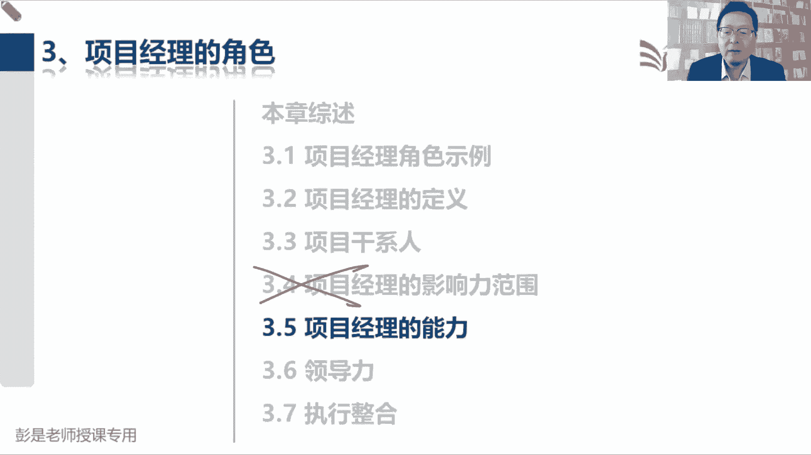
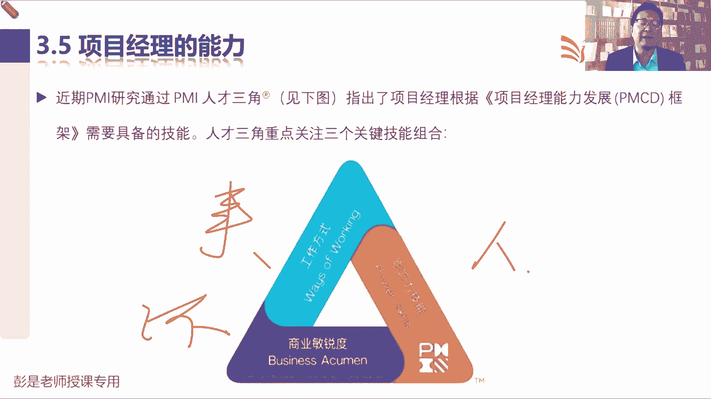
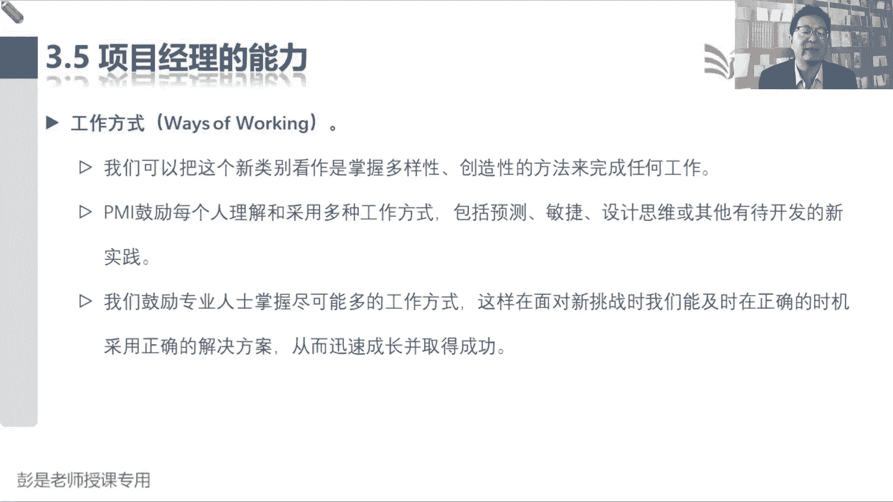
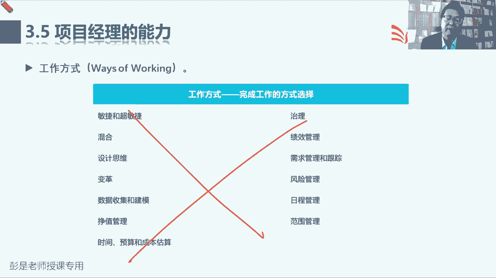
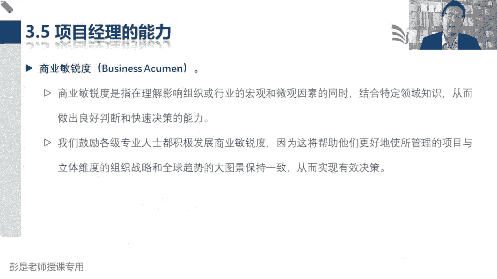
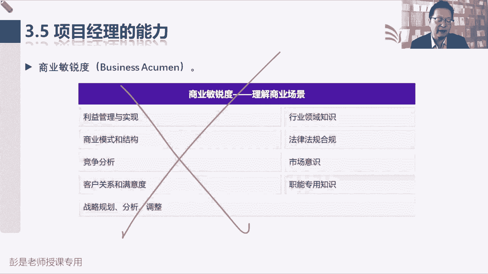
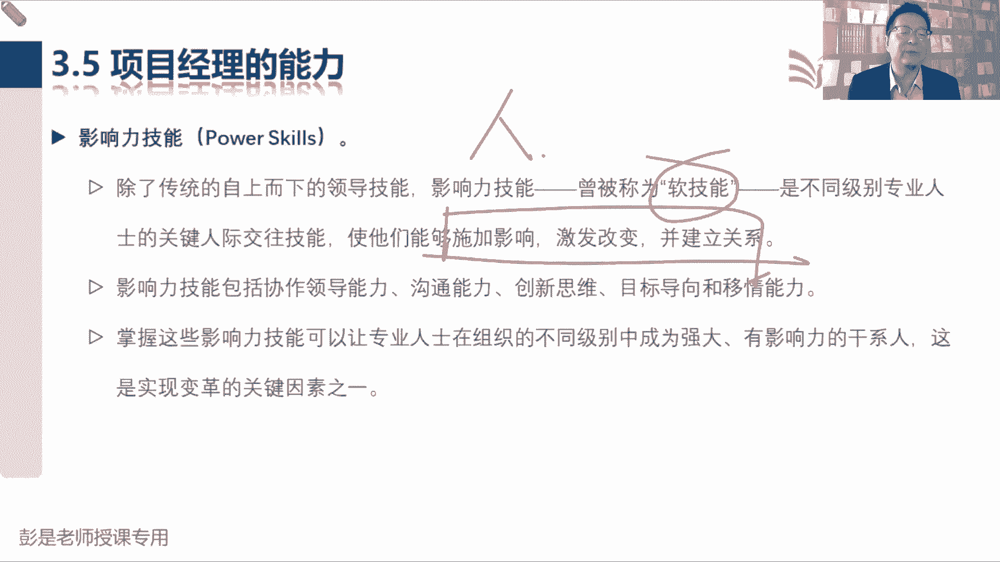
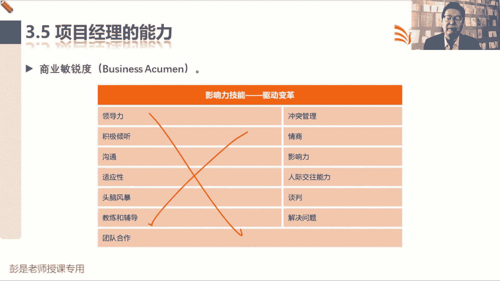

# 2024年最新版PMP考试第七版零基础一次通过项目管理认证 - P15：1.3.5 项目经理的能力 - 慧翔天地 - BV1qC411E7Mw

那3。5项目经理的能力。

这就不得不听，不得不看，不得不记了，前面见过这张图了吧，说近期PMI研究人才三角指出了项目经理，根据项目经理能力发展框架，需要具备的核心技能，三个关键技能，第一个叫工作方式，第二个是影响力技能。

第三个是商业敏锐度，这个人才三角啊，大家也是不需要背下来，考试也不会考概念，说项目经理人才人才三角包括哪三个东西，现在的考试基本上不考这样的概念题啊，但是我们要理解，能够听明白他为什么这么说。

第一个工作方式强调的是什么呢，主打一个灵活，就是一事一议，具体情况具体分析，灵活地采用工作方式，帮助我们更好地完成任务，实现目标，不要墨守成规，我们要去思考，不断的对工作方式进行优化，进行改进。

进行提升，PDCA的那个A不就关注的是这个吗，对不对，主打一个灵活，因为现在啊现在的商业环境啊，变化越来越多，变化越来越快，第一天上课就说了吧，乌卡时代，乌卡时代存在着各种各样的不确定性，各种复杂性。

然后主打一个变化多，还有很多很多没有认知的事情，所以呢我们只能只能帮助我们企业想办法，帮助我们企业如何更好地完成这个项目的任务，实现项目的目标，做到多快好省，多做到创造价值，所以呢就是灵活。

该预测的就预测，该敏捷的就敏捷，该混合的就混合，这就是这个强调的知识点啊，然后第二个就是商业敏锐度，商业敏锐度强调的是什么呢，前面那一段大概听完了，知道点意思之后，现在应该能猜出来了，对不对。

商业敏锐度说我们不能低头走路，不能闭门造车，还要看环境，要看环境是不是发生了变化，要看行，要看环境，环境目前是一个什么态势，未来会发朝着什么方向去发展，所以商业敏锐度，就是刚才我们见过这堆东西对吧。

上到政策到什么行业趋势，来到竞争对手都给他看清楚，对不对，这是一个内一个外，那这是事，我们能搞定，接下来就搞人，接下来就搞人吧，嘿那就需要卓越的影响力技能，要影响我们这些人的看法，情绪心理行为。

想方设法的让大家都是正能量满满的，可以积极的主动的，热情的对吧，愿意支持我们的工作，然后贡献出这些人的价值，发挥他的故事，让他发光发热，就这个逻辑啊，靠着影响力，希望大家能够支持我们这个项目。

从而帮助我们更好的想更好的考虑，周全完成任务，实现目标，规避失败的风险，这就是项目经理非常非常关键的三个技能，就是把事儿怎么做搞清楚，还要看环境，还要看环境，有大局观，最后呢还要考虑好怎么管人。

怎么待人好。

所以接下来后边这段文字呢也不需要去背后面，大家复习的时候看一遍可以了，第一工作方式，我们可以把这个新类别看作是掌握多样性，创造性的方法来完成任何工作，不要墨守成规，不要循规蹈矩，该改进的就改进。

该优化的就优化，只要这么做有价值，现在一一整一整，什么小品啊，就说最后要上价值，就这意思，价值价值再再高大上一点就叫意义，对不对，只要这么做有价值有价值，不管是有形的还是无形的，我们就拥抱变化。

我们就改进，没什么不能没什么不能改的，甚至组织过程，资产刚才说话过程，政策程序标准流程规范，只要有价值都可以改，甚至事业环境因素好，然后TMI鼓励每个人理解和采用多种工作方式，包括涉及到专业术语了。

这是预测敏捷设计思维和期待，有古代开发的新实践，总之我们不循规蹈矩，不墨守成规，不传统，不守旧，能预测的就做到一次交互，因为呢效率高，成本低，那如果不确定呢，就以最小的代价去试做敏捷。

如果两种方法一起用，不就混合吗，设计思维实际上是产品对吧，怎么更好地完成产品的规划和设计，这不是我们考试的重点啊，所以我们鼓励专业人士尽可能多的工作方式，这样呢在面临新挑战的时候。

我们能够及时的在正确的时机，采用正确的解决方案，从而迅速成长并取得成功的，所以主打一个灵活，主打一个灵活，大家随便想场景啊，比如说比如说啊，过两天我不讲p mp了，我做网红去了，我有什么2000万粉丝。

3000万粉丝，我也直播带货去了，哇，每天这钱呐滚滚来啊，财源滚滚来啊，赚钱赚的数钱数到手抽筋了，你说就是我对我企业来说，目前这样一个运作形式啊，每天啊玩了命的赚钱，那这钱都数不过来了，在这种模式下。

你说我企业关注关注那些东西吗，比如说过程政策程序标准规范，规章制度唉这些东西呀，去死吧去死吧，不关注，不需要大家工作什么标准规范，咱现在钱都赚不过来呢，对不对，先着急去赚钱，着急去赚钱。

所以那些东西我们就把它放一放，放一放，不关注这些东西，那你说我企业到了瓶颈期，每天啊现在墨守成规，就这点钱呐，每天来十个客人卖十碗牛肉面，这种情况下你关注什么呢，第一你去找找突破点。

寻找一些新的商业机会，第二呢企业对企业来说，有没有大家你的公司啊，有没有这样的这样的情况，业业务不好，然后商商业机会也不多，这时候怎么办呢，练内功啊，才需要更更更关注K，那把我们这些什么规章制度。

政策程序标准规范，咱们把它梳理梳理，去掉一些不必要的，比较琐碎的，比较繁杂的一些东西，把一些无价值的东西啊给它去掉，改进它，优化它，从而帮助企业更好地降低成本，提高质量，提高效率。

让大家让大家能够更好地更好地进行配合，更好地进行协作练内功，唉所以此类推看情况主打一个灵活，根据企业的发展发展情况来分析，我们现在应该怎么样，怎么样去面对面对这样的挑战，以此类推了啊。

好所以饶斌同学总结出来吧，忘记抓产能干地抓抓抓管理，对不对，赚钱赚的多的时候，管他什么政策流程标准的那些都可以弱化一些，先着急着急，把事儿干完，赚钱再说，就这个道理，所以其实无论对标到企业。

对标到个人身上都如此啊，都是这个道理对吧，过年打麻将哎呀胡了把大的什么洗牌啊，规矩都忘了，赶紧数钱，这最开心了，对企业来说也倒也是这个道理啊，所以不要在企业最赚钱的时候，不要在企业野蛮生长的时候。

突然空降一个领导，我们要抓流程，抓标准挂抓规范，还这反而会影响影响企业赚钱，对不对，办成企业的绊脚石不科学，主打一个灵活，好了点就够了啊，这考试你说怎么考灵活呢，学到敏捷，各位同学都会感同身受了。

好再往下了啊，所以书上列出来一些一些涉及到工作方式，灵活的灵活的知识点，这些知识点呢也不要求大家去背，因为后面我们主要的课程就是讲这些东西，这个现在就不解释了。

不需要记住它啊，商业敏锐度为什么强调敏锐呢，这嗅觉灵敏，嗅觉灵敏，看见商业机会，有的人反应快就能赚钱，看看你在抖音，在快手上刷到的视频，有没有见过这样的人呢，知道这个意思吧。

保持保持这种这种商业的敏锐度，诶，发现发现某个地方可能有一些什么事件，哎这个事啊有赚钱的机会啊，赶紧组织人呐，咱准备好啊，噼里啪啦就把钱赚了，那作为项目经理，我们要了解行业，了解竞争对手，对不对。

了解政策，了解地方的地方的什么居民的情况呀什么的，以此类推啊，都要给他了解清楚，才能够给给我们的领导，给我们的领导做出更合理的建议，就这意思啊，所以商业敏锐度是指，我们在理解影响组织或行业。

宏观微观因素的同时，结合特定的领域，从而才能够做出良好的判断和决策能力，如果没有认知是很难做决策的，一定是这个道理对吧，没有知识是很难做决策的，就像比如说大家个人身体健康，这个事情。

对方身体里面出现了一些症状，没有医学知识，你也不知道咋办，只能找专业的人了，那如果储备了足够的知识，就可以做出一个准确的快速的判断，咱考试还记得第一天上课说的吗，考试考的就是这个快速决策能力。

看看作为一个专业的项目经理，你想通过这个证书证明自己的能力，那给你给你一些时间，给你给你一分钟的时间，让你阅读一个题目，了解这个项目的情况，然后给你四个选项，看看哪一个选项相对来说又快又好。

对相对来说最合适，就找到这个选项验证的就是这个快速决策好，这段听知道这个意思啊。

够了啊，不需要背的，然后书上就列出了商业敏锐度，涉及到这么多知识点，这咱也不解释了，看得懂看不懂根本就不重要，重要的东西一定会单独讲的啊。

不用背，然后影响力技能就是刚才有同学收到的软技能，这是软技能吧，就像咱把事能讲的很清楚，说话说话不好听，对不对，比较倔，比较轴，比较犟，就这道理啊，那这事儿可能也办不成，所以这是为人处事，为人处事。

人情世故，主打一个人情世故方面的灵活，见人说人话，见鬼说鬼话，人家生气了就哄一哄，对人家生气了就哄一哄，人家开心了，开心了就趁热打铁，赶紧赶紧让他去干活，以此类推，这这是更高级的大忽悠，就是这么理解啊。

好所以这都了解就够了，最终的目的是什么呢，最终的目的建立信任，让人家愿意支持咱，愿意支持咱啊，然后拉近关系，促进我们完成任务，实现目标。

了解就够了好，所以他列出来一些常见的，常见的这个影响力技能，这东西都不用记得啊。

