# 2024年最新版PMP考试第七版零基础一次通过项目管理认证 - P16：1.3.6 领导力 - 慧翔天地 - BV1qC411E7Mw

好那接下来3。6，这就是大家需要掌握的，非常非常非常重要的100颗星的知识点，领导力是影响力。

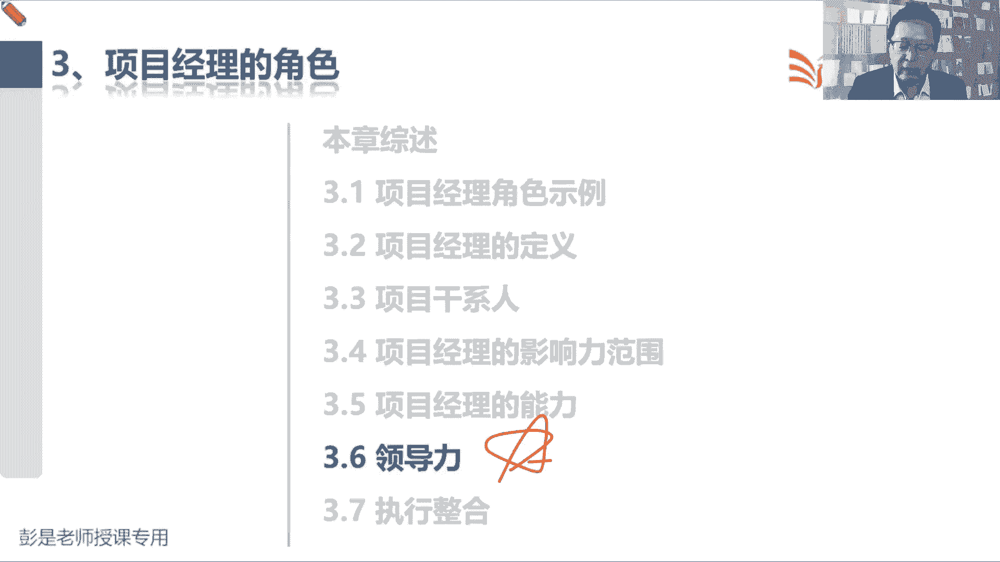

影响力其中之一，影响力，影响力更侧重于人家愿不愿意听你的话呀，愿不愿意跟着你往前冲啊。

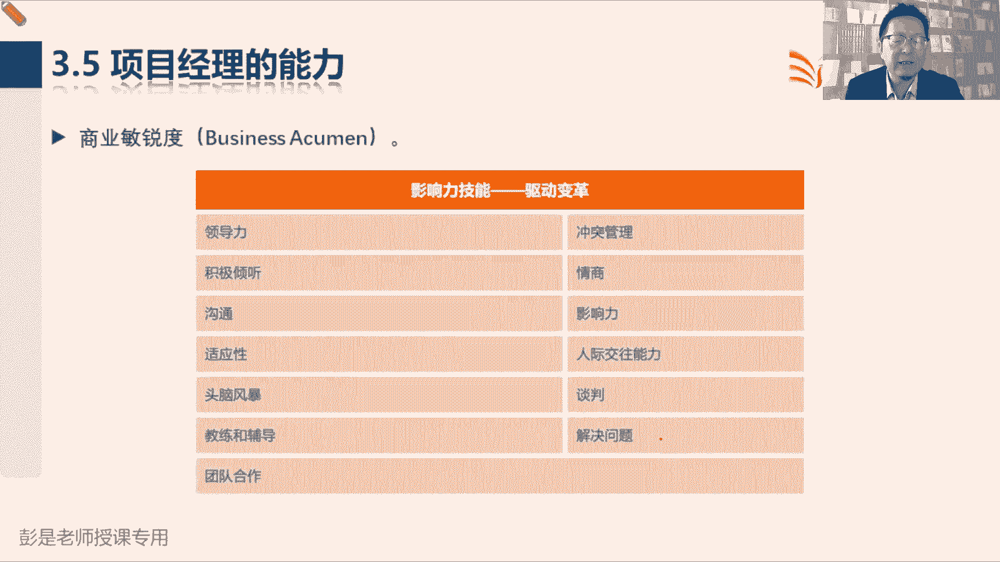

领导力，接下来它其实维度不一样，那就看3。6解释什么叫领导力。

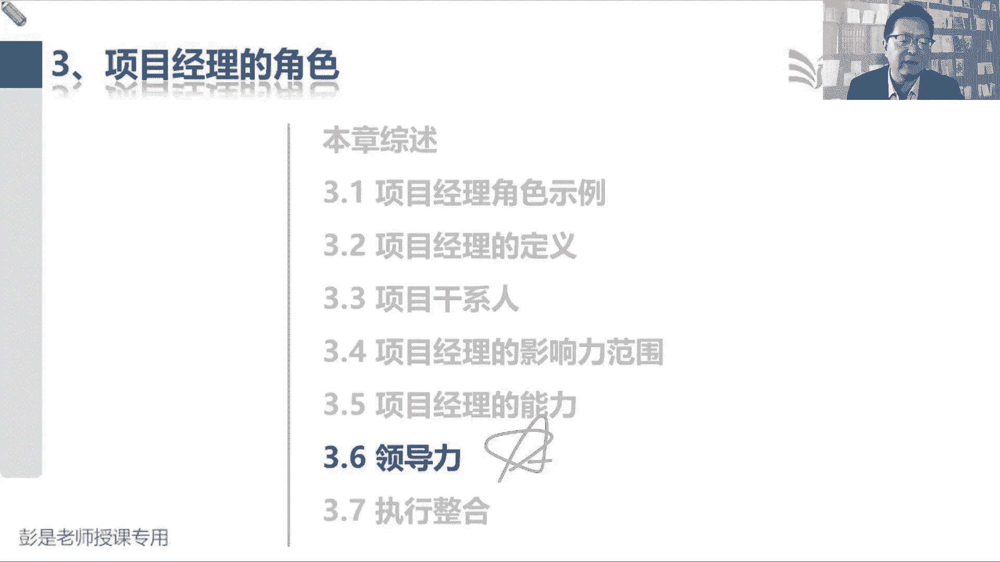

好看看啊，领导力技能包括指导激励和带领团队的能力，这些技能可能包括协商，抗压，沟通解决问题，批判性思考，人际关系技能说呀，我们随着公司越来越多，项目复杂，管事管事，然后管人人可以记住。

但不他不是数字变成大白话，这段文字想说什么呢，项目经理的核心工作就是把事处理好，把人伺候好，让这些人愿意去干这些事，从而帮助我们促进成功，那事好书里人呐最难伺候，为什么呢，都说人的心海底针对不对。

人有好多感性的东西对吧，什么悲观的消极呀，今儿开心啦，后天生气了，过两天过两天哎，又觉得又觉得人生应该躺平，人太容易变了，对不对，所以怎么管人，怎么管人，就提出了领导力技能不好管啊，好考试超简单。

考试超简单，第一我们要分清楚两个单词，为什么现在强调的是领导，而不是管理，这里的领导不是名词啊，咱名词说张三是领导子，李四是领导，现在这里的领导力指的是动词，那管理和领导的本质区别是什么呢。

管理和领导的本质区别，更能体现一个什么特点，想一想哎，小丸子同学说了，管理有强制性，管理有强制性，强制性强制性，所以他俩的本质区别是什么呢，张博同学应该做个预习了哈，祝各位同学想场景。

大家之前你看过的什么抗日抗日片，战争片，对什么叫管理，就是兄弟们给我上，让你干啥就干啥，领导呢是什么呢，兄弟们，跟我上，我要干啥你就干啥，所以兄弟们给我上，这就是管理，用权力命令对方去干活。

利用手里的权力命令对方，张三，你去干这个事情，李四你去做这个事情，那如果用权力命令对方去干活，对方可能是一个什么心理呢，在思考大家日常在工作之中，领导给你安排了任务对吧，你的心情是一个什么样的抵触。

对不对，很正常，抵触这逆鳞这东西吧，反感难受，不自愿抵触逆反，不开心，还不心甘情愿，对不对，就被动总结成这个词就非常到位了啊，可能就被动了，一被动这种负面的情绪一出来，这个事情的效率质量可想而知。

那如果领导说啊，对兄弟们跟我往前冲，对不对，通过和你沟通啊，交流啊，协作啊，让你有这个让你有这个什么呢，前进的动力就变被动为主动，所以现在提出了3。6，这是他的中心思想，这是他的中心思想啊，所以领导力。

领导力侧重于一个调动对方的这种。

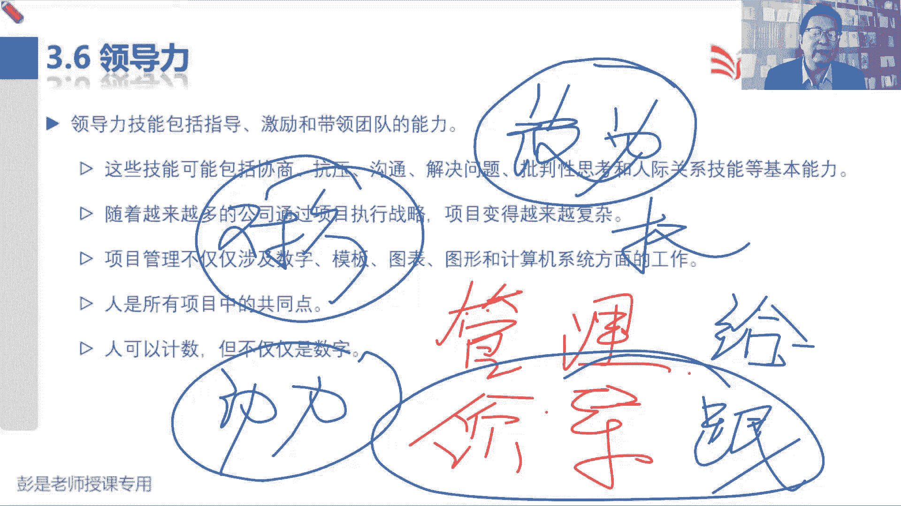

正能量的东西，让对方积极的乐观的，愿意的对吧，主动的跟着我们一起往前冲，实现任务，完成目标，得到期望的结果。

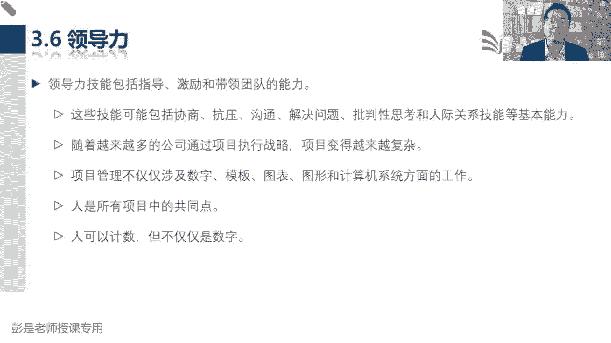

知道这个中心思想，知道这个中心思想，再看后面这段文字就没啥了，影响力就包括了各种各种各样的软技能，领导力是其中之一，这就是他俩的本质区别，只用领导力还不够的，还要会说话，会聊天，幽默高情商。

以此类推的吧，好知道这意思，所以就有了这个结论，人际交往占据项目工作的很大一部分，我们应该研究人的行为和动机，应尽力成为一个好的领导者，因为领导力罢了，不念了，去研究对方的心里。

想办法怎如何有效地调动对方的积极性，对不对，想办法让对方从被动变为有主观能动性，有主人翁意识，所以变成日常大家生活中，工作中的一些通常的场景是什么呢，就是啊有的人哪需要吓唬，有的人需要哄着。

有的人喜欢打一巴掌，给一个甜枣，有的人喜欢给个甜枣打个巴掌，嘿天见人说人话，见鬼说鬼话，就是千人千面，所以其实这段就是管理心理学的东西，为什么呢，管理心理学研究的就是人的行为和动机，诶小云同学说到点了。

就是心理学读心术了，对不对，所以大家日常看看看看，你这个真不好，观察一下你身边的同事，观察一下你身边的同事，有的人你让他干活就得哄着点，对不对，有的人让他干活啊，你就直接跟他说就行了，有的人干活啊。

你就得搬出老板来，老板让你干的对不对，有的人干活了就得吓唬他不干，那过两天公司要裁员，那我听说哎以此类推了，总之总之想方设法想方设法的箭对吧，让人家让人家心甘情愿愿意跟着你走哈，好知道，这个中心思想。

然后呢考试不会考负面的东西啊，不会考那些阴暗的什么厚黑学这种东西啊，考的都是正能量的，积极的这种东西，所以接下来就描述了一大堆正能量，积极的这种技能，第一个有远见哎，画大饼对不对。

内容帮助描述项目的产品目的和目标，并能有梦想，并向他人诠释愿景对吧，我媳妇不让我学PMP，你就跟你媳妇说，你看今天啊虽然不做家务，但是呢学完这个考，通过这个考试拿到证书啊，提高我的能力。

可以让咱家日子过得更好，我老板还给还给我说了，学完考试啊，给我报销，给我报销，给我一部分补偿，等过两天，过两年，我一跳槽，变成专业的项目经理，一年啊，弄个20几万，30几万，走向人生巅峰指日可待。

这不是有远见吗，短期目标，长期目标，持续目标，给人家描述清楚，然后呢，接下来就是正能量的一面啊，积极乐观，然后什么乐于合作，你说这东西怎么考，根本就没法考，好所以这种东西啊，它基本上现在不是考点。

因为很容易判断，很容易判断啊，这个大家玩个小游戏啊，这是个杯子，这个杯子里面的有这么多水，乐观的人会怎么说，悲观的人会怎么说，你说这东西咋考，乐观的人会怎么说呢，哎呀太好了，还有半杯水呢。

悲观的人会怎么说呢，哎呀太不好了对吧，只有半杯水了，那我们要注意注意日常工作中，生活中这个用词尽量要规避掉这种悲观的用词，能听懂吗，心理建设超重要的，不要给自己压力，不要给自己这种压迫感哈。

哎呀要学PMP呀，要学的知识这么多呀，这么多呀，不好学呀，记不住啊，年龄大了，年龄大了总是记不住啊，越给自己这样的心理暗示，你就越记不住，想一想这个道理对吧，工作生活好多事啊，天天加班啊，记不住啊。

哎呀岁数大了记不住啊，哎呀哎呀，每天没时间呐，你越给自己的心理暗示，你就越悲观，越悲观就越消极，越消极就越记不住，那还不如正能量，今天我就记住两个术语，明天我再记住两个术语，小步快跑，今天记一点。

明天记一点，欢乐无比多，就这个道理哈，所以不要慌不要慌，对蚕食蚕食知识点这么多，不要贪图，不要贪图一次把它全都记住，不现实，那咱就把大目标变成小目标，就这道理吧，变成一个一个的小目标。

逐步逐步往往前冲就可以了，好这东西就做一做心理建设，考试不可能考好，再往下建立信任，巴拉巴拉巴拉，这都不念了。

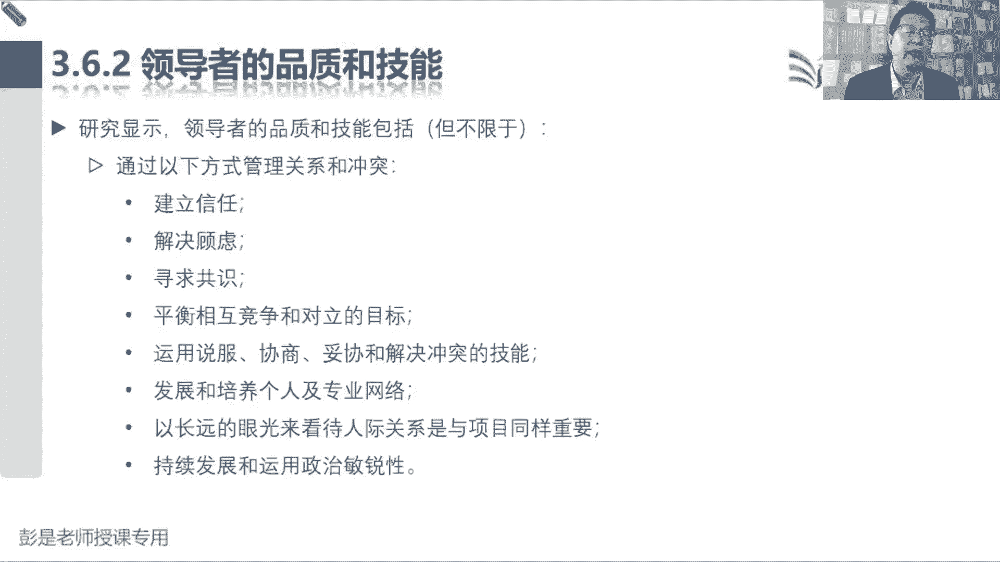

看一看就可以了，重要的知识点后面单独讲的啊，然后什么花大量时间沟通管理，期望诚恳，什么反馈询问，这都不见了，尊重什么果敢，什么称赞终身学习，不念了。

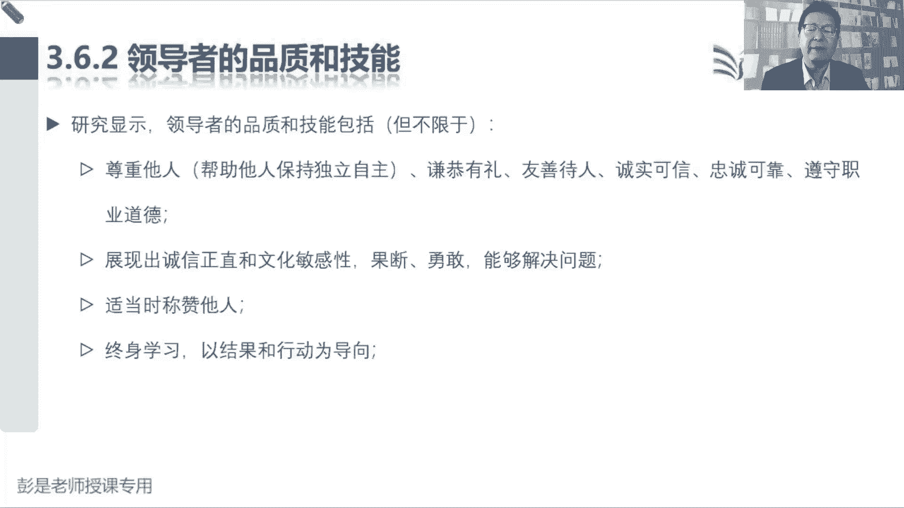

总之啊卓越的领导力啊，全身正能量。

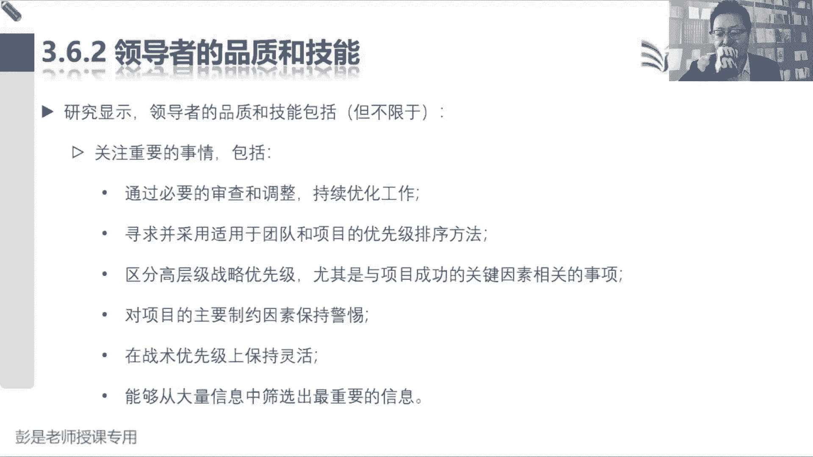

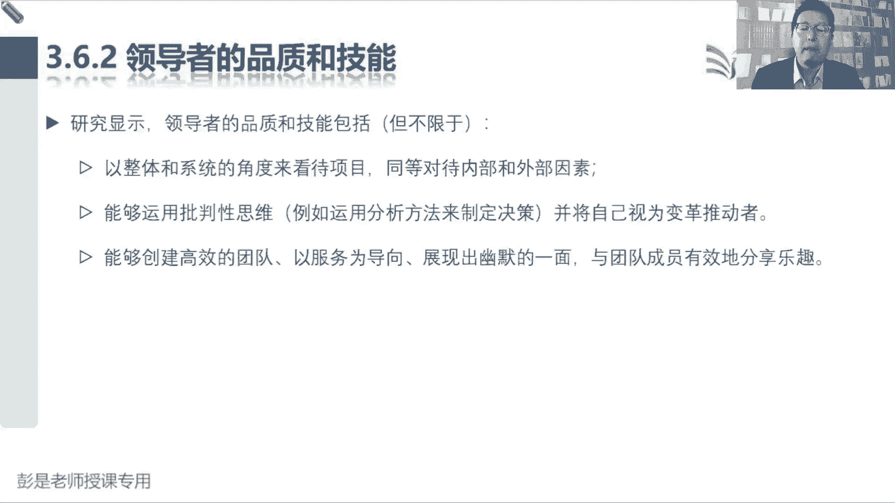

好接下来363，363这个单词就听一遍就完事了，刚才说过这个单词就对标到这个好了，不念了啊，这段文字想看就看。

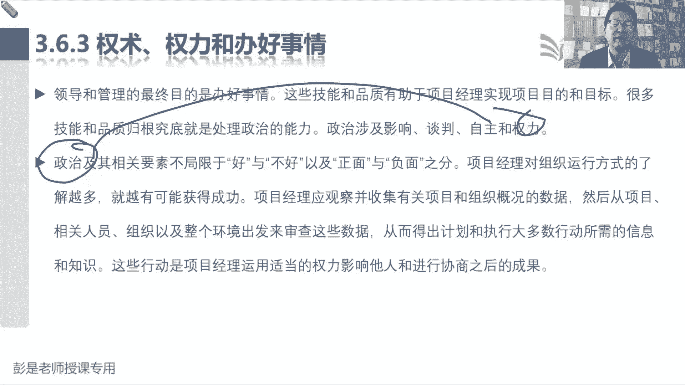

不想看可以不看了，这东西都没法考的，有了权利，有了权利就有了职责，你说这东西刚才讲过了吧，权力的高与低，咱也做不了主，但是呢我们要想办法，想办法有效地利用手里的权利，所以接下来重要的知识点在这儿呢。

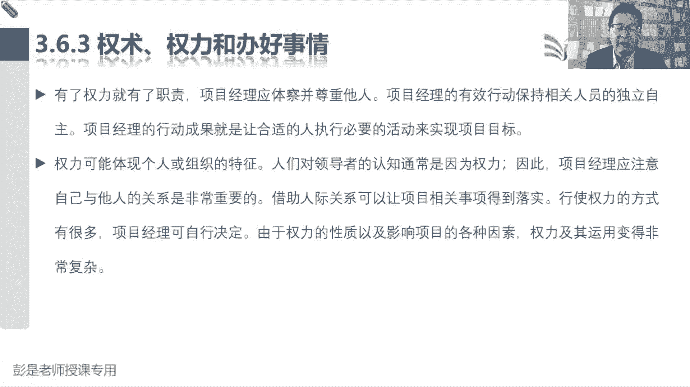

行使权利的方式，包括但不限于什么地位，信息参考情境，个性关系，专家奖励处罚惩治，这段文字，第一个重要的知识点，我们要知道项目经理走马上任，走马上任啊，张三被公司任命为项目经理，项目经理是角色。

张三是具体的人，张三这个具体的人担任了这个角色之后，那么角色身上的权利就到了张三身上，所以叫我们得到了企业的授权授权，我们可以动用组织的资源完成项目的工作，体现了这个事的合规性，那公司给我们什么权利呢。

通常有三个，第一个叫地位，第二个叫奖励，第三个叫处罚，作为一个项目的项目经理，我们有正式的权利来管项目，作为一个项目的项目经理，我们有给大家发奖金的权利，作为一个项目的项目经理，我们迟到早退呀。

有人有人对吧，迟到早退伤风败俗，我们有这种处罚权，这个一定要脱离实际啊，大家实际工作中记得啊，我说你可能是只能弱矩阵，没什么权利，对不对，咱整本教材默认平衡矩阵，所以通常来说。

平衡矩阵的项目经理这三个权利是有的，可这就是我们公司给予公司，赋予项目经理的权利，说白了就是公司给的这叫正事权，奖励权，处罚权，这个要记住，那公司如果给不了公司如果给不了，这是刚才讲的场景吧。

如果各位同学啊，你是一个职能型或者是弱矩阵，夺中弱举阵中的项目经理，公司给不了你正式的权利，我们也做不了这个图啊，然后像是问人家管钱的，我们也没有什么奖惩权，咋整呢，那咱要想办法去争取公司给不了的权利。

这里面高频的考点就两个躺平啊，不能躺平啊，我们要挣扎呀，挣扎怎么争呢，有两个关系，有两个权利比较好争，这个和这个这个需要记住的，一个叫参考权，一个叫专家权，参考权是什么呢，例如因为他人的尊重和赞赏。

获得的信任，这个最粗暴的版本啊，就是大家听过的成语故事，狐假虎威，狐假虎威，对不对，老虎大家都怕他，狐狸在森林里耀武扬威，大家怕的不是狐狸吧，怕的是狐狸背后的老虎，就这个道理。

所以如果我们在工作中表现得很卓越，很出色，很优秀，领获得了领导的赏识，对不对，获得了领导的认可，这种情况下，还你把这个意思给人家透露一下，人家可能就更愿意听你的了吧，这个道理。

所以参考权有的时候也被称为暗示权，或者叫显示权利，他的意思是一样的啊，暗示权利，浅释权利，参考权利，叔叔暴理解就是狐假虎威这种场景，专家全纯粹的字面意思，拥有的技能信息经验培训教育证书，能够体现。

通过这些东西吧，能够体现能够证明我们有这个专业知识，证明有这个专业知识，这就叫专家权，所以参考权是需要我们自己表现的卓越出色，然后才可以狐假虎威，专家权呢就是需要我们不断的学习，不断的成长。

对不断的积攒，积攒我们自己的个人的这些什么经验啊，诀窍啊，技巧啊，来提升我们自己的能力，这两个东西公司给不了，需要我们自己想办法主动去争取，哎，这就是大概常见的五种权利类型，那其实这些权利啊偶尔还会考。

还会考他的一些小特点，听一遍就完事了，参照权狐假虎威专家权专家，全是说我们自己不断的学习，还记得第一天上课，还教过的学生十几万，通过率多高多高，然后讲的明白，讲的透彻，解题思路非常非常非常有逻辑。

这些话说完了之后啊，各位同学你信吗，这就是专家权利的特点，不一定不一定对不对，打问号的吹牛扯皮，谁不会呀，嘿他需要经历，需要经历一段共同的工作才能够得到认可，对不对，这第一节课，第二节课，第三节课。

一直到模拟考试诶，大家一同一同共同，为了为了通过PMP这个这个这个考试，咱共同工作一段时间，慢慢的慢慢的大家就会发现黄老师确实很厉害，有两把刷子，我认可你，所以它见效慢，剑桥曼啊，通常鬼才信命。

他不容易获得信任，但是一旦一旦双方建立了，这种我们需要的信任关系，它不容易被破坏，对我就信张三的，我就信李四的，因为呢他专业我认可他，我就听王五的，这个人非常牛，非常专业，我就信他的诶。

所以这种信任关系建立好了之后啊，不容易被破坏，所以有些坏人就利用这样的心理学，就利用这样的心理学对吧，天天PUA，天天PUA，你，然后呢慢慢的慢慢的慢慢的你心里面就盲从了。

然后呢建立了所需的信任关系以后啊，人家说啥就是啥，任人摆布，就这个道理啊，一样的好，这是专家权建校办，但是呢最终效果好，那参照权利就反过来见效快，见效非常快，快到什么程度呢，第一天上课。

如果我把那些PPT换一下，然后呢出题老师出题老师啊，住我家楼上，我想听我俩天天一起烧烤，一起撸串儿，一天天天打，一起打球，一起玩游戏，嘿你说，所以接下来我说的每句话，是不是更容易获得各位同学的信任呢。

就这个道理吧，这叫快，这叫快啊，好大概听一听了解就可以了，总之这两种权利我们要想办法想办法去争取，去争取啊，好所以再往下翻嗯。

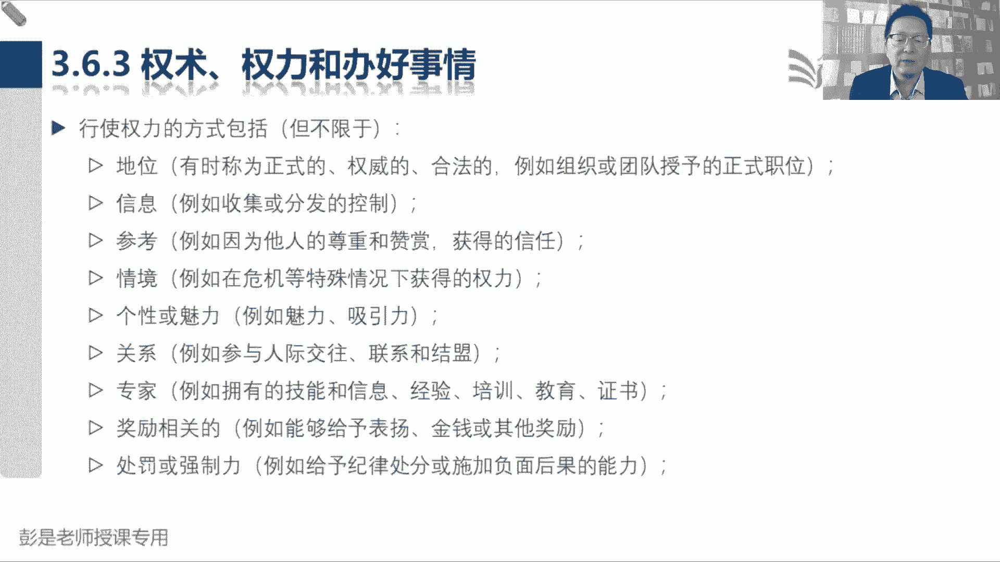

再往下翻，接下来就有了这最后这个结论，在权利方面，顶尖的项目经理积极主动且目的明确，那么我们会在组织政策协议许可的范围内，主动寻求所需的权利和职权，而不是坐等组织授权，因为企业给给我们授权正式权利呀。

奖励权利呀，惩罚权利呀，可能啊没有多大，甚至都没有，那我们只要自己想办法，想办法去争取一些企业给不了的权利，好后面那些什么迎合呀，施加压力呀，出于愧疚啊，这个考试基本上也不考，你看名字应该也能猜到对吧。

施加压力给人家压迫感什么，出于愧疚对吧，道德绑架就这种东西啊，这考试肯定不能考的好，两点就可以。

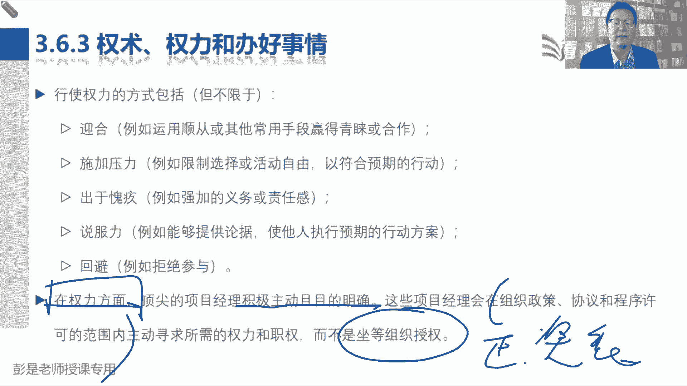

所以粗暴理解100再往下拉啊，心理学涉及到的范围，需要他那个知识体系也非常非常繁杂庞杂，所以大家听学完了PMP之后呢，有兴趣的同学可以看一些什么，组织行为学这种东西啊，管理心理学诶，去看一看相关的书籍。

怎么管人，超复杂的一套东西好，那364这就简单了，领导力和管理两个词它的本质区别，管理是更接近运用一系列已知的预期行为，只是一个人从一个位置到另一个位置，就是左边这个东西让对方去干活，兄弟们给我上。

相反，领导力是指通过讨论辩论和他人合作，带领他们从一个位置到另一个位置，就是上面这张图，对不对，兄弟们跟我上，所以我们要想办法，想办法给我们的员工有效的打鸡血，提升他们的动力，不要让大家悲观消极。

对焦虑惶恐，把这种负面的影响最小化，把这种负面的情绪啊扼杀掉，然后正面的东西呢给他发扬光大，这就是管人的中心思想。

再往下拉啊好所以后面再说。

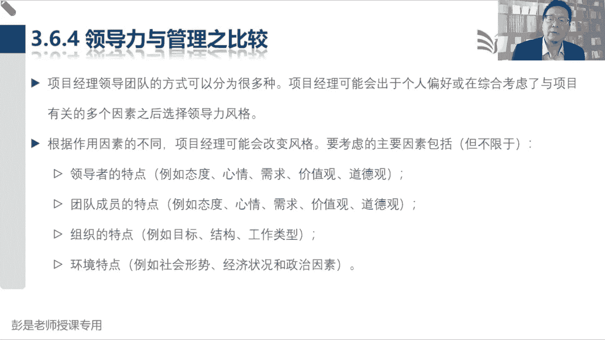

我们有很多的很多的管理风格，这个管理风格呢，说研究显示，项目经理可以采用多种领导力风格，在这些风格之中最常见的包括这个一定一定，记住还要理解，这是非常非常关键的知识点，怎么说好，所以各位同学坚持一下。

这一小段，一讲完，咱就轻松加愉快，可以休息了，最后几分钟解决解决战斗，放任型领导，交易型领导，服务型领导，变革型领导，魅力型领导，交互型领导，这五五种，最后一个交互就是混合，就是混用，对不对。

放任型领导一个一个来放任型领导是这么说的，允许团队自主决策和设定目标，又被称为无为而治，思考了什么样的团队，你敢这么干呢，说团队自己做决策，自己做主，团队啊，自己设定目标，咱什么都不管。

什么样的团队你敢这么玩呢，什么足够信任不精准啊，什么情况下你敢这么这么信任他呢，哎这能力强，能力强到一个什么水平呢，持股啊，持股不一定啊，持股不一定啊，耻骨还可能乱来呢，对不对，所以呢最最踏实的。

最踏实的描述它的词语叫成熟，成熟就把大家带出来的各种特征给它结合进去，比如说能够自律啊，能够自我控制啊，能够自我约束啊，能力强啊，诶对不对，我信任他呀，一个成熟的团队，我们才敢授权把权力交给团队。

由团队自己做主，那成熟的团队又称之为什么呢，自组织哎这两个单词一定要记住，一个成熟的自组织的团队，我们就可以不管了，一个成熟的自组织团队，我们就可以不管它了，好所以大家刚过完年，你就想想春节。

你们家你们家里面的场景就能理解了，我们家人呐喜欢玩牌呀，春节年夜饭刚吃完呢，还有人擦桌子，有人扫地，有人找牌，有人弄零钱，非常成熟，自己就把这个活儿给组织完了，自己就把这个事情给协调完了。

这种情况下根本就不需要有人来管，对不对，很简单的场景哈，所以带小孩也是这个逻辑吧，你的小孩成熟了，有生活能力，有工作能力，有技能，一身本领，你还管吗，不管了，放权对不对。

那当你发现你的小孩天天天天不上班，不学习，不工作，天天刷抖音，刷快手，看热搜，刷微博，这就不成熟，该管还得管，所以我们要去判断目前团队是一个什么情况，大家成熟不成熟对，如果成熟了。

如果能够达到自组织这样一个状态，很好地完成工作的规划，执行控制，咱就不操心，咱就放权，我们通过授权，通过授权就把权力交给了团队，好把决策权，把工作的规划执行控制的权利就授权给团队。

让他们自行完成这些事情，这是第一个啊，叫放任性，那放任型放任型，接下来继续思考，如果我遇到了一个成熟的团队，我把权力交给团队了，让他们自己来做决策，自己设定目标，咱不管，那接下来咱还是领导，咱干啥事呢。

从后边挑一挑，挑到遇到合适的选项，交易服务变革魅力，就变成服务型的领导哎，所以把第一个和第三个绑定，第一个和第三个绑定，一旦我们把权力交给团队，让团队自己决策，自己设定目标，我们就变成服务员了。

服务型领导，服务型领导，你就想服务员这个场景，你去餐厅吃饭，服务员的主要工作是什么呢，对吧，以客户为中心，然后关注客户，关注客户能不能吃好饭，对不对，然后呢关注关注团队，关注大家怎么合作。

服务优先于领导，他也没有什么决策权，他就给我们提供服务啊，让我们能有一个良好的就餐环境，对不对，让我们不要铺张浪费，给我们提供支持，帮我们排除阻碍，有人抽烟了诶，他让人家不要吸烟，对不对，不要吸烟。

桌子脏了，帮我们把桌子擦一擦，避免影响我们就餐的就是排除障碍，排除阻碍，给我们创造良好的工作环境，工作条件，还后勤保障，所以呢服务型领导有的时候啊又叫管家式领导，或者叫仆人士的领导，管家式的领导。

仆人式的领导，服务型的领导都是一个意思啊，这是我们工作工作成员自己来完成工作的规划，执行控制，我们需要有一个人给我们提供保障支持，排除阻碍，对这样的这样的这样的角色好，所以第一种叫第三种。

先先有点印象啊，到后面再讲到敏捷的时候，非常非常关键的知识点，嗯所以就像各位同学，你想一想，大家微信群里面我们那个班主任班主任，他也没有权利命令张三，命令李四怎么去干什么事情吧，张三今天听课。

李四今天看书，咱也不听，那班主任干什么事呢，给我们提供服务吧，给我们提供支持，排除阻碍我们学习的人和事，对不对，就这道理吧，嘿处处为同学着想，关注各位同学的成长，学习发展自主性，关注大家人际关系。

让大家在群里边啊，不要吵架，对不对，不要吵架，不要对骂，关注大家，我们是个集体，我们要合作合作，对不对，大家都是为了通过考试，对不对，我们要对事不对人，不要说话，带情绪，不要焦虑，不要惶恐。

以此类推了哈，就是这样一个角色，好，放任和服务是同时存在的吗，这种领导力风格呀完全可以混用啊，所有的领导力风格一定是最后见人说人话，见鬼说鬼话，我们要根据团队，根据成员他的状态去分析。

需要采用什么样的风格好，所以还不难，不好理解的同学，你就全都想着带小孩，小孩儿成熟了，咱就不管了，那不管了，还要帮助小孩对吧，排除人生路上的障碍，关注这个小孩子的成长发展，学习对，以此类推。

所以它一定不是只用一种，一定是采用多种领导力风格，好再往下了啊，中间这种超好理解，交易型的领导，纯粹的字面意思交易交易交易一手交钱，一手交货，所以领导给你定绩效，这就是交易嘛，对不对，达到什么样的绩效。

你会获得什么样的回报，所以他关注目标反馈和成就来确定奖励，这个咱从小到大身边也都是这样的领导啊，考试考第一名，买个新手机，考试考100分给你要玩10分钟游戏，这不是交易吗，可这个了解过很好理解啊。

第四个呢变革型的领导者也称超好理解，这是改革创新，所以通过理想化特质的行，为什么鼓励性鼓鼓舞性的激励促进创新和创造，教大家不要墨守循规，不要循规蹈矩，方法总比问题多，方法总比困难多。

看看有没有更多解决问题的新方法，新思路，嘿启发大家，那最后呢魅力型领导，就是这是情绪心理这种东西吧，能够激励他人精神饱满，热情洋溢，充满自信，说服力强，让大家充满了充满了斗志，心理建设好。

这都了解就可以了吧，所以像魅力呀，变革呀，交易呀，这超好记，然后呢一和三一定要记住它的场景，团队一旦成熟，咱就放任不管了，授权授权之后呢，我们给团队提供服务，提供支持，最后交互，这是混用，好知道这个啊。

这五个领导力风格还是需要大家记住的，尤其是未来等待等他学长敏捷的时候，一定是主打一个服务型领导，嗯好再往下了，大多数一定是混用啊，这种领导力风格不可能只用一种的对吧，就像你家小孩，你给他设定目标。

让他努力学习，然后呢给他提供服务，给他提供服务，发现孩子很有很有上进心对吧，每天一下一下班，回一下课，回到家就自己看书，自己做题，那咱就不操这个心了，放任自己学去吧，对不对，但放任又不能真的完全放任。

还要关注这个人对吧，在学习的路上会不会走偏的，及时的纠正啊，另外呢在有的时候给孩子一些启发方法，总比问题多，看看能不能有新的方式，新的方法，新的思维模式啊，不要墨守成规，不要循规蹈矩。

最后呢每天呢还要还要满满的正能量啊对吧，每天尽量的少说那些消极的，负面的，低沉的对吧，这些话题尽量的充满正能量，让大家每天都有动力，所以一定是混用，不可能只用一种啊，好知道了啊。

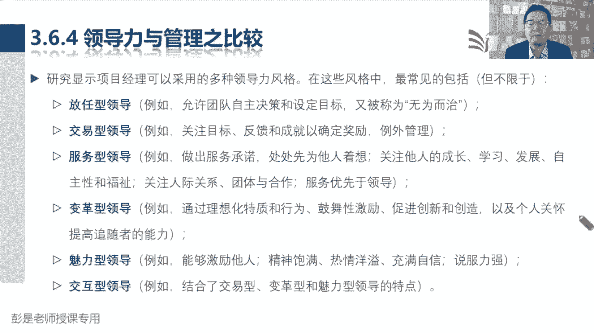

再往下365没什么东西了，这些单词基本上想看就看，不想看可以不看了，因为这玩意儿不太容易考，没法考啊，真诚谦恭，创造力，文化情绪，智力管理，政治这玩意儿没法考好。

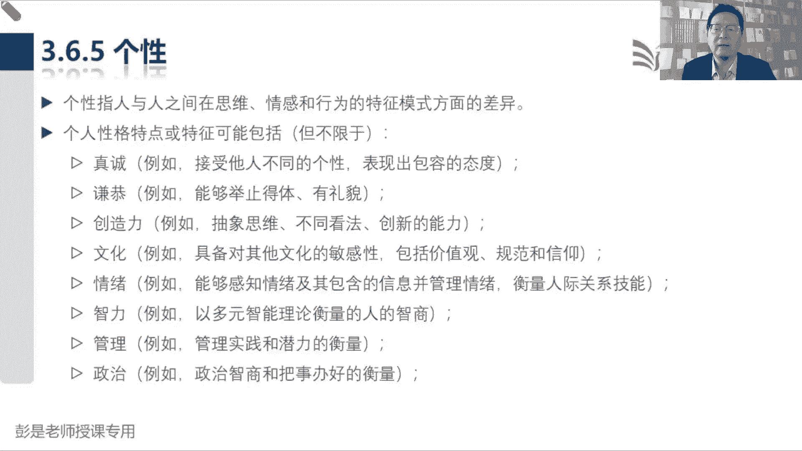