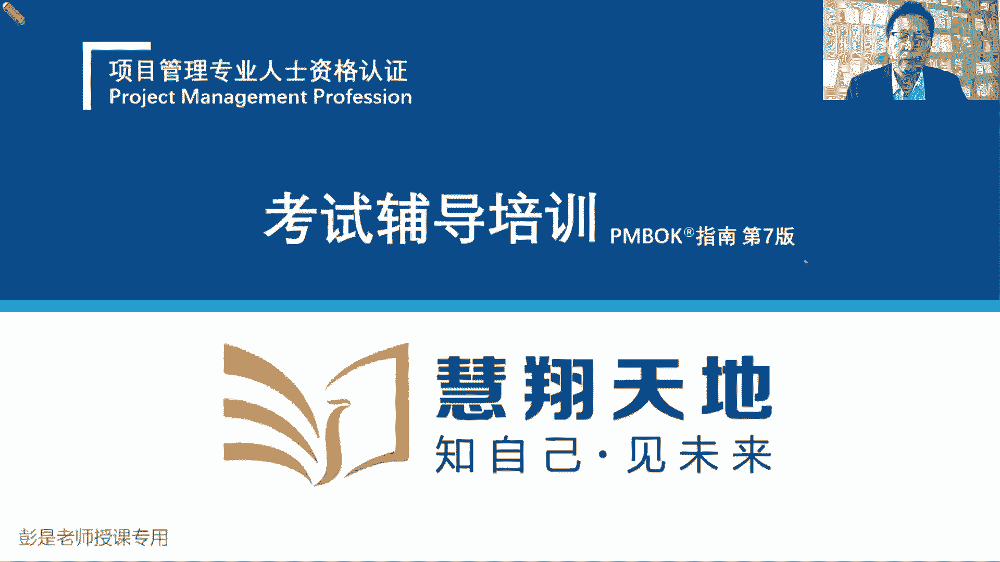
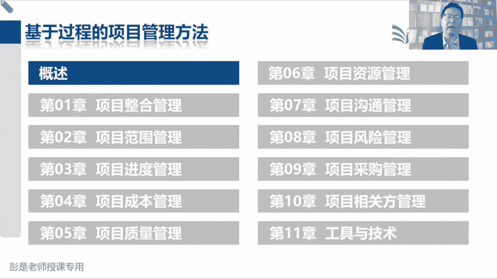
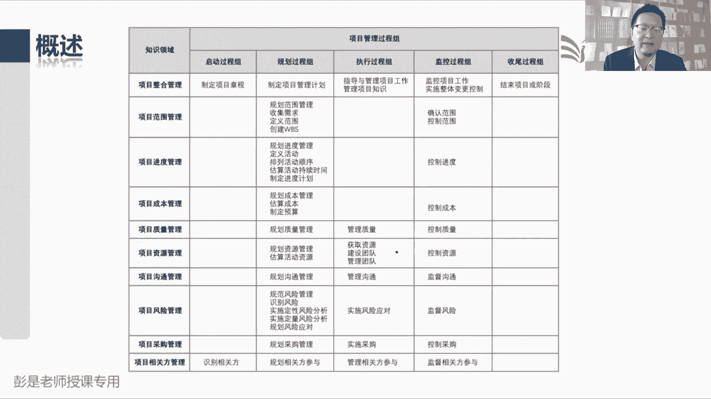
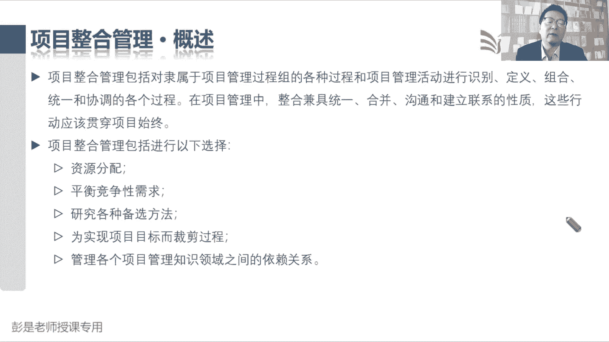
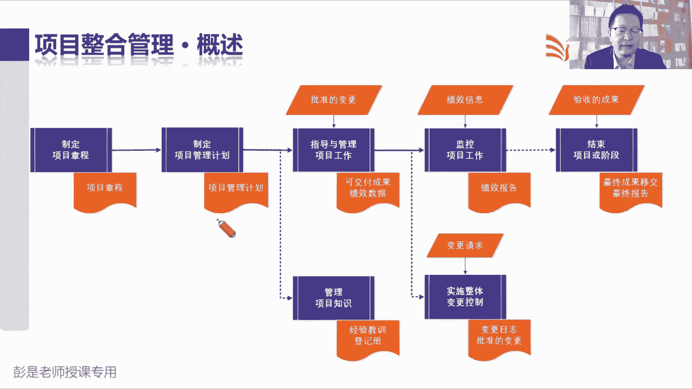
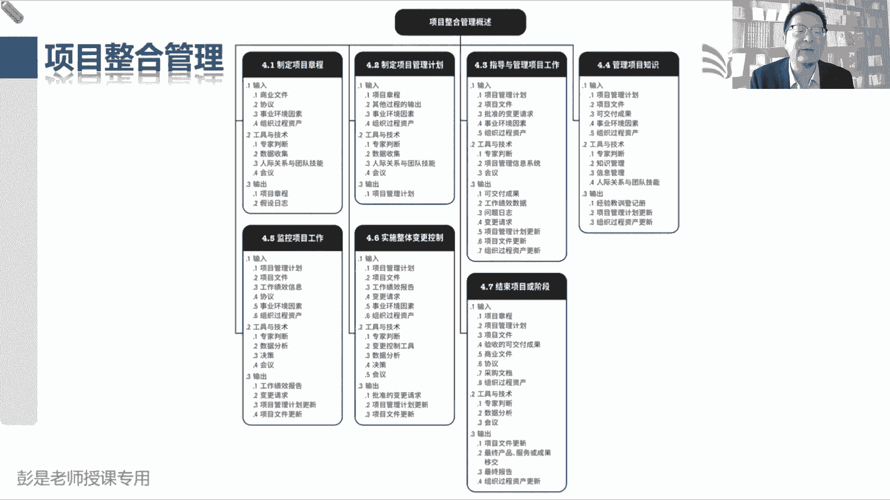
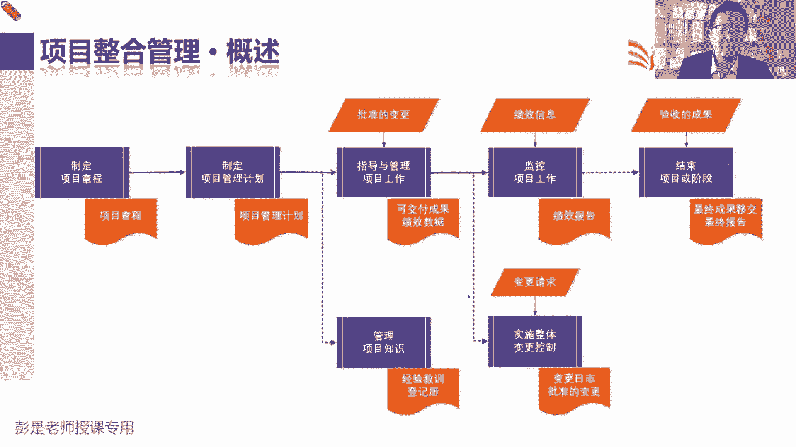
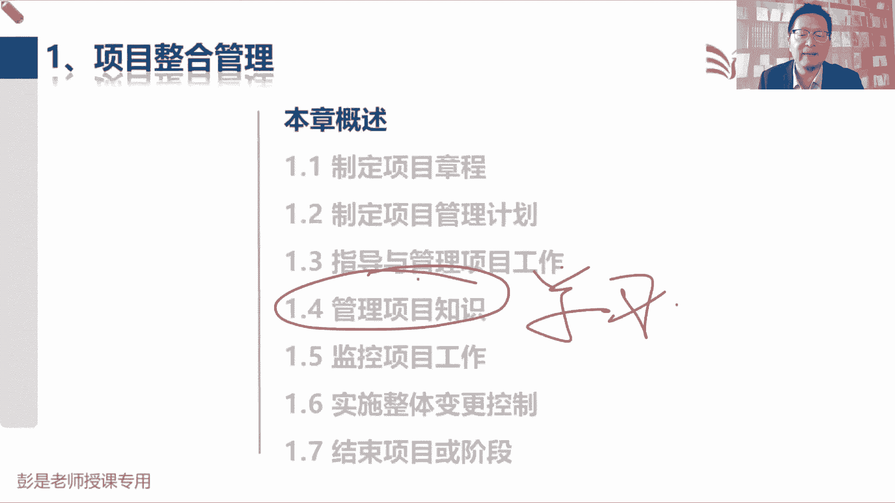
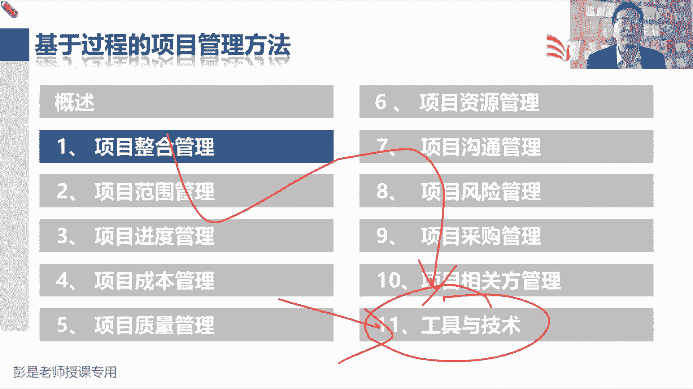
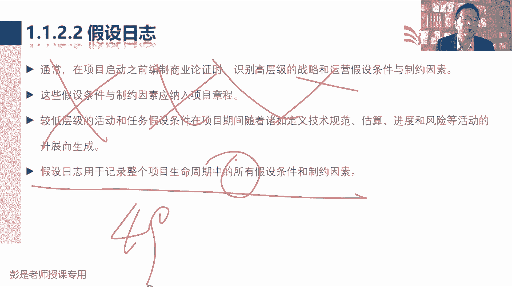

# 2024年最新版PMP考试第七版零基础一次通过项目管理认证 - P18：2.1.1 制定项目章程 - 慧翔天地 - BV1qC411E7Mw

好好接下来讲什么呢，叫咱们通关宝典，第二部分，基于过程的项目管理方法，也就是传统的预测型，瀑布型的项目怎么管，这是五大过程组，十大知识领域，十个知识领域，49个管理过程，以及呢最后讲一讲开展这些过程中。

可以使用什么样的工具技术，这部分内容啊超多，因为49个管理过程，每个管理过程涉及到一些输入输出工具技术，但现在考试的趋势呢，是不太需要大家去背很多东西，不难啊，不难降低心理压力，不太需要大家去背。

并且呢49个管理过程，等他讲完课，给大家讲一讲记的技巧，超简单的，没什么东西啊，并且呢收入大部分是不需要去背的，输入大部分是不需要去背的哈，开展工作的过程中用到的一些工具，基础也是大部分不需要去背的。

我们要了解这些工具技术的特点就可以了，那每个管理过程的一些关键的重要的输出，是需要记的，因为至少你要能够理解这个过程，它主要干啥事的呢，做什么的呢，完成这项管理工作，我们会得到一个什么样的成果。

这是需要记住的哈，所以一共有49个管理过程，没有那么多输出文件啊，实际上它是输输输输出文件加起来50个左右，不多，真的不多，然后呢一百一百三十几个工具技术，并且大部分工具都不用背啊。

比如说就像这个工具访谈，你说这玩意儿需要记吗，访谈就直接聊天呗，它适用于很多场景啊，这东西根本就不用去仔细看哈，所以超简单的没有那么多，看起来多哈，但是呢这叫占占占什么，大家是日常工作中。

有没有听到领导给你说这个事情啊，战略上要什么呢，战术上要什么呢，战略上要干啥呢，轻视还是重视，战术上要轻视还是重视，品一品战略上轻视没啥，就这点东西，战术上要重视，该认真学还要认真学。

该写一写还要写一写，该记一记还要记一记，对不对，嘿所以真的没啥啊，降低心理压力没什么东西呀，49个过程，一会一讲，你大概思路就差不多了，战战略上要轻视的，对不对，战术上要重视每一天。

每每个知识领域该写一写，写一写，该记一记记一记，认认真真的去学，就可以慢慢的慢慢的掌握这些东西了。

好知道这个中心思想，那接下来咱就开始了哈，前面这段文字啊，没念到的内容，大家基本上想看就看，不想看，可以不看了，就是在告诉我们教材里面为什么写这些东西，前面给大家其实科普过了哈。

说我们工作的过程中有很多很多的问题，遇到问题啊，我们就分析原因，定方法，想办法把这个问题尽快解决，然后呢总结经验教训，想办法让这个问题尽量的不再重复，出现重复发生，于是呢开展下一次工作的时候。

就有了很多的注意事项，注意事项一多呀，我们就要分组啊，就要梳理它的逻辑了，就有了范围，进度成本质量资源，九个知识领域，有了这九个知识领域不够啊，需要有人高屋建领，去运筹帷幄，去整合，去组织协调。

所以呢盖个帽子就有了整合管理，然后呢横向再去分析分析，我们生命周期的每个阶段，都需要通过启动过程组得到授权，规划过程组定计划，执行过程组去执行监控管绩效管变更，最后呢打扫战场收尾过程组。

所以呢就纵向易划分，就变成了五大过程组，十个知识领域，49个管理过程诶，就变成了我们工作中，工作中对我们工作形成指导的这套东西，好了解就可以了吧，所以他就说我们就是达成这些共识。

项目管理标准就是这49个过程了，然后呢我们要根据项目的独特性进行裁剪，以此以此类推啊，不念了，然后再往下这句话也见过了，说我们教材里面只列出来十个知识领域，但大家实际在工作中还要考虑其他领域的管理。

比如说财务管理，安全管理，健康管理，环境管理，以此类推，具体情况具体分析，做裁减增加也可以好，这都不用记得啊，然后接下来就带出来这张表，这张表刚才有同学说啊，预习的时候听老师说呀。

这张表尽快的把它背下来，瞬瞬间就后悔了，后悔了吧，不要后悔，这个这张表实际上背它是有技巧的，技巧的啊，这张表怎么记呢，先给大家说一说这个思路哈，咱掌握了五大过程组，一会儿一讲，你就明白项目整合管理。

这七个管理过程是做什么事情了，这七个管理过程啊，单独学，然后呢找规律找规律啊，你看看规划范围，规划进度规划成本规划，质量规划，资源规划，沟通规划，风险规划，采购规划相关方，九个大臣干活都有一个规划。

有规划就必有控制，对不对，规划是看一看，想一想这事儿怎么干，控制那就是看绩效管变更，所以呢又有了控制范围，控制进度控制，成本控制，质量控制，资源控制，沟通，以此类推，监控过程组九个大臣都有一个控制。

只不过用词有一些差异，监督风险控制，控制采购差异，但是意思是差不多的，意思是差不多的啊，实际上是不一样的，但粗暴去记，对不对，反正都是监控，监督是为了看状态，控制呢是为了采取措施，监督是为了看状态。

控制是为了采取措施，嗯对对，监督我家小孩有没有认真看书，认真认真认真做作业，发现他做作业的时候在玩玩具，那适当的适当的采取控制措施，对让他专心，所以粗暴理解都有监控好，有了九个规划，九个监控。

然后呢再看看啊，有一些独特的比较各色的东西啊，拿眼睛一扫九个大臣，九个知识领域，从范围到相关方，在监控过程组，其他人都是一个管理过程，只有范围，这个兄弟啊，有俩事儿，他除了控制范围。

还有一个管理过程叫确认范围，确认范围，等咱讲完范围这一章你就明白了，这个管理过程做什么事呢，千万不要被字面意思所迷惑呀，有些同学不听课，不看书就会误解，就会误解为说确认项目的范围到底是啥，这就错了。

这个管理过程主要的工作是做验收，验收是什么呢，看我们的可交付成果是不是满足验收的标准，验收的条件，如果没问题，就验收通过了，他是做验收进行验收，这个管理过程那就需要单独记，所以就像各位同学。

你淘宝上淘宝上京东上买的东西，这东西送到家以后打开包装看看，没问题诶，确认收货，这不就是做验收吗，还是进行验收这么一个过程好，这个单独记之后呢，再看看啊，还有一个还有一个知识领域和别人不一样。

九个大臣从范围到相关方，九个大臣从范围到相关方，其他人在启动过程组啊都没事干，只有相关方管理，在启动过程组有一个叫识别干系人，识别相关方这么一个管理过程，这个就是看看咱项目相关的人都有谁。

纯粹的字面意思，这个单独记，好收拾收拾，看看现在我们大概掌握了多少个管理过程啊，整合有七个，九个大臣，有九个规划，九个监控，再加一个确认范围，做验收，再加一个识别相关方，在启动过程组。

现在一共有了27个，这就搞定了，一共49个，减去27个，还剩22个，化繁为简了，这22个管理过程啊，嗯大部分管理过程看名字也好猜，找到那些你看名字猜错的管理过程，然后呢结合咱的课程，结合教材再单独记。

理解到位了之后呢，这张表基本上就没啥问题了，就这么去学啊，已经帮助大家减砍了一半了，砍了一半了，剩下的就是随着后面课程，不断的不断的去巩固好，验收不是在收尾吗，想当然了吧，他在监控过程组。

验收通过了才能够去去收尾啊，是这个意思吧，验收不通过就没有办法结束项目或阶段，好然后大家后面学学到技巧了，学到掌握一些技巧，慢慢的慢慢的去梳理这个脉络，这就是咱课程的主要作用。

那接下来咱开始了啊，项目整合管理这个这一章。

其实啊对各位同学来说，学起来轻松加愉快，为什么呢，五大过程组六个关键词就带出来整合这一章，项目经理主要七件事情，启动过程组主要作用是授权，授权，我们开始项目或者是项目中的某个阶段授权。

你不得有个文件东文件类的东西吧，对不对，授权需要有个文件呐，所以呢这是项目章程，制定项目章程，它的输出就叫项目章程，通过项目章程给项目经理进行正式的授权授权，我们可以动用组织的资源。

完成项目或项目中的工作，所以这个管理过程它的主要作用就是开始项目，或者是开始项目中的某一个阶段，搞定制定项目管理计划，到规划过程组了，并且呢项目管理计划，项目管理计划就是规划过程组进定行动方案。

所以这个管理过程的输出就叫项目管理计划，告诉我们什么时间要做什么事情，诶，对我们什么时间做什么事情形成指导，所以他的输出就叫项目管理计划，搞定1。3指导与管理项目工作，在执行过程组，执行过程组。

咱项目经理也不干活啊，我们是指挥家，拿个指挥棒，对张三做这个事儿，李四做这个事儿工作搞不明白呀，我给你指导指导，确保大家在正确的时间，正确的地点，按照正确的顺序去完成工作，确保大家各司其职，相互配合。

团结友爱，众志成城，所以呢它叫指导与管理项目工作，那指导和管理项目工作，按照计划去干活，会得到一个什么呢，前面也，就涉及到了这个单词可交付成果，按照计划完成工作就会得到可交付成果，我们那个牛肉面馆装修。

先第一个阶段画图纸，直到大家按照计划完成工作，就会得到画好的图纸，对第二个阶段按照图纸去施工，就会得到铺好的地板，刷好的墙，装好的天然气，以此类推吧，就会得到我们的可交付成果，这就是这个管理过程的输出。

然后啊先跳过1。4，那到了1。5，监控项目工作，嘿到了监控过程组，监工监工，监控项目工作就是看项目工作情况呗，看项目工作情况，还记得我们需要拿到一个什么吗，项目经理啊要给领导汇报整个项目的工作情况。

所以这个管理过程的输出就叫绩效报告，那我们需要拿到什么才能写报告呢，拿到九个大臣的工作情况，所以呢九个知识领域的工作绩效信息，诶这个管理课程下班了，我们拿到九个大神，关于各个知识领域的工作情况。

也就是九个知识领域的工作绩效信息，经过项目经理的总结归纳概括，分析评估，还变成整个项目的工作绩效报告，那1。6实施整体变更控制，就是在强调什么呢，变更变更，我们要对变更进行管控，为啥呢。

因为啊牵一发动全身客户提了个新需求，可能会调整我们的进度，成本质量资源，甚至沟通采购相关方风险，以此类推啊，任何一个领域发生变化，都有可能对其他大臣产生影响，那就需要有人跳出来，带着大家综合分析。

综合评估，从整个项目层面考虑清楚，对整体的影响到底有多大，这就叫实施整体变更控制，综合分析综合评估，它的输入输出现在可以先先不记啊，1。7，结束项目或阶段，结束项目或阶段阶段结束，项目结束。

收尾收尾做什么事呢，总结归档移交，那什么情况下可以收尾呢，这是刚才同学说的那个知识点了吧，验收之后才能够开始做扫尾，对不对，就像各位同学在淘宝上买的东西，确认收货之后开始收尾，怎么收尾呢，对吧。

把这个订单给他存档，订订单存档，什么发票给他存档，这不是存档吗，然后呢总结经验教训对吧，这家店卖的东西不好吃，以后再也不从他们家买了，然后呢再把我们的成果可能移交给客户，移交给运营，移交给下一个阶段。

就这么几件事情啊，所以标志性的标志性的就是验收通过之后，我们才可以进入到结束项目或阶段，进入到收尾过程组，大概知道这几个管理过程做什么事情，再或再看1。4啊，管理项目知识，他在执行过程组管理知识。

管理知识知识，那就主主打一个学习呗，先有个这个大概认知这个七个管理过程搞定，好所以在倒车回到49个管理过程，这张表为什么强调要把这张表尽快的背下来啊，因为啊这么干讲，你脑子里面是没有画面的，对不对。

如果变成这张结有结构化的，有条理的表格之后啊，你再把刚才这个逻辑按照这个结构去写一写，去想一想，就超好记了，怎么想啊，比如说刚才我们听到一个绩效数据，绩效信息，绩效报告。

指导与管理项目工作每天干了什么事情，这就叫原始的观察结果和测量值，今天看了几个病人，今天摊了几个煎饼，今天卖了多少牛肉面，诶，今天搬了多少砖头，今天修路修了多少米，都是原始的观察结果和测量值。

还没有经过任何的分析和加工，所以这个管理过程，指导与管理项目工作，会输出原始的工作绩效数据，这个绩效数据啊，项目经理不要了，我们九个大神先干活，分别去分析每个知识领域的工作情况。

所以九个大臣在监控过程组这一大堆管理过程，输入绩效数据，那九个大神拿到数据怎么分析呢，他就用现在的实际情况，和各个知识领域的计划做比较，看看有没有偏差，看看有没有出入，经过他们的分析评估。

就会告诉我们范围的情况，那就是范围的绩效信息，进度的情况，那就是进进度的绩效信息，成本的情况，就是成本的绩效信息范围，就是看看该干的是不是都干了，有没有人画出添足，有没有人超范围在工作进度呢。

就是告诉我们啊，时间提前还是落后，对干得快了还是干的慢了，成本呢就是超支了，还是节约了质量呢，就是缺陷多不多，以此类推，所以呢九个大神就分别输出了，各个知识领域的工作绩效信息，你去看控制范围，确认范围。

控制进度，控制成本都有这个输出，那这些绩效信息交给谁呢，只有镇能总和总能总结归纳，概括整个项目的工作情况，所以这些绩效信息就作为监控项目工作，这个管理过程的输入，项目经理拿到工作绩效信息。

经过咱的分析总结归纳概括，变成整个项目的工作绩效报告，这逻辑一旦梳理完了搞定搞定很多知识点了，后面看书效率词就上去了，很多内容啊就可以不看了，这就是绩效数据，绩效信息，绩效报告。

这里面的这个数据流非常重要的东西啊，好然后再说再说呀，说制定项目计，制定项目章程，出章程，制定计划，出计划，指导与管理项目工作出可交付成果，一脸懵啊，那说明上节课那三个东西还印象不深。

所以呢课一定是听两遍，咱不可能今天上课，再把之前的课再给你讲一遍呢，对不对，好指导与管理项目工项目工作产生可交付成果，这段应该能听懂吧，听不懂的做个标记，然后再复听，指导与管理项目工作产出可交付成果。

监控项目工作，给领导出提交报告，实施整体变更控制管变更，结束项目或阶段标志性的东西就叫验收，拿到验收单，我们才可以结束项目或阶段，所以验收是结束项目或阶段的输入，那什么时候出验收呢，刚才刚讲完呢。

慢慢的你就会发现这个逻辑就越来越清楚，确认范围，这个管理过程就是对我们的可交付成果，进行正式的验收，验收通过你就会拿到这个验收单，所以他就叫验收的可交付成果，拿到这个验收单，咱就把它交给项目经理了。

项目经理呢通过解除项目或阶段，该总结的总结，该归档的归档，再把这个验收的成果移交给干系人，所以结束项目或阶段的输入，就叫验收的成果，输出呢就叫最终产品服务成果的移交，这是现在掌握了这么一小段数据流。

先听啊，能听懂，最好听得懂，没关系，马上就开始讲了，所以呀不要慌不要慌，这些管理过程之间存在着各种各样的关联关系，会带着大家不断的不断的不断的去梳理，但是呢接下来从今天开始，今天下课之后啊。

该复习的要复习，该预习的要预习，因为整个课程你只要把逻辑给他梳理清楚，很多东西全都不用背了，帮助大家提高学习的效率，所以要配合啊，如果配合不上，就会导致啊听的时候啊，这好像有点记不住了。

那好像有点没印象了，听了半天就蒙了，反而会影响效率，好知道这个这个道理，那咱接下来一个一个管理过程，再去继续去细化它，去梳理它，好看整合这一章的综述，大概知道了七个过程做什么事情。

一会儿再具体讲解每个管理过程涉及到的输入，输出工具基础啊，整合这一章说项目整合管理，包括对隶属于项目管理过程的各种过程，和项目管理活动进行识别，定义组合统一协调的各个过程，这是运筹帷幄，组织协调，对不。

为什么要整合这个逻辑不需要解释了吧，我们公司有采购，有销售，有什么研发，有测试，这各个部门不能各自各自为战的，我们是个集体，他都要相互协作，互相配合，那就需要有个总经理CEEO来进行工作的组织。

协调整合，项目上也如此，我们有了九个知识领域范围，进度成本质量，资源沟通风险，采购相关方，那就需要整合，让大家能够有效的协作，因为牵一发动全身好，知道这个意思啊，这段文字不需要大家去背的。

理解意思就够了，那项目整合管理包括什么呢，资源平衡平衡，竞争性的需求，研究各种备选方案，什么裁剪管理知识领域之间的依赖关系，看一遍就完事儿了吧，张三干活需要电脑，李四修路需要挖掘机。

房屋搬砖头需要戴手套，以此类推啊，平衡分配资源对吧，物资人，然后平衡竞争性的需求范围，进度成本质量多快好省，大家的需求不一样，研究各种备选方法，方法总比问题多，不要把鸡蛋放到一个篮子里，对不对。

最后呢为实现项目的目标而裁剪过程，因为每个项目有每个项目的独特性，这些过程输入输出还用什么东西要调整，最后呢管理我们这个九个知识大臣，九个大臣，九个知识领域之间的这种依赖关系。

项目整合管理和项目及管理的区别是什么呢，这明显不是一回事啊，A项目B项目存在着关联关系，项目及管理来项目及经理来协调这两个项目，这是项目集管理，项目经理管A不管B就这个区别。

所以前面那节课学到学的还不太好的同学啊，一定要去再听再听，然后呢看书看书，不断的巩固这些知识，不然讲到最后，讲到最后啊，咱就聊天，聊不到一块去了，好知道整合管理概述看一看就可以了啊。

再往下这这张图，这张图啊，就结合到当刚才大家对七个，这七个管理过程的主要工作，然后先做减法，做完了减法之后啊，你就会发现没有东西，第一个管理过程制定项目章程，我们要写一个项目章程，这个文档。

这个文档标志着项目或阶段的正式开始，标志着对项目经理的正式授权，对不对，这是项目任务书，告诉大家我们这个项目要做什么事，这是项目章程最重要的作用，告诉大家我们这个项目需要花10万块钱。

在六两个月内把公司的这个餐厅给他装修好，然后无甲醛，无甲醛，无污染，达到这样的质量标准和要求，告诉大家我们要做什么事情，告诉大家项目经理是谁，为我们整个团队明确方向，明确目标。

这是项目章程最重要的作用哈，那有了章程，有了目标之后啊，项目管理计划就是告诉我们去思考啊，怎么实现目标，怎么完成任务，这是定行动方案，规划过程组的输出，规划过程组整合这一章，制定项目管理计划的输出。

然后再看说指导与管理项目工作，按照计划去干活，就会得到可交付成果，哎这个东西搞定，按照计划画图纸就会得到可交付成果，这时候画好的图纸按照计划去铺，去刷墙，就会得得到刷完刷完刷完油漆的墙，以此类推。

各种各样的成果，好这个搞定，然后呢再看啊，数据信息报告，刚才那个数据流指导与管理项目工作，会得到原始的数据，像场景之前给大家讲的各种场景啊，得把员工干活，得到数据，数据交给各个部门，就得到了绩效信息。

对外到项目上，没有各个部门，我们就粗暴理解九个大臣，九个知识领域嘿，所以九个大神拿到基，拿到数据，把它变成每个知识领域的绩效信息，所以绩效信息作为监控项目工作的输入，拿到绩效信息这个收入之后。

项目经理啊，经过你大脑的思考总结分析概括归纳，变成整个项目的工作，绩效报告这三个玩意儿，那个逻辑关系要给他理清楚搞定，然后刚才又说到了，就说到了结束项目或阶段，横着看，结束项目或阶段。

什么时候可以结束这个阶段了呢，画图纸的阶段，这个阶段的工作要想结束，那一定是图纸都通过验收了，施工阶段要想结束，一定是我们这些什么地啊，砖呐都给他弄好了，施工结束了，通过验收了。

所以他标志性的输入就是刚才说过的，叫验收的可交付成果，验收通过才能够打扫战场，那验收通过之后啊，你这些成果这个阶段性的成果，项目最终的成果留在手里也没什么用啊，所以呢他还有一个输出。

叫最终产品服务成果的移交，最终产品服务成果的移交，只是这个管理过程的重要输出，搞定了啊，那这些东西在哪，教材上后边有这样一张图。

这张图就大概介绍了一下，这一章都有哪些管理过程，它有什么样的输入输出工具基础，他写的比较粗略，大家就把刚才刚才给大家说的这些重要的东西。

单独标一标，就这点东西啊，好再回到我们前面这张图，所以先做减法，先做减法啊，再说一遍，制定项目章程，出章程，制定计划，出计划，按照计划干活，得到可交付成果和原始的数据，数据啊，交给九个大神。

变成九个知识领域的绩效信息，有了绩效信息大，我们一总结变成整个项目的工作，绩效报告验收通过，我们就可以开始收尾项目，或者是收尾某一个阶段，因为阶段性的验收通过之后就打扫战场，整个项目通过验收之后。

整个项目打扫战场，所以呢结束项目或阶段的输入，叫验收的可交付成果，他的输出就是最终产品服务成果的移交，另外呢阶段结束项目结束，你不得写一个最终报告吗，所以像最终报告啊，基本上也不考。

因为靠常识去猜就可以了，绩效报告是咱根据项目的情况定期汇报的，每周汇报一次，每两周汇报一次，每个月汇报一次，定期汇报的项目的情况，最终报告呢就是对阶段，对整个项目做全面的总结。

诶这个稍稍有一点点印象就可以了，现在基本上也不大会考，也不要求大家去背，看到这个名字能反应过来，他和绩效报告不一样就够了，好这几个核心的东西呀，一梳理完，最后呢再边边角角管理项目知识的输出。

像这个输出啊，需要讲吗，都不想讲，经验教训登记册，这是吃一堑长一智的东西都给他记下来，吃一堑长一智的东西都给他记下来，因为好记性不如烂笔头啊，写下来对不对，所以他的输出就要经验教训登记册。

记录经验教训的啊，嘶以后买东西要货比三家，上次考试没通过，然后呢，因为是没看书，没听课，下次考试啊，一定要多看书，多听课，就这道理吧，张三张三吃吃吃鸡蛋过敏，差点嘎差点嘎了，下次给他点菜啊。

不要点这种东西啊，这这都是经验教训的，以此类推好，所以管理项目知识的输出啊，不太需要刻意的去背的，靠猜的就能猜出来了，能猜出来的东西为什么要背呢，就这个逻辑，那最后就讲到变更，实施整体变更控制。

先听一遍啊，一会还会单独讲这个管理过程，实施整体变更控制的中心思想是什么呢，就是综合分析，综合评估，主打一个考虑周全，主打一个考虑周全对吧，公司要想裁员，那就考虑周全呗，把张三裁了。

会对我们的各个部门的运作产生影响吗，会产生什么样的影响呢，综合的分析，到底这事好还是不好，以此类推，项目上的变更也如此，需求范围的变化，进度的变化，成本的变化，质量的变化，九个大神，任何一个领域的变化。

都可能引起一系列的一系列的连锁反应啊，所以要考虑周全，如果要考虑周全，那签订的第一个规则就是输入所有的变更请求，都要交给项目经理，就在强调这个管理过程的收入，不管是谁，不管是谁提出的什么样的变更。

都要交给项目经理，只有项目经理能够带着兄弟们，对变更产生的影响做综合的分析和评估，才能够组织大家考虑周全的，所以这是非常重要的一个原则，所有的变更项目经理必须知请嘿，所以他的收入就写了一个叫变更请求。

客户提了个新需求范围的变更，出一个变更请求交给项目经理张三要离职，资源的变更交给项目经理，张三干活晚了两天，需要加个班变更，把这个变更交给项目经理，我们要考虑周全，对整个项目产生的影响是啥。

这是他的输入，他的输出啊，叫变更日志，变更日志和经验教训登记册异曲同工，就刚才说的非常非常非常好的一个工作经验，叫什么呢，好记性不如烂笔头，写下来，脑子里面是记不住的，对脑容量有限，有的时候又忙。

你有的时候大脑又迟钝，脑子是不放心的啊，最放心的是写下来，所以这非常重要的原则，就是我们在工作中啊，发现什么就记什么，发现一个什么东西，就把它寄到相应的文件里，发现了一个经验教训。

咱就把它记到经验教训登记册，发现了一个变更，发现了一个变更，收到了一个变更请求，我们要做正式的记录，记录变更请求的这个文件就叫变更日志，后面还会说到问题日志，那就是发现问题，记录问题日志。

发现干系人记录干系人登记册，发现风险及风险登记册，总之啊发现啥好记性不如烂笔头，先给它写下来，就这个意思嗯，好所以他有了第有了第二个地铁，第一个输出叫变更日志，这可以看名字猜得出来。

然后最后一个细节是什么呢，就是这个，还有同学问啊，什么是批准的变更，什么是批准的变更，纯粹的字面意思吧，就是变更变更被批准了，就是变更被批准了，那为什么单独把它作为一个输出呢。

你看他又去了指导与管理项目工作，作为指导与管理项目工作的收入，那他想想表表达什么意思啊，变更申请被批准以后，为什么是我们指导大家干活的一个输入呢，哎，L同学说到点儿上了，他强调的主打的是一是一个什么呢。

两个字啊，一个叫通知，一个叫执行，这能猜到很猜到不容易啊，猜不到，现在听完了之后能理解，能顿悟，也可以，一个叫通知，一个叫执行，比如说讲场景啊，比如说咱今天上课，然后昨天呐我想请假，我想请假。

这不是变更吗，我请假的这个申请啊，一旦被批准，一旦被批准，要不要第一时间及时的通知，各位同学呢，就这个逻辑吧，如果真的被批准了，班主任一定是第一时间在群里的紧急通知，紧急通知，诶我们课程往后调一调。

改期，改期一定要及第一时间通知通知咱的同学啊，那项目上的变更也如此啊，项目中的变更一旦得到了批准，对对各种场景吧，可能供应商说晚交货两天，人家人家跟你说，我们这个办公楼过两天要停电。

还对你们过两天不要上班了，各种各样的变更，这种变更一旦得到批准，要第一时间通过持刀与管理项目工作通知，相关人员细化有调整，按照批准的变更去落实去执行，所以主打一个通知和执行的时效性，不要耽误事儿。

就这意思啊好所以把它强调这个重要性，那么作为指导与管理项目工作的输入，所以后面大家看到这个批准的变更啊，能够反应过来，这玩意第一时间要通知兄弟们，计划有调整，一定要第一时间通知兄弟们，对不对。

通知的越快越好啊，比如说各位同学，你在淘宝上买了东西，然后啊现在啊人家还没发货呢，你现在呀准备呀退货，不想买了，嘿这个变更一旦得到了批准，是不是第一时间要通知所有人，那边要不要打包了，不要发货了。

第一时间止损呐，就这个道理啊，主打一个时效性强，就在强调这个这个这个东西好，这就是关于整合这一章，大概这几个管理过程，以及比较关键的一些输入输出，他这个逻辑，变更日志和计划更新不是一回事。

变更日志是说所有的变更，咱都要找一个文件给它记下来，所有的变更都要找个地儿把它记下来，好大概知道了这个整合这章，七个管理过程做的事情，以及他做这个事情会得到一个什么结果。

以及呀这些输入输出为什么要把它列出来诶，它背后的逻辑是什么，对不对，好记性不如烂笔头，不管你收到什么样的变更，我们都有个正式的记录，这样能避免什么呢，可以有效的避免什么呀，扯皮不就干这个事嘛，对不对。

张三说，张三说今天把这个墙刷成白的，李四过两天说吧，刷成绿的，王五说刷成红的，赵六说呀，还是刷成白的吧，唉变来变去变来变去，咱把他流水账都给他记下来，不是防防止扯皮吗，谁在什么时间提出一个变更。

这个变更谁批准了，到时候啊反正跟我没关系啊，你们做的主就这以此类推了啊。

好知道了，意思OK了，那再看具体的文字，相对来说工作量就没有那么大了吧，制定项目章程看啊，接下来再唠叨一句啊，各位同学听明白和你能理解，和你能理解和你能记住，这不是一回事，听的时候都明白。

考试的时候不一样，为什么呢，不阅读不阅读永远反应不过来，书上这些术语在说什么东西，所以多看多看，一定是尽量的看这种不说人话的文字，然后能够反应过来他在说什么事好，所以叫制定项目章程。

告诉我们叫编写一份正式批准项目，并授权项目经理在项目活动中，属使用组织资源文件的过程，项目分成N个阶段，恩格阶段项目一开始要有章程，告诉我们做什么事，体现这个项目的合法性，合规性。

说明这项目被正式批准了，然后呢说每个阶段开始啊都需要授权的，所以每个阶段理论上来说都有制定项目章程，这个管理过程，那你说每个阶段都要写一个不同的项目章程吗，不一定不一定记住啊，它是一个管理过程。

检查一下这个阶段，这个阶段我们的章程要不要调整，要不要修改，仍然属于制定项目章程这个管理过程，确认章程的有效性，确认章程的正确性，仍然属于制定项目章程那个管理过程诶，不一定要真的写一份项目章程，对不对。

可能对大多数项目来说啊，一开始把章程写清楚就完事了，那检查一下有没有必要做修整，做修正，做小做做做做调整，仍然属于这个过程，对仍然需要这样一个过程，对我们进行正式授权，变成场景，就是发起人跟你说啊。

目标不变，继续干，写个邮件得到授权，那就开始以此类推了啊，好那制定项目管理计划，就要定义准备和协调项目计划的所有组成部分，并把它们整合为一份综合计划的过程，这句话听完了之后啊，听完了之后。

至少应该能猜到一个什么东西，倒车，为什么说这张表非常非常牛哈，有了这张表，梳理清楚逻辑，很多东西不用学了，刚才我们说九个大臣都有一个规划过程，规划过程干什么事儿呢，出子计划，什么是子计划呢。

什么是子计划呢，就是告诉你想一想范围怎么管进度，怎么管，成本怎么管，质量怎么管，我们都是出各个知识领域的管理计划，咱现在都是领导啊，都是管理啊，出各个知识领域的管理计划，采购工作怎么管。

沟通这事儿怎么管，人物怎么管，质量，怎么管，成本怎么管，以此类推，所以九个大臣在规划过程组这些管理过程，他的输出全都叫管理计划，那我们就会得到一大堆各种各样的管理计划，范围的管理计划，进度的管理计划。

成本的管理计划，以此类推，得到一大堆的管理计划，这些管理计划呀我们全都交给项目经理，项目经理来整合来汇总，从而变成整个项目的各种各样的计划，先大概知道这个这句话这个意思啊，一会再细化它好。

这个管理课程搞定，那接下来指导与管理项目工作，根据刚才的讲解，能猜到两件事情，第一件事情，为实现目标领导，而执行项目计划中所确定的工作，就是按照计划去干活，得到成果，第二件事呢叫实施已批准变更的过程。

说变更请求一旦被批准，及时的第一时间通过指导与管理项目工作，这个过程告诉大家，计划有调整，咱按照新的批准的变更去落实去执行，听这意思吧，嗯张三正在正在去开会的路上，现在客户通知客户通知这个会取消了。

改明天了，马上第一时间拿到这个批准的变更，给张三打电话，告诉他回来吧，对这就是1。3输入批准的变更请求，这个东西好，11。4管理项目知识吃一堑长一智，所以他的输出经验教训登记册经验教训，经验教训。

吃一堑长一智，这不就是学习吗，哎学以致用，所以他叫使用现有知识生成新知识，帮助我们实现目标，帮助大家学习这么一个过程，这了解就可以了吧，1。5监控项目工作叫跟踪审查和报告，整体项目进展。

跟踪审查报告整体项目进展，所以呢怎么体现整体进展呢，他的输出就叫工作绩效报告，那怎么得到工作绩效报告呢，我们需要跟踪拿到九个大臣的工作绩效信息，中间怎么把绩效信息变绩效报告呢，这不就审查吗。

经过我们的分析评估，总结归纳概括，变成整个项目的工作绩效报告，所以这三个单词就带带出来这个管理过程，输入工具输出好，大概能知道啊，总之拿到九个大臣的汇报，我们变成整个项目的工作绩效报告好1。6。

这么标吧，审查所有变更请求，因为理论上来说，除了1。6之外，其他48个管理过程都有可能输出变更请求，这些管理过程输出的变成和请求，全都必须只能绝对交给1。6，交给项目经理。

我们收到变更请求来综合的分析和评估，然后对变更做决策不一定批准的，书上这段文字其实写的不好，容易误会啊，最最重要的事情啊，就是综合分析考虑周全，然后呢再对变更做决策，除了批准，还有可能是否决。

还有可能是推迟做决策，然后做完决策之后拿到决策的结果，这是刚才强调的及时通知，及时通知的重要性，所以并对变更处理结果进行沟通的过程，那么他的输出就要再强调一个批准的变更，要及时的通知。

批准的变更就作为指导与管理项目工作的输入，就刚才说的那个逻辑，因为啊再想一想小小小小额小知识点啊，为什么强调批准的变更，及时的通知呢，你说否决的变更需要吗，我想今天请假找老板，老板给我骂了一顿。

今天上课呀，你不能请假呀，把我拒了，把我否决了，然后班主任就在群里边发公告了，给他一大homo，这不好，对不对，所以否决的变更不一定需要广而告之，只要通知提出人本人就可以了，诶他对。

所以他没有强调这个东西，通知提出人就可以了，不一定需要1。3，告诉所有员工啊，就这个逻辑吧，所以不强调这个东西，强调的是变更，一旦批准啊，嘿那要第一时间通知所有人，计划有调整，避免大家干活干错了。

就主打一个强调批准变更，批准变更，及时通知的重要性好一点，二七没什么东西啊，终结项目阶段和合同，所有合同就是做扫扫尾，总结，归档移交，就那些事情，这就大概整合这一章，涉及到管理过程做什么事情。

大概知道了每个管理过程做的事情之后呢，就可以大概标一标他有什么重要的输出，主要的输出像出章程，初计划，出成果干了啥活，出数据管理知识学经验教训，吃一堑长一智，监控项目工作。

我们要给领导汇报整个项目的工作情况，所以出工作绩效报告，实施整体变更控制，它现在这张图上那个变更日志没有体现出来，它实际上是实际上是把它放到了项目文件，更新的下一级项目文件更新里面，就写了一个变更日志。

所以大家可以手动在这标一下，变更日志，在提醒我们，好记性不如烂笔头，为了防止有人耍赖，防止有人耍赖，我们需要把所有的变更做正式的记录，嗯然后呢这个管理过程还在强调啊，变更一旦批准。

那及时的告诉同事们干活被干错了，所以他的收出批准的变更请求，就作为指导与管理项目工作，输入这个第三个批准的变更，最后一个管理管理过程，主打一个验收通过才能开始打扫战场，所以他的比较重要的输出叫输入。

叫验收的可交付成果，他的输出其实不太需要去背，因为现在大家应该能猜出来，对你看到这个最终产品服务成果的移交，很难误会很难误会啊，对外卖除餐厅做好菜，把这个东西移交给外卖小哥，外卖小哥把他送到你家门口。

移交给你，哎，成果要移交，他留在手里没用的哈，然后呢我们要根据阶段或者是项目的情况，写一个阶段的最终报告，或者是整个项目的最终报告，所以呀就这个小技巧，大家学这个学习技巧非常好好使啊。

大家后面在复习的时候，你看到术语，就这些单词，看到这个术语啊，你只要大概知道它是是什么东西，能明白能反应过来他是个啥玩意儿就够了，很多东西都不需要去背的，真正需要背的其实没有那么多，好0917。

基本上现在已经掌握了学习的小技巧了，所以一看工具，拿眼睛一扫啊，差不多它有细节，像数据分析都要分析什么呢，它实际上都有第二集，都有第二集啊，它有很多具体的分析方法，他现在这张图没展开没展开啊。

所以很多工具也不需要不，这张图上的工具不需要去看啊，一会看细节，总之先搞定管理过程，先搞定管理过程，知道这个管理管理过程做什么事情，然后呢再大概能猜到这个管理过程重要的输出，有什么东西输入，你说要记吗。

制定项目章程输入没什么东西，指导与管理项目工作没什么东西呃，呃制定项目管理计划没什么东西，直到与管理项目工作，单独记一个输入就完事儿了，向管理项目知识输入为东西。

监控项目工作输入有九个知识领域的绩效信息，实施整体变更控制，强调所有的变更请求都要交给项目经理，结束项目或阶段标志性的收入就是验收，验收通过就可以扫扫尾了，输入也不需要所有的东西都给他记住。

记这个有代表性的嗯，因为代表性的东西啊都涉及到原则，涉及到一些逻辑，这个需要单独记，这就是搞定输出，再搞定输入，最后再去看工具，并且大部分工具都是通用的，不太需要去背，这些工具是不是属于某一个管理过程。

这就是整个整个49个过程，就按照这套这套方法去学好，一个一个逐个击破就可以了，变更请求提交人是干系人吗，是啊，所以一会看一会一定要看文字啊，为什么呢，因为后面的书上的具体的文字啊，都有相关的解释。

就非常重要的一个原则，就叫任何人都有权提出变更，任何干系人都有权提变更，但是变更批准不批准，这是两回事儿啊，那我老板就说了，你想休息啊，任何时间你都可以提出你的变更请求，但是呢批不批这是两回事。

就这道理吧，任何同学都有权利，都有权利要求要求咱们改上课的时间，但是呢批不批两回事，决策需要一个过程，需要有决策的机制，好接下来森林瀑布同学这个问题啊，马上就开始念了，这是你好奇的问题。

项目整合是项目经理的活儿吗，这教材上这段文字一定要背下来，因为大家后面啊看看看看啊，学习看书看书看什么呢，听话听音看书看关键词，项目整合管理由项目经理负责，虽然其他知识领域可以由相关专家进行管理。

比如说管风险，管成本，管进度，但是项目整合管理的责任不能被授权或转移，只能由项目经理负责，整合所有其他知识领域的成果，并掌握项目的总体情况，项目经理必须对整个项目承担最终责任，好了。

这段话这几个词一标出来是什么呢，只能所有必须最终不能，什么意思啊，什么意思啊，变成大白话，变成大白话是什么意思呢，就是啊事儿可以交给别人去干，对不对，事儿可以交给别人去干，这叫授权吧，但是锅甩不出去诶。

非常棒，对不对，事儿可以交给别人，但是锅甩不出去啊，责任揣出不去的啊，责任出不去的唉，所以变成标准的术语，飞跃同学说的非常到位了啊，权利可以转移，对不对，我们给把这个权利交给张三，把这个权利交给李四。

我们可以授权的，但是出了问题嗯，出了问题唯你是问，最终责任是出不去的，以此类推了吧，你家小孩一岁，然后授权亲自己上马路，自己坐公交，自己坐地铁切可以授权的，但是出了问题是跑不了啊，还我们还是第一责任人。

就这个逻辑，所以整合管理项目经理，项目经理负责，但是呢可不可以让别人去替你干呢，可以可以啊，但是出了问题，责任锅出不去的，这就是城合管理阶段，所以后面看书的技巧就来了，刚才标的这些词都有什么特点呢。

什么智能不能，所有必须这都叫什么词啊，这都叫什么词啊，绝对诶没错，绝对用词，所以看书第一的第一个技巧又来了，再来个技巧啊，生活小妙招，后面大家复习的时候看到这种绝对用词，那叫单独标圈一圈。

因为考试的时候就没得商量，必须按照教材里面说的这种绝对用词的，这个思路去找到比较合适的选项，对不对，既然人家说了，咱就听主打一个听劝，主打一个听话，因为整本教材默认是平衡矩阵，这话才能这么说吧。

只能矩阵弱矩阵，我都没啥权利，没啥权利，你还说让我承担最终责任，这我扛不住，这我扛不住啊，哎只能形做矩阵，不适用于这样的这这这些话术啊，默认至少是平衡矩阵，我们有一定的权利，权责是对等的，嗯好知道了。

这个这个中心思想搞定，然后后面那段话没什么东西了，就说呀为什么要整合，因为牵一发动全身，各位同学阅读一下，明白意思就够了，没啥可解释的了，就得说你算成本的时候还要考虑风险，还要和大家一起沟通协作。

我们是个集体，所以才需要整合呀，就这个逻辑看一看，可以了解就可以了啊，那接下来再往下翻说，项目整合管理指的是什么呢，这一大段文字咱课上也不念了，这再说七个管理过程做什么事情。

从制定项目章程到制定计划指导工作，管理知识监控工作整体变更，控制结束项目或阶段，现在解释这七个管理过程加在一起，通过这段文字描述一下，这都看看了解就可以好，那咱这一章概述就描述完了，接下来我们休息一下。

然后一个一个一个再把它从一点一到1。7，逐个击破，现在是15。44，亲爱的同学，咱休息到15。52，今天预计下课时间，上节课讲过了吧，咱范围不能动，成本不能动，质量不能动改进度。

所以呢今天大家做好稍稍透一点点拖堂，拖堂拖堂的心理准备啊，今天预计下课时间18点左右，后面下后面一系列课程下课时间只会更多，不会变短，不可能准时下课，也不大会提前下课，通常通常会讲到六点甚至晚一点儿。

看情况啊，大家如果问题多，咱讨论的比较激烈的话，可能还需要06：30六点半哈，如果实在讲不完，我们还会加课，六节课不行，讲七节，七节不行，讲八节，总之中心思想都一样，服务型领导，让大家学得又快又好又准。

尽快的通过考试，这才重要哈，好还有7分钟时间准时回来，好接下来各位同学准备了，还有五秒钟时间，看看大家有啥问题啊，为啥不加个知识管理，很多项目经理都配个文员管理文档和版本，把知识管理放到整合之中。

咱不有咱们那个东西啊，不叫知识管理，它是分成两部分，第一个呢是看看学到了什么东西，1。4管理项目知识管理的事情，让大家能够互相交流，互相培训，就一点事干的事情啊，1。6实施整体变更控制。

里面就包括了你的的版本管理，这是配置管理，要不要单独有一个知识领域呢，看情况，你觉得你项目上需要就增加知识领域呗，以此类推吧裁剪，所以安全管理呀，健康管理呀，环境管理呀，这些知识领域都可以加呀。

随便对不对，就像我给大家讲课，讲多了，血压高了，那我加一个血压管理知识领域可不可以呢，完全可以调整调整，找到适合自己的方法，主打一个灵活教材，里边只是列出通常管项目涉及到这么多东西。

好说监督是为了看状态，控制是为了啥呢，采取措施，控制是为了采取措施，这才叫控制啊，该纠正的纠正，该预防的预防，该指正的指正，就这东西啊，这不用记，咱考试不考这么细的东西嗯，好接下来沉浸式讲解。

接下来我们开始学49个管理过程，那看到第一个管理过程，制定项目章程，学习技巧又来了，把你知道的术语，这看书看书怎么学习啊，一定是先从厚读到薄，从多读到少，然后呢再从少读到多，从薄读到厚。

所以现在啊拿眼睛一扫这个管理过程，我们大概知道了什么东西呢，制定项目章程，输出项目章程这个文件标志着项目经理的授权，标志着告诉我们这个项目要做什么事情，哎搞定，然后再倒推输入输入其实不太需要去背。

有了章程，有了章程，你说这个章程写什么内容呢，我们要保持目标的一致性啊，不能说项目章程里写项目预算100万，前面做商业分论证，做可研的时候，说这个项目啊大概需要150万，这不就出事了吗，对不对。

所以要保持目标的一致性，那我们启动之前做的三件事情，需求评估，商业论证，效益管理计划的制定，哎就有了这两个东西，商业论证和效益管理计划，作为制定项目章程的输入，那如果是外部项目给甲方做项目。

给客户做项目，双方还会签协议，协议有法律效力，对不对，人家要求三个月一个月完成装修，两个月完成完成打扫卫生，三个月我们就可以投入使用了诶，它可能会包含各种各样强制性的要求，因为有法律效力。

所以呢我们制定项目章程的时候，也要考虑合同里面的具体条款，具体要求他就是这个管理过程的重要输入，那再往下我们还要考虑什么呢，看看国家有什么法律法规呀，对不看看国家有什么强制性的要求吧。

所以事业环境因素考虑外部环境因素，内部环境因素，看看有什么东西会对我们的工作形成限制，形成约束，最后呢再看看你企业的这些过程，政策程序，看看我们企业特身的积累的，积累下来的这些知识库，有什么可参考的。

有什么可借鉴的，嘿所以他的输入不太需要具备，因为像三和四，可以是可以是任何一个管理过程的输入，干啥事儿不得看看法律法规，干啥事不得看看企业的流程，干啥事儿，不得以史为鉴吗，所以他是很多管理过程的输入。

那么他就不需要背了，另外呢剩下这这三个东西呀，倒推能猜出来他为什么作为收入也就够了，不需要去记得啊，总之为了让章程和可言和协议保持一致，性别写错了，别写的不一样，那制定项目章程出章程。

第二个重要的输出就叫假设日志，一会儿需要看文字了吧，假设日志里面写什么东西呀，看到这个术语猜不出来呀，好那接下来啊写章程拿到这一大堆东西，咱写章程那可以用到什么方法呢，可以用到什么工具呢。

第一专家判断啊，专家判断，专家判断，猜一猜什么人才，什么样的人才是专家呢，有什么是专家呀，法务，有经验的人哎没错，就这么几个单词吧，所以记住啊，教材里面的很多术语。

和大家日常工作中的习惯用词意思可能有偏差，有出入是不一样的，大部分的术语涵盖的涵盖的范围啊都非常广义，那专家判断说这个专家需要什么是专家呀，这个人需要有什么很高的资质，有职称，他才是专家吗。

不是他在某个领域都不需要权威，不一定权威啊，总之就是经验，专业的事，找专业的人，他有他有我们所需要的专业知识，有这个技能，有这个经验，有这个技巧哎，那么他就是这个领域的专家，所以就像大家日常在工作中。

在生活中我们会遇到各种各样的专家，全面的各种各样的专家呀，不要把它想窄了啊，张三知道怎么做饭，他就是做饭的专家，李四啊，是个保洁，知道怎么把这个桌子擦的很干净，他就是这个擦桌子的专家，以此类推。

非常广义，总之专业的事找专业的人，因为项目经理的主要工作是什么呢，整合我们要关注啊，什么时间需要完成什么工作，完成这个工作需要什么样的专业技能，然后呢找到有这个专业技能的人对，然后开始画大饼。

从宏观到微观说清楚，我们要做什么事情，描述一个清晰的愿景，目标蓝图，然后晓之以理，动之以情，硬技能软技能，招呼上，招呼上啊，让这个人愿意跟着你一起往前冲，为我们项目贡献出他的知识技能诀窍，经验技巧。

从而呢让我们考虑事情，考虑到更周全，提高项目成功的概率，就这么一套话术，记住专业的事，找专业的人，所以专家判断是哪个管理过程的工具，根本就不用记，理论上来说，49个管理过程都可以找专家。

征求专家提出的建议和见解，对不对，不知道怎么制定章程，然后呢不知道章程写什么内容，不知道什么是多快好省，找专家粗暴理解，以此类推搞定，再看第二个头脑风暴，需要解释吗，学到最后你发现生活中都在用。

现在就是把它变成了术语，头脑风暴，它的主要作用是什么呢，出点子创新发散思维，对不看看能不能找到一些什么新的创意呀，新的想法呀，诶避免我们我们这些人呐想问题想问题，思维固化，避免我们想问题考虑到不周全。

就这意思啊，集思广益吧，所以大家实际工作中，生活中就像这种东西啊，都采用，现在就是变成了高大上的专业术语，看看各位同学，今天晚上你可能就用上头脑风暴了，比如说大家现在现代人最头疼的问题啊。

刚才我们家还用了头脑风暴，今天晚上吃点啥，不知道头疼没想法，脑爆一下，看看大家有没有什么新的创意，新的想法，对不对，集思广益，就这个东西发散思维好，这个也不太需要去背，因为理论上来说。

任何一个管理过程都可以用得上啊，方法总比问题多，方法总比困难多，那我们找到张三李四王五赵六，大家一起脑爆一下，看看能不能找到更多解决问题的方法，考虑到更周全这类东西啊，所以这个不用记，这个不用记。

焦点小组学到最后整制定项目章程，没有没有什么需要记的工具，焦点小组能想到什么呢，通关宝典单独有一章介绍工具基础，单独有一章，刚才那个目录还有印象吗，十个知识领域最后一章叫工具基础，好焦点小组，焦点小组。

那要去反推，为什么用焦点这个词哎，聚焦focus吧，聚焦聚焦，聚焦的目的是什么呢，专注避免偏离话题，避免偏离主题，就这意思吧，就这玩意儿吧，避免偏离话题，偏离主题，讲着讲着讲，各位同学啊。

昨天晚上我看了个电视剧，玩了个游戏，哎呀好有意思啊，给你讲一讲，同学肯定会说了，咱讲课吧，咱讲课吧，非要聊无关的话题，这就是焦点小组的主要作用，所以就是告诉我们啊，提醒我们开会开会。

每个会议有每个会议的主题，想想你公司的各种各样的会议啊，问题解决的会议规划会，对不对，然后状态评审会以此类推了吧，表彰会，批斗会，年终总结大会，嘿我们不要不要聊无关的话题，不要聊无关的话题，要聚焦。

避免偏题，所以他的关键词二主第一个单词叫主题，第二个呢我们需要有人来维持这个会议的秩序，需要主持人，对吧，需要有人来来主维持这个会议秩序啊，避免偏题，二主主题加主持人，稍稍有一点点印象就够了啊。

这基本上也不大会考，因为太简单了，好好访谈要解释吗，刚才拿这个东西做举例子了，访谈访谈对吧，这是14446同学，你对我们的课程有什么看法啊，然后小丸子同学哎，你现在有什么心得体会呀，有什么意见呐。

提呀提呀，这就是访谈呐，可以一对一，可以一对多，对不对，通过直接的沟通，直接的交流，获取对方的反馈，这基本上不考对，太简单了好，那再往下冲突，管理到了资源这一章，资源这一章啊，再再展开讲引导。

看到这个单词，等到范围，这章其实它是相对来说比较重要的一个考点，冲突管理和引导他俩的本质区别是什么呢，先大概讲一讲，有点印象，冲突管理侧重于啊怎么有效的处理冲突，那到底什么是冲突，先把这个东西搞清楚。

什么是冲突呢，这个和大家日常的习惯用语不太一样，大家日常工作中，生活中一想到冲突啊，一想到冲突，很容易把它想象成另外一个东西，叫矛盾，对不对，张三和李四冲突了，俩人大打出手，哎这叫矛盾，对不对。

所以冲突是最广义的一个一个术语，像意见的不一致，对立思想对不对，事件的重叠，资源的竞资源的竞争都是冲突，上车要抢座，这是冲突，张三觉得这张三觉得豆腐脑应该放糖，李四觉得豆腐脑应该放盐，这也是冲突。

张三觉得晚上要去看电影，李四说晚上咱俩打游戏，这也是冲突，张三觉得应该先看电影后打游戏，李四觉得先先打游戏后看电影还是冲突诶，总之就是各种各样的不一致，对不对，这就叫冲突，所以它主打一个要讲策略。

因为事分轻重缓急，嘿稍稍稍稍有点印象啊，那引导技术主打一个什么呢，引导引导引导为什么要引导，嗯他是有条件的，在一个情况下要想办法引导大家，在某些条件下哎，统一意见，统一意见变成高大再高尚的高大上的专业。

属于达成数，达成共识，达成共识啊，那什么情况下对吧，目标拉齐哈，什么情况下目标不容易拉齐呢，刚才其实大家都给出答案了，千人千面，刚才说过了吧，不同的人他的需求啊，他的期望啊，他的三观啊，价值观，道德观。

世界世界观不一样的对，所以通常呢就是不同人群，不同人群，因为大家的什么文化呀，观三观啊都不同，那很容易出现什么问题呢，难以互相理解，因为有各自有各自的角度，众口难调啊，所以引导更侧重于什么呢。

在不同人群之中想办法达成共识，这是他的出发点，所以他其实引导技术啊，更侧重于在引导的过程中，让大家互相理解，换位思考，有同理心对不，因为通常通常比如说不同民族，不同种族，不同宗教不同专业，唉。

这些人可能很容易难以理解对方，那我们需要有策略了，想办法让大家不要不要鸡同鸭讲，不要对兄对牛弹琴，让大家有这个同理心，相互理解，相互理解，从而达成共识，这是它主要作用啊，所以这个知识点如果要考的话。

通常是有条件的，你看到这样的场景，就想办法想办法找这样的技术，就是不同种族，不同宗教，不同部门，不同职能，这种场景了解就可以了吧，所以就像现在上课给大家讲讲知识点一样的，各位同学来自于不同的行业。

大家从事的工作岗位又不一样对吧，有搞技术的，有搞什么销售的，有搞产品的，有搞制造业的，有盖房子的，有有医药药品开发的，药品研发的诶，那怎么确保大家都能够听得懂，对不对，从而咱一起达成共识哦。

这个知识点原来是这样的，就要引导了吧，结合大大量的贴地气的生活化的案例，让大家能够理解，就这意思啊，所以只听一听，知道意思就够了，然后会议管理主打一个什么呢，开会啊，开会不能乱糟糟，开会有开会的方法。

对不对，想想各位同学，你们的年会有有没有会议的议程啊，先干啥后干啥，然后还要控制这个开会的节奏，还要控制这个会议的时长，对不对，还要确保确保啊，没有人在开会的过程中调皮捣蛋，最后呢开会开会开完会之后呢。

还要形成什么会议纪要，嘿主打一个效率高，效果好，所以这是会议管理讲有方法，这个也不大会考，因为大家工作中这玩意很容易猜的东西好，所以制定项目章程，制定项目章程，他的工具没有什么需要去背的。

没有什么需要去背的啊，说这些工具属不属于制定项目章程呢，根本就不考，因为现在这些工具基本上都是通用的方法，基本上都是通用的方法，你放到任何一个场景，这些方法呀都可能用得上啊对吧。

今天晚上我从我家打算吃啥，嘿头脑风暴，然后呢不知道不知道这家菜好吃不好吃，问问谁吃过，他不就是专家吗，对不对，然后呢聊着聊着吃什么，我小孩啊又说晚上想看电影，我绕不要不要聊无关的话题，焦点小组。

然后呢像什么小孩啊，小媳妇啊，父母啊，一对一的直接沟通，问问他有什么有什么想吃的访谈，那大家点的菜不一样，冲突冲突，张三说去吃麦当劳，小孩说去吃肯德基，冲突管理对，想办法想办法让大家达成共识。

然后呢大家的背景不一样，三观不一样，想办法让大家互相理解，同理心引导，然后我们这个到底吃什么，这个会也不能乱糟糟啊，要有会议的会议的目标，会议的议程控制，会议的时间，让人不要调皮捣蛋，对不会议管理。

最后会形成会议纪要，那第四最后一个工具呢就是开会好，所以其实这种东西啊，你生活中工作中都在用，他就不大会考了，简单知道这个意思啊，所以这个管理过程再说话，说回来，制定项目章程，出章程。

想办法拿到这些东西，保持目标的一致性，别写错了，然后呢中间用什么工具呢，根本就不重要，对不对，但是要做到什么呢，看到这些工具能够反应过来他是啥，然后刚才有同学说，现在你看前咱的通关宝典啊，1。

1制定项目章程，里边没有关于这些工具技术的解释，那工具技术的解释都在哪儿呢，咱单独有一章还记得吧，刚才看看这个目录，哎好心的同学已经给出了页码。

这是第11章，我们把所有的工具技术都放到了第11章，因为很多工具是通用的，没必要在每个管理过程里面都写一遍，这也是浪费时间，对不对，所以呢就把它全都摘出来，放到放到11，其实现在考试的趋势也是在弱化。

关于工具技术的考点，因为很多工具啊看起来多130几个，大部分的工具呢第一字面意思比较简单，第二呢有一些带有独特性的专业的工具啊，它也不考，到底怎么用，让我们作为一个项目的管理者，作为领导。

你知道这个工具啊，能干啥就够了，它到底能不能用在其他管理过程呢，其实也不太重要，对不对，主打一个灵活，主打一个灵活，不要墨守成规，不要循规蹈矩，所以呢中工具考点啊其实在弱化，这个逻辑呀，原则呀。

这些东西嗯好，所以咱把它放到第11章后边，你说这些工具要不要讲呢，会讲的会讲的啊，咱就按照这个教材的目录从前讲到讲到尾，所以现在讲工具呢是让大家有一个初步的认知，先抓场景，抓抓主要特点，抓它的主要作用。

到了第11章，相当于复习全面的带着各位同学，因为它多对前面带着各位同学，把这些工具和技术啊。

咱再统一过一遍，这样呢基本上就差不多了，好咱再前进前进前进，那这一点一制定项目章程，这张图搞定，这张图叫什么呢，这叫ITTO图，Input output，工具技术，tools和technical。

所以就叫ITTO图，取得四个英文的字母首缩写好，所以后面大家群里面，万一万一这个单词一蹦出来，要知道大概什么意思啊，去看每个管理过程的ITTO，更好的理解这个管理过程做什么事。

这个事情完成之后会得到一个什么成果，那需要什么样的原材料才会得到这个成果，就是输入最后呢中间用什么工具，所以就像和做菜一样啊，做个鸡蛋炒西红柿，输出就叫鸡蛋炒西红柿，那需要什么材料呢，输入怎么做呢。

对吧，就有那些厨具，这是中间的工具，好133还是134啊，我记不记不太准哈，听起来多哈，其实需要记的没有那么多，大部分的工具，你像刚才这八个一下就搞定了，基本上大部分都是这个状态。

嗯好再看看上面这段文字，说制定项目章程是编写一份正式批准项目，并授权项目经理，在项目活动中使用组织资源文件的过程，正式批准项目，标志着项目的正式开始，另外呢标志着对项目经理的正式授权，给我们权利。

告诉我们可以用资源了，所以这个过程的主要作用是，明确项目和组织战略目标之间的直接联系，确定项目的正式地位，并展示组织对项目的承诺，说白了就是告诉公司，我们现在要做一个什么事，这就是项目章程。

一会要了解它的内容，好接下来就展开说了吧，接下来看文字啊，项目章程，在执行组织和需求组织之间建立伙伴关系，在执行外部项目时，通常需要用正式的合同来达成合作协议，这种情况下，仍然需要用项目章程来建立。

组织内部的合作关系，来确保正确交付合同内容，这段文字啊不需要去背，知道意思就够了，中心思想是什么呢，不管是外部项目还是内部项目，都需要有章程，因为他要告诉我们公司。

告诉我们公司这些人我们要做一个什么事情，确保大家知道公司现在要做一个什么项目，比如大楼的大楼的装修，办公室的装修或者上一个什么系统，以此类推啊，确保组织内部的合作关系好，知道这个阶段了。

所以无论是外部项目还是内部项目，都需要这样一个文件授权，标志着项目的正式开始，告诉公司我们要做什么事情，所以第一个重要的知识点，项目章程一旦被批准，就标志着项目的正式启动。

大家实际工作中所有的这些文档啊，资料啊，文件啊，审批无处不在，对不对，通常我们需要更高权力的管理者，对这件这件事情进行批准，所以审批审批一旦被批准，就标志着项目它正式正式启动了。

好第二句话也需要大家记住说，在项目之中应尽早确认并任命项目经理，最好是在制定项目章程时就任命，并且总应在规划开始之前就任命，这句话想告诉我们什么道理呢，最好在写章程的时候就任命，并且总应在规划开始之前。

你就想这个过程组，也就是说呀，至少在规划开始之前就要有项目经理了吧，否则谁带着兄弟们去做计，做规划，做计划呢，所以就有了，且总应在规划开始之前就任命了诶，这是底线，至少至少做计划之前。

就要有项目经理来进行统筹，进行整合，进行协组织协调，然后前半句在说什么呢，就是这是后半句是底线，前半句呢这是原则，任命的越早越好，甚至项目启动之前，对不对，项目启动之前最好最好就明确一个项目经理。

我们参与到商业论证，参与到效益计划的制定，给发起人提出我们合理化的建议和见解，这不是更好吗，确保我们做可研的时候，考虑到更充分，考虑到更周全，避免把活儿干错了，这就是两句话，代代表着两个东西啊。

一个是底线，至少至少应该在规划之前就认命，一个是原则，认命的越早越好，项目规划和项目计划粗暴理解是一回事啊，因为一会讲完，制定项目管理计划，这个管理过程他的输出就叫项目管理计划，项目规划是规划过程组。

规划过程组包括项目整合，这个管理过程，还包括九个大臣做规划了，好再往下再再解读，第三句话，项目章程可以由发起人编制，大家现在听课的过程中啊，不要着急做笔记啊，先听我读完了，然后给大家解析完了。

然后出结论，你再看看怎么记，项目章程可以由发起人编制，或者是由项目经理和发起机构合作编制，这句话其实不用去记啊，因为你读完了之后就可以总结了，变成人话就是啊这玩意儿到底谁来写呢，谁来组织大家制定计划呢。

爱谁谁对不对，到底谁来编制这个计划，不确定的爱谁谁啊，根本就不重要，但重要的是什么，第一写这个计划不可能3分钟5分钟就搞定，为什么刚才说到用到这么多工具啊，我们可能组织专家召开主题会，今天讨论这个内容。

明天讨论这个主题，然后呢引导大家达成共识，万一呢难以达成共识啊，还要想办法处理这种冲突啊，再开第二个会，第三个会，然后再不断的不断的改，再分享再改再确认，以此类推，它需要一系列的操作，它是个过程。

这个过程谁负责完成管理呢，项目经理，那你说章程到底谁编制呢，爱谁谁不重要，看情况看情况啊，就这么一句话，这个过程我们完成对这个过程的管理工作，但呢不一定代表他说这个玩意就要咱自己写，对不对，看情况好。

那么通过这种合作，后面就不见了，最后呢章程授权项目经理规划执行和控制项目，告诉我们，给我们得到了正式授权，这是刚才说的什么正式权利呀，奖励权利呀，惩罚权利呀，动用组织资源的权利呀。

那然后帮助我们能完成这些工作的管理权，嘿就这套东西好，这段文字看完了之后啊，张博同学说的这个知识点在学校，各位同学手动补充，那刚才说呀，这个管理过程是项目经理完成对他的管理工作。

这个章程呢谁爱写谁写根本就不重要，但是这个东西写完了，写完了，谁审批呢，谁来拍这个板，谁来做这个主，需要有人站出来了，领导哎，这话说的跟没说一样哈，是最稳妥的答案一定是有权利的人。

最稳妥的答案一定是有权利的人，对不对，谁有权谁做主啊，那通常来说是谁呢，通常来说啊，这是传说中的发起人，通常来说章程需要得到发起人的批准，他批准说明他对这个这里边内容的认可，说明他对章程内容要做决策。

因为他要保持这个玩意儿和可言，和协议的一致性，不能违背他人家，人家启动之前做的可研里面的内容啊，唉所以通常来说章程需要得到发起人的批准，那带出来的知识点，带出来的考考试的场景啊，通常就是这样的。

比如说说张三作为项目的项目经理，我们在带着兄弟们边带着专家，征求各位观点相关方的意见，写章程，现在呀发现赵李四和王五观点不一致，意见难以统一，这事儿谁能做主呢，找发起人，他有这个决策权，可以啊。

自己写自己P各种可能性啊，对不对，好所以这个管理过程，项目经理完成管理工作到底谁写呢，根本就不重要，但是呢一定要得到发起人的批准，这种可能性也不是不存在吧，你你领导给你安排工作，你领导给你安排工作。

这个任务书是不是他写，是不是他自己审，一样的吧，不要想不要想复杂了，好知道这个知识点OK了，所以最后说的那个那句话才是考点呐，我们在编制章程的过程中，如果呀大家观点不一致，意见不一致，谁能做这个主呢。

这才是考点，谁能做这个主啊，项目经理可以吗，不确定了吧，找谁呢，发起人，谁拍板谁审批，谁角色就找谁，这才是考点啊，一定要记住啊，因为后面涉及到一个什么呢，权利的边界，权利的边界呀，需求评估，商业论证。

效益计划的制定，这事咱也做不了主，这事发起人说了算的，章程的审批通常需要发起人拍这个板，咱也做不了这个主，但是呢这个事我们可以管，对不对，好，所以章程章程的内容需要得到发起人的批准，那章程的修改呀。

发起人批准呢，以此类推了，后面还会再说到啊，不断的不断的去分析这个边界，运营跟咱没关系，这我也不参与，我也我也做不了主，主导不了，但是呢我们会参与运营去验证目标效应，然后一会再说。

中间还有两个东西好再往下了，然后说项目由项目以外的机构来启动，比如说发起人巴拉拉全权代表，这都不念了，这可以记不住的啊，重要的就是后面这句话，项目启动者或者是发起人应该具有一定的职权。

能为项目获取资金并提供资源，这是反复说的，可行性分析完成之后啊，项目项发起人找公司去申请，我们完成所需要的资源和资金，就这样粗暴的有个印象，嗯好再往下，项目，可能因为内部经营需要或者是外部影响而启动。

那我通常需要编制需求分析，可行性研究，商业论证或有待处理项目情况的描述，这是刚才说的需求评估，商业论证，效益计划的制定，项目启动之前通常要做这这三个事情，搞清楚做什么分析，能不能做，有没有可行性分析。

赚钱不赚钱，分析什么时间能赚到多少钱，就是这个管理过程的输入，嗯好最后这两句话也没啥可解释的了，中国编制章程，来确认这个玩意儿是不是符合我们的需要，因为章程告诉我们要做什么事啊，如果章程章程得到了批准。

说明这个事儿啊有价值有意义，然后不要把章程看作合同，因为其中不涉及到啊，报酬金钱或用于交换的对价，这句话变成人话就是啊合同啊，通常告诉你一手交钱，一手交货，对合同告诉你一手交钱，一手交货。

章程里面不涉及到这种交换，所以一会要看文字，看章程里边到底有什么东西，这句话就能够理解了，好再往下翻了啊，那具体的输入，怎么阅读，再给大家慢慢讲啊，在商业论证效益计划之中可以找到这些信息。

这玩意儿是通常是在项目之前制定的，但是需要定期审核，这句话看完了能反应过来什么知识点呢，什么时间去看一看商业论证，去审核商业论证和效益计划，审核他的目的又是什么呢，就是那个东西了，哎，非常棒。

阶段关口定期的看一看项目还有没有可行性，还有没有价值，对不对，如果如果做的越多，错的越多，咱就止损，如果干不到，咱就全就止损，哎，就是这样一个关键决策点好，能反应过来啊，再往下商业论证没东西了。

说商业论证去分析值不值得花，投入人财物去做这个事情，这都不念了啊，那商业论证编制，可以由以下一个或者是多个因素引发，这段文字呢看一看就可了解就可以了，不太需要去背，就是啊为什么我们做项目呢。

因为各种各样的原因和理由，比如说市场啊，组织需要啊，客户要求啊，技术进步啊，前面讲过说商业环境出现了变化，出现了影响企业的因素，那为了应对这些因素，我们可能不得不启动项目诶。

这段文字就在说都有可能哪些原因，让我们从内部，从外部找到一些商业机会，这不用背不用背啊，看一看好，再往下，最后这一段文字所，项目章程包含源于商业文件中的相关项目信息，既然商业文件不是项目文件。

项目经理就不可以对他们进行更新或修改，只可以提出相关的建议，所以换句话说，如果说要改商业文件第一小问题，这事谁做主，这事谁做主，发起人吧，那第二个小问题，这事儿归不归咱管呢。

不归我们只是提出和提出相关的建议和见解，他不在我们权利范围之内，对不对，不在我们那个边界那个框框里边，所以呢咱做不了这个主，那他对标到的考点啊，可能就变成这样的知识点了，说呀现在我们想改商业文件。

要不要开展实施整体变更控制，要不要走变更的流程呢，不要吧，对咱这个流程，这个流程，这个管理过程管的是我们份内的变更，对不对，你能管的变更才走这个流程的，你管不了的变更，走这个流程不不起作用的。

哎所以就直接找发起人提出我们的建议就OK了，他不在我们范围之内，就这个意思啊，这段话既然用到了绝对用词，那就单独标一标小细节，那1112协议协议啊，这个同大家学习的过程中也会看多了就懵了。

看多了就蒙了啊，但是考试来说超简单，先先给大家一个小小知识点，协议和合同是同一个东西吗，不是不是，这是法律法律用语，在法律意义上，协议和合同不是一回事，法律意义上不是一回事啊，但考试来说呢。

咱又不是考法律，不是考司法考试吧，所以咱不管他不管他啊，所以出题的时候，包括后面的教材，你就会发现他写的也不严谨，有的时候用协议，有的时候用合同对，所以既然不严谨没关系。

咱就粗暴的认为他是同一个事情就够了，这样呢可以提高提高大家的阅读速度，不要想那么复杂，通常呢协议包括合同，合同涉及到一手交钱，一手交货，协议不一定对协议不一定啊，张三把我打了，跟人家签一个协议。

我对你形成谅解，也就这东西吧，好所以协议有多种形式，包括合同谅解备忘录，SLA服务水平协议，包括协议书，意向书，以此类推，后面考试的时候，你要看到这些单词啊，能够反应过来啊，对不对，合同啊，备忘录啊。

s la啊，能够反应过来，他这玩意约等于协议就完事了，协议具备法律效应啊，合同这这些东西都有法律效应的，都有法律效应啊，都有的，好了解就可以了，这样可以提高大家看书做题的速度，看到这堆单词不想那么多。

就有人就认为都是协议就够了，因为实际大家在工作中也不一定非常严格的，用这种术语，对不对，你可以和公司签叫劳动协议，也可以签交劳动合同，租房协议，租房合同，租车协议，租车合同，嘿不一定非常严谨。

知道这个意思啊，好幺幺，三，事业环境因素，这里边没有什么需要去记住的知识点，看看就够了，并且看一遍就够了，提高后面复习的效率，然后组织过程资产没有什么需要记住的知识点，看一看，看一遍就印象就够了。

看的目的是更好地回顾一下阅读的过程中，更好的回顾一下这些东西到底是什么玩意儿，对吧，比如说组织过程资产是我们企业特产，然后分成两大块，过程政策程序，还有各种各样的库，既然是我们公司特有的。

我们可能对它进行更新，另外呢这些过程政策程序啊，万一万一有强制性的要求，又会构成了事业环境因素，只要这几句话，你能听懂这些文字，具体的文字就可以都不看了，好终于找到这个管理过程的输出了啊。

刚才有同学问你问题啊，说有没有商业，有没有例子啊，商业文件项目章程都没见过呀，现在就开始让你见了嗯，好那制定项目章程的输出，猛一看呐，这么多内容，先看概述，先看概述啊，概述其实已经见过了。

章程是由启动者和发起人发布的，正式批准项目成立，所以这个玩意儿他来拍这个板，因为他发布对不对，因为他要签字啊，并授权项目经理使用组织资源，开展项目活动的文件给我们权利，正式权利，奖励权利与惩罚权利。

然后合法的动用组织资源，完成工作的这个合规性，它记录了我们这些高层级的信息，什么叫高层级呢，就是概括性的总体的要求，总体的要求，那接下来它具体的内容啊，这么多单词小技巧啊，学到最后啊，你就形成一个结论。

仨二带个九仨二带个九，先找第一个二，两个木，目的和目标，目的目标目的目标哎，大家要想一个小问题了，目的是什么呢，什么叫目的呀，为什么特意的特意的我们要把这个目的说清楚，为什么要做这个项目，对不对。

就是那个why吧，哎初中动机，为什么为什么为什么，为什么要做这个东西，那为什么在章程里边要把这个动机说清楚呢，为什么要把这个动机，这个初心这个初衷说清楚呢，因为动机不同，动机不同。

我们给出的方案可能是不一样的，动机不同，给出的解决方案可能是不一样的，这能猜到猜到什么场景啊，动机不同，给出的解决方案是不一样的，只看大家每天一日三餐吃饭，有的饭是为了宴请客户，有的吃饭啦。

有的吃饭是为了炫富，有的吃饭啊是为了拍抖音对吧，做网红，有的饭局啊是鸿门宴的，有的方案，那就是解决温饱问题，以此类推了吧，那不同的饭局，我们给给出的给出的解决方案，可能就不一样了吧，嘿就这个道理。

所以高大上一点，比如说长城，修长城，2000年前修长城，他的动机是什么呢，他是个军事工程，我们要修的又高又大又结实，还要能够屯兵，还要能够服放烽火，对对放狼烟，嘿传递信号报警。

这那我们考虑的方案就是又大又结实，这种东西吧，现在修长城动机是什么呢，景点娱乐设施，那我们给出的方案，那就是要考虑啊交通啊，衣食住行啊，吃喝拉撒呀，哎对不对，就这种东西。

所以一定要去分析用户为什么要做这个项目，或者是我们企业内部为什么要做这个事情，然后再去分析我们需要达到什么样的成功标准，我们到底要完成什么东西，产出什么成果，这样做的目的就是什么呢，价值对不对。

更贴合用户的动机，更解决用户的痛点呢，范围讲不完，讲不完就下节课再讲了好，所以一对目目的和目标，目标是关于目的的细化，目标是关于目的的细化，通常我们那个目标啊多快好省。

通常我们给甲方做项目不就是多快好省嘛，赚钱对不对，好那再往下啊，目的和目标搞定之后啊，一个二第二个二是什么呢，两个标准，一个叫成功的标准，一个叫退出的标准，这也好记吧，成功标准都快好，省退出标准。

什么叫退出标准呢，在何种条件下，项目才能关闭或者是取消项目或阶段，什么时候项目组可以滚蛋了，这不是退出标准吗，好这是达到什么条件，项目组可以滚蛋，可以散伙，对不对，亏钱也可以想吧对吧，炒股亏到10%啊。

我就吃，我就滚蛋了，不炒了，清仓也是退出标准吧，哎要写清楚啊，好这是一段标准啊，他具体的什么内容，产业不考一对木，一对标，那再往下呀，第三个二是什么呢，两个人，这是传说中的项目经理和发起人两个角色。

谁是项目经理啊，你的正式权利，奖励权利，惩罚权都有啥呀，发起人是谁呀，他要批准，那他要签字啊，避免扯皮啊，好所以是两个角色，最后呢仨二带个九，九个知识领域的高层级信息，概括性要求范围的进度的。

成本的质量的，资源的沟通的，采购的相关方的总体要求都可以往里写，对不对，所以就变就变成了中间这一大堆具体的内容，高层级的需求啊，我们到底要做什么事啊，然后主要的成果都有什么呀，这不是范围吗。

主要风险都有什么呢，总体的进度啊，这不是进度吗，具先批准呢多少钱呢，然后主要的干系人都有谁呀，哎都可以往里写的啊，这是高层级的概括性的总体的九个知识领域，这就是项目章程的主要内容。

它最重要的作用是什么呢，告诉我们什么时间做什么事情，对不对，达到什么样的质量标准和要求，花多少钱，所以就是我们前进方向的灯塔一样的东西啊，为整个项目组指明工作方向，这就是关于项目章程的最重要的作用。

它的内容，两个目，两个标准，两个角色，九个知识领域总体情况，搞定，所以最后一句话，项目章程确保大家在总体就可交付成果呀，里程碑呀，关键角色呀达成的共识，那再往下1122，假设日志制定项目章程。

第二个输出叫假设日志，关于这个玩意儿啊，它到底是哪个管理过程的输出，其实也不太重要，因为我们只要记住最后这个结论，咱一直说好记性不如烂笔头，发现什么记录什么，所以要知道假设日志里面写什么东西。

这两个术语，一个叫假设条件，一个叫制约因素，假设日志用于记录整个项目生命周期中，的所有假设条件和制约因素，后面那个单词超好理解吧，这是条条框框，就是限制条件，我们盖的楼要达到什么国家标准呐。

还是地方标准呐，做的这个食品啊，要用什么样的标准呢，这大家应该刷抖音都听过吧，不同的食品标准代表着不同的含义，诶大家买东西要注意啊，有的是添加剂多啊，有的是盐无污染的添加剂少啊，以此类推，好制约因素。

这是限制条件，各种各样的限制条件，不仅仅局限于质量啊，嗯那假设条件是什么呢，这个概念每次都会让大家很迷惑呀，假设虚构假设条件标准的概念是这么解释的，是啊我们主观上，认为它成立的事件或条件。

我们主观上认为它成立，那他到底成立不成立呢，不一定，我们主观上认为它成立，它到底客观上成立不成立呢，不确定，这就叫假设吧，所以就像咱上学的时候解题数学题，假设X加上Y等于什么Z的平方诶。

这是我们做出的一个我认为它成立的条件，但到底成立不成立呢，需要去验证啊，它有可能成立，也有可能不成立，那有可能成立，有可能不成立，可能可能这个词一抛出来意味着什么，风险，能想到这个知识点就出事了。

好就是未来我们要做决策的时候啊，有一些条件，有一些条件，有一些事情，有一些条件，有些事情啊可能现在形势不清不明朗，那怎么办呢，我们要给出一些我们认为它成立的事件和条件。

比如说就像各位同学每天早上上班对吧，明天几点能到公司呢，路上不知道堵车不堵车，也不确定能堵多久，我先拍脑袋给个时间，假设不堵车一个小时就到了，那到底堵不堵车呢，不确定对不对。

假设啊假设不堵车一个小时就到了，万一堵了就迟到了，所以它意味着威胁，意味着风险，这个要能整成诶，把这个弯转过来，这个单词搞定，所以其实就是随着项目工作的开展，我们可能去会做出各种各样的假设，对不对。

会根据我们受到的约束，受到的限制啊，会碰到各种各样的制约因素，那我们需要拿出一个小本本统一的进行记录，因为这两个这两个东西都涉及到未来，我们讲的风险管理你就搞定了，都涉及到风险，都涉及到风险假设条件。

通常可能会万一不成立就迟到了，这就叫不好的风险，不好的风险就称之为危险，不好的风险会造成负面影响的，这种不确定的事件或条件就叫威胁，然后制约因素是什么呢，这玩意啊可能会带来机会，这等咱讲完风险这一章。

你就信象会更深啊，现在呢先有一个初步的印象，就可以抓大放小，抓大放小，对不对，不断的去加一些细节性的东西，先知道大方向，我们需要有一个小本本记录，所有的我们主观上认为成立的事情，和那客观上存在的限制。

统一做记录，未来找风险，嗯不假设不一定是可能会出现的问题啊，叫事件或条件吧，什么叫事件或条件，明天堵车，这是个条件，希望明天堵车也可以认为是个事件，假设明天不堵车，假设这个事情明天不会发生。

好知道这个意思啊，就记这句话就可以了，前半句前两段啊，可以不看了，总之，所有对不对，所以理理论上来说，假设日志可以是49个管理过程的输出，为什么呢，随时可能会发现，假设条件这个因素发现之后就更新它呗。

因为中心思想是发现啥记录啥，发现啥记录啥，所以假设日志到底是哪个过程的输出，根本就不用记。

