# 2024年最新版PMP考试第七版零基础一次通过项目管理认证 - P20：2.1.3 指导与管理项目工作 - 慧翔天地 - BV1qC411E7Mw

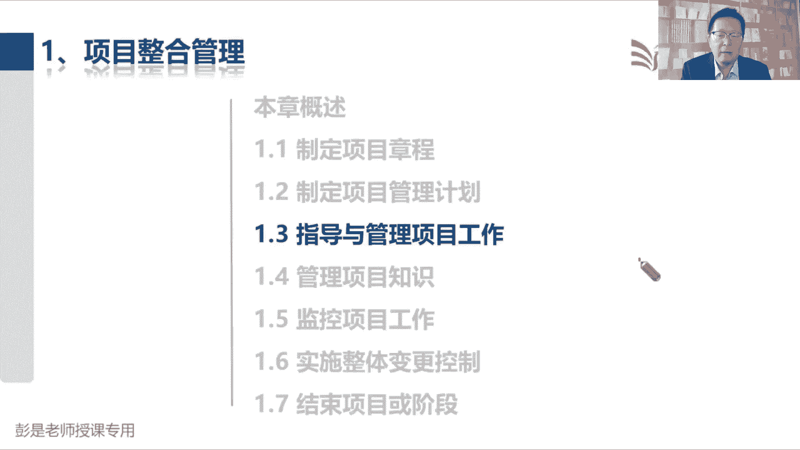

但接下来指导与管理项目工作，按照计划去干活，得到成果，每天干了什么活，写原始的工作绩效数据，哎，所以有了第一个输出和第二个输出是要掌握的，然后呢说计划一旦有变有变动，这个变动一旦得到了批准。

及时的通知执行，所以有了这个输出输入批准的变更请求，这个输入输出搞定，再看上面这段文文字描述，搞定是指为实现目标而执行，计划中所确定的工作，按照计划去干活，得到得到成果，干了什么活。

基于原始的工作绩效数据，还要实施以批准的变更，所以呢批准的变更请求，作为这个管理过程的输入，中间的工具技术，拿眼睛一扫没东西，专家判断项目管理信息系统开会哎，没什么需要记的工具啊。

具体的小细节后面再说了，然后呢现在再读一读，他还有一大堆的各种各样的输入输出，根本就不用记，为什么呢，按照计划去干活，所以其实理论上来说，所有的计划，所有的文件都可以作为输入，所有的计划。

所有的文件都可以作为输入，里程碑是什么呢，Miles stone，什么东西啊，里程碑是啥，大节点来不是阶段关口，关键节点，上课下课，这是不是里程碑啊，对不对，上学下学，这是里程碑吧，小学毕业，大学毕业。

这也是里程碑吧，哎就是这个关键节点，关键节点，好那下雪也是里程碑啊对吧，下课这都是里程碑啊，你认为什么是你工作中的里程碑，它就可以是个里程碑，很广义的东西啊，讲完了1。2，这也是个里程碑，开始讲1。3。

这也是个里程碑，你认为什么东西它就是什么东西，他就是一个就是一个理状态，就是个状态，九点钟起床，里程碑09：30吃完早餐，里程碑9。20开始吃早餐，里程碑，好再往下了啊，那这个管理过程看看重要的输入。

就是批准的变更请求，输出呢可交付成果后和工作绩效数据诶，这个玩意儿能猜吗，问题日志里面写什么呀，这纯粹字面意思啊，问题是里面记问题，那什么是问题，什么是问题，不符合计划的吧，哎就这东西错误啊。

缺陷哪都是问题，对不对，范围管理，现在没讲完呢，这是不是问题呢，这是问题吗，是对不对，这是问题吗，是非常广义啊，所以它里面到底写什么东西呢，不重要，重要的是什么呢，发现啥记录啥，发现啥记录啥诶。

好记性不如烂笔头，发现问题，记录问题，那接下来再思考，发现问题，记录问题，我们在制定项目章程的过程中，有没有可能发现问题呢，我们在制定项目管理计划的过程中，有没有可能发现问题呢，很可能吧对吧。

人生十有八九不如意啊，怎么可能顺风顺水有，那为什么前面没有把它列为输出呢，再思考，为什么不把它列为输出呢，像这种输出啊，如果全都列出来，全都列出来太多了，没必要，那为什么把它作为1。3的1。3的输出呢。

在强调什么，通常大多数问题出现在执行，通常大多数问题出现在执行，不代表着说启动规划的时候就没有问题，对不对，好知道这个意思啊，所以最后结论是理论上来说，问题日志可以是49个管理过程的输出。

因为做什么事都可能出现问题，出了问题好记性不如烂笔头，做正式的记录，所以最后结论也不会考，问题日志是哪个管理过程的输出，不会考的那一会儿看看文字，大概知道问题日志里面写什么东西。

这是谁在什么时间发现了什么问题，这个问题严重不严重啊，优先级高不高啊，导致问题的原因是什么呢，都能怎么解决这个问题呢，谁去解决这个问题呢，问题解决了没有呢，把一个问题，从从从生到死中间经历的所有的节点。

所有的步骤都给它记下来，这就是问题日志最重要的作用嗯，便于我们跟踪这些问题的解决情况，便于我们总结经验教训好，所以这个管理过程在最后结论啊，一个输入两个输出问题日志，大概知道这东西是啥就够了。

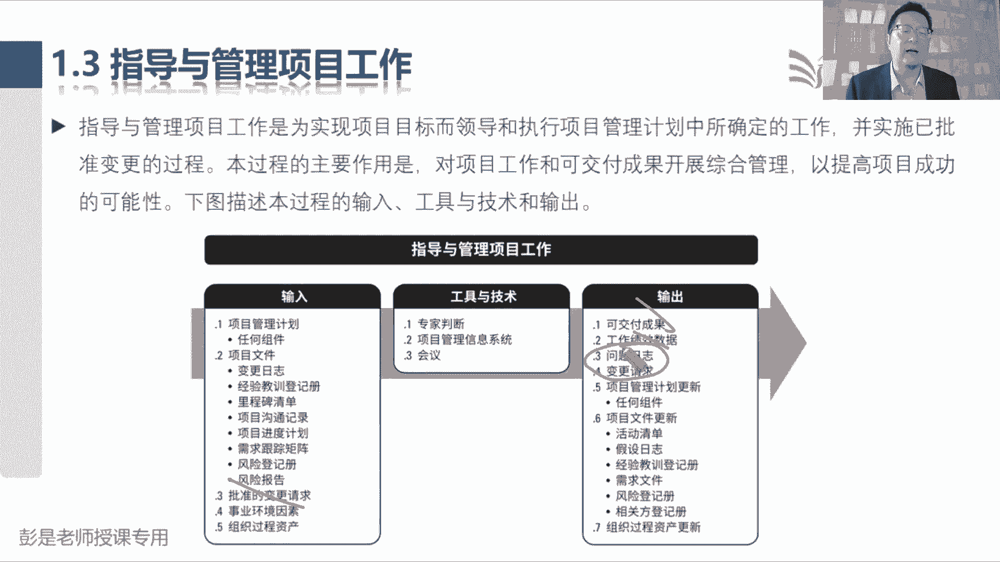

那再往下了说指导与管理项目工作，巴拉巴拉，这段文字不念了，看看就可以了，讲的太多变了，按照计划去干活。

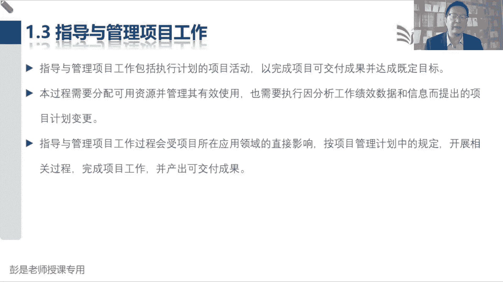

得到成果，然后说，中间这一段可以不不念，可以不看的啊，后面还会反复讲，然后说呀，在执行过程中，我们收集工作绩效数据，就是指现在这个管理过程的输出，这个技巧，数据传球传给谁呢，交给合适的控制过程。

交给九个大神做进一步的分析，分别变成每个知识领域的工作绩效信息，然后呢绩效信息全都交给项目经理，作为监控项目工作的输出和输入，绩效信息作为监控项目工作的收入，项目经理把它变成整个项目的工作绩效报告。

这是刚才49个过程，在梳理这三个术语的那个逻辑关系，把它听明白OK了好。

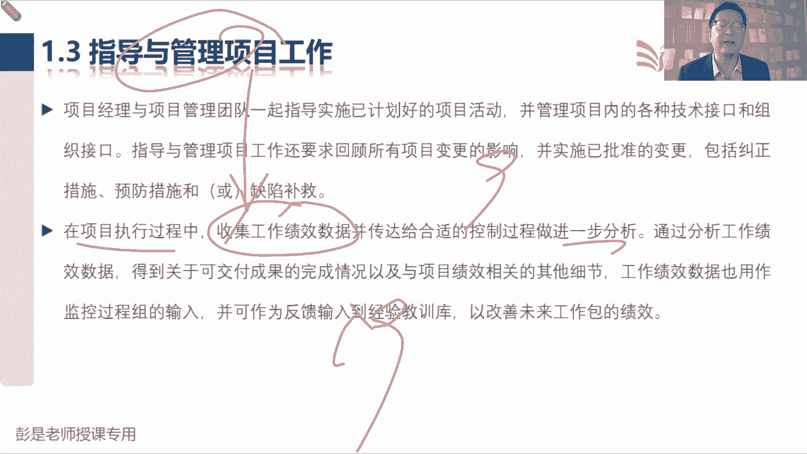

所以这个管理过程的输入没有新的知识点，有些东西呢后面大家复习的时候啊，比如说什么需求跟踪矩阵呢，什么风险登记册，风险报告啊，老师啊，这些东西还没讲到呢，没讲到的内容，复习的时候就可以先不看。

先挑咱见过的东西看，然后第二遍第三遍，随着不断的讲后面知识领域，再翻过头来复盘就够了。

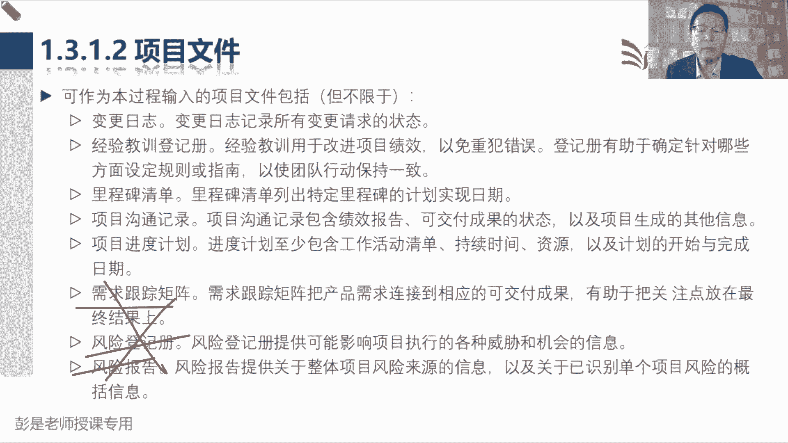

那1313就在强调，批准的变更请求是实施整体变更，控制这个管理过程的输出，把它作为现在这个管理过程的收入，就得强调沟通执行的重要性。

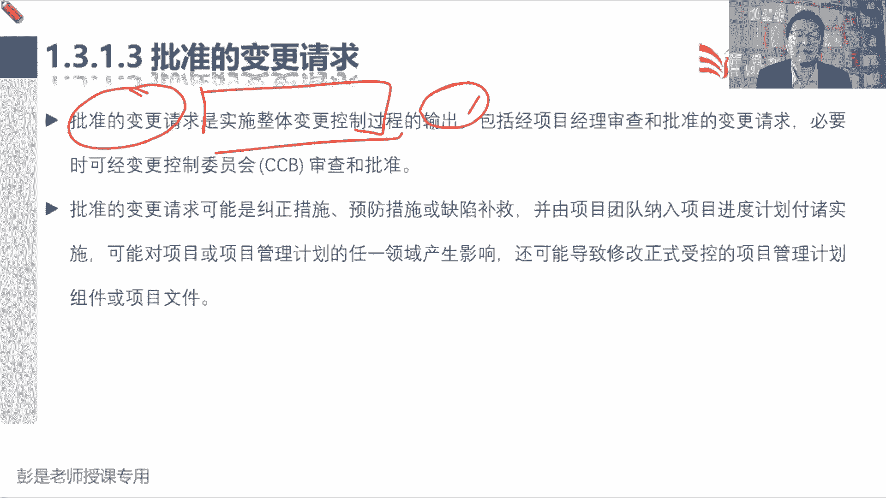

好事业环境因素，组织过程资产没有东西。

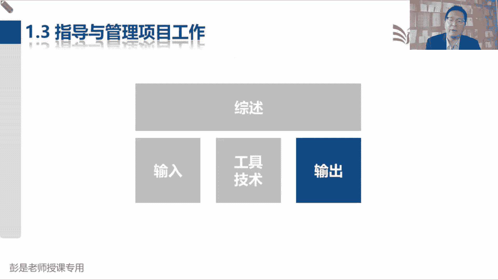

那输出1321，可交付成果，可交付成果，前面也说过，非常广义，我们项目中的计划，画的图纸，装修好的，装修好的房子，打扫好的房间，都可以认为是劳动成果，所以它非常广义是说，我们为这些过程阶段或项目完成时。

产出的独特的可核实的产品服务和成果，它它它是通常是项目结果，并包括计划的组成部分，只要是劳动成果，都可以认为它是可交付成果啊，最后这一段和刚才我们编制计划，那个原则是一样的，编制计划的过程中。

想改随时改，计划制定完成，一旦经过审批变成了基准，要想改走流程不能随便改了，那我们在制定制造可交付成果，生产可交付成果的过程中，也是这个逻辑，一旦完成了可交付成果的第一个版本，就应该执行变更控制。

就不能随便改了吧，然后这些版本怎么管理呢，所以就配置管理，来支持对成果的多个版本的控制，这是刚才给大家说的场景，我再写一个文件，写第一版存档，然后老板让我修改，咱走完变更流程，我再改再写第二版。

写完了之后存档还以此类推，把每个版本都给它存档，便于跟踪，便于追溯啊。

就这个这两句话哈，好再往下后又开始说了，工作绩效数据，工作绩效数据，工作绩效信息，这都不念了，看看就可以了，工作绩效数据里面都包括什么东西呢，这其实这个主机不重，没关系，只要记住员工部门，老板绩效数据。

绩效信息，绩效报告，对不对，指导与管理项目工作得数据，九个大臣得到信息输出信息。

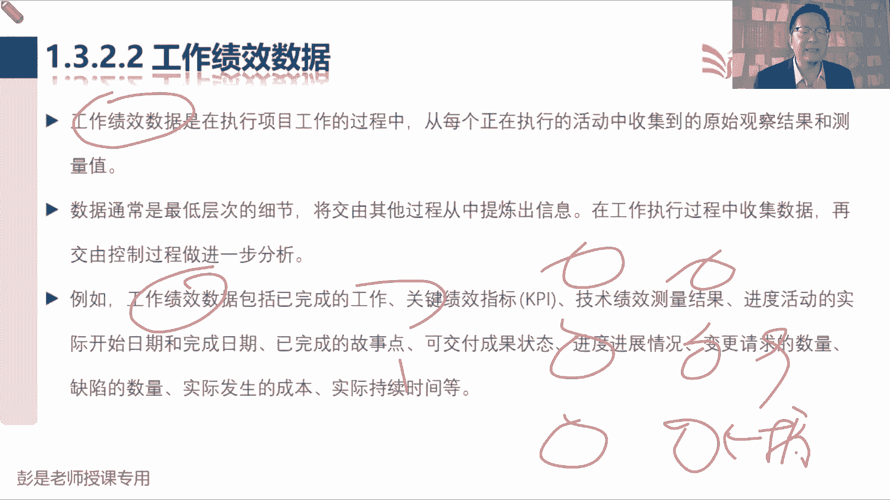

项目经理出报告，记住这个逻辑关系，OK了，好1323，问题日志说，问题日志在整个项目生命周期中，随时可能会遇到问题，他问题日志包括这一大堆东西，这一大堆东西有什么呢，不重要，问题从提出，从提出到解决。

把中间经历过的事情都给他记下来，谁在什么时间发现一个什么问题，这个问题会影响到我们的哪些东西，这个问题重要不重要，优先级高不高，这个问题哎，都什么原因导致的这个问题谁谁来解决，可都有哪些解决方案。

哪个解决方案最好，谁在什么时间去执行这个解决方案，执行了没有，解决了没有，把他从生到死所经历的这一系列的步骤，都给他记下来，知道意思就可以啊，最后这句话对大家讲，强调刚才说的那个小逻辑，说。

作为本过程的输出问题日志被首次创建，尽管在项目期间任何时候都可能发生问题，所以理论上来说，49个管理过程都有可能输出问题日志。

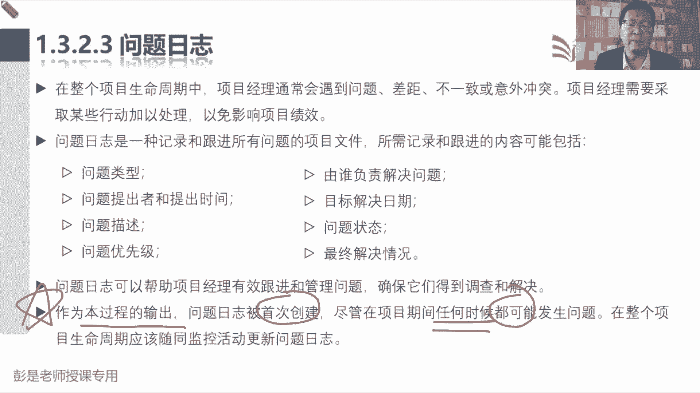

那么就不需要具备了，那变更请求1324，变更请求是关于修改任何文件，可交付成果或基准的正式提议，这是变更变更，要想改东西啊，不能随便改，需要提出一个正式的请求，就像大家工作中请假呀，报销啊，付款啊。

签合同啊，都要提申请啊，不能随便来啊，那变更也是这个逻辑，就知道这个意思就可以了，所以在开展工作时，发现什么什么就可以提变更请求，对这些东西进行修改，然后呢变更请求全都交给项目经理。

开展实施整体变更控制，这是没得商量啊，所有的变更请求都要交给项目经理。

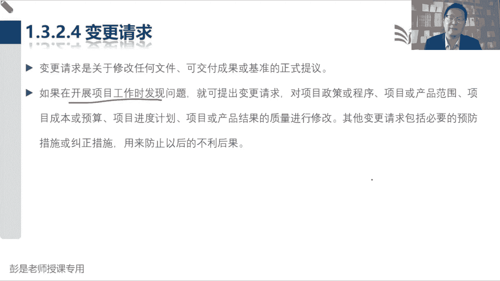

所以再往下非常重要的第一个小原则出来了，任何相关方都可以提出变更请求，所有人都有权利提出变更，比如说我想新加需求，我想改范围，我想拖进改进度，改成本，改质量，以此类推，所有人都可以有权利提出变更。

但是呢变更批准不批准是另外一回事儿，第二个重要的中心，所有的变更请求，不管是改啥的，全都交给项目经理，所有的变更请求，都作为实施整体变更控制的输入，由项目经理带着兄弟们对变更完成管理工作。

包括记录综合分析，综合评估走流程进行审批，拿到结果一会儿会说好，再往下变更请求可能会包括四种常见形式，看看这一段有什么区别，纠正措施，预防措施，他俩有什么区别呀，纠正，就前后哈没那么复杂吧，事前事后诶。

问题发生没发生，就这道理吧，所以他用了这样一个词，为使项目工作绩效重新和计划保持一致，这就叫纠正措施，这就叫纠正措施吧，哎所以用了重新这个词就说明什么呢，已经不一致了，比如说进度落后啊，成本超支啊。

这就这就这叫纠正措施啊，那预防措施呢就是这是事前做预防吧，防止未来出现问题，所以叫为确保未来的绩效符合计划，防止未来出问题进行的就叫预预防措施，这两个分一分，然后第三个术语叫缺陷补救，它是有针对性的。

因为纠正措施预防措施啊，更侧重于只工作，缺陷补救呢，就是指的，我们那个阐明为了修正不一致的产品或产品，组件有目的的活动，就是大家比如说软件开发，你软件有bug，这就叫缺陷，对不对，一点这个按钮报错了诶。

或者是这个程序一打开提示错误，这不是产品有缺陷吗，项目研发了一款新手机，这手机呀，这手机开不了机啊，缺陷这手机屏幕碎了，缺陷缺陷，它是针对展示的是产品有缺陷进行了修正，家里装修这墙颜色刷错了。

缺陷不就哎，这东西最后一个更新更新是说，对正式受控的项目文件或计划进行的变更，来反映修改或增加的意见或内容，受控的又是什么意思呢，受控的项目计划后文件进行的变更，什么叫受控。

受控的意思是说这个玩意儿不能随便改，这个玩意儿不能随便改，它的变化需要受到控制，要审批的，对不对，哎就这意思啊，所以下各位同学，你想一想你的什么身份证啊，户口本啊，护照啊，这玩意儿能随便改吗。

不能这些东西的变化需要受到控制，对不对，然后再想想你的户口本后面还有一个一行表格，比如说我想改姓名，走流程，走完流程经过批准之后，你就要把这个各个各个各个时期的那个名字，那个版本记下来吧。

现在改成了彭斯，过两天改成了彭五，每个版本都记录下来哦，来反映增加或修改的意见，它的变化需要受到控制，需要这要对所有的变化做存档，那什么东西的变化不需要控制呢，比如大家工作中的一些什么日志什么。

比如说我个人的对吧，每天写日记，每天写日记，这玩意随便改，反正也没人没有人看哎，以此类推，所以呀项目中到底什么东西的变化需要受控呢，不确定具体情况具体分析，现在最确定的不能随便改的东西，能写出来什么呢。

基准，成果这玩意儿不能改吧，刚才刚见过哈，计划经过批准就变成了基准基准，不能随便改，走流程，可交付成果一旦完成了，可交付成果的第一个版本，要想改走流程，不能随便改，这是最确定的，好了解这个意思啊。

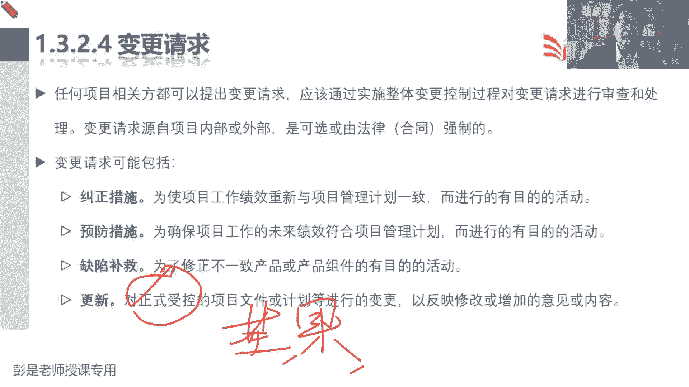

现在这种细节啊，这种细节后面一会讲到整体变更控制，就会讲到令同学，好计划更新没有什么东西了，然后什么文件更新。

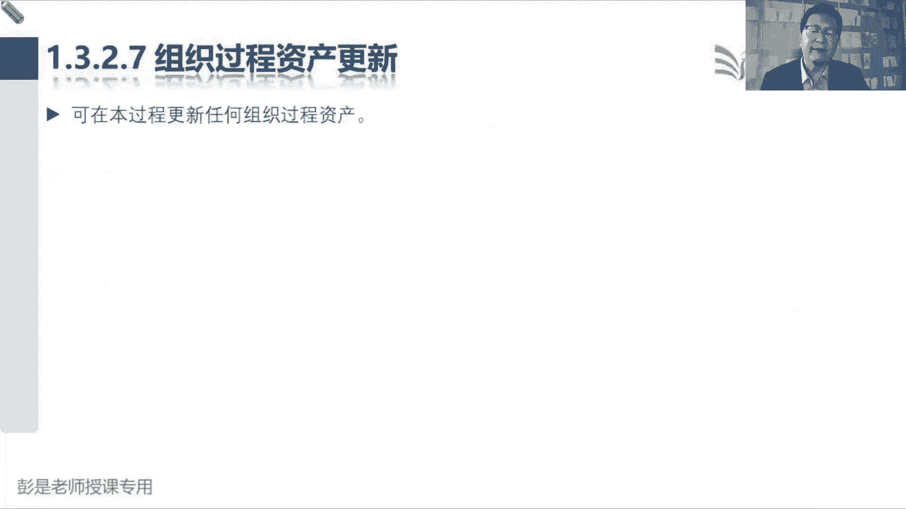