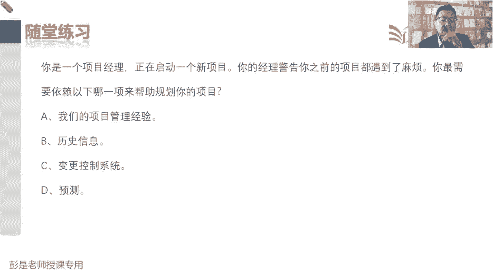

# 2024年最新版PMP考试第七版零基础一次通过项目管理认证 - P24：2.1.7 结束项目或阶段 - 慧翔天地 - BV1qC411E7Mw

那最后一个管理过程1。7是结束项目或阶段，这个管理过程标志性的收入，还有印象吗，叫验收的可交付成果，验收通过之后，我们就可以开始打扫战场了，那验收的可交付成果再留在手里也没用，所以呢要把它交出去啊。

它的输出就叫最终产品服务成果的移交，移交之后呢，咱再出一个阶段的报告，这个管理过程就下班了，所以标一标重要的收入啊，最重要的收入就叫验收的可交付成果，我们的可交付成果没有通过验收，就不能开始打扫战场。

它的输出就是最终产品服务成果的移交，像最终报告这种输出啊，根本就不用记，每个阶段结束的时候，都要对当前阶段的工作进行总结，整个项目结束的时候，要对整个项目做最终的总结，这东西，所以他不太需要刻意的去背。

不要不要刻意的去背的啊，然后他的工具基础啊，专家判断文件分析，文件分析干啥呢，就是分析这一大堆东西，总结经验教训，然后趋势分析，偏差分析，这都见过了，就多了一个新朋友叫回归分析，并且这个回归分析啊。

后面再说了，现在基本上也不考好，这回归分析讲工具技术，咱所有的工具啊最后还会统一讲一遍呢，大家看看咱的教材的目录就知道了，所有的工具最后还会统一讲一遍，所以现在给大家工具记住啊，现在基本上也不考这么细。

大概真有个第一印象就可以了，后面再说了好，那再往下说，在结束项目时，我们需要回顾项目管理计划，确保工作都已经完成，目标都已经实现对吧，就是该干的活都干了，需要达到的目标都达到了对，那接下来就是一大堆字。

这一大堆字啊，不需要大家去死记硬背，不要背啊，太多了，因为怎么打扫战场呢，要做的事很多很多很多，但我们要知道啊，核心的就这么几个东西，第一步永远是确认，第一步永远是确认我要打扫战场之前。

真真真是到了战战场上，打扫战场之前，你不得确认一下，现在我们是不是停火了，对方不会进攻了吧，是不是确认是不是满足了，我们打扫战场收尾的条件，那对项目上来说，什么是条件呢，就是钱货两清，该验收都验收了。

工作都已经完成了，不就这意思吗，对该干的活都干了，该验收的都验收通过了，唉这些文档资料啊都是最终版最新版本了，以此类推吧，确认满足收尾的条件之后呢，是非常重要的，三件事情叫总结，总结经验教训。

归档所有的这些计划文件，包括什么章程啊，合同啊，都要存档，对不对，要归档，最后呢就是已交这些文档资料，包括我们的可交付成果，谁爱要谁要移交给相关方，这是三板斧，总结归档和移交，剩下就是杂琐碎的小事。

什么调查满意度啊，释放资源啊，各回各家，各找各妈呀，然后什么庆功会呀，哎这些小事基本上听一听单词，不太不太容易误会啊，好大概这么几个事情，确认满不满足收尾的条件，然后总结归档移交，调查相关方的满意度。

然后呢该庆祝的地方还要庆祝对吧，给大家发奖金的表彰啊，最后呢就是释放资源，释放资源就是这些物料设备设施用品，包括人都给他，该还的还该扔的扔，就这东西啊，好记住，记住这七个字，七个字就可以了。

然后后面的文字啊都是通过这七个字，大概看一看，有一丢丢印象就可以，什么确保确认确保，这不都是确认是不是满足收尾的条件吗，所有的东西都是最终版本，所有的问题都得到了解决，这玩意已经通过了验收，所有的钱。

该记账的都记账了，然后呢关闭项目账户，封账对吧，不要再有收入和支出了，不然没头了，然后重新分配人员，这些都叫释放资源人员啊，材料啊，设施设备呀，该扔的扔，该还的还。

然后最后根据组织的政策编制详尽的最终报告，得给领导汇报一下阶段的阶段的情况，或者是整个项目的情况，这都不需要刻刻意的具备的啊，能看懂就够，然后未关闭项目合同协议，或者是阶段合同协议所必须开展的活动。

就是你和卖家，咱和卖家也要做这方面的工作吧，确认卖方的东西我们都对他正式验收通过了，确定双方没有争议了，没有争议了，没有纠纷，没有各种各样的诉求了，然后呢更新记录百年后的扣过存档，哎。

这听一听就是你咱现在是买东西的人，在项目上可能需要买电脑，买桌椅板凳，租共享单车，租汽车，这都叫采购啊，我们要确保我们和卖家之间钱货两清，没有什么纠纷，没有什么索赔，然后呢唉这事儿就完事儿了。

然后为完成下列工作所必须开展的活动，收集项目阶段记录，审计项目成本管理知识，总结经验教训哎，就是总结和归档，能总结出归纳出这两个主要工作就完事，最后项目或阶段行政收尾所必需的活动。

包括未达到阶段或完工退出标准，所必须开展的活动，这是退出标准里面怎么写的，什么情况下你们可以滚蛋了，那你需要满足这些条件，未关闭项目，合同协议或者是阶段合同协议，所必须开展的活动，就是协议里怎么写的诶。

该干的事必须干，再往下就是未完成下列阶段所必须开展的活动，像什么移交，经验教训满意度，把这些文档啊，资料啊归档，把我们的成果呀，这些东西该移交的移交，然后总结经验教训，衡量相关方的满意度。

所以全是刚才说过的那个那个圈啊，首先确认各种各样的条件，然后呢总结归档移交调查满意度，该庆祝的庆祝，最后呢释放资源，就牢牢记住大概这几个主要工作方向就可以了，好这有一个小细节需要记住的。

他说如果项目在完工前提前终止，项目半路夭折，那我们还需要把这个原因给领导交代一下，所以结束项目或阶段，还需要制定程序来调查和记录提前终止的原因，咱要善始善终啊，告诉领导，这项目为什么一做一半就黄了，诶。

体现在那个什么汇报报告里面就可以了，那这个管理过程中的输入章程啊，计划呀，这都不需要去背的啊，这是标志性的收入，1714验收的可交付成果，说验收的可交付成果，包括可批准的产品。

产品规规范交货收据和工作绩效文件，对于分阶段实施的项目或者是提前取消的项目，还可能会包括部分完成的中间的可交付成果，分阶段实施，很好理解啊，对不对，第一阶段做设计，设计的成果就是我们那个图纸。

这不就是中间的可交付成果吗，第二阶段做施工盖房子，我们的可交付成果就是盖好的房子，哎这些东西都叫都要验收啊，那提前取消的项目图纸画一半，人家说不干了，提前取消的项目。

我们仍然需要核实可交付成果的完成情况，然后呢再看核实完成之后，再开展结束项目或阶段，所以其实就是这种半路夭折的项目啊，我们内部做验收，内部核实一下可交付成果的完成情况，完成程度。

内部做验收就得到验收的可交付成果，然后呢开始结束项目，后期的收尾就可以了，这是一个两个小细节啊，所以最后刚才和刚才那句话一串，对于这种这种就这么写吧，对于这种夭折的项目。

我们仍然需要内部确认可交付成果的完成情况，得到一个验收的可交付成果，然后呢再开展结束项目或阶段，还要调查记录项目夭折的原因，然后写到我们最终的报告里，就这么一句话搞定这个场景，那商业文件没有新的知识点。

什么协议啊，没啥东西了，那再往下这个管理过程的输出，1721，我们所有的文件都要确认它是不是最终版，如果是最终版诶，满足了收尾的条件，然后该归档的归档，就这么一句话，听一听就可以，172。

最终产品服务成果的移交就是爱给谁给谁，谁要给谁，到底给谁，但不知道看情况，看情况可能移交给下一个阶段，可能移交给运营，可能移交给用户客户，但是不能留在手里，就这意思，1723最终报告。

最终报告的内容其实也不要求大家去背，为什么呢，全面总结搞定，我们要全面总结项目的范围进度，成本质量都快好，省成功标准吗，然后除此之外，除此之外呀，资源的使用情况不得总结一下吗，有没有资源的浪费啊。

员工能力得到了怎样的提升啊，这也总结一下吧，唉风险管的到位不到位呀，管他怎么怎么的，管的有效没有管有效有效没效啊，干干洗人满意不满意啊，沟通的效果好不好啊，还全面总结范围进度成本质量，资源沟通风险。

采购干洗人还知道这个意思啊，那全面总结，其实所有的报告都是这个结构总分总，先说一个整个项目的大概情况，然后再说我们这些细节范围，进度成本质量资源，最后呢再给一个总结对吧，通过本人的管理。

然后项目最后是不是满意，是不是开心，是不是成功，有没有什么小的瑕疵，然后下一次再改进，都是这个套路，这就是报告的主要的核心结构，好知道这个大概意思就够，它具体的文字不要求大家去记得啊，太多了，1724。

有一个小细节的知识点还是需要有印象的，就叫运营和支持文件，因为啊你盖盖好的房子不得告诉物业，未来这个上下水在哪天，天然气管道在哪儿，强电弱电都在哪儿，便于人家日后日后检查维修，就这意思。

所以我们要根据我们的创造的可交付成果，来提供相配套的这些什么维护，运营支持项目的什么各种文档对吧，使用手册，安装手册，维护手册，什么什么保养手册都给他写清楚，便于人家开展工作。

好最后说项目或阶段收费文件，这没什么东西，看一看就可以了，刚才这个知识点我们见过了啊，如果项目项目异常终止，我们要记录原因，然后替我交代，没啥需要背的好，这就是大概整合这一章七个管理过程。

以及他们的主要的输入输出，其实工具技术没有什么需要去记得了，还有一些重要的原则，那接下来各位同学，咱们花几分钟时间做做这章的课堂练习题，看看大家的学习成果怎么样，刚刚收到一个变更请求，这说明什么呢。

就找一个最靠谱的选项就完事儿了，简单哈，A选项说项目章程是完备的，不够工作还不能开始，因为你需要对范围基准做一个变更，不知道啊，变更可能改范围，进度成本质量资源诶，所以没有办法得出A这个结论。

B选项说你正处在指导和管理项目执行过程中，现在可以实现变更哎，就一句话没有办法推导出B这个结论，D说可交付成果中存在一个缺陷，必须补救，不确定啊，但确定的是什么呢，变更要有规矩，不能随地大小便。

好所以比较合适的就是C了啊，这是送分题啊，以下哪一个不是制定项目章程的输入，这题靠猜的，找一个你最有把握的选项，至少这三个过程的顺序要牢牢记住吧，制定项目章程，出章程，有了章程之后啊，咱们编制计划。

想办法完成章程里要求的这些东西啊，有了计划之后，按照计划去干活，就会得到我们的可交付成果，那制定项目章程输入不可能有项目管理计划，对不对，找一个最有把握的啊，虽然D大家看名字啊。

项目工作说明书不知道是什么东西，但是没见过，不代表这不存在对，根据我们掌握的知识，至少你应该能推理出来，制定项目章程的时候，哪来的项目计划呢，要等到规划过程中，制定项目管理计划才会输出项目管理计划。

哎所以答案是B那D是什么东西呢，D稍稍有一丢丢印象就可以了，到时候我们讲采购的时候再说，项目工作说明书啊，就是甲方要盖个要盖个牛肉面馆，就这么写了啊，甲方要对牛肉面馆做装修，那他装修有什么具体的要求呢。

唉这些具体的要求详细的要求，这叫工作说明书，所以通常这个东西作为什么呢，双方签的协议的附件，协议的附件，你写章程，写章程不需要参考协议吗，不需要参考合同吗，这肯定甲方找你给牛肉面馆做装修。

你要写你项目的项目章程，你不看和人家签的协议，里面有什么具体要求的吗，对吧，工期的要求，工期的要求，质量的要求，标的多快好省都在协议里，那附件是什么呢，就是关于装修的一些详细的。

具体的明确的这些小细节的各种各样的要求，这个东西通常作为协议的附件，大概有这个印象啊，好再看这道题，以下哪一个是指导与管理项目工作的输出，啊送分题啊，李倩同学过分了啊，这道题刚讲完，在前面那道题刚讲过。

制定项目章程出章程，制定项目管理计划，出计划，指导与管理项目工作，按照计划去干活，就会得到可交付成果，所以呢答案是C，选选选其他选项的同学，才需要回顾前面的课程了，是不是没听啊，是不是没复习啊。

其他选项肯定不对，A批准的变更请求是输入核实的可交付成果，这是哪儿的，控制质量的输出工作，绩效报告是监控项目工作的输出，那关于项目章程以下哪一项不正确，章程里面有什么东西呢，两个目目的和目标。

人家为什么要做这个项目，他们对这个项目的目标期望，具体具体要求是啥，都快好省吧，然后第二个是什么呢，两个标准成功的标准和退出的标准，没有验收标准，验收标准等到想范围，这张具体的可交付成果才会涉及到。

然后两个角色就是项目经理和发起人，你们俩都是谁，最后呢九个知识领域总体的要求，范围的，进度的，成本的，质量的，资源的，沟通的，风险的，采购的干系人的都可以往里写好，那哪个不正确呢。

A选项说项目章程定义了满足客户需要的要求，这是对的，C项目章程的建立，这是主语，谓语是什么呢，证明了商业论证的合理性，这句话是对的，都开始写章程了，说明什么呢，说明这个东西有可行性，有价值。

说明商业论证靠谱啊，对不对，好所以C这句话是对的，项目章程的建立证明了什么叫乐，什么叫乐，吃饭吃了吗，乐过去式，对不对，证明了这个玩意儿的合理性，纯粹的字面意思啊，项目章程包括里程碑进度。

这句话本身是对的，所以呢不正确的选项是，B章程里面没有验收标准，验收标准，等到下节课我们讲到范围，第一章他在范围说明书里，他在范围说明书不在项目章程章程里面，只有成功标准，退出标准，好看看这道题。

选什么呢，这道题选A的同学应该大概率就是想当然了，每道题啊，第一反应，每道题不是你怎么看，是你根据掌握的知识去判断，这道题在讲什么知识点呢，好你再问一个军方，军方分包管理一个项目。

要修改一个导弹制导软件计划，这个项目的时候，需要考虑公司运作环境的有关信息，以下哪一个不是你要查看的因素，公司运作环境的有关信息，这叫什么呢，这个知识点叫事业环境因素啊，那以下哪一个不是事业环境因素呢。

A市场条件它是事业环境因素，所以不是答案，政府标准是事业环境因素，所以不是答案，政治环境是事业环境因素，所以不是答案，对项目完成时的预测，包括剩余的工作估算和未来的成本绩效，这不趋势分析吗。

这玩意儿不叫事业环境因素吧，根据项目的实际情况，对项目做的趋势分析啊，所以呢答案是B，好知道这个知识点啊，每道题每道题一定是考知识点，不是考你想当然的东西，大家通常第一反应唉，军方分包还要看市场条件吧。

那就不看呗，就选A呗，这就是根据我们自己的经验进行的分析和判断，还记得顶空杯心态吗，井底之蛙呀，千万不要根据这种经验去分析啊，很容易有坑的好，那再往下看看这道题，以下哪一个不是项目管理计划的一部分。

生命周期阶段划分开发方法，然后呢九个知识领域，各个知识领域的管理计划，还有三个单独的管理计划，还有三个基准，还有一个绩效测量基准，好说以下哪一个不是项目管理计划的一部分呢，说为项目选择的生命周期，它是。

所以不是答案，各个过程的实现程度，B想说什么话呢，各个过程的实现程度就是这些计划呀，到底是详细的还是粗略的，这可以写进去吧，这跟咱没关系啊，咱要写的是项目上的具体要求，对对项目的人员招聘啊，人员配备啊。

人员人员的什么培训啊，奖励啊，惩罚呀，咱要写项目上的这些这些各种各样的指导，而不是企业的，所以C是这道题的答案，D和干系人沟通所用的技术，就是沟通计划的内容好，所以这道题答案是C。

组织的东西不是咱项目的啊，咱们工作中是参考组织的什么人员聘用，留用指导，这人事政策，参考组织过程，资产人事制度，人事政策，然后制定我项目上的人事制度，人事政策，这才说得通，这道题呢。

沟通技术是打电话还是发微信，这是沟通采用的技术，因为验收标准不在项目章程里，验收标准也不可能写在项目章程里，章程里面都是粗略的信息啊，啊可交付成果里边东西现在都有啥呢，项目章程里面只有主要成果呀。

我们要给人家装修个房子，那你像图纸啊，计划呀，还还有很多可交付成果的，所以他不在章程里，验收标准一定是写到范围说明书里面的，好这道题选啥，说你在管理一个图形设计项目。

你的团队成员报告称存在一个严重的问题，你意识到这会导致延迟，可能会影响干系人的生意，更糟糕的是，你要另外花两天时间才能够充分评估它的影响，在此之前无法全面了解处理这种情况，最佳的做法是什么。

A选项说创建一个变更请求文档，把它提交到变更控制会议，会议二还没评估完，开啥会呢，排除掉了吧，没评估完开啥会，所以排除掉B拿出项目章程向他们展示，你有权做决策，比这种神经病的选项排除掉，C与该协会面。

告诉他们存在一个问题，但是你还需要两天时间才能够提供，他们所需要的信息，贴合题意了吧，主打一个什么呢，诚实我现在还需要两天才能够完成评估，来控制干系人，主打一个诚实可以的，D更新经验教训。

把它增加到你的组织构成资产，现在连评估分析都没完成呢，怎么形成经验教训呢，所以D排除掉，最后这道题对应的考点就叫职业道德了，诚实诚实，诚实如实的反馈项目的实际情况，好再往下了啊。

这道题项目经理资格要求中最重要的是什么，不要郁闷，这种题做多了，慢慢的就有思路越来越清晰了，这是需要训练的，不可能一步到位啊，说老师要听一遍课看一，甚至连书都不看，就能把正确率提上去，这不科学好。

这道题是选什么呢，最重要最重要最重要那就是咱们项目经理啊，主要工作是整合，整合靠的是什么呢，组织协调，所以呢就是和他人有效合作的能力啊，别还记得那个领导力吗，别人都愿意跟着你一起往前冲吧。

虽然我可能没经验，也没有什么卓越的技巧，也没有相关的教育背景，但是别人就愿意跟你往前冲，为你提出我们的和为你贡献我们这些人的经验，教训，技巧诀窍，提出合理化的建议和见解就可以了，哎就这意思啊。

好好看看这事怎么管，公司的CFO说呀，加入一个新特性，说工期紧，如果承接项目会延迟，首先做什么事情，还有两个半月完全来得及啊，还有两个半月完全来得及啊，但是给大家留的作业一定要让想干啥就干啥呀。

跟上进度，跟上节奏啊，好回到这道题啊，公司CFO说加入一个新特性，然后呢说最后期限仅承接这个玩意儿，项目就会延迟，这句话就是吓唬人的，对不对，那A选项说更新项目计划，确保包含这个新特性。

直接对变更做了批准，这肯定不行啊，B选项说告诉CFO要等到下一个版本，然后向CCB提交一个变更请求，这是直接对变更做了推迟，排除掉推迟也是决策结果呀，C告诉CFO最后期限太紧，无法增加这个特性。

是对对变更直接做了否决不行，不能直接对变更做决策，但要综合的分析一下，所以呢先评估答案是D，四个选项里面相对来说最合适的选项就是D了，不代表着变更管理第一步就是评估影响，这是两回事儿吧。

因为不少同学刷题后遗症，刷题后遗症是什么呢，这是做完了这道题啊，那就掌握一个知识点变更啊，都首先第一步先评估，这就错了，品一品，每道题只是找一个相对来说最合适的选项，仅此而已，不代表着说所有的变更请求。

第一步第一步都是评估，对不对，第一步一定要先看看有没有变更请求，如果没有让他正式的提出一个变更，第二步收到变更请求，做正式的记录，第三步才是评估影响，这才是需要大家记住的东西啊，所以大家后面刷题的时候。

不要把题目的答案当做真理，每道题只是相对来说找出一个最合适的选项，仅此而已，这个答案不一定等于知识点，千万不要去这么去学啊，这个答案不等于知识点，这个答案不等于知识点，重要的事情说三遍，好，李倩同学。

你可以回顾刚讲完刚讲完，先看看有没有变更请求变成人话，就是公司CFO用嘴跟你一说，加个新功能来，您先来个正式书面的变更请求吧，就这意思吧，收到正式的书面的变更请求，我们在做正式的记录啊。

记到变更日志里啊，这段内容回顾刚才的课程啊，咱这一个知识点不能讲100遍了，好，先记住这个重要的结论，不要把题目的答案当做知识点啊，好再看这道题，说团队成员之一发现可交付成果中有一个缺陷，建议进行补救。

以下哪一个不正确，啊怎么这么多人选C的，小丸子再看一看，四个选项都看完了，B是对的，监控发现缺陷监控发起变更，B是对的，A选项也是对的，项目章程授权，你可以完成这个工作。

这里面实际上写的其实翻译的不到位啊，完成什么呢，对变更的管理工作，A本身是对的，B本身是对的，C本身是对的，缺陷补救也是变更，变更请求有纠正措施，预防措施，缺陷补救更新哎这种东西必须先得到批准。

C也是对的，哪一个不正确呢，D必须更新项目管理计划，记录这个缺陷缺陷进度到哪儿呢，缺陷记录在哪啊，项目计划里面九个子计划，三个计划，三个基准，一个技巧，测量基准里面没有地方缺陷唉。

所以缺陷即问题日志它是问题啊，DD这句话肯定不能这么说，项目计划里面没有问题日志，好没错，这个问题是这样啊，接下来看看这道题，踩多了踩多了，慢慢的就不踩了，对不对，所以每道题做错了挺好。

好事也乐观心态又能学到一个新的知识点，好这道题基本上大家问题不大吧，项目章程定稿前必须咨询项目经理，没这个道理啊，说我们那个底线，至少应该在规划之前任命项目经理，然后呢什么时候任命呢。

就是剩下就是原则任命的越早越好，但不代表着说制定项目章程，定稿之前必须咨询项目经理，没有这个原则啊，发起人签发，这是对的，项目经理得到的权利由章程授予，这是对的，章程里面给出一个简明的里程碑进入。

这是对的，因为九个知识领了一个总体的概括性的需求，都可以往里写，好看看这道题呢嗯，简单吧说有一个变更，然后巴拉巴拉这是在做什么呢，就是在开展实施整体变更控制，遵循变更，整本题目都在说变更吧。

正在审阅变更，并记录它带来的影响，然后在做什么，C我们整合这一章七个管理过程，有C吗，制定项目章程，制定项目管理计划，指导与管理，项目工作管理，项目知识监控，项目工作实施整体变更，控制结束。

项目阶段没有C没有C这个术语，优先选择我们见过的高大上的专业术语啊，对不对，正在开展的这个管理过程，就要实施整体变更控制，B肯定不能选D肯定不能选，变更控制包括记录吗，包括呀，刚才那段课程。

大家是走神了还是断片了，收到变更请求，第二步做正式的记录，这段课程大家还是建议再复听一下啊，好再往下了啊，你是一个软件项目的项目经理，发起人终止并取消项目的时候，你应该怎么做呢，不难。

现在的题都是简单的题，考试等于考试，怎么可能有这样的简单的题呢，没错，所有的变更都要做正式的记录，记录到项目的变更日志，这道题简单吧，项目异常终止就那么两个考点，对不对，第一我们不能不了不了了之。

我们自己要验收可交付成果，核实可交付成果的完成情况，得到这个验收的成果之后呢，我们结束项目或阶段，结束项目或阶段的时候，我们要调查异常终止的原因，记录到我们最终报告里面，最简单哈，所以呢答案就是C。

遵循项目的收尾流程，结束项目并更新经验，教学，这个你已经证实项目中所有工作都已经完成，下面哪一项不是收尾的一部分，考试不可能有这么简单的题啊，会加一些干扰因素，加一些烟雾弹。

把题目变得稍稍稍稍复杂一丢丢，收尾的时候回想刚才说的知识点先干啥呢，先确认是不是满足各种各样的条件，验收通过了吗，文档都该干的活都干完了吗，文档都是最新的了吗，嘿有没有钱货两清啊。

有没有什么双方还遗留的这些问题呀，争议啊，纠纷啊，满足条件之后，接下来总结归档移交怎么调查，满意度，庆功释放资源，找选项吧，C是收尾的一部分，所以不是答案，咨询项目收尾流程，它不是答案。

基础经验教训总结归档一交，它不是答案，所以最后的答案是B，为什么呢，因为监控项目工作用这个东西吗，哎这是工作绩效信息，这话不能这么说，所有的工作绩效信息，在监控过程组各个管理过程的，输出范围的绩效信息。

进度的绩效信息，成本的绩效信息，这些东西啊，都去监控过程组项目经理的一个管理过程，叫监控项目工作，项目经理拿这玩意儿写绩效报告的好，所以没有B这个东西，这道题，嗯嗯选什么，这么多人选A啊。

应该是做过预习了吧，好准备了啊，54321，这道题答案是什么呢，酒水，为啥的说呀，我发现本来有权使用的一个团队，已经重新分配到了另一个项目，那D选项说想办法压缩项目进度，等这个团队有时间时再使用。

这种选项，存在的主要问题就是好，违背了，我们要积极主动，解决项目中的各种问题的这个原则，我们要积极主动，不能被动，被动就会落后，落后就会挨打，所以通常像这种被动的选项对吧，人家把你座抢了。

你就在那等着等着等你下车了，我再做，太被动了，太怂了，太丢掉了，然后C选项说去找发起人，要回这个团队，直接找领导对吧，遇到问题告老师，遇到问题告老师，显得我们自己没本事，这种选项通常也不选B。

把你的章程的一个副本交给另一个经理，向他解释，你需要这个团队来完成你的项目，B选项其实是挺主动的，但是呢为什么选A呢，因为啊万一评估完了，万一评估完了发现没有影响，那就尴尬了，对不对。

万一评估完了发现没有影响，影响还分大和小呢，对不对，没有影响呢，然后有影响很小啊，影响中间啊影响很大呀，诶我们要根据这个事态的事情的影响，根据这个事情的紧急程度去分析，这个事应该采取什么措施，对不对。

这就叫三思而后行啊，所以呢B选项可能草率了，冲动了，现在来说四个里面最合适的就是A，现在来说四个里面最合适的就是A，如果没有A呢，可不可以选B呢，可以如果没有B可不可以选C呢，可以。

如果没有C可不可以选D呢，可以，因为没得选好，知道这个意思啊，嗯到底背什么，听课一定是听课，这现在没有办法给大家一个统一的结论，课上反复强调的，要记啥就记啥，贯穿始终，贯穿始终啊，这记啥就记啥就可以了。

好看看这道题，为什么这么多人选C啊，为什么不选B，选C的同学能说出个所以然吗，好客户带着一个变更请求来找你，需要增加插座，你认为会增加它相关成本，要做的第一件事情是什么，拒绝和做出变更。

肯定先pass pass掉B选项说参考管理计划，查看是否处理这个变更，C呢查阅合同，查看是否有相关条款，哎没错，这道题，这道题答案是C，为什么呢，合同有啥有法律效力，对不对，合同有法律效力啊。

看看合同里面关于变更，变更的具体条款是怎么写的，我们根据合同，根据有法律效力，法律约束力的合同条款去看看这事应该怎么干，看完合同再参考你项目的管理计划，这个意思啊，好所以是先看合同，为什么呢。

看合同条款，避免我们自己违约，避免咱自己违约啊，各位同学，如果你想离职，你想离职是看是看你公司的公司的，离职的什么计划，离职的流程，还是先看你和公司签的劳动合同，就这个道理，对不对。

公司规定离职需要提前，随便粗暴说了啊，离职需要提前30天通知公司，劳动合同里面你这么签的，提前五天通知公司就可以了，你先看哪个呢，先看合同啊，这玩意有法律效力啊，对不对，以此类推吧，以合同为依据。

看完合同再看，再看计划，就这道理，所以先C后B，好这道题，这道题简单，没错优先永远找一个相对来说最合适的选项，最有把握的选项，那这道题哪一个选项最有把握呢，它背后的知识点又是什么呢。

是道德的扭曲还是人性的沦丧，是人性的扭曲还是道德的沦丧，想思考思考好这道题，恭喜大家答对了啊，说呀之前的项目都遇到了麻烦，最需要依赖以下哪一个，来帮助你规划你的项目呢，A说我们的项目管理经验。

B说历史信息，C说C和D肯定排除掉了吧，啊为什么大家都选B呢，为什么不选A啊，好像A也有道理啊，为啥不选啊，管理经验不也是历史，以史为鉴呢，我们的管理经验也符合体检的，诶那为什么不优先选A。

为什么不优先选A，这样能说出这个道理啊，之前遇到麻烦经验不就是对之前吗，对不对，他俩的本质区别是啥呢，这个东西叫组织过程资产，这个东西是你个人的东西，选组织过程资产，意味着我们作为一个专业的项目经理。

指导在项目过程中及时的总结经验教训，更新到组织过程资产这个事情的重要性，听懂了吧，这是最高大上的解释了，嘿，个人的经验固然重要，但是我们作为专业的项目经理，我们意识到认识到对不对。

我们要及时的总结经验教训，记录到经验教训登记册，然后及时的通知通知公司更新到组织过程资产，全面做好这些知识的沉淀积累，总结归纳，这样更有利于公司的发展，这是说明我们这个格局打开，格局打开，所以优先选D。

如果没有B选项，能不能选A呢，可以选二，因为没得选了哈，这就是考试，考试一定要想背后的知识点，每道题肯定有知识点啊。

好，这就是关于大概整合这章这些重要的，重要的东西，这些来各位同学，咱可以休息一下了，你们可以放松了，现在是10。16，咱休息17。

在休息8分钟。