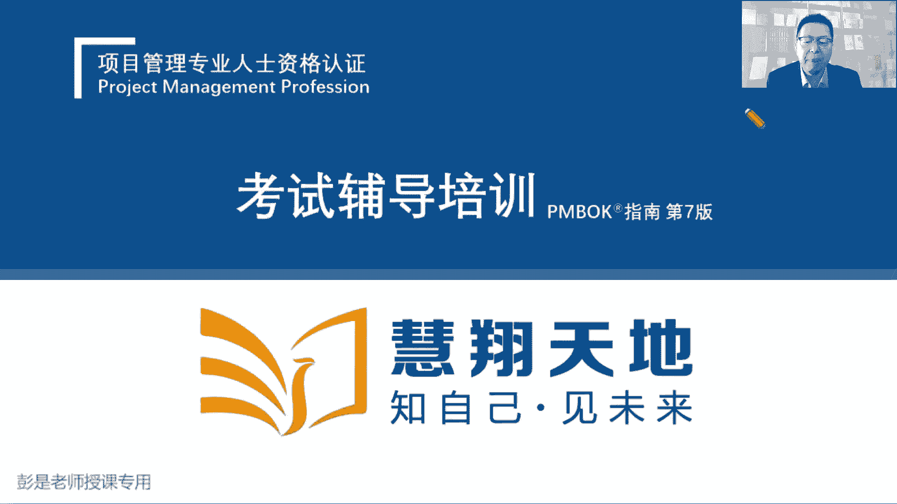
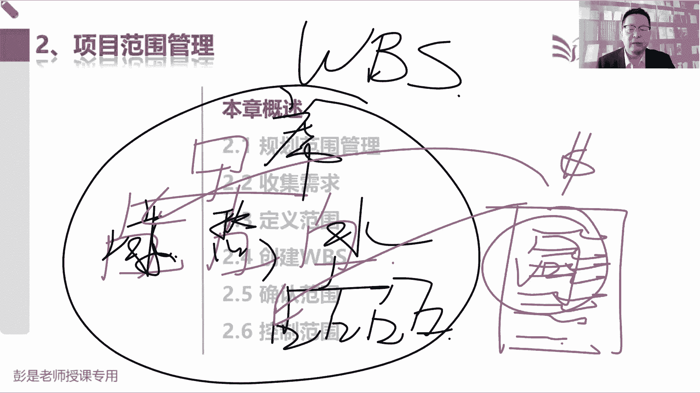
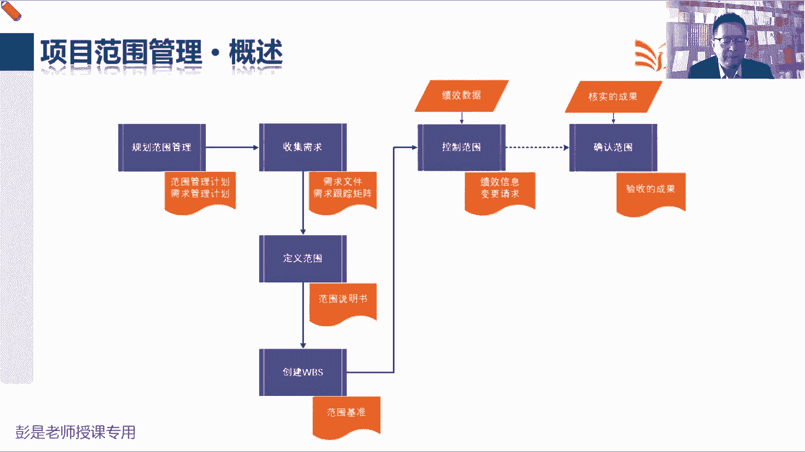
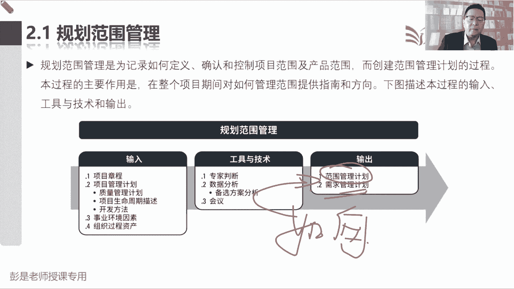
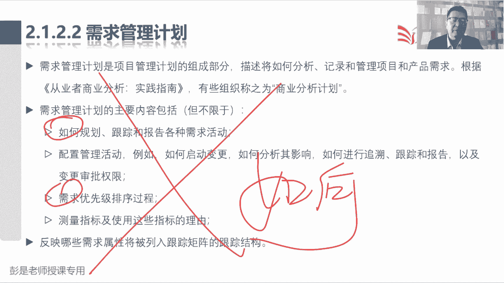

# 2024年最新版PMP考试第七版零基础一次通过项目管理认证 - P25：2.2.1 规划范围管理 - 慧翔天地 - BV1qC411E7Mw

还有十秒钟时间，十9876543210，不要焦虑，不要郁闷，不要不安，不要惶恐，不要伤心，不要难过，不要失望，哎政客呀，听一遍所有的题，基本上就能正确率很高，这个证书不建议你考了，对不对，没什么挑战。

没有什么含金量，所以正确率低很正常，不要担心，不要焦虑，不要惶恐啊，一定是在去听课，再去看书，不断的做题听课看书做题听课看书，循环巩固知识点，巩固知识点，这才说明这个证书有含金量了，听一遍课全都做对了。

哎这课这课也不用听了，这这这这这也不建议大家去考，太简单了，好，我们要勇于迎接这样的挑战啊。

那接下来咱们讲项目的范围管理，开始看九个大神怎么干活了啊，快速回顾一下项目经理怎么干活了，制定项目章程，出章程，根据我们的协议，根据我们的商业论证写项目章程，告诉我们工作方向，章程一定要得到发起的批准。

那批准了之后，咱就有了有了尚方宝剑，干活就合规合法了，接下来我们制定项目管理计划，带着我们大家看看范围进度，成本质量一大堆子计划，然后呢再得到三大基准，得到三个计划，这一整合变成绩效测量基准。

最后全都打包到一起，项目计划就做做好了，接下来按照计划去干活，就可以得到可交付成果，然后呢看看项目中学到了什么东西，记录经验教训，登记册监控项目工作干啥事呢，就是写报告汇报整个项目的工作情况。

实施整体变更控制，对所有的变更，我们要做综合的分析和评估，然后走流程做决策，最后呢一旦一旦一旦验收通过，我们就可以开始结束项目，或者是结束项目中的某一个阶段，就这么点活，很轻松。

那到了范围大臣怎么干活呢，范围大臣大，还记得前面讲过49个管理过程，共性的东西吗，先掐头去尾，我们先想一想范围到底怎么管，所以规划范围管理就是出范围的管理计划，然后尾巴是什么呢，就是绩效。

绩效和变更监控过程组只有两件事，一个是看看工作的情况叫绩效，一个是管理好变更，那控制范围就是看看范围的工作情况，看看有没有人画蛇添足啊，有没有人有没有人做范围之外的事情啊，对不对。

然后呢管理好范围这个知识领域的变更，就把变更请求交给项目经理，所以他的输出变更请求，作为实施整体变更控制的输入，那掐头去尾之后，剩下中间四个就是核心的管理过程，并且呢确认范围咱也听说过了。

确认范围就是对我们的可交付成果，进行正式的验收，它的输出就叫验收的可交付成果，得到这个验收的可交付成果，再来结束项目或阶段，把它变成最终产品服务成果的一交小号了，那最核心的剩下的就三个了。

并且这三个管理过程，第一个过程不太难理解吧，收集需求定义范围，创建WS收集需求就是看看人家需要啥，定义范围是干什么的，看看我们到底要做啥，人家想吃点面条，那咱就失去思考这个面怎么做。

然后做出来的面多少肉，多少面多少汤，以此类推啊，这是定义我们这个产品有什么功能，定义出来，我们要完成什么工作，定义清楚我们要产出什么样的可交付成果，项目设施项目是创造独特的产品。

服务或成果而开展的临时性工作，所以范围说明书就把这三个东西写清楚，产品有什么功能属性特点，服务不就是工作吗，外卖物流，这都是服务啊，上课也是服务啊，咨询也是服务啊，服务指的是完成一系列的工作呀。

诶工作就是我们的项目范围，最后呢就是把可交付成果都有什么东西说清楚，这就是范围说明书，大概这三块内容，再加上什么除外，责任的验收标准的这个管理过程就下班了，那创建WBS。

这就是这一章稍稍复杂一丢丢的知识点，创建WBS，做过预习的同学应该知道啊，什么是WBS啊，就是把我们的大工作变小工作，大成果变成小成果，便于管理和控制，便于分工粗暴理解，比如说要吃席。

要实习这个协议就是我们的主要成果，那接下来开始要分工了吧，这是什么凉菜啊，热菜呀，酒水饮料啊，谁来洗碗呢，谁来切菜呀，这不都得分工嘛，哎这就是工作分解结构，这样呢就便于我们管理和控制。

便于我们估算所需要的资源，时间和成本，可以降低事物的复杂程度，就这道理啊，采购也是工作呀，谁买菜，以此类推了，咱只是给大家举个例子啊，咱不要延展这个细节，不是真的，这说讲讲吃席都要做什么事，这不重要。

但是重要的是什么呢，要把超大的工作，通过分解的形式变成更小的工作，对不对，这样便于管理和控制法，张三你来负责吃席，流水席吃一周，这事儿太大了，不精准，对不对，张三负责凉菜，李四负责做热菜，王五负责熬汤。

赵六负责做主做主食，张三负责采购，李四负责洗碗，招流，负责刷锅，以此类推，这样更便于工作的安排，这就是工作分解结构最重要的作用，好先有个大概印象，接下来看教材内容，那第二章项目范围管理上来。

就看这个管理过这一章的主要的收入输出啊，先把我们有认知的东西，只要你有认知，只要有认知啊，就把它先去掉，先化繁为简，规划范围管理出范围的管理计划，这很好理解，以此类推广规划进度管理就出进度的管理计划。

规划成本管理就出成本的管理计划，这些管理计划就是告诉我们怎么定义范围，怎么创建WS怎么控制范围，怎么确认范围，他就告诉我们如何开展这些管理过程的，这种指导手册，好，以此类推了对吧。

比如说我想我想入职公司，肯定有入职管理计划，告诉我们的同事怎么管理入职这个事情，我想离职，那就有离职的管理计划，知道我们怎么离职了，以此类推，所以我们有九个知识领域的名字，加上对应的管理计划。

那范围这张很特殊，除了范围的管理计划，还要单独输出一个需求的管理计划，再用三个单独的计划，需求变更和配置需求管理计划，这是规划范围管理的输出，这东西为什么单独输出呢，因为这个东西需要专业知识。

到底怎么管需求诶，做不同的产品，不做不同的产品，有不同的管理方法，对不对，住宅小区软件，什么电脑，手机汽车，嘿，不同的产品，不同的产品怎么管需求啊，怎么收集需求啊，怎么排序啊，怎么分析需求的价值啊。

这需要专业知识，专业的事交给专业的人，所以现在的需求管理越来越倾向于叫工程化，专业化，他有套路，讲章法哎，所以需要单独给他出一个计划，这个需要单独记好，所以规划范围，管理范围管理计划是指导我们定义范围。

创建WS控制范围和确认范围的指导手册，需求管理计划呢，就是指导我们收集需求的指导手册搞定，那收集需求的输出，收集需求这个管理过程虽然看名字很好猜啊，他的输出呢其实也不太需要背，好记性，不如烂笔头啊。

发现需求记录需求，发现需求记录需求，收到需求记录需求，所以它的输出就叫需求文件，这个不难猜，那唯一稍稍复杂一丢丢的就叫需求跟踪矩阵，这个后面会解释好，那定义范围刚才解释过了，说定义范围。

定义范围我们到底查到底啊，产品有什么功能，我们需要完成什么工作，我们需要交付什么样的成果，这些东西都要写清楚，他写清楚，在这个地方就叫范围的说明书，说清楚我们的产品范围，项目范围，可交付成果。

验收标准除外，责任这些东西，那有了范围说明书之后，下一个管理过程叫创建WBS，就是把大范围和小范围，大范围和小范围，大范围变小范围，大工作变小工作，所以他的输出其实就是WBS，它的输出其实就是WB。

那WBS还要写一个资料，这个资料叫什么呢，我就随便说了啊，这是咱要吃席，这是，凉菜，热菜酒水饮料，这就是WBS酒水饮料，里面又包括什么啤酒啊，白酒啊，红酒啊，什么可乐啊，还这就是工作分解结构。

那接下来各位同学就要思考了，现在这张图这张层级结构图就是WBS，那只看这个WBS啊，只看这个WBS凉菜打算花多少钱，凉菜凉菜做几个凉菜大概多长时间，凉菜需要达到什么样的质量标准和要求，谁负责这个事情。

只看这张图，看不出来这些信息的，以此类推对吧，买买什么白酒啊，买多少瓶啊，买多少度啊，花多少钱呐，大概大概工期要求是多少，什么时间要把它买回来呀，哎这些信息看WB看WBS啊，上面是没有的。

所以呢需要有一个文档去把这些详细的要求，详细的啊需求给他写清楚，这就是WBS词典的作用，配套配套词典的作用是什么呢，解释汉语词典，解释汉语的英语词典，解释英文单词的啊，以此类推。

WBS词典就是来解释WBS的解释，清楚每个小方块的范围，进度成本质量，资源沟通风险，采购相关方方方面面的内容都可以往里写，所以创建WPS这个管理过程除了输出WBS。

还要输出他的好朋友WBS支点，用来解释每一个小方块，那接下来最后一个知识点是什么呢，就是范围基准里面都有什么东西呢，哎这三个东西范围说明书，WBS和WBS词典，这是范围基准，有这三个文件。

所以他的逻辑就是我们定义范围，写好了范围说明书，然后根据范围说明书，我们对工作对成果进行分解，就会得到这种层级结构，就称之为WBS，有了这个WPS这种层级结构啊，人家肯定会问时间进度，成本质量。

每个小方块的具体要求，所以呢咱们需要写一个配套的解释性的文档，就有了w vs词典，然后最后呢把这三个文件呢放到一起，找有权利的人关注相关方进行审批，一旦批准之后就得到了范围基准。

一旦批准之后就得到了范围基准，这就是创建WS管理过程对应的输出，再给大家学习一个学习的小建议啊，现在我讲到创建DBS，你们后边的知识点是不是在发散思维，这种发散思维有利于学习吗，思考，没讲到的时候。

你提出问题，提出问题影响你自己的思路，好，那再往下了啊，控制范围和确认范围没有必然的先后顺序，没有必然的先后顺序，没有必然的先后顺序，重要的事情说三遍，它没有逻辑，所以用了虚线好，所以根本就不重要。

到底先做啥后做啥，没有先后顺序啊，如果提出这个问题的同学，你要一定要先搞清楚控制范围的工作是啥，确认范围的主要工作内容是啥，了解了他的工作内容，就能判断出来他俩到底有没有先后顺序了。

那控制范围未来我们九个大神这个管理过程，在监控过程组这个管理过程，它的输入输出都是一样的，一模一样，监控过程组主要工作一个是管绩效，一个是管变更，所以它的输入啊都一样，我们拿到原始的工作绩效数据。

经过我们的分析和评估，变成范围，当前这个知识领域的工作绩效信息，另外呢管理好范围这个知识领域的变更，提出变更请求，所以控制范围，控制进度，控制成本，你看的多了，就会发现他的输入输出标准的三件套。

都是拿到原始的工作绩效数据，经过我们的分析和评估，变成相关的绩效信息，最后呢管理好当前知识领域的变更，提出变更请求交给项目经理哎，所以它的输入输出即一个知识领域就学完了，没有什么特殊的东西啊。

最后一个管理管理过程确认范围，确认范围它的主要工作是什么呢，对我们的可交付成果进行正式的验收，所以呢验收通过就会得到验收的可交付成果，就有了这个输出，那他的收入啊叫核实的成果，核实的成果是什么意思呢。

这里面就涉及到另外一个小逻辑了，现在我们知道了指导与管理项目工作，这个管理过程按照计划去干活，就会得到可交付成果，可交付成果呀，直接让客户和发起人通过确认范围，这个管理过程做正式的验收，行不行呢。

可以不可以呢，诶没错吧，可以对，但是不好，为什么不好呢，万一这个成果有缺陷，万一这个成果有缺陷，让客户验收的时候，人家发现你这东西这东西有缺陷啊，会导致什么呢，不满意对吧，你干个活就有缺陷。

干个活儿有缺陷会发现会发现，发现缺陷之后会导致满意度的下降，因为确认范围是客户，对我们的产品进行正式验收啊，会导致客户满意度在下降，所以为了规避这个风险，不建议产出的可交付成果直接去验收。

那为了稳妥起见，我们自己先检查一下，自己检查可交付成果他有没有毛病，有没有问题，有没有缺陷，这个管理过程就到了，质量这一章叫指控控制质量QC，所以非常重要的一个数据流。

这是指导与管理项目工作产出的可交付成果，作为控制质量这个管理过程的输入，那负责指控的同时干什么事的，就是检查测试，我们内部做指控，检查这个可交付成果的正确性，完整性，如果检查测试通过的东西。

检查测试通过的东西啊，打个标签就叫核实的可交付成果，它作为只控制质量这个管理过程的输出，有了核实的可交付成果，我们再让客户和发起人，对这个东西进行正式的验收，验收通过就会得到验收的可交付成果。

验收的成果在通过结束项目或阶段，这个管理过程，把它变成最终产品服务成果的移交，这就是大概这四个管理过程，他这个逻辑这一定要记住啊，非常非常重要的数据流，这是指导与管理项目工作产出的可交付成果。

传球传到了控制质量，作为控制质量的输入，我们团队对这个东西做检查，做测试，检查测试通过的就叫核实的可交付成果，核实的可交付成果在作为确认范围，这个管理过程的收入。

由客户和发起人对可交付成果进行正式的验收，验收通过了就会得到验收的可交付成果，有了验收的可交付成果，我们再把它作为结束项目或阶段，这个管理过程的输入，最后变成最终产品服务成果的移交。

所以对标到49个管理过程，那张图上，就脑补这个结构呗，指导与管理项目工作产出的可交付成果，作为控制质量的输入，然后呢得到核实的成果，核实的成果再交给确认范围进行正式并验收，就会得到验收的成果。

验收的成果交给结束项目或阶段，把它变成最终产品服务成果的移交哎，这就是未来未来非常非常重要的这个逻辑，这百分之百要记住，好那再回到这一段买东西了吧，他比较关键的一些输入啊，输出啊，基本上这张图差不多了。

徐州跟踪矩阵细节性的信息，一会看文字再给大家做做这个知识点的补充，好，知道了这个这一章大概的这个这个道理之后啊，就回答刚才同学那个问题吧，你说控制范围，看看有没有人画蛇添足，合作正式验收。

这俩事之间有没有必然的前后顺序的，没有啊，对不对，没有啊，根据项目的情况，你随时可能看看有没有人画蛇添足，张三上班的时候不要看手机，李四上班的时候不要玩游戏，王五上班的时候不要看抖音，看视频追剧。

嘿这都是防止有人画蛇添足，做范围之外的事情，他可能在贯穿项目史中，根据项目的情况，你来决定到底什么时候开展这个事情，那你说验收这个事什么时候开展呢，看情况啊，对不对，看情况，这个成果什么时候验收呢。

取决于你和客户怎么沟通的呀，阶段性验收啊，还是说我们成果出来就验收，以此类推拉各种可能性啊，嗯嗯好，那再往下看教材的话说，规划项目范围管理这一章概述，把这四个字标一标搞定，叫做铁井座，项目范围管理。

包括确保项目做前景，做所需的全部工作，就是不要画蛇添足，上班的时候该干啥干啥，不要做范围之外的事情，那不要做范围之外的事情，那是不是要提前把这个范围内范围外说清楚呢，所以主要在于定义和控制。

哪些工作应该包括在范围内，哪些不应该包括在范围内，这句话听完了之后就要反思啊，什么哪个管理过程定义清楚范围内，范围外呢就叫定义范围，哪个过程确保没有人画蛇添足，做范围之外的事情呢，就是控制范围。

这是最关键的两个步骤，好那再往下规划范围管理就是那两个字啊，以标搞定如何，所以他需要输出一个需求的管理计划，范围的管理计划，告诉我们后面这一堆管理过程怎么管，那收集需求，纯粹的字面意思。

根据我们的目标了解相关方的需要，了解相关方的需求，这是我们要吃席，看问问七大姑八大姨有什么想吃的热菜，想吃啥凉菜，想吃啥，喝什么酒，喝多少度的，这不都是收集需求吗，再问问厨师对吧。

吃席你做菜需要柴米油盐酱醋茶，锅碗瓢盆都需要什么东西，然后天气凉，天气热，要不要搭点棚子生点火，以此类这样总之全面了解相关方的需求，全面了解相关方的需求啊，再问问政府能不能吃席，能多少桌，能不能收红包。

对不对，能不能能不能烤串，要不要环保啊，天气热了，天气热了，天干物燥啊，以此类推，总之全面了解干洗的需要，那定义范围呢，只是说清楚我们这个产品有什么功能，说清楚我们要完成什么工作。

说清楚我们要交会什么样的成果，只要你记住了，记住了项目的那个定义，第一就是第二天第一天上课吧，项目是创造独特的产品服务或成果，而完而完成的临时性工作，那就把产品有啥功能需要完成啥工作。

都要交付什么成果描述清楚，另外呢怎么说清楚什么东西在里边，什么东西不在里边，对应的那个术语叫除外责任，咱把这个圈圈里的东西都给他约定清楚了，那为了避免扯皮，为了避免不必要的误解，什么东西不包括在范围内。

也可以解释清楚，这就叫除外责任，一会看书上有文字的啊啊，这是上班的时候该干啥干啥，不要看抖音，不要不要不要聊天，对不对，不要刷视频，把这些丑话先说在前面，那创建WPS，根据刚才那个印象。

就是把大工作变小工作，大成果变小成果，所以它叫将可交付成果和项目工作，分解为更小的，为什么分解成更小的呢，更好管，便于我们管理相关的资源，时间成本，便于完成精准的管控。

这就是创建WPS这个管理过程的主要作用，然后确认范围就是正式验收，控制范围呢一个是绩效，一个是变更，所以叫监督项目和产品范围的状态，状态就是绩效呗，管理范围基准的变更的过程，管变更，这是一样的啊。

好那再往下这一章核心概念这一段内容，但一定要区分出来在项目环境之中范围，这个术语有两个含义，第一个叫产品范围，指的是某项产品服务成果所具有的特征和功能，我们要研发一款手机，这个手机能打电话，这是功能吗。

这个手机能拍照，这是功能，这个手机这个手机还能干啥，还能装装A装IP装app装APP诶，这是功能，那特征是什么呢，就是这个手机的特点特点，这种东西啊通常是包装和设计出来的，对不对，这个手机待机时间超长。

这个手机防水，这个手机能能能砸核桃，这个手机特别结实耐造诶，这都是它的特点，那我们需要一会儿把它说清楚，这就叫产品范围，项目范围指的是什么呢，为交付具有特定功能和特性的产品服务成果，而必须完成的工作。

未交付这个产品需要完成的工作，什么叫工作呢，你买手机，我得给你装盒里对吧，给你把这个手手机手机那个包装什么封膜，装什么使用说明书，然后给你发快递，发快递，这不都是工作吗，还包括什么培训啊。

包括包括做什么初始化呀，包括帮你把旧手机数据导到新手机里，这都是为了交互这个东西需要开展的工作好，所以就像刚才吃席采购，这不是工作吗，对不对，刷碗洗菜切菜，这都是为交付这些成果需要开展的工作。

这就叫项目范围，所以后面这个文字就好理解了，项目范围是根据我们的计划来衡量的，看看是不是洗菜切菜，采购炒菜这些活儿都干了，产品范围是根据我们产品需求来衡量的，对我需要买个手机，超长待机。

希望买个手机能够防水诶，根据产品的需求来评价它，听一听就可以了，但是产品范围，项目范围的概念要记住啊，那再往下说，确认范围，就刚才说过的，确认范围是正式验收，我们已经完成的可交付成果的过程。

后边这两句话就在说刚才那个数据流，从控制质量过程输出的叫核实的，可交付成果是确认范围这个管理过程的输入，验收的可交付成果是确认范围过程的输出，有获得授权的相关方正式签字批准。

所以还是刚才那个数据流指导与管理项目工作，然后呢控制质量，然后确认范围，做正式的验收，最后结束项目或阶段，把它变成移交，好再往下发展趋势和心情实践，这段文字呢其实现在基本上听几遍就完事了。

听一遍就完事了啊，没什么需要去背的东西，总之中心思想是什么呢，这是刚才说的专业，专业专业就对这个单词有一丢丢印象就够了，说我们更注重和商业分析专业人士的合作，为什么呢，他们有这个专业知识告诉我们。

告诉我们在这个需求怎么管，怎么去做产品的规划和设计，对标到大家公司的公司里面的这些这些岗位，可能就叫产品经理，需求分析师，商业分析师这样的人，总之他们懂需求，懂产品，可以帮助我们更好的完成这个产品的规。

划和设计，知道这个意思啊就够了，既然人家有这个专业知识，咱就单独给他写一个需求的管理计划诶，单独写规划范围管理的输出好，后面这些文字全都不念了，这段文字再看一看，这是刚才那个道理。

我们应该把商业分析的角色联动职责，分配给，具有足够的商业分析技能和专业知识的人，专业的人，专业的事交给专业的人呢，那如果项目已经配备了商业分析师，那么和需求管理相关的东西就是这个人的职责。

项目经理主要是工作，确保按时完成好这两点就够了啊，那2。1规划范围管理，这个管理过程基本上大家复习的时候啊，一遍就过了，就牢牢记住这两个字，大家工作中你能想到的各种问题都参考，这两个指导计划。

怎么收集需求啊，什么时间收集需求啊，找谁收集需求啊，开几次会呀，这个需求文件怎么做记录啊，用什么格式，用什么用什么，用什么模板的需求文件记下来之后怎么存呢，存到交给谁呀，都在这些管理计划里面去了。

怎么定义范围呀，怎么写范围，说明书啊，说明书写什么内容啊，电子的还是纸质的呀，谁来审批呀，都在范围的管理计划了，嘿，所以这两个管理计划，就是指导后边这些管理过程到底怎么干活的。

指导计划它具体的内容没什么需要背的，知道意思就够了，也不会考这种东西哈。

那这个管理过程输入没有什么重要的东西，所以继续这个管理过程，基本上大家复习的时候一遍过章程啊，生命周期开发方法，因为这些东西决定了到底用什么方法，不同的方法，关于范围的管理和进度的管理是不一样的。

等咱讲到敏捷这段内容，你就知道传统的瀑布式的预测型的项目，就是收集需求，定义范围，创建WBS，那在敏捷环境之中不是这么玩了，它的游戏规则发生了变化，所以我们要根据生命周期阶段划分开发方法。

然后告诉我们如何管范围，如何管进度，好那2121范围管理计划，范围管理计划是项目管理计划的组成部分，描述将如何定义范围，制定范围，监督范围，控制范围和确认范围就是那几个管理过程嗯，那范围管理计划将对。

要对将用于下列工作的管理过程作出规定，有的同学读到这仍然很容易误会啊，规定如何制定范围，说明书，规定如何创建WB，规定如何审批和维护，范围基准规定如何正式验收，已完成的项目可交付成果。

都是这种关于工作怎么开展的指导计划，但不代表着说范围说明书，包括在项目范围管理计划里，这肯定不能这么说啊，对不对，不能说WBS包括在范围管理计划，他不对的，他都是告诉你怎么干这个事的。

我告诉你怎么做菜的，告诉你怎么做菜的，这就叫菜谱，但是这个菜包不包括在菜谱里面，不包括呀，它是两回事啊，好知道这个意思啊，它的内容不需要不需要去记啊，不用背，记不住没关系。

然后后面这句话呢也是一个通用的大道理，说，根据项目的需要，项目范围管理计划可以是正式的，可以是非正式的，可以是详细的，或者是粗略的概括的，总之看情况想怎么写就怎么写，结合项目的实际情况。

结合具体情况具体分析好，那需求管理计划，根据刚才掌握的这个原则啊，这两个字一标搞定，怎么管需求如何跟踪，怎么什么什么变更，怎么对需求做排序，什么什么测量指标啊，知道这意思够了。

