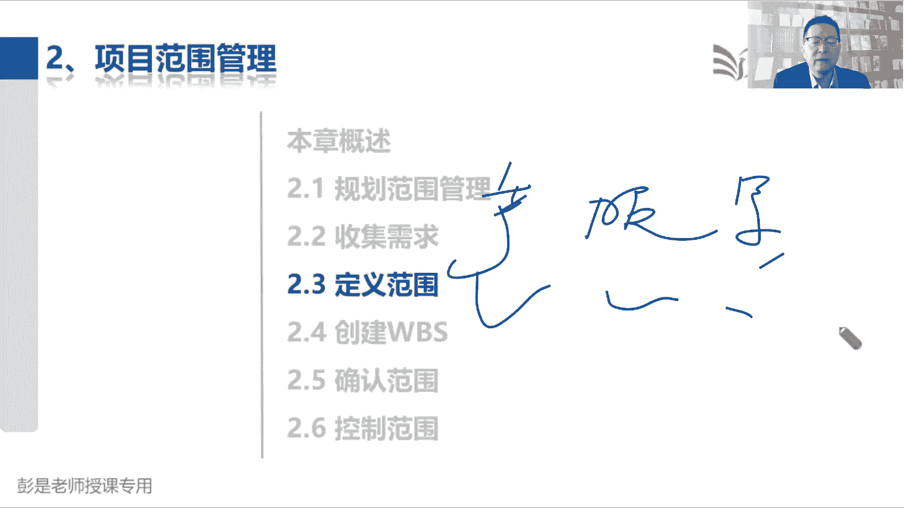
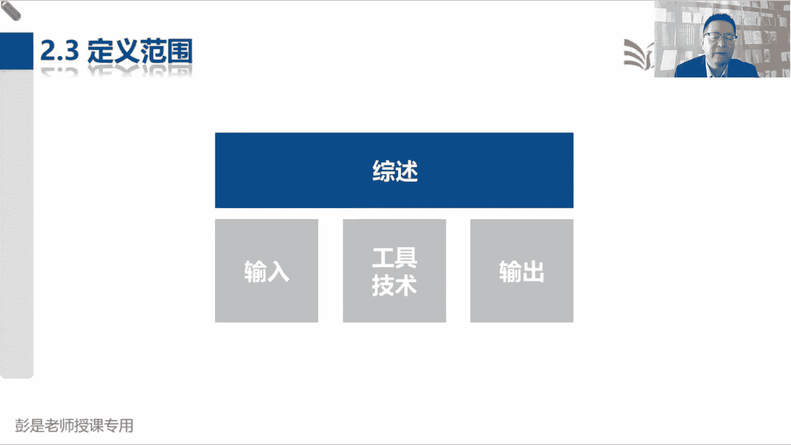
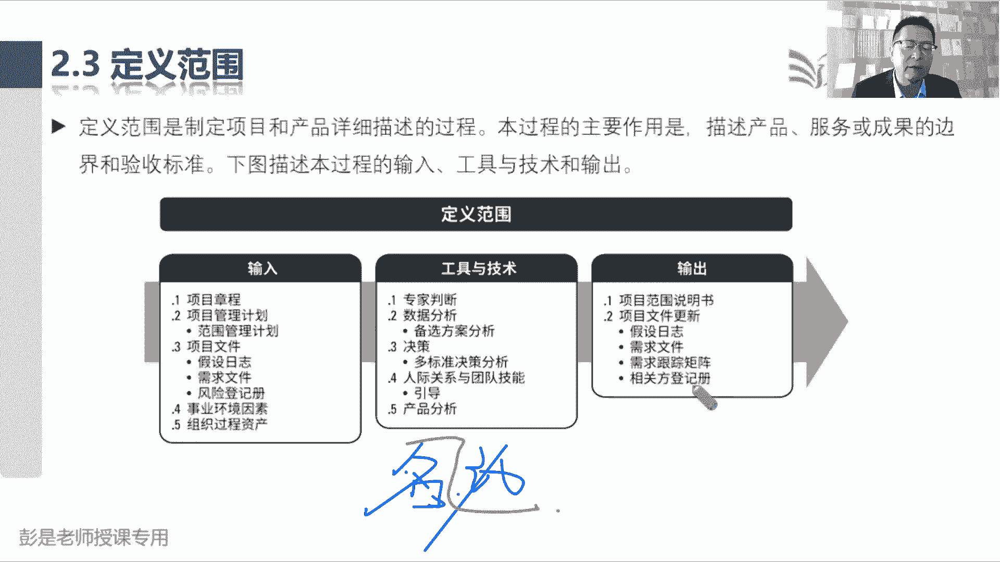
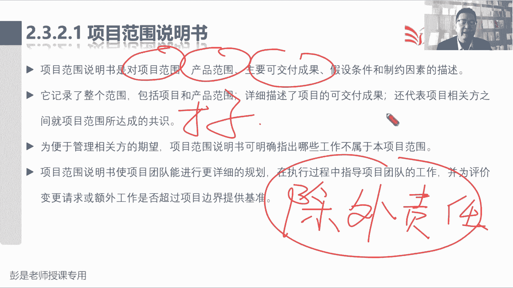
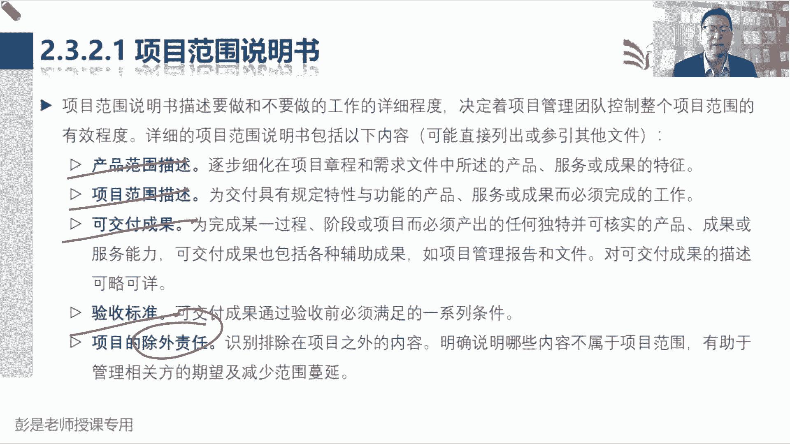

# 2024年最新版PMP考试第七版零基础一次通过项目管理认证 - P27：2.2.3 定义范围 - 慧翔天地 - BV1qC411E7Mw

然后2。3定义范围，定义范围，只要你知道第二遍了，第三遍了吧，只要你知道项目的定义，项目是创造独特的产品服务或成果，全记住了，那咱就把产品服务成果都说清楚，对不对，服务就是要不要给你培训的诶。

这也是未交付，刚刚说过吧，就去需求啊，你要不要培训啊，我教你怎么用啊，需要啊需要啊，哎那为交付产品需要开展的工作也要说清楚，要不要培训啊，谁来培训呢，多少钱呢，然后呢要交付什么成果。

包括各种各样的东西啊，软件也是成果，什么手册也是成果，计划也是成果，都要说清楚好。

那2。3定义范围，这个管理过程大家后面复习的时候超快的，只要搞清楚范围。

说明书有啥东西就下班了，它的工具技术其实不要求背了，那定义范围就是选需求，来分析我们到底要做什么东西，所以它的输入没什么需要去记的需求文件，对不对，这肯定有中间的工具呢，备选方案分析没什么记得啊。

多标准的分析，见过了引导，见过了就来了个新朋友，叫产品分析，产品分析学习工具啊，最大的技巧是什么呢，咱现在所有的工具啊，为了保持节，为了保持统一，都是名词在前，动词在后，这样的风格风格是统一的。

那为了大家，为了咱中国人方便记忆的个人建议啊，你都把它倒过来，咱的习惯是动词在前，名词在后，所以产品分析就是分析产品，分析我们这个产品有什么功能，有什么属性，有什么卖点，有什么特点，哎对吧。

我们家的牛肉面主打一个肉多，然后面面是良心面，然后肉呢，肉呢不是不是不是什么梅菜扣肉用的那种，什么叫黑心肉啊，什么淋巴结的肉啊，哎它有什么功能，有什么特点，就是分析做产品的设计。

好知道这个单词稍稍有一丢丢印象够了。

然后再往下说，由于在收集需求过程中，识别的所有需求不一定都包含在项目之中，因为我们还要做取舍呀，对不对，收集需求，吃席收集这到底吃什么菜，然后大家的需求千奇百怪，100多个菜不可能都做呀。

所以呢我们要做取舍，所以我们要从需求文件中选取最终的项目需求，然后呢，制定出关于我们产品服务成果的详细描述，产品就对标到产品范围，服务呢就对标到项目范围，成果就是可交付成果，好输入没东西了啊。

输出2321范围说明书最核心的五个内容，这三个玩意儿，项目范围是未交付产品需要做的工作，产品范围指的是产品有什么功能，主要可交付成果，就包括盖好的房子，开发好的软件，文档资料手册，都叫成果呀。

把这三个东西说清楚，然后呢，就是刚才大家答错的那道题，验收标准，产品的验收标准是啥对吧，工作的验收标准是啥，最后可交付成果的验收标准是啥，最好最理想的模式都把它写清楚，最后一个知识点说。

为了管理相关方的期望，我们可以在明确明确指出，哪些工作不属于本项目范围，这就对标的那个术语叫除写错字了啊，那个术语叫除外责任，这个玩意儿就和大家什么买飞机票，买火车票，买保险，人家都有除外责任的免责。

避免扯皮，对不对，就这意思吧对吧，买了飞机票，由于不可抗力，由于什么什么恶劣天气啊，导致我们航班延误啊，我们可能不赔啊，就以此类推了，延误了一个小时，两个小时不赔钱，延误什么八个小时。

十个小时我们再赔钱，说清楚，避免扯皮，所以这就叫除外责任，说清楚项目范围的边界范围内的东西，就包括了产品范围，项目范围，可交付成果，还有验收标准，然后划清界限。

出外做人，知道这个道理，在后面的这几个单词就搞定了，产品范围描述，项目范围描述，可交付成果，验收标准和避免扯皮的除外责任，嗯我们只负责给你们吃席做饭，像什么卫生啊，许可呀，这些申报啊，我不管呐。

这跟我没关系啊，着了火我不管救火呀，这一次的退哈，吃撑了，不管看病啊，得除外责任避免扯皮。

好，再往下了啊。