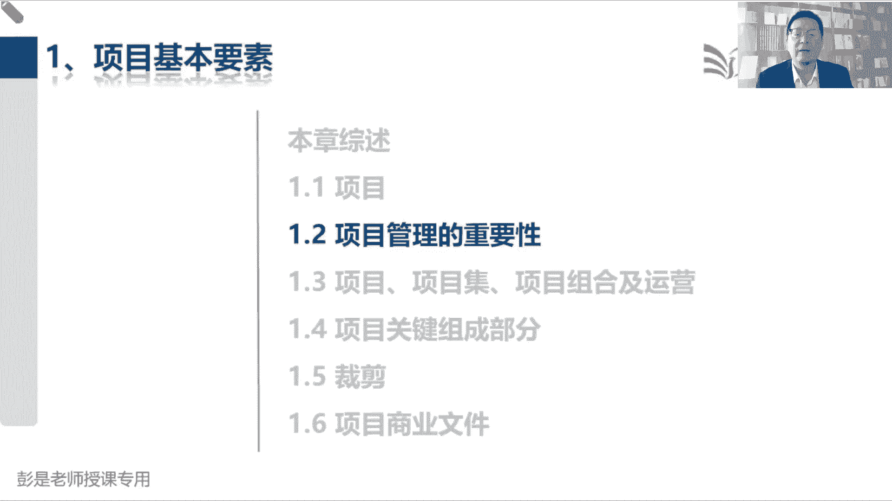
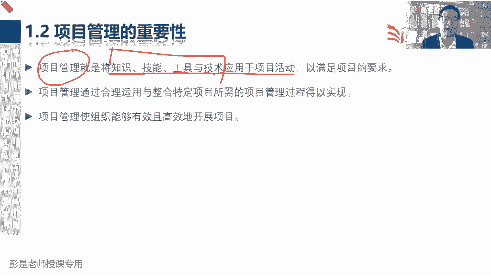
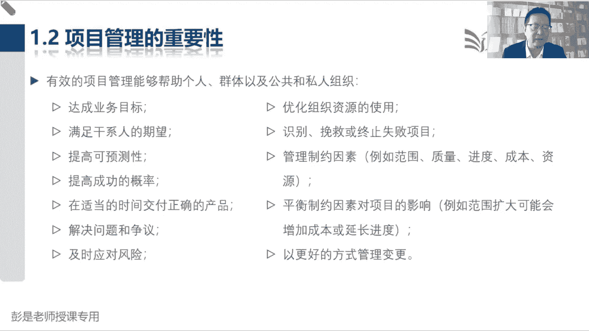
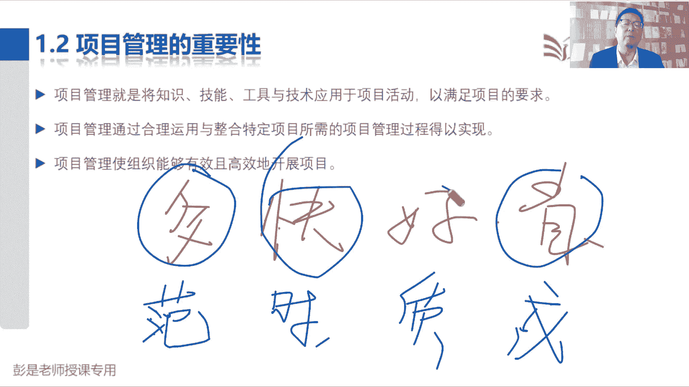
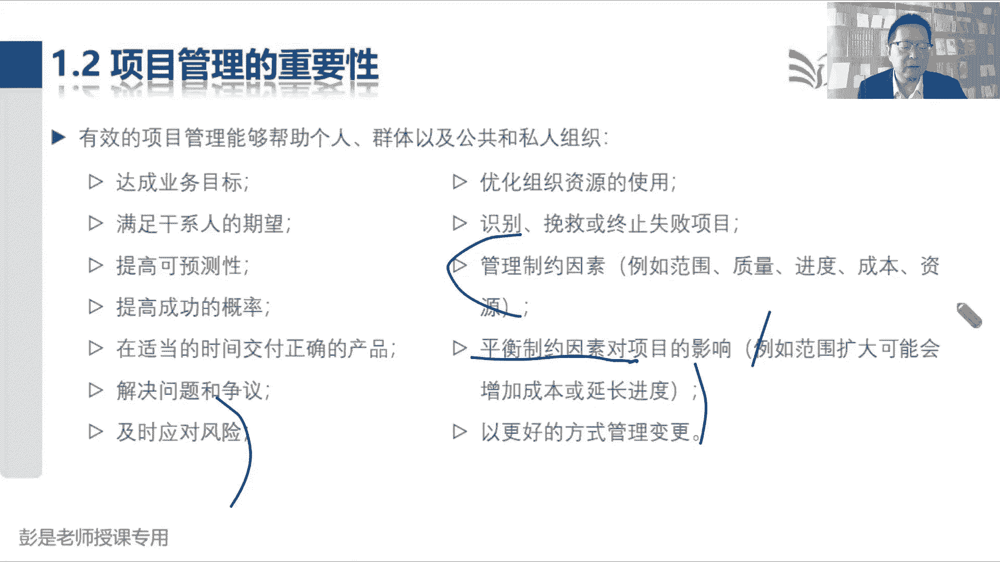
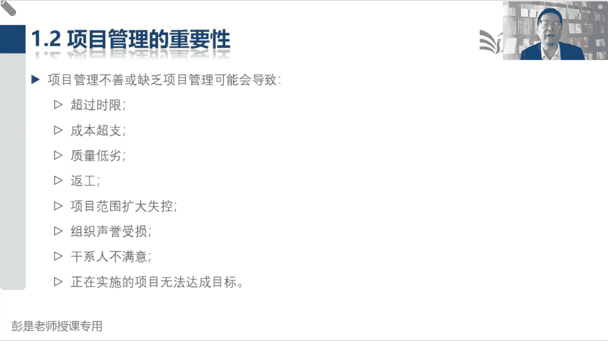
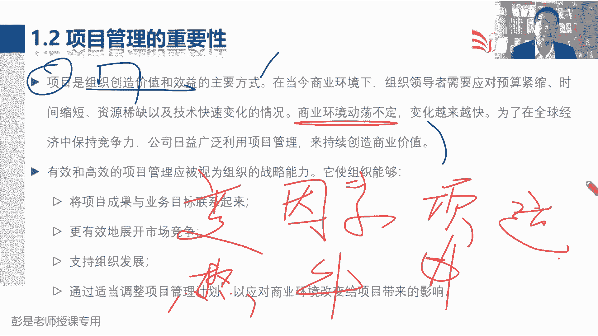
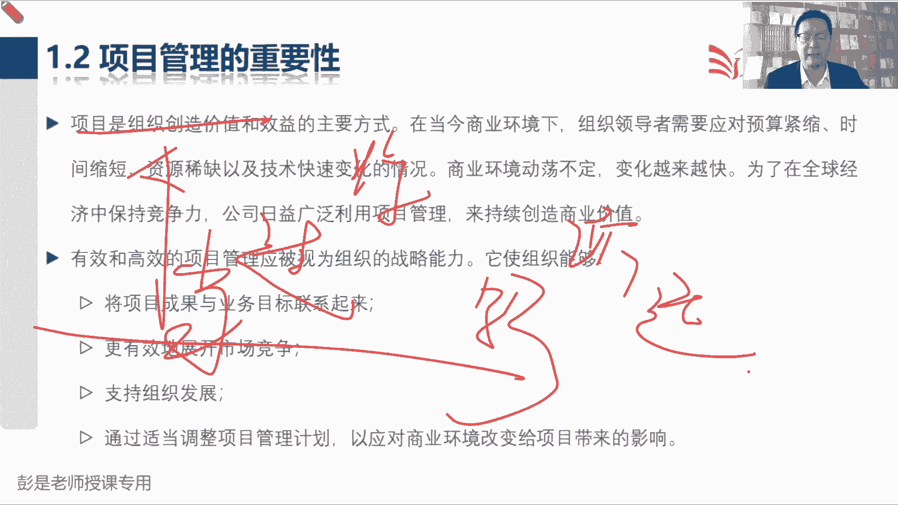
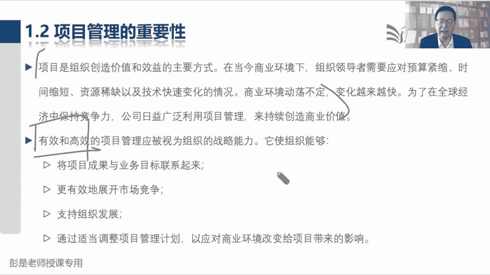
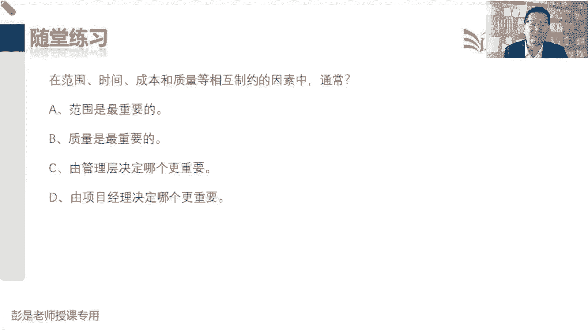

# 2024年最新版PMP考试第七版零基础一次通过项目管理认证 - P3：1.1.2 项目管理的重要性 - 慧翔天地 - BV1qC411E7Mw

那1。2项目管理的重要性。

这段文字呢大家基本上也是快速的听一听，他应该没什么东西啊，就是通过前面的洗脑，有没有发现培训家就是洗脑啊，通过前面的洗脑，我们就知道啊，对企业来说，我们每天开展的项目，就是我们可能开展的项目有大有小。

随时可能有新的项目会出现，那这些项目，这些项目我们要想办法提高它成功的可能性，从而尽量的尽量的不浪费钱，不浪费时间，不浪费精力，不浪费资源，那项目管理就是干这个事儿了，所以第一项目管理的概念。

它就是把我们知识技能，工具技术应用于项目活动来满足项目的需求，再听一遍就完事儿，变成大白话，就是把一身本领用到工作之中，完成任务，实现目标诶，这就叫项目管理。

那项目管理说有效的项目管理，能够帮助个人群体和公共和私人组织，达到一系列这这一大堆啊，不太需要背，不用背啊，不用背不用背不用背，各位同学看一遍就完事儿了，全都是好事啊，全都是好事啊，更好的完成实现目标。

满足期望，提高可预测性，提高成功的概率不见了啊，中间藏了第一个，从中间藏了一个知识点，说管理制约因素，例如范围质量进度成本资源，再加一个风险，把它通常称之为叫六大制约因素，那这六大制约因素怎么出来的呢。

怎么出来的，为什么叫制约因素呢，咱就需要回答说我们启动项目是为了什么呀，还记得两个词吗，一个目的，一个目标，那通常通常啊大多数项目就是为了赚钱，多长时间完成什么工作，得到什么成果对吧。

达到什么样的质量标准和要求，10分钟做一碗牛肉面，成本控制在五块钱，卖他十块钱，然后里面不要有苏丹红，不要有地沟油，不要有苍蝇，不要有蟑螂，让客户吃完了一高一高，一高兴就给钱了，咱就赚钱了。

那多长时间干多少活，达到什么样的质量标准和要求，得到一个什么样的结果，最后总结出来四个字叫什么呢，四个字啊。

有同学做过预习，能不能说出来啊，哎没错，多，快好省多快好省，多快好省，这跟那个京东的广告是一样的，京东的广告要啊，有京东的同学，多快好省，多指的是什么呢，范围，多指的是范围，在其他条件相同的情况下。

在其他条件相同的情况下，范围越多越好，比如说牛肉面对吧，两家餐厅都卖牛肉面，都卖十块钱，人家给四块肉，你只给两块，那我们选四块的，因为人家给的多，就这样好范围越多越好，会计的是什么呢，这是时间进度。

在其他条件不变的情况下，时间越快越短越好吧对吧，你们两家牛肉面品质都一样，口味也一样，这块也一样，他家3分钟就初三，你家需要排队，等10分钟，那我不等了对吧，时间越快越好啊，好指的是质量。

在其他条件不变的情况下，两碗牛肉面都卖十块钱，人家说我用的地沟油，苏丹红添加剂，人家说我们这里边什么都没有啊对吧，原汁原味啊，都是安全的健康的食品啊，那我们选质量好的，最后呢省指的就是成本。

在其他条件不变的情况下，谁家便宜买谁家买呀，所以通常来说，我们实现目完成项目，完成项目需要考虑多快好省这四个重要的因素，这通常作为我们项目的目标，多长时间，花多少钱完成什么工作，得到什么成果。

时间不就是快吗，花多少钱就是成本，完成什么工作，得到什么成果，就是范围，然后达到什么样的质量标准和要求，这是好。

通常多快好省来评价这个事情，那多快好，省的基础之上再增加两个知识点，就加了，一个叫资源，一个叫风险，因为范围的变化，范围的变化有可能引起进度啊，质量啊，成本啊都发生变化，比如说我们想增加项目的范围对吧。

一碗面改成两碗面，这不是范围增加了吗，范围增加了，那进度就会受到影响，如果我们还想按时完成按期交互怎么办呢，两个厨师同时给你做面条啊，这不就是增加了资源吗，省就是成本的，就这四个单词，多快好省好。

话说回来啊，这是两碗面，两碗面，那我们两个厨师给你做面条，这不是增加了资源吗，增加了资源，两个厨师做面条的成本词就上去了，对不对，两个厨师做面条可能做出来的口味也不一样，会带来风险的。

嘿所以通常称之为叫制约因素，制约因素，它们之间相互竞争，相互牵一，发动全身相互关联，相互影响，这就是传说中的六个制约因素，好记住啊，资源是不是涵盖成本，琳达同学，这个问题，咱们需要修正。

大家工作中生活中通常的习惯用语的，关于习惯用语的这个这个误解，因为大家日常工作中啊，资源你可以有各种各样的场景再说这个资源，有的有些情况下会把资金也说成资源，有些情况下会把人脉也说成资源，对不对。

但是咱们现在学PMP考试教材里面的资源，指的是什么呢，这是我们的团队成员以及工作所需要的物资，团队成员以及完成任务所需要的物资，团队成员就是给大家做牛肉面，需要厨师，需要服务员，需要一个洗菜的。

一个切菜的，这是我们的团队成员，物资呢就是锅碗瓢盆，柴米油盐酱醋茶，完成工作所需要的设备，所以考试的时候，这个资源这个资源千万不要把它想想成别的，不是资金，也不是人脉关系。

他指的就是就是我们的人力资源和物质资源，不包括钱，钱是放到成本这一章的，前释放到成本这一章的哈，投入人投入物确实会产生成本，那你不能说投入人投入物还还还还需要时间呢，那我把它放到进度管理。

这么说就不科学了吧，所以咱现在空杯心态教材里面怎么写的，咱就怎么记，千万不要拿自己工作中的习惯用语，去解释书里的术语，这就本末倒置了啊，看看书里的术语在涉及到什么样的，是什么概念，咱就学什么就完事了。

不要想多，不要想多了好，这是六大制约因素，所以呢我们要平衡项目，平衡制约因素对项目产生的影响，就让这个例子也不念了，解释过了吧，范围扩大可能会增加成本或者是延长进度，总之就这些东西好。

那再往下说，项目管理不善和缺乏管理，可能会导致这一堆都是不好的事情，不好的事情咱也不念了，这东西都不要背，随便猜吧对吧，就是范围管不好，进度管不好，成本也问题，成本超支，质量下降，然后相关方不满意。

全都是坏事啊。

啊不需要背的东西啊，好再往下找找找，说项目是组织创造价值和效益的主要方式，上午也说过了，项目帮助企业创造价值，然后通过运营去实现这个价值，那后边这一段文字在说什么呢。

大家需要为什么强调需要阅读后面这段文字，讲完了，各位同学后面复习的时候，你要耐耐下心来，踏踏实实的去阅读这段文字，看看能不能理解他在说什么啊，说在当今的商业环境下，我们需要应对预算紧缺呀。

什么时间缩短啊，资源稀缺呀，以及技术快速变化的情况，因为商业环境动荡，不定能不能想到什么场景，商业环境动荡不定，变化越来越快，未来在全球经济中保持竞争力，我们需要利用项目管理，来帮助企业持续的创造价值。

变成大白话，就是商业环境会变化，会出现对我们企业产生影响的一些因素对吧，天气慢慢开始转暖了，天气越来越热了，牛肉面这种东西可能卖不动了，出现了影响企业的因素啊，那怎么办呢，我们考虑下要不要启动项目啊。

上一点其他的东西啊，凉面啊，麻辣烫啊，哎上一些冷餐的启动项目，启动项目来帮助企业创造价值，从而让我们能够持续的运转下去，持续的运营下去吧，就这么一个简单的道理，所以这段文字就在说商业环境在变化。

可敏捷只是一方面啊，商业环境在变化，现在在说项目商业环境在变化，会对企业产生一些影响，那为了让我们企业能够运作下去，能跟上企业能够经营下去，我们通常可能要考虑做出一些调整，做出一些改变。

启动项目去应对这种对企业产生的冲击，从而呢把企业从当前状态经历中间的过渡状态，达到将来状态，从而创造出新的商业价值，所以大家带着大家自己所在行业。

所在企业都应该能够理解，能够理解你企业的一些行为，比如我们企业以前是做燃油车的，现在新能源比较火呀，对吧，燃油车卖不动了，还要摇号啊，很多地方还要摇号啊，卖不动啊，怎么办呢，新能源还有补贴，又比较热门。

这又比较简单，技术比较低，没有门槛，没什么东西啊，冰箱彩电空调大沙发往里一凑，这车就出来了，超简单，超赚钱的，那咱就就干就干，对不对，以此类推，不断的通过项目帮助企业创造新的价值。

那把这个汽车设计出来之后，量产量产不就是运营吗，持续的源源不断的产出，相同品质产品的服务成果，产出相同品质的汽车再去运营，把这些车卖出去对吧，买原材料生产卖出去，买原材料生产卖出去，这就是运营工作。

那在运营的过程中，运营的过程中，商业环境还可能会发生变化，但我们在考虑要不要转型，以此类推啊对吧，现在人工智能出了，那我们汽车要不要加一些什么自动驾驶啊，这种东西啊，以此类推，这都是项目好。

所以这段听完讲解之后，后面大家复习的时候做到能看懂就可以哈，那有效和高效的项目管理应该报了吧，这段文字呢就没啥用了，这还是车轱辘话来回说了啊，帮助企业什么有竞争力，帮助企业赚钱，反正不是为了名。

就是为了利，这是为了让企业能够长久地长久地运作下去。

嗯好看看这道题吧，在范围，时间成本质量等相互制约的因素之中，通常什么玩意儿更重要，这个知识点虽然没说过，但是很好猜，选B的同学，我怀疑你是制造业的好，到底什么更重要呢，说老师你知道吗，老师不知道。

老师不知道，我也不知道啊，看情况，只能用这三个字去解释这个东西了吧，看情况看情况，那谁有这个决策权呢，这事谁说了算呢，那只能是领导啊，咱说了不算嗯，好所以答案是C，答案是C啊，哎谁出钱谁说了算。

就这个逻辑对不对，所以只能选C了，排除业啊，范围重要吗，不知道质量重要吗，不知道看情况具体情况具体分析对不对，具体情况具体分析吧，说你今天跟领导跟领导吃饭，那质量重要吗，质量重要，不要让领导吃坏了。

自己晚上临时凑合一口对吧，就像各位同学，有的同学可能中午吃的泡面呢，这种情况下你是不是牺牲了质量，中午吃饭时间紧，来不及凑合吃一口吧，对不对，哎，这种情况下，你你可能就把质量这个东西牺牲掉了。

总之谁出钱谁说了算，答案就是C了啊，排除法。

这考试不可能考啊。