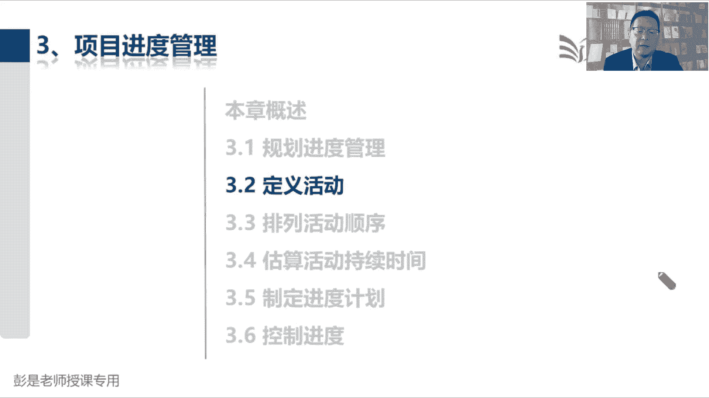
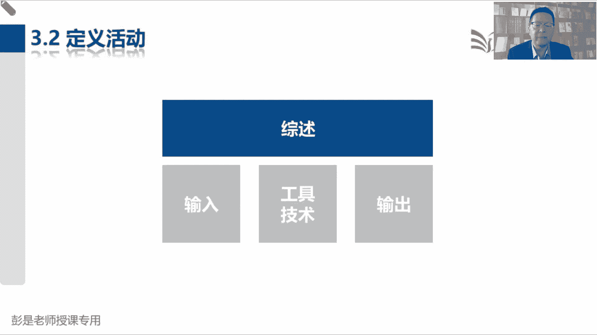
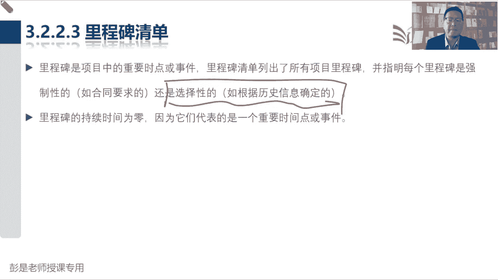

# 2024年最新版PMP考试第七版零基础一次通过项目管理认证 - P32：2.3.2 定义活动 - 慧翔天地 - BV1qC411E7Mw

那接下来咱继续说了啊，规划进度管理搞定，那接下来3。2定义活动。

后面大家复习这个过程的时候，也可以看到超快超级快超级快。

就是找到范围基准，范围基准里面有这么三个单词，ca控制账户，然后呢还有规划包，还有呢工作包控制账户，领导咱不管咱不管啊，规划包是以后再分解的，我们也不管，我们只是找到最底层的工作包。

去分析这个工作包怎么把它把它干完，所以呢就会通过分解技术滚动式规划，得到活动清单，活动属性，那下面这个里程碑清单啊，它到底属于哪一个过程，其实不要求大家去背了啊，里程碑搞定这个术语代表什么含义就够了。

什么是里程碑呢，什么是里程碑啊，小孩出生了，小孩上幼儿园了，小孩幼儿园毕业了，上小学了，一年级了，2年级了，3年级了，这都是关键节点，对不对，都是这个关键节点，这是表示某一个时间点。

某一个时间点它重要的状态，重大的事件就称之为里程碑，上课下课也是里程碑啊，对不对，开始报名，报名结束也是里程碑，开始考试，考试结束都是里程碑，所以我们要根据项目的情况选择合适的里程碑，太细了就啰嗦。

对不对，太粗略了，管控力度又不够，哎这就大概知道什么叫里程碑就可以了，那我们现在在定义活动的时候，定义活动的时候就可以得出很多里程碑了，好这个意思啊，那它的攻击技术也没有什么新鲜玩意儿，对不对。

分解创建WS1模一样，只不过分解的对象不一样，分解的成果不一样，创建WBS是把大工作变小工作，大成果得到小成果，现在定义活动分解的成果就是分解的输出物。

这是我们的活动清单好，所以这个管理过程输入没啥东西，范围基准见过了，然后呢输出活动清单，活动清单这段文字呢想看就看，不想看也可以不看了，嗯就是个列表，打开美团APP，然后选到合适的餐厅选菜品。

然后交钱交钱，然后收餐，诶，这是个列表，那活动属性看起来字多，也不要慌啊，不要慌啊，活动属性它的主要内容啊，其实完全可以靠猜的，因为定义活动我们就会得到活动清单，然后接下来排列活动顺序，估算活动资源。

估算活动持续时间，我们一定是随着未来这些管理过程的开展，不断的更新这个活动属性，把相关的你关心的这些信息都给它填进去，排列活动顺序，分析他的逻辑关系先后顺序，那就看看这个活动谁在他前面，谁在他后边说。

紧前活动紧后活动逻辑关系，包括我们要掌握的什么提前量，之后量，包括什么资源相关的需求和时间相关的，强制时间，强制日期都要写进去吧，就是活动属性就干这个事情，各位同学考试的时间是正式，考试时间是上午九点。

要求最好最好08：30，大家都进到考场了，这不就是强制日期嘛，对不对，开考之后，15分钟以后就不要再不能再进入考场了，这都是强制日期啊，那都要把它写清楚，知道意思就够了，具体有什么具体详细的内容。

不是不要求大家去背的啊，总之随着后续管理过程的开展，我们会不断的更新活动属性，这个大道理要记住，那活动属性和活动清单的逻辑关系，就和WBS还有他的好朋友词典一样的，WBS配置点清单，配属性。

制约因素和假设这些条件怎么区分呢，回顾一下制定项目章程，这个管理过程，什么叫假设条件，什么叫制约因素，思考了前面讲过的知识点好，那再往下了啊，3223里程碑清单，这是最后一句话，里程碑的持续时间是零。

因为他是个时间点，对不对，所以他没有持续时间，就表明了当前某一个时间点一个重要状态，就像刚才说的，上学下学一年级，2年级，3年级开学放寒假，以此类推了，所以我们要根据项目的情况选择合适的里程碑。

比如说什么合同要求的，这很好理解了吧，合同要求你们多长时间完成设计，多长时间打好地基，多长时间盖好房子，多长时间完成装修，都有时间点的哎，这都是中大称大的里程碑，或者是我们根据项目的情况。

在个性化选择一些我们内部的这种里程碑，各种可能性啊。

