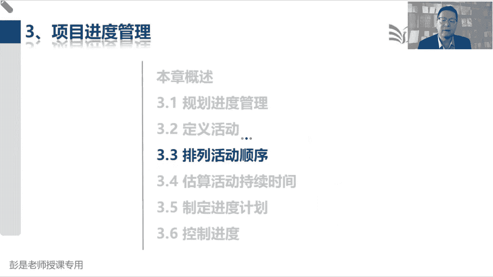
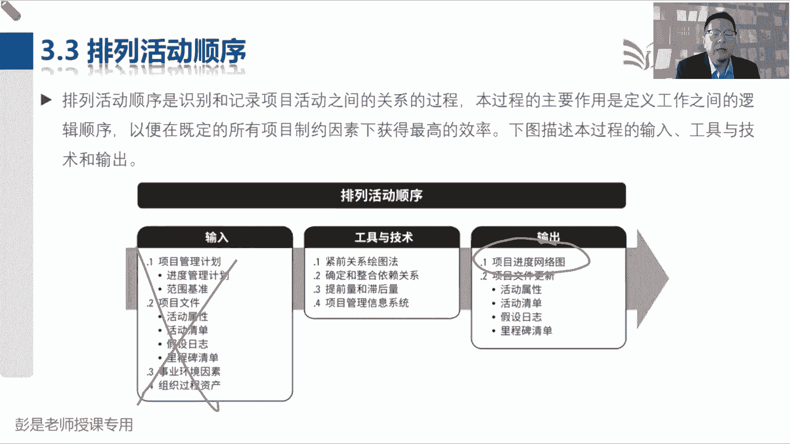
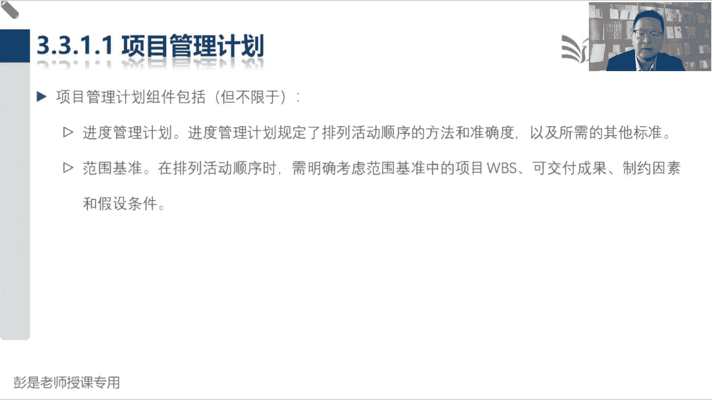
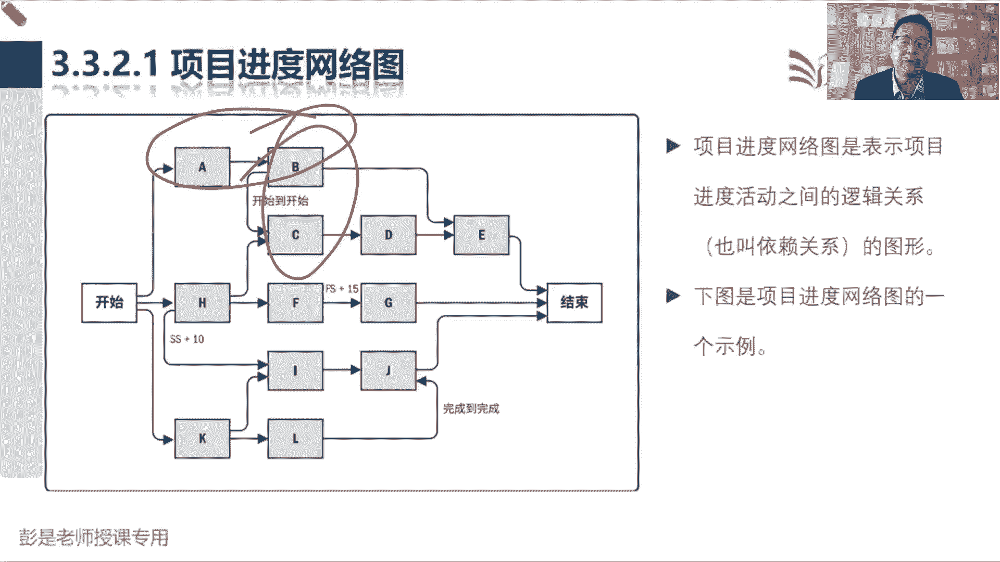
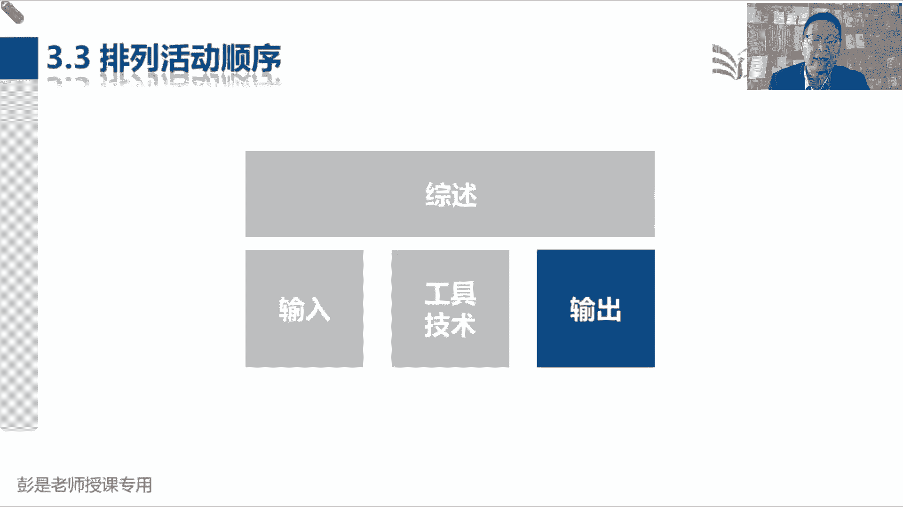
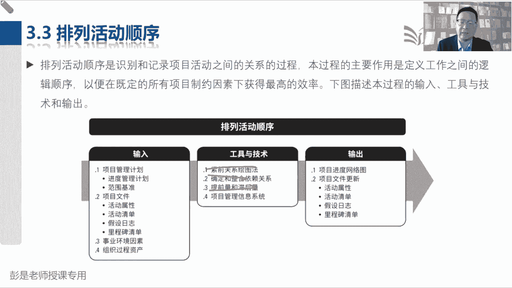
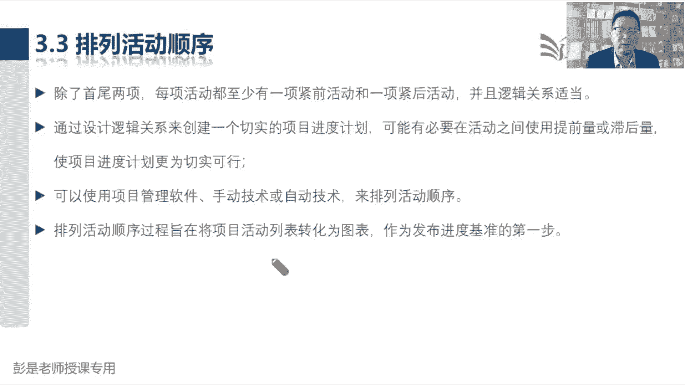
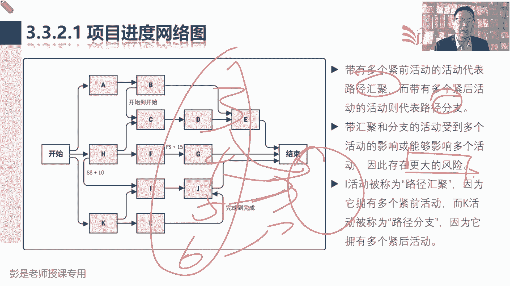
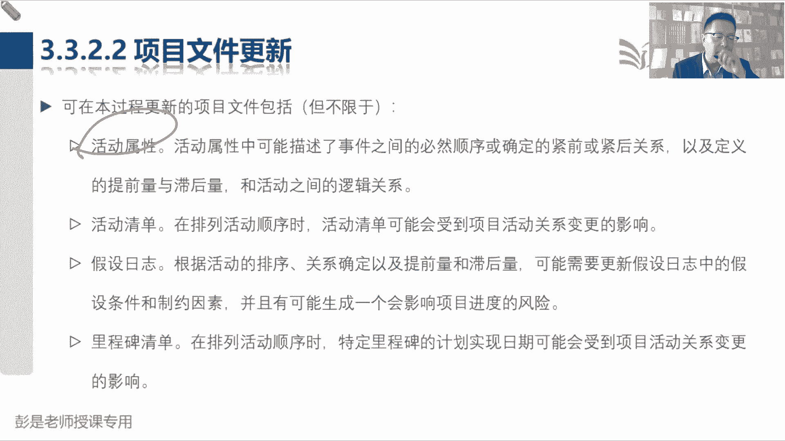

# 2024年最新版PMP考试第七版零基础一次通过项目管理认证 - P33：2.3.3 排列活动顺序 - 慧翔天地 - BV1qC411E7Mw

3。3排列活动顺序，3。3，3。4，3。5，这三个管理过程学习重心其实也没啥，就是工具了，因为它的输出很好记，排列活动顺序，画网络图，估算活动持续时间的输出，就是持续时间还配上一个估算依据。

制定进度计划，要出我们项目的进度计划，就是那个进度表，然后敲定日期就得到了进度基准，他的输出比较好记，它的输入呢也没什么东西，主要是看看工具好。

所以3。3排列活动顺序说呀，我们这个过程主要作用是什么呢，分析活动之间的逻辑关系，就是先做什么事情，后做什么事情，哪些活动可以串行，哪些活动可以并行串行，就是先后并行，就是同时你可以洗西红柿。

然后打打鸡蛋，炒鸡蛋，放西红柿，放调料，最后装盘，做菜的过程中，我一抽可以抽根烟诶，有些工作是串行的，有些工作可以并行对吧，在热菜的过程中再去洗一洗什么萝卜，再洗一洗什么土豆黄瓜，西红鸡蛋，以此类推吧。

这就是3。3主要工作内容，所以他的输入没有什么需要大家去背的，他的输出这个术语一定要掌握，项目进度，网络图，项目进度网络图。

这是图形化的方式，那到底什么是网络图呢，先看看先看看后面的这张图。

看完了这张图就知道意思了，A和B串行，B和C并行，我们把所有活动它的先后顺序，逻辑关系通过图形化的方式给它呈现出来，所以最终输出这就是这个表现形式。

那排列活动顺序，接下来工具技术有什么呢。

稍微有一点点印象啊，所有的工具现在考到的细节也不会特别多，所以呢我们放到最后统一讲，那这三个工具一定要掌握一个叫曲，颈前关系绘图法，颈前关系绘图法的中心思想啊，就是啊。

分析活动之间之间的各种各样的逻辑关系，常见的逻辑关系有啥呢，两个单词排列组合，一个单词叫开始，一个单词叫完成，这两个词排列组合吧，有的事情啊可以让他同时开始，有的事情呢。

嗯有可能存在着同时完成这样一个状态，有的工作呢是完成一个再开始下一个，有的工作就反过来开始，然后再完成，就是通过这样的两个单词排列组合，叫开始到开始完成到完成，完成到开始开始到完成，并且通常大家工作中。

最常用的就是前一项工作完成，再开始后一项工作嗯，洗完了西红柿，然后开始打鸡蛋，鸡蛋打完了就开始炒鸡蛋，鸡蛋炒完了再放入西红柿，放完了西红柿再放调料，以此类推，通常是按照这个先后顺序去去执行的。

但是某些工作呢也可以同时开始，各位同学上午吃完了饭，然后呢老师一开始讲课，各位同学就开始听课，所以咱们听课讲讲课听课讲课听课，咱们即是同时开始，又是同时完成，它就是分析所有活动这种逻辑关系。

这叫近前关系，绘图法，分析逻辑关系，然后就可以画图了，画图的方法就是刚才大家依稀见过的这张图，用方块来表示活动，用箭头表示活动之间的逻辑关系，所以现在画出来的A和B的逻辑关系，就是A完成B开始好。

大概有一丢丢印象就可以了，考试也不要钱，那也不要求大家画这种复杂的图了，那第二个呀，确定和整合依赖关系也需要大家记住四个单词，四个单词叫什么呢，就这四个东西叫硬或者叫强制性的依赖关系。

软叫选择性的依赖关系，又可以分成内部依赖和外部依赖，什么是强制性的硬逻辑关系呢，就是说呀没得商量的，没得商量的，一定是现在美团上卷完餐厅，卷完菜品交完钱，人家才能去聚餐，外卖小哥才能去取餐，对不对。

你不交钱，人家怎么可能直接去餐厅聚餐呢，这就是没得商量的，叫强制性的依赖关系，又称为硬依赖关系好，那软逻辑关系啊，就是可选的，随便啊，没关系啊，可以先后可以后先可以，同时希望大家早上起来先刷牙后洗脸。

先洗脸后刷牙，也可以同时刷牙和洗脸，也可以不刷牙不洗脸，它取决于我们自己的最大事件，这就是有的选择的就称为选择性，或者叫软国际关系，那外部依赖关系是什么呢，这是外外卖小哥，对不对，我们下完了订单之后。

外卖小哥去餐厅去取餐，像餐厅啊，外卖小哥啊，这都是我们项目团队之外的人呐，所以在他实际工作中，比如说取决于供应商，餐厅外卖小哥都是我们的供应商吧，或者是政府，政府审批，或者是客户，这都是项目组之外的人。

需要这些人开展的活动，就称之为外部依赖关系，客户不签字，我们就没有办法构成需求的基准，没有需求的基准，我们就没有办法定义范围，可供应商没有办法，没有及时的把东西送到我们手里。

我们就没有办法开展下一个工作，这都叫外部依赖关系，最后内部依赖关系呢，就是我们团队自己干的事情，咱们团队内部的事情，所以这四个单词仍然可以两两排列组合，可以有强制性的强制性的外部依赖关系。

强制性的内部或者是选择性的外部，选择性的内部，但是分析这些活动的各种各样的逻辑，这就是一和二，然后第三个工具啊叫提前量之后量，提前量之后量干什么事呢，在大家实际工作中，生活中都在用啊。

比如说你打车对不对，比如说打车司机师傅开到你家楼下，司机师傅开到你家楼下给你打电话，说我到你家楼下了，然后我们再下楼，这中间人家到了给你打电话，到我们下楼，中间可能有一点点时间差，对不对。

你得下楼等电梯，然后爬楼梯可能需要个35分钟啊，诶这不是浪费时间吗，那怎么做呢，司机师傅啊，您还差10分钟到我家楼下的时候，给我打个电话，我提前提前穿好衣服，备好包包，走到楼下，这样呢您车到了我就到了。

这样就可以节省时间，所以提前量提前量，就这个东西想办法把某些工作呀提前开展，可以有效的帮助我们缩短一些项目的工期，这就是提前量，这个对最后给那滞后量呢，提前量是提前提前，比如说提前10分钟，所以它是十。

滞后量呢就是往后推10分钟，这个大家实际工作中，生活中也都在用，比如说烧开水，水烧开了100度，水烧开了100度，下一步不管你是洗澡还是喝呀，不行啊，太烫了，需要等一等等一等，等待的时间就称之为滞后。

两，水烧开了之后啊，等个5分钟，等凉了再喝呀，这意思吧，这就是滞后量，这就是大概这三个工具稍稍有一点点影响，后面讲工具技术技术的时候再复盘就差不多了，总之就是分析各种各样的逻辑关系，依赖关系。

提前量之后量画图，所以书上后面这段文字就开始说了，除了首尾两项，每一项活动，至少有一个紧前活动和一项紧后活动，并且的逻辑关系恰当，尾首尾两项就是项目开始和项目结束，除了这俩，中间不管是任何一个活动。

他至少有一个颈前，有一个颈后诶，那接下来我们就是分析逻辑关系，把它变成图。

好所以输入没啥东西了。

输出就是刚才给大家见过的项目进度，网络图开始项目结束，然后呢中间你就把你的所有活动塞进去，看看哪些活动串行，哪些活动并行，大概能解读出来这几个术语就够了，比如说活动A和活动B，A的箭头从它的尾巴出来。

顶到了B的脑袋上，这就叫完成到开始，A活动完成之后，我们就可以开始活动B了，同时呢活动B和活动C又是开始到开始，这种逻辑关系，只要活动B1开始就可以开始活动C了，然后继续解读活动C要想开始啊。

有两个条件，第一个条件是活动B开始，第二个条件是活动结束，这两个条件都具备，我们才能够开始活动C知道意思吧，好以此类推了，那像活动L啊和活动J啊，这是完成到完成好，能够读出来它是什么意思就可以了。

并且现在考试啊也基本上不会考复杂的，画这种图的这种题，通常来说呢，如果要考这个逻辑关系，会写的比较简单，要不然字太多了，还可以掌握这个方法，大家可以根据你的生活常识，工作常识，找到你熟悉的东西。

尝试着画一画，其实很简单啊，好再往下走了啊，所以这个东西我们可以用软件画，可以手工化，这都是废话，然后呢可以结合到一些文字的描述来说清楚，这里面的排序方法，这都看一看就够了，往下找找重要的这两个术语。

带有多个紧前活动的活动，代表着路径的汇聚点，带有多个紧扣活动的活动则代表着分支点，所以看这个例子，活动I被称为路径的汇聚，为什么呢，因为他有很多个前置条件，他需要等到活动开始。

这是条件一还带还带十天的滞后量，活动H开始后，等十天我们才能够开始活动I对不对，所以他用了加号，这是滞后量啊，这是第一个条件，第二个条件他还需要等到活动K结束，这两个条件都具备才能够开始活动I。

那这两个条件都具备任何一个条件，一旦受到了影响，有了延误就可能影响到活动开，所以它叫容易被受，容易受到多个紧前活动的影响，那以此类推了，再看活动K活动可以结束之后啊，我们通知活动哎，你开始吧。

还要通知活动L，你开始吧，万一活动K有了延误，它会影响到多个紧后活动，所以路径的汇聚点和分支点都意味着什么呢，风险点，都意味着风险吧，这和大家日常工作中道理一模一样吧，我要干个活，张三李四王五赵六。

他们四个分别给我写一点资料，我需要等他们四个都写完，然后汇总，然后排版，然后编辑，然后提交，那你们四个干活千万不要拖延啊，不然呢就会都会影响到我呀，诶就叮叮嘱叮嘱操操心。

就这个意思好，再往下项目文件更新没什么东西啊，随着工作的开展，更新活动属性，因为这个管理过程我们就是分析他的逻辑关系，没关系，包括提前量之后量。

