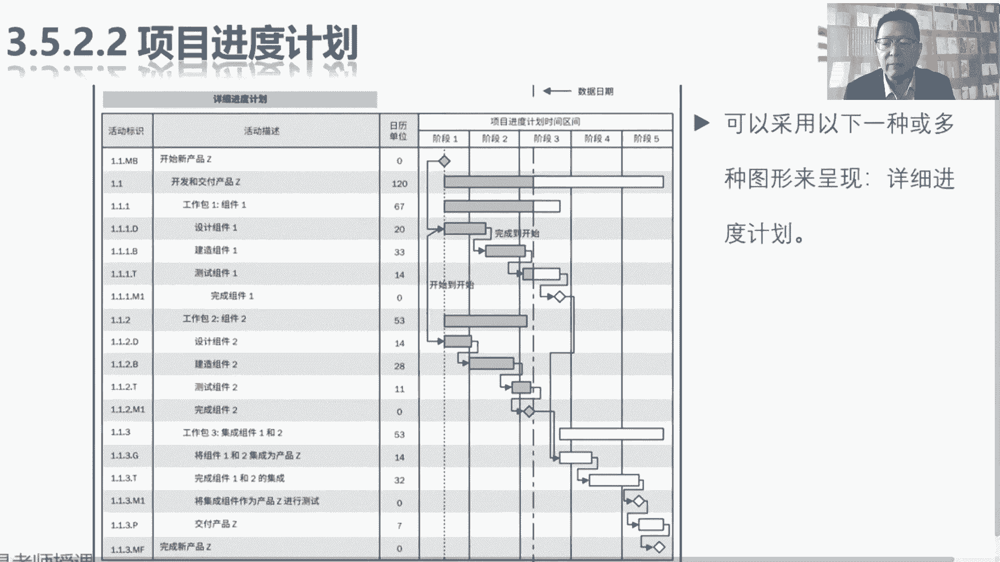

# 2024年最新版PMP考试第七版零基础一次通过项目管理认证 - P35：2.3.5 制定进度计划 - 慧翔天地 - BV1qC411E7Mw

接下来我们看啊，3。5制定进度计划，这个管理过程刚才也说了吧，我们定义活动得到活动清单，还有他的好朋友活动属性，然后呢得到一个里程碑金丹，接下来排列活动顺序，分析这些活动的逻辑关系，一代关系提前量之后。

量化进度的网络图，等我刚才见过的那个图形化的方式，把它的先后顺序串行并行呈现出来，那3。4估算活动持续时间，我们要先去看看资源的可用性，看看有多少资源可以用啊，这些人的水平等级技能都是什么样的。

所以呢会得到资源需求，估算活动持续时间，那那就是拍脑袋类比估算，噼里啪啦计算三参数估算，考虑到风险，三点估算，拿不准的时候自下而上估算，总之啊用各种各样的估算方法，得到持续时间的这个估算结果。

另外呢再考虑一些风险，要不要准备一些应急储备，管理储备啊，看看有没有已知风险，未知风险，最后呢给出活动持续时间的估算结果，然后现在万事俱备，接下来把刚才这四个东西管理过程的输出，全都拿过来。

放到我们的进度计划编制工具里，excel project这种东西啊，放到计划编制工具里录入进去，然后呢噼里啪啦一顿，弄得到整个项目的进度计划，就是我们的进度表，得到了进度表之后呢。

敲定所有的时间点，就得到了进度基准，这就是3。5这个管理过程要干的事情。

所以猛一看他的输入输出很多，但是不要慌，收入不用记，只要牢牢记住前四个管理过程的输出，定义，活动排序，估算资源，估算时间搞定，那他的输出看起来猛多呀，也没关系啊，进度基准。

项目进度计划就牢牢记住这两个玩意儿，项目进度计划就是我们的进度表，第一天讲管理基础，第二天讲整合，第三天讲范围，第四天讲进度，那第一天是哪一天呢，大家一批准达到共识，达成共识就得到就得到了进度基准。

这就是进度计划和进度基准的区别，然后第三个输出啊，看名字稍稍有一丢丢印象就够了啊，精度数据是什么玩意儿呢，就是这一大堆输入啊，把这些数据带到软件里，录入到工具里就会得到我们的进度模型。

这个稍微有一丢丢印象就够了，还需要了解的一个术语就是项目日历，项目日历和资源日历，看起来好像资源日历体现的是资源的可用性，那项目日历体现的是什么的可用性呢，就是时间就是时间，因为啊是什么时间上班。

什么时间什么时间不上班，这玩意儿会影响到我们的交付日期的，随便说说个粗暴的场景啊，比如说今天是周日，然后周一周二周三周四周五，周五过后呢，又是周末，周六周日，然后再接着下一个周一，接着下一个周一。

老板给我了一个活，我大概一拍脑袋呀，六天可以搞定，如果周末不加班，周末不加班，那我可能就下周一才能够交付，如果周末是工作时间，那我可能周六就可以交付了，项目日历就干这个事情。

我们要根据项目的实际情况去分析一下，我们一周工作几天，什么时间放假，什么时间休息，什么是法定节假日，节假日要不要加班，以此类推，它就体现整个项目时间的可用性，告诉我们什么时间可以干活，什么时间不能干活。

通过项目日历就会得到，我们到底什么时候能够完成项目，进行交互，哎这大概有这个印象可以了，一对叫日历的，就这么两个，一个叫资源日历，一个叫项目日历，资源人力最早从哪产出的呢，可根本根本就不重要。

因为在实际工作中，对对项目来说，对企业来说都需要有这个东西啊，能听懂吧，航空公司有航空公司的资源日历，携程app上面也有资源日历，那我现在项目组需要十张飞机票诶，我制定项目组的资源里，对不对。

看看我项目组张三李四王五赵六都没有，没有档期诶，所以他其实对企业来说有企业的资源日历，对项目来说呢可能有项目的资源日历，并且呢他俩可能会相互影响，公司有一间会议室，周一周二周三周四周五。

目前的状态都是空闲，那我项目上订了这间会议室，对其他项目组来说，它就不可用了，所以他是哪个管理过程的输出呢，根本就不重要，重要的是，我们需要有这么一个东西来直接看出来，这些资源可用不可用。

因为资源的可用性，会直接影响到我们的进度计划，这才是需要大家掌握的东西吧，好那再往下这个管理过程，后面大家需要掌握的就是这一大堆工具了，这一大堆工具啊，现在基本上也大概说一说，了解一下就够了啊。

进度网络分析，其实不太不太会考进度，网络分析啊，就告诉我们这个道理，进度表有没有可能一次搞定呢，不一定记录表有没有可能一次搞定呢，5151打算去哪玩，5月1号，5月2号，5月3号，5月4号。

然后能不能买到飞机票呢，路上会不会堵车呢，能不能订到酒店呢，还以此类推了吧，所以可能需要根据各种各样的限制啊，各种各样的客观情况啊，反复调整，才能最终得到一个具有可行性的项目进度计划。

他就在强调这个东西，然后后面关键路径法，资源优化，进度压缩这三个东西，咱讲到工具的时候再说，关键路径法是什么东西呢，一会儿教材上会给大家说的啊。

关键路径随便想场景随便讲两句啊，吃席吃席做饭需要10分钟，做完饭之后，张三吃饭，李四吃饭，张三吃饭需要5分钟，李四吃饭需要3分钟，他俩都吃完饭，我们来刷碗，刷完需要5分钟，那接下来就想一个问题。

这个项目多长时间结束，这顿饭吃完需要多久呢，这顿饭吃完需要多久，你只要能够给出一个正确的结果，你就知道什么叫关键路径了，这顿饭从做饭一直到刷碗，这是这个项目，这个项目多长时间结束呢。

这个项目多长时间结束了，10分钟，做完饭5分钟，张三李四都吃完，再花5分钟刷完碗，所以一共需要20分钟，这就是关键路径法干这个事儿，那关键路径法怎么干活呢，什么叫路径呢，什么叫路径呢。

就和大家玩的那个走迷宫这个游戏一样，我们从开始往右边走，走到张三走到刷碗，这是第一条路径，然后再从开始做饭，走到李四走到刷碗，这是第二条路径，接下来我们计算每条路径的时长，计算每条路径的时长。

上面就是10+5加五等于20，下面呢是10+3加五等于18，上边这条路最长，所以它就称之为关键路径，因为它代表着完成这些事情所需要的最短时间，这顿饭最短最短20分钟才能吃完，这就叫关键路径法。

它就是就这么找啊，画网络图估算活动持续时间，然后找路径，找关键路径，画网络图排列活动顺序，估算资源，估算活动持续时间，得到了这些活动的持续时间，然后呢找路径持续时间最长的，就代表着关键路径。

然后意味着完成这个项目所需要的最短时间，这就是关键路径法。

那接下来资源优化和进度压缩，后面再说了，资源优化就是资源使用有问题，那就要优化进度压缩干什么事了呢，想办法缩短工作，缩短项目的工期，尽快的把这顿饭吃完，看看洗碗啊，做饭啊，吃饭啊，能不能尽快的完成。

哎通常来说大家第一反应就是增加资源，这叫赶工，好，先听一听啊，然后中间这个假设情景分析，还是需要稍稍有点印象的，假设情景，假设情景其实刚才就已经用了，刚才我们在讲估算活动持续时间的时候，就已经在用了。

哎呀明天路上要堵车怎么办，明天到了公司楼下等电梯，排大队会怎么办，诶这不就是假设情景分析吗，假设未来工作中出现什么问题，会不会影响我们的进度，如果会有没有应对措施，从而避免我们最终的交付日期受到影响。

所以这是假定假定出现什么样的情况，然后分析会不会影响交付日期，如果会提前规划好适当的应对措施，所以这个管理过程关键路径法资源优化，假设情景分析，进度压缩，这四个玩意儿是需要大家牢牢记住的。

其他的什么模拟啊，那个定量风险分析再说了，金融网络分析基本上也不大好，他就这在提醒我们，这些方法不可能用一遍进度表就出来了，需要反复用综合用不断的调整，然后第八个敏捷发布规划其实是考点啊。

但是我们现在没讲到敏捷，所以后面讲敏捷的时候再说了好，所以这个管理过程大概知道这个意思就够了，拿到刚才这些管理过程的输出，然后呢我们就网络图把时间塞进去，这不就相当于录到软件里吗，然后呢关键路径找路径。

找路径，看看哪个路径持续时间长，就说明完成这个项目需要多长时间，这就是关键路径法，再看看资源要不要优化呀，张三忙不过来了，李四请假了，都会影响到交付日期的解决资源的问题。

最后呢再看看有没有办法可以提高工作的效率，缩短工期，从而做到尽早交付，唉这就是关键路径法，资源优化和进度压缩，这些东西做完了之后，通常再去分析有没有风险，有没有风险诶，看看这个风险，风险一旦发生。

我们有没有提前一些措施啊，办法啊去应对这个东西，好所以这个管理过程大概知道它的意思啊，最后输出就是项目的进度计划和进度基准。

那进度计划到底是什么东西，咱再看看。

先变成大家可以看到的东西，现在这张图就是进度计划的之一之一之一，其中一部分内容一点一开发和交付新产品Z，这叫什么呢，控制账户，控制账户下面现在有三个工作包，工作包一组件一，工作包二，组件二。

工作包三是集成组件一和组件二，所以粗暴理解啊，工作包一炒鸡蛋，工作包二炒西红柿，工作泡菜鸡蛋，西红柿炒到一起，嘿知道这个意思吧，那再看右边，右边能看到什么呢，这个数据日期代表着当前这个时间点。

截止到今天，我们就能够看到它的进展情况，就是进度条，各位同学，你看电影对吧，在电脑上看电影有没有进度条啊，看他那个视频回放有没有进度条啊，这节课一共一个小时，现在看了一半了，进度50%诶。

就能够看到它的进展，所以通常已经完成的部分会用颜色给它填进去，未完成的地方会用白色显示啊，我们还有多少活儿没干呢，所以现在可以给出结论，工作包一组建一目前它的进展情况，这叫符合计划，工作包二组件二。

目前它的进展情况符合计划，因为该干的活都干完了，所以整体上来看，我们开发和交互型产品，Z开发和交付新产品，推这个控制账户，目前的整体进展情况符合计划，对不对，然后再剩下我们把工作包一完成完成之后呢。

就可以开始整合，整合之后呢，我们现在目前预测一下，可以按期交互，这就叫项目进度计划，那再往下再展开的话，工作包下面还有啥呢，还有活动，还有活动啊。

所以后面大家会看到这张图，看不清楚的同学听听意思就够了啊。

我来帮你看清楚。

它虽然有点糊，但还能凑合看。

好这张图又体现什么东西呢，刚才我们见过了工作包一，工作包下面还有具体的活动设计，组建一建造组件，一测试组件一，那这些活动还有活动之间的逻辑关系啊，他告诉我们先做啥后做啥再做啥。

所以右边叫这张图叫详细进度计划，因为已经到了最底层活动这个层级了，右边能够看到活动之间的逻辑关系，完成到开始完成，到开始还能够看到这些活动的进展情况，这就叫详细进度计划，所以我们这个管理过程啊。

就是为了把数据弄到软件里。

弄到工具里，最后得出来各种各样的这种进度表。

进度的图形化的展示方式，这就是这个管理过程的主要工作。

好知道了它的意思之后。

倒车倒车倒车，再回到这个管理过程综述，这段文字啊就好理解多了。

所以这个管理过程干什么事呢，拿到前四个管理过程，这一对一大堆各种各样的输出，然后呢把它弄到我们项目管理信息系统，这个工具里录入进去，这些输出，这些输入啊就是我们进度数据，把数据弄到软件里。

然后呢噼里啪啦一顿编排就得到了，刚才我们依稀见过的叫项目进度计划，项目进度计划一旦敲定了，所有具体的时间和日期，就得到了进度基准，另外呢如果发现如果发现没有办法去交付，实在不行，周末加加班。

我们可能要改变我们什么时间工作，什么时间不工作，这个项目日历对不对，大家通常996007不都这么出来的吗，如果一周工作五天，可能可能没有办法按期交付，那咱就一周工作六天诶，就有了996啊，好知道了。

这个管理过程的主要作用差不多了，所以大家就是看就够了。

所以说上来就强调第一个工具，这进度网络分析，因为制定可行的项目进度计划，不太可能一次就搞定对吧，简单的事一拍脑袋就出来了，但是有规模的事情，复杂的事情怎么可能一次搞定呢，一一怎么可能一步到位的。

所以一定反复调整，考虑到时间，考虑到资源，考虑到成本综合分析啊，还要考虑风险，嘿不断的不断的调整，不断的优化，知道这个意思够了。

然后关键步骤这段文字啊看一遍，这是刚才反复给大家说的那个思路，拿到这些东西算时间，然后确定日期，看看有没有冲突，然后呢看看什么什么有没有冲突，最后啊大家达成共识就得到了进度表。

在敲定时间就得到了进度基准，看一遍就可以了啊，那他的收入没有新的知识点了，输出进度基准，进度基准是经过批准的进度模型，只有通过正式的变更程序才能够进行变更，计划制定完成，一旦经过了批准。

就称之为基准自强改造流程，那经过相关方的接受和批准，进度基准到底有什么东西呢，基准的开始日期和基准的结束日期，这是所有具体的日期，具体的时间，那基准干啥用的呢，就有了最后的一句话啊，在监控项目之中。

用实际的开始和完成日期和基准做比较，看看有没有偏差，公司规定九点钟上班，这就是你的基准啊，张三九点钟零一到公司迟到了，有偏差，然后公司又规定说，迟到5分钟之内不需要采取措施，所以张三迟到不扣钱。

就这道理吧，他还要结合到那个控制临界值去判断，因为有偏差不代表着要求，正要看看在临界值范围之内，可接受的行为就不需要采取措施了。

嗯好知道进度基准啊，那3522这段文字啊，大家基本上也是看个一遍两遍，知道这个意思就可以了，主要就是通过那些图形成，形成这种有画面的认知就够了，所以项目进度计划是我们进度模型的输出。

就包括了各种各样的图表。

好后面就不念了，主要是看看这几张，这几张图，熟悉一下术语，可以采用以下一种或者多种图形来呈现，这个叫横道图，又称为甘特图，横道横道就是进度条啊，通过进度条能够看到它的进展情况。

所以不管在控制账户这个层级，还是在工作包这个层级，还是刚才我们见过的某些活动，这个层级都可以有进度条。

很直观，所以通常这个玩意儿向领导做汇报，所以横道图也称为甘特图，巴拉巴拉，它相对易读，比较常用，可读性比较好，直接能够看到进展情况。

那再往下我们前面说定义活动输出，有一个叫里程碑清单的东西，接下来我们把里程碑塞到我们的软件里，对不对，开始新产品，完成组建一，完成土建，二，完成这两个玩意儿的集成，完成新产品Z。

这都是持续时间为零的一些关键事件吧，重要节点诶，给他画出来已经达到了里程碑，就带颜色，没有达到的里程碑就是白色空白的，这样可以一目了然，看到我们里程碑的大道情况。

这就叫里程碑图，所以里程碑后面巴拉巴不念了啊，再往下就是进度网络图，进度网络图是我们排列活动顺序的输出，分析这些活动的逻辑关系，依赖关系体现量周量，所以呢现在把它通过进度计划也能够呈现出来。

知道意思够了，进度网络图通常用活动节点法绘制，活动节点法呀，就叫a o n active代表着活动，O就是那个on n呢就是那个node活动。

在节点上用节点用方块来表示活动。

所以呢就称之为活动节点法，然后它上面没有时间刻度。

下面看这张图没有时间刻度，所以呢也叫纯逻辑图。

他纯粹显示活动之间的逻辑关系，知道这个单词有印象就可以了，那像逻辑横道图啊，时标逻辑图，时标网络图啊，现在基本上啊这个术语咱偏僻，考试啊，基本上不大会出，这为啥不当会出啊。

就想场景的想场景啊，如果在这张图上啊，我们能够把时间刻度画上去，这不是可以更直观的看到这活儿大概多少天吗。

所以其实就是详细进度计划。

再看PPT上这张图，这是详细进度计划，你把这个阶段一阶段，二阶段三变成周，这是第一周，这是第二周，这是第三周，接下来我们就可以粗暴地理解了诶，工作包一组建一大概三周就可以结束。

设计组建一这个宽度大概一周就搞定，建造组建一大概一周就搞定，测试组建一大概一周就搞定，他就是带时间刻度的进进进度计划，这样可以看出来更直观的，更直观的看到这些活动大概工期是多久，现在是几天了。

进度大概是多少。

有没有偏差，嘿这叫逻辑进度模型，或者叫什么时标网络图，时标逻辑图，逻辑横道图这几个术语啊，咱考试基本上也不大会出，有一点点印象就可以，总之都叫详细进度计划，好知道这个意思啊，后面这几个术语咱就不念了。

这看一遍就有印象就够了，那再往下翻。

就是我们的详细进度计划，就是带活动的已经到了最底层了，不能再细了。

所以大概就这么三个单词说教材上这张示意图，最上面的就叫里程碑，能够展现出我们所有里程碑的状态，第二个呢工作包控制账户，这个层级就比较粗略，所以叫概括性进度计划，甘特图横道图，再往下再往下。

把工作包往下展开，就能够看到活动逻辑关系以及它的状态，这就是详细进度计划，这三个术语，通过这个图大概有这个认知够了，好精度数据这段文字啊没啥需要去记的。

就粗暴理解这个管理过程的输入，我们需要把数据放到放到软件里，然后中间这堆术语啊，这个单词有一点点印象就可以了，好他叫按时段系列的资源需求是什么意思呢，按时段激烈的资源需求，往往以资源直方图展示。

啥意思啊，我随便说了啊，各位同学，你们叫外卖可以预约时间吧，预约送餐时间的，我们那个牛肉面馆啊，九点钟发现有十个人订饭了，十点钟发现有20个人订饭了，11点发现有50个人订饭了。

12点发现只有两个人订餐，这就叫资源直方图，就粗暴理解资源直方图，资源直方图就这意思，它就是柱状图，条形图，那对餐厅来说就会发现问题了，有的时候忙，有时候闲，那我们要让这个资源的使用。

最好最好最好平稳一下，不要不要忙的时候，到时候忙不过来，送餐晚了会投诉啊，那也不要太咸了，所以呢我们要考考考虑啊，画条线，把这个尖尖能不能搬到这个坑里面去，让我们资源的使用更平稳。

这个实际上大家在工作中，不管是个人还是整个团队，包括你的这些设备设施，都可以做这样的统计分析，统计一下张三未来一周你的工作安排，张三会告诉你周一干啥事儿，下午空闲，周二干啥事儿，下午干啥事儿。

周三一堆事儿，然后周四有什么事情，那咱就把这些事情变成工作量，变成工作量以后，通过这种柱状图条形图就可以体现出来，张三什么时候亡，张三什么时候闲，再画条线，一天平均工作八小时，就会发现。

有的时候张三那工作量太高了，有的时候呢又比较闲，那咱要不要要不要把这个工作安排安排，协调一下，这个意思大概有印象就可以了啊，找资源直方图，统计一段时间内我们的资源的资源的这个数量，工作量都可以。

总之中心思想就是尽量的，尽量的让这些资源的使用更平稳更稳定，不要天上一脚地上一脚，忙的忙死，闲的闲死好，那再往下项目日历时间的可用性，这段文字看一看，有印象就够了，因为是这些是这这这是今年春节的吧。

这些时间不干活的话，我们可能需要29号交付，如果过年时间可以加班的话，那我们可能22号就交付，所以它会影响我们最终的交付日期，那咱要结合项目的实际情况，去和领导和客户去商量，什么时间上班。

什么时间不上班，甚至有的项目可能需要分不同的班次，早班中班晚班参考麦当劳24小时营业，早班中班晚班车轱辘连轴转的这种东西啊，有印象就够了。

