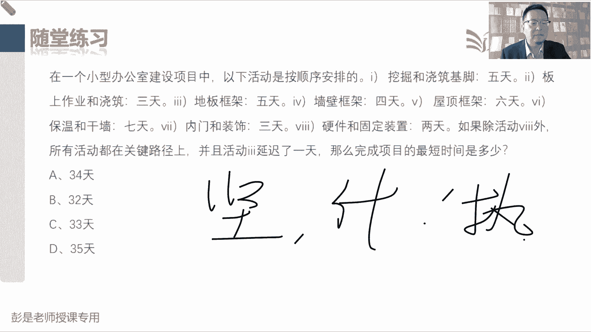

# 2024年最新版PMP考试第七版零基础一次通过项目管理认证 - P36：2.3.6 控制进度 - 慧翔天地 - BV1qC411E7Mw

那最后一个管理过程控制进度，这个管理过程拿眼睛一扫啊，虽然猛地一看挺吓人，一大堆输入输出工具，但实际上呢没啥东西，所以各位同学后面复习的时候，也可以看得非常快，标准的三件套数据信息变更请求，然后呢。

既然是既然是进度是数字啊，既然能够做到数字化量化三天五天八天，那我们就可以有办法去做趋势分析，预测未来还堵车不堵车，大概还需要多长时间到公司，以此类推了吧，这东西不复杂吧。

做核酸的时候看看前面还有十个人，大概一拍脑袋，一个人一分钟，那还有还需要11分钟，咱就能解脱了，就这意思啊，所以这个输出再强调数字化，量化的这个知识领域比较容易做预测，那下一个下一个知识领域。

项目的成本管理也比较容易做预测，所以这两个这两个这两个管理过程控制进度，控制成本，单独写了一个预测，然后中间的工具啊，这个政治分析成本这一章在讲迭代燃尽图，这个敏捷的时候再说，绩效审查，就是查绩效分析。

趋势分析，偏差分析假设情景，这都见过了，关键路径法，资源优化，T型账号量进度压缩都见过了，所以他没有新的工具，就这样去学啊，重要的东西后面才说了，政治分析虽然很重要，但实际上现在考试关于政治分析。

也基本上不会考很复杂的场景，很复杂的计算都是简单判断就可以，那这个管理过程就学完了好，所以绩效变更，绩效变更就这么两个主要工作，那再往下翻翻，看看有没有细节性的知识点需要补充的啊，说更新系统模型。

我们要了解目前的实际情况，然后呢所有的变更啊，涉及到进度的变更啊，都要交给项目经理啊，开展实施整体变更控制，所以接下来他主要工作是什么呢，是看现在的状态，看有没有偏差，偏差能不能被接受，要不要采取措施。

然后呢已发生的变更和未来可能会发生的变更，对变更做管理，张三要请假，今天干活，今天干活没有按时完成，这不都是已发生的变更吗，也要对管理啊，然后把变更交给项目经理，开展实施整体变更控制，所以拐个小弯。

其实听到这大家就应该能够反应过来了，比如说你你在公司里面想请假诶，你们公司有啥流程，有什么规矩吗，比较好的公司应该是根据请假几天，由不同的人去进行审批，为什么呢，因为请假的周期越长。

我们越要从整体上来看，评价这个事情对整个公司的影响，请假一天，可能主管批请假三天，可能经理批请假十天，八天的，可能总监批哎，这样是根据企业的情况，制定出一个合适的合适的审批制度，审批不代表着说彰显权利。

重要的作用是评估影响，评估影响这个逻辑是一模一样的，所以我们在控制进度的时候，这个变更不管是已发生的，未发生的，我们先把它视察搞清楚，然后呢交给项目经理，项目经理从整个项目层级去考虑，对整个项目进度。

成本质量，资源沟通会不会产生各种各样的影响，好那这个管理过程输入没有东西了，什么绩效数据啊，他具体内容都不要求去背啊，嗯原计划今天讲到哪，这就是基准，实际上今天讲到哪，这就是工作绩效数据。

这就是绩绩效信息，项目经理综合分析，形成整个项目的工作绩效报告好，所以输出没东西，进度预测就知道这个单词代表着什么含义，就够了，然后什么计划更新啊，都没有新的知识点来做一做这章的小小练习题。

看啊第一道题送分题，以下哪一个是进度管理规划过程的正确顺序，就记住这个就记住这个逻辑吧，先规划进度管理，规划进度管理不是制定进度计划呀，对不对，他是出进度的管理计划，然后呢定义活动排列，活动顺序。

估算活动资源，估算活动持续时间，这四个东西做完之后呢，我们就可以制定进度计划，做整个项目的进度表，所以呢答案就是C选D的同学冲动了哈，就这两个东西很容易混规划，进度，管理规划。

进度管理是规划一下进度到底怎么管，所以它会输出进度的管理计划，准确度，精确度，控制临界值计量单位，然后制定进度计划，制定进度计划就是做进度表呗，所以他输出就叫项目进度计划。

所以进度管理计划和项目进度计划不是一回事，千万不要混，好看看这道题换了个描述方式好，考点一样吧，还是刚才那几个东西啊，定义活动得到活动清单，排列活动顺序，得到网络图，估算活动资源。

然后呢估算活动持续时间，接下来万事俱备，制定进度计划，所以是BC肯定不能选啊，排列活动顺序，输出网络图，C是查阅范围说明书，排序正本身就没有这个逻辑关系，对不对，并且创建了进度网络图。

说明已经做了活动的排序了，好再往下，这道题，估算活动持续时间用什么呢，类比估算参数，估算三点，估算自下而上的估算用不到关键路径法呀，关键路径法是制定进度计划的工具，那题目说估算活动持续时间。

你会基于以下哪一个来提供这个玩意儿呢，就在说输入，所以我们需要活动清单，我们需要活动清单和网络图没关系啊，活动的持续时间和这些活动的逻辑关系，一代关系不一定有必然的联系，对不对。

所以他不需要不需要进度网络图，他收入就没写进度网络图，好所以最合适的选项就是B没有里程碑清单，也不碍事，但是没有活动清单，我就没有办法估算活动持续时间了，好你向哪一项不是制定进度计划的输入。

定义活动得到活动清单，活动属性，里程碑清单排列活动顺序得到我们那个网络图，估算活动资源的输出，就叫资源的需求，估算持续时间就叫持续时间，这些东西作为我们制定进度计划的输入，输入之后呢，用那些工具。

用那些方法得到整个项目的进度计划，然后一旦敲定时间，就得到了进度的基准，所以答案是D，基准是制定进度计划的输出，好看看这道题呢，你在管理一个软件项目，顾客通知你必须做一个进度变更，你想哪一项是最佳做法。

嗯大部分同学都选A啊，哎有的同学选C了哈，说顾客通知你要做一个进度的变更，怎么办呢，A查阅进度管理计划，这百分之百可以选吧，到底怎么管进度的变更，翻一翻进度的管理计划，他对我们工作形成指导啊。

它是任何一个知识领域，都是一个逻辑，顾客通知你做一个范围的变更，那咱看看范围的管理计划，通知你供应商，通知你做一个什么供应采购的变更，咱翻一翻采购的管理计划，以此类推，根据这个管理计划的指导。

完成对这个东西的管理工作，A是肯定的，B通知客户，通知团队和发起人将有一个进度变高，排除掉C，找出影响导致变更的因素，C这种选项啊叫有可能，但不一定，通常什么情况下，我们要去分析诶这个导致变更的原因。

那因素是什么呢，就是咱自己工作出问题，内部内部能听懂吧，张三把活儿干干错了，李四把这个把这个图纸画错了，王五把这个面烤糊了，以此类推，我们内部工作出现失误，我们才一定要去分析原因。

因为我们要想办法从源头上解决掉这个理，像这个问题不要重复重复出现重复发生，那像这种外部的变更，要不要去分析原因呢，不一定具体情况具体分析，只能是看情况，只能是看情况啊，对不对。

所以呢C不一定要采取这个措施，但确定的是肯定要按照进度管理计划的指导，完成对这个进度变更的管理工作，嗯所以仍然粗暴理解啊，顾客通知您明天这个会呀，今天一会十点钟开会，甲方跟我说，咱们改成10：30。

要不要去分析原因呢，不一定看情况，对不对，因为这种外部变更有可能你刨根问底，刨根问底啊，最后问出来的结论啊不一定是好事啊，尴尬呀，对不对，领导通知你10：30开会，为什么。

为什么为什么领导说我拉肚子哎呀，尴尬了不合适，所以外部变更要不要去分析原因，只能是具体情况具体分析，最后变成的结论就是考试没有办法考，对不对，因为咱也不知道前前因后果，不知道整个项目的背景。

所以通常这种外部变更，这种找出影响导致变更的因素，这样这种选项不建议，除非根据题目的描述，我们能够准确地判断出，是我们自己干活出问题了，张三把把活干错了，李四迟到了王五，王五，王五把工作推迟了。

字体工作出现问题，就一定要去分析原因，这是咱内部的东西，好知道这个意思啊，看看这道题送分题啊，我就闲着没事，手绘一个啊，把大象放到冰箱里，分几步分三步走，打开冰箱门，把大象放进去，关上冰箱门。

打开冰箱门需要多久呢，唉大概2分钟3分钟，大象塞到冰箱里，大概需要多久呢，唉2分钟3分钟，大象塞到冰箱里关门需要多久呢，唉一分钟，那这些活动之间有没有逻辑关系呢，有完成到开始，完成到开始诶。

详细进度计划做好了，这就是这道题在描述这个东西，所以整个项目诶就可以判断出来，把大象放到冰箱里，一共分三步，能够看到活动之间的逻辑关系，另外还通过详细进度计划可以知道，大概8分钟左右，这事就可以搞定了。

这就是详细进度计划最伟大的作用好，所以这道题不念不念了吧，说左侧列出活动，顶部列出士气，然后右边能看到进度条，这叫什么呢，甘特图，恭喜大家答对了，这是关于进度管理最伟大的发明，上世纪上世纪曼哈顿计划。

还记得那个吗，曼哈顿计划，阿波罗登月计划，三大核心工具，一个叫范围，这一章的分解可以让我们有效的驾驭复杂程度，提高我们资源时间成本的估算结果，对不对，估算的准确度还便于我们更好的管控项目，那进度。

这一章的最核心的就是刚才那个甘特图，关键路径法，这套东西，让我们能够做到一个具有可行性的项目，进度计划一目了然，看到各个逻辑关系啊，进展情况啊，谁落后了，谁谁延误了，还可以便于我们管理进度成本。

这一章呢就是政治分析，管钱管钱，好这道题选啥呢，哎这题大家做的就慢了吧，为什么呢，但这几个单词看起来好晕呐，所以考试小技巧，生活小妙招分享给大家，这种题啊，大家一定要想啊，它不是考测试啊。

对又不是考专业知识，所以呢用代号去分析效率会高，把它全都变成代号，说你的一个人告诉你，让他开始A活动，从而能够从而能够让B活动开始之前，完成A活动，在B活动开始之前完成A，那么它就是完成到开始。

他就是这几个单词看起来有点晕，对不对，然后也没有也没有用标准的这个逻辑给你说，先干啥后干啥，拐了个小弯弯，所以用代号效率会高得多，他不是考专业知识啊，哎咱就是知道ABCD这一道是道。

谁完成谁结束就可以了，好看看这道题的，这道题有一个思维上的陷阱啊，这些东西都要以史为鉴的，看看规划进度管理，定义活动排序，估算活动资源，估算活动持续时间，制定进度计划，咱说啊。

任何一个管理过程输入都可以有事业环境因素，组织过程，资产组织过程，资产的主要作用就是以史为鉴，避免犯相似的错误，一大堆检查的注意事项啊，还有就是知识库那套东西，所以B选项只是一方面。

它只是众多可能性之一，不一定用参数估算的，我可以用三点估算的，还可以用类比估算的诶，所以它只是只只是一种可能性，那他说的就片面了，但最确定的是什么呢，A我们要了解以前的经验教训，和有关项目的其他信息。

所以呢答案就是ACD肯定不能选，好这道题呢，没错，客户要你提出各个活动的一个工期估算，那我们要开展的管理过程，就叫估算活动持续时间，所以呢是C咱不是估算工作量，不是估算工作量啊，所以呢答案是C。

不是估算每个活动的工作量，工作量这玩意儿你最后关键动定法怎么用，关键路径法，如果上面都是工作量，那这个活动到底是几天呢，算不出来吧，这项目到底多长时间完成了，你推不出来呀，最终还是要把工作量都转化成天。

转化成天，所以这个管理过程就是还根据资源安置例，对不对，是的，根据自然日历去分析这个活动需要花的时间，看看大家有没有档期，好那再往下看看这道题，好恭喜大家，基本上问题不大吧，这道题就是字多。

但知识点超简单，靠生活常识也能判断出来哈，答题小技巧，这道题大家其实看完了选项之后，你就会发现的，这跟题干没关系呀，题干都可以不看的，对不对，因为四个选项都说的一个意思，我们找一个说的最合理的就可以了。

说估估算活动持续时间时，A选项说我们应该考虑人员能力的差异，高级人员是初级人员工作80%，这不可不一定不一定啊，考试的时候题目这么多字吗，有可能比这个障碍稍微多一点点，也有可能少好。

第二个说我们应该考虑人员的能力差异，因为高级员工通常比初级员工需要更少的，是可以可以用更长的时间完成一项活动，这是刚才那个学习曲线，熟能生巧啊，技能高，干活就快呀，这是对的，C应该使用平均值。

这神经病D不考虑能力差异，这也是神经病，对不对，所有高级初级员工应该得到同等的重视，这不是欺负人吗，这种一刀切的一刀切的不科学啊，所以呢比较合适的就是D，这道题，不要蒙啊，各位同学冷静冷静。

刚才那道题的考点是活动的持续时间，取决于资源的等级水平，能力高低，这道题讨厌的地方就是字多，就是字儿多，但是其实很简单，以下活动是按顺序排的，然后呢除活动这个玩意儿，所有活动都在关键路径上。

那这个玩意儿咱就不看他了，对不对好，接下来就是简单的加法，因为它是按顺序完成的，五天三天，五天四天，七天三天，但是题目又藏了一个小条件，大活动三延迟了一天，问项目完成最短时间是多少，就开始算了吧。

好小技巧不用解释了吧，一个12个十，诶我好像少写了一个东西啊，哦还有个六天的啊，还有六天就藏了一个，看错了一个12个13个十哎，33天，然后现在延迟一天再加一天，所以答案是A，答案是A，这种题啊。

恶心人，他需要的就是耐心耐心，何况各位同学呢，所以各位同学未来遇到这样的恶心的人的题啊，不放平心情，不要焦虑，不要惶恐，就就踏踏实实从前到后把它读清楚，然后呢，把他的老老实实的这个活动的顺序。

给大家写出来，然后算一算这些事需要多长时间，这种题负责任的说，现在考试基本上不考，因为就这种带数字的计算题为什么越来越少，因为1+1肯定等于二，他考的就是数学水平了，他不复杂，它不复杂。

所以这种计算题啊越来越少，他证明不了我们的能力，更多的是场景题，通过描述一个项目的情况，然后考我们对知识的掌握情况，让我们结合知识去分析，去判断，去推理，从而命名的做出一个管理者，做出的决策。

一分钟一道题来不及啊，来得及，熟能生巧，熟能生巧，学习曲线，刚学完，活学活用，对不对，这包括后面大家复习的时候听课越听越快呀，现在大家听课觉得倍速还正常，后面你们复听的时候1。5倍速。

有的同学两倍速都觉得慢呢，然后呢看书也一样，第一遍看看，比如说制定项目章程，这个管理过程第一遍看的时候需要15分钟，第二遍再看很多知识点你都记住了，可能只需要10分钟了。

第三遍再看到重要的知识点都差不多了，可能3分钟就过了，就这意思啊，对就这个东西不在关键路径上，不在关键路径路径上就是并行啊，如果在关键路径上，那肯定是串行呗，他不在，那就是并行好，所以不要焦虑。

不要担心，不要惶恐，坚持按计划执行，就是通过考试的最大法宝，坚持按计划执行，该听课听课，该看书看书。

好，这就是关于进度这一章比较重要的一些知识点，关键路径法，在工具里，工具里，工具里，就这句话大家一定要记住啊，所有的工具技术，现在美虽然没有展开讲，但不代表着说不讲，看看你的教材后面有单独一张。

里面全都是工具基础，到那个时候就相当于带着大家去复习一遍，工具地址了，后边再说，现在听刚才的课程，大概知道关键路径法是什么意思就够了，并且这个知识点真的没有想象中这么复杂好，那各位同学。

咱们接下来就可以休息一下。

