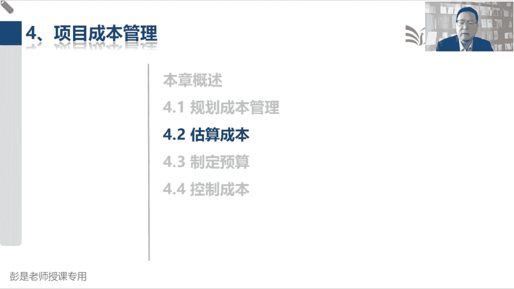
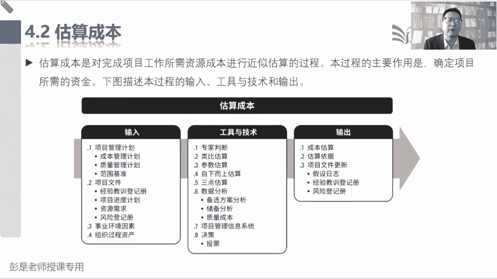
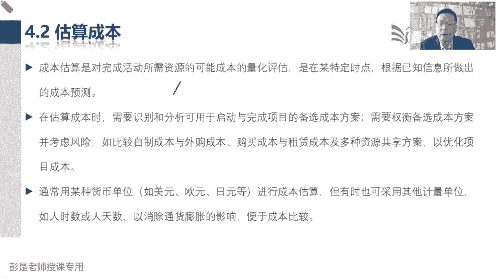
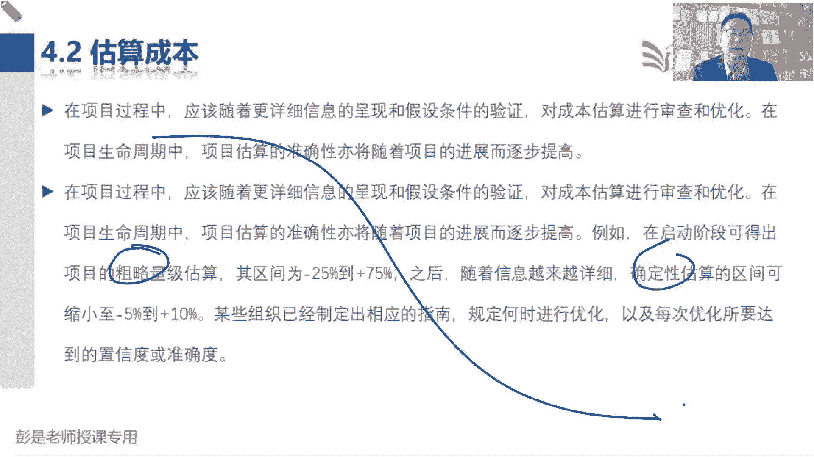
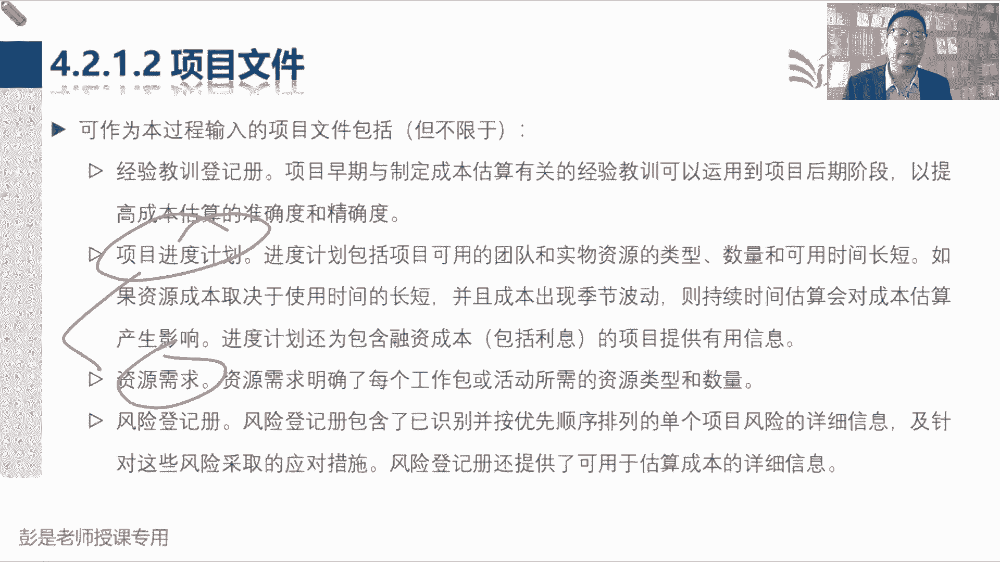

# 2024年最新版PMP考试第七版零基础一次通过项目管理认证 - P38：2.4.2 估算成本 - 慧翔天地 - BV1qC411E7Mw

4。2估算成本，拿眼睛一扫，没东西，过了，它和估算活动持续时间基本上一样，唯一的区别就是我们还要考虑资源，在项目上的工作时间长度，这是刚才做好的进度计划，对不对，讲一天课，讲两天课，劳动报酬不一样。

三个人五个人成本不一样，三个人工作三天，五天八天，成本不一样，所以我们要结合资源需求，结合项目的进度计划来算成本类比参数，自下而上，三点备选方案，储备分析系统决策都见过了，就多了个术语叫质量成本。

质量成本到质量这一章再讲，并且刚才其实给大家做个铺垫，我们为了降低项目的成本，可能导致人家三天两头出问题，他背着抱着一边沉呐，甚至的甚至他可能产生恶劣的影响，所以呢我们要有大局观。

考虑周全考虑周全考虑周全，这就是COQ后面讲质量这章再说了，所以他其实估算时间，估算资源，估算成本，这仨过程真的你搞定一个就差不多了。

好那它具体的文字有没有值得看的吗，这句话听一遍就完事了啊，说估算成本的时候，我们要考虑各种各样的方案，为啥呢，就像各位同学啊，你是买共享的，买自行车还是骑共享单车，这不是多种方案吗，那如果只看钱。

只看钱，买一辆自行车，可能需要100块钱，每年骑共享单车，你包个年卡呀，包个月卡呀，可能一年那大于100块钱呢，如果只看钱，那我们做决策的时候应该是买车，对这叫成本效益，那除了看钱还要看什么呢。

多标准决策分析闪亮登场，我们还要考虑很多其他因素呢，对自己买车呀还要打气，万一轮胎坏了还要维修，还要保养，还要防丢万一呀，今天骑完车跟人家喝凉喝顿酒，这自行车又不能扔在那，还要骑回来，好累呀。

共享单车就省事了，也不需要修，不需要维护，骑到哪儿一扔就完事了，现在可能有些北京管的比较严啊，不能随便扔，有的地方是有有限有限制的，但是还是方便找个方格子把把它往里一扔，不用担心丢，对不对，也不用维修。

不用保养，考虑了很多其他因素，最终做出了一个理性的决策，还是骑共享单车比较方便，这就是备选方案分析，多标准决策分析，成本效益分析，所以这段文字就在说这些东西啊，停一停，知道怎么回事就够了，考试来说。

不会考复杂的决策的，不会考复杂的决策的，简单决策呢现在也不值得一考，买一辆车需要100块钱，租一辆车，150块钱花钱怎么便宜怎么来，这种题现在基本上也不考，太简单了，好，这句话不解释了吧。

通常用货币单位进行估算，人民币啊，美元啊，欧元啊，但是呢这个钱呐，这个钱尤其是外币外汇结算它可能有波动啊，所以呢为了消除这种波动啊，什么通胀的影响，我们用人识人天也可以听一听就够了哈。

好的新的知识点来了，新的知识知识点是什么呢，先标一标吧，这个数字现在也不要求去背太细了，听大道理，所以呀项目早期，项目早期还记得那个交叉线吗，不确定的程度最多，因为什么呢，因为项目建立联系。

项目早期啊信息啊通常都比较粗略，信息不足，没有太多的细节，这种情况下，我们估算出来的时间和成本不一定准，那通常没有太多细节性的信息，之前就一拍脑袋差不多就行了，用类比估算，类比估算的特点就是快。

一拍脑袋差不多，但是缺点呢就是不一定准，所以通常得出的估算结果叫粗略量级估算，它允许浮动的区间，获得25%到正的75%，如果一拍脑袋，这个项目大概预算是100万，那他允许偏差的范围就是75万到100。

75万，开口比较大，那等规划阶段的末期，随着工作的开展，咱收集需求，定义范围，创建WPS定义活动，估算资源时间成本，这些工作都做完了之后，得到的估算结果应该越来越准，这就是项目渐进明细的特点。

那准到什么程度呢，确定性估算它允许偏差的范围，负的5%到正的10%，所以还是这个100万的项目，他应该差不多95万到110万，开口变小说明靠谱，这个生活常识科普，开口越大越不靠谱，开口越小越可靠越靠谱。

什么意思呢，明天今天晚上约张三吃饭，就说这个吧，18。30左右左多少右，多少呢，左四个小时，右四个小时，我开口这么大不靠谱，18。30左右左右多少呢，左10分钟又10分钟哎，开口变小了靠谱。

所以开口越大越不靠谱，开口越小越靠谱，这就是那个控制临界值，十十天加减20天，开口太大不靠谱，就这意思啊，这个临界值啊也不能太太过分，对不对，公司规定九点钟上班可以迟到30天，这神经病太不靠谱了。

好知道意思啊，所以大概这两个术语有一丢丢印象，粗略量及估算确定性估算，就像刚才那个场景，像项目经理明细这个特点啊。

那再往下什么什么这都这都没什么肯定的，就是所有需要的钱都要考虑周全对吧，做饭吃席，原材料的费用，烧火的费用，人工的费用，设备设施的费用，倒垃圾的费用，发红包的费用都给他考虑清楚啊。

总之所需要的钱都搞理清楚，甚至这种通货膨胀的补贴，通货膨胀大家知道是啥吗，稍稍科普一下什么叫通胀啊，什么叫通胀，粗暴理解，唉钱不值钱，这大家有共识，要钱是在贬值的吧，就参考参考啊，说今年今年。

今年的100块钱和你10年前小时候的100块钱，等价吗，去超市转一圈就知道了吧，对不对，去超市转一圈就知道了吧，它不等价了，因为贬值了，因为物价涨了诶，这就是我们要考虑这个因素，然后融资啊。

融资不解释吧，你借贷款借高利贷，人家收你利息，没有无缘无故的爱好好，所以总之涉及到的所有的钱，方方面面的因素都把他考虑清楚，都给他算出来，所以前面有一个东西之前还可以讲一讲算法，现在基本上也不讲了。

就是那个净现值这个超重要，尤其是各位同学，未来你项目项目项目金额比较大，周期又比较长的时候要考虑这个东西了，因为这玩意儿你不算不知道，一算挺吓人的，拐个小弯啊，净现值是什么玩意呢，这是因为钱在贬值对吧。

通胀率，通胀率你要考虑这个钱呐，今年的100块钱，今年的100块钱等于去年的多少钱呢，明年的100块钱等于去年的多少钱呢，这就是净现值，它这个道理，如果项目周期太长。

未来你项目里面可能甲方多长时间付个款，甲方甲方多长时间打高款，然后你项目中可能会每月给大家发工资，房租水电有各种各样的支出，那如果周期太长，你需要考虑了，把所有未来的这些钱呢都换算到今天，都换算到今天。

这种情况下，再拿所有收入的现值减去支出的现值，如果还能够大于零，才说明真的有钱赚，否则很可能是亏损的，为什么呢，假设啊不好算的，好算的，假设通胀率5%，通胀率5%是什么意思啊，就是现在的100块钱。

一年以后需要多少钱才和他等价呢，105，今年的100块钱，一年以后需要105才能够等价，所以张三找你借钱，借了1万，一年以后还给你1万，你就赔了，对不对，至少银行利息大概现在百分之百分之一点几，2%吧。

至少没收，没收到利息你也赔了，那再考虑到通胀哪，哪怕是按照银行的固定利率给你，你仍然是赔了，因为没有跑赢通胀，所以对企业来说，衡量衡量项目选择的时候，至少至少要跑赢通胀率啊，不然就赔了哎。

一年以后的105约等于今天的100，那反过来算，一年以后的100等于大概多少钱呢，咱就用100÷105，100÷105，粗暴的理解啊，我数学不好啊，比如说大概等于0。9，大概等于0。9，你算一算。

如果你这个项目10年一年以后，100块钱等于今天的90块钱，就乘以一个0。9，两年以后收到的钱就是0。9的平方，要乘两次诶，大概0。8，然后980。7796103695104，594 15，越乘越小。

越乘越小，比如说8年以后你收到了100万，7年八年以后收到的100万，很可能只等于今天的50万，这就亏了就亏了，就这意思啊，所以周期越长，变数越多，就要找财务了，专业专业的人，找专业的专业的事。

找专业的人呐，要把这个东西要把这些因素都考虑进去，因为表面上看说我们拍脑袋一算，那这个项目成本50万，客户说给你100万，客户说20年以后给你100万，但是很多项目都是这么玩的，有的项目欠人家。

欠人家欠人家款，欠个10年八年很正常啊，10年以后你再收到100万，等于今天的多少钱呢，这么精打细算，精打细算啊，精打细算反而不值当了，就要考虑这个风险，有这个印象，够了好。

那再往下轻松加愉快的东西就来了。

后面就没有什么东西了，估算成本收入，刚才说过了，没什么需要去记的，稍稍这两个还是值得看一看的，因为他俩会影响我们的成本。

然后估算成本的输出就是赚的钱。

然后呢加上一个估算依据。