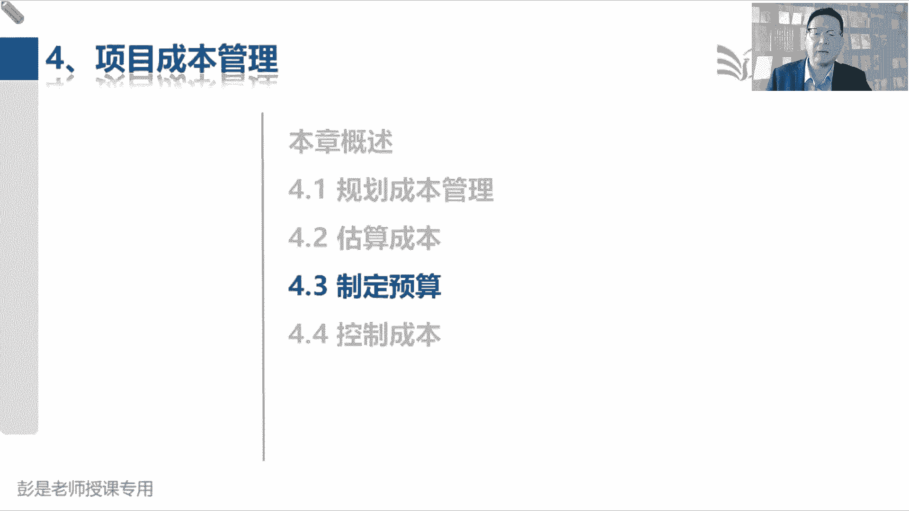
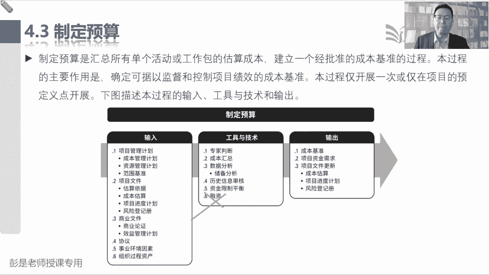
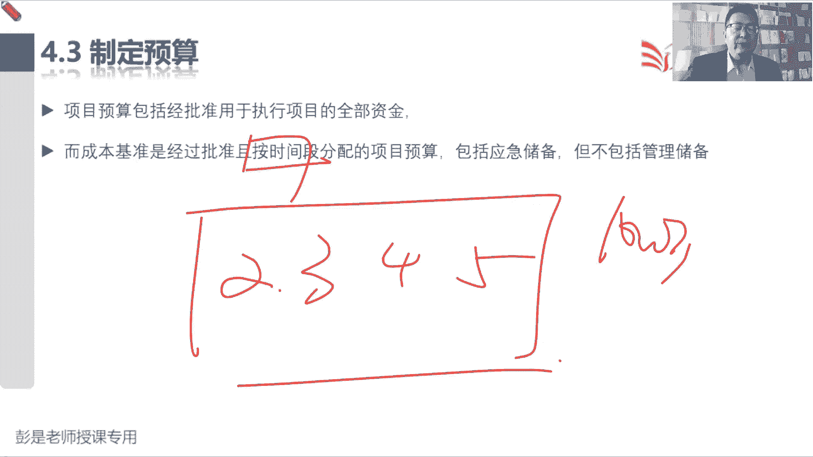
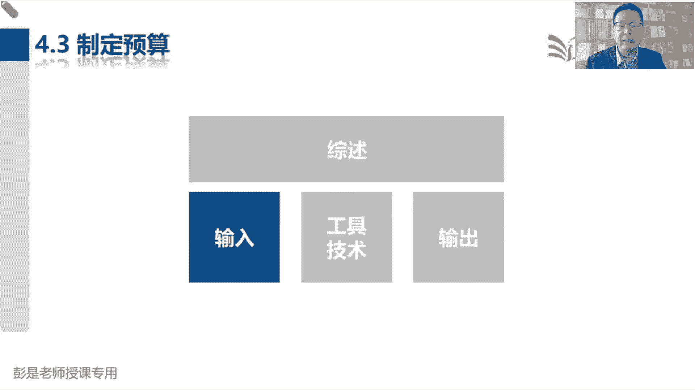
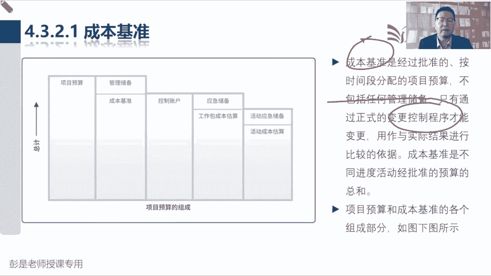
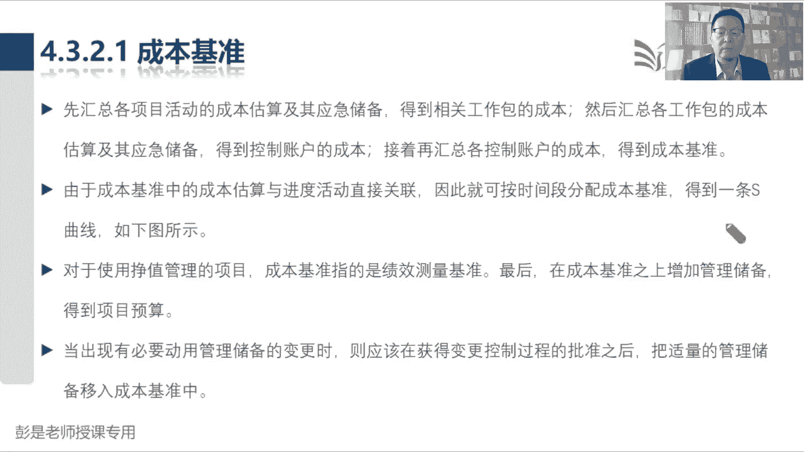
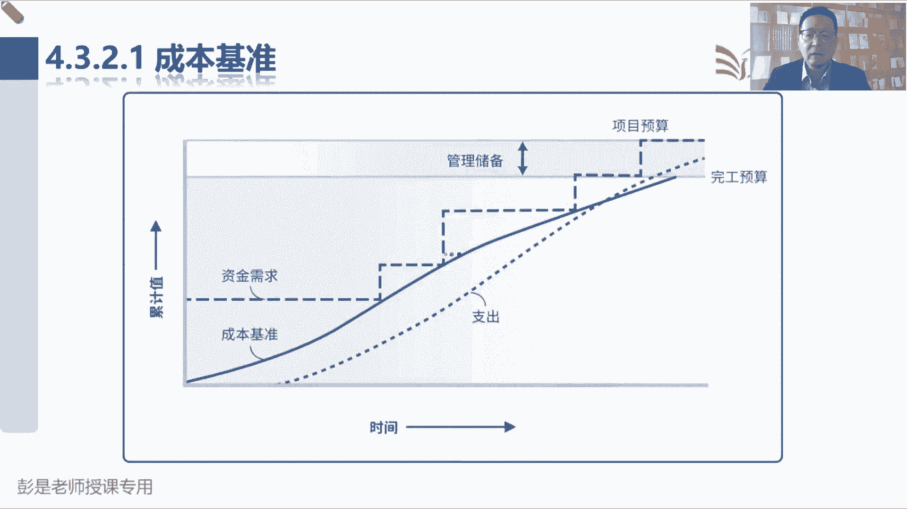
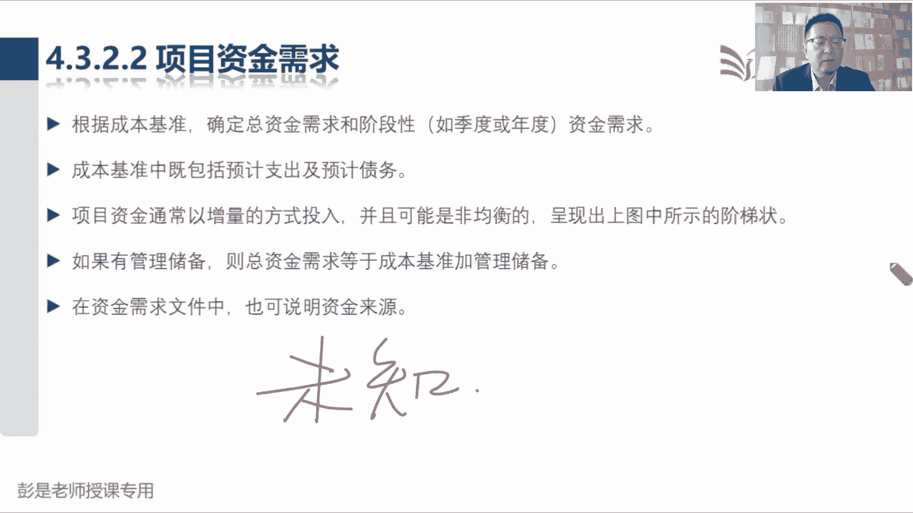

# 2024年最新版PMP考试第七版零基础一次通过项目管理认证 - P39：2.4.3 制定预算 - 慧翔天地 - BV1qC411E7Mw

制定预算这个管理过程，他眼睛一扫，输入没有新的知识点，就是把刚才算好的钱拿过来，然后我们逐级汇总就会得到两个东西，一个叫成本基准，一个叫项目资金需求，这两个输出一定要记住，刚才说的那几个逻辑关系。

实打实算出来的成本，加上已知风险准备的应急储备，这两个东西加到一起就是基准基准，再加上管理储备，就是我项目的预算，就等于总体的资金需求，那中间的工具啊，成本汇总，知道了储备分析，已知风险，未知风险。

应急储备，管理储备，知道了历史信息审核基本上也不大会考，各位同学能不能猜这玩意儿干啥用的，现在我们在做项目的预算，为什么要审核历史信息呢，道理想明白就不用记了，现在做项目的预算。

为什么要查历史信息还没错，龙飞同学说到点了，就是借鉴，就是参考就是参考啊，对不对，今年接了个活儿，给人家盖个住宅小区，我大概一算这个预算啊，100万，然后去年刚好做了一个差不多的项目。

去年那个项目翻一翻当时做的预算啊，看看是多少，去年预算90万，今年为什么100万诶，有较大的出入，较大的偏差，那要去分析了，为什么为什么会出现这样的情况，是人工涨了还是物料涨了还是什么原因。

对还是说我算错了，避免避免算错了，就这意思吧，哎这就是历史信息审核，大概听一听，知道这个意思啊，考试基本上不大会考考试呢，考试的场景不不考这些术语，考试的场景一定是大家很容易理解的场景。

做完了项目的预算，要不要结合刚才那道题，要不要结合过去类似项目的经验教训，对不对，以史为鉴的，看看现在项目计划的正确性，完整性，偏差大错误的话能回头改吗，改呀知错就改呀，对不对。

但是你改不得有正当的理由吗，师出有名啊，由于本人管理工作失误还是什么原因，导致算的东西不准，并且计划制定的过程中没有经过审批，想改随时改，计划制定完成，一旦经过了批准，有了基准，要想改走流程。

这一一说有各种可能性了哈，好资金限制平衡能猜到是什么东西吧，这个也超好理解，资金限制由于受到资金的限制，所以要平衡资金的支出，由于受到资金的限制，所以要平衡资金的支出，平衡资金的支出。

就有可能调整我们的进度计划，所以变成大白话，就是啊今天是3月17号，上半个月花钱花多了，下半个月没钱了，穷我下半个月还想换个手机，怎么办呢，往后推一推，推到4月份再说，下半个月4月份有钱了再说。

这就是由于受到资金的限制，那我们要平衡资金的支出，可能会调整进度计划，就这个道理听一遍就完事儿了吧，好融资根本就不解释了，借钱什么贷款啊，高利贷啊这种东西啊，好，所以这个管理过程虽然有一些工具。

比较有特殊性，但是呢基本上不大会考，并且看名字不太容易猜错了就不用背了。

好再往下翻，超重要，前两句话，项目预算包括所有钱，它就等于基准加上管理储备，而成本基准经过批准的，按时间段分配的项目预算，包括应急储备，不包括管理储备，记住那个随便写几个数字，成本15万，应急储备3万。

管理储备2万，基准18万，哎，基准18万，整个资金需求一共需要20万，知道这个结构，知道这个逻辑关系就可以了啊，按时间段需要解释吗，今年今年上学，2月份开学，3月4月五月跟老妈说。

这学期一共需要1000块钱，每个月二百五，这类东西，按照我们按照我们的进度，是月季度年把这个资金给它分配进去。

好输入没东西了。

输出没有新的知识点，输出这张图啊，只是示意可以不看的，不看不看不看不理解，管理储备啊，穷家富路，听过没有啊，出差算一算酒店交通住宿餐饮需要100块钱，就真带100块钱吗。

不得考虑一些已知风险和未知风险吗，管理储备就是用来应对应对意外的高低，兜里面揣100块钱零钱，以防不测，不知道这钱干嘛的，但有可能用得上，有可能会出现各种各样的意外，只有这个东西啊。

好再往下4321图可以不看啊，看完了容易误会，主要以文字为主，成本基准是经过批准的，不包括管理储备，什么叫意外呢，就是没有认知的事情啊，适应同学有认知的事情就叫已知风险，应急储备了，没有认知。

不知道会发生啥，不知道会发生啥，没有认知的事情才叫未知风险，这意外到底是什么呢，他是我不知道不知道，我也不知道，没有人知道，就这样理解啊，好所以有没有认知取决于什么呢，取决于每个人的见识。

有见识的人就会考虑到更周全，因为很多东西对他来说是已知的，没有见识的人就不知道一无所知，初生牛犊不畏虎，老虎对初生牛犊来说就是未知风险，它不知道它是什么东西，对老牛来说就有认知，因为它知道它会吃了。

你这东西没有那么复杂啊，超简单的东西好，再往下了啊，成本基准不包括任何管理储备，必须走流程才能进行调整，知道了吧。

好后面再说，汇总不念了，就想到那四个层级，一定要记住活动工作包控制账户，最后项目从下往上逐级逐级逐级做汇总，然后呢这个术语啊稍稍有一丢丢音箱就可以了，叫S曲线，因为实际上对项目上来说呀。

我们在不同时间点需要花的钱，需要产生的成本是不一样的，它不一定是直线对，有的时候吃得多，有的时候吃的少，他不一定是直线，嘿有每个月月初需要交手续费，然后月中就不需要交钱了，月初交房租，月中不需要交了。

所以它通常来说是弯弯曲曲的，既然是弯曲的不值就叫S曲线，因为S这个字母不值，这就有点印象就可以了吧。

嘶好，所以书上给的这个示意，这张图现在大家不一定看得懂，能看懂，最好看不懂没关系，等讲到工具技术，政治分析的时候再看就可以搞定了啊，总之就得到一条弯弯曲曲的成本基准，哼。

然后4322项目资金需求这个输出啊。

看完名字不想看字了，这是一共需要多少钱，还是这个知识点，总体的资金，资金需求等于成本基准加上管理储备，所以什么叫未知风险还需要解释吗，唉出差去北京可能会堵车，可能会航班延误，可能会酒店涨价。

这对于我来说都是已知风险，准备一些应急储备，另外不知道会发生啥，再准备点管理储备，出差去东南亚，去印度，去以色列，去乌克兰，还未知的东西很多呀，多准备点钱吧，这样心里踏实，取决于我们对这个世界的认知啊。

听听就可以了，好。

再往下拉啊。