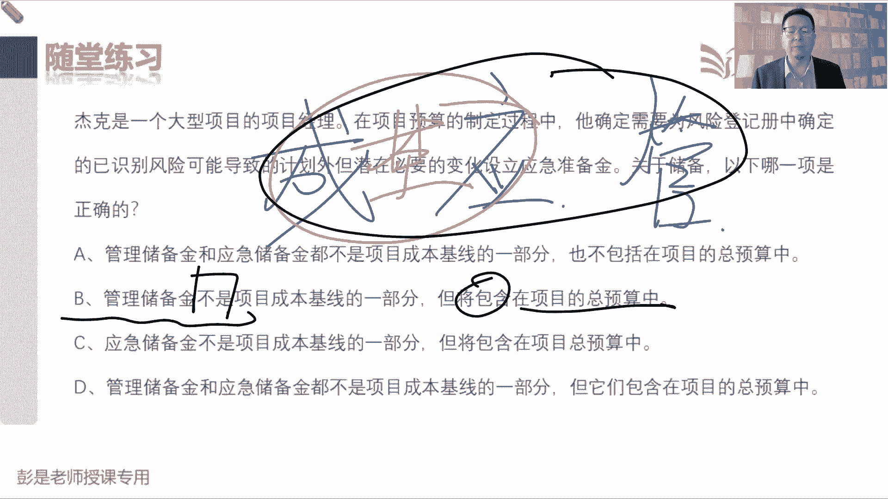

# 2024年最新版PMP考试第七版零基础一次通过项目管理认证 - P40：2.4.4 控制成本 - 慧翔天地 - BV1qC411E7Mw

4。4控制成本，大家复习起来超级轻松加愉快，虽然这一大段东西很重要，但是呢不着急，等讲到政治分析，基本上10分钟就搞定，基本上10分钟就搞定这些术语，所以现在不需要掌握，大家后面做那个课后练习题。

做做到成本这一章课后练习题的时候，遇到这种政治分析的这种计算题呀，都可以跳过的，等讲完工具技术再复盘就够了，不着急啊，那他的输入输出没有新的知识点了，数据信息变更，请求做个预测。

所以这个管理过程一秃噜就过去了，这句话先标一标，标的目的不是给现在的你们听的是穿越啊，讲给未来的你们，各位同学，等咱学完了工具技术，您在复听这段课程的时候，在复看教材这部分文字的时候。

就很能够理解这句话的意思了，其实超简单，其实超简单，先给你说一说，只监督资金的支出，不考虑这些支出所完成的工作价值，没意义，为什么呢，这叫管钱不管事儿，这叫管钱不管事，什么叫管钱又管事啊。

什么叫管钱不管事，粗暴的听个场景啊，我喜欢吃麦当劳汉堡，我下周周一周二周三周四周五，我计划计划每天都吃个麦当劳，吃辣腿堡不吃我就死给你看，所以我下周的资金需求，就是每天需要十块钱买汉堡好，然后呢。

周一啊周一啊，打开打开美团，打开饿了么app，发现里面有券可以团购，一次买五个汉堡，一次买五个，怎么说买四送一，买四送一，这样呢，我用了40块钱就一次预购了一周的汉堡，这还能听懂吧。

用了40块钱就买了五张券，一张券可以兑换一个辣腿堡，那现在如果我们只看资金的支出，就会得出结论，周一想想偿你，我媳妇儿，周一啊，你应该只花十块钱，为什么我看你支付记录花了40块钱，超支了。

这就叫管钱不管事，只监督了资金的支出，对不对，那什么叫管钱又管事呢，你还要看我花40块钱干了多少活了，我花了40块钱买了五个汉堡啊，这一周总体上来看，最终呢我只花40块钱，就完成了50块钱的工作。

省钱了，这个叫管钱又管事，所以我们要关注，花了40块钱到底买回来多少个多少个汉堡，买回来多少个汉堡，这就是完成的工作呀，这就是政治分析，这个只要听懂了政治分析后面的内容就讲完了，没有东西了。

好在咱们自己听一听，所以呢正成本分析成本控制之中，我们要重点分析花了多少钱，干了多少活，花了40块钱买回来五个汉堡省钱了，花了60块钱，就跟刚才同学说的啊，一个汉堡三块钱，三个汉堡十块钱，这才叫超支呢。

这是神经病，对不对，一个汉堡三块钱，然后买二送一或者是满三减多少，还剩钱了，是这意思啊，了解就可以，所以后面就一大堆文字来解释，控制成本主要做什么事情，这段文字呢看一遍就完事了，不念了，好输入输出。

下班打完收工，资金需求啊，都是没有新的知识点，大家后面复习的这段内容啊，基本上就是看一下，知道意思就够了，只要听懂刚才麦当劳这个场景就过去了，好，那接下来各位同学再花一点点时间，看看成本这一章。

这几个管理过程，还有涉及到那堆什么固定成本可变成本，机会成本，沉没成本可，然后什么什么直接成本，间接成本主要就那几个术语，大概有印象管理过程，输入输出基本上没有太多的考点，主要就是那个成本基准。

资金需求，应急储备，管理储备，把这几个单词那个逻辑关系给他搞清楚，就差不多了，好看这道题，简单吧，规划成本管理，估算成本，制定预算，控制成本成本这一章，在规划过程组最后一个管理过程，我们要输出成本基准。

所以呢答案就是A制定预算，这个管理过程出成本基准没有D这个术语，那这道题呢，这，是啥，这是成本管理的规矩，成本管理的游戏规则，对不对，所以呢恭喜大家答对了啊，这就是成本管理计划。

你把这个计量单位换成时间，就叫进度管理计划，一个道理哈，说我们时间上要四舍五入，然后四舍五入我们计量单位计到天就行了，寄到天就行了，然后呢允许偏差的临界值5%，迟到个5分钟没关系，这就是进度的管理计划。

出这些什么准确度，精确度，计量单位控制临界值，好这道题就是字多呀，项目A这么多钱，项目币这么多钱，最后他们的结论是选择启动项目B，选择了B放弃了A做这个决策，放弃掉的最大值，这是机会成本吧。

所以呢答案就是48，这个题选啥呢，刚才依稀说过那个术语哈，现在告诉我们那个大道理吧，不是惊险值啊，说你估算一个成本要求，只要使用产品就要包括维护，安装和保养成本，就是你买的时候有的东西卖的便宜便宜。

通常没好货呀，你还要考虑买完了之后他未来呀维护啊，安装啊，保养啊，运维的成本，这就叫什么呢，全考虑周全的，这叫全生命周期成本，就像大家买的车，买的什么家用电器，有的东西虽然表面上看起来便宜。

但是呢维修啊保养啊，三天两头出故障啊，哎呀总要换零件啊，他整体上来看反而会贵，这是告诉我们要有这个大局观，把它考虑周全，就到生命周期成本计，现时出现的场景一定是时间长，钱贬值通胀，那我们考虑这个因素。

把未来所有的钱都换算到现在，然后呢再去做减法，如果这种情况下减下来仍然大于零，才说明有钱赚，所以净现值大于零，说明有钱赚，越大越好，折旧这个术语稍稍有一丢丢印象就可以了啊。

以前还会给大家说一说折旧是什么东西，折旧怎么算，现在叫什么直线折旧法呀，双倍余额递减法呀，联合法呀，现在这种算法也不考，但是这个单词大概有印象就够了啊，折旧是什么玩意儿，就是东西呀买回来之后不值钱。

那中间损失的这部分钱就叫折旧，你花10万块钱买一辆车，一年损失多少钱呢，可能少2万诶，这2万块钱就叫折旧额，了解就可以了，折旧这个钱也是成本，折旧的钱，折旧的这笔钱也是成本的，因为对企业来说。

这钱我们损失了，这不就是成本吗，好所以算折旧，算折旧是为了最后算完成本，算利润，算完利润算奖金，要考虑这个单词，稍稍有点印象，基本上不会考这个算法了，那再往下看看这道题，嘉伟同学不会这么问的。

不会出这种很很初级的概念题，你考试不可能看到这种概念题，如果他真的想考计量单位，一定是给出明确的条件，不会让你去猜的，好这道题答案是啥呢，恭喜大家，大部分同学答对了，答案就是B吧。

说一个软件项目执行期间，一个程序员通知你发现一个设计缺陷，可能要求团队返工做一个重大的成本变更，处理这种情况的最佳做法是什么呢，A选项说让程序员咨询其他成员，再来给你提建议，这种选项通常不选。

为什么显得我们唉无情无情不热情，对不对，啥都不管，这不行啊，B确定这个变更会给项目带，项目约束带来什么影响，遇到问题积极主动解决问题，确定影响，这是可以的，停止工作，神经病更新神经病，所以能选的就是B。

D选项太被动了，并且题目说可能存在着不确定，不确定不确定的东西，直接就更新，这也不对啊，好这道题呢NPVNPV就是净现值，这道题选什么呢，第一次做这道题的同学可能会纠结啊，会选D。

没有足够的信息来选项目，那为什么不选D呢，为什么不选D呢，项目A的净现值是7万5，内部收益率1。5，启动资金1万5，项目B的净现值是6000，BCR效益成本比二比一，项目C的净现值是8万。

包括机会成本3万5，这三个项目啊，像什么内部收益率啊，启动资金啊，机会成本啊，BCL啊，这几个指标，这几个指标这三个项目都都不一样，所以呢它没有可比性，但确定的是什么呢，ABC3个项目。

二项目CNPV净现值等于8万块钱，净现值大于零越大越好，所以选项目C证明我们掌握了一个知识点，我们知道净现值大于零越大越好，所以简单决策就可以，NPV净现值越大越好，看一看效益管理计划那段知识点吧。

要反复巩固啊，回收期多长时间收回成本，赚钱不赚钱，不知道其他指标，记得住的，记不住的，这些玩意儿需要大于零，说明有钱赚，还有一个指标BCR它需要大于一，说明有钱赚，机会成本跟那个赚钱不赚钱。

也没有必然的因果关系啊，对不对，放弃了3万5，不代表着说现在做出这个选择就赚钱，判断不出来吧，A公司说给你3万5，B公司说给你零，C公司让你倒贴，倒贴十块钱，嘿他跟那个赚钱不赚钱，判断不出来的啊。

所以最后给结论没有可比性，没有可比性，没有可比性，也不会考复杂场景，这位同学不会说一个项目啊，给了你净现值，给了你投资回收期，又给了你BCR，给了你很多很多相同的财务指标，让你做取舍，这不可能不现实。

因为实际工作中，你肯定要考虑很多很多很多因素，配以不同的权重，既要考虑回本的周期长短，还要考虑利润的能占到百分之多少的，还要考虑投资呢初始初始初始投资是多少啊，对初始投资太多了太多了，咱也扛不住啊。

还要考虑什么时间能收回多少钱，考虑很多因素的，不会考这么复杂的场景，所以大家答题技巧之一就是，每道题只要知道这个知识点就够了，我们不是找一个选项，来解决所有项目中的实际问题，这不科学，对。

找到一个代表着我们有知识点的选项，所以答案是C，好再往下拉啊，粗略量级送分题，项目早期信息少比较粗略，项目后期信息多比较细化，粗略呢就是偏差比较大，负的25%到正的75%。

确定性估算的负的5%到正的10%，稍稍有一点点印象就可以了，这种题现在考试也不考，好看看这道题选啥，恭喜小丸子同学中招了，这道题实际上就是纯文字游戏，考试也不会说话，不会这么阴险的说。

你在管理一个软件项目，一个干型提出一个变更，会影响预算，以下哪一项定义了，未实现这个变更所需要遵循的过程，49个管理过程的过程找吧，ABCD哪一个是管理成本变更的管理过程的。

所以是A控制成本绩效变更绩效变更，答案就是A监控过程组，它不是管理过程，CCB是我们一个决策机构，它也不是一个过程啊，成本绩效基准是我们最后的结果输出，它也不是过程，能选的就是A了，文字游戏啊。

好这道题呢，看完选项就不想读题了，恭喜大家，问题不大吧，成本已知风险应急储备，未知风险管理储备，然后画个圈圈，这叫基准，再画个大圈，这叫预算，总体的资金需求好，所以恭喜大家答对了啊。

管理储备不是成本基准的一部分，但是包含在项目预算之中，需要准备这笔钱，但是呢它不是衡量我们的绩效的基准。

好这就关于成本这一章，相对来说信息量其实没有这么多，规划成本，估算成本，制定预算，控制成本，它的输入输出，甚至工具基础和进度，这一章基本上差不多，后面复习的时候啊，没必要花那么多时间去仔细琢磨它啊。

唯一和这进度这张区别稍微大一丢丢的，就是制定预算还画错了，画错位置了，就是制定预算这个管理过程，因为它涉及到一些什么历史信息审核呀，资金限制平衡啊，要把这个概念稍稍有一丢丢印象。

这就是后面复习看的会比较快，然后那个政治分析做课后练习题的时候，先可以跳过它，等咱讲统一讲工具技术的时候，再把它搞定就可以了，并且只要刚才课上那个管钱不管事，那个案例能听懂，政治分析其实已经学完了。

他就是这个东西好，那咱给大家再休息一下，然后呢，今天还有一点点时间。

