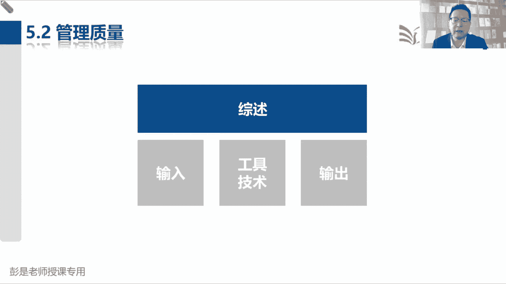

# 2024年最新版PMP考试第七版零基础一次通过项目管理认证 - P42：2.5.2 管理质量 - 慧翔天地 - BV1qC411E7Mw

所以管理质量的同时趁热打铁，拿到刚才的质量测量指标，然后呢我们就写测评文件，测评文件就是怎么测试，给人家写一个测试用例，测试方法这种东西吧，好然后他这个管理过程啊。

第一个小逻辑就是质量测量指标出测评文件，第二个小逻逻辑是什么呢，就是根据我们指控指控做检查，做测试的这个测试结果写质量报告，质量报告就是全面总结项目的过程，质量结果质量让领导放心，过程合规，结果合规。

这就是质量报告的内容，大概这么两个输入对输出，那它虽然看起来工具技术很多呀，虽然看起来很多，先给大家讲，先给大家讲两个单词啊，一个单词就是刚才我们在讲课的时候。

说到的术语叫质量保证QA，质量保证，这是我们工厂保证生产过程合规，就这个事儿保证生产过程合规，该戴口罩，戴口罩，该消毒消毒，该把蟑螂赶出去，铲出去，定期的洗一洗我们这个锅碗瓢盆啊。

唉所以它主要主要主要方法就是带工具，通过审计可以检查我们生产过程，加工过程的合规性，这就是质保它的主要工作，审计就是看一看你们实际的过程合规不合规，昨天昨天做火腿肠的时候，有没有戴口罩，有没有戴手套。

有没有消毒，有没有清理老鼠，有没有打扫垃圾，通过审计检查我们过程的合规性，记住这个话说啊，审计记过程看合规，那除了质量保证啊，管理质量管理过程，第二个重要的事情，就是刚才我们听过的另外一套术语。

叫PDCTQM6西格玛，精益六西格玛诶，这些东西这些方法的主要作用是什么呢，他不关注合规不合规，他关注的是不断的改进，我们的过程，就像什么提高质量啊，看看人家最佳实践啊，降低成本的提高效率啊。

他更关注的是过程的持续改进，这就是管理质量，第二件事情。

所以找工具了，这个管理过程需要记一些有代表性的工具，从下往上看，审计检查合规性，这是质保记过程，记过程发现缺陷差距不足，发现不合规，然后整改查结果，看缺陷修正，那除了审计啊。

第二件事情就是质量改进的方法，PDCA6西格玛，这就是持续改进，不断的改进我们的过程，这就是管理质量，第二件事，第三件事情就是面向X的设计，叫design for x，面向X的设计设计的是什么呢。

这是产品，是说我们在做产品规划设计的时候，要把它的方方面面都考虑到，这个产品有什么功能啊，属性啊，特征啊，有什么质量要求啊，这个产品怎么生产呢，怎么封装啊，怎么打包啊，怎么运输啊，都给他考虑周减了。

就是考虑考虑这个产品，从从生产加工制造运输功能属性全面考虑清楚，提前做好产品的规划和设计，这就是他的主要工作，所以管理质量三件事情，质量保证过程改进产品设计，哎这是对标到即工具五，工具六和工具八。

然后这个问题解决超级重要，后面会单独说，它其实是通用的方法，告诉我们遇到问题怎么解决，给了一个思路和遇到变更怎么管理，那个思路一模一样，都是告诉我们一个框架性的思路啊，定义问题，分析原因，定方案。

选方案，执行落实跟踪效果，就这套东西后面单独记，然后其他的工具技术啊相对来说比较重要的啊，核对单咱见过了吧，备选文件分析分析，这都不重要，都听过了，清河图见过了吧，收集需求的工具，对相似的需求做分组。

所以高频考点就剩这个因果图了，天黑请闭眼啊，讲完这一小段咱就下课，然后呢下节课再讲5。2，狗尾续貂好，所以相对来说比较重要的考点就是这个因果图，因果图干嘛用的呢，为什么会出现这样的后果呢，原因是啥。

为什么这个火腿肠吃，为什么这个火腿肠吃完了，吃完了觉得不舒服呢，嘿找原因，找原因，找原因，所以它的主要作用就是找导致问题的根本原因，刨根问底啊，打破砂锅问到底，那为什么叫鱼骨图，苏达同学说。

为什么叫鱼骨图呢，后面讲工具的时候再说了，这是因为通常制造业质量这一章，基本上都是制造业出来的这些工具，这些方法，这些理念就是啊，我们生产线生产的生产火腿肠二，通常导致最后生产出来的火腿肠不合格。

就什么六大块原因叫人机物法环测，人的原因，设备的原因，物料的原因，工艺方法的原因，测试方法的原因，环境的原因，人机物法环测对不对，车间里面全都是污水垃圾，苍蝇蚊子臭虫蛆蟑螂诶，它可能导致最后东西不合格。

物料就是那些什么淋巴肉对吧，什么什么鸡骨头这种东西啊，可能导致不合格，工人呢不洗手，不戴口罩诶，往里面吐痰扔烟头，这是人的原因，设备我们这个设备啊3年了，从来没擦过，没清洗过，导致里面很多微生物。

这是设备的原因，方法工艺我们根本就没有方法，用了一大堆化学添加剂，还方法的原因，最后呢就是测试没有人测试，没有人测试，所以通常从这六个方面去找，导致问题的根本原因，这是鱼骨图，后面看工具。

你看那个图示意，一眼一眼就能看懂好，剩下的什么流程图，直方图，矩阵图，散点图，矩阵三点后面会单独说，这是一对好朋友，但是呢考到的概率也很低，流程图见过了，直方图，刚才也说过了吧，这是统计。

统计什么工作量啊，统计什么问题啊，缺陷啊，还想统计查统计差，用这种长条长条更直观，看起来好，所以这个管理过程今天我们先讲到这儿，大家下次上课之前复习的时候一定先搞清楚啊。

刚才反复说了这两个非常重要的东西，一个叫质量保证，一个叫过程改进，保证看合规不合规，所以呢是审计改进呢就是不断的PDCA，P d c a，所以对标的质量改进方法，PDCA又西格玛这两个工具。

这是一定要预习的时候，复习的时候搞定的东西啊，然后呢，在复习呢就是看今天讲完的这些前面的章节，做章节练习题，关注班主任在群里发的公告和通知啊，好各位亲爱的同学，咱们今天的时间浮动5分钟。

说到做到现在34。

那各位同学今天听课一天，辛苦了啊，那咱今天的课程就先讲到这，下次上课再见，各位同学给我拍个照，发现啥记录啥，把我讲课进度拍下照，拍下照，这样呢下次上课就不会忘了讲到哪了，好不多说了啊，天黑了天黑了。

这个视频看起来像鬼一样，就不耽误大家的心情了，今天已经让大家心情不好了，好各位同学拜拜，该吃吃该喝喝，心情永远是我们健康的最大武器，拜拜啊，各位同学早上正式开始，今天上午的课程，上节课讲到了5。2。

管理质量，回顾一下之前都说了什么东西啊，说咱收集需求，定义范围，创建WPS，分别得到需求文件，范围说明书和工作分解结构以及还有词典，然后呢把范围说明书，WBS还有词典当做我们的基准。

关键相关方一批准变成了范围基准，规划范围的同事下班了，到了进度这一章，咱规划进度管理，然后定义活动排列，活动顺序，估算活动持续时间，需要先估算活动资源，最后呢在制定进度计划，就得到了项目的进度基准。

确定了所有日期时间的这种进度表，就是进度基准，然后到了成本这一章，我们去估算活动成本，制定预算主题汇总得到三笔钱，成本加上应急储备构成了成本基准，成本基准加上管理储备构成了项目的预算，那现在咱范围基准。

进度基准，成本基准，三大基准都有了，然后呢再往上加这三个这三个知识领域啊，范围进度成本你们不得规划一下怎么管吗，所以就分别有了规划范围管理，规划进度管理，规划成本管理，分别输出范围管理，计划需求管理。

计划进度管理计划成本管理计划，知道我们这些管理过程到底怎么管定规则，所以都叫如何开展这些管理过程的指导计划，那你们规划完了不得控制一下吗，所以又有了控制范围，控制进度，控制成本，关注范围的绩效怎么样。

管理好范围的变更，关注进度的绩效怎么样，管理好进度的变更，以此类推，那你们分别完成了规划课后，可控制项目经理也得干活啊，我们主要负责整合呀，所以在整合这一章，我们来了一个制定项目管理计划。

拿到各个知识领域的子计划，然后我们汇总，所以就是总分总先给各个知识，各个知识领域提出我们的总体指导，生命周期阶段划分开发方法，然后呢各个知识领域根据总体指导，分别完成各自知识领域的规划。

把规划出来的各种子计划和基准，交汇给项目经理，咱们一汇总，一整合就变成了整个的项目管理计划，就包括了九个子计划，三个单独的计划，三个基准，一个绩效增量基准好，这是规划，那控制你也得整合一下呀。

所以呢我们拿到原始的，拿到各个知识领域输出的当前知识领域的工作，绩效信息范围的信息，进度的信息，成本的信息，那这个信息我们最后交给项目经理，项目经理来汇总，变成整个项目的工作绩效报告。

那这信息从哪来的呢，就是指导与管理项目工作，这个管理过程是按照我们的计划去干活，然后呢得到可交付成果，除此之外，我们还会收集原始的工作绩效数据，数据呢交给各个知识领域的大臣，交给各自各个知识领域。

控制范围，控制进度，控制成本，这些管理过程由他们经过分析，用绩效数据和原始的工作计划做比较，看看有没有偏差，有没有出路，就得到了某个知识领域的绩效信息，所以呢执行过程组整合这一章，有了一个指导与管理。

项目工作，在家那干这些活儿之前不得得到授权吗，好所以在启动过程中，咱就得到了一个项目章程，制定项目章程，这个管理过程，通过项目章程给项目经理正式授权，标志着项目的正式开始。

另外看看工作中学到了什么东西啊，因为随着人员的流动性越来越高，可能知识会流失掉，所以呢加了一个管理项目知识，看看咱在项目中学到了什么东西，吃一堑长一智的东西，给他记下来，就有了经验教训登记册。

然后说呀范围有变更，进度有变更，成本有变更，咱们得整合一下嘛，所以在监控过程组整合，这张加了一个实施整体变更控制，不管是谁发出的变更请求，全都要交给项目经理，由项目经理进行综合的分析和评估，然后做决策。

唉这就是我们整合这一章到范围，进度成本，到了质量这一章就严格的按照五种水平去推导，指导与管理项目工作产出的可交付成果，通过范围这章监控过程组的确认范围，这个管理过程组正式验收，但是草率了。

安全一点的话呢，我们先内部做指控，所以有了控制质量这个管理过程，它对我们的可调不成果做检查做测试，看看它是不是符合要求，没问题的，就叫验核实的可交部成果再交给确认范围，又发起人客户进行正式的验收。

这是第二个水平，再往前走一步呢，所以有了现在马上要讲到的管理质量，这个管理过程他关注的是什么呢，关注的是过程的质量，确保确保想方设法确保我们过程的质量，符合我们的这些过程，符合我们的标准啊，政策啊。

程序啊，流程啊，规范啊，这样呢是为了更好的得到得到结果，所以管理质量三件事，质量保证过程改进产品设计，质量保证就是对我们的过程做审计，看看是不是合规过程改进，那就是PDCA6西格玛，什么全面质量管理。

精益六西格玛，把这些方法体系用到工作中，做到持续改进，第三个呢就是做好产品的规划和设计，那这仍然是只是过程中过程中适中啊，能不能做到事前呢，所以加了一个规划，质量管理，根据我们的质量政策。

让高层定质量的方针政策，根据这个方针政策去思考，我们需要达到的标准和要求，找到这些标准，看看具体的要求都有啥呢，所以除了质量标准，还应该出一个质量测量的指标，还有相关的测试方法。

质量的测量指标交给第二个同事，他去写测试评估文件，测评文件交给第三个同事，对我们的成果做检查，做测试，哎这就是质量这一章按照五种水平，从后往前一推砸过程就出来了，分别叫规划质量管理管理。

质量和控制质量规划质量管理，根据我们组织过程，资产里面的质量政策标准体系分析，我们需要达到什么样的标准，所以它的输出质量管理计划，里边要写清楚我们的标准，然后呢还有第二个输出质量测量的指标。

以及相应的这些指标的测试方法好。

那接下来5。2啊，管理质量三件事上节课说了吧，质量保证过程，改进产品设计，所以看教材上这段文字。

注意管理质量，巴拉巴拉，这都不垫了啊，然后说三件事是什么呢，质量保证过程改进产品设计，质量保证保证我们过程合规，所以怎么保证呢，就是做审计，然后过程改进，更关注的是怎么样提高我们这些过程的效率啊。

把一些无价值无意义的事情给他去掉啊，所以它主要用到了pd c a6西格玛这些方法，就对报到工具，第八个质量改进方法，第三件事情呢就是做好产品的规划和设计，因为我们在设计产品的时候。

不仅仅要考虑产品的功能属性特征，还要考虑到其他方面的产品的功能属性特征，其实是定义范围这个管理过程关注的吧，定义范围，一些范围说明书里面就包括了产品范围，产品范围呢就说清楚我们这个产品有什么功能。

有什么特点，那除了功能特点，你还得考虑其他的什么东西呢，这个产品怎么制造啊，需要什么原材料啊，方不方便安装啊，方不方便调试啊，方不方便运输啊，客户能不能自己组装啊，就以此类推啊。

我们要把这个产品的方方面面都给他考虑周全，所以这就是第六个工具叫面向X的设计，只要牢牢记住这三件事情就够了，质量保证过程改进产品设计，就对报的三个工具质量保证做审计，看合规过程改进。

pd c a6西格玛就叫质量改进的方法，最后呢产品规划设计，产品规划设计考虑到产品的方方面面，就叫面向X的设计，这里的X指的是产品的方方面面，就这个意思啊，就像大家天天用的什么手机啊。

电脑啊这种设备对吧，一运输在在运输的路上一颠就坏了，这也不行啊，这不是产品设计要考就考虑的事情吗，他就是不断的改进我们的产品设计，把产品考虑到更周全好，他其他的工具技术呢其实不太要求大家去背。

但是呢看到名字啊，等我们后面讲工具的时候再说了，看到名字大概能反应过来他主要工作是啥，那这个管理过程还记得吗，一对输入对一对输出啊，下一个管理过程控制质量，对我们的可交付成果做检查。

做测试就会得到它的输出质量控制测量结果，质量控制测量结果交回给5。2，管理质量，我们再去分析它的测试过程是不是合规，最后呢写一个质量报告，全面报告我们的结果的质量和过程的质量，这是一对输入对输出。

第二段输入对输出就是我们在规划质量的时候，输出了一个质量测量指标，里面除了指标，还有相应的测试方法，那我们去分析到底我们这个产品怎么测，哎，就写了一个测试和评估文件，测试评估文件交给控制质量。

交给下一个同事，对我们的可交付成果，根据测评文件进行检查，进行测试，这是一对输入对一对输出，其他的工具啊，看看名字能猜到就差不多了，核对单见过了，备选方案，文件分析都没啥的。

过程分析就是分析过程怎么改进，就是分析过程怎么改进，这不用记啊，根本原因分析呢就是找原因，多标准，觉得分析受够了，清河图，咱们在收集需求的时候用到这个玩意儿了，收集需求是说对我们收集到的需求的分组。

因为同一类的分组，同一类同一类的需求才有可比性，便于排序，所以是先对我们收集到的各种各样的需求，做分组分组之后呢，再通过名义小组做排序，那他在这个这个管理过程干啥事呢，其实就是变英国服务画因果图。

因果图的主要作用，这个是超重要的东西，因果图的主要作用就是找原因，说出现问题是为什么出现这样的问题呢，找原因找原因去推，去推演，导致问题的根本原因是啥，刨根问底，然后流程图见过了啊。

把流程画成图看起来更直观，直方图呢就是便于我们统计分析，统计数字的矩阵图和散点图，一对好朋友后面带角，稍稍有点印象就够了，考核的概率呀也没那么高，矩阵图是用来记录两组元素的关系强弱。

散点图呢是用来分析两两个元素，是不是具有相关性，所以他俩就是俩二，一个叫两组，一个叫两个，这些方法，这些方法它不一定只用于5。22，它可以用于很多管理过程吧，所以这个管理过程有代表性的工具啊。

说来来撤工的话，来回说，这是568审计面向X的设计和质量肯定方法，记住这三个工具，这个管理过程要开展的具体事情。

三个事情就清楚了，好那再往下看说后面那段文字，管理质量有的时候被称为质量保证，但管理质量的定义比质量保证更广，七因其可用于非项目工作，那在项目管理之中，质量保证做什么事呢，他着眼于项目使用的过程。

目的高效的执行项目过程，包括遵守和满足标准，所以呢他的主要工作就是用刚才那个工具审计，遵守满足标准不就是合规吗，那管理质量包括所有的质量保证活动，第一件事，第二件事情呢就是产品设计。

这是刚才说过的design for x，我们设计产品的时候，除了功能啊，还要考虑到其他方面的这个东西，咋运输咋安装，就像大家天天用的什么空调这种东西，对不对，空调这东西我们在车厢里组装好。

还是说到客户那边现场组装，然后怎么安装啊，方不方便运输啊，都给他考虑周全，这是产品设计，第三个呢就是第三件事情呢就是过程改进，过程改进呢就6PPDCA，六西格玛不断的改进我们的过程。

看看有没有什么无价值的过程啊，低价值的过程啊，以价值为导向，再高大上一点就叫意义，有些事情不一定有意义啊，比如说老板让我写日志，写工作日志，那我一分钟每每一分钟都写一下日志，每一分钟都写一下日志。

这就是无价值的活动，神经病浪费时间，对不对，你可能一个小时写一下还说得过去啊，半天写一下也可以，一天写一下也可以，好知道这个意思啊，所以这就是过程改进。

再往下翻了啊，说管理质量执行，在项目质量管理计划中所定义的一系列有计划，有系统的行动和课程，有助于这段文字呢，还是在说这个事情，通过执行有关产品特性方面的设计准则，设计出最优最成熟的产品。

就是那个刚才说过的design for x，考虑到产品的方方面面，然后建立信心，通相信通过质量保证工具和技术，比如审计，可以使未来输出，在完工时满足特定的需求和期望，关注合规性。

然后这个故障分析现在基本上也不大考，大概有印象能猜到吧，故障分析，故障分析，就是分析我们这个玩意儿什么地方会出问题，电脑出了问题咋整，写字板出了问题咋整，鼠标出了问题咋整，网线断了咋整。

就我们我们这个系统某一个环节出了问题，出了故障诶，我们有没有应对措施，它会不会影响我们实现整体目标，这里是故障数和那个失效模式，影响分析差不多的东西啊，稍稍有一丢丢印象就可以了，就像大家日常工作里面。

公司或者你家里对吧，WIFI坏了怎么办呢，光猫坏了怎么办呢，这网断了怎么办呢，家里停电了怎么办呢，唉都把这些因素给他考虑周全，看看会不会影响我们的工作生活，如果会看看要不要想出一些备选的方案。

以备不时之需，就这意思，然后第三下一行说，确保使用质量过程，并确保其能够满足项目的质量目标，最后呢提高过程的活动效率和效果，这就是过程改进，所以还是这三件事情啊，产品设计质量保证过程改进不断的改进过程。

就是PDCA6西格玛。

只要牢牢记住这三个东西，这个管理过程确实没东西了好，然后后面这段文字呢，基本上听一遍就完事了是吧，项目经理也可以组织质量保证部门或其他组织，来进行这些活动，什么故障分析啊，实验设计啊，工程改进的。

然后质量保证部门就是8888不念了啊，在传统项目之中，通常来说开展质量工作的叫专职敏捷，项目之中通常叫全员参与。

再稍稍有点影响，后面后面还会还会看到这句话。

好那这个管理过程的收入没东西没东西了，这个质量测量指标，质量控制测量结果刚才解释过了吧，所以大家标标重点。

后面复习的时候多少上两点，然后再往下这个管理过程的输出质量报告，质量报告的内容呢也不要求大家去背啊，这这过程的质量和结果的质量，过程的解释，过程的质量是不是合规呀，有没有什么无价值的活动啊。

是不是可以考虑动态，有哪些方面可以改进呢，结果的质量就是我们的可交付成果，就是产品，对不对，工作做得对不对，这个产产品功能是不是符合要求，性能有没有达到要求诶，这是结果的质量。

全面到全面汇报项目的质量情况，然后五三个二测试评估文件，这个是我们根据质量测量指标写的这个东西，它是控制质量过程的收入，干嘛呢，用来评估质量目标的实现情况，根据测评文件对我们的工作。

对我们的成果进行检查，进行测试，这知道意思就够了。

