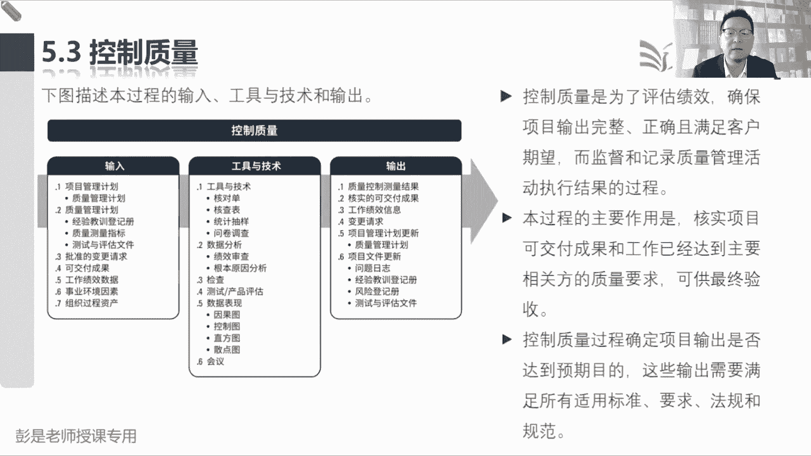
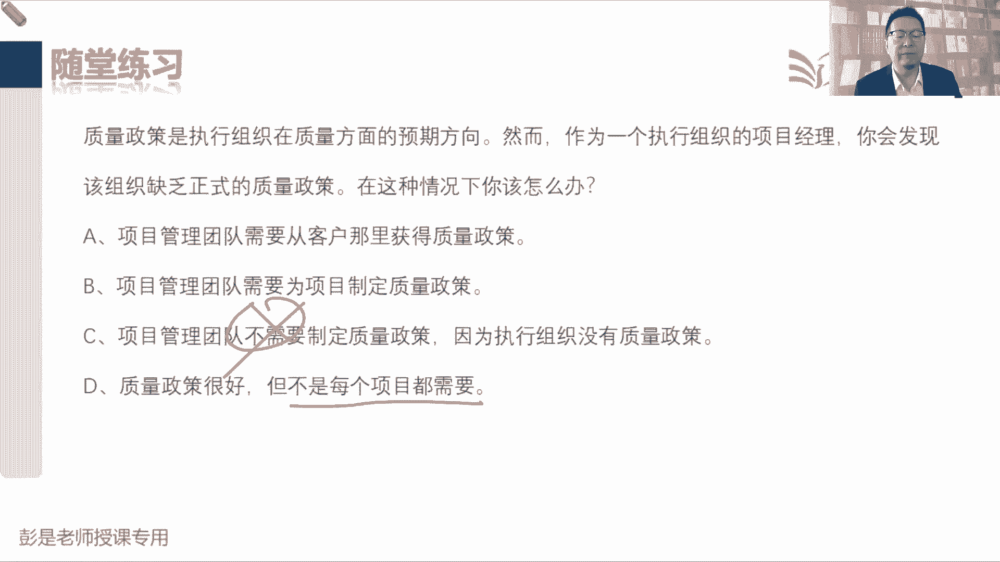

# 2024年最新版PMP考试第七版零基础一次通过项目管理认证 - P43：2.5.3 控制质量 - 慧翔天地 - BV1qC411E7Mw

控制质量这个管理过程超简单，刚刚写好的测评文件，拿到这个东西，然后呢，对我们指导与管理项目工作，输出的可交付成果进行检查，进行测试就会得到一和二，叫质量控制测量结果和核实的可交付成果。

核实的成果就说明测试通过了，然后知道这个主要工作之后呢，他的工具啊没啥需要去背的啊，核对单checklist，但知道了新朋友呢叫核查表，核查表啊，实际上它另一个名字超好记，就叫G数表，这叫计数表。

计数表主要是记录啊这个缺陷出现的次数，缺陷出现的次数完全可以，大家在工作中粗暴理解，我们公司有四个员工，张三李四王五赵六，我来记一下张三这周迟到了几次，李四这周迟到了几次，王五这周迟到了几次。

赵六这周迟到了几次，这就是计数表，所以它主要是记录我们缺陷出现的次数，比如说生产什么矿泉水，要十瓶矿泉水里面有八瓶，容量少，容量少，地域要求有两瓶里那边有蟑螂，有小强，以此类推了啊，这就是计数表。

就像什么，不管是你做软件啊，做手机啊，做食品啊，都都有缺陷，记录出现出现的次数，缺陷出现的次数，那计数表用来记录缺陷出现的次数，不得不提他另外一个好朋友，刚才我们见过的这个单词叫直方图。

计数表是一个表格，是excel这样的表格，用来记录所有缺陷出现的次数，那不直观，我们希望啊还是能够把它变成图，变成这种柱状图，条形图，柱状图条形图就是直方图，变成图之后，我们就可以就可以知道谁迟到多。

谁迟到少，哪个缺陷哪个问题出现的次数最多，那直方图再往下哪个曲线出现的次数多，如果数据太多了，看起来不直观了，所以呢对直方图需要做一个操作，叫排排序，按大小个儿从大到小排，从小到大排，想怎么排就怎么排。

排了序的直方图，它还有一个单独的名字叫帕累托图，帕累托帕累托怕你累了，所以拖着你就这东西哈，帕雷托图实际上就是排了序的直方图，以前它单独有这么一个工具，但是呢后来发现跟直方图一样。

所以没必要再多写一个了，哎这类东西，所以计数表即缺陷即错误出现的次数，随便想了啊，我们工厂生产火腿肠，生产淀粉肠，每天生产100万箱，那生产出来这么多箱，这么多箱火腿肠得有质检的。

有的火腿肠上面没有那个小夹子，有的火腿肠那个塑料包装破损了，有的会使火腿肠二容量不够，有的火腿肠二里面有蟑螂，有小强，这是一种折九东西，我们把我们把所有缺陷出现的次数给它记下来，就得到了计数表。

计数表呢再一统计就变成了直方图，直方图在一排序就变成了帕雷托图，这样我们就知道我们这个生产线，每天生产出来的火腿肠主要问题，主要缺陷集中在哪，来进行我们这个生产制造过程的改进。

比如说发现生产100根火腿肠，里面80根都有小强，那我们就改进原材料，如果发现100根火腿肠，80根那个塑料包装瓶都破损了，那我们改改改进封装这个过程，以此类推，100根火腿肠，80根上面没有贴标签。

那我们改进贴标签这个过程，以此类推，所以这是这三个中这三个工具啊，核查表，直方图以及直方图的好朋友帕累托图，我看过这三板斧，这三板斧再说复杂一丢丢的话，带到各种场景里面，大家应该都能听懂了。

比如说各位同学做章节练习题，先弄一个技术表，统计自己在哪些方面错的最多是范围啊，定义啊，成本啊，质量啊，再往下细细节，再往下细化，统一的话就是49个管理过程，哪个管理过程错的最多诶，就得到了计数表。

计数表之后统计统计做错的题啊，然后呢再接下来变成直方图，柱状图，条形图看起来更直观，这是收集需求，错题次数，这是定义范围，错题次数，这是创建WBS错题字数，直方图在排排序就变成了帕累托图。

这样呢我们就知道自己在哪个知识领域，哪个哪个知识点或者是哪个管理过程，哎错题最多了就可以对症下药了，这就是这三张三张图啊，好再复杂一点一点点的场景啊，再复杂一点点的场景给给给大家画。

挂个白板，这些复杂场景不要求大家记啊，只需要仓促，大家去记这些工具，它的主要作用，再复杂的呢点的场景啊，每天把自己的错题给他记下来，错题对应的知识点到底是哪个知识点错了几次，哪个知识点错了几次。

就得到了基础表，然后呢咱再统计一下，变成这种柱状图，条形图就得到了直方图，直方图呢再把它排排序就得到了帕累托，现在呢我们就知道自己的主要问题集中在哪，那遇到问题还要干啥呢，分析原因就用到了刚才的鱼骨图。

人机物法环测，通常知道叶子同学前面说过，这六个字吧，人人的原因，然后记忆就是设备的原因物这是物料的原因，法是工艺方法的原因，总之大概导致问题的原因诶，他有这么几大类，对不对，那咱个人学习这个事情上。

你就可以说什么记性不好对吧，理解能力不强，看书干得不够，各种各样的原因啊，那找到原因之后呢，我们可以去其实对原因再做一个技术表对吧，比如说马虎错了五次，然后呢知识点不知道错了三次，然后呢看题看得太快。

错了错了一次，看题看错了，没读懂，错了零次，以此类推啊，又得到第二张计数表，再统计一下，变成我们的直方图，再排排序，现在我们就找到了导致大多数问题的主要原因，比如说主要原因啊，就是因为就是因为马虎。

那咱就针对这个弱点进行进行改进，大概就这么几个场景，听一听，知道这几个东西的意思就够了啊，嗯好那咱切回来，这就是大质量管理过程中间这几个计数表啊。

直方图啊大概怎么用，然后统计抽样，这个工具其实是需要大家印象深一点的，统计抽样，统计抽样它其实是用的场景啊，就是多，我们一天生产100万箱火腿肠，淀粉肠这么多这么多，没必要，每个人都检查一下。

因为检查的成本可能太高了，所以就是样本多，那怎么办呢，咱就选取一部分样本进行检查就可以了，抽查这是他适应的第一个场景，第二个场景呢就是这些测试方法，可能会对样本造成破坏，测试方法可能会对样本造成破坏。

比如生产什么手榴弹导弹，这些军工厂生产出来的每个导弹，我们能扔出去看看，炸不炸，炸完了这个东西就废了，唉这种情况下也要慎重慎重，选取一部分样本做测试就够了，这就是统计抽样这个工具啊。

然后问卷调查没啥解释的，绩效审查就是审查绩效根本原因，分析是不是分析根本原因，检查测试产品评估，这是对我们的可交付成果进行检查，进行测试，这都不用去背的，因果图找原因，控制图关注的是一个流程是否稳定。

也用上了吧，我们生产火腿肠儿，每天生产100万根火腿肠儿，我们要关注我们这个机器工作的过程，是不是稳定啊，每根火腿肠重量应该都是一样的，对不对，一根火腿肠可能500克。

那生产出来的每根火腿肠应该都是稳定的，它允许有一丁丁的一丁丁点的浮动吧，多个3克2克好像没关系啊，所以呢我们有了上下控制线，他只要在这个区间里浮动，稳来回跳来回跳，就说明他这个过程是稳定的。

所以这张这个管理工具，基本上都是制造业出来的，好控制图，直方图算什么什么就不解释了啊，然后会议没啥说的，这个过程主要关键就是输入输出那个逻辑搞定，然后他的工具其实没有什么有代表性的，这些方法。

这些工具在其他管理过程规划，质量管理质量都可以用的，所以听到这这一章，其实需要记的工具，就在中间那个过程管理质量是吧，这三件事只能保证过程改进产品设计，其他的工具呢都是共性的好，那再往下看。

书上的文字控制质量是为了巴拉巴拉，看我们的工作成果是不是符合要求，所以叫核实项目，可交付成果和工作已经达到人家的质量要求，可供最终验收，所以他的输出测试通过的，这叫核实的可交付成果。

这个玩意就去了确认范围进行正式的验收，接下来这段文字没什么东西了啊，看一遍就可以了，就是不同的产品有不同的测试方法，不同行业有不同的风格，有不同的要求对吧，什么像这种什么制造啊，医药啊，制药啊，医疗啊。

运输啊，就这种东西人命关天呐，肯定非常严，以此类推，淀粉肠，人家也说了，我们国家没有国家标准，所以呢想怎么搞就怎么搞，对不对，好那这个管理过程的输入没东西了，看看这个东西啊，稍稍有一点点印象就够了。

批准的变更请求也是需要记住的，这个管理过程的输入，这个东西啊是实施整体变更控制的输出，在实施整体变更控制过程中，我们对变更做决策，那当时说这个东西一旦被批准，变更请求一旦被批准。

他需要作为指导与管理项目工作的收入，因为要及时的通知我们的团队计划有调整，按照新的批准的变更请求去落实去执行，那现在把它作为控制质量的输入干嘛呢，就这句话以标搞定。

我们来检查一下批准的变更请求有没有被执行，所以需要经过什么完整性啊，正确性啊，巴拉巴拉，以此类推了，所以它是用来核实已批准的变更请求的执行，落实情况，客户要求把这面墙改成白色，这个变更得到了批准。

那指控的同事后面就检查一下，有没有刷成白色呢，就这意思啊，好可交付成果不解释了，然后这个管理过程的输出质量控制测量结果，他的文字就这么一句话，这是做了什么测试，把这个测试结果记下来，没啥东西啊。

然后核实的可交付成果又在说那个逻辑了，指导与管理项目工作产出可交付成果，这玩意儿经过了控制质量就会得到合适的成果，核实的成果啊，再交给确认范围进行验收，验收通过呢就会得到验收的可交付成果。

验收的成果再交给结束项目或阶段，变成最终产品服务成果的营销，好没了，这就是大概质量，这一章主要核心的就是五种水平对吧，最low的怎么样，好一点的怎么样，什么叫适中，什么叫事前做好规划设计。

然后呢那事中到底是什么意思呢，只要知道什么叫质量保证，什么叫过程改进，什么是产品设计，然后呢做审计BDCA6C格玛和d sign和X，只要把中间这个管理过程看这几个工具，稍稍记一下。

其他的工具呢基本上也不会考的特别多，知道名字能反应过来他干啥，他就行了，就想一想刚才说的那个场景，把错误记下来，计数表，然后呢直方图统计一下帕累托一排序，就知道主要错在哪儿了，然后找原因。

然后找原因之后呢，再对原因啊做个统计，就知道导致问题的主要原因是啥东西了，就把那个打开场景想一想，剩下的就是边边角角的对吧，说我们是时生产火腿肠的工厂，我们需要来检查生产线是否稳定，那就用控制图呗。

然后生产出来的火腿肠，不一定每个都要检查统计抽样呗，以此类推啊，好做到这章练习题，看看大家击倒多少，选什么呢，就这几个单词啊，咱们这个知识领域叫项目质量管理，这个知识领域有三个管理过程，分别叫规划质量。

在规划过程组管理质量，在执行过程中控制质量，在监控过程组，那规划质量干什么事呢，就是做好质量的规划和设计分析，我们需要达到什么样的标准，除质量测量指标管理质量做什么事呢，叫质量保证过程的改进和产品设计。

就带到三个工具做审计，PDCA6西格玛design for x，控制质量做什么事呢，看看结果呀，所以他是对我们的可交付成果做检查做测试，那这道题应该答案很明显了吧，你在和一个审计团队合作。

检查你公司的项目是否满足同样的质量标准，审计过程是否合规，所以呢是实施质量保证，审计过程是否合规，就是实施质量保证，实施质量，保证管理质量三件事中的第一件事，质量保证，做审计，做审计，这就背吧。

如果实在不理解的同学就背吧，我那个小强都出来了啊，过程的合规还记得吗，上帝哥说的，我们是淀粉淀粉淀粉淀粉茶工厂，我们的生产过程啊，哎呀苍蝇啊，蛆啊，小强啊，都在我们这个原材料里搅啊搅啊，碾碾成肉沫。

反正你们也吃不出来啊，生产过程不合规，但是呢结果你还吃的挺香，所以审计关注的就是这个过程是否合规，过程是否合规，这项工作就称之为实施质量保证，就牢牢的记住这么一句话啊，记住这个恶心的场景就可以了。

好这是第一道题，以下哪一个不是质量管理计划的一部分，这道题容易纠结啊，答题小技巧啊，找相对来说最合适的选项，仅此而已，好54321答案是什么呢，A肯定是它，所以它不是答案，B肯定是，所以它不是答案。

处理缺陷，其他质量问题的策略对吧，什么实现公司质量的原则，这都是啊，那C质量测量项目质量的指标，质量测量指标虽然是一个单独的输出，可不可以把它写到质量管理计划，可以不犯法，所以呢哎这东西放一放。

那D年检描述指数哪个哪个可交付成果，不需要检查项目中有没有这样的实践呢，实际工作中是有可能的啊，但是考试来说呢，为了稳妥起见，为了保险，没有D这个原则，所以它不是质量管理计划的一部分。

因为我们最好最好对每个可交付成果，都进行检查，进行测试，检查测试通过在确认范围做验收，这样的防止说把缺陷让客人来发现，然后导致人家不满意，并防止满意度下降了，哎所以D没有这个原则。

它不是质量管理计划的一部分，其他的可以放进去的好，再往下这道题，嗯选啥呢，还没错，这道题主要是分析啊，他在他在审计过程还是在看结果，他是在记过程，还是在查结果，说团队工头提醒你。

检查团队发现一个高压电塔有问题，然后呢你要去分析这个缺陷的原因，那就是现在在查过程还是结果呢，所以是指控这个破电塔是我们的可交付成果，是可交付成果吧，检查成果有问题，分析原因，这就是质量控制。

这就是质量控制，所以对结果就找指控，对过程才找管理质量，管理质量看过程，质量控制控制质量看结果，这就是这两个管理过程的主要区别，好质量控制和确认范围的区别是什么，项目质量管理三个管理过程，规划质量。

管理质量和最后的控制质量范围，这章有一个管理过程叫确认范围，在监控过程组好，A选项说质量控制在项目结束时完成，而确认范围在整个过程中完成，这肯定不对的，质量控制，质量控制也有可能贯穿始终啊对对。

然后B选项说质量控制由项目经理完成，而确认范围由发起人完成，这不对吧，质量控制不一定是项目经理高啊，通常来说我们有专职啊，对不对，有专职做质检做指控，所以B这话是不对的，C质量控制由发起人完成。

这肯定不对，对，确认范围做验收，这是发起人和客户做的事情，发起人不一定参与指控，然后D选项那就是对的了，质量控制是指查找可交付成果中的缺陷，那确认范围表明这个东西是可以验收的，控制质量没问题的。

就会得到核实的可交付成果，这玩意在让客户进行正式的验收，所以恭喜大家，基本上答对了啊，好质量控制和实时质量保证的区别是什么，好恭喜大家，这回基本上问题不大了啊，A选项说。

质量控制涉及到直方图和控制图之类的图表，而实施质量保证，不使用这些图表，A是不对的，质量保证这些这些什么控制图，直方图唉，我们实际上它是共性的，通用的工作需要就可以用的。

B质量控制和实时质量保证是同一个意思，这肯定不对，C质量控制表示检查可交付成果中的缺陷，没问题，指控看结果，查结果，而实施质量保证表示审计一个项目，检查整个过程，对不对，记过程诶。

这是管理质量三件事之一，质量保证做审计，然后过程改进PDCA6西格玛，然后第三个呢就是D3FX，所以正确答案就是C，牢牢记住这个结论啊，质量这章就基本上不迷糊了，然后这道题你再查看一个控制图。

想了解你项目的运作方式是否满足公司的标准，你在使用哪一个过程呢，这是啥东西，关键词是什么呢，运作方式，这是结果还是过程，这是结果还是过程，过程看过程是否满足标准，看过程合规性，这是哪个管理过程呢。

看过程合规，看过程合规，所以呢就是B刚才说了好几遍了，这叫什么呢，这叫知识领域，这个这个单词还听不懂的同学都危险了啊，十大知识领域范围，进度成本质量，资源沟通风险采购，该型项目整合管理，项目范围管理。

项目进度管理，项目成本管理，项目质量管理，这叫知识领域，这个知识领域有哪几个管理过程呢，规划质量管理，管理质量和控制质量，所以49个管理过程，49个管理过程还不熟的同学，我没有好的办法了啊，再背去背吧。

不背后面的课程你更跟不上了，不知道在说什么呀，控制图是什么呢，讲过了腿骨之前的课程吧，嗯好，那再往下了啊，说哪一个不是完成质量保证的例子，嗯志书同学，李超同学，再看一看。

能找到一个100%肯定不是质保的选项啊，就这么恶心的场景，关于这个知识点还记不住，我就不知道咋讲了啊，质量保证关注的是什么呢，过程合规，过程合规，记过程他去检查，可交付成果吗，不检查，所以答案是B。

这个是控制质量需要开展的工作呀，哎就这几个单词就这么难记吗，管理质量，做质保质保怎么做呢，进行审计呀，看看过程是否合规，看看生产火腿肠的过程中有没有什么蟑螂啊，蛆啊被放到原材料里，然后你们把它搅碎了。

弄到肠衣里，最后呢一加热一高温消毒，变成了淀粉肠，看看过程是否合规，生产火腿肠的过程中，工人们，工人们有没有洗手啊，有没有人拿脚直接踩火腿肠啊，说这个保这个这个发酵工艺啊，诶这都叫过程不合规。

看看有没有人在火腿肠里随地大小便，都只能这么说了吧，这都是过程不合规啊，那什么是指控呢，就是看生产出有好生产出来的火腿肠，他是不是满足要求，里面什么包装袋有没有破损啊，有没有什么少半截的东西啊。

所以B选项是指扣，B选项是指控其他管理，其他东西可能是质量保障做的事，只有B肯定不是啦，好你在检查已经批准的变更请求是否被落实，执行，是在哪一个管理过程，批准的变更请求有没有被落实，稍稍有一点点印象。

就是控制质量，除了检查可交付成果，还要看有没有整改，这大家问题不大，就不解释了啊，所以恭喜大家答对了，这是控制质量，控制质量两件事，一个是看我们的可交付成果是否满足要求，对我们的可交付成果做检查。

做测试，测试通过了就会得到核实的可交付成果，第二第二件事情是检查一下批准的变更请求，有没有被落实，有没有被执行，看看这道题呢，李现同学再看看这道题，人家想干啥，想干啥，然后这个东西写到哪。

哪个东西里面比较合适，题目再说改进，用哪个文档来写，怎么改进呢，可只有这个了吧，质量管理计划他不就写如何吗，如何质量保证，如何过程改进，如何产品设计，如何做指控，所以答案就是C，其他选项不合适啊。

质量检查清单，你不知道这是什么东西啊，他来检查什么正确性，完整性啊，这看不到什么改进啊，变更管理计划和咱这事没关系，质量测量指标是成果工作，还有一些相关的质量测量指标，好开玩笑了啊。

质量政策是执行组织在质量方面的预期方向，这道题选什么呢，然后然后，小丸子同学再看看B选项呢，好准备了554321，正确答案是大部分同学答对了，正确答案就是B说我们缺乏正式的质量政策。

A我们需要从客户那里获得质量政策，这有可能，但不一定，因为质量政策最终谁定呢，对不对，给出的质量方针和政策，所以A不一定啊，但是B我们要需要为项目制定质量政策，这话可以这么说吧。

制定政策不代表着说我们有决策权，不代表着说我们能做最终的拍板，但是呢我们需要制定这个东西到底谁来制定呢，怎么制定呢，开会啊，访谈啊，谁来做决策呀，他需要一个一系列的工作才能完成啊，所以B这话可以这么说。

C选项D选项肯定不能选，说不需要这个东西不对，质量政策好很好，不是每个项目都需要，这也不一定没政策，也是有政策，对不对。

所以比较合适的选项就是B了，麻了麻了，慢慢的看多了，麻多了就适应了，好，这就是咱今天第一小段课程。

