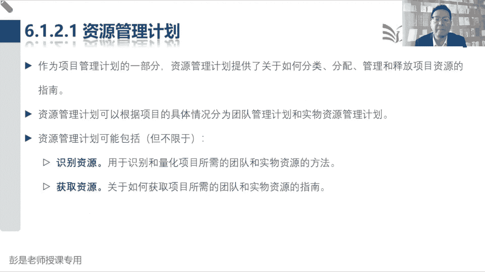
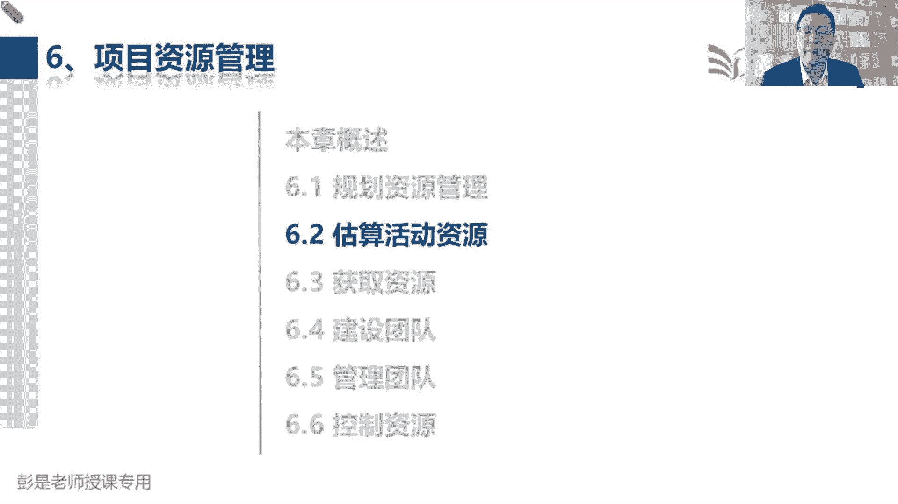

# 2024年最新版PMP考试第七版零基础一次通过项目管理认证 - P44：2.6.1 规划资源管理 - 慧翔天地 - BV1qC411E7Mw

接下来大家就可以轻松加愉快地，听资源这一章了，资源这一章朝鲜代范围进度成本质量，多快好省都搞定，然后呢，资源这张为什么超简单呢，因为你看看规划资源管理，看看资源咋管，然后估算活动资源，其实我们讲过了。

这个管理过程和估算成本，和估算活动持续时间密切相关，并且这三个管理过程，它的输入输出没啥需要去记的，他的工具技术基本上差不多，什么类比估算参数，估算三点估算就这些东西啊。

然后再往下执行过程中有三个管理过程，第一个管理过程叫获取资源，因为估算活动资源，这是我们做的计划，然后呢现在获取资源呢，就是按照计划把需要的资源拿到手，马上什么要清明节五一打算出去玩，估算活动资源。

坐飞机坐火车呀，这不是估算资源吗，考虑这个资源的可用性，另外考虑时间，考虑成本，所以紧密协作呀，对不对，骑自行车回老家哎，这虽然省钱的，但是速度慢的，表面上看省钱了，实际上一算每天衣食住行唉。

总体成本反正不便宜，坐飞机速度快，但是可能比较贵，坐火车相对来说性价比最好，成本效益分析，那获取资源呢就是按照我们的进度计划，把需要的资源拿到手，所以就是啊该订票了，这不是获取资源吗，打开什么携程。

然后选飞机票，选火车票交钱，根据我们的进度计划，把需要的资源拿到手，这个字面意思啊，然后后面一对呢一个叫建设团队，一个叫管理团队，建设团队主要工作中心啊，就是大家工作中的团建，吃吃喝喝，搞团建。

团建的目的是什么呢，绩效对改善团队成员之间的各种什么关系啊，凝聚力啊，信任啊，众志成城，万众一心啊，这里有东西啊，改善团队的绩效，从而保证项目的绩效，管理团队的工作重心是什么呢，就是问题。

看看人有没有问题，看看人之间有没有冲突，张三能力不行，水平不行，该指导的指导，该培训的培训，李四违法乱纪，道德败坏，该辞退的辞退，张三和李四关系不好，经常经常有冲突，那就让他让他俩想办法。

让他俩一谈合计呗，就这意思啊，这就是管理团队解决问题，处理冲突，最后一个管理过程，控制资源，这个实力让大家在工作中，生活中也都在用，但是呢他不管人，只管物资，看看物资够不够，看看物资是不是太多了。

我们家里囤了囤了一年的盐，一什么屯盐，屯葱姜蒜，这个梗还记得吗，好有的东西可能要过期了，该扔的扔了，有的东西不够了，家里面没有盐了，没有油了，没有米了，以此类推，诶，他就是管物资，那对标到项目上。

就是你的工作中用到的这些设备啊，设施啊，用品啊，没看看办公室是不是缺水了，看看是不是该买写字笔了，看看是不是打印纸不够了，有人用打印纸啊，这不浪费嘛，然后这些废纸啊，最好能recycle在当草稿纸再抽。

重复利用一下，哎他解决物资的问题，主要中心思想主打一个不浪费，关于物资的管控，关于物资的管控，不浪费不浪费他的中心思想啊，所以这一章这六个管理课程听完了，基本上就学的差不多了，他的工具技术和输入输出。

没有什么需要刻意的去背的，都是看名字能反应过来它的特点是啥就行了，好知道了，大概这一章这六个管理过程，规划资源管理初级化，估算活动，资源输出根本就不用去叫资源需求和估算依据，获取资源。

按照我们的进度计划，根据我们的资源需求，把需要的资源拿到手，所以其实它的输出一个叫人，一个叫物物呢，就叫分配，人呢就叫工作安排，所以叫团队成员派工单和物资分配单。

这两个输出基本上也不需要被建设团队关注的，就是团队的绩效，所以想办法给大家提高士气啊，打鸡血呀，加加油啊，所以它的输出就叫团队的绩效评价管理团队，他的输入输出也没有什么需要背的，因为他解决问题处理冲突。

所以呢问题啊，冲突啊，辞退啊，唉这是变更啊，所以他主要输出变更请求控制资源，他的输入输出也没东西，绩效数据，绩效信息以此类推了，好知道大概这六个过程啊，那再往下咱具体看教材上的文字描述了规划。

资源管理输出，除了刚才知道的资源管理计划，还有另外一个单词需要记住，它就叫团队章程，团队章程看起来这个单词不太好理解啊，千万千万不要和项目章程混了啊，项目章程师告诉我们事情的目标，我们要做什么事。

目的目标，成功标准，退出标准，团队章程呢就是告诉人人的方向，人的方向，人的方向其实就是整个团队，我们是一群什么样的人，我们的价值观是啥，我们这些人的使命是啥，我们这个团队未来要达到一个什么状态。

一个什么样的水平团队，大家怎么工作呀，怎么配合呀，怎么开会呀，怎么沟通啊，哎其实它对标的最好理解的单词啊，就叫基本规则，未来看到团队章程，第一反应就反映出规矩这个术语就可以了，基本规则就是告诉我们。

所有人什么样的行为是可以接受的，什么样的行为是不能接受的，能想到啥呢，交通规则对不对，在路上开车呀，骑车呀，什么行为可以接受啊，嘿红绿灯通行这个行为可以接受，红灯通行这个行为不能接受，不能超速。

以此类推，所以其实工作中，生活中各个场景都有这个东西，坐地铁有规则对对，坐公交车也有规则，不能吃什么鸡蛋臭豆腐这种东西啊，以此类推诶，所以团队章程就是大家的工作协议，大家的行为指南，这是基本规则规矩。

这个需要记住啊，这是非常重要的一个输出，然后估算活动资源，它的输出除了资源需求，另外呢还配了一个资源的分解结构，资源分解结构啊，这个东西啊其实也不大会考，就是我们统计都需要什么样的资源。

各位同学马上什么过节了，五一啊，出门需要什么资源呢，什么衣服啊，包包啊，什么什么生活用品啊，什么药品啊，洗漱用品呢，它就是这个东西，只不过只不过对标到项目上，我们要去分析了对吧，需要什么样的物资。

物资再往下细分就可以分成设备设施用品，另外还分析我们需要什么样的人，人往下细分就可以分成分工，需要几个厨师啊，服务员啊，收银员啊，开发人员，测试人员啊，以此类推，这稍稍有一丢丢印象，一会儿看图一目了然。

那获取资源，根据我们的进度计划，根据我们的资源需求，把需要的资源拿到手，就分成了人教安排工作，物价分配，所以就叫团队成员派工单和物质资源分配单，然后按照京东计划把需要的东西拿到手。

那另外两个一个叫建设团队，关注的是团队的绩效，关注的是团队的绩效，大家相互之间信不信任呢，大家相互之间冲突多不多呀，矛盾多不多呀，大家团队凝聚力怎么样啊，诶所以我们要写一个团队绩效评价，做完了团建之后。

评价我们团队绩效发生了什么样的变化，是不是朝着正能量的方向在发，在发生改进，还是说变得越来越糟，越来越糟，这个道理啊，然后管理团队他的输入输出没什么需要去记的，因为解决问题，处理冲突。

人的问题呢可能就需要做一些改变对吧，有人能力不行，水平不行就培训，有人违法乱纪，道德败坏就辞退诶，他所以他管的是人事上的变动，他输出有一个变更请求，这不用记啊，控制资源管物资。

它的输入输出也没什么东西好，那接下来说为什么团队相关的在，为什么没有团队相关的在监控过程组呢，因为这两个东西需要在工作中持续开展，因为这两个工这两个东西需要持续开展，所以没有把它放到监控过程组。

每天上班领导不都得给你加加油打打气嘛，对不对，因为现在不知道大家有没有关注过员工来说，统计过调查过18万个人啊，统计分析给出了这样一个结论啊，大概只有1/5的人对目前的工作感到满意，还有2/5吗。

没感觉好死不死，赖活着呗，还有2/5左右的员工感觉到不满意，所以呢每天需要想办法给他加加加油，打打气，加油加油，你最棒了，不断的改进我们团队的绩效啊，让大家绩效不断的提升了，达到我们的要求啊。

就这意思啊，调解就可以了吧，和运营没关系啊，在项目过程中持续大家这个知识点都学杂了，咱现在是讲项目管理，在项目开展的过程中，你的领导不需要给你持续的打打气加加油吗，定期的搞搞团建呢，它和运营没关系啊。

好那接下来管理团队一个道理吧，成员之间出现了什么各种问题呀，冲突啊，这事啊也需要及时的解决啊，所以把它放到了执行过程组，这就是大概这一章这几个输入输出，基本上听完一遍都不太需要刻意的去背。

好那再往下再加一个小细节了啊，规划资源管理，看看资源怎么管，出资源管理计划，另外呢出规矩，出团队章程，然后估算活动资源，是根据我们的活动清单去算一算，完成这些活动需要什么样的物资和人，人和物获取资源。

按照我们的进度计划，根据我们的资源需求，把需要的资源拿到手，人和物都要拿到手，建设团队管理团队既然用了团队这个名词，所以他只管人，给人才给人加油，不能给机器加油，对不对，电脑电脑你最棒，没用的人。

可以的吧，所以建设团队管理团队只管人，控制资源，避免物资的浪费，所以他只管物小细节给他记住前三个过程，人和物都要管，建设团队管理团队只管我，只管人，控制资源，只管物资就单独记一记，6。4到6。6。

这三个过程，好那再往下概述，这段文字上来就告诉我们物资是啥东西，人是啥物质资源指的是我们工作中需要的设备，材料，设施和基础设施，团队资源指的是就是我们的团队成员，这回不需要解释了吧。

什么叫设备给大家讲课，需要电脑，什么材料，需要什么讲义，设施需要需要房子，需要通水通电，需要有WIFI这些东西啊，然后再往下说项目团队，巴拉巴拉巴巴拉巴拉巴拉巴拉巴拉巴拉，还是在说那个超级大的大道理。

就是成员参与计划的制定，成员参与角色有好处，为什么呢，成员参与规划阶段，可以使他们对规划工作贡献专业技能，贡献出我们所需要的这些人拥有的知识啊，技能啊，诀窍啊，技巧啊，从而让我们的计划具有更好的可行性。

就是更靠谱，另外成员参与了计划的制定，又参与了一些角色，可以提高大家的主人翁意识，提高大家的主人翁意识，提高大家的责任感，主观能动性，这个非常大的道理，一定要记住它，所以大家之前做章节练习题。

有一道题还记得吧，说怎么底下哪一个，什么可能导致项目失败的原因，你说有一个选项叫找一个部门，统一给项目编制计划，哎这可能导致项目失败，为什么呢，因为统一找找一个人给项目编制计划，这叫自上而下的规划方法。

上面怎么说，下面怎么干，它不一定具有可行性啊，通常来说我们要自下而上，反过来啊，要听取程序员，听取一线员工的意见，他给我们提出合理化的建议和见解，这种情况下定出来的计划具有更好的可行性，就这个逻辑啊。

好然后再往下这段文字没啥可电脑，什么项目的经理主要干啥啊，这是给大家管好物资，不要浪费，做好物资的规划，然后让大家相互信任，这没啥可记的，再往下找找找找找说，作为项目经理。

我们还需要负负责培养团队的技能和能力，同时提高并保持团队的满意度和积极性，我们还应该留意大家的职业道德行为，确保所有成员都遵守这些行为，这是讲到，建设团队管理团队规划资源，规划资源，我们先出个团队章程。

告诉大家，至少职业道德方面也要写一些行为准则吧对吧，不能行贿受贿啊，不能贪污啊，不能偷工减料啊，唉这些行为不可以接受，可以写进去的啊，建设团队想办法提高大家的满意度啊，积极性啊，让大家士气高啊。

有动力啊，正能量啊，那管理团队干什么呢，就是发现员工啊能力不足，水平不足，我们还要该培训的培训，该知道的指导唉，大概知道这些管理过程很重要的知识点，然后后面实物资源这都不念了，实物资源这东西不到位。

可能影响我们的进度啊，成本啊，质量啊，可能会影响很多东西的，这个例子很难不理解吧，只了解就可以了啊，那接下来6。1规划资源管理这个管理过程呢，它的输出还是需要大家记一些东西的。

规划资源管理输入没啥需要去了解的，没啥需要去记的啊，工具技术这三个单词其实也不太需要去记，但是呢这三个单词，未来会对标到资源管理计划的内容，他分别叫层级行责任分配矩阵和文本性层级型，什么叫层级呢。

我们创建WBS得到的工作分解结构，就是层级啊，那现在我们在规划资源管理，用层级型主要体现什么东西呢，能猜到这个知识点就OK了，层级层级型，这是项目组的组织架构，项目组的组织架构，它就叫OBS。

这叫ob组织分解结构，组织架构体现项目组团队的构成，谁是项目经理呀，下面分几个团队啊，团队下面有什么有什么成员呢，就这意思吧，所以它叫o b s organization。

然后break down structure o b s，记住这个术语啊，这画组织架构的组织架构有了之后啊，责任分配矩阵主要干啥呢，分工，这些工作呀，这些活动啊，大家在里边各司其职啊。

分别负责做什么事情呢，张三是我们的保安队长，主要抓安全安全管理，安抓安保，他下面有三个员工，李四王五赵六，李四负责看北大门，赵六负责看南大门，然后王五负责巡巡巡巡游巡检巡查。

以此类推说庆祝大家在工作里边的，我们这些项目工作呀，项目活动啊，大家里面的分工是啥，这是责任分配矩阵，分工明确有助于什么呢，有助于避免三个和尚没水喝这种问题，一个和尚挑水喝，两个和尚抬水喝。

三个和尚没水喝了，为什么分工不明确，对不对，张小和尚负责周一，然后瘦和尚负责周二，胖和尚负责周三，以此类推，这样呢有了责任分配矩阵，大家就各司其职了，然后文本型主要干啥呢，说清楚每个岗位他的角色和职责。

保安呐，保洁呀，你们的权限是啥，你的职责是啥，你主要干啥，负责啥，有什么权限诶，他把每个岗位每个角色的具体职责给他说清楚，这就是一张图，一个表，一个word，粗暴理解为PPT，excel和word文档。

那这三个东西，其实未来我们就把它写到资源管理计划里面了，好那他第二个输出团队章程，看到这个词能反应过来，这是规矩基本规则，什么样的行为是可以接受的，什么样的行为不能接受，开会又开会的规矩。

上班有上班的规矩，考勤有考勤的规矩，各种规则呀都可以写进去的，好那再往下说，规划资源管理，巴拉巴拉巴铺垫了，然后他的具体收入呢没有什么需要去背的啊，资源管理计划的内容，猛一看字挺多。

但是呢只要记住刚才那三个工具，一个层级，一个表格，一个word层级就是画组织架构，表格就是做分工，word呢就是写每个角色的具体描述，所以看一看这张图，了解这个意思就够了啊。

所以接下来各位同学这一小段话术专心听啊，咱要call back，回去了，等我找一个没有空白的地方，我换黑板。

Call back，回去咱把这事捋一捋啊，第一天上课还记得吗，说我们要开开开公司要定什么目标，愿景使命价值观，做企业的战略规划，规划好了之后啊，就知道有哪些项目，就知道我们要运营什么工作了。

然后有相关性的东西啊，放到下，放到一个圈圈里，就有了项目及管理要做的事这么多，再画个圈圈，看看哪些工作和战略相匹配，放进去，排排优先级，合理的分配人财物，就有了企业战略管理，项目组合管理，项目及管理。

项目规定，项目管理和运营管理，咱现在就把这堆事情给他梳理清楚了，接下来需要干啥呢，你不得找人干活吗，化公司的组织架构啊，对不对，这是保安部门，这是保洁部门，这是开发部门，下面有什么几个员工。

需要几个程序员，需要几个保安，以此类推，老化公司的组织架构，组织架构，组织架构，那具体这些工作大家的分工是什么呢，就需要画刚才见过的责任分配矩阵说清楚，在所有工作中，大家的分工是啥，张三负责拍板。

李四王五，你们俩配合张三，然后呢，这个事怎么办，咨询赵六，这个事情办完了之后，就有了这张表，说清楚大家在工作中的分工，有了这张表还不行啊，我们还要说清楚每个角色，你的权利，你的你的职权，保安负责干啥。

保洁保洁负责干啥，队长负责干啥，你有什么权利都说清楚啊，那现在我们有了组织架构，有了则有了分工，有了角色岗位，说明接下来人这事儿就梳理的差不多了，剩下的事呢游戏规则一旦定了。

剩下的事啊就是开始招兵买马了，对不对，我们需要一个保安，需要一个保洁，需要十个开发，20个测试，需要一个什么经理，一个财务，以此类推，就开始招兵买马，所以剩下的事就是想一想，你们公司hr都干什么活。

招聘，然后这些人怎么配备，这些人进进公司以后要不要培训呢，这些人干的好了，要不要发奖金啊，这些人迟到早退，要不要惩罚大家呀，这些人如果道德败坏，要不要辞退大家呀，所以就是人员的招聘啊，配备啊，培训啊。

奖励呀，惩罚呀，辞退啊，遣散啊，还把人怎么管这些事情给大家说清楚啊，这就是资源管理计划的核心内容就出来了，那现在把企业换到项目上也如此，我们创范围管理，进度管理，成本管理，质量管理，以此类推啊。

这些事搞清楚了之后啊，干活的是人呐，人怎么管呢，所以先要画我们项目组的组织架构，然后说清楚大家在项目中这些活动，这些工作中的分工，再说清楚我们项目中这些人，这些人每个角色他有什么权限，他有什么职责。

然后接下来我们要招兵买马，对不对，怎么获取资源的，就是公司内推啊，还是从外部找人力外包啊，还是第三还是直接招聘啊，这些人怎么招聘啊，配备啊，培训啊，奖励呀，表彰啊，惩罚呀，遣散哪。

都把这些事情给他写清楚啊，就叫如何开展这些管理工作，这就是人力资源管理计划，资源管理计划，它的主要内容，只要这段话大概有印象，能知道这个意思，那这个管理过程的输出搞定，好稍等我换回课件啊。

所以接下来看看就可以了，识别资源，怎么获取资源，包括大家的角色职责说清楚啊，包括刚才见过的组织图，然后呢组织图我觉得值得，就是那个文本中间呢再写一个责任分配矩阵，然后团队项目的团队资源管理。

这是人关于如何定义配备管理，和最终遣散项目人这些人的这些人的指南，培训也是人，团建也是人，机不认可计划也是人，中间就藏了一个物资，那人我们知道hr干的这些事情啊，物资怎么管呢，你就参考你公司的库管。

如果公司里面没有库管，没有仓库的话，你就参考你家里面过日子，冰箱里的东西怎么管，衣服帽子包包怎么存，这都有讲究吧，东西冰箱里的东西，什么东西冷冻啊，什么东西冷藏啊，什么东西常温啊，这些东西放在哪儿啊。

看看家里柴米油盐酱醋茶是不是不够了，该补充的补充了，对不对，所以它是根据我们项目的需要，确保食物资源充足可用，然后呢看看怎么采购啊，怎么管库存啊，这些设备用品啊，包括借借走，要不要还呢。

还把这些事情给他写清楚，确保呢这些资源不浪费，好搞定，所以规划资源管理两大块，人和人就记住刚才那三张图，一个一个PPT，一个excel，一个word文档，然后剩下就是hr干的那些事情。

物资呢就是确保物资不浪费，怎么存啊，怎么乱七八糟的东西都写清楚啊，大概知道这个核心框架的结构就可以了，那第二个输出规划资源管理，第二个重要的输出就是团队章程，他对章程是为团队创建价值观。

共识和工作指南的文件，说我们是一群什么样的人，我们在弄哪些东西达成共识了，我们未来未来什么样的行为可以接受，什么样的行为不能接受施展吗，所以这个东西啊大家参考参考，少先队有没有章程呢。

共青团有没有章程的，某些党派有没有章程呢，这章程的目的是什么呢，告诉大家我们是一群什么样的人，对不对，我们工作中达成什么样的共识，未来我们如何相互配合，什么样的行为可以接受，什么样的行为不能接受。

所以它里面包括可能涉及到关于人的，方方面面，那这些东西啊，什么价值观啊，指南啊，什么处理啊，会议指南啊，这都不用背的，不要背不要背不要背，知道这个东西的主要作用就够了，它最重要的作用就是定规矩。

所以接下来找Hope这几句话，第一个需要记住的是，他对项目团队成员的可接受行为，确定了明确的期望，嗯对吧，少先队队长啊，我们要团结友爱，唉什么五讲四美，三热爱，我们要尊重了遵遵守交通规则，以此类推啊。

唉可接受行为确定了明确的期望，那实际工作中，实际工作中啊，除了这种可接受的行为，不可接受的行为要不要写进去呢，想一想和一个玩意儿很像，底层逻辑是一样的，我们写范围说明书的时候说。

我们要把项目范围内的东西写清楚，为了避免避免避免误解，对不对，什么东西不在范围内，如果能写清楚，这不是更好吗，这样可以有效的消除一些不必要的误解，对不对，丑话说在前面，那团队章程还是这个逻辑。

什么样的行为可以接受，还可以写清楚，那什么样的行为不能接受，最好也是丑，话说在前面和除外责任，那个底层逻辑一模一样哈，所以参考现在左边这张示意图对吧，抢小朋友的球，不可以抢小朋友的玩具。

这个行为不可以接受诶，小朋友倒在地上，把他扶起来，这个行为可以接受，小朋友哭了，跑过去安慰他，这个行为可以接受，小朋友哭了，嘲笑他，这个行为不可以接受，这样呢有助于减少误解，说清楚，这是第一个啊。

第二个知识点，这个规矩啊定的越早越好，所以他说尽早认可并遵守明确的规则，可以有助于提高生产力，减少消除掉不必要的一些误解啊，误会啊，嘿规矩定得越早越好，这个道理大家应该也不难理解吧，就像各位同学。

未来你要参加考试的时候，监考老师肯定是先宣读考场纪律，而不是事后，对不对，等你考得差不多了，监考老师走到你身边，亲亲哎，你作弊了，告诉你告诉你告诉你规则啊，你作弊了，这不行啊，不科学。

所以团队章程这玩意越早写越好，因为可以有助于消除误解，然后第三个知识点是什么呢，咱也不要一言堂成员参与，不要项目经理一拍脑袋就定了，对不对，成员参与可以让这个东西，让这个东西具有更好的可行性。

代表着大家参与了才能达成共识啊，更认可的东西可以发挥最佳效果，诶，这是他非常非常三个重要的知识点需要记住啊，可接受行为，然后呢早定最后呢也不要一言堂，好再往下文件。

