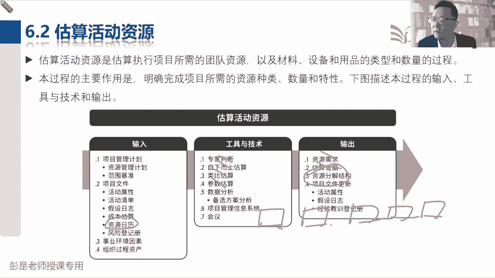
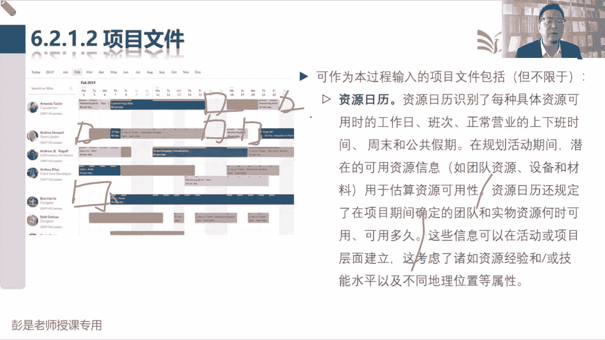
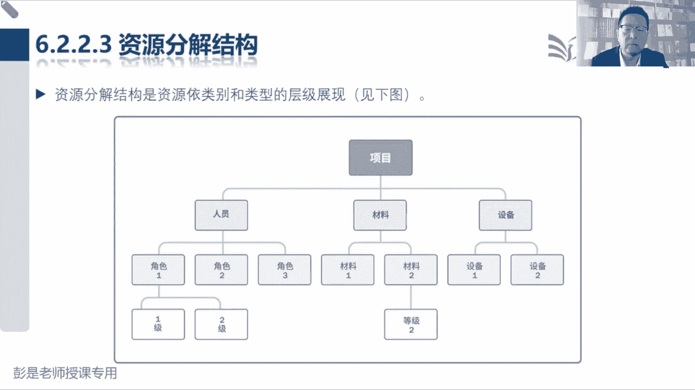

# 2024年最新版PMP考试第七版零基础一次通过项目管理认证 - P45：2.6.2 估算活动资源 - 慧翔天地 - BV1qC411E7Mw

那6。2获取估算活动资源，这个管理过程后面大家复习的时候，基本上你就拿这个过程和估算活动持续时间，和估算活动成本三个一起看，看一遍就完事儿了，他的输入没东西，工具没东西输出没东西好搞定。

输入如果稍稍印象深一点的话，多看几遍就深了啊，这个文件的重要作用，一定要记住资源日历体现的是啥来着，资源之地能够看出来什么呢，哎没错，资源的可用性，这是非常重要的一个文件啊，五一要出去玩看看飞机票。

还有没有准备打开那个什么携程这种，看看哪天还有还有没有飞机票，哪天还有没有火车票，一等座有没有，二等座，有没有，这也是一种资源日历，体现资源的可用性，因为资源不可用，可能会改变我们的资源需求。

五一我打算出去玩看看，飞机票好贵啊，买不起啊，换火车吧，火车一等座哎，买不起啊，二等座吧，是二等座，没有了，实在不行，站票啊，它可能会改变我们的资源需求，这个重要的作用。

你只要记住了他未来在哪个管理过程，输入输出根本就不重要啊，然后中间的工具地图类比之下三点，这都见过了，不解释了，它的输出资源需求估算依据，这很难猜错的，不需要去背，然后一会儿就看看什么是资源分解结构。

这是一张图对，不需要什么用品啊，设备呀，设施啊，需要什么样的人呢，以此类推，未来适合我们做统计分析好。

那这个管理过程搞定中间的文字呢，没念到的，大家后面看一遍就可以了，说估算资源活动过程和其他过程紧密相关，例如成本，这不结束了吧，因为一等座二等座成本不一样，头等舱经济舱成本不一样。

好输入，没东西了啊，就看看刚才见过的这个小术语，资源日历，资源日历识别了每种具体资源，一定是每一种具体资源，火车票飞机票，这不都是资源日历吗，可用时的工作日班次，正常的营业上下班时间，周末和公共假期。

就是看看这些资源在什么时间，他在干啥，什么时间在有活，什么时间在空闲，什么时间在维修，这这也会影响资源的可用性吧，公司的会议室下周要装修，不可用了，那咱开会就在办公室开吧，这东西啊。

所以最重要的作用就是对这句话，它的规定了，在项目期间确定的团队和实物资源何时可以用，可以用多久，体现它的可用性，参考左边那张示意图，可以很直观的看到，有些人在有些时间上是没有工作安排的，什么时间休息啊。

什么时间没事干呢，以此类推，一目了然，我们的人，我们的物都可以有这个东西。

并且呢最好有，那这个管理过程输出。

就看看刚才传说中的RBS资源分解结构，听完这个RBS啊，其实整本教材里面叫BS的，交BS的一共四个范围，这一章我们有WBS工作分解结构，然后刚才规划资源管理的时候。

又听到了一个o b s organization，组织架构，体现项目组的组织架构，人员的构成，大家的上下级呀，哪些人是平级关系呀，嘿OBS，然后呢，资源这一章，现在估估算资源又会得到资源分解结构。

resource体现我们项目资源的构成，包括人啊，材料啊，设备都需要什么设备给大家上课，需要电脑给大家上课，需要鼠标给大家上课，需要写字板，还以此类推，这是资源分解结构等，学到风险这一章还有一个2BS。

那个叫risk，风险分解结构叫分解结构的教材，里边就这四个东西，还要知道它是哪个管理过程的输出啊，WBS是创建WBSOBS是规划资源管理，估算活动资源就会得到资源分解结构，好这看看有印象就够了啊。

这张图里面的内容啊，不要求背它，只是示意直播没暂停啊，直播没暂停了，真同学，是不是你自己不小心点到了。

