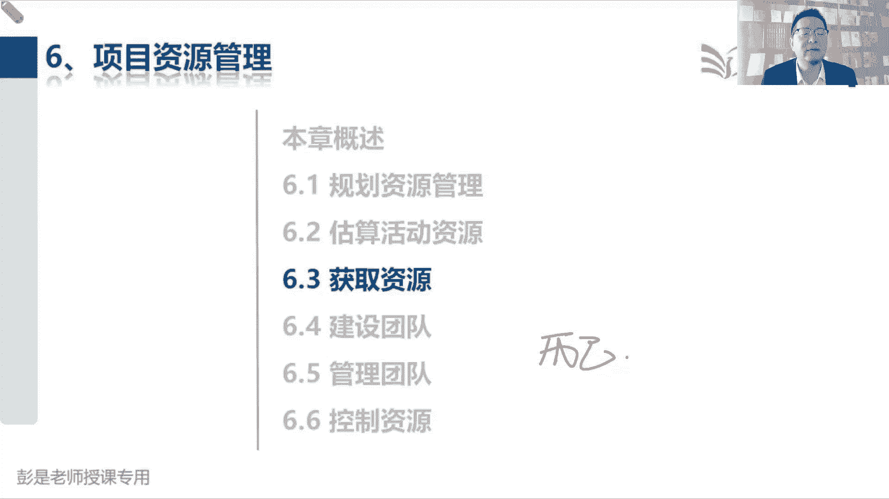
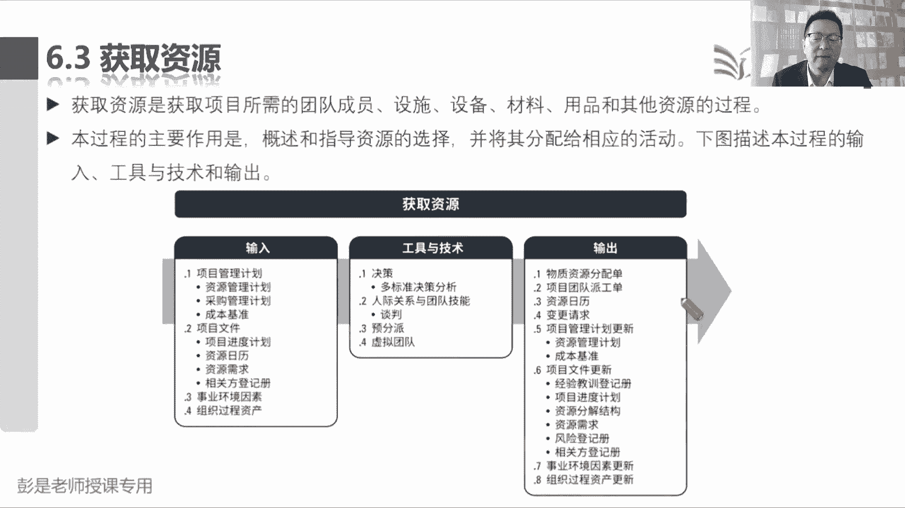
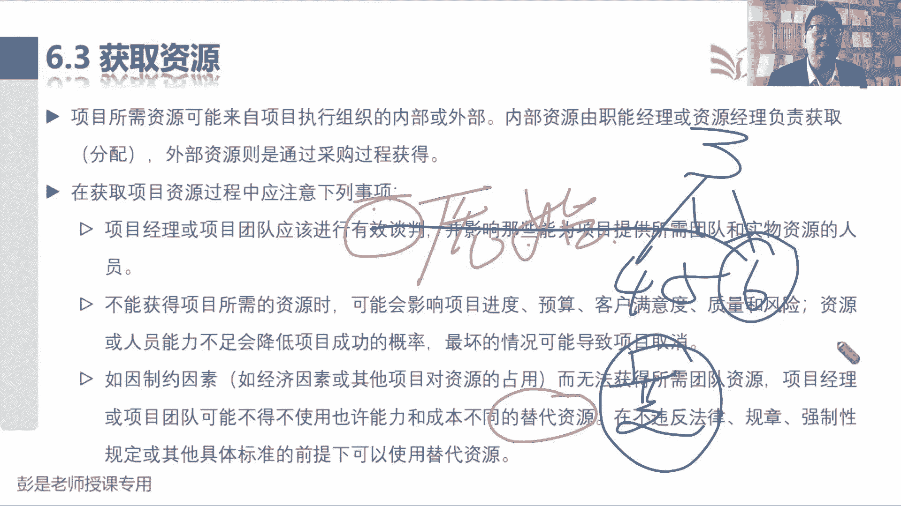
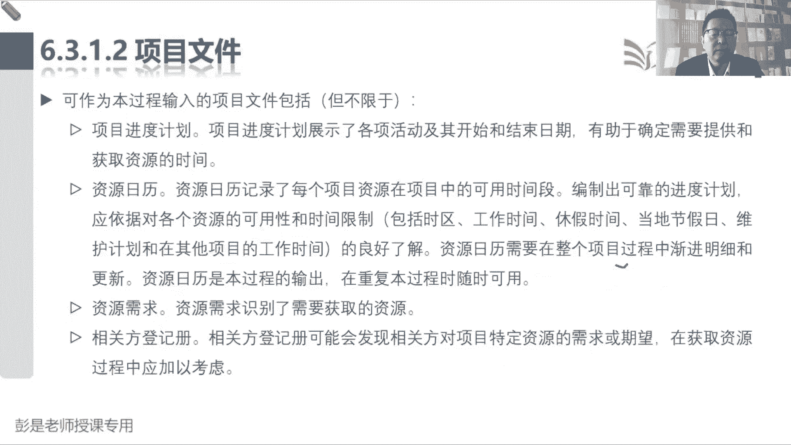
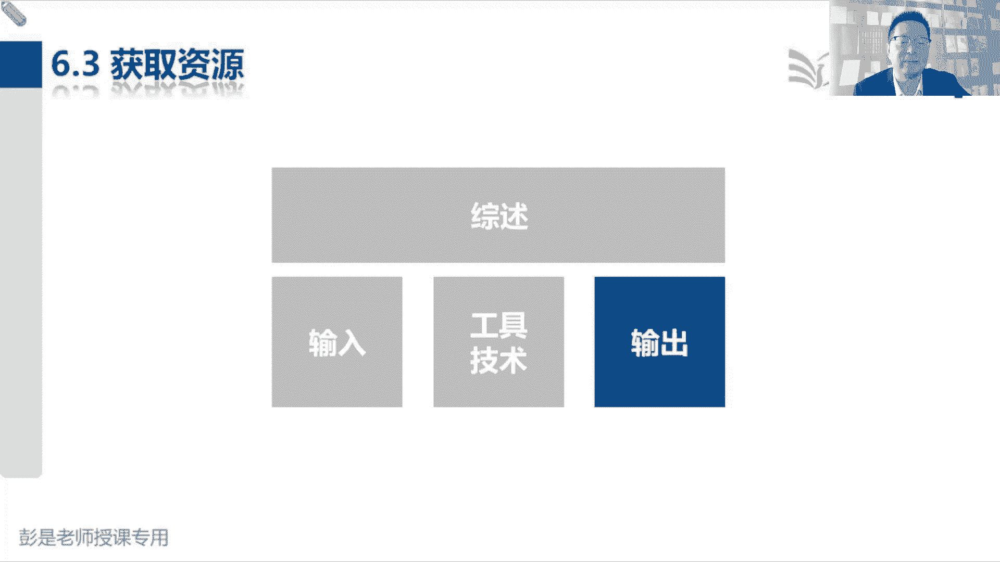
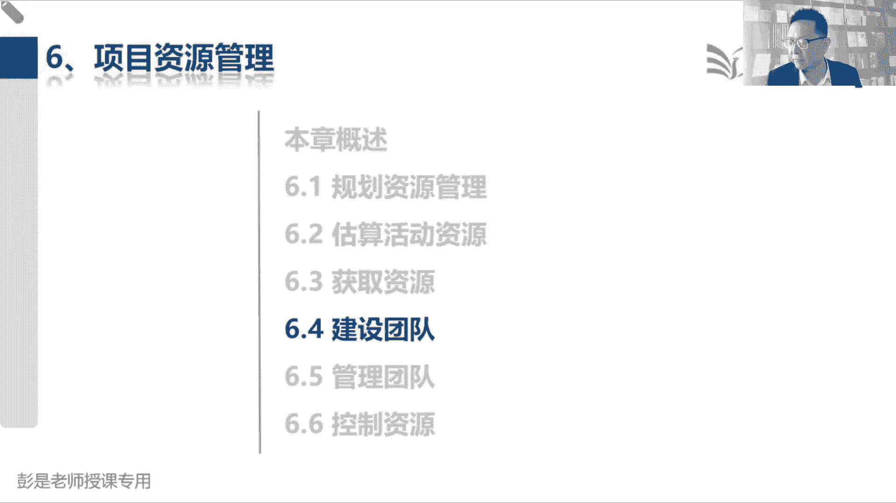

# 2024年最新版PMP考试第七版零基础一次通过项目管理认证 - P46：2.6.3 获取资源 - 慧翔天地 - BV1qC411E7Mw

那6。3获取资源，Breakdown structure，分解结构都叫BS，o b s r b s w b s risk r b s好，接下来6。3获取资源，这拍脑了吧，刚才刚才怎么说的。

根据我们的进度计划，根据我们的资源需求，把需要的资源拿到手，该订酒店订酒店订好了，拿到资源了，对不对，该订车票订车票，那酒店啊，车票啊，这都叫什么呢，叫物资，物资就要分配，这间房归张三，这个电脑归李四。

这张这张机票归王五，所以他的输出叫物资分配单，那人叫什么呢，叫工作安排，对不对，叫工作安排，张三在我们这个团队里负责保安，李四呢负责保洁，王五啊，负责给大家照顾做饭。

负责做饭，以此类推，人教工作安排好，所以他的输出这两个稍稍印象深一点就可以了，物资分配团队成员派公，这是获取资源的输出，那他的收入不太需要去背了啊，这是刚才那个话术，根据我们的进度计划。

根据我们的资源需求，把所需要的资源拿到手，那前面那个管理过程是估算是规划哈，估算活动资源是看看有没有资源，看看这个资源可用不可用，得到我们的资源需求，现在呢我们是按照进度计划，按照资源需求拿资源。

拿资源的时候，自然还需要再看一看资源日历能听懂吧，五一我打算出去玩，现在看一看携程诶，还有座，我打算定五张二等座，这是我得到的资源需求，现在呢按照我们的进度计划，该订票了，订票的时候。

你再打开这个app看看这五张票还在不在呀，还有没有啊，所以呢我们在获取资源的时候，再打开资源日历看看这个资源还可用不可用，如果可用，那我就把这五张票买回来，买回来之后资源日历是不是发生了变化呢。

对对订票订票之前说还有16张余票，现在订完票了，系统显示还剩11张余票了，诶它就更新了资源日历，所以资源日历是这个管理过程的输入和输出，能把这个例子听明白OK了，稍稍有点印象啊。

订票订票订票的时候看看还有没有票，订完票这个余票情况就会发生变化，资源的可行性就会发生变化，好这是输入和输出，然后中间的工具技术多标准决策分析，粗暴理解你招聘的时候，招聘的时候没有招聘经验的同学。

面试的时候，人家都看你什么呢，学历啊，工作经验啊，工作年限啊，教育背景啊，都看看吧，然后呢还看看你能不能表达能力强不强啊，长得好看不好看呐，这不就是多标准角色分析吗，获取资源的时候。

我们要考虑到很多因素的，这不但需要去记啊，主要要记得就是这三个单词了，谈判预分派和虚拟团队谈判谈判主要是干啥呢，随便想一个场景，我需要需要需要一个保安，保安队长是张三，他下面有三个员工，李四王五赵六。

李斯啊，好吃懒做，王五啊，道德败坏，还招六，这小孩挺好，那你谈判谈判，是不是希望人家把最好的资源交给你，这就是谈判的目的，对不对，希望人家把最好的资源，最优质的资源水平，最高的资源对吧。

最牛的资源交给咱们，那人家肯定会问我这么做有什么好处，为什么，所以需要谈判呢，做到这种利益交换好，知道这意思啊，所以这是谈判这个工具，找职能经理，找职能经理，希望职能经理啊给咱最优的资源。

另外还可以有第二个谈判的渠道是什么呢，叫其他项目，其他项目，其他项目为什么要和其他项目的项目经理，谈判呢，因为要抢这种竞争性的稀缺资源，抢这种竞争性的稀缺资源，物以稀为贵呀，对不对，张三水平最高。

我们希望他加入项目团队，结果发现他在别的项目上也在干活啊，那咱找其他项目经理来协调一下呗，对不对，人家肯定也会问，为什么凭什么咱会告诉他这么做的好处，好，知道这意思啊。

然后预分派稍稍有一丢丢印象就够了啊，预分派它的主要主要特点是什么呢，会对我们的资源选择形成限制，会对我们的资源选择限制，比如说你老板比较矫情，飞机啊，不坐头等舱就死。

所以你给他订机票的时候就只能令头等舱，你们公司规定普通员工只能做经济舱，那你订机票的时候就只能订经济舱，有的公司还规定啊多少距离你也不要坐飞机啊，坐火车啊，坐高铁啊，只能坐二等座啊，甚至只能站票啊。

这都叫预分派啊，就是就是因为各种各样的原因，可能会导致我们对资源的选择形成限制和约束，所以通常来说书上后面给的例子，什么竞标过程中做出的承诺，或者是取决于一些特一些特有技能，看病需要有执业资格。

就要有那个医生证吧，不然不能看病啊，哎这也是预分派，它会对我们的资源选择形成限制，形成约束，总之各种各样的可能性，对不对，好这个超好理解啊，预先分配的，预先分配的就决定了我们某些资源的，不能随便换的。

那再往下虚拟团队，虚拟团队有啥用啊，什么叫虚拟团队呢，虚拟的是假的假的，所以它的它的关键词啊，就是线上，这是线上，咱们现在在在听课，咱们就是一个虚拟的团队，我们不在同一个物理场所，不在同一个地理位置。

但是呢我们在线上心连心，嘿他就是线上，好在后面会说线上有什么优点，有什么缺点，他最大的缺点能猜到吗，咱们现在目前在线上听课，线上互动，线上交流最大的问题可能出在哪呢，沟通不方便诶，各位同学感同身受啊。

他沟通不方便，那线下稍稍有点印象，一会马上会看到线下，这个叫什么呢，线上叫虚拟团队，线下叫啥呢，线下诶没错，这叫集中办公，集中办公虚拟团队沟通不方便，集中办公沟通很方便，对不对，大家在同一个地理位置。

在同一个房间里沟通啊，比较比较方便啊，大家知道这个印象，一会后面看工具的时候，单独说一说好，这个管理过程搞定。

那再往下了啊，后面这段文字说，项目所需的资源，可能来自于执行组织的内部和外部，那内部资源由职能经理或者是资源经理，负责获取，分配，外部资源通过采购获得，所以呢我们需要和人家谈判。

就把刚才的工具往上一标搞定，谈判的目的是希望他们能给咱，能给咱最优的资源，然后我们应该和后面有，应该和应该进行有效谈判，并影响那些给我们提供这些资源的人，然后不能获得资源时就不念了啊，资源获取不到。

可能会影响我们的进度啊，成本啊，质量啊，满意度啊，对方方面面产生影响，再往下找找找找找找到这个小细节，他是说呀，如果因制约因素而无法获得所需的团队资源，我们可能不得不使用，也许能力和成本不同的替代资源。

在不违反法律规章，强制性规定和其他具体标准的前提下，可以使用替代资源，它里面藏的知识点啊有这么两个，第一个呢，第一个啊可不可以使用替代资源的，可以，但前提条件是不能犯法，对不对，说看病需要医生。

医生没空，能不能让护士给你看病，那不行，他没有这个没有这个权利啊，就这道理吧，唉不违法，不能随便换，第二个是如果为，如果合法，如果合法啊，说张医生没空，能不能让李医生看看诶，他有有这个职业资格，可以的。

但是，前面用了这个术语代表什么意思，可能不得不使用，也许能力和成本不同的替代资源，就是这个资源了，如果换人的话，或者是换物资的话，对项目来说本质上讲是什么呢，变更，本质上讲的是变更。

这个变更通常来说是能够促进项目成功，还是可能会成为我们成功路上的绊脚石，猜这个替代资源既然称之为替代资源，他没有有没有我们所需的资源，好呢不好吧，诶他是绊脚石啊，所以通常来说这样的选项一定要慎重。

实在没得选了，实在没得选了，再考虑找替代资源这个选项，否则尽量的还是想办法使用，我们所需要的原始资源，对不对，谈判的变成场景就是啊，原来张三下面有三个员工，李四王五赵六赵六水平最高，这是我的原始资源。

我希望他能够加入项目组啊，但是如果如果如果如果说周六没时间，可不可以使用李四王五这种替代资源呢可以，但是呢还是尽量能不用就不用，对不对，能不用就不用啊，实在没得选了，再考虑使用替代资源。

因为替代替代资源肯定是个变更，那变更就要综合分析评估对项目产生的影响，范围啊，进度啊，成本啊，质量啊，满意度啊，走流程，经过批准之后才能用啊，好知道这个意思。

那再往下说，完了吧，不念了啊，没啥解释的了。

然后这个管理过程的输入就这两个，还是需要大家后面复习的时候多看两遍，就这三个东西，根据我们的进度计划，根据我们的资源需求，再看看目前这个资源还可用不可用，如果可用的话，我们就获取资源，把它拿到手。

拿到手之后更新资源日历，知道这个意思啊。

说在原始资源不可用的情况下，不用和使用替代资源有对比性吗，你后面那句话我真的没看懂是什么意思啊，总之啊这种变更啊，能不变就不变，实在不行，走流程实在不行，再考虑使用替代资源，记住这个原则。

剩下具体的细节就一定是具体情况具体分析，这玩意没法考的，没法考的吧，说我想买买火车票去上海，一等座没有了，二等座没有了，能不能站票啊，实在不行就站着去呗，对不对，实在不行就站着去呗，就这个道理啊。

具体情况具体分析，所以考试来说就简单了，能不剃就不剃，能不变就不变嗯，除非题目明确的告诉你，这个替代资源比原始资源还好，可以提高质量，提高效率，提高团队绩效，对除非明确的告诉你。

否则呢不要不要考虑那么复杂了好。

那这个管理过程的输出什么资源分配单不念了，然后派工单就是任命张三是保安，任命李四是保洁，没啥可解释的了啊，自然日历不解释了吧，然后这个事业环境因素更新这个小细节呢，现在基本上也不考，所以各位同学听一遍。

不太需要刻意的去背就可以了，我们说49个管理过程输入都可以，有一对好朋友，一个叫事业环境因素，一个叫组织过程资产，因为我们要去看一看，有没有东西会对我们的工作形成限制，这就叫事业环境因素。

还要参考我们公司的政策过程，程序标准，还有知识库，避免我们犯错了，这叫组织构成资产，另外呢组织过程资产既然是咱家特有的东西，所以呢都有可能对它进行更新，都有可能对它进行更新。

它可以输出更新的那事业环境因素就不一定了，通常来说事业环境因素啊不一定能够更新，能够更新，事业环境因素的管理过程都在资源这一章，并且它更新的东西是什么呢，一个叫可用性，一个叫员工的能力。

我们项目组占了会议室，这个会议室其他人就用不了了，他会对人家的工作形成限制，形成约束，唉资源的可能性属于事业环境因素，员工能力不解释了吧，我们公司三个医生，一个兽医，我这个项目组啊把三个医生都给占了。

都给占了，结果呀，项目结束以后，这三个医生又学会了给小动物看病，掌握了新的技能，数字不会写啊，掌握了新的技能，哎这个新的技能也是事业环境因素，好也稍稍有点印象啊，那获取资源更新的都叫可溶性，用了多少。

用了多少，然后建设团队管理团队更新的都是员工的能力。

