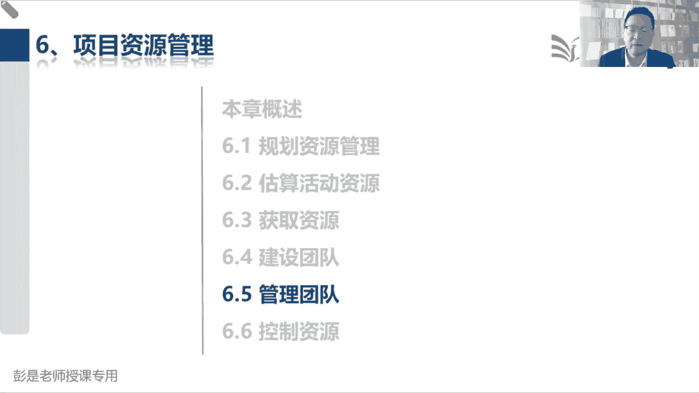
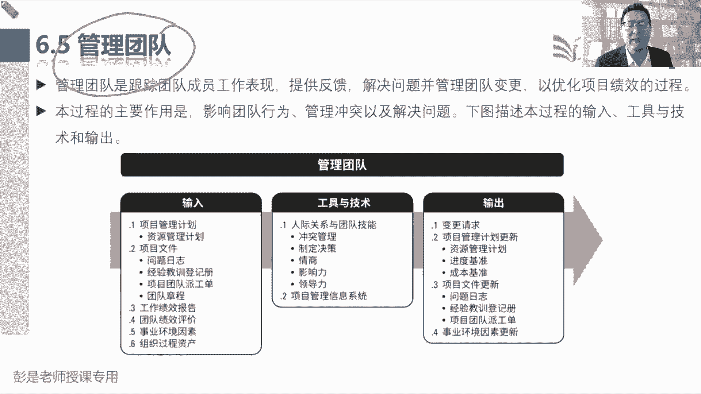
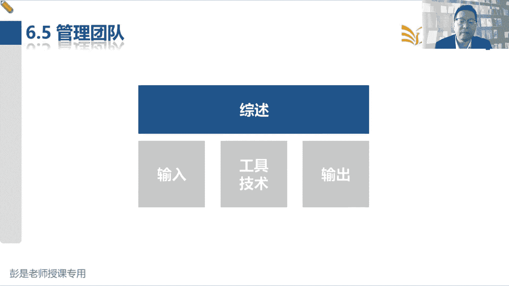
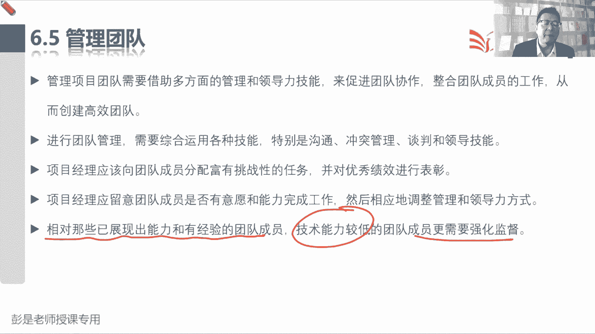
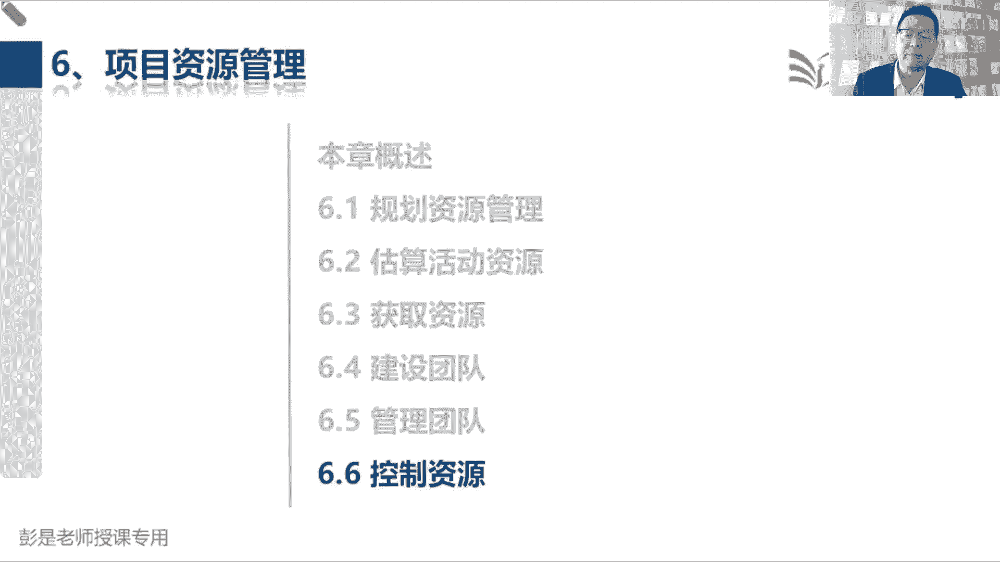

# 2024年最新版PMP考试第七版零基础一次通过项目管理认证 - P48：2.6.5 管理团队 - 慧翔天地 - BV1qC411E7Mw

那6。5管理团队这个管理过程。

在执行过程组就两个单词，一个叫问题，一个叫冲突，解决问题，处理冲突问题就是人能力能力的问题对吧，态度的问题，水平的问题，能力啊，能力不行啊，水平不行啊，该培训的培训，该指导的指导，该帮助的帮助。

态度问题呢就言传身教，实在不行，伤风败，伤风败俗，违法违法乱纪，该辞退的辞退，所以可能做出一些人事上的调整，可能做出一些人事上的调整，像什么培训啊，换岗啊，离职啊，辞退啊，斩立决啊。

这都是叫变更请求要走变更的，对不对，计划外的东西啊，然后管理冲突呢，后面我们讲工具的时候再单独说啊，冲突管理它主要考什么情况下，应该采用什么样的冲突管理的策略，所以这个管理过程。

它的输入输出工具没啥需要背的，只要大概记住这个管理过程主要工作是啥，记住那个中心思想，就是能力不行，培训治病救人，本着治病救人的原则，能培训呢就培训，能指导的就指导，能辅导的就辅导，能帮助的就帮助。

请你不要放手，请你不要放手啊，因为一放手，一旦人事上有了变化。

结合到我们刚才掌握的知识点，团队会发生什么样的变化呢，一旦人事上有了变化，团队可能回去重新形成震荡，并且也有可能走不出来，就这个道理吧，所以刚才说这个替代资源也是变更啊。

这种变更啊尽量的尽量的能能不变就不变，对能力不行，水平不行，技能不行，咱还可以培训，但是呢他可以很好的和团队成员之间相互信任，相互包容，相互协作，这不也可以吗，对态度不行，违法乱纪，道德败坏，伤风败俗。

这就不能忍了啊，对对该斩立决的还要斩立决，所以尽量的不要变，知道这个中心思想就够了好。

所以再往下看后面的文字，说管理团队需要借助多方面的管理和领导力，技能来促进团队协作，整合团队成员的工作，创建高效团队，我们需要利用各种技能和沟通啊，冲突管理啊，谈判啊，领导啊，总之想办法让大家。

让大家走向成熟，排除掉我们走向成熟路上的各种障碍，对不对，什么互相不信任啊，然后没有团队意识啊，能力不行，水平不行，以此类推啊，所以，我们应该留意团队成员是否有意愿和能力，完成工作。

然后相应的调整管理和领导力方式，对刚才说的那个大道理吧，该帮的帮，该培训的培训，对不对，如果能力够了，不该管的也不要管，通常来说，对于新手啊，还是尽量的多给予指导，对于这些老手呢，适当的适当的就放手。

不要操那个心了，因为人家成熟，人家人家能力强，没必要过多的干预，就是这个道理啊，所以就有了后面这个结论，相对于那些已经展现出能力和有经验的成员，技术能力较低的人，可能更需要强化监督。

好输入没东西了，然后输出变更请求，就看看最后这一行就完事了，不管什么样的原因，我们可以可能会发生人事上的调整，人事上的变动，包括转派人员的外包工作呀，替换离职人员的，总之人的变化，人的变化都走变更。

实施整体变更控制，做综合分析。

