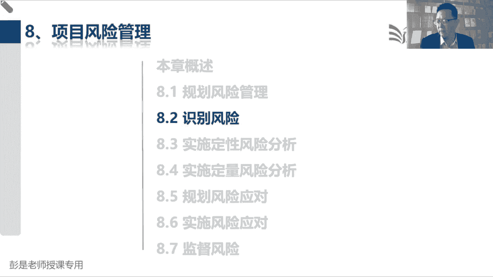
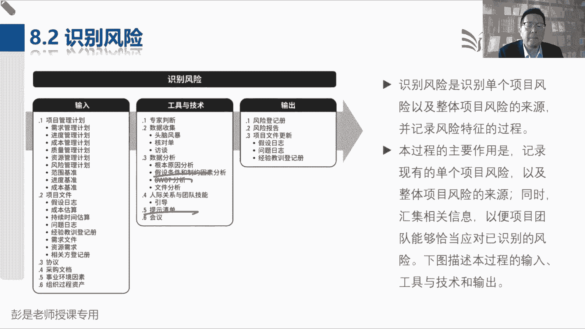
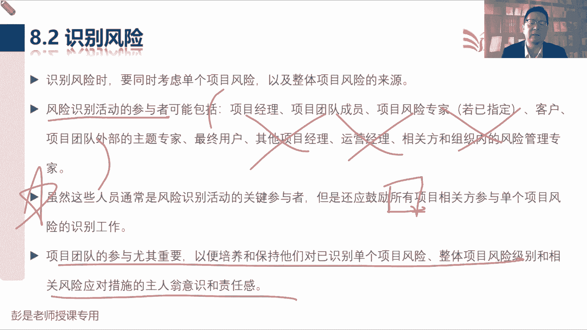
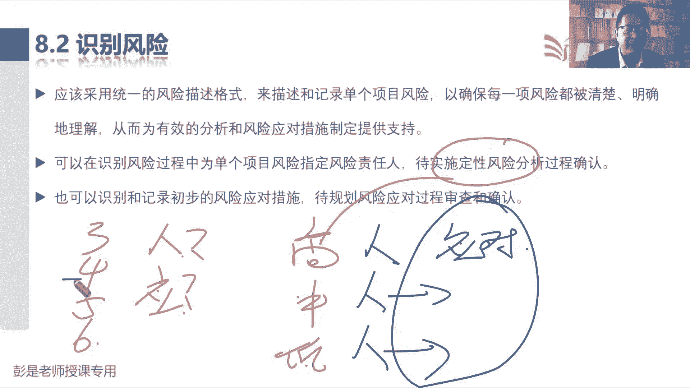
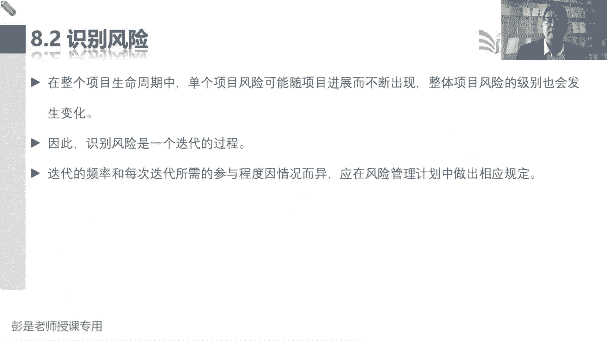
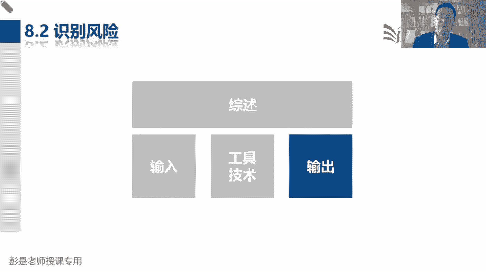
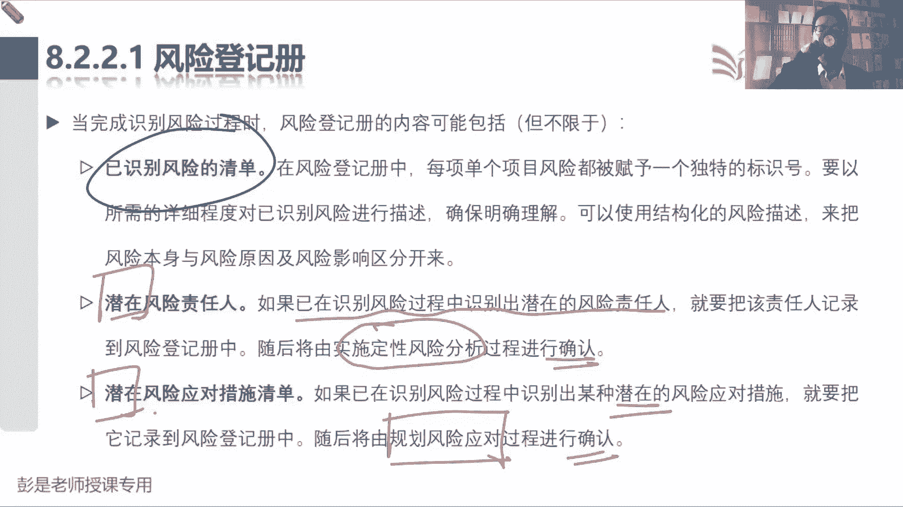
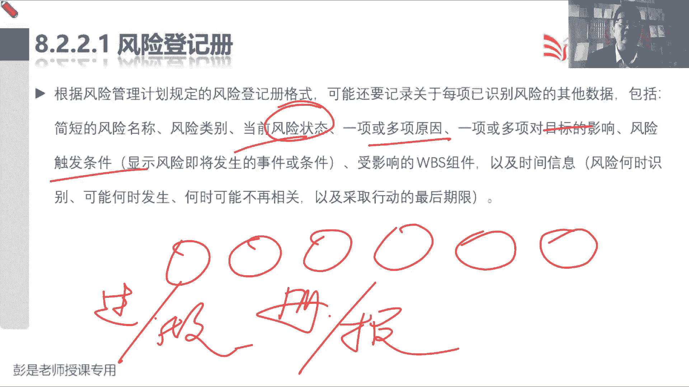
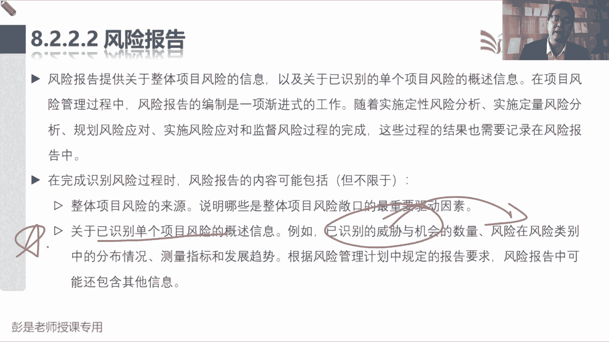
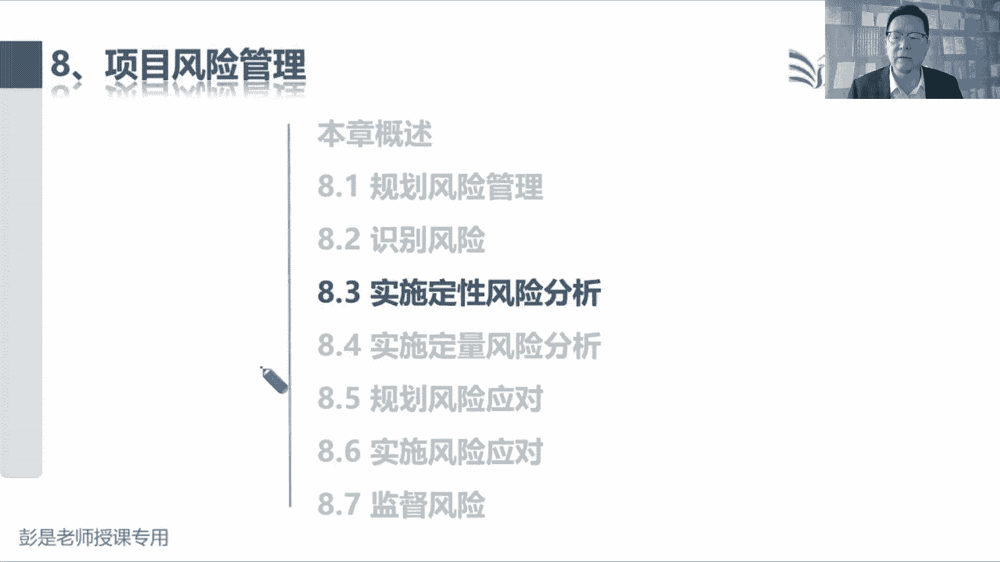

# 2024年最新版PMP考试第七版零基础一次通过项目管理认证 - P51：2.8.2 识别风险 - 慧翔天地 - BV1qC411E7Mw

好接下来8。2识别风险，找风险找风险，他的收入根本就不用记，所有所有的计划，所有的文件，甚至包括商城啊，协议啊，商业文件啊，都可以作为识别风险的输入，因为我们要去看看这些文件里面有没有写的。

什么模糊不清啊，模棱两可啊，前后矛盾对吧，文档之间内容不一致，这都意味着风险，这个方法就叫文件分析，文件分析就是看文件诶，这不用记啊，那这个管理过程输出，这是没得商量的，一个是单个风险记录到风险登记册。

整体风险呢记录到风险报告，那接下来到底怎么找风险，它的工具技术还是值得，有些东西值得大家去记的，一个一个搞定，专家判断没啥说的，头脑风暴没啥说的，核对单，在学校能反应过来核对单核对查。

我们第一次见到他是制定项目管理计划，是说来核对计划的正确性完整性，看看这些计划都写完了没有，审批了没有，确认了没有，那现在我们识别风险，用核对单来核对什么呢，现在我们在识别风险还没到解决没解决呢。

还没到发生没发生呢还没到啊，所以理解不对的同学就需要稍稍记，印象深一点了吧，他核对单核对的是什么呢，历史信息，看看差不多的项目，找一个类似的项目，看看人家出现过的风险，咱这个项目上都有没有。

他是以史为鉴，他是干这个事的，这个需要稍稍印象深一点哈，它不是用来核对我们现在找到的风险，正确不正确，完整不完整，这没有办法核对啊，它是通过我们的组织过程资产找一个历史项目。

把人家历史项目上出现过的风险逐项核对，看看咱项目上有没有干这个事了，好这稍稍有一丢丢印象哈，啊啊风险清单的是对我们识别风险形成启发，它不是一回事不是一回事啊，能能能听懂吗。

就不要把这个玩意儿学学学学学习全顶了，组织过程资产历史项目这四个字能听懂吧，那RBS是历史项目吗，不是啊，它是风险的分类，它是风险的分类，所以变成大白话，张三上次传染新冠，就是因为不这么说，换个场景。

张三上次考试没通过不及格，张三上次考试没及格，就是因为不看书，不听课，不做题，那现在咱来核对一下我自己看书了吗，我自己有没有听课的问题呢，我自己有没有做题的问题呢，来找风险，它是来源于历史的积累。

历史的沉淀，人家吃一堑长一智，犯过的错误，RBS是什么呢，风险的分类它不是一回事啊，对不对，都有哪些方面的风险，千万不要混了，都叫识别风险，但你把知识点混到一起，这肯定不对了。

所以这个单词稍稍有一点点印象啊，那再往下访谈，没啥说的，根本原因分析，这稍稍有一丢丢印象，为什么呢，因为每一个风险，每一个风险都有四个要素叫事件，风险时一旦发生，会对项目目标产生影响的。

不确定的事件或条件事件，那既然不确定，既然不确定，一定要想一想，刨根问底啊，为什么，所以通常我们需要对风险开展根本原因，原己为什么存在着这样的不确定因素，看看能不能从源头上扼杀掉这个风险。

然后除了事件和原因呢，还要分析每个风险发生的可能性，和对项目目标产生的影响，这是一个风险的基本的四个重要的元素，事件原因概率影响好，所以根本原因分析能听懂，OK了，不用去记。

那接下来需要记住的工具就出来了，第一个呢叫假设条件和制约因素分析，第二个呢是sword s w o t分析，第三个呢就是提示清单，它是识别风险的不同方法，假设条件制约因素。

这两个玩意儿还在写在哪个文档里，还有印象吗，说在这整个项目期间，我们可能随时发现一些，主观上认为成立的是验货条件，可能随时会发现一些现实情况，这个东西我们需要把它记录到假设日志里面去，假设日志啊。

那现在假设条件制约因素分析分析的是什么呢，假设条件他万一不成立，意味着危险，假设条件它是我们主观上认为他成立的事情，是天或条件，如果不成立啊，可能意味着威胁对吧，比如我们公司还没发，还没发放假通知呢。

那我到底哪天买票啊，唉现在条件不明啊，条件不明难以决策，所以我要给出一个假设条件，假设公司正常放假，我就把票买了，那万一这个假设不成立，这不就威胁吗，所以我们要去分析假设会不会导致一些威胁。

那制约因素是什么呢，是对我们工作的限制和约束，看看能不能把这个限制条件给它去掉，去掉以后啊，可能会带来一些机会，就像现在不需要扫码登记了，不需要做核酸了，不需要捅嗓子了，这些限制条件去掉了。

就节省了人财物，这就带来的机会，让大家心情愉悦，这个意思啊，这是需要单独记的，然后SWOT分析呢，sword分析啊，就四个单词分析咱公司有啥优势，优势会带来机会再去分析啊，咱有什么劣势啊。

劣势可能会导致负面影响，带来威胁，这就是优势劣势机会威胁分析，这个要记住，其他管理过程用不上，最后提示清单不解释了，这是刚才我们说过RBS最底层找到这些风险，看看我们有没有这一类的风险，法律啊，天气啊。

环境啊，以此类推了，对我们识别风险能够形成启发，形成提示好，这是至少至少这三个需要印象深。

那再往下了啊，说识别风险时，我们同时要考虑单个项目风险，以及整体项目的风险来源，然后呢，风险识别活动的参与者可能包括爱谁谁爱谁谁，爱谁谁，根本就不重要，但是这句话要记住啊。

虽然这些人通常是风险识别活动的关键参与者，但是我们还应该鼓励所有项目相关方，参与单个项目风险的识别工作，因为没有人能有把握对吧，说我能把所有的风险都给识别到位啊，这不现实，这不科学。

所以就是最好最好全员参与，后面这句话就见了好几遍了吧，不见了，成员参与计划的制定，能够让计划具有更好的可行性，成员参与了就有了责任。

责任感，主观能动性，往下找找找找找，找到这一小句话，就带出来这个管理过程和后面这些管理，管理过程的逻辑关系啊，我们也可以在识别风险过程中，为单个项目风险指定风险责任人，然后贷实施定性风险分析过程确认。

所以他想说什么意思呢，现在我们啊可以啊，给他弄一个初步的风险责任人，也就称之为潜在的潜在的，也就意味着现在还不太确定，等到定性风险分析，我们再确定最终的风险责任到底是谁啊，这个道理啊。

再结合到新冠疫情想一想，我们发现了一个风险人群张三，然后呢，这张三啊，他的责任人到底是谁呢，有可能是疾控中心，也有可能归街道管，也有可能居家隔离，照顾好自己，不知道不知道，现在还不确定。

所以我们只能给出一个潜在的风险责任人，那什么时候确定呢，这是一看看张三到底是高风险人群，中风险人群还是低风险人群，定性风险分析，对风险排定优先级，等我们开展完定性风险分析，一旦发现假如张三是高风险人群。

那么我们就能确定最终的风险责任人了，可能归疾控中心管，如果张三是中风险人群，我们可能归街道管对吧，上门磁居家监测，如果张三是低风险人群，可能照顾好他自己就可以了，归自己管。

所以等到定性风险分析排完序之后，知道了这个风险的优先级重要程度，我们才能确定最终的风险责任人到底是谁，这句话就是这个意思啊，那一个道理，我们现在也可以识别和记录，初步的风险应对措施。

这个应对措施啊还不确定，等到规划风险应对这个管理过程来确认，最终的应对措施，还是那个逻辑，现在可能需要张三集中隔离，但是呢不确定，等到咱等到咱对风险排完序，知道张三到底是高风险中风险。

低风险才能敲定最终的应对措施，高风险集中隔离，中风险居家监测，低风险，照顾好自己，满大街溜达，就这意思啊，好所以他其实这段文字啊没有描述清楚的，最后一个知识点是什么呢，风险责任人来完成应对措施的规划。

吉鸿中心集中隔离，这个措施是他规划，他管对不对，街道到底要不要上门词啊，怎么上门子啊，诶他来规划应对措施，那咱自己照顾好自己，咱就自己给自己规划好应对措施就可以了，所以风险责任人负风险责任人。

负责应对措施的规划和执行，这么一说，就想一想刚才那个场景就通了，发现张三李四王五赵六四个风险人群，可以呢，给出初步的风险责任人和初步的应对措施，但是呢这两个东西啊，现在还不确定我们需要开展完。

我们需要开展完定性风险分析，知道了这四个人啊，到底谁是高风险，谁是中风险，谁是低风险，知道了这四个人的风险优先级，我们就能够敲定他最终的责任人了，归卫健委，归街道，归自己，敲定责任人之后。

由责任人完成风险应对措施的规划和执行，风险责任人主要负责干这个事儿，就变成了最终确定的风险应对措施，就想想一想这个场景。

就把这几个管理过程讲完了好，那再往下这个管理过程输入没有啥解释的了。

就是看这些文件里面。

有没有什么乱七八糟的风险点，然后呢输出风险登记册就找到它的主要内容。

就是刚才给大家费了半天，最适合说的这三个东西，已识别的风险清单，然后呢给两个潜在的，也就是不确定的，一个是潜在的风险责任人，一个是潜在的风险应对措施，如果在已识别风险过程中，识别出潜在的风险责任人。

那么我们把它记到风险登记册，随后等到定性风险分析过程，再确定最终的责任人到底是谁，现在我们可以给出一些潜在的风险应对措施，等到规划风险应对，这个管理层再确认最终的应对措施。

搞定，然后后面风险登记册，后面这部分文字啊，大家其实不太需要去背背下来啊，等咱学完了，识别风险，定性分析，定量分析规划，风险应对，实施风险应对到最后的监督风险，就牢牢记住这些管管理过程啊，到底做什么事。

他用了什么工具，用了什么方法做了什么事情，做的事情呢，就更新到相应的登记册或者是风险报告里去了，好，所以这段文字不要求大家去把它记住，包括什么状态呀，原因啊，影响啊，条件啊。

诶这个这些单词后面会重要的东西，我会单独说的，其他都是字面意思啊，风险状态就是有没有发生啊，还是马上要发生啊，还是风险已经过时了，比如现在现在啊开春了，天气热了，降雪概率基本上等于零了，那什么暴雪呀。

什么什么下冰雹啊，这种概率就降下去了，唉这些风险可能过时了。

这个意思吧，知道一次够了啊，那风险报告报告类的东西啊，就是整体情况，所以看看这段文字，刚才说了好几遍了，关于已识别单个项目风险的概述信息，一共找到多少风险呢，这些风险在RBS里面是怎么分布的呀。

哪儿风险多，哪儿风险少啊，给领导汇报整体情况，就这个意思，他具体的内容不要求大家记得好。

更新没什么东西，那接下来重大利好时间，现在北京时间十四十四。22，咱休息8分钟，休息到14。30。

