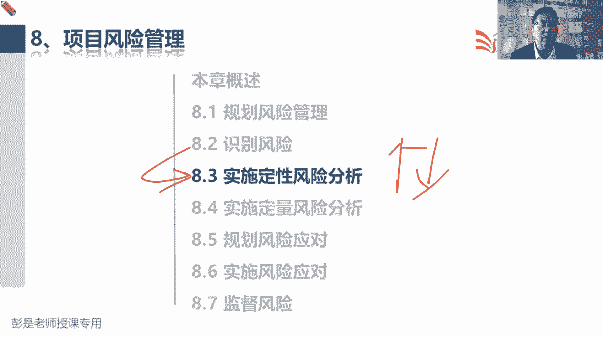
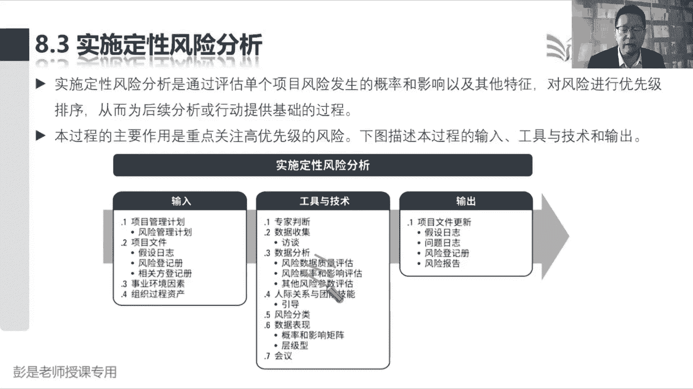
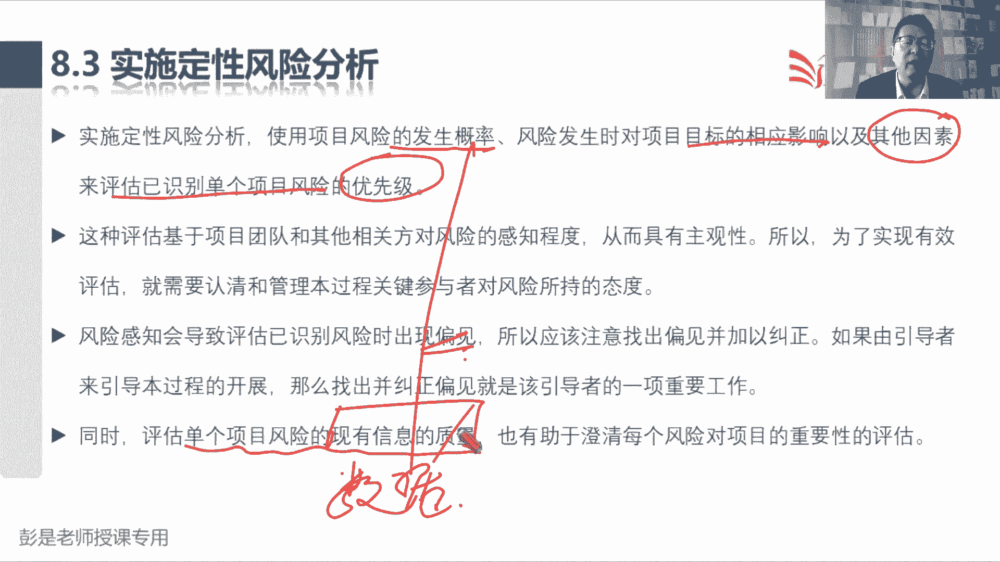
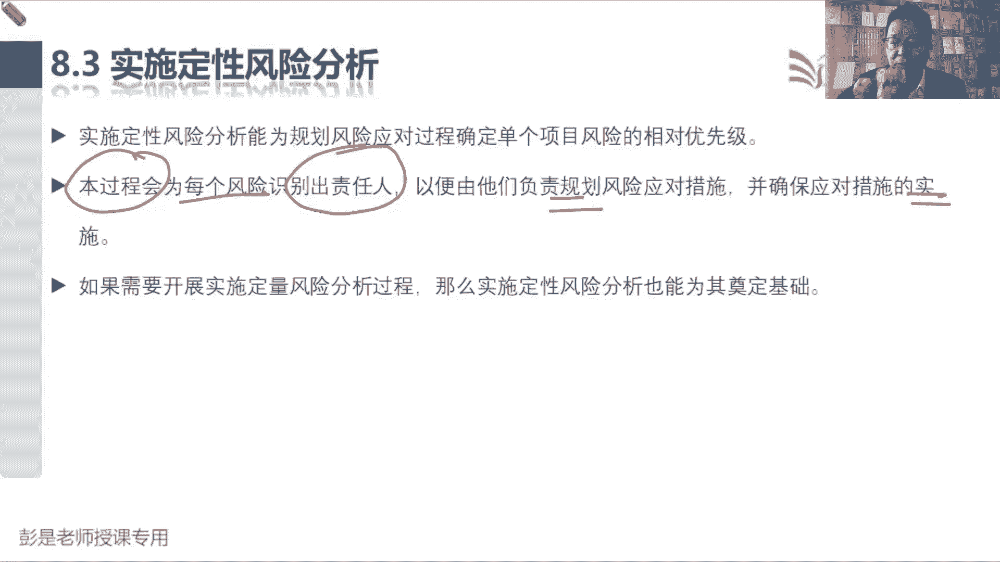
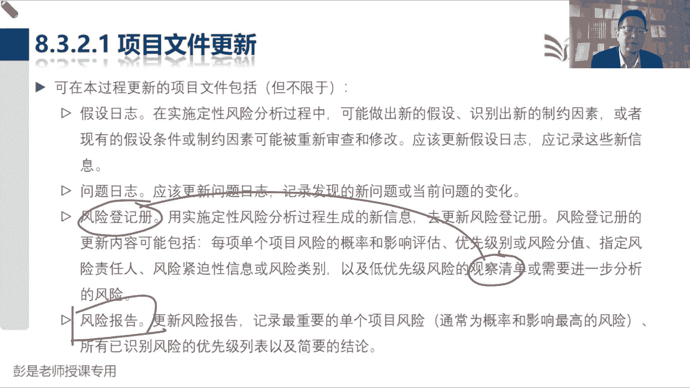

# 2024年最新版PMP考试第七版零基础一次通过项目管理认证 - P52：2.8.3 实施定性风险分析 - 慧翔天地 - BV1qC411E7Mw

好各位同学，还有一分钟时间即将开始第二小段课程，关于工具啊，大家不知道有没有看过咱教材的目录啊，等咱讲完肝吸管理单独有那么一小段，把所有的工具都列出来了，这段文字咱也一会儿后面会讲的，后面会讲的。

所以关于工具技术，大家现在听，听完了之后呢，能形成第一印象固然最好，如果记不住没关系，后面还会看到他，不是啊，不是soft的分析，是sword分析SWOT优势劣势，机会威胁，假设条件万一不成立。

意味着威胁制约因素干掉他，可能会带来机会，根据刚才的讲解，你去翻一翻工具技术那段文字就能理解了，好那再往下了啊，定性风险分析，找风险，找风险，找到风险之后，我们要对找到的风险做排序。

所以这个管理过程主要是还是学工具，关注怎么排序。

关注排序的方法，所以它的工具技术，它的输入输出没有什么太多东西啊，它的工具技术啊，按照这个逻辑四步走这个序就排好了，第一步先做风险的概率和影响评估，概率呢是分析这个东西发生的可能性，影响是看后果。

这两个玩意儿得到了概率影响，刚才我们知道概率和影响等级呀，概率影响矩阵呢，你只要知道这个风险的概率和影响，就可以在等级里，在矩阵里找到他的位置，就可以得出这个风险的优先级，但是还没够，还没完啊。

知道了概率影响了，第二步呢做风险数据质量评估，数据质量，数据质量啊，就是看啊我们得到的概率和影响，这两个数字可靠不可靠，比如说我发现了一个风险，我跟老板说呀，张三同学90%的可能性会离职，张三一离职啊。

这事儿没人干，那可能导致我们工期延误一周两周三周四周，这就是概率会影响，那老板肯定会问，那你凭什么说张三，90%的可能性会离职了，诶这是师出有名啊，做事情不能靠主观，要有客观的依据。

所以数据质量评估就是评估哎，你说的九九十%这个数据怎么出来的，他到底有没有有病哦，你的主观偏见对吧，有没有你的主观倾向，还是说你来源于客观的事实，这是大家，比如说降水概率90%。

中央气象台发布的天气预报比，相对来说比较靠谱啊，就是这个道理，所以我们要评估风险的数据质量，张三每天一上班，一上班就把什么拉钩啊，猎聘啊，boss直聘啊，刷了个遍的，还偷偷摸摸的去外面打电话。

总听人听他说什么面试诶，这个数据就相对来说可靠性有所增强，这意思好，所以第一步，我们评估每个风险发生的概率和影响，第二步我们看看得到的数据可靠不可靠，这个概率这个数据可靠吗。

这个影响是不是是不是真实的呀，这两第二个这两步做完了之后，接下来我们查询刚才做好的概率和影响矩阵，查询每一个风险在矩阵里的位置，就可以得到风险的优先级，这就是第三步，刚才见过这张图，见过那张那张图。

中间深色地区高风险浅一点，颜色中风险，白色地区低风险，查询每一个风险在这个地图里的位置，就可以得到风险的优先级，得到风险的优先级之后啊，还没完，最后一步是什么呢，叫其他风险参数评估，我们还要考虑啊。

其他特征和那个多标准决策分析异曲同工，只看概率和影响，可能不一定客观，我们还要考虑很多其他因素，比如说大家最好理解的就是这个东西叫紧迫性，紧迫性，比如说啊张三90%的可能性会离职，但是张三跟你说呀。

我5年以后再离职，那李四啊80%的可能性会离职，并且呢他跟你说，我下周就离职，一个离得近，离得离得远，离得远的东西啊，虽然看起来优先级挺高，但是太遥远了，不着急呀，这样的风险我们可能把它优先级降一降。

5年以后公司还在不在，都是回事了，这低风险，但是李四下周下周就离职，这事儿啊，很着急啊，所以我们可能把他优先级往上调一调，这样对优先级做调整的目的，是让我们得到得到的优先级排序结果更靠谱。

这是大概这四个步骤，第一评估每一个风险发生的概率会影响，第二平均看看这个数据可靠不可靠，第三步查询风险在矩阵里的位置，得到风险的优先级，最后考虑到其他风险参数，得到最终的排序结果。

然后呢把刚才做了什么事就更新到风险登记册，概率影响数据质量，其他风险参数，风险风险的级别，时钟啊，招啊低啊，以此类推，单个风险的概率影响什么数据质量啊，还有排序结果更新到风险登记册。

风险报告呢就是对整体情况做更新，对吧，一共有多少个高风险，一共有多少个中风险，一共有多少个低风险，对整体情况做更新，这就是这个管理过程主要工作，所以记住这四个步骤啊，概率影响评估，数据质量。

评估其他风险参数评估和概率影响矩阵，然后那个风险分类虽然作为工具，它主要就是更新我们的报告，做进一步的统计和分析，这是RBS，然后再往下这个层级型，稍稍有一丢丢印象就够了。

层级型未来我们学到那个工具的时候，会说这个玩意儿它另外一个名字超好记，就叫气泡图，气气球的空气的气泡泡的泡气泡图，气泡图，大家随便想成语啊，这这想场景气泡图，气泡图它其实就是用气泡大小来告诉我们。

这个风险吓人不吓人，所以就像大家拍片一样，今天做了个彩超，发现身体身体里有个泡泡，这个泡泡越大越吓人，就这意思，它通过气泡的大小来体现这个风险的重要性，优先级越大越吓人，这是层级型。

把它变成这种图形化的展示，好了解就够了啊，最核心的四个步骤，肯定记住数据质量，概率影响其他风险参数和概率影响矩阵好。

这个管理课程下班了，所以第一句话告诉我们这个管理过程怎么工作，第一我们使用项目风险发生的概率和，风险发生时对我们目标产生的影响，概率影响评估，除了这两个东西呢，还要考虑其他因素，比如说紧迫性来评估。

以识别单个风险的优先级，好中间这一段呢一直在说吧，大家关于风险的认知是有自己的主观倾向的，所以我们要想办法消除各种各样的偏见，因为有的人认为是风险，有的人认为不是风险，就像过马路要不要遵守交通规则。

唉有的人觉得闯红灯没关系对吧，骑电动车，骑摩托车要不要戴头盔，有的人有的人就比较保守，有的人呢就觉得无所谓，我们要想办法消除这种偏见，然后最后这句话说，同时评估单个项目风险，现有信息的质量。

也有助于澄清每个风险对项目的重要性的评估，就是刚才说过的数据的质量评估，看看得到的这一堆数据可靠不可靠。

这叫数据质量嗯，再往下就是刚才又说过的一个小细节，说我们这个管理过程，最终根据排序结果，会给每个风险识别出风险责任人，书上既然明确给出一个角色，就一定要记住了啊，那风险责任人他的主要工作是什么呢。

以便由他们负责规划风险应对措施，并确保应对措施的实施执行，这是违建委疾控中心街道社区，他们就是风险责任人，他们来规划应对措施都有哪些措施，并且确保这些措施能够有效地执行，有效的落地。

搞定，那么这个管理过程输入没啥记得输出，这个管理过程对每个风险做排序，所以这段还是值得大家看的，看的目的是更好的回顾一下刚才那几个工具，我们要评估每个风险的概率和影响，对不对，然后呢我们要考虑其他参数。

什么紧迫性啊，临近性啊，来对风险做更靠谱的排序，然后呢我们还要统计高风险有多少，低风险有多少，把这个风险分分类，另外呢什么叫优先级呢，这是高中低，这知道了吧，什么叫风险分值呢，就是用概率乘以影响。

以便于在两个或者多个风险之间做相对排序，那我们这个过程还会给每个风险，指定风险责任人，由他由他来完成应对措施的规划，那最后就来了一个新的术语，叫这个以及低风险，低风险的观察清单，这里面要注意了。

第一优先级风险的观察清单，它不是一个单独的文件，它仍然包括在风险登记册之中，所以其实就是我们这个风险登记册呀，找到了一大堆的风险人群，然后把低风险的给他标记一下，待观察观察再观察。

就像疫情期间监控低风险人群，待观察位，看看这些风险会不会发生变化好，所以这个术语要掌握，但是它不是一个单独的输出啊，它是包括在风险登记册之中的，就是标杆状态，那最后风险报告没什么东西了。

就是对对我们找到的风险排序和排序后的结果。

