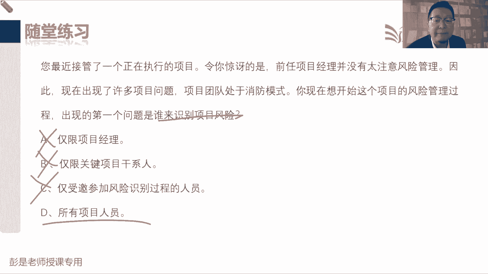

# 2024年最新版PMP考试第七版零基础一次通过项目管理认证 - P56：2.8.7 监督风险 - 慧翔天地 - BV1qC411E7Mw

那8。7监督风险，监督风险啊，主要是两件事啊，质量这一章我们学完了之后，知道了一个东西叫质量审计，质量审计主要关注的是过程的质量，看看合规不合规，那风险也是这个道理。

风险审计审计的对象就是看看风险管理的过程，到位不到位，发现缺陷差距不足，发现一些最最佳实践，形成经验教训，进行过程的改进，他的话术是一样的，记过程，那除了记过程，我们还要看结果呀。

所以它的结果就藏在会议里了，这叫什么会呢，叫风险的说记过程，什么结果呀查，所以他叫审查会，审查会，所以他叫审查会审查的是什么呢，风险的结果是什么呢，应对措施好使不好使，看看应对措施的有效性。

变成大白话就是看看戴口罩管用不管用呗，看看做核酸管用不管用呗，能不能帮助我们有效的管理控制风险，所以他是看结果，看应对措施的有效性，除了看应对措施的有效性啊，这些风险还可能会发生变化。

所以呢我们要再做一个风险再评估，风险评估，风险评估看看有没有新的风险呢，已经识别的风险，有没有已经发生的风险呢，有些风险是不是已经过时啦，过期啦，可以再把它关闭掉啊，这就叫风险再评估。

就包括在风险审查会里面两个事，第一叫看应对措施有效性，第二件事情做风险再评估啊，监督风险就下班了，那个技术绩效分析呀，什么储备分析呀，基本上不太需要刻意的去背，因为这个储备分析我们需要总结归纳就够了。

我们在规划过程组，在规划过程组估算活动持续时间，估算活动成本，制定进度计划，制定预算，这些管理过程都可能用到储备分析，为什么呢，我们在做规划的时候，要去分析需要准备多少储备，要考虑有没有一些应急储备呀。

要准备多少管理储备呀，看看有哪些已知风险，未知风险，他是分析需要准备多少，那等到了监控过程组，仍然需要通过储备分析这个方法，现在不是分析需要多少了，分析的是什么呢，储备还够不够的问题，这就是储备分析。

在规划过程组一大堆管理过程的作用，还有在监控过程组一大堆管理过程里面的作用，这记这个大结论就够了，然后技术技巧分析，纯粹的字面意思就是分析一下技术工作的技巧，不管大家从事的是什么什么类型的项目。

软件开发，有开发人员的技术绩效测试，有测试的技术技校，医生有医生的技术技巧，对不对，然后火腿肠工厂有质质检，火腿肠工厂质检有它的技术技巧，以此类推，各行各业都有一些技术工作，还是评估技术工作的工作技巧。

这不太需要去记啊，所以主要就是一个G1个茶，过来了吧，监督风险为什么需要其他工，其他工作的绩效信息呢，前面反复说了至少20遍了，听吧，绩效信息交给谁，他干啥用的，绩效信息干啥用的，再回顾那一小段课程啊。

绩效数据，绩效信息，绩效报告，好所以监督风险，后面这段文字就在说刚才这两件事情，第一记过程，第二查结果，查结果包括应对措施的有效性，然后呢再做一个风险再评估，看看风险状态是否发生变化。

这段文字还是值得看一看的，那再往下输入，没有什么新的知识点啊，然后它的输出，也没什么东西，这就是整个风险这一章，大概这几个知识点再快速回顾一下，唉就这几个事情啊，规划风险管理，找到干系人登记册。

了解大家的风险偏好，把偏好变成客观的临界值，临界时分几档就得到了概率和影响等级的定义，这个定义用起来还不太方便，我们再把它画成图，就得到了概率和影响矩阵，就是那个深颜色浅颜色那张地图，然后呢。

我们再收拾一下项目的风险分解结构，看看我们都有什么风险分类呀，高层级适合用来做统计分析，低层级一会儿去识别风险，作为提示清单，规划风险下班了，那接下来我们去识别风险，找到的单一风险记录，风险登记册。

整体风险记录到风险报告，怎么找风险呢，就用到了什么提示清单核对单呐，sword分析呀，假设条件制约因素分析呀对吧，什么访谈文件分析，用各种各样的方法找风险，找到风险之后记录下来，记录下来之后啊。

需要开展定性风险分析，因为不是所有的风险都值得我们去投入人财物，去对付它的预备，有的风险重要，有的风险不重要，那就需要排排序，所以怎么排序呢，他去分析每个风险发生的概率和影响，然后呢在做数据质量评估。

然后再查询风险在矩阵里的位置，就得到了风险的优先级，最后呢再考虑一些其他风险参数，紧迫性，临近性，各种各样的特性，来得到一个更靠谱的排序，结果做完了定性分析，定量风险分析呀，可做可不做。

并且通常小项目中等规模项目没必要，因为它需要软件专业知识，时间又会产生成本，所以通常大型复杂项目才做这个玩意儿，他怎么做呢，这是找科学家帮我们建模型，然后呢把我们项目的数据扔到模型里。

从而推导出整个项目是工期的概率分布，情况推导出整个项目成本的概率分布情况，就是那个蒙特卡洛分析，那定量风险分析之后呢，就开始规划应对措施，规划应对措施啊，就是不好的东西，我们可以回避啊，减轻啊，转移啊。

也可以上报，接受好的东西呢，我们可能开拓呀，提高呀，分享给第三方啊，然后上报啊接受，总之根据这个风险的情况，给我们要匹配出合适的应对策略，最后呢有些风险发生之前可能会有征兆，可能会有征兆啊。

所以我们要制定一些应急计划，看信号，采取应急计划，最后呢就是那些术语，什么风，万一A计划不好使，准备一个B计划弹回计划，然后执行的应对措施啊，有些风险可能还存在，这叫残余风险，执行对应对措施之后呢。

可能还会导致一些新的问题啊，这叫次生风险，都把它写到登记册里，规划风险应对，下班了，然后紧接着就是主打一个强调落实和执行，这叫实施风险应对，它在执行过程组他没什么东西吧，然后呢最后呢就是监督风险。

一个G1个查，记得是什么呢，审计我们这一大堆管理过程，什么地方做得好，什么地方做的不好，是不是符合标准，政策程序合规性，然后呢总结经验教训，进行过程的改进，那查什么呢，查呀看看你规划好的应对措施。

管用不管用，再看看识别的风险状态有没有发生变化，所以这是一个查应对措施的有效性，第二个查一下风险再评估，看看有没有新风险，有没有风险过时，有没有风险已发生，嗨，这就是监督风险这个管理过程，两个工具。

大概这一章就这么多，知识点其实不多好，接下来做做这张练习题，帮大家再巩固一下这一堆概念啊，这超简单吧，恭喜大家答对了吧，说石油价格有可能降至每桶105美元以下，有可能也也有可能不降，它存在着不确定性。

不确定阴性啊，不确定不确定因素存在着不确定性的东西，那咱就称之为他是个风险，并且呢通过阅读能够大概理解这东西，降降价将消除项目的收益，所以它对我们来说是一个，威胁负面影响就是威胁正面影响呢。

这是机会好这道题，你在使用一个RBS管理项目的风险分类，正在执行哪个过程，这道题也是个文字游戏啊，你正在使用一个RP管理项目的风险类别，你把这句话变成人话，就是说呀现在我在整理啥呢。

是对已识别的风险做分类，还是说我在梳理项目都有哪些类别的风险，这可不是一回事啊，管理项目的风险类别，我现在管理的对象是类别，所以就是在整理RP啊，对不对，所以呢答案是A规划风险管理这个管理过程。

去分析我这个项目都涉及到哪些分类的风险，这就是A2，而不是识别风险，定性分析，对已经识别的风险做分类，看清楚这个小小文字游戏，好那再往下了啊，这道题以下哪一个用来监督低优先级风险，这简单吧。

定性风险分析，对找到的每个风险做排序，排序之后呢，这些不太重要的东西啊，做个标记啊，待观察呀，诶这是观察清单，对吧，就像疫情期间有的有的有的门口，公司门口设个小房间，发现有人不对劲了。

给你扔进去观察观察，看看一会儿体温升高还是恢复正常诶，待观察，好这道题呢，说要弄个电影院，什么消除隐患，对于这个项目，我们应该在什么时候计划风险识别活动呢，看他其实考的就是书上的一句话呀。

在整个项目期间，迭代开展，反复开展，持续开展，所以呢这是B嗯，最后答案结论就是看情况，根据项目的情况分析做这方面的规划啊，所以答案就是BC不一定，贯穿始终知道这个意思，这道题由一个风险。

留一个风险应对策略导致的风险称之为啥，这家里边可能会着火，然后采取应对措施，采取应对措施对吧，把家具都换成钢的，把家具都换成钢的，把天然气给他堵死，就会带来一系列新的问题，对一个叫旧风险，一个叫新风险。

所以呢这道题答案是B导致的新风险，称之为自身风险，项目风险管理的主要输出是什么呢，项目风险管理是我们这个知识领域，他们这个知识领域主要输出小本本啊，规划风险，出风险管理计划。

然后呢从识别风险一直到最后的监督风险，整个这六个过程，都在围绕着这两个玩意儿开展工作，一个叫风险登记册，一个叫风险报告，所以相对来说比较重要的输出就是这个了，小本本发现啥记录啥，发现风险及风险，登记册。

发现问题及问题，日志发现假设条件制约因素，即假设日志发现变更请求即变更日志，发现经验教训及经验教训，登记册发现需求及需求文件，以此类推好，所以正确答案是第四个啊，不是AA只是一方面。

不是我们这个知识领域的主要输出，知识领域，就是说这一大堆管理过程，这个简单了，管理储备和应急储备有什么区别，这个简单吧，管理储备用来针对未知的风险，应急储备用来应对已知的风险，所以呢恭喜大家答对了。

答案就是B，好这题这题好猜吧，项目经理需要多久和团队讨论一次风险呢，风险无处不在，随时可能要聊一聊风险，这比一道好菜啊，A不确定，B不确定，C不确定，那每次重大会议上都要讨论风险。

这是相对来说最合适的了，送分题好，以下哪一项不在风险登记册之中，什么东西不在风险登记册里呢，识别风险的时候，把风险是啥写进去，潜在的责任人，潜在的应对措施写进去，然后前面也说过吧。

每个风险呢我们都要分析原因啊，看看是什么原因导致的这种不确定因素啊，看看能不能能不能从源头上扼杀掉它，所以原因也要写到写到里面去，定性风险，分析师评估每个风险发生的概率影响，还有其他属性来对风险做排序。

所以呢概率影响其他参数写进去，排序排序结果你不得写进去吗，高风险中风险，低风险，规划好规划，风险应对应对措施，应对策略写进去，需要的时间，钱写进去，对不对，还要写什么呢，就是啊那四个单词啊。

有没有什么征兆啊，应急计划，然后有没有什么第二套方案呢，弹回计划，然后旧风险还有没有啊，残余风险有没有可能导致新风险，哪次生风险该把术语写进去，实施风险应对就是什么时间执行了没有啊，诶他执行结果写进去。

这好菜啊，监督风险呢就是看风险的状态有没有发生变化，应对措施好使不好使，写进去，所以就是随着这些管理过程的开展，不断的更新风险能力特和风险报告，所以答案是什么呢，D概率会影响矩阵。

记住带矩阵就不是一回事儿了吧，如果说概率和影响，这是对的，但是概率和影响矩阵就是刚才见过的那张图，中间颜色深，然后浅一浅，然后白色，这是我们定性风险分析的工具，规划风险管理的输出，哎所以答案是D。

如果没有矩阵两个字就可以了，概率和影响肯定在风险登记册里，好这道题呢，这道题也简单啊，问题不大吧，54321，恭喜大家答对了，下面哪一个是项目的风险分层，想显示这是高层级的风险分类都有啥。

然后它下面又有什么低层级的风险分类，以此类推啊，这就是风险分解结构，就是DRPS，好关于风险管理，以下哪一种说法不正确，这是对的，这是对的，这是对的，A欠妥，我们最理想的模式啊。

是全体成员参与到识别风险的过程之中，全员参与计划的制定，才能够让我们计划具有更好的可行性，对不对好，所以A不正确，这道题，选啥的都有了，有选A的，有选C的，有选D的，这道题啊要这么去分析了。

开始有深度了，好还有选B的说呀，你正在管理一个项目，来履行一个军方合作，你的项目团队已经组建工作已经开始，你的政府项目官员通知你，你依赖的一个供应商，没有拿到提供一个关键部件的合同。

然后你查阅了风险登记册，发现没有对此做出计划处理，这种情况的最佳做法是什么呢，首先咱先讲个大背景啊，到底啥是风险呢，实际上它的本质就是一些不确定的问题，哒哒哒，对不对，风险一旦发生，会对项目产生影响。

产生影响不就是问题吗，但是呢它有可能发生，有可能不发生，或者在某些方面存在的变数，所以它就是一个不确定性的问题，那问题是什么呢，问题就是确定的，那现在读完这道题，通过题目描述能不能发现一些不确定因素呢。

不能为什么呢，题目告诉你没有拿到一个合同，航班被取消了，这是确定的，所以呢他是个问题，那当问题出现的时候，我们可不可以去查一下风险登记册呢，再想个小逻辑，对不对，比如说我识别风险。

我说呀这个飞机呀可能会被取消，明天航班可能会被取消，这是一个风险，但是呢收到短信，航班通航班公司通知，我亲您的风险，您的飞机航班被取消了，现在出现问题，可不可以查询一下风险登记册。

看看之前分析的那个什么措施都是啥，可以啊，完全没问题啊，可以的，出现问题，我们翻阅风险登记册，看看之前有没有把这个问题识别为风险，这是OK的，但是呢好死不死的是什么呢，题目给你把这条路堵死了。

题目说你查阅风险登记册，发现没这个东西好，所以这道题啊目前来说和风险就没关系了，因为他是出现了一个确定性的问题，并且呢翻阅了风险登记册，发现之前没有把这个问题识别为风险，那遇到问题怎么解决。

A查阅概率和影响矩阵，去死吧，它是确定的东西呀，B完成定量和定性风险分析排除掉，因为它是个确定的东西啊，C鉴于预防措施问题已经发生了，还咋预防啊，纠正还说还说得通吧，预防是防止未来工作出现的问题啊。

所以C也不对，最后呢剩下的就是D，寻找一家新的供应商来提供这个部件，好这就是相对来说找一个最合适的选项，仅此而已，后面正式考试啊，基本上都是类似于这样的题，需要分析一下，需要分析一下啊。

而不是前面这种题，这种题，比如说前面那道题，像这种题，考试基本上不大会考，太简单了，考试基本两部大会考啊，太直接了，好，所以考试考的就是，我们根据掌握的知识点去分析，去分析每一个选项的可能性。

现在题目说遇到了个问题，并且呢也不是之前使被盗的风险，所以和风险管理没关系，排除掉最合适的选项就是D，但不代表着说记住啊，只是相对来说比较合适的选项，不代表着未来遇到类似的场景都要选D，能听懂吧。

诶没错，就是ABC肯定不对，D呢是不是最优选，是不是最佳的解决方法呢，我也不知道，因为具体情况具体分析，但是他总比其他选项好，哎就是相对最优，永远找一个相对来说最合适的选项，仅此而已好。

所以这种这种考试现在基本上都是考的，大家这种分析推理的能力，那分析推理的前提条件，前提条件一定是关于知识的储备，如果关于这些知识啊，没有认知，记不住啊，或者是模棱两可呀，就很难推理出来，对不对。

可以加油加油，你们都可以做到的啊，慢慢慢慢去训练这个能力，那这道题看看，这种题都考试，基本上不大会考，因为太简单了，但是这个原则还是超重要的，全员参与好，恭喜各位同学答对了。

说你出现第一个问题是谁来识别识别风险项目，仅仅仅这就片面了，最合适的最好就是全体成员。

搞定，所以这一章中间信息量虽然多啊，工具基数虽然信息量听起来多，但实际上呢实际上呢像规划风险应对呀，包括定性风险分析呀，包括识别风险啊，就那两三个工具，看多了看多了，慢慢的就熟悉了，这一章大家就头疼。

头疼的同学不要担心，不要焦虑，不要惶恐，先搞定每个管理过程的作用，先把这个大方向大框架给他抓起来，然后工具呢再慢慢的慢慢的逐逐逐个击破，慢慢蚕食它，现在16。03。

