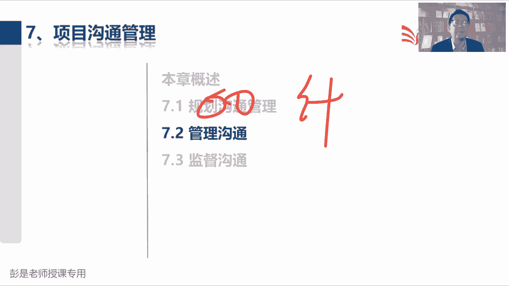
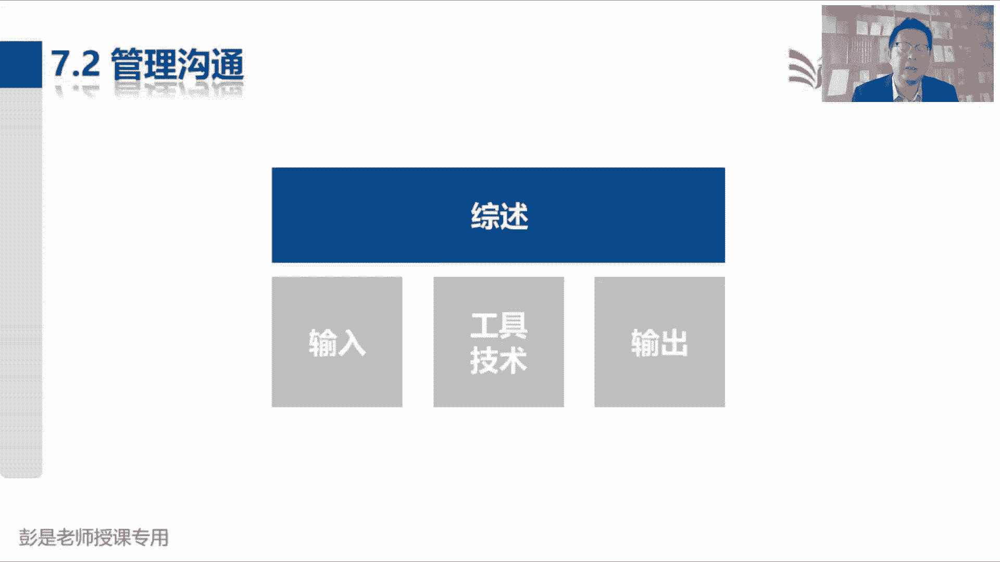
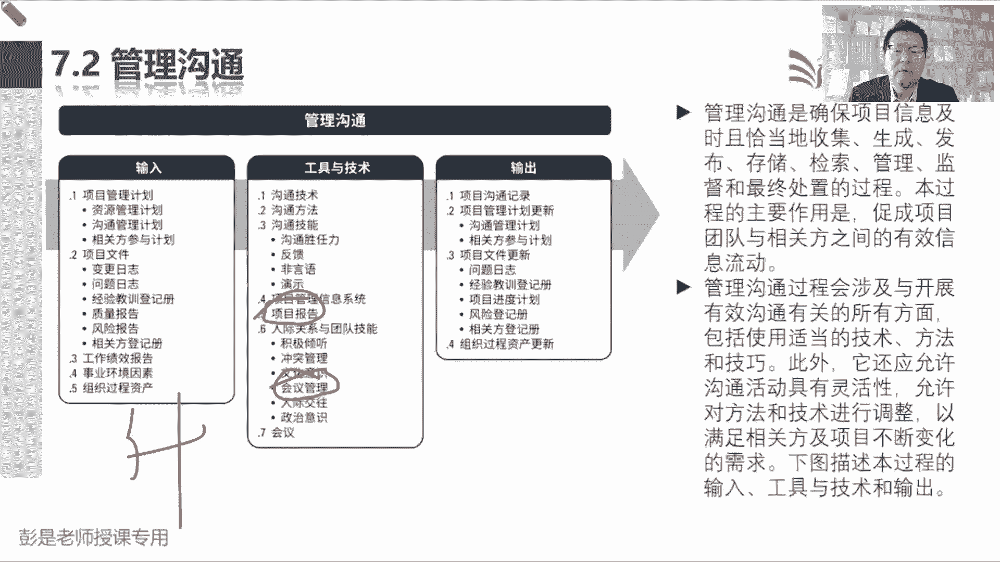
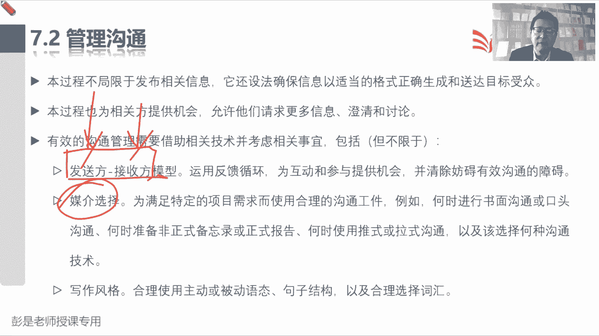
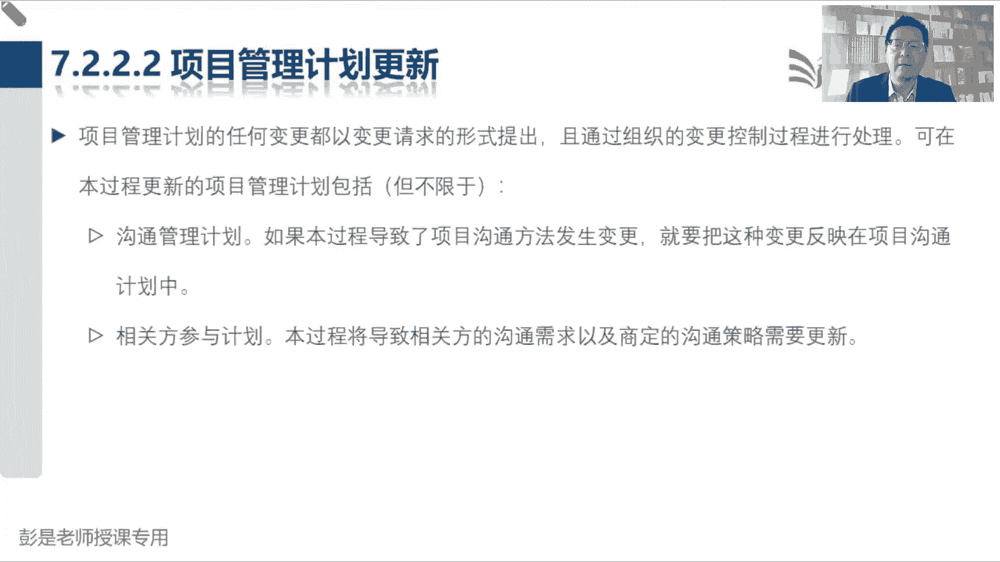

# 2024年最新版PMP考试第七版零基础一次通过项目管理认证 - P61：2.7.2 管理沟通 - 慧翔天地 - BV1qC411E7Mw

那接下来啊规划沟通管理，搞定沟通需求分析，沟通风格评估，写一个沟通的管理计划，把沟通的方方面面给他考虑好。

定出计划来，那7。2管理沟通就是按照计划去落实，去执行，输出一个沟通记录。

这个管理过程输入啊，输出啊，没什么需要去背的，再看看工具基础啊，沟通技术，沟通方法和前面那个是一样的技能，包括什么胜任力啊，反馈呀，非语言啊，演示啊，这都叫字面意思，这人能不能表达清楚啊。

这不是沟通的胜任力呢，因为有的人呢可能想的明白，说不清楚，有的人可能说的明白，写不清楚，有的人可能写的明白，说不清楚，以此类推吧，我们要知人善用啊，有的人善于演讲，有的人善于写作。

对那反馈呢就是纯粹字面意思啊，就是各位同学声音正常吗，课件正常吗，哎希望获得对方的反馈，C语言是什么呢，就是刚才我们听过的什么语气，眼神声调手势，对不对，这面部表情这种东西啊，也在传递信息。

好演示是什么玩意儿呢，现在我在课件上画了个圈圈给大家播放PPT，这不就是演示嘛，对不对，然后你买手机，人家服务员告诉你，亲这个按钮叫开机，清点那个地方就关机，以此类推啊，这是演示让你知道这个文件。

这个文档，这个成果，这个这个东西到底是个什么鬼，这就是演示好，这都不需要去背的东西啊，项目管理信息系统不解释项目报告，这看到名字容易反应不过来，那就需要单独记了，这东西怎么记呢。

看输入工作绩效报告是我们根据项目的情况，定期给老板做的汇报吧，周报月报季报还定期给老板给观点相关方，给干系人做的这种项目情况的汇总，那项目报告主打一个什么呢，临时，零食这助长强调这么个特性。

今天领导心情好，来来来办公区视察一下，咱给领导临时汇报一下项目的情况，他主打一个临时，就这个意思啊，这么去记搞定，然后下面继续听听什么冲突啊，这都没什么可解释的，其中包括会议管理，会议管理等等。

后面讲一会儿，讲工具的时候再说了，会议管理，就是大家结合日常的工作常识去思考就够了，首先会议管理，会议管理，开会要先定啥，各位同学想这个问题啊，开会开会开会先定什么呢，刚才说启动项目定定什么。

目的不着急定主题呢，不着急定议程了，对不对，细节后边再说，一定要先有方向，对不对，这个会的目的目标是什么，为什么要开这个会呢，是批斗会还是表彰会，还是沟通对还是发号施令。

以色列瓦要搞清楚这个会的目的目标是什么，为什么要开这个会，把目的目标搞清楚之后呢，再定具体的计划吧，就涉及到刚才龙飞同学说的什么主题呀，议程啊，流程啊，哎就这些具体的计划，你就把开会当做一个小项目。

这个逻辑看看是不是一样的，启动项目的时候需要明确方向，知道我们要做什么事，然后再去思考这个事儿我们怎么做，这是会议的主题，议程流程，这不就是号码，对不对，然后呢按照我们的议程流程。

看看这个会需要谁参加啊，确保这些人能够参会，在开会的过程中，什么张三不要交头接耳，李四不要睡觉，往我手机调静音呐，控制会议的节奏，这就是事中事后的是什么呢，开会要不要开，要不要写一个东西呢，会议纪要对。

要有结果呀，把我们会上讨论的结果记下来，该执行执行，该传达传达，以此类推，所以粗暴理解啊，事前事中事后，这就是会议管理三步走，事前想清楚我们这个会要开什么，为什么这么开，为什么要开这个会，对不对。

怎么开，议题是啥，议程是啥，做好这个东西的事前规划，事中呢就是开会过程中切换，适当的切换议题呀，最后呢事后要形成会议纪要，要有结果好，大概大概知道意思粗暴的这个框架知道就行了，然后像什么人际交往啊。

政治意识啊，这都没啥可解释的，那这个管理过程输出就是沟通记录，纯粹的字面意思，这东西其实也不太需要去背了，好那就话说回来，最后一总结，这个管理过程，最重要的作用就是按照计划去沟通。

但是呢工作中可能不得不临时给领导，给老板，给客户汇报一下项目的情况，然后呢开会有方法，有技巧，有套路，这样的便于便于更高效地完成这个位移，就对效率和效果，效率和效果更关注这方面的东西啊。

嗯那再往下后面就涉及到了这么一大堆东西。

说本过程不仅不局限于发布相关信息，还想想办法确保信息以适当的格式，正确的生成和送达目标受众，所以沟通到最后，再根据我们目前储备的知识再总结，就是确保啊这个信息在正确的时间，用正确的方式传递给正确的人群。

产生正确的影响，正确的时间，正确的方式，正确的人群，正确的影响就是检查才是一个有效的沟通，这意思吧，我看张三不顺眼，我想刺激刺激刺激自己的，让他发飙，让他出丑，那你要选时机对吧，还要用正确的方式。

把这个刺激他的信息传达给正确的受众，从而产产生正确的影响，这个沟通的本质就是确保沟通的效率和效果好，这不凶，不再需要去背啊，那再往下书上就提到了沟通模型，刚才给大家大概说过啊，发送方接收方模型。

谁来传递信息，他就是发送方，谁来接收信息，就叫接收方，然后呢需要运用反馈，什么反馈循环88来消除障碍，一会讲沟通模型再说了，那媒介选择呢，这是什么时候正式，这也没啥可解释的吧，像咱给大家讲课。

这干讲没有PPT，这也不行，只放PPT不说话，这也不行，要选择适当的媒介，什么时候用嘴说就可以了，什么时候需要看PPT，什么时候需要一边看一边说，以此类推，这都没什么考点啊，超好理解的工作常识。

然后什么写作风格，这都没啥可说的了，然后会议管理，这是刚才给大家说的，开会得有规矩啊，事前事中事后再把这事儿给他讲清楚，所以第一准备会议的议程，他写的其实不完整啊，准备议程之前，你要定会议的目标。

会议的目的，然后定会议的主题，定会议的议程，第二呢确保这些人能够参会，然后呢适中就是解决好什么现场发生的冲突啊，最后呢就是什么形成会议纪要，这段文字都是看一遍就够了好，然后像演示。

了解肢体语言和视觉辅助设计的作用，什么叫视觉辅助设计的，就比如说放PPT，有的字加黑加粗加颜色，这不就是视觉辅助吗，对不对，对各位同学的视觉产生冲击产生冲击，包括我现在画的画，画的方块儿，画的圆圈。

便于大家印象深，印象深究，这玩意儿好，然后什么银宝啊，这都没啥，看电脑了，这段再看一遍就可以了，那这个管理过程输入没有新的知识点，然后输出就这么一句话，也没什么需要去记的，就是你做了什么沟通。

传达了什么信息，这玩意儿要存档。

